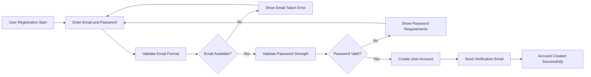
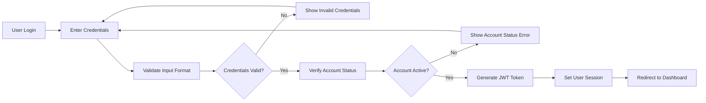
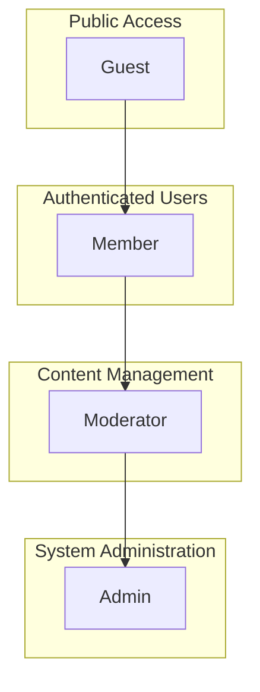

# User Roles and Authentication System

## 1. Introduction

This document defines the complete user role structure and authentication system for the Economic/Political Discussion Board platform. The system implements a robust role-based access control (RBAC) model with four distinct user roles, each with specific permissions and capabilities designed to facilitate productive economic and political discussions while maintaining content quality and system security.

## 2. User Persona Definitions

### 2.1 Guest Role
Unauthenticated users who can view public discussions and register/login to the system.

**WHEN** a guest user accesses the platform, **THE system SHALL** provide read-only access to public content.

**Guest User Capabilities:**
- **THE system SHALL** allow guest users to view public discussion topics and categories
- **WHEN** browsing discussions, **THE system SHALL** display all public comments and replies
- **THE system SHALL** provide access to user registration and login functionality
- **WHERE** search functionality is available, **THE system SHALL** allow guest users to search public content
- **THE system SHALL** enable guest users to view public user profile information

**Guest User Limitations:**
- **THE system SHALL** prevent guest users from creating new discussion topics
- **WHERE** content creation is attempted, **THE system SHALL** require authentication
- **THE system SHALL** restrict guest users from posting comments or replies
- **WHEN** voting functionality is accessed, **THE system SHALL** require user authentication
- **THE system SHALL** prevent guest users from reporting content or accessing private discussions

### 2.2 Member Role
Registered users who can create discussion topics, post comments, participate in discussions, and manage their own content.

**WHEN** a user completes registration and email verification, **THE system SHALL** assign the member role.

**Member User Capabilities:**
- **THE system SHALL** provide members with all guest user capabilities
- **WHEN** authenticated, **THE system SHALL** allow members to create new discussion topics in appropriate categories
- **THE system SHALL** enable members to post comments and replies to existing discussions
- **WHERE** content ownership applies, **THE system SHALL** allow members to edit and delete their own posts and comments
- **THE system SHALL** provide upvote/downvote functionality for discussion topics and comments
- **WHEN** inappropriate content is encountered, **THE system SHALL** allow members to report content to moderators
- **THE system SHALL** enable members to follow other users and discussions
- **WHERE** profile management is concerned, **THE system SHALL** allow members to manage personal profile information
- **THE system SHALL** provide notification systems for followed discussions
- **THE system SHALL** include members in reputation/karma systems

**Member User Limitations:**
- **THE system SHALL** prevent members from moderating other users' content
- **WHERE** administrative functions are accessed, **THE system SHALL** restrict member access
- **THE system SHALL** prevent members from banning or suspending other users
- **WHEN** category management is attempted, **THE system SHALL** restrict member permissions

### 2.3 Moderator Role
Users with content moderation permissions who can review, approve, or remove content, manage user reports, and maintain discussion quality.

**WHEN** an administrator promotes a member to moderator, **THE system SHALL** grant enhanced permissions.

**Moderator User Capabilities:**
- **THE system SHALL** provide moderators with all member user capabilities
- **WHEN** content requires moderation, **THE system SHALL** allow moderators to review and approve/reject reported content
- **THE system SHALL** enable moderators to remove inappropriate posts and comments
- **WHERE** user violations occur, **THE system SHALL** allow moderators to temporarily suspend users
- **THE system SHALL** provide access to user reports and appropriate action tools
- **WHEN** important discussions are identified, **THE system SHALL** allow moderators to pin discussions to category tops
- **WHERE** guideline violations are severe, **THE system SHALL** enable moderators to lock discussions
- **THE system SHALL** provide moderators with access to moderation dashboard and tools
- **THE system SHALL** allow moderators to view moderation history and statistics

**Moderator User Limitations:**
- **THE system SHALL** prevent moderators from performing system-level administrative functions
- **WHERE** category creation is concerned, **THE system SHALL** restrict moderator permissions
- **THE system SHALL** prevent moderators from modifying system settings
- **WHEN** permanent account deletion is required, **THE system SHALL** require administrator action

### 2.4 Administrator Role
System administrators with full access to manage users, categories, system settings, and perform administrative functions.

**WHEN** system administration is required, **THE system SHALL** provide comprehensive access to administrators.

**Administrator User Capabilities:**
- **THE system SHALL** provide administrators with all moderator user capabilities
- **WHERE** category management is required, **THE system SHALL** allow administrators to create, edit, and delete discussion categories
- **THE system SHALL** enable administrators to manage user accounts including suspension, banning, and deletion
- **WHEN** role assignments are needed, **THE system SHALL** allow administrators to assign and revoke moderator roles
- **THE system SHALL** provide access to system-wide administrative dashboard
- **WHERE** system configuration is concerned, **THE system SHALL** allow administrators to modify system settings and configurations
- **THE system SHALL** enable administrators to view system analytics and usage statistics
- **THE system SHALL** provide data export capabilities for system information
- **WHERE** system maintenance is required, **THE system SHALL** allow administrators to manage system backups and maintenance
- **THE system SHALL** enable administrators to configure content moderation rules

## 3. Role-Based Permission Matrix

| Action | Guest | Member | Moderator | Admin |
|--------|-------|--------|-----------|-------|
| View public discussions | ✅ | ✅ | ✅ | ✅ |
| Read comments | ✅ | ✅ | ✅ | ✅ |
| Register account | ✅ | ❌ | ❌ | ❌ |
| Login to system | ✅ | ❌ | ❌ | ❌ |
| Create discussion topic | ❌ | ✅ | ✅ | ✅ |
| Post comments | ❌ | ✅ | ✅ | ✅ |
| Edit own posts | ❌ | ✅ | ✅ | ✅ |
| Delete own posts | ❌ | ✅ | ✅ | ✅ |
| Upvote/downvote content | ❌ | ✅ | ✅ | ✅ |
| Report content | ❌ | ✅ | ✅ | ✅ |
| Follow users/discussions | ❌ | ✅ | ✅ | ✅ |
| Manage profile | ❌ | ✅ | ✅ | ✅ |
| Review reported content | ❌ | ❌ | ✅ | ✅ |
| Remove inappropriate content | ❌ | ❌ | ✅ | ✅ |
| Suspend users temporarily | ❌ | ❌ | ✅ | ✅ |
| Pin discussions | ❌ | ❌ | ✅ | ✅ |
| Lock discussions | ❌ | ❌ | ✅ | ✅ |
| Create/edit categories | ❌ | ❌ | ❌ | ✅ |
| Manage user accounts | ❌ | ❌ | ❌ | ✅ |
| Assign moderator roles | ❌ | ❌ | ❌ | ✅ |
| Modify system settings | ❌ | ❌ | ❌ | ✅ |
| Access admin dashboard | ❌ | ❌ | ❌ | ✅ |

## 4. Authentication Requirements

### 4.1 User Registration Flow



**Registration Business Requirements:**
- **WHEN** a user attempts to register, **THE system SHALL** validate email format and availability
- **IF** email validation fails, **THEN THE system SHALL** display appropriate error messages
- **WHEN** password validation fails, **THE system SHALL** display password strength requirements
- **THE system SHALL** require minimum password strength of 8 characters with mixed case and numbers
- **WHEN** registration succeeds, **THE system SHALL** send email verification to the user
- **THE user account SHALL** remain pending until email verification is completed

### 4.2 User Authentication Flow



**Authentication Business Requirements:**
- **WHEN** a user submits login credentials, **THE system SHALL** validate and respond within 2 seconds
- **IF** credentials are invalid, **THEN THE system SHALL** return authentication error
- **IF** account is suspended, **THEN THE system SHALL** return account status error
- **WHEN** authentication succeeds, **THE system SHALL** generate JWT tokens with user role information
- **THE JWT access token SHALL** expire after 30 minutes
- **THE JWT refresh token SHALL** expire after 7 days
- **THE system SHALL** store refresh tokens securely for session management

### 4.3 JWT Token Payload Structure

**Access Token Payload:**
```json
{
  "userId": "uuid-string",
  "role": "member|moderator|admin",
  "permissions": ["read_posts", "create_posts", "etc"],
  "iat": 1234567890,
  "exp": 1234567890
}
```

**Refresh Token Payload:**
```json
{
  "userId": "uuid-string",
  "tokenVersion": 1,
  "iat": 1234567890,
  "exp": 1234567890
}
```

**Token Management Requirements:**
- **THE system SHALL** use JWT for authentication tokens
- **THE access token SHALL** expire after 30 minutes of inactivity
- **THE refresh token SHALL** expire after 7 days of inactivity
- **THE system SHALL** provide token refresh endpoint for extending sessions
- **WHEN** token refresh fails, **THE system SHALL** require re-authentication
- **THE system SHALL** invalidate all tokens when user changes password
- **THE system SHALL** allow users to revoke all active sessions

## 5. Authorization Rules and Business Logic

### 5.1 Role Escalation Rules

**Member to Moderator Promotion:**
- **WHEN** an admin promotes a member to moderator, **THE system SHALL** update user role immediately
- **THE promoted user SHALL** receive moderator permissions upon next token refresh
- **THE system SHALL** log all role changes for audit purposes

**Moderator to Admin Promotion:**
- **WHEN** an existing admin promotes a moderator to admin, **THE system SHALL** require confirmation
- **THE system SHALL** notify all administrators of role changes
- **THE new admin SHALL** receive full system permissions immediately

### 5.2 Permission Validation Rules

**Content Creation Authorization:**
- **WHEN** a member attempts to create a discussion topic, **THE system SHALL** verify account is verified and active
- **IF** user account is suspended, **THEN THE system SHALL** prevent content creation
- **WHERE** discussion category requires special permissions, **THE system SHALL** verify user meets requirements

**Content Moderation Authorization:**
- **WHEN** a moderator reviews reported content, **THE system SHALL** provide complete content context
- **IF** content violates guidelines, **THEN THE system SHALL** allow removal with reason documentation
- **WHEN** content is removed, **THE system SHALL** notify the original author with removal reason

**Administrative Actions Authorization:**
- **WHEN** an admin performs user management actions, **THE system SHALL** require confirmation for destructive operations
- **THE system SHALL** prevent admins from deleting their own accounts
- **WHERE** user suspension exceeds 30 days, **THE system SHALL** require additional justification

### 5.3 User Session Management

**Session Security Requirements:**
- **THE system SHALL** track active sessions per user
- **WHEN** a user logs out, **THE system SHALL** invalidate all tokens immediately
- **THE system SHALL** allow users to view and revoke active sessions
- **WHERE** suspicious activity is detected, **THE system SHALL** prompt for re-authentication

**Concurrent Session Limits:**
- **THE system SHALL** allow up to 5 concurrent sessions per user
- **WHEN** session limit is exceeded, **THE system SHALL** terminate oldest session
- **WHERE** security breach is suspected, **THE system SHALL** allow forced logout of all sessions

## 6. User Role Hierarchy



**Hierarchy Business Rules:**
- **Guest role SHALL** provide baseline read-only access
- **Member role SHALL** inherit all Guest permissions plus content creation capabilities
- **Moderator role SHALL** inherit all Member permissions plus content moderation capabilities
- **Admin role SHALL** inherit all Moderator permissions plus system administration capabilities
- **Role permissions SHALL** be cumulative and non-exclusive

## 7. Security Considerations

### 7.1 Authentication Security
- **THE system SHALL** implement rate limiting on authentication endpoints
- **WHERE** multiple failed login attempts occur, **THE system SHALL** implement temporary account lockout
- **THE system SHALL** require strong password policies
- **THE system SHALL** encrypt all passwords using industry-standard hashing algorithms

### 7.2 Authorization Security
- **THE system SHALL** validate user permissions on every authenticated request
- **WHERE** permission checks fail, **THE system SHALL** return authorization error
- **THE system SHALL** log all permission denial events for security monitoring
- **THE system SHALL** implement principle of least privilege for all user roles

### 7.3 Session Security
- **THE system SHALL** implement secure token storage mechanisms
- **THE system SHALL** automatically expire inactive sessions
- **WHERE** security tokens are compromised, **THE system SHALL** provide immediate revocation capability
- **THE system SHALL** implement CSRF protection for all state-changing operations

## 8. Compliance and Privacy Requirements

### 8.1 Data Protection
- **THE system SHALL** comply with relevant data protection regulations
- **WHERE** user data is stored, **THE system SHALL** implement appropriate encryption
- **THE system SHALL** provide data export capabilities for user account information
- **THE system SHALL** implement data retention policies for user content

### 8.2 Audit Requirements
- **THE system SHALL** maintain comprehensive audit logs for all administrative actions
- **WHEN** role changes occur, **THE system SHALL** record the initiating administrator
- **WHERE** content is moderated, **THE system SHALL** preserve moderation history
- **THE system SHALL** provide audit trail for security investigations

## 9. Password Reset and Recovery

**Password Reset Flow Requirements:**
- **WHEN** a user requests password reset, **THE system SHALL** send reset link to registered email
- **THE password reset link SHALL** expire after 24 hours for security
- **WHEN** a user successfully resets password, **THE system SHALL** invalidate all existing sessions
- **IF** invalid or expired reset token is used, **THEN THE system SHALL** display error and allow new request

**Password Security Requirements:**
- **THE system SHALL** require password changes every 90 days
- **WHEN** creating new passwords, **THE system SHALL** prevent reuse of previous 5 passwords
- **THE system SHALL** implement password strength validation with minimum requirements
- **WHERE** suspicious login activity is detected, **THE system SHALL** require password reset

## 10. Account Management Rules

### 10.1 Account Creation
- **WHEN** creating new accounts, **THE system SHALL** validate email uniqueness
- **THE system SHALL** require email verification before granting full member permissions
- **WHERE** duplicate registration attempts occur, **THE system SHALL** prevent account creation
- **THE system SHALL** implement CAPTCHA or similar protection against automated registrations

### 10.2 Account Suspension and Termination
- **WHEN** users violate terms of service, **THE system SHALL** allow temporary suspension
- **WHERE** repeated violations occur, **THE system SHALL** enable permanent account termination
- **THE system SHALL** provide appeal process for suspended accounts
- **WHEN** accounts are terminated, **THE system SHALL** preserve content with anonymized authorship

### 10.3 Role Assignment and Management
- **WHEN** assigning moderator roles, **THE system SHALL** require administrator approval
- **THE system SHALL** implement role-based training requirements for moderators
- **WHERE** role performance is inadequate, **THE system SHALL** allow role revocation
- **THE system SHALL** maintain role assignment history for audit purposes

This document defines the complete user role structure and authentication system for the Economic/Political Discussion Board platform. The system implements a comprehensive role-based access control model with clear permission boundaries, robust authentication workflows, and security-focused authorization rules to ensure productive discussions while maintaining system integrity and user trust.

> *Developer Note: This document defines **business requirements only**. All technical implementations (architecture, APIs, database design, etc.) are at the discretion of the development team.*