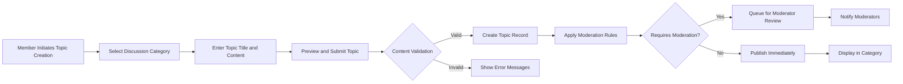
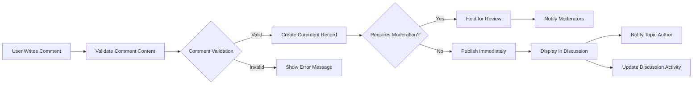
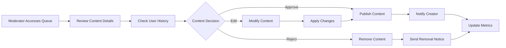

# Service Operation - Discussion Board Core Workflows

## 1. Introduction and Service Overview

This document defines the complete operational workflow of the economic/political discussion board platform. The system provides a structured environment for users to engage in meaningful discussions about economic and political topics, with robust content management and moderation capabilities.

### 1.1 Core Service Functions

The discussion board operates as a multi-layered platform where:
- Users can discover, create, and participate in discussions
- Content flows through creation, moderation, and archival processes
- User interactions drive engagement and community building
- Quality control mechanisms ensure productive discussions

### 1.2 Operational Principles

**WHEN** a user accesses the platform, **THE system SHALL** provide immediate access to public discussions while offering clear pathways for registration and authentication.

**THE system SHALL** maintain discussion quality through automated and manual moderation processes.

**WHERE** content requires moderation, **THE system SHALL** ensure timely review and appropriate action.

## 2. User Registration and Onboarding Process

### 2.1 Guest User Experience

**WHEN** a guest user visits the platform, **THE system SHALL** display:
- Public discussion categories and recent topics
- Registration and login options prominently
- Preview of discussion content with limited functionality
- Clear value proposition for joining the community

**THE system SHALL** allow guest users to:
- Browse public discussions and categories
- View discussion topics and comments
- Access user profiles (public information only)
- Use search functionality for content discovery

### 2.2 Registration Flow

**WHEN** a user initiates registration, **THE system SHALL**:
1. Present registration form with required fields (username, email, password)
2. Validate input data in real-time
3. Send email verification upon successful form submission
4. Create temporary user account pending email confirmation

**WHEN** a user completes email verification, **THE system SHALL**:
- Activate the user account immediately
- Redirect to welcome onboarding process
- Assign default member role permissions
- Send welcome notification with platform guidelines

### 2.3 Onboarding Experience

**WHEN** a new user logs in for the first time, **THE system SHALL**:
- Display personalized welcome message
- Present platform guidelines and community rules
- Offer guided tour of key features
- Suggest initial categories based on user interests
- Prompt user to complete profile information

## 3. Content Creation and Management Workflows

### 3.1 Discussion Topic Creation

**WHEN** an authenticated member creates a new discussion topic, **THE system SHALL**:

**THE system SHALL** validate topic creation with the following rules:
- Topic title must be between 10 and 200 characters
- Content must be between 50 and 5000 characters
- User must select appropriate category
- Topic must not duplicate existing discussions
- Content must comply with community guidelines

**WHEN** a topic requires moderation, **THE system SHALL**:
- Place topic in moderation queue
- Notify available moderators
- Show pending status to topic creator
- Process moderation within 24 hours

### 3.2 Comment and Reply System

**WHEN** a user posts a comment on a discussion topic, **THE system SHALL**:

**THE comment system SHALL** support:
- Nested replies up to 5 levels deep
- Real-time updates for active discussions
- User notifications for replies
- Comment editing within 30 minutes of posting
- Comment deletion by author or moderators

### 3.3 Content Editing and Management

**WHEN** a user edits their content, **THE system SHALL**:
- Allow editing within 30 minutes of original posting
- Maintain edit history for moderation purposes
- Show "edited" indicator on modified content
- Require content to remain compliant with guidelines
- Notify moderators of significant content changes

**WHEN** a user deletes their content, **THE system SHALL**:
- Remove content from public view immediately
- Preserve deletion record for moderation purposes
- Update discussion activity metrics
- Notify participants of content removal
- Allow restoration within 24 hours by moderators

## 4. Discussion Participation and Engagement Flow

### 4.1 Content Discovery and Navigation

**WHEN** a user accesses the discussion board, **THE system SHALL** provide multiple discovery paths:

**Category-Based Navigation**:
- Display hierarchical category structure
- Show topic counts per category
- Highlight active discussions
- Provide quick category filtering

**Recent Activity Feed**:
- Show latest discussions across all categories
- Highlight trending topics
- Display most active discussions
- Include user participation metrics

**Personalized Recommendations**:
- Suggest topics based on user interests
- Highlight discussions from followed users
- Recommend categories based on activity patterns
- Show related discussions to current viewing

### 4.2 User Engagement Features

**WHEN** a user participates in discussions, **THE system SHALL**:
- Track user activity and engagement metrics
- Update user reputation scores based on quality participation
- Provide voting mechanisms for content quality assessment
- Enable user-to-user following relationships
- Support bookmarking of interesting discussions

**THE engagement system SHALL** include:
- Upvote/downvote functionality for posts and comments
- User reputation scoring based on community feedback
- Achievement badges for participation milestones
- Activity feeds showing user contributions
- Notification system for replies and mentions

### 4.3 Real-time Interaction

**WHEN** multiple users are active in a discussion, **THE system SHALL**:
- Provide real-time updates for new comments
- Show active user indicators
- Support @mentions for user notifications
- Enable live discussion counters
- Maintain discussion state across user sessions

## 5. Content Moderation and Quality Control

### 5.1 Automated Moderation

**WHEN** content is created or modified, **THE system SHALL** automatically:
- Scan for prohibited language and hate speech
- Check for spam patterns and duplicate content
- Validate content against community guidelines
- Flag suspicious activity patterns
- Apply content quality scoring

**IF** automated systems detect policy violations, **THEN THE system SHALL**:
- Flag content for manual review
- Limit visibility of suspicious content
- Notify moderators of potential issues
- Track user behavior patterns
- Apply temporary restrictions if necessary

### 5.2 Manual Moderation Workflow

**WHEN** a moderator reviews content, **THE system SHALL** provide:

**THE moderation interface SHALL** include:
- Content review queue with priority indicators
- User history and behavior context
- Quick action buttons for common decisions
- Template responses for consistency
- Moderation activity logging
- Escalation paths for complex cases

### 5.3 User Reporting System

**WHEN** a user reports content, **THE system SHALL**:
- Provide standardized reporting categories
- Capture relevant context and evidence
- Prioritize reports based on severity
- Notify moderators of new reports
- Track report resolution status
- Provide feedback to reporting users

**THE reporting system SHALL** support:
- Anonymous reporting for sensitive issues
- Multiple report categories (spam, harassment, inappropriate content)
- Evidence attachment capabilities
- Report status tracking for users
- Follow-up communication channels

## 6. User Profile and Personalization Features

### 6.1 Profile Management

**WHEN** a user accesses their profile, **THE system SHALL** provide:
- Personal information management
- Privacy settings configuration
- Notification preferences
- Activity history and statistics
- Content contribution metrics
- Reputation score display

**THE profile system SHALL** allow users to:
- Update display name and avatar
- Manage contact information
- Configure email notification settings
- Control privacy and visibility preferences
- View discussion history and contributions
- Export personal data upon request

### 6.2 Personalization Features

**WHEN** a user interacts with the platform, **THE system SHALL**:
- Track user interests based on participation
- Build personalized content recommendations
- Remember user preferences and settings
- Adapt interface based on usage patterns
- Provide customized notification schedules

**THE personalization engine SHALL**:
- Learn from user engagement patterns
- Suggest relevant categories and topics
- Highlight discussions matching user interests
- Adapt content discovery algorithms
- Provide personalized activity feeds

### 6.3 Social Features

**WHEN** users interact socially, **THE system SHALL** support:
- User-to-user following relationships
- Direct messaging between users
- Public user profile viewing
- User activity feeds
- Achievement and reputation systems
- Community recognition features

## 7. Search and Discovery Operations

### 7.1 Search Functionality

**WHEN** a user performs a search, **THE system SHALL**:
- Provide real-time search suggestions
- Support advanced search operators
- Filter results by category, date, and relevance
- Highlight matching terms in results
- Offer saved search functionality

**THE search system SHALL** index:
- Discussion topic titles and content
- Comment text and user contributions
- User profiles and display names
- Category names and descriptions
- Tags and metadata

### 7.2 Content Discovery

**WHEN** users browse the platform, **THE system SHALL** provide multiple discovery methods:

**Category Browsing**:
- Hierarchical category navigation
- Topic counts and activity indicators
- Featured discussions per category
- Recent activity highlights

**Trending Content**:
- Most active discussions
- Popular topics by engagement
- Rising discussions gaining attention
- Recommended content based on user behavior

**User-Centric Discovery**:
- Content from followed users
- Discussions in user's preferred categories
- Recommended topics based on history
- Personalized activity feeds

### 7.3 Advanced Filtering

**WHEN** users apply filters, **THE system SHALL** support:
- Date range filtering (today, week, month, custom)
- Category-specific filtering
- User reputation-based filtering
- Content type filtering (topics, comments)
- Engagement level filtering
- Moderation status filtering

## 8. Performance and User Experience Standards

### 8.1 Response Time Requirements

**THE system SHALL** meet the following performance standards:
- Page load time: Under 2 seconds for initial view
- Search results: Under 1 second for common queries
- Discussion loading: Under 1.5 seconds for standard topics
- Comment posting: Under 2 seconds for processing and display
- User authentication: Under 1 second for login/logout operations

### 8.2 Concurrent User Handling

**WHILE** the system operates under normal load, **THE system SHALL**:
- Support 1,000 concurrent authenticated users
- Handle 500 simultaneous discussion interactions
- Process 200 concurrent search operations
- Maintain real-time updates for active discussions
- Scale horizontally to accommodate growth

### 8.3 Data Consistency and Reliability

**THE system SHALL** ensure:
- 99.9% uptime for core discussion functions
- Data consistency across all user sessions
- Real-time synchronization for active discussions
- Backup and recovery procedures for critical data
- Graceful degradation during high load periods

### 8.4 User Experience Standards

**WHEN** users interact with the system, **THE system SHALL** provide:
- Consistent navigation and interface patterns
- Clear feedback for all user actions
- Intuitive content organization
- Accessible design for all user abilities
- Mobile-responsive interface
- Progressive enhancement for advanced features

**THE user experience SHALL** prioritize:
- Content readability and presentation
- Efficient discussion participation
- Clear information hierarchy
- Minimal cognitive load
- Consistent interaction patterns
- Fast access to core functions

### 8.5 Error Handling and Recovery

**IF** system errors occur, **THEN THE system SHALL**:
- Provide clear, user-friendly error messages
- Maintain user data integrity during failures
- Offer recovery paths for interrupted operations
- Log errors for system improvement
- Notify administrators of critical failures

**WHERE** user input errors occur, **THE system SHALL**:
- Provide specific, actionable error messages
- Highlight problematic input fields
- Suggest corrections when possible
- Preserve user input for easy correction
- Offer help documentation for complex operations

## 9. Integration with System Components

### 9.1 Authentication System Integration

**THE service operation SHALL** integrate seamlessly with the authentication system defined in [User Roles Documentation](./02-user-roles.md) to enforce role-based permissions and access controls throughout all user interactions.

### 9.2 Moderation System Integration

**WHEN** content requires moderation, **THE system SHALL** implement workflows defined in [Security and Compliance Documentation](./08-security-compliance.md) to ensure content quality and policy compliance.

### 9.3 Performance Monitoring Integration

**THE system SHALL** integrate with performance monitoring systems to track operational metrics defined in [Performance Requirements Documentation](./07-performance-requirements.md).

### 9.4 Business Rules Integration

**ALL operational workflows SHALL** adhere to business rules defined in [Business Rules Documentation](./10-business-rules.md) for content validation, user behavior constraints, and system limitations.

## 10. Success Metrics and Monitoring

### 10.1 Operational Performance Indicators

**THE system SHALL** monitor and report on the following key performance indicators:
- User registration completion rate: Target 95%
- Discussion topic creation success rate: Target 98%
- Comment posting response time: Target under 2 seconds
- Search query response time: Target under 1 second
- Moderation queue processing time: Target under 4 hours
- System uptime: Target 99.9%

### 10.2 User Engagement Metrics

**THE system SHALL** track user engagement through:
- Daily active users and session duration
- Discussion participation rates and comment frequency
- User retention metrics and churn rates
- Content quality scores and user satisfaction
- Community growth and activity patterns

### 10.3 Quality Assurance Metrics

**THE system SHALL** ensure quality through:
- Content moderation effectiveness rates
- User reporting resolution times
- Automated filter accuracy measurements
- User satisfaction with moderation decisions
- Appeal process success rates

## Conclusion

This comprehensive service operation document defines the complete workflow and user experience for the economic/political discussion board platform. The system provides a robust foundation for meaningful discussions while maintaining content quality through automated and manual moderation processes. The operational workflows ensure smooth user interactions from registration through active participation, with comprehensive content management and discovery features supporting community engagement.

All operational requirements specified herein shall be implemented to ensure a seamless, secure, and engaging platform for economic and political discourse, meeting the performance, security, and user experience standards defined across all platform documentation.

> *Developer Note: This document defines **business requirements only**. All technical implementations (architecture, APIs, database design, etc.) are at the discretion of the development team.*