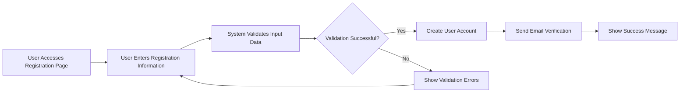
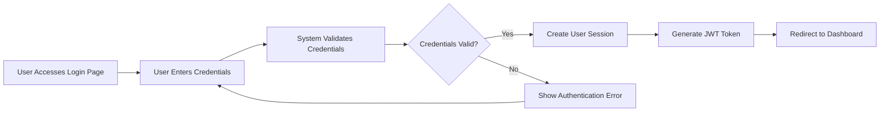
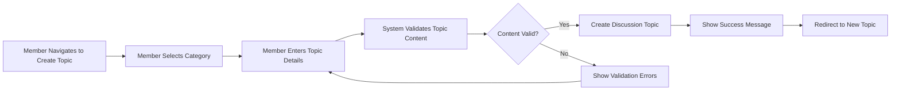
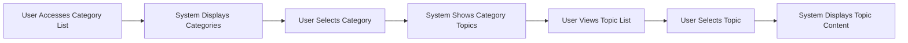

# Primary User Scenarios - Economic/Political Discussion Board

## 1. Introduction

This document defines the primary user scenarios and success paths for the economic/political discussion board platform. These scenarios represent the most common and critical user interactions that form the core user experience of the discussion platform. Each scenario is documented using EARS (Easy Approach to Requirements Syntax) format to provide clear, unambiguous requirements for backend development.

## 2. User Registration and Authentication Flow

### 2.1 User Registration Scenario

**Scenario Goal**: Enable new users to create accounts and join the discussion community.

**Primary Flow**:

**Business Requirements**:

- WHEN a user provides valid registration information (email, username, password), THE system SHALL create a new user account with "member" role.
- WHEN a user account is created, THE system SHALL send an email verification link to the provided email address.
- WHERE email verification is required, THE system SHALL restrict posting privileges until email verification is completed.
- IF email verification fails (invalid link, expired), THE system SHALL allow the user to request a new verification email.
- THE system SHALL validate that email addresses are unique across all user accounts.
- THE system SHALL validate that usernames are unique and meet format requirements (3-30 characters, alphanumeric only).
- THE system SHALL enforce password complexity requirements (minimum 8 characters, at least one uppercase letter, one lowercase letter, one number).

**User Journey**:
1. User navigates to registration page
2. User enters email, username, and password
3. System validates inputs and checks for duplicates
4. System creates user account with "pending verification" status
5. System sends verification email with secure link
6. User clicks verification link in email
7. System activates account and grants "member" role permissions
8. System redirects user to dashboard with success message

### 2.2 User Login Scenario

**Scenario Goal**: Allow registered users to authenticate and access the discussion platform.

**Primary Flow**:

**Business Requirements**:

- WHEN a user provides valid credentials (username/email and password), THE system SHALL create an authenticated session.
- WHEN authentication succeeds, THE system SHALL generate a JWT token containing user ID, role, and permissions.
- THE system SHALL maintain user sessions for 30 days unless explicitly logged out.
- IF authentication fails due to invalid credentials, THE system SHALL return an appropriate error message without revealing whether username or password was incorrect.
- IF a user account is suspended or banned, THE system SHALL deny login access and display the appropriate message.
- WHERE "Remember Me" is selected, THE system SHALL extend session duration to 30 days.

**User Journey**:
1. User navigates to login page
2. User enters username/email and password
3. System validates credentials against stored hash
4. System generates JWT token with user information
5. System creates session and sets authentication cookie
6. User is redirected to personalized dashboard
7. System logs the login event for security monitoring

### 2.3 Password Recovery Scenario

**Scenario Goal**: Enable users to regain access to their accounts when passwords are forgotten.

**Business Requirements**:

- WHEN a user requests password reset, THE system SHALL send a password reset link to the registered email.
- THE password reset link SHALL expire after 24 hours for security.
- WHEN a user successfully resets their password, THE system SHALL invalidate all existing sessions for that account.
- IF an invalid or expired reset token is used, THE system SHALL display an appropriate error message and allow requesting a new reset link.

## 3. Discussion Topic Creation Scenarios

### 3.1 Member Creates New Discussion Topic

**Scenario Goal**: Allow authenticated members to create new discussion topics in appropriate categories.

**Primary Flow**:

**Business Requirements**:

- WHEN a member creates a new discussion topic with valid content, THE system SHALL publish the topic in the selected category.
- THE system SHALL validate that topic titles are between 5 and 200 characters.
- THE system SHALL validate that topic content meets minimum length requirements (minimum 50 characters).
- THE system SHALL prevent duplicate topic titles within the same category.
- WHERE content moderation is enabled, THE system SHALL queue topics for moderator approval before public visibility.
- THE system SHALL track topic creation timestamp and author information.
- THE system SHALL allow topic creators to edit their topics within 24 hours of creation.

**User Journey**:
1. Member navigates to "Create Topic" page
2. Member selects appropriate category (Economics, Politics, etc.)
3. Member enters topic title and detailed content
4. System validates content against business rules
5. System creates topic with "pending" or "published" status based on moderation settings
6. System displays success message and redirects to the new topic
7. Topic appears in category listing and recent discussions

### 3.2 Topic Creation with Content Moderation

**Scenario Goal**: Ensure content quality through moderation workflows for new discussion topics.

**Business Requirements**:

- WHEN a member creates a topic requiring moderation, THE system SHALL add the topic to the moderation queue.
- THE system SHALL notify moderators when new topics require review.
- WHEN a moderator approves a topic, THE system SHALL change its status to "published" and make it publicly visible.
- WHEN a moderator rejects a topic, THE system SHALL notify the creator with rejection reason.
- THE system SHALL track moderation actions for audit purposes.

## 4. Comment and Reply System Scenarios

### 4.1 Member Comments on Discussion Topic

**Scenario Goal**: Enable members to participate in discussions by adding comments to existing topics.

**Primary Flow**:

**Business Requirements**:

- WHEN a member posts a valid comment on a discussion topic, THE system SHALL add the comment to the topic thread.
- THE system SHALL validate that comments are between 1 and 2000 characters.
- THE system SHALL prevent empty or whitespace-only comments.
- THE system SHALL track comment author, timestamp, and edit history.
- WHERE comment moderation is enabled, THE system SHALL queue comments for approval before public display.
- THE system SHALL allow comment authors to edit their comments within 1 hour of posting.
- THE system SHALL maintain comment threading and display comments in chronological order.

**User Journey**:
1. Member navigates to a discussion topic
2. Member scrolls to comment section
3. Member writes comment in text area
4. System validates comment content
5. System adds comment to topic with pending or published status
6. Comment appears in the discussion thread
7. Topic comment count updates
8. Other participants receive notifications (if enabled)

### 4.2 Nested Reply System

**Scenario Goal**: Enable threaded discussions through nested replies to comments.

**Business Requirements**:

- WHEN a member replies to an existing comment, THE system SHALL create a nested reply in the discussion thread.
- THE system SHALL maintain proper reply threading up to 3 levels deep.
- THE system SHALL visually distinguish nested replies in the discussion interface.
- THE system SHALL track reply relationships for proper thread display.
- WHEN a comment receives multiple replies, THE system SHALL display them in chronological order.

### 4.3 Comment Voting System

**Scenario Goal**: Allow community members to express agreement/disagreement with comments through voting.

**Business Requirements**:

- WHEN a member votes on a comment, THE system SHALL record the vote and update the comment score.
- THE system SHALL prevent members from voting on their own comments.
- THE system SHALL allow each member only one vote per comment (upvote or downvote).
- THE system SHALL calculate and display comment scores based on vote differential.
- THE system SHALL sort comments by score (highest first) as default viewing option.

## 5. Content Discovery and Navigation Scenarios

### 5.1 Browsing Discussion Categories

**Scenario Goal**: Enable users to discover and navigate discussion topics by category.

**Primary Flow**:

**Business Requirements**:

- WHEN a user browses discussion categories, THE system SHALL display all available categories with topic counts.
- THE system SHALL display categories in alphabetical order by default.
- WHEN a user selects a category, THE system SHALL display the most recent topics first.
- THE system SHALL show topic metadata including author, creation date, comment count, and last activity.
- THE system SHALL paginate topic lists with 20 topics per page.
- WHERE categories have subcategories, THE system SHALL display hierarchical category structure.

**User Journey**:
1. User navigates to categories page
2. System displays list of categories with topic counts
3. User selects "Economics" category
4. System displays recent economics topics with metadata
5. User clicks on a topic title
6. System displays full topic content and comments
7. User can navigate back to category or browse other topics

### 5.2 Search Functionality

**Scenario Goal**: Enable users to find specific discussions through search functionality.

**Business Requirements**:

- WHEN a user performs a search, THE system SHALL return relevant topics and comments matching the search terms.
- THE system SHALL search across topic titles, topic content, and comment content.
- THE system SHALL highlight search terms in results for easy identification.
- THE system SHALL provide search suggestions as the user types.
- THE system SHALL return search results within 2 seconds for typical queries.
- WHERE search returns many results, THE system SHALL rank results by relevance and activity.

**User Journey**:
1. User enters search terms in search box
2. System provides real-time search suggestions
3. User submits search query
4. System displays search results with highlighted terms
5. User can filter results by category, date, or relevance
6. User selects a result to view the full discussion

### 5.3 Recent and Popular Discussions

**Scenario Goal**: Help users discover active and trending discussions.

**Business Requirements**:

- WHEN a user views the homepage, THE system SHALL display recent discussions from all categories.
- THE system SHALL display popular discussions based on comment activity and voting.
- THE system SHALL highlight trending topics that have recent high engagement.
- THE system SHALL provide filtering options for recent, popular, and trending views.
- THE system SHALL update popularity metrics in real-time as engagement occurs.

## 6. Success Criteria and User Goals

### 6.1 User Registration Success

**Success Metrics**:
- User completes registration in under 2 minutes
- Email verification process completes within 5 minutes
- New users can immediately participate in discussions after verification
- Registration success rate exceeds 95%

### 6.2 Discussion Participation Success

**Success Metrics**:
- Members can create new topics in under 1 minute
- Comment posting response time under 500ms
- Topic creation success rate exceeds 98%
- Comment threading maintains proper relationships 100% of time

### 6.3 Content Discovery Success

**Success Metrics**:
- Search results returned within 2 seconds
- Category browsing responds within 1 second
- Users find relevant content within 3 clicks from homepage
- Navigation success rate exceeds 99%

### 6.4 Performance Benchmarks

**Response Time Requirements**:
- Page load time: under 2 seconds
- API response time: under 500ms
- Search response time: under 2 seconds
- Comment posting: under 1 second
- Topic creation: under 2 seconds

**Concurrent User Handling**:
- THE system SHALL support 1,000 concurrent users during peak usage.
- THE system SHALL maintain performance during traffic spikes from popular discussions.
- THE system SHALL scale horizontally to handle growing user base.

## 7. Integration with Other System Components

### 7.1 Authentication Integration

All primary scenarios integrate with the authentication system defined in [User Roles Documentation](./02-user-roles.md) to enforce role-based permissions and access controls.

### 7.2 Moderation Integration

Content creation scenarios integrate with moderation workflows defined in [Service Operation Documentation](./03-service-operation.md) to ensure content quality and compliance.

### 7.3 Error Handling Integration

Primary scenarios include error handling as defined in [Exception Handling Documentation](./06-exception-handling.md) for graceful failure recovery.

## 8. Business Rules and Validation

### 8.1 Content Validation Rules

- Topic titles: 5-200 characters, alphanumeric and basic punctuation
- Topic content: Minimum 50 characters, maximum 10,000 characters
- Comments: 1-2,000 characters, no empty content
- Usernames: 3-30 characters, alphanumeric and underscores only
- Email addresses: Valid email format, unique per account

### 8.2 Rate Limiting Rules

- New members: Maximum 5 topics and 20 comments per day
- Established members: Maximum 10 topics and 50 comments per day
- All users: Maximum 10 search queries per minute
- Comment posting: Minimum 10 seconds between comments

### 8.3 Content Quality Rules

- Topics must contain substantive discussion prompts
- Comments should contribute meaningfully to discussions
- Duplicate content across topics is discouraged
- Off-topic discussions should be directed to appropriate categories

These primary scenarios define the core user experience for the economic/political discussion board and provide comprehensive guidance for backend implementation of the most critical user interaction flows.