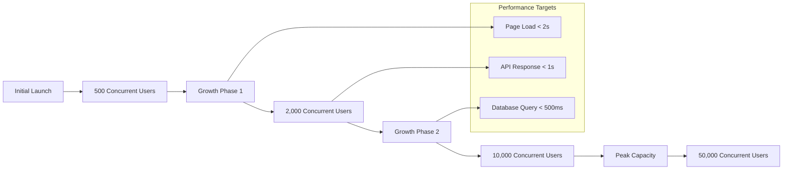

# Performance Requirements for Economic/Political Discussion Board

## Performance Overview

This document defines the performance expectations and requirements for the Economic/Political Discussion Board platform. Performance is critical for user engagement, discussion quality, and overall platform success. Users expect responsive interactions when participating in real-time discussions, creating content, and navigating through debates.

## User Experience Performance Standards

### Core Performance Principles
- **Instant Response**: Users should perceive the system as responsive and immediate
- **Seamless Interaction**: Navigation and content browsing should feel fluid
- **Reliable Performance**: Consistent performance during peak usage periods

### Response Time Expectations

#### Page Load Performance
- **WHEN loading the discussion board homepage, THE system SHALL display initial content within 2 seconds.**
- **WHEN navigating between discussion categories, THE system SHALL complete page transitions within 1.5 seconds.**
- **WHEN opening individual discussion threads, THE system SHALL load all content and comments within 2 seconds.**

#### Content Interaction Performance
- **WHEN submitting a new discussion topic, THE system SHALL process and display the post within 1 second.**
- **WHEN posting a comment or reply, THE system SHALL process and display the response within 800 milliseconds.**
- **WHEN editing existing content, THE system SHALL save changes and update the display within 1 second.**
- **WHEN searching for discussions or content, THE system SHALL return relevant results within 1 second for common queries.**

#### User Interface Performance
- **WHEN interacting with user interface elements (buttons, forms, menus), THE system SHALL provide visual feedback within 100 milliseconds.**
- **WHEN scrolling through long discussion threads, THE system SHALL maintain smooth scrolling performance without jank or lag.**
- **WHEN loading additional content through pagination or infinite scroll, THE system SHALL fetch and display new content within 1.5 seconds.**

## System Response Time Expectations

### Authentication and User Management
- **WHEN users log in to the system, THE system SHALL authenticate credentials and establish user session within 1.5 seconds.**
- **WHEN users register new accounts, THE system SHALL create user profiles and send verification emails within 2 seconds.**
- **WHEN users update profile information, THE system SHALL save changes and confirm updates within 1 second.**

### Content Management Operations
- **WHEN creating new discussion topics, THE system SHALL validate content, apply moderation rules, and publish posts within 1 second.**
- **WHEN fetching discussion lists with filtering and sorting, THE system SHALL return paginated results within 1 second for up to 100 concurrent requests.**
- **WHEN loading user activity history, THE system SHALL retrieve and display the last 50 activities within 1.5 seconds.**

### Search and Discovery Performance
- **WHEN performing text searches across discussion content, THE system SHALL return relevant results within 1 second for queries under 50 characters.**
- **WHEN filtering discussions by category, tags, or date ranges, THE system SHALL apply filters and return results within 800 milliseconds.**
- **WHEN loading trending or popular discussions, THE system SHALL calculate and display trending content within 1 second.**

### Moderation Operations
- **WHEN moderators review reported content, THE system SHALL load moderation queue items within 1 second.**
- **WHEN moderators approve or reject content, THE system SHALL process moderation decisions and update content status within 800 milliseconds.**
- **WHEN administrators perform bulk moderation actions, THE system SHALL process up to 100 items within 5 seconds.**

## Scalability Requirements

### Concurrent User Handling

#### User Capacity Planning
- **THE system SHALL support 500 concurrent users during initial launch with consistent performance.**
- **THE system SHALL scale to handle 2,000 concurrent users within the first 6 months of operation.**
- **THE system SHALL accommodate growth to 10,000 concurrent users within 12 months without performance degradation.**
- **THE system SHALL maintain performance standards with up to 50,000 concurrent users during peak political events or breaking news.**

#### Content Volume Scaling
- **THE system SHALL efficiently handle up to 1,000 new discussion topics per day.**
- **THE system SHALL process up to 10,000 comments and replies per hour during peak activity.**
- **THE system SHALL maintain search performance with a database containing 1 million discussion posts.**
- **THE system SHALL support storage and retrieval of up to 5 million user-generated content items.**

### Traffic Pattern Handling
- **WHILE experiencing sudden traffic spikes from viral discussions, THE system SHALL maintain response times within 150% of normal performance.**
- **WHEN political events generate unexpected user volume, THE system SHALL automatically scale resources to maintain service availability.**
- **IF traffic exceeds 200% of normal capacity, THE system SHALL implement graceful degradation rather than complete failure.**

## Performance Benchmarks

### Critical Operations Performance Targets

| Operation | Target Response Time | Peak Load Tolerance | Success Criteria |
|-----------|---------------------|---------------------|------------------|
| User Login | ≤ 1.5 seconds | ≤ 3 seconds | 95th percentile |
| Discussion Load | ≤ 2 seconds | ≤ 4 seconds | 90th percentile |
| Comment Post | ≤ 800ms | ≤ 2 seconds | 95th percentile |
| Search Query | ≤ 1 second | ≤ 2.5 seconds | 90th percentile |
| Category Navigation | ≤ 1.5 seconds | ≤ 3 seconds | 95th percentile |
| User Profile Load | ≤ 1 second | ≤ 2 seconds | 95th percentile |

### Database Performance Requirements
- **WHEN querying discussion lists with filters, THE database SHALL return results within 500 milliseconds for 95% of queries.**
- **WHEN performing text searches, THE search index SHALL return relevant results within 300 milliseconds.**
- **WHEN writing new content, THE database SHALL persist data and return confirmation within 200 milliseconds.**
- **WHEN loading user activity streams, THE system SHALL retrieve the last 100 activities within 1 second.**

### API Performance Standards
- **THE API SHALL respond to health check requests within 100 milliseconds.**
- **THE API SHALL process authentication requests within 800 milliseconds.**
- **THE API SHALL handle content creation requests within 1 second under normal load.**
- **THE API SHALL maintain response times under 2 seconds during peak traffic periods.**

## Infrastructure Considerations

### Server Performance Expectations
- **THE application servers SHALL maintain CPU utilization below 70% during normal operation.**
- **THE database servers SHALL maintain query performance with connection pools supporting up to 500 concurrent connections.**
- **THE caching layer SHALL achieve 90% cache hit rate for frequently accessed content.**

### Network Performance
- **THE content delivery network SHALL deliver static assets with latency under 100 milliseconds for 95% of users.**
- **THE API endpoints SHALL maintain network latency under 50 milliseconds within the same geographic region.**
- **THE system SHALL support global users with acceptable performance degradation based on geographic distance.**

### Storage Performance
- **THE file storage system SHALL serve user-uploaded images within 500 milliseconds.**
- **THE database SHALL maintain write performance of at least 1,000 transactions per second.**
- **THE search index SHALL update within 10 seconds of new content being created.**

## Monitoring and Alerting

### Performance Monitoring Requirements
- **THE system SHALL continuously monitor response times for all critical user interactions.**
- **THE system SHALL track error rates and performance degradation patterns.**
- **THE system SHALL monitor resource utilization (CPU, memory, disk, network) across all infrastructure components.**
- **THE system SHALL provide real-time performance dashboards for operational visibility.**

### Alerting Thresholds
- **IF API response times exceed 3 seconds for more than 5 minutes, THE system SHALL trigger performance alerts.**
- **IF database query performance degrades beyond 2 seconds for 10% of queries, THE system SHALL trigger database performance alerts.**
- **IF system availability drops below 99.5% for any 5-minute period, THE system SHALL trigger availability alerts.**
- **IF concurrent user count approaches 80% of capacity limits, THE system SHALL trigger capacity alerts.**

### Performance Testing
- **THE system SHALL undergo load testing simulating 200% of expected peak traffic.**
- **THE system SHALL undergo stress testing to identify breaking points and performance limits.**
- **THE system SHALL undergo endurance testing to detect memory leaks and performance degradation over time.**

## Success Criteria

### Performance Acceptance Criteria
- **THE system SHALL maintain average response times below defined thresholds during 95% of operational hours.**
- **THE system SHALL achieve 99.5% availability during normal business hours.**
- **THE system SHALL scale horizontally to accommodate user growth without architectural changes.**
- **THE system SHALL recover from performance degradation within 15 minutes of detection.**

### User Experience Success Metrics
- **WHEN using the discussion board, 90% of users SHALL report satisfaction with system responsiveness.**
- **THE system SHALL maintain engagement metrics with less than 5% abandonment due to performance issues.**
- **WHEN experiencing performance issues, users SHALL receive clear feedback and recovery guidance.**

### Operational Performance Goals
- **THE operations team SHALL detect performance issues within 5 minutes of occurrence.**
- **THE system SHALL provide performance degradation early warning at least 30 minutes before critical thresholds are reached.**
- **THE performance monitoring system SHALL provide actionable insights for 95% of performance incidents.**

## Performance Optimization Requirements

### Content Delivery Optimization
- **THE system SHALL implement efficient caching strategies for frequently accessed content.**
- **THE system SHALL compress and optimize images and media files for faster delivery.**
- **THE system SHALL utilize content delivery networks for global performance.**

### Database Optimization
- **THE database SHALL maintain optimized indexes for all common query patterns.**
- **THE system SHALL implement query performance monitoring and optimization.**
- **THE database SHALL support read replicas for scaling read operations.**

### Application Optimization
- **THE application SHALL implement efficient database connection pooling.**
- **THE system SHALL utilize background processing for non-time-critical operations.**
- **THE application SHALL implement request batching for efficient resource utilization.**

These performance requirements ensure the Economic/Political Discussion Board provides a responsive, reliable platform for meaningful discussions while supporting growth and maintaining user satisfaction through all stages of platform evolution.