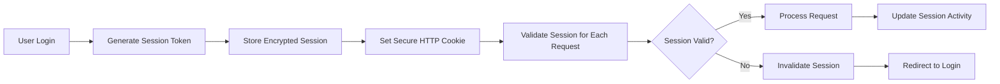
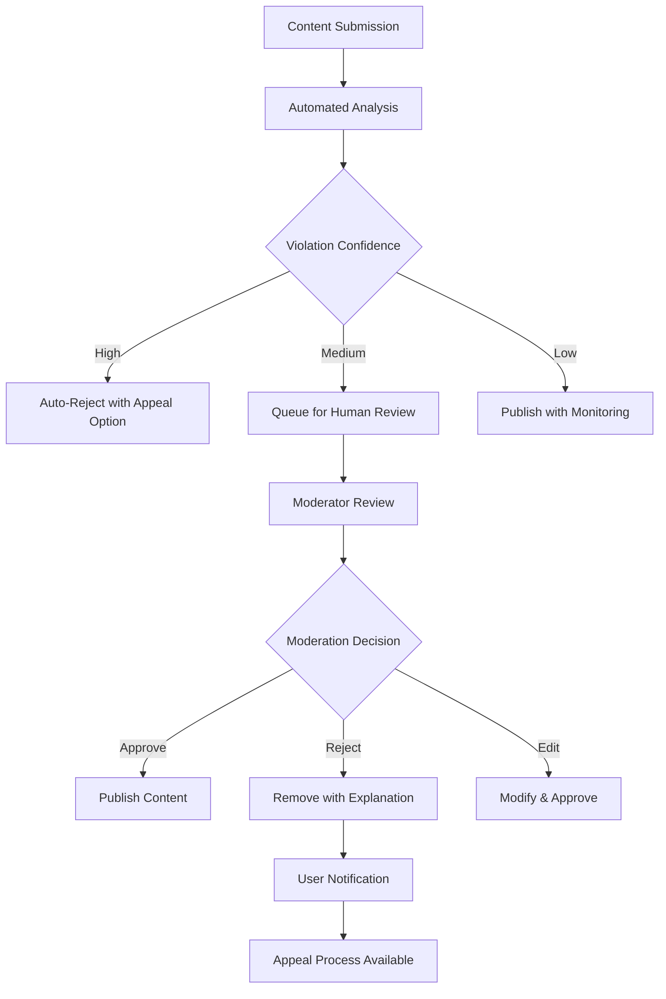

# Security and Compliance Requirements for Economic/Political Discussion Board

## 1. Introduction and Security Framework

This document defines comprehensive security and compliance requirements for the economic/political discussion board platform. Given the sensitive nature of economic and political discourse, the platform must implement robust security measures to protect user data, ensure platform integrity, and comply with relevant regulations while maintaining an environment conducive to constructive discussion.

### 1.1 Security Objectives

**THE system SHALL protect user privacy and data confidentiality while enabling open discourse.**

**WHEN processing user data, THE system SHALL implement privacy-by-design principles throughout the development lifecycle.**

**WHERE political content is discussed, THE system SHALL maintain neutrality while preventing harmful content dissemination.**

### 1.2 Compliance Framework

**THE system SHALL comply with GDPR requirements for European users and relevant local data protection regulations.**

**WHERE political advertising occurs, THE system SHALL implement transparency measures as required by applicable laws.**

**WHEN handling sensitive discussions, THE system SHALL balance free expression with responsible content management.**

## 2. Authentication and Access Control Security

### 2.1 User Authentication Security

**WHEN users register accounts, THE system SHALL implement multi-layered validation:**
- Email verification through secure confirmation links
- Password strength validation requiring minimum 12 characters with mixed case, numbers, and special symbols
- CAPTCHA protection against automated account creation
- Rate limiting of 5 registration attempts per IP address per hour

**WHEN users authenticate, THE system SHALL enforce secure login protocols:**
- Session tokens SHALL expire after 30 minutes of inactivity
- Failed login attempts SHALL trigger account lockout after 5 consecutive failures
- Password reset tokens SHALL be valid for only 1 hour
- All authentication attempts SHALL be logged with timestamps and IP addresses

**WHERE multi-factor authentication is enabled, THE system SHALL:**
- Support TOTP-based authenticator apps as primary 2FA method
- Provide backup codes for account recovery
- Require 2FA for administrative access
- Allow users to manage trusted devices

### 2.2 Session Management Security

**Session Security Requirements:**
- Session tokens SHALL be cryptographically secure random values
- Session data SHALL be stored server-side with minimal client exposure
- Session cookies SHALL use Secure, HttpOnly, and SameSite=Strict attributes
- Session timeouts SHALL be configurable based on sensitivity of operations

### 2.3 Role-Based Access Control

**WHEN users access platform features, THE system SHALL enforce granular permissions:**
- Guest users SHALL have read-only access to public content
- Member users SHALL have content creation and interaction privileges
- Moderator users SHALL have content moderation capabilities
- Administrator users SHALL have full system access

**Permission Enforcement Rules:**
- All API endpoints SHALL validate user permissions before processing requests
- UI elements SHALL be hidden or disabled based on user role permissions
- Administrative functions SHALL require additional verification for sensitive operations
- Permission changes SHALL be logged and require administrative approval

## 3. Data Protection and Privacy

### 3.1 Data Classification and Handling

**THE system SHALL classify data into three protection levels:**

**Public Data:** Discussion content intended for public viewing
- May be accessed without authentication
- Subject to content moderation guidelines
- Retained according to platform policies

**Private Data:** User account information and preferences
- Requires user authentication for access
- Subject to data protection regulations
- Users may export or delete upon request

**Confidential Data:** Security logs, moderation decisions, system configurations
- Accessible only to authorized administrators
- Protected by additional security controls
- Retained for legal and security purposes

### 3.2 Data Encryption Requirements

**Data Encryption Standards:**
- All data in transit SHALL use TLS 1.3 with perfect forward secrecy
- Data at rest SHALL be encrypted using AES-256 encryption
- Password hashing SHALL use bcrypt with cost factor 12
- Encryption keys SHALL be managed through dedicated key management service

**Encryption Implementation:**
- Database fields containing sensitive information SHALL use application-level encryption
- Backup files SHALL be encrypted before transfer to secure storage
- Temporary files containing user data SHALL be encrypted
- Encryption keys SHALL be rotated quarterly

### 3.3 Data Retention and Deletion

**Data Retention Policies:**
- User account data SHALL be retained while account is active
- Deleted user accounts SHALL be anonymized after 30-day grace period
- Content moderation records SHALL be retained for 2 years
- Security logs SHALL be retained for 1 year
- System backups SHALL be retained for 90 days

**Data Deletion Procedures:**
- User-initiated account deletion SHALL remove personal data within 24 hours
- Content deletion SHALL remove data from all system copies within 72 hours
- Backup data SHALL be purged according to retention schedules
- Data export functionality SHALL include all user-generated content

## 4. Content Moderation Security

### 4.1 Automated Content Analysis

**WHEN users submit content, THE system SHALL perform automated analysis:**
- Text analysis for prohibited content using machine learning models
- Image analysis for inappropriate visual content
- Link verification for malicious URLs
- Pattern detection for spam and automated posting

**Automated Moderation Rules:**
- Content scoring SHALL determine moderation priority
- High-confidence violations SHALL be automatically filtered
- Borderline content SHALL be queued for human review
- False positives SHALL be used to improve detection algorithms

### 4.2 Human Moderation Workflow

**Moderation Process Requirements:**
- Content review queue SHALL prioritize reported content
- Moderators SHALL receive comprehensive content context for decisions
- Moderation decisions SHALL include specific policy violation references
- Appeal process SHALL be available for all moderation actions

### 4.3 User Reporting System

**WHEN users report content, THE system SHALL:**
- Collect detailed report reasons and evidence
- Prioritize reports based on severity and user history
- Protect reporter anonymity from content creators
- Track report resolution and provide user feedback

**Report Handling Procedures:**
- Urgent reports (threats, illegal content) SHALL be reviewed within 1 hour
- Standard reports SHALL be reviewed within 24 hours
- Report outcomes SHALL be communicated to reporting users
- False reports SHALL trigger user education or restrictions

## 5. Regulatory Compliance Requirements

### 5.1 GDPR Compliance Implementation

**Data Processing Principles:**
- Lawful basis SHALL be established for all data processing activities
- Data minimization SHALL be practiced for all data collection
- Purpose limitation SHALL restrict data usage to declared purposes
- Storage limitation SHALL enforce data retention policies

**User Rights Implementation:**
- Right to access: Users SHALL receive complete data export within 30 days
- Right to rectification: Users SHALL be able to correct inaccurate data
- Right to erasure: Users SHALL be able to delete accounts and associated data
- Right to data portability: Users SHALL receive data in machine-readable format

### 5.2 Political Content Regulations

**Election Integrity Measures:**
- Political advertising SHALL be clearly labeled and include sponsor information
- Foreign political advertising SHALL be prohibited or strictly regulated
- Election-related content SHALL be monitored for misinformation
- Transparency reports SHALL be published regarding political content

**Content Authenticity:**
- User verification options SHALL be available for public figures
- Content provenance SHALL be tracked where feasible
- Deepfake and manipulated media SHALL be identified and labeled
- Fact-checking partnerships SHALL be established for verification

### 5.3 Age Verification and Protection

**Minor Protection Measures:**
- Age verification SHALL be required during registration
- Users under 18 SHALL have restricted access to certain content categories
- Parental consent SHALL be obtained where required by law
- Additional privacy protections SHALL apply to minor accounts

## 6. Technical Security Controls

### 6.1 Network Security

**Network Protection Requirements:**
- All external communications SHALL use TLS 1.3 encryption
- DDoS protection SHALL be implemented at network edge
- Rate limiting SHALL be applied to all public endpoints
- Network segmentation SHALL isolate sensitive components

**API Security Measures:**
- API authentication SHALL use OAuth 2.0 with short-lived tokens
- API rate limits SHALL prevent abuse and ensure service availability
- Input validation SHALL prevent injection attacks
- Output encoding SHALL prevent XSS vulnerabilities

### 6.2 Application Security

**Secure Development Practices:**
- Code reviews SHALL be mandatory for security-critical components
- Static code analysis SHALL be integrated into development workflow
- Dependency scanning SHALL identify vulnerable third-party libraries
- Security testing SHALL be part of continuous integration pipeline

**Vulnerability Management:**
- Security patches SHALL be applied within 72 hours of availability
- Regular penetration testing SHALL be conducted by independent third parties
- Bug bounty program SHALL incentivize responsible disclosure
- Security incident response plan SHALL be tested quarterly

### 6.3 Security Monitoring and Logging

**Security Event Monitoring:**
- Real-time security monitoring SHALL detect suspicious activities
- Automated alerts SHALL notify security team of potential incidents
- Security information and event management (SIEM) SHALL correlate events
- Threat intelligence SHALL inform monitoring rules

**Comprehensive Logging:**
- Authentication events SHALL be logged with source IP and user agent
- Administrative actions SHALL be logged with justification and approver
- Content moderation decisions SHALL be logged with specific reasons
- Data access SHALL be logged for sensitive information

## 7. Risk Assessment and Mitigation

### 7.1 Threat Modeling

**Platform-Specific Threats:**
- Coordinated disinformation campaigns targeting political discussions
- Data breaches exposing user identities and discussion history
- Content manipulation through compromised accounts
- Service disruption during critical political events

**Risk Mitigation Strategies:**
- Advanced threat detection for coordinated inauthentic behavior
- Multi-layered data protection with encryption and access controls
- Account security monitoring for suspicious activity patterns
- Redundant infrastructure for service continuity

### 7.2 Security Incident Response

**Incident Response Procedures:**
- Security incidents SHALL be classified by severity and impact
- Incident response team SHALL be activated within 1 hour of detection
- Communication plan SHALL notify affected users and authorities
- Post-incident analysis SHALL identify improvements

**Breach Notification Requirements:**
- Data breaches SHALL be reported to authorities within 72 hours
- Affected users SHALL be notified without undue delay
- Breach details SHALL be documented for regulatory compliance
- Remediation measures SHALL be implemented promptly

## 8. Implementation Guidelines

### 8.1 Security Development Lifecycle

**Development Security Requirements:**
- Security requirements SHALL be defined during design phase
- Threat modeling SHALL be conducted for new features
- Security testing SHALL be integrated into development process
- Security review SHALL be mandatory before production deployment

**Third-Party Security:**
- Vendor security assessments SHALL be conducted before integration
- Third-party code SHALL be scanned for vulnerabilities
- API integrations SHALL use secure authentication methods
- Data sharing with third parties SHALL be minimized and documented

### 8.2 Security Training and Awareness

**Staff Security Training:**
- All employees SHALL receive security awareness training annually
- Development teams SHALL receive secure coding training
- Administrative staff SHALL receive data protection training
- Security team SHALL maintain current security certifications

**User Security Education:**
- Security best practices SHALL be communicated to users
- Privacy settings SHALL be clearly explained and easily configurable
- Security features SHALL be promoted to enhance adoption
- Security incident guidance SHALL be available to users

## 9. Compliance Monitoring and Reporting

### 9.1 Regulatory Compliance Monitoring

**Compliance Assessment:**
- Regular compliance audits SHALL be conducted quarterly
- Gap analysis SHALL identify areas requiring improvement
- Compliance metrics SHALL be tracked and reported to management
- Regulatory changes SHALL be monitored and assessed for impact

**Documentation Requirements:**
- Data processing activities SHALL be documented in register
- Security policies and procedures SHALL be maintained current
- Compliance evidence SHALL be retained for regulatory review
- Transparency reports SHALL be published annually

### 9.2 Security Metrics and Reporting

**Key Security Indicators:**
- Mean time to detect security incidents
- Mean time to resolve security incidents
- Percentage of systems with updated security patches
- Number of successful security awareness trainings completed

**Security Reporting:**
- Security dashboard SHALL provide real-time security status
- Monthly security reports SHALL be provided to management
- Security metrics SHALL be used to drive improvement initiatives
- External security assessments SHALL be conducted annually

## 10. Business Continuity and Disaster Recovery

### 10.1 Service Availability

**Availability Requirements:**
- Core discussion functionality SHALL maintain 99.9% availability
- Authentication services SHALL maintain 99.95% availability
- Data storage systems SHALL maintain 99.99% availability
- Disaster recovery procedures SHALL be tested semi-annually

**Service Level Objectives:**
- Page load time SHALL not exceed 2 seconds during normal operation
- API response time SHALL not exceed 1 second for 95% of requests
- Search functionality SHALL return results within 1.5 seconds
- Content moderation SHALL process reports within 24 hours

### 10.2 Data Protection and Recovery

**Backup and Recovery:**
- Automated backups SHALL be performed daily
- Backup integrity SHALL be verified weekly
- Recovery testing SHALL be conducted quarterly
- Data recovery SHALL be possible within 4 hours for critical systems

**Business Continuity Planning:**
- Business impact analysis SHALL identify critical functions
- Recovery time objectives SHALL be defined for all services
- Recovery point objectives SHALL ensure minimal data loss
- Alternate processing capabilities SHALL be maintained

This comprehensive security and compliance framework ensures the economic/political discussion board operates with appropriate safeguards while maintaining an environment conducive to constructive political and economic discourse. The requirements balance user privacy, content integrity, and regulatory compliance to create a trustworthy platform for sensitive discussions.