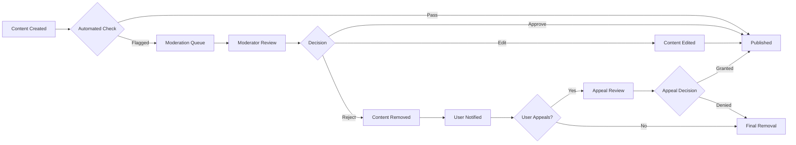

# Business Rules and Validation Requirements for Economic/Political Discussion Board

## 1. Introduction and Scope

This document defines the comprehensive business rules, validation constraints, and operational limitations for the Economic/Political Discussion Board platform. These rules govern all user interactions, content validation, and system operations to ensure a high-quality discussion environment while maintaining platform integrity and user experience.

## 2. Content Validation Rules

### 2.1 Discussion Topic Creation Rules

**WHEN a user creates a new discussion topic, THE system SHALL validate the following requirements:**

- **Topic Title Validation**: THE topic title SHALL contain between 10 and 200 characters, SHALL NOT contain HTML tags or malicious scripts, and SHALL be unique within the same category.
- **Topic Content Validation**: THE topic content SHALL contain between 50 and 5000 characters, SHALL NOT contain prohibited keywords related to hate speech or harassment, and SHALL pass automated content quality assessment.
- **Category Assignment**: THE user SHALL select exactly one category from predefined economic or political categories, and THE category SHALL be active and available for posting.
- **Content Moderation Queue**: IF the topic contains flagged keywords or the user has low reputation, THEN THE system SHALL place the topic in moderation queue for manual review.

**WHEN a user attempts to edit an existing discussion topic, THE system SHALL enforce the following rules:**

- THE user SHALL only edit topics they created themselves.
- THE edit window SHALL be limited to 24 hours from original creation time.
- THE edited content SHALL undergo the same validation rules as new topics.
- THE system SHALL maintain edit history for moderation purposes.

### 2.2 Comment and Reply Validation Rules

**WHEN a user posts a comment or reply, THE system SHALL validate:**

- **Comment Length**: THE comment SHALL contain between 5 and 1000 characters.
- **Reply Depth**: THE reply nesting level SHALL NOT exceed 5 levels deep to prevent infinite threading.
- **Comment Frequency**: WHERE a user has posted more than 10 comments in the last hour, THE system SHALL temporarily limit comment creation to prevent spam.
- **Content Quality**: THE comment SHALL NOT consist entirely of repetitive characters, single words, or nonsensical content.

**WHEN a user attempts to edit a comment, THE system SHALL enforce:**

- THE user SHALL only edit comments they authored.
- THE edit window SHALL be limited to 1 hour from posting time.
- THE system SHALL display edit indicators to other users.
- THE original comment content SHALL be preserved for moderation purposes.

### 2.3 Category Management Rules

**WHEN managing discussion categories, THE system SHALL enforce:**

- **Category Creation**: ONLY administrators SHALL create new discussion categories.
- **Category Naming**: Category names SHALL be unique, SHALL contain between 3 and 50 characters, and SHALL NOT contain special characters except hyphens and spaces.
- **Category Assignment**: Each discussion topic SHALL be assigned to exactly one primary category.
- **Category Archiving**: WHERE a category becomes inactive, THE system SHALL prevent new topics but preserve existing discussions.

### 2.4 Content Moderation Guidelines

**WHEN content requires moderation, THE system SHALL apply these rules:**

- **Automated Flagging**: THE system SHALL automatically flag content containing prohibited keywords, excessive capitalization, or suspicious patterns.
- **User Reporting**: WHEN a user reports content, THE system SHALL log the report and notify moderators within 15 minutes.
- **Moderation Actions**: Moderators SHALL have authority to remove, edit, or approve flagged content based on community guidelines.
- **Appeal Process**: WHERE content is removed, THE original author SHALL have the right to appeal the decision within 7 days.

## 3. User Behavior Constraints

### 3.1 User Registration and Authentication Rules

**WHEN a user registers for the platform, THE system SHALL enforce:**

- **Email Validation**: THE user SHALL provide a valid email address that passes format verification and domain validation.
- **Username Requirements**: THE username SHALL be unique, SHALL contain between 3 and 30 alphanumeric characters, and SHALL NOT contain offensive language.
- **Password Strength**: THE password SHALL contain at least 8 characters including uppercase, lowercase, numbers, and special characters.
- **Account Verification**: THE system SHALL require email verification before allowing content creation.

**WHEN a user attempts to authenticate, THE system SHALL:**

- **Login Attempts**: WHERE a user fails authentication 5 times within 15 minutes, THE system SHALL temporarily lock the account for 30 minutes.
- **Session Management**: User sessions SHALL expire after 24 hours of inactivity, requiring re-authentication.
- **Password Reset**: THE system SHALL send password reset links to verified email addresses only.

### 3.2 User Interaction Limitations

**WHEN users interact with content, THE system SHALL enforce:**

- **Voting Restrictions**: Users SHALL NOT vote on their own content, and SHALL be limited to one vote per piece of content.
- **Reporting Limits**: Users SHALL be limited to 5 content reports per hour to prevent abuse.
- **Following Limits**: Users SHALL be able to follow up to 100 other users to prevent spam following.
- **Blocking Functionality**: Users SHALL be able to block other users, which SHALL prevent the blocked user from viewing their content or interacting with them.

### 3.3 Reputation and Activity Constraints

**WHEN calculating user reputation, THE system SHALL apply:**

- **Reputation Gain**: Users SHALL gain reputation points when their content receives upvotes from other users.
- **Reputation Loss**: Users SHALL lose reputation points when their content receives downvotes or is removed by moderators.
- **Activity Requirements**: Users SHALL maintain minimum activity levels to retain certain privileges.
- **Reputation Tiers**: Different reputation levels SHALL unlock additional platform features and permissions.

**Reputation Tier Requirements:**

| Reputation Level | Required Points | Unlocked Privileges |
|------------------|-----------------|---------------------|
| New User | 0-50 | Basic commenting, voting |
| Established User | 51-500 | Topic creation, extended editing windows |
| Trusted User | 501-2000 | Category creation suggestions, reduced moderation |
| Community Leader | 2001+ | Moderation assistance, featured content promotion |

### 3.4 Content Creation Limits

**WHEN users create content, THE system SHALL enforce these limitations:**

- **Topic Creation**: New users SHALL be limited to 3 topics per day until they reach 100 reputation points.
- **Comment Frequency**: Users SHALL be limited to 20 comments per hour to prevent spam.
- **Image Uploads**: Users SHALL be limited to 5 image uploads per day, with each image not exceeding 5MB.
- **Link Sharing**: Users with less than 50 reputation SHALL have external links flagged for moderation.

## 4. Operational Business Logic

### 4.1 Content Lifecycle Management

**WHEN content is created on the platform, THE system SHALL manage its lifecycle as follows:**

- **Content Visibility**: New content SHALL be immediately visible unless flagged for moderation.
- **Content Archiving**: Topics with no activity for 90 days SHALL be automatically archived.
- **Content Deletion**: Users SHALL be able to delete their own content within 24 hours of creation.
- **Content Preservation**: Moderator-deleted content SHALL be preserved in archive for 30 days before permanent deletion.

**WHEN content receives user engagement, THE system SHALL apply:**

- **Trending Algorithm**: Content SHALL be promoted to trending based on engagement velocity, not just total votes.
- **Quality Scoring**: Content SHALL receive quality scores based on user engagement, comment quality, and moderator ratings.
- **Featured Content**: High-quality content SHALL be featured on the platform homepage for increased visibility.

### 4.2 User Role-Based Permissions

**THE system SHALL enforce role-based permissions according to the following matrix:**

| Action | Guest | Member | Moderator | Admin |
|--------|-------|--------|-----------|-------|
| View public content | ✅ | ✅ | ✅ | ✅ |
| Create account | ✅ | ❌ | ❌ | ❌ |
| Login | ❌ | ✅ | ✅ | ✅ |
| Create topics | ❌ | ✅ | ✅ | ✅ |
| Comment on topics | ❌ | ✅ | ✅ | ✅ |
| Edit own content | ❌ | ✅ | ✅ | ✅ |
| Delete own content | ❌ | ✅ | ✅ | ✅ |
| Vote on content | ❌ | ✅ | ✅ | ✅ |
| Report content | ❌ | ✅ | ✅ | ✅ |
| Moderate content | ❌ | ❌ | ✅ | ✅ |
| Manage users | ❌ | ❌ | ❌ | ✅ |
| Manage categories | ❌ | ❌ | ❌ | ✅ |
| System configuration | ❌ | ❌ | ❌ | ✅ |

### 4.3 Moderation Workflow Rules

**WHEN content requires moderation, THE system SHALL follow this workflow:**

**Moderation Decision Rules:**

- **Content Approval**: WHEN content meets community guidelines, moderators SHALL approve it for publication.
- **Content Editing**: WHEN content requires minor corrections, moderators SHALL edit and approve it.
- **Content Removal**: WHEN content violates community guidelines, moderators SHALL remove it and notify the user.
- **Appeal Process**: Users SHALL have 7 days to appeal moderation decisions, and appeals SHALL be reviewed by senior moderators.

### 4.4 System-Wide Constraints

**THE system SHALL operate within the following constraints:**

- **User Capacity**: THE system SHALL support up to 10,000 concurrent users during peak discussion periods.
- **Content Storage**: THE system SHALL maintain all content for a minimum of 2 years before archival consideration.
- **Performance Standards**: All user interactions SHALL respond within 2 seconds under normal load conditions.
- **Data Retention**: User account data SHALL be retained for the lifetime of the account plus 30 days after deletion.

## 5. Business Rule Implementation Guidelines

### 5.1 Rule Prioritization

**WHEN implementing business rules, THE development team SHALL prioritize:**

- **Critical Security Rules**: Authentication, authorization, and data protection rules SHALL be implemented first.
- **Core Functionality Rules**: Content creation, validation, and basic moderation rules SHALL be implemented next.
- **Enhanced Feature Rules**: Advanced features like reputation systems and advanced moderation SHALL be implemented last.

### 5.2 Exception Handling

**WHEN business rule violations occur, THE system SHALL:**

- **User-Friendly Messages**: Provide clear, actionable error messages that explain the violation and how to resolve it.
- **Graceful Degradation**: Where possible, allow partial functionality rather than complete failure.
- **Audit Logging**: Log all rule violations for security and moderation purposes.
- **Recovery Procedures**: Provide clear paths for users to recover from rule violations.

### 5.3 Rule Modification Procedures

**WHEN business rules require modification, THE process SHALL be:**

- **Impact Analysis**: Analyze how rule changes affect existing content and user behavior.
- **User Notification**: Notify users of significant rule changes at least 14 days in advance.
- **Gradual Implementation**: Implement rule changes gradually to minimize disruption.
- **Monitoring**: Monitor the impact of rule changes and adjust as necessary.

## 6. Compliance and Legal Considerations

**THE system SHALL comply with the following legal requirements:**

- **Data Protection**: User data SHALL be protected according to applicable data protection regulations.
- **Content Liability**: THE system SHALL implement reasonable content moderation to address liability concerns.
- **Accessibility**: THE platform SHALL be accessible to users with disabilities.
- **Transparency**: Moderation decisions SHALL be documented and available for review.

## 7. Success Metrics and Monitoring

**THE system SHALL monitor the following key performance indicators:**

- **Rule Compliance Rate**: Percentage of content that passes automated validation without manual intervention.
- **Moderation Efficiency**: Average time from content flagging to moderator decision.
- **User Satisfaction**: User feedback scores related to platform rules and moderation.
- **Content Quality**: Ratio of high-quality to low-quality content based on user engagement.

> *Developer Note: This document defines **business requirements only**. All technical implementations (architecture, APIs, database design, etc.) are at the discretion of the development team.*