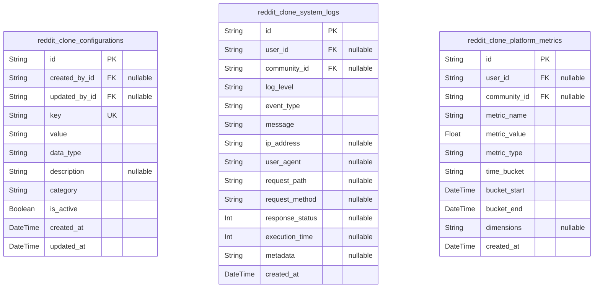
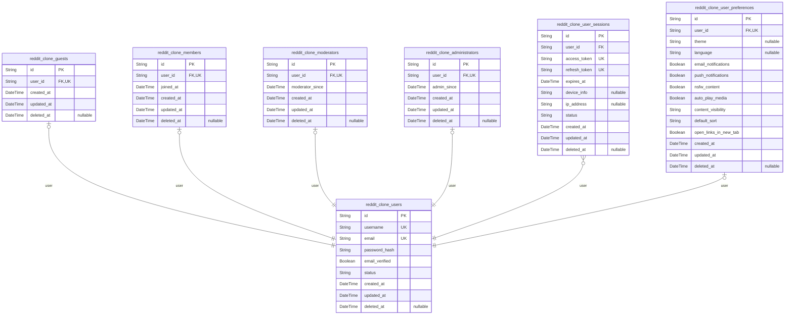
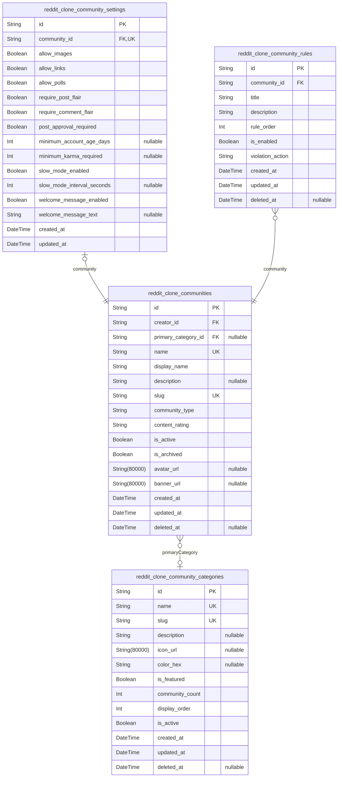
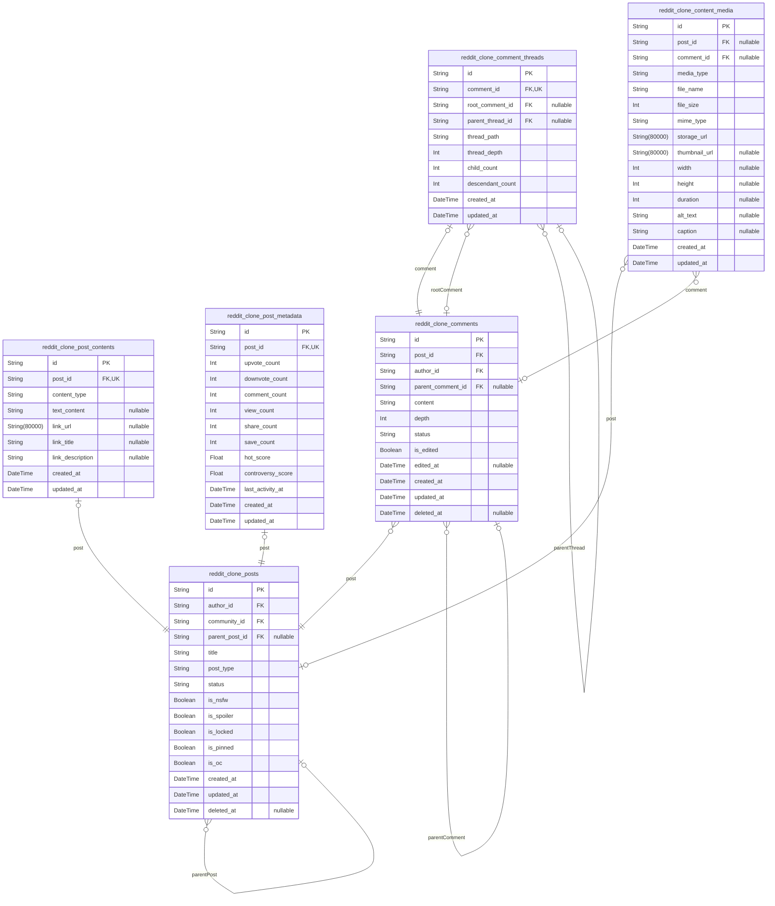
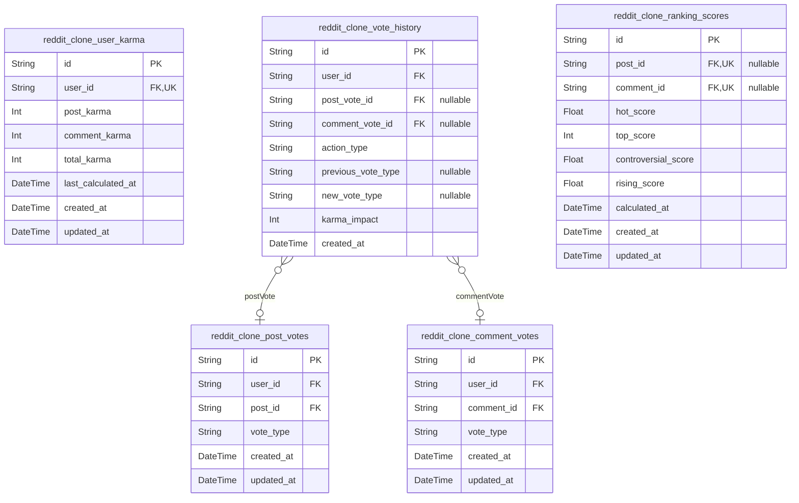
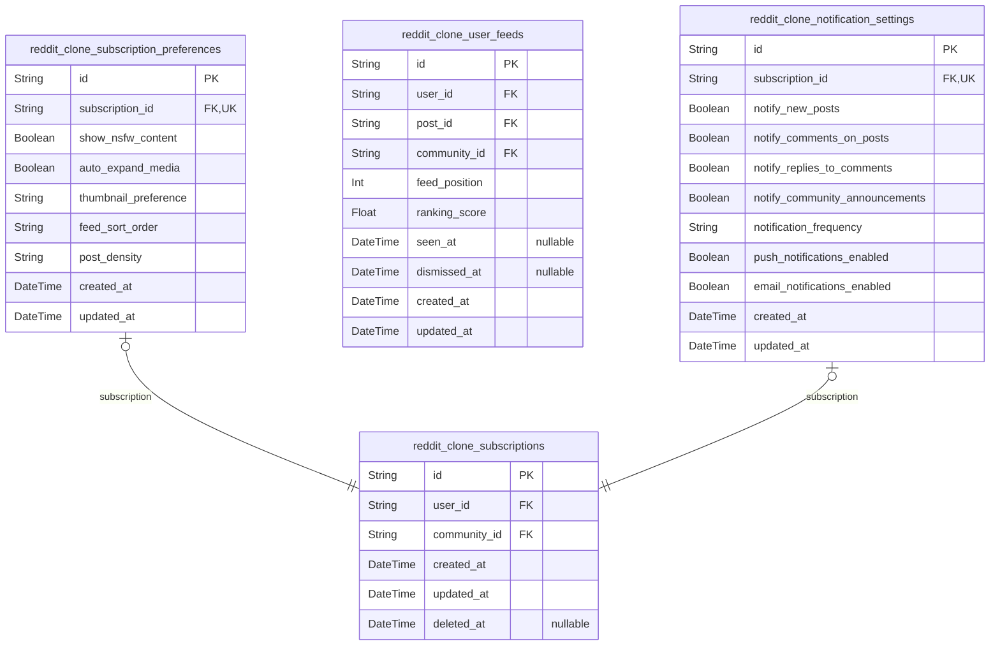
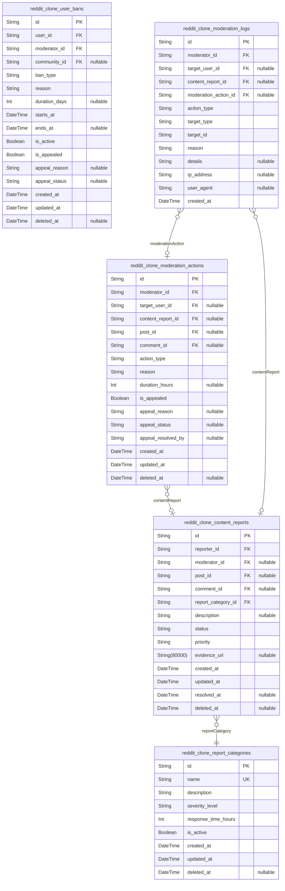
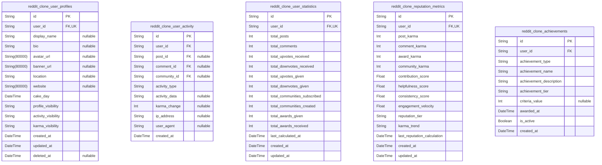

# Prisma Markdown

> Generated by [`prisma-markdown`](https://github.com/samchon/prisma-markdown)

- [Systematic](#systematic)
- [Actors](#actors)
- [Communities](#communities)
- [Content](#content)
- [Voting](#voting)
- [Subscriptions](#subscriptions)
- [Moderation](#moderation)
- [Profiles](#profiles)

## Systematic

### `reddit_clone_configurations`

System-wide configuration settings and parameters for the Reddit-like
platform. Stores key-value pairs for platform customization, feature
flags, and operational parameters that control system behavior across all
domains. [reddit_clone_users.id](#reddit_clone_users) {@link
reddit_clone_communities.id}

Properties as follows:

- `id`: Primary Key.
- `created_by_id`: User who created this configuration. [reddit_clone_users.id](#reddit_clone_users)
- `updated_by_id`: User who last updated this configuration. [reddit_clone_users.id](#reddit_clone_users)
- `key`: Unique configuration key identifier.
- `value`: Configuration value stored as string.
- `data_type`: Data type of the configuration value (string, number, boolean, json).
- `description`: Human-readable description of the configuration setting.
- `category`
  > Configuration category for organization (authentication, content,
  > community, etc.).
- `is_active`: Whether this configuration setting is currently active.
- `created_at`: Timestamp when this configuration was created.
- `updated_at`: Timestamp when this configuration was last updated.

### `reddit_clone_system_logs`

Comprehensive system logging for audit trails, error tracking, and
operational monitoring. Captures user actions, system events, and
security incidents across the entire platform. {@link
reddit_clone_users.id} [reddit_clone_communities.id](#reddit_clone_communities)

Properties as follows:

- `id`: Primary Key.
- `user_id`: User who performed the action. [reddit_clone_users.id](#reddit_clone_users)
- `community_id`: Community where the action occurred. [reddit_clone_communities.id](#reddit_clone_communities)
- `log_level`: Log level severity (INFO, WARNING, ERROR, DEBUG).
- `event_type`: Type of event being logged (USER_LOGIN, POST_CREATED, VOTE_CAST, etc.).
- `message`: Detailed log message describing the event.
- `ip_address`: IP address of the request that triggered the log entry.
- `user_agent`: User agent string from the client making the request.
- `request_path`: HTTP request path that triggered the event.
- `request_method`: HTTP request method (GET, POST, PUT, DELETE).
- `response_status`: HTTP response status code.
- `execution_time`: Request execution time in milliseconds.
- `metadata`: Additional metadata about the event in JSON format.
- `created_at`: Timestamp when this log entry was created.

### `reddit_clone_platform_metrics`

Platform-wide performance and usage metrics tracking. Collects key
performance indicators, user engagement statistics, and system health
metrics for monitoring and analytics. [reddit_clone_users.id](#reddit_clone_users)
[reddit_clone_communities.id](#reddit_clone_communities)

Properties as follows:

- `id`: Primary Key.
- `user_id`
  > User associated with this metric (if user-specific). {@link
  > reddit_clone_users.id}
- `community_id`
  > Community associated with this metric (if community-specific). {@link
  > reddit_clone_communities.id}
- `metric_name`
  > Name of the metric being tracked (active_users, post_count, vote_count,
  > etc.).
- `metric_value`: Numerical value of the metric.
- `metric_type`: Type of metric (COUNTER, GAUGE, HISTOGRAM, SUMMARY).
- `time_bucket`: Time aggregation bucket (HOURLY, DAILY, WEEKLY, MONTHLY).
- `bucket_start`: Start timestamp of the time bucket for this metric.
- `bucket_end`: End timestamp of the time bucket for this metric.
- `dimensions`
  > Additional dimensions for the metric in JSON format (user_role,
  > content_type, etc.).
- `created_at`: Timestamp when this metric was recorded.

## Actors

### `reddit_clone_users`

Base user entity containing authentication and core profile information.
This table serves as the foundation for all user roles in the platform,
storing common authentication data and basic profile details. {@link
reddit_clone_guests}, [reddit_clone_members](#reddit_clone_members), {@link
reddit_clone_moderators}, [reddit_clone_administrators](#reddit_clone_administrators)

Properties as follows:

- `id`: Primary Key.
- `username`: Unique username for the user account.
- `email`: User's email address for authentication and notifications.
- `password_hash`: Hashed password for user authentication using bcrypt.
- `email_verified`: Whether the user's email address has been verified.
- `status`: Current status of the user account (active, suspended, banned).
- `created_at`: Timestamp when the user account was created.
- `updated_at`: Timestamp when the user account was last updated.
- `deleted_at`: Timestamp when the user account was soft deleted.

### `reddit_clone_guests`

Guest user role extending the base user entity with limited platform
access. Guests have restricted permissions compared to registered
members. [reddit_clone_users](#reddit_clone_users)

Properties as follows:

- `id`: Primary Key.
- `user_id`: Reference to the base user entity. [reddit_clone_users.id](#reddit_clone_users)
- `created_at`: Timestamp when the guest role was assigned.
- `updated_at`: Timestamp when the guest role was last updated.
- `deleted_at`: Timestamp when the guest role was soft deleted.

### `reddit_clone_members`

Member user role extending the base user entity with full platform
access. Members can create content, vote, and participate in communities.
[reddit_clone_users](#reddit_clone_users)

Properties as follows:

- `id`: Primary Key.
- `user_id`: Reference to the base user entity. [reddit_clone_users.id](#reddit_clone_users)
- `joined_at`: Timestamp when the user became a member.
- `created_at`: Timestamp when the member role was created.
- `updated_at`: Timestamp when the member role was last updated.
- `deleted_at`: Timestamp when the member role was soft deleted.

### `reddit_clone_moderators`

Moderator user role extending the base user entity with community
moderation privileges. Moderators can manage content and users within
their assigned communities. [reddit_clone_users](#reddit_clone_users)

Properties as follows:

- `id`: Primary Key.
- `user_id`: Reference to the base user entity. [reddit_clone_users.id](#reddit_clone_users)
- `moderator_since`: Timestamp when the user became a moderator.
- `created_at`: Timestamp when the moderator role was created.
- `updated_at`: Timestamp when the moderator role was last updated.
- `deleted_at`: Timestamp when the moderator role was soft deleted.

### `reddit_clone_administrators`

Administrator user role extending the base user entity with platform-wide
administrative privileges. Administrators have system-level access and
can manage all communities and users. [reddit_clone_users](#reddit_clone_users)

Properties as follows:

- `id`: Primary Key.
- `user_id`: Reference to the base user entity. [reddit_clone_users.id](#reddit_clone_users)
- `admin_since`: Timestamp when the user became an administrator.
- `created_at`: Timestamp when the administrator role was created.
- `updated_at`: Timestamp when the administrator role was last updated.
- `deleted_at`: Timestamp when the administrator role was soft deleted.

### `reddit_clone_user_sessions`

User authentication sessions for maintaining login state and security.
Stores JWT tokens and session metadata for authenticated users. {@link
reddit_clone_users}

Properties as follows:

- `id`: Primary Key.
- `user_id`: Reference to the user who owns this session. [reddit_clone_users.id](#reddit_clone_users)
- `access_token`: JWT access token for session authentication.
- `refresh_token`: JWT refresh token for session renewal.
- `expires_at`: Timestamp when the session expires.
- `device_info`: Information about the device used for this session.
- `ip_address`: IP address from which the session was created.
- `status`: Session status: active, expired, revoked.
- `created_at`: Timestamp when the session was created.
- `updated_at`: Timestamp when the session was last updated.
- `deleted_at`: Timestamp when the session was soft deleted.

### `reddit_clone_user_preferences`

User preferences and settings for personalization and platform behavior
customization. Stores user-specific configuration options. {@link
reddit_clone_users}

Properties as follows:

- `id`: Primary Key.
- `user_id`
  > Reference to the user who owns these preferences. {@link
  > reddit_clone_users.id}
- `theme`: User interface theme preference (light, dark, auto).
- `language`: Preferred language for the platform interface.
- `email_notifications`: Whether the user wants to receive email notifications.
- `push_notifications`: Whether the user wants to receive push notifications.
- `nsfw_content`: Whether the user wants to see NSFW content.
- `auto_play_media`: Whether media should auto-play for this user.
- `content_visibility`: Content visibility preference: show_all, hide_nsfw, hide_spoilers.
- `default_sort`: Default content sorting preference: hot, new, top, controversial.
- `open_links_in_new_tab`: Whether to open links in new browser tabs.
- `created_at`: Timestamp when the preferences were created.
- `updated_at`: Timestamp when the preferences were last updated.
- `deleted_at`: Timestamp when the preferences were soft deleted.

## Communities

### `reddit_clone_communities`

Core community entity representing subreddit-like communities where users
can create and share content. Communities are organized around specific
topics and managed by moderators. [reddit_clone_users.id](#reddit_clone_users) {@link
reddit_clone_members.id} [reddit_clone_moderators.id](#reddit_clone_moderators)

Properties as follows:

- `id`: Primary Key.
- `creator_id`
  > User who created this community. References the creator's user ID. {@link
  > reddit_clone_users.id}
- `primary_category_id`
  > Primary category classification for this community. {@link
  > reddit_clone_community_categories.id}
- `name`
  > Unique name identifier for the community (e.g., 'programming', 'gaming').
  > Used in URLs and community discovery.
- `display_name`
  > Human-readable display name for the community (e.g., 'Programming',
  > 'Video Games').
- `description`
  > Community description explaining the purpose, topics, and guidelines.
  > Maximum 500 characters.
- `slug`
  > URL-friendly version of the community name for use in paths (e.g.,
  > 'r/programming'). Must be unique.
- `community_type`
  > Type of community: 'public' (anyone can view/post), 'restricted'
  > (viewable by all, posting requires approval), or 'private' (invite-only).
- `content_rating`
  > Content rating: 'sfw' (Safe For Work) or 'nsfw' (Not Safe For Work).
  > Controls content visibility and warnings.
- `is_active`
  > Whether the community is currently active and accepting new content.
  > Inactive communities are archived.
- `is_archived`
  > Whether the community has been archived and no longer accepts new content
  > or subscriptions.
- `avatar_url`
  > URL to the community's avatar image. Typically a small square image
  > representing the community.
- `banner_url`
  > URL to the community's banner image. Displayed at the top of the
  > community page.
- `created_at`: Timestamp when the community was created.
- `updated_at`: Timestamp when the community was last updated.
- `deleted_at`: Timestamp when the community was soft deleted. Null if not deleted.

### `reddit_clone_community_settings`

Configuration and preference settings for individual communities. Stores
community-specific customization options that moderators can adjust.
[reddit_clone_communities.id](#reddit_clone_communities)

Properties as follows:

- `id`: Primary Key.
- `community_id`
  > Community these settings belong to. Each community has exactly one
  > settings record. [reddit_clone_communities.id](#reddit_clone_communities)
- `allow_images`
  > Whether this community allows image posts. Can be disabled for text-only
  > communities.
- `allow_links`
  > Whether this community allows link posts. Can be disabled for
  > discussion-only communities.
- `allow_polls`
  > Whether this community allows poll posts. Requires additional poll
  > functionality.
- `require_post_flair`
  > Whether posts in this community must have flair assigned before
  > submission.
- `require_comment_flair`
  > Whether comments in this community must have flair. Less common but
  > available.
- `post_approval_required`
  > Whether new posts require moderator approval before becoming visible.
  > Used in restricted communities.
- `minimum_account_age_days`
  > Minimum account age in days required to post in this community. Helps
  > prevent spam.
- `minimum_karma_required`
  > Minimum karma points required to post in this community. Helps ensure
  > quality contributors.
- `slow_mode_enabled`
  > Whether slow mode is enabled, limiting how frequently users can
  > post/comments.
- `slow_mode_interval_seconds`: Time interval in seconds between posts/comments when slow mode is enabled.
- `welcome_message_enabled`: Whether to send a welcome message to new subscribers.
- `welcome_message_text`
  > Custom welcome message text sent to new subscribers when
  > welcome_message_enabled is true.
- `created_at`: Timestamp when these settings were created.
- `updated_at`: Timestamp when these settings were last updated.

### `reddit_clone_community_rules`

Community-specific rules and guidelines that members must follow. Each
community can have multiple rules that are displayed to users. {@link
reddit_clone_communities.id}

Properties as follows:

- `id`: Primary Key.
- `community_id`
  > Community that this rule belongs to. Rules are specific to each
  > community. [reddit_clone_communities.id](#reddit_clone_communities)
- `title`
  > Short, descriptive title for the rule (e.g., 'No Spam', 'Be Civil').
  > Maximum 100 characters.
- `description`
  > Detailed explanation of the rule and its enforcement. Maximum 1000
  > characters.
- `rule_order`
  > Display order for the rule within the community's rules list. Lower
  > numbers appear first.
- `is_enabled`
  > Whether this rule is currently active and being enforced. Disabled rules
  > are not shown to users.
- `violation_action`
  > Action taken when this rule is violated: 'warning', 'post_removal',
  > 'temporary_ban', 'permanent_ban'.
- `created_at`: Timestamp when this rule was created.
- `updated_at`: Timestamp when this rule was last updated.
- `deleted_at`: Timestamp when this rule was soft deleted. Null if not deleted.

### `reddit_clone_community_categories`

Taxonomy system for categorizing communities by topic. Used for community
discovery and organization. Categories are platform-wide and managed by
administrators.

Properties as follows:

- `id`: Primary Key.
- `name`
  > Unique name of the category (e.g., 'Technology', 'Sports',
  > 'Entertainment'). Used for display and organization.
- `slug`
  > URL-friendly version of the category name for use in navigation and
  > filtering.
- `description`
  > Description explaining what types of communities belong in this category.
  > Maximum 500 characters.
- `icon_url`
  > URL to an icon representing this category. Used in category browsing
  > interfaces.
- `color_hex`
  > Hex color code for this category (e.g., '#FF6B35'). Used for visual
  > differentiation.
- `is_featured`
  > Whether this category is featured and shown prominently in category
  > discovery.
- `community_count`
  > Number of communities currently categorized under this category. Updated
  > automatically.
- `display_order`
  > Order in which this category appears in category lists. Lower numbers
  > appear first.
- `is_active`
  > Whether this category is active and available for use. Inactive
  > categories are hidden.
- `created_at`: Timestamp when this category was created.
- `updated_at`: Timestamp when this category was last updated.
- `deleted_at`: Timestamp when this category was soft deleted. Null if not deleted.

## Content

### `reddit_clone_posts`

Main posts table containing core post information and relationships.
Posts are the primary content entities that users create within
communities. Each post can be of different types (text, link, image) and
supports voting, commenting, and ranking functionality. {@link
reddit_clone_users.id} [reddit_clone_communities.id](#reddit_clone_communities)

Properties as follows:

- `id`: Primary Key.
- `author_id`: User who created the post. [reddit_clone_users.id](#reddit_clone_users)
- `community_id`: Community where the post is published. [reddit_clone_communities.id](#reddit_clone_communities)
- `parent_post_id`: Original post if this is a cross-post. [reddit_clone_posts.id](#reddit_clone_posts)
- `title`
  > Post title displayed to users. Limited to 300 characters for display
  > purposes.
- `post_type`
  > Type of post: text, link, or image. Determines which content table
  > contains the actual content.
- `status`
  > Post status: published, draft, removed, or archived. Controls visibility
  > and moderation state.
- `is_nsfw`
  > Flag indicating Not Safe For Work content. Controls content filtering and
  > warnings.
- `is_spoiler`
  > Flag indicating spoiler content. Controls content visibility with
  > warnings.
- `is_locked`
  > Whether comments are locked on this post. Prevents further discussion
  > when enabled.
- `is_pinned`
  > Whether post is pinned in its community. Featured posts appear at the top
  > of community feeds.
- `is_oc`
  > Original Content flag. Indicates user-created original content vs shared
  > content.
- `created_at`
  > Timestamp when the post was created. Used for sorting and archival
  > purposes.
- `updated_at`: Timestamp when the post was last updated. Tracks edits and modifications.
- `deleted_at`
  > Timestamp when the post was soft-deleted. Allows for content recovery and
  > moderation.

### `reddit_clone_post_contents`

Polymorphic content storage for different post types. Separates content
from post metadata to support multiple content formats efficiently. Text
posts store markdown content, link posts store URLs, and image posts
reference media files. [reddit_clone_posts.id](#reddit_clone_posts)

Properties as follows:

- `id`: Primary Key.
- `post_id`: Post that this content belongs to. [reddit_clone_posts.id](#reddit_clone_posts)
- `content_type`
  > Type of content: text, link, or image. Determines which content field is
  > populated.
- `text_content`
  > Markdown-formatted text content for text posts. Supports rich formatting
  > and links.
- `link_url`: URL for link posts. Must be valid HTTP/HTTPS URL format.
- `link_title`: Title extracted from or provided for link posts. Used for link previews.
- `link_description`
  > Description extracted from or provided for link posts. Used for link
  > previews.
- `created_at`: Timestamp when the content was created. Tracks content creation timeline.
- `updated_at`
  > Timestamp when the content was last updated. Tracks edits and
  > modifications.

### `reddit_clone_post_metadata`

Analytical metadata for posts used in ranking algorithms and performance
tracking. Contains vote counts, view statistics, and engagement metrics
that drive content discovery and sorting algorithms. {@link
reddit_clone_posts.id}

Properties as follows:

- `id`: Primary Key.
- `post_id`: Post that this metadata belongs to. [reddit_clone_posts.id](#reddit_clone_posts)
- `upvote_count`
  > Total number of upvotes received. Used in ranking algorithms and user
  > karma calculation.
- `downvote_count`
  > Total number of downvotes received. Used in ranking algorithms and user
  > karma calculation.
- `comment_count`
  > Total number of comments on the post. Indicates engagement level for
  > ranking.
- `view_count`
  > Total number of views the post has received. Measures content reach and
  > popularity.
- `share_count`
  > Total number of times the post has been shared. Measures viral potential
  > and reach.
- `save_count`
  > Total number of times users have saved the post. Indicates content value
  > and utility.
- `hot_score`
  > Calculated hot score for ranking algorithm. Combines votes, comments, and
  > time decay.
- `controversy_score`
  > Calculated controversy score for controversial sorting. Measures vote
  > polarization.
- `last_activity_at`
  > Timestamp of last engagement activity (vote, comment, view). Used for
  > ranking freshness.
- `created_at`: Timestamp when metadata record was created. Tracks metadata lifecycle.
- `updated_at`
  > Timestamp when metadata was last updated. Ensures data freshness for
  > ranking.

### `reddit_clone_comments`

User comments on posts with support for nested threading. Comments are
primary entities that require independent management for search,
moderation, and user activity tracking. Each comment can have parent
comments for threaded discussions. [reddit_clone_posts.id](#reddit_clone_posts) {@link
reddit_clone_users.id}

Properties as follows:

- `id`: Primary Key.
- `post_id`: Post that this comment belongs to. [reddit_clone_posts.id](#reddit_clone_posts)
- `author_id`: User who created the comment. [reddit_clone_users.id](#reddit_clone_users)
- `parent_comment_id`
  > Parent comment for nested threading. Null for top-level comments. {@link
  > reddit_clone_comments.id}
- `content`
  > Markdown-formatted comment text. Supports rich formatting, links, and
  > code blocks.
- `depth`
  > Nesting depth of comment in thread. 0 for top-level, increments for each
  > reply level.
- `status`
  > Comment status: published, removed, or archived. Controls visibility and
  > moderation.
- `is_edited`: Flag indicating if comment has been edited. Shows edit indicator to users.
- `edited_at`: Timestamp when comment was last edited. Tracks modification history.
- `created_at`
  > Timestamp when comment was created. Used for sorting and archival
  > purposes.
- `updated_at`: Timestamp when comment was last updated. Tracks edits and modifications.
- `deleted_at`
  > Timestamp when comment was soft-deleted. Allows for content recovery and
  > moderation.

### `reddit_clone_comment_threads`

Hierarchical structure for organizing nested comments efficiently.
Maintains thread relationships and enables efficient querying of comment
trees. Supports up to 10 levels of nesting for organized discussions
while maintaining performance. [reddit_clone_comments.id](#reddit_clone_comments)

Properties as follows:

- `id`: Primary Key.
- `comment_id`
  > Comment that this thread record belongs to. {@link
  > reddit_clone_comments.id}
- `root_comment_id`
  > Top-level comment that starts this thread. {@link
  > reddit_clone_comments.id}
- `parent_thread_id`
  > Parent thread in the hierarchy. Null for top-level threads. {@link
  > reddit_clone_comment_threads.id}
- `thread_path`
  > Materialized path for efficient hierarchical queries. Uses ltree-like
  > structure for performance.
- `thread_depth`
  > Depth of this thread in the hierarchy. Used for performance optimization
  > and display limits.
- `child_count`
  > Number of direct child comments in this thread. Used for efficient thread
  > management.
- `descendant_count`
  > Total number of descendants in this thread subtree. Used for performance
  > optimization.
- `created_at`: Timestamp when thread record was created. Tracks thread lifecycle.
- `updated_at`
  > Timestamp when thread record was last updated. Ensures data freshness for
  > queries.

### `reddit_clone_content_media`

Media attachments for posts and comments supporting images and other file
types. Provides centralized media management with proper storage
references, metadata, and access controls. Supports multiple media types
with validation and optimization. [reddit_clone_posts.id](#reddit_clone_posts) {@link
reddit_clone_comments.id}

Properties as follows:

- `id`: Primary Key.
- `post_id`
  > Post that this media belongs to. Null if attached to comment. {@link
  > reddit_clone_posts.id}
- `comment_id`
  > Comment that this media belongs to. Null if attached to post. {@link
  > reddit_clone_comments.id}
- `media_type`
  > Type of media: image, video, gif, or document. Determines rendering and
  > processing.
- `file_name`
  > Original filename of uploaded media. Preserved for user reference and
  > downloads.
- `file_size`
  > Size of media file in bytes. Used for storage management and upload
  > limits.
- `mime_type`
  > MIME type of media file. Ensures proper content-type handling and
  > security.
- `storage_url`
  > URL to media file in storage service. References optimized versions and
  > CDN.
- `thumbnail_url`
  > URL to thumbnail version of media. Used for previews and performance
  > optimization.
- `width`: Width of media in pixels for images/videos. Used for responsive rendering.
- `height`
  > Height of media in pixels for images/videos. Used for responsive
  > rendering.
- `duration`
  > Duration in seconds for video/audio media. Used for player controls and
  > UI.
- `alt_text`
  > Accessibility description of media content. Required for screen readers
  > and SEO.
- `caption`
  > User-provided caption for media. Provides context and additional
  > information.
- `created_at`
  > Timestamp when media was uploaded. Tracks media lifecycle and storage
  > management.
- `updated_at`: Timestamp when media metadata was last updated. Ensures data accuracy.

## Voting

### `reddit_clone_post_votes`

Individual votes cast by users on posts. Tracks upvotes and downvotes
separately for post scoring and user karma calculations. {@link
reddit_clone_posts.id} [reddit_clone_users.id](#reddit_clone_users)

Properties as follows:

- `id`: Primary Key.
- `user_id`: User who cast the vote. [reddit_clone_users.id](#reddit_clone_users)
- `post_id`: Post that received the vote. [reddit_clone_posts.id](#reddit_clone_posts)
- `vote_type`: Type of vote cast: 'upvote' or 'downvote'.
- `created_at`: Timestamp when the vote was cast.
- `updated_at`: Timestamp when the vote was last updated.

### `reddit_clone_comment_votes`

Individual votes cast by users on comments. Tracks upvotes and downvotes
separately for comment scoring and user karma calculations. {@link
reddit_clone_comments.id} [reddit_clone_users.id](#reddit_clone_users)

Properties as follows:

- `id`: Primary Key.
- `user_id`: User who cast the vote. [reddit_clone_users.id](#reddit_clone_users)
- `comment_id`: Comment that received the vote. [reddit_clone_comments.id](#reddit_clone_comments)
- `vote_type`: Type of vote cast: 'upvote' or 'downvote'.
- `created_at`: Timestamp when the vote was cast.
- `updated_at`: Timestamp when the vote was last updated.

### `reddit_clone_user_karma`

Aggregated karma score for users based on post and comment votes. Used
for user reputation tracking and content ranking algorithms. {@link
reddit_clone_users.id}

Properties as follows:

- `id`: Primary Key.
- `user_id`: User whose karma is being tracked. [reddit_clone_users.id](#reddit_clone_users)
- `post_karma`
  > Total karma earned from post votes. Calculated as (post upvotes - post
  > downvotes).
- `comment_karma`
  > Total karma earned from comment votes. Calculated as (comment upvotes -
  > comment downvotes).
- `total_karma`: Combined karma score (post_karma + comment_karma).
- `last_calculated_at`: Timestamp when karma was last calculated.
- `created_at`: Timestamp when karma tracking started for this user.
- `updated_at`: Timestamp when karma was last updated.

### `reddit_clone_vote_history`

Historical record of vote changes for audit trail and karma
recalibration. Tracks vote creation, updates, and deletions. {@link
reddit_clone_post_votes.id} [reddit_clone_comment_votes.id](#reddit_clone_comment_votes) {@link
reddit_clone_users.id}

Properties as follows:

- `id`: Primary Key.
- `user_id`: User who cast the vote. [reddit_clone_users.id](#reddit_clone_users)
- `post_vote_id`
  > Post vote record that was changed (nullable for comment votes). {@link
  > reddit_clone_post_votes.id}
- `comment_vote_id`
  > Comment vote record that was changed (nullable for post votes). {@link
  > reddit_clone_comment_votes.id}
- `action_type`: Type of vote action: 'created', 'updated', 'deleted'.
- `previous_vote_type`: Previous vote type before change (null for creation).
- `new_vote_type`: New vote type after change (null for deletion).
- `karma_impact`
  > Net karma impact of this vote change (+1 for upvote, -1 for downvote, 0
  > for no change).
- `created_at`: Timestamp when the vote history record was created.

### `reddit_clone_ranking_scores`

Pre-calculated ranking scores for posts and comments to optimize content
sorting algorithms. Used for 'hot', 'top', 'controversial', and 'rising'
sorting methods. [reddit_clone_posts.id](#reddit_clone_posts) {@link
reddit_clone_comments.id}

Properties as follows:

- `id`: Primary Key.
- `post_id`
  > Post being scored (nullable for comment scoring). {@link
  > reddit_clone_posts.id}
- `comment_id`
  > Comment being scored (nullable for post scoring). {@link
  > reddit_clone_comments.id}
- `hot_score`
  > Hot ranking score based on votes and time decay. Higher scores indicate
  > trending content.
- `top_score`: Top ranking score based on net votes (upvotes - downvotes).
- `controversial_score`
  > Controversial ranking score based on high vote counts in both directions.
  > Higher scores indicate controversial content.
- `rising_score`
  > Rising ranking score based on recent vote velocity. Higher scores
  > indicate rapidly gaining popularity.
- `calculated_at`: Timestamp when scores were last calculated.
- `created_at`: Timestamp when the ranking record was created.
- `updated_at`: Timestamp when the ranking record was last updated.

## Subscriptions

### `reddit_clone_subscriptions`

Manages user subscriptions to communities. This table represents the
many-to-many relationship between users and communities, tracking when
users join communities and their subscription status. Each subscription
enables personalized content delivery and community-specific
notifications. [reddit_clone_users.id](#reddit_clone_users) {@link
reddit_clone_communities.id}

Properties as follows:

- `id`: Primary Key.
- `user_id`: Subscribing user's identifier. [reddit_clone_users.id](#reddit_clone_users)
- `community_id`: Community being subscribed to. [reddit_clone_communities.id](#reddit_clone_communities)
- `created_at`: Timestamp when the user subscribed to the community.
- `updated_at`: Timestamp when the subscription was last updated.
- `deleted_at`: Timestamp when the subscription was canceled (soft delete).

### `reddit_clone_subscription_preferences`

Stores user-specific preferences for each community subscription. These
preferences control how content is displayed and what notifications are
received for subscribed communities. This table extends subscription
behavior with personalized settings. {@link
reddit_clone_subscriptions.id}

Properties as follows:

- `id`: Primary Key.
- `subscription_id`: Associated subscription record. [reddit_clone_subscriptions.id](#reddit_clone_subscriptions)
- `show_nsfw_content`: Whether to show NSFW (Not Safe For Work) content from this community.
- `auto_expand_media`: Whether to automatically expand media content from this community.
- `thumbnail_preference`: Preferred thumbnail display setting (e.g., 'always', 'never', 'default').
- `feed_sort_order`
  > Preferred sorting algorithm for this community's content in feed (e.g.,
  > 'hot', 'new', 'top').
- `post_density`: Preferred post display density (e.g., 'compact', 'card', 'classic').
- `created_at`: Timestamp when the preference record was created.
- `updated_at`: Timestamp when the preference record was last updated.

### `reddit_clone_user_feeds`

Stores aggregated feed data for users based on their community
subscriptions. This table enables efficient delivery of personalized
content by pre-aggregating posts from subscribed communities. The feed is
updated as new content is published. [reddit_clone_users.id](#reddit_clone_users) {@link
reddit_clone_posts.id} [reddit_clone_communities.id](#reddit_clone_communities)

Properties as follows:

- `id`: Primary Key.
- `user_id`: User receiving the feed content. [reddit_clone_users.id](#reddit_clone_users)
- `post_id`: Post included in the user's feed. [reddit_clone_posts.id](#reddit_clone_posts)
- `community_id`: Community where the post originated. [reddit_clone_communities.id](#reddit_clone_communities)
- `feed_position`: Position of this post in the user's personalized feed ranking.
- `ranking_score`
  > Calculated ranking score used for feed ordering (based on votes, time,
  > etc.).
- `seen_at`: Timestamp when the user viewed this post in their feed.
- `dismissed_at`: Timestamp when the user dismissed this post from their feed.
- `created_at`: Timestamp when this post was added to the user's feed.
- `updated_at`: Timestamp when the feed entry was last updated.

### `reddit_clone_notification_settings`

Manages user notification preferences for subscribed communities.
Controls what types of notifications users receive and how they are
delivered for each community subscription. Enables granular control over
notification frequency and delivery methods. {@link
reddit_clone_subscriptions.id}

Properties as follows:

- `id`: Primary Key.
- `subscription_id`: Associated subscription record. [reddit_clone_subscriptions.id](#reddit_clone_subscriptions)
- `notify_new_posts`: Whether to receive notifications for new posts in this community.
- `notify_comments_on_posts`
  > Whether to receive notifications for comments on posts the user has
  > engaged with.
- `notify_replies_to_comments`: Whether to receive notifications for replies to the user's comments.
- `notify_community_announcements`: Whether to receive notifications for community announcements and updates.
- `notification_frequency`
  > Preferred notification frequency (e.g., 'immediate', 'daily_digest',
  > 'weekly_summary').
- `push_notifications_enabled`: Whether push notifications are enabled for this community.
- `email_notifications_enabled`: Whether email notifications are enabled for this community.
- `created_at`: Timestamp when the notification settings were created.
- `updated_at`: Timestamp when the notification settings were last updated.

## Moderation

### `reddit_clone_content_reports`

Content reports submitted by users for moderation review. Users can
report posts or comments that violate community guidelines or platform
policies. Each report is categorized and tracked through the moderation
workflow until resolution.

Properties as follows:

- `id`: Primary Key.
- `reporter_id`: User who submitted the report. [reddit_clone_users.id](#reddit_clone_users)
- `moderator_id`
  > Moderator assigned to handle the report. {@link
  > reddit_clone_moderators.id}
- `post_id`: Reported post content. [reddit_clone_posts.id](#reddit_clone_posts)
- `comment_id`: Reported comment content. [reddit_clone_comments.id](#reddit_clone_comments)
- `report_category_id`
  > Category of the reported violation. {@link
  > reddit_clone_report_categories.id}
- `description`: Detailed description of the reported violation provided by the reporter.
- `status`: Current status of the report: pending, under_review, resolved, dismissed.
- `priority`: Report priority level: low, medium, high, critical.
- `evidence_url`: Optional URL to supporting evidence or screenshots.
- `created_at`: Timestamp when the report was submitted.
- `updated_at`: Timestamp when the report was last updated.
- `resolved_at`: Timestamp when the report was resolved.
- `deleted_at`: Timestamp when the report was soft deleted.

### `reddit_clone_moderation_actions`

Actions taken by moderators in response to content reports or community
violations. This table tracks all moderation decisions and their
outcomes.

Properties as follows:

- `id`: Primary Key.
- `moderator_id`: Moderator who performed the action. [reddit_clone_moderators.id](#reddit_clone_moderators)
- `target_user_id`
  > User who was the target of the moderation action. {@link
  > reddit_clone_users.id}
- `content_report_id`
  > Content report that triggered this action. {@link
  > reddit_clone_content_reports.id}
- `post_id`: Post that was moderated. [reddit_clone_posts.id](#reddit_clone_posts)
- `comment_id`: Comment that was moderated. [reddit_clone_comments.id](#reddit_clone_comments)
- `action_type`
  > Type of moderation action: remove_content, warn_user, temporary_ban,
  > permanent_ban, approve_content, dismiss_report.
- `reason`: Detailed explanation for the moderation action.
- `duration_hours`: Duration of temporary actions in hours. Null for permanent actions.
- `is_appealed`: Whether the action has been appealed by the target user.
- `appeal_reason`: Reason provided by user for appealing the action.
- `appeal_status`: Status of the appeal: pending, approved, rejected.
- `appeal_resolved_by`: Moderator or admin who resolved the appeal.
- `created_at`: Timestamp when the moderation action was taken.
- `updated_at`: Timestamp when the action was last updated.
- `deleted_at`: Timestamp when the action was soft deleted.

### `reddit_clone_user_bans`

User ban records for community or platform violations. Tracks ban
duration, reason, and status for users who have been restricted from
platform access.

Properties as follows:

- `id`: Primary Key.
- `user_id`: User who is banned. [reddit_clone_users.id](#reddit_clone_users)
- `moderator_id`: Moderator who issued the ban. [reddit_clone_moderators.id](#reddit_clone_moderators)
- `community_id`
  > Community where the ban applies. Null for platform-wide bans. {@link
  > reddit_clone_communities.id}
- `ban_type`: Type of ban: temporary, permanent, shadow.
- `reason`: Detailed reason for the ban.
- `duration_days`: Duration of temporary ban in days. Null for permanent bans.
- `starts_at`: Timestamp when the ban takes effect.
- `ends_at`: Timestamp when the ban expires. Null for permanent bans.
- `is_active`: Whether the ban is currently active.
- `is_appealed`: Whether the ban has been appealed.
- `appeal_reason`: Reason provided by user for appealing the ban.
- `appeal_status`: Status of the appeal: pending, approved, rejected.
- `created_at`: Timestamp when the ban was issued.
- `updated_at`: Timestamp when the ban was last updated.
- `deleted_at`: Timestamp when the ban was soft deleted.

### `reddit_clone_moderation_logs`

Comprehensive audit log of all moderation activities. This snapshot table
preserves historical moderation actions for transparency, accountability,
and compliance purposes.

Properties as follows:

- `id`: Primary Key.
- `moderator_id`: Moderator who performed the action. [reddit_clone_moderators.id](#reddit_clone_moderators)
- `target_user_id`
  > User who was affected by the moderation action. {@link
  > reddit_clone_users.id}
- `content_report_id`
  > Content report that triggered the action. {@link
  > reddit_clone_content_reports.id}
- `moderation_action_id`
  > Moderation action that was logged. {@link
  > reddit_clone_moderation_actions.id}
- `action_type`: Type of moderation action performed.
- `target_type`: Type of target: post, comment, user, community.
- `target_id`: ID of the target entity (post_id, comment_id, user_id, etc.).
- `reason`: Reason for the moderation action.
- `details`: Additional details about the moderation action.
- `ip_address`: IP address from which the action was performed.
- `user_agent`: User agent string of the moderator's browser.
- `created_at`: Timestamp when the log entry was created.

### `reddit_clone_report_categories`

Standardized categories for content reporting. Provides consistent
classification for user reports to streamline moderation workflows and
reporting analytics.

Properties as follows:

- `id`: Primary Key.
- `name`: Unique name of the report category.
- `description`: Detailed description of what constitutes this report category.
- `severity_level`: Severity level: low, medium, high, critical.
- `response_time_hours`: Target response time in hours for this category.
- `is_active`: Whether this report category is currently active.
- `created_at`: Timestamp when the category was created.
- `updated_at`: Timestamp when the category was last updated.
- `deleted_at`: Timestamp when the category was soft deleted.

## Profiles

### `reddit_clone_user_profiles`

Comprehensive user profile information including personal details,
preferences, and display settings. This table serves as the central
profile entity for user identity and customization. {@link
reddit_clone_users.id}

Properties as follows:

- `id`: Primary Key.
- `user_id`: Reference to the user account. [reddit_clone_users.id](#reddit_clone_users)
- `display_name`
  > User's public display name, different from username. Optional for users
  > who prefer username display.
- `bio`: User biography or about section text. Maximum 500 characters.
- `avatar_url`: URL to user's profile avatar image.
- `banner_url`: URL to user's profile banner image.
- `location`: User's geographic location for community discovery.
- `website`: User's personal website or social media link.
- `cake_day`: User's account creation anniversary date for annual celebration.
- `profile_visibility`: Profile visibility setting: public, followers_only, or private.
- `activity_visibility`: Activity feed visibility setting: public, followers_only, or private.
- `karma_visibility`: Karma score visibility setting: show, hide, or followers_only.
- `created_at`: Timestamp when the profile was created.
- `updated_at`: Timestamp when the profile was last updated.
- `deleted_at`: Timestamp when the profile was soft deleted.

### `reddit_clone_user_activity`

Comprehensive tracking of all user activities including posts, comments,
votes, subscriptions, and other interactions. This table provides
detailed activity history for user profiles and analytics. {@link
reddit_clone_users.id} [reddit_clone_posts.id](#reddit_clone_posts) {@link
reddit_clone_comments.id} [reddit_clone_communities.id](#reddit_clone_communities)

Properties as follows:

- `id`: Primary Key.
- `user_id`: User who performed the activity. [reddit_clone_users.id](#reddit_clone_users)
- `post_id`: Related post if activity involves a post. [reddit_clone_posts.id](#reddit_clone_posts)
- `comment_id`
  > Related comment if activity involves a comment. {@link
  > reddit_clone_comments.id}
- `community_id`
  > Related community if activity involves a community. {@link
  > reddit_clone_communities.id}
- `activity_type`
  > Type of activity: post_created, comment_created, post_upvoted,
  > post_downvoted, comment_upvoted, comment_downvoted, community_subscribed,
  > community_unsubscribed, post_saved, post_hidden, etc.
- `activity_data`: Additional JSON data specific to the activity type for detailed tracking.
- `karma_change`: Karma points gained or lost from this activity.
- `ip_address`: IP address from which the activity was performed for security tracking.
- `user_agent`: User agent string from the client for analytics.
- `created_at`: Timestamp when the activity occurred.

### `reddit_clone_user_statistics`

Aggregated statistics and metrics for user performance and engagement
tracking. This table provides pre-computed statistics for efficient
querying and user analytics. [reddit_clone_users.id](#reddit_clone_users)

Properties as follows:

- `id`: Primary Key.
- `user_id`: User these statistics belong to. [reddit_clone_users.id](#reddit_clone_users)
- `total_posts`: Total number of posts created by the user.
- `total_comments`: Total number of comments created by the user.
- `total_upvotes_received`: Total number of upvotes received across all posts and comments.
- `total_downvotes_received`: Total number of downvotes received across all posts and comments.
- `total_upvotes_given`: Total number of upvotes given by the user.
- `total_downvotes_given`: Total number of downvotes given by the user.
- `total_communities_subscribed`: Total number of communities the user is subscribed to.
- `total_communities_created`: Total number of communities created by the user.
- `total_awards_given`: Total number of awards given to other users.
- `total_awards_received`: Total number of awards received from other users.
- `last_calculated_at`: Timestamp when these statistics were last calculated.
- `created_at`: Timestamp when the statistics record was created.
- `updated_at`: Timestamp when the statistics record was last updated.

### `reddit_clone_reputation_metrics`

Detailed reputation metrics and karma breakdown for user reputation
tracking. This table provides granular reputation data beyond simple
karma totals. [reddit_clone_users.id](#reddit_clone_users)

Properties as follows:

- `id`: Primary Key.
- `user_id`: User these reputation metrics belong to. [reddit_clone_users.id](#reddit_clone_users)
- `post_karma`: Total karma earned from posts (upvotes - downvotes on posts).
- `comment_karma`: Total karma earned from comments (upvotes - downvotes on comments).
- `award_karma`: Karma earned from receiving awards from other users.
- `community_karma`: Karma earned from community-specific contributions and moderation.
- `contribution_score`: Weighted score based on quality and frequency of contributions.
- `helpfulness_score`: Score measuring how helpful the user's contributions are to others.
- `consistency_score`: Score measuring consistency of user engagement over time.
- `engagement_velocity`: Rate of recent engagement activity and contribution frequency.
- `reputation_tier`
  > User's current reputation tier: new_member, active_member,
  > trusted_member, community_leader, etc.
- `karma_trend`: Trend direction of karma: increasing, decreasing, or stable.
- `last_reputation_calculation`: Timestamp when reputation metrics were last calculated.
- `created_at`: Timestamp when the reputation metrics record was created.
- `updated_at`: Timestamp when the reputation metrics record was last updated.

### `reddit_clone_achievements`

User achievements and badges earned through platform participation and
contributions. This table tracks achievement awards and user recognition
milestones. [reddit_clone_users.id](#reddit_clone_users)

Properties as follows:

- `id`: Primary Key.
- `user_id`: User who earned the achievement. [reddit_clone_users.id](#reddit_clone_users)
- `achievement_type`
  > Type of achievement: karma_milestone, post_milestone, comment_milestone,
  > community_milestone, moderator_milestone, etc.
- `achievement_name`: Name of the achievement award.
- `achievement_description`: Description of what the achievement represents.
- `achievement_tier`: Tier level of the achievement: bronze, silver, gold, platinum, diamond.
- `criteria_value`: Value that triggered the achievement (e.g., karma threshold).
- `awarded_at`: Timestamp when the achievement was awarded.
- `is_active`: Whether the achievement is currently active and displayed.
- `created_at`: Timestamp when the achievement record was created.
