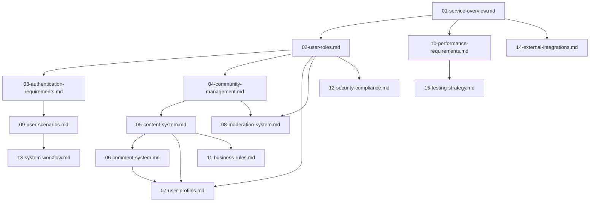

# Reddit-like Community Platform
## Comprehensive Table of Contents

## Document Overview

### Introduction
This document provides the complete table of contents and navigation guide for the Reddit-like community platform project documentation. The platform aims to create a community-driven content sharing and discussion system where users can create communities, share content, engage through voting and commenting, and build reputation through participation.

### Core Value Proposition
The platform enables users to:
- Create and participate in niche communities (subreddits)
- Share diverse content types (text, links, images)
- Engage through democratic voting systems
- Build reputation through karma accumulation
- Discover content through intelligent sorting algorithms
- Moderate communities through user-driven governance

### Target Audience
The platform serves three primary user segments:
1. **Content Consumers**: Users who browse, vote, and comment on content
2. **Content Creators**: Users who create posts and build communities
3. **Community Moderators**: Users who manage and maintain community standards

### Business Goals
- Build a scalable community platform with viral growth potential
- Establish user-driven content moderation and governance
- Create sustainable engagement through karma and reputation systems
- Enable niche community formation around diverse interests
- Generate value through user-generated content and interactions

### Success Metrics
- Monthly Active Users (MAU) and Daily Active Users (DAU)
- User engagement metrics (posts, comments, votes per user)
- Community growth and diversity
- User retention and churn rates
- Content quality and moderation effectiveness

## Project Structure

### Document Hierarchy
The project documentation is organized into 16 comprehensive documents that cover all aspects of the platform:

1. **[00-toc.md](./00-toc.md)** - Current Document: Project Overview and Navigation Guide
2. **[01-service-overview.md](./01-service-overview.md)** - Business Model and Strategic Analysis
3. **[02-user-roles.md](./02-user-roles.md)** - User Role Definitions and Authentication Requirements
4. **[03-authentication-requirements.md](./03-authentication-requirements.md)** - Registration and Login System Specifications
5. **[04-community-management.md](./04-community-management.md)** - Community Creation and Subscription Features
6. **[05-content-system.md](./05-content-system.md)** - Post Creation, Voting, and Ranking System
7. **[06-comment-system.md](./06-comment-system.md)** - Comment Threading and Discussion Features
8. **[07-user-profiles.md](./07-user-profiles.md)** - User Profile and Activity History System
9. **[08-moderation-system.md](./08-moderation-system.md)** - Content Reporting and Moderation Tools
10. **[09-user-scenarios.md](./09-user-scenarios.md)** - User Journey and Interaction Patterns
11. **[10-performance-requirements.md](./10-performance-requirements.md)** - Performance and Scalability Standards
12. **[11-business-rules.md](./11-business-rules.md)** - Business Logic and Validation Rules
13. **[12-security-compliance.md](./12-security-compliance.md)** - Security Protocols and Data Protection
14. **[13-system-workflow.md](./13-system-workflow.md)** - System Processes and Data Lifecycle
15. **[14-external-integrations.md](./14-external-integrations.md)** - Third-party Service Integration
16. **[15-testing-strategy.md](./15-testing-strategy.md)** - Quality Assurance and Testing Framework

### Development Workflow

#### Phase 1: Foundation (Documents 1-4)
Start with the core platform foundation:
- **[01-service-overview.md](./01-service-overview.md)** - Understand business objectives
- **[02-user-roles.md](./02-user-roles.md)** - Define user authentication framework
- **[03-authentication-requirements.md](./03-authentication-requirements.md)** - Implement registration/login
- **[04-community-management.md](./04-community-management.md)** - Build community infrastructure

#### Phase 2: Core Features (Documents 5-8)
Implement primary user-facing features:
- **[05-content-system.md](./05-content-system.md)** - Content creation and voting
- **[06-comment-system.md](./06-comment-system.md)** - Discussion and threading
- **[07-user-profiles.md](./07-user-profiles.md)** - User reputation and activity
- **[08-moderation-system.md](./08-moderation-system.md)** - Community safety tools

#### Phase 3: Enhancement (Documents 9-12)
Add advanced functionality:
- **[09-user-scenarios.md](./09-user-scenarios.md)** - User experience optimization
- **[10-performance-requirements.md](./10-performance-requirements.md)** - Performance and scalability
- **[11-business-rules.md](./11-business-rules.md)** - Business logic implementation
- **[12-security-compliance.md](./12-security-compliance.md)** - Security and compliance

#### Phase 4: Integration & Testing (Documents 13-16)
Final integration and quality assurance:
- **[13-system-workflow.md](./13-system-workflow.md)** - System integration
- **[14-external-integrations.md](./14-external-integrations.md)** - External services
- **[15-testing-strategy.md](./15-testing-strategy.md)** - Quality assurance

## Document Relationships

### Core Dependencies

### Cross-Reference Mapping

| Document | Primary Dependencies | Dependent Documents |
|----------|---------------------|---------------------|
| **01-service-overview.md** | None | 02, 10, 14 |
| **02-user-roles.md** | 01 | 03, 04, 07, 08, 12 |
| **03-authentication-requirements.md** | 02 | 09 |
| **04-community-management.md** | 02 | 05, 08 |
| **05-content-system.md** | 04 | 06, 07, 11 |
| **06-comment-system.md** | 05 | 07 |
| **07-user-profiles.md** | 02, 05, 06 | 09 |
| **08-moderation-system.md** | 02, 04 | 09 |
| **09-user-scenarios.md** | 03, 07, 08 | 13 |
| **10-performance-requirements.md** | 01 | 15 |
| **11-business-rules.md** | 05 | 13 |
| **12-security-compliance.md** | 02 | 15 |
| **13-system-workflow.md** | 09, 11 | None |
| **14-external-integrations.md** | 01 | 15 |
| **15-testing-strategy.md** | 10, 12, 14 | None |

## Navigation Guide

### Quick Access by Feature Area

#### Authentication & User Management
- **[User Role Definitions](./02-user-roles.md)** - Complete role hierarchy and permissions
- **[Authentication System](./03-authentication-requirements.md)** - Registration, login, and session management
- **[User Profiles](./07-user-profiles.md)** - Profile structure and activity tracking

#### Community & Content Features
- **[Community Management](./04-community-management.md)** - Community creation and subscription system
- **[Content System](./05-content-system.md)** - Post creation, voting, and ranking algorithms
- **[Comment System](./06-comment-system.md)** - Threaded discussions and nested replies

#### Moderation & Safety
- **[Moderation System](./08-moderation-system.md)** - Content reporting and moderation tools
- **[Security Compliance](./12-security-compliance.md)** - Data protection and privacy requirements

#### Performance & Quality
- **[Performance Requirements](./10-performance-requirements.md)** - Scalability and response time standards
- **[Testing Strategy](./15-testing-strategy.md)** - Quality assurance and validation framework

### Common Development Scenarios

#### Building User Authentication
1. Start with **[User Role Definitions](./02-user-roles.md)** to understand permission structure
2. Implement requirements from **[Authentication System](./03-authentication-requirements.md)**
3. Reference **[Security Compliance](./12-security-compliance.md)** for security protocols

#### Implementing Community Features
1. Study **[Community Management](./04-community-management.md)** for community creation rules
2. Implement **[Content System](./05-content-system.md)** for posting and voting
3. Add **[Comment System](./06-comment-system.md)** for discussions
4. Integrate **[User Profiles](./07-user-profiles.md)** for activity tracking

#### Setting Up Moderation Tools
1. Review **[Moderation System](./08-moderation-system.md)** for reporting workflows
2. Reference **[Business Rules](./11-business-rules.md)** for content validation
3. Ensure compliance with **[Security Compliance](./12-security-compliance.md)**

### Search Strategies

#### By User Role
- **Guest Users**: Documents 2, 3, 4
- **Member Users**: Documents 2, 5, 6, 7
- **Moderators**: Documents 2, 4, 8
- **Admins**: Documents 2, 8, 12

#### By Feature Type
- **Authentication**: Documents 2, 3, 12
- **Content Management**: Documents 5, 6, 11
- **Community Features**: Documents 4, 8
- **User Experience**: Documents 7, 9, 13
- **Performance**: Documents 10, 15

#### By Development Phase
- **Foundation**: Documents 1-4
- **Core Features**: Documents 5-8
- **Enhancement**: Documents 9-12
- **Integration**: Documents 13-16

## Development Team Note

> *Developer Note: This document defines **business requirements only**. All technical implementations (architecture, APIs, database design, etc.) are at the discretion of the development team.*

### Technical Implementation Guidelines

While this documentation provides comprehensive business requirements, technical teams have full autonomy over:

- **Architecture Selection**: Choose appropriate technology stacks, frameworks, and infrastructure
- **API Design**: Implement REST, GraphQL, or other API patterns based on team expertise
- **Database Schema**: Design optimal database structures for performance and scalability
- **Authentication Implementation**: Select JWT, OAuth, or other authentication mechanisms
- **Deployment Strategy**: Choose cloud providers, containerization, and deployment pipelines

### Business Requirements Focus

This documentation specifies:
- **WHAT** the system should do from a business perspective
- **WHY** certain features are required for user experience
- **WHO** can perform which actions under what conditions
- **WHEN** specific business processes should occur
- **HOW** users should interact with the system

### Technical Decision-Making Framework

Development teams should consider:
- **Scalability**: Design for viral growth and high concurrent usage
- **Performance**: Ensure sub-second response times for core features
- **Security**: Implement industry-standard security practices
- **Maintainability**: Create clean, documented, testable code
- **Extensibility**: Build for future feature additions and modifications

### Success Criteria Alignment

All technical implementations should align with the business success metrics defined in the documentation while allowing flexibility in technical approach and implementation details.

## Complete Platform Overview

The Reddit-like community platform represents a comprehensive social media ecosystem designed to foster community engagement, content sharing, and democratic content curation. The platform's architecture supports millions of users engaging in thousands of niche communities while maintaining content quality through user-driven moderation.

### Core Platform Capabilities

**Community Infrastructure**
- Community creation and customization
- User subscription and discovery mechanisms
- Community-specific rules and moderation
- Scalable community growth management

**Content Ecosystem**
- Multi-format content creation (text, links, images)
- Democratic voting and ranking systems
- Threaded discussion and comment systems
- Personalized content discovery algorithms

**User Engagement**
- Karma-based reputation system
- User profile and activity tracking
- Social interaction features
- Achievement and progression systems

**Moderation & Safety**
- User-driven content reporting
- Community-level moderation tools
- Platform-wide administrative controls
- Automated content filtering and detection

### Technical Foundation

The platform requires robust technical infrastructure to support:
- High-concurrency user interactions
- Real-time content ranking and voting
- Scalable media storage and delivery
- Comprehensive moderation workflows
- Secure authentication and authorization

### Business Objectives

**User Growth & Engagement**
- Achieve viral growth through community creation
- Maintain high user retention through quality content
- Foster user loyalty through reputation systems
- Enable organic community development

**Content Quality & Safety**
- Implement effective moderation at scale
- Maintain content quality through voting
- Ensure platform safety through reporting
- Support diverse community standards

**Monetization Strategy**
- Targeted advertising within communities
- Premium subscription features
- Community monetization tools
- Creator revenue sharing models

### Implementation Priorities

**Phase 1: Core Platform**
- User authentication and profiles
- Basic community creation and management
- Content creation and voting systems
- Essential moderation tools

**Phase 2: Engagement Features**
- Advanced content ranking algorithms
- Enhanced user reputation systems
- Community discovery and recommendation
- Mobile application development

**Phase 3: Monetization & Scale**
- Advertising platform integration
- Premium feature development
- International expansion support
- Enterprise community solutions

This comprehensive documentation provides the complete foundation for building a scalable, engaging community platform that balances user autonomy with platform governance while supporting sustainable business growth through multiple revenue streams.