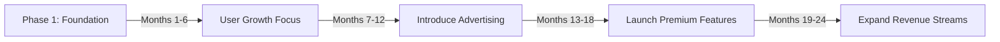
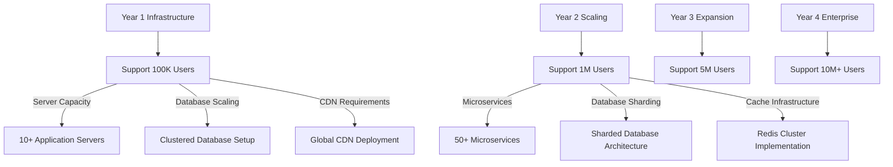
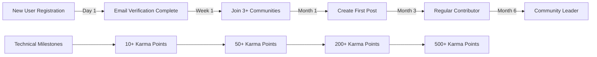

# Reddit-Like Community Platform Service Overview

## Executive Summary

The Reddit-like Community Platform is a community-driven social media platform designed to connect users through shared interests, discussions, and content discovery. This platform enables users to create and participate in specialized communities (subreddits), engage in threaded discussions, and contribute to content ranking through a democratic voting system.

### Core Value Proposition
The platform fills a critical market gap by providing:
- **Niche Community Focus**: Dedicated spaces for specific interests and topics
- **Democratic Content Curation**: Community-driven ranking through voting mechanisms
- **Authentic User Engagement**: Genuine discussions and knowledge sharing
- **Scalable Moderation**: Community-led content management through user moderation

### Target Audience
The platform targets three primary user segments:
- **Content Consumers**: Users seeking specialized information and community discussions
- **Content Creators**: Individuals wanting to share knowledge and build reputation
- **Community Builders**: Users interested in creating and managing niche communities

### Technical Foundation
The platform SHALL be built on scalable microservices architecture supporting:
- 10,000+ concurrent users
- 1,000+ new posts per hour
- 10,000+ comments per hour
- 50,000+ votes per hour
- Sub-second response times for core features

## Business Model Analysis

### Core Business Model
The platform operates on a **community-driven content ecosystem** model where:
- Users create and moderate communities voluntarily
- Content quality is determined by community voting
- User reputation (karma) incentivizes quality contributions
- Platform provides the infrastructure and moderation tools

### Revenue Strategy Implementation

#### Primary Revenue Streams
**WHEN implementing advertising system, THE platform SHALL:**
- Serve community-targeted ads based on user interests
- Integrate sponsored content with community guidelines
- Provide premium ad-free subscription options
- Implement performance-based pricing (CPM and CPC models)

**WHEN implementing premium memberships, THE platform SHALL:**
- Offer enhanced profile customization features
- Provide advanced analytics for community moderators
- Deliver priority support and moderation tools
- Enable revenue sharing with top contributors

**WHEN implementing community monetization, THE platform SHALL:**
- Deploy tip jar system for content creators
- Support community subscription fees for premium communities
- Implement revenue sharing models with top contributors
- Enable community-approved affiliate programs

### Monetization Timeline

**WHEN launching advertising, THE system SHALL:**
- Implement ad serving infrastructure within 6 months
- Develop community-specific targeting algorithms
- Establish advertiser onboarding processes
- Create ad performance tracking systems

**WHEN introducing premium features, THE system SHALL:**
- Develop subscription management system
- Implement payment processing integration
- Create premium feature access controls
- Establish customer support for premium users

## Market Opportunity

### Target Market Size
**THE platform SHALL target:**
- Global Social Media Users: 4.9 billion users worldwide
- Niche Community Seekers: Estimated 1.2 billion users seeking specialized communities
- Content Creators: 300+ million users creating content regularly
- Community Moderators: 50+ million potential community managers

### Market Gap Analysis
**WHERE current platforms face limitations, THE platform SHALL provide:**
- Algorithm-Driven Feeds: Users seek more control over content discovery
- Limited Niche Focus: Mainstream platforms don't cater to specialized interests
- Moderation Challenges: Centralized moderation struggles with diverse communities
- Authenticity Concerns: Users desire genuine interactions over viral content

### Growth Potential Implementation
**THE platform SHALL address key market trends through:**
- Rising Demand for Authentic Connections: Users moving away from algorithm-heavy platforms
- Increased Interest in Niche Communities: Growing demand for specialized interest groups
- Creator Economy Expansion: More users seeking to monetize their expertise
- Community-Led Moderation: Shift toward distributed content management

## Competitive Landscape

### Direct Competitors Analysis

#### Reddit
**WHEN competing with Reddit, THE platform SHALL differentiate through:**
- Improved user experience with modern interface
- Enhanced moderation tools for community managers
- Better mobile experience across platforms
- Transparent content ranking algorithms

#### Discord Communities
**WHEN competing with Discord, THE platform SHALL focus on:**
- Superior content organization and discovery
- Better content-focused rather than communication-focused experience
- Enhanced content curation and ranking systems
- Improved content persistence and archival

### Competitive Advantages Implementation

#### Superior User Experience
**THE platform SHALL deliver:**
- Intuitive interface designed for both desktop and mobile
- Fast content discovery with sub-2-second load times
- Seamless navigation between communities
- Enhanced moderation tools with real-time notifications

#### Democratic Content Curation
**THE platform SHALL implement:**
- Transparent voting system with real-time score updates
- Community-driven content quality assessment
- Reduced algorithm bias in content discovery
- Multiple sorting algorithms (hot, new, top, controversial)

#### Enhanced Moderation Capabilities
**THE platform SHALL provide:**
- Advanced tools for community moderators
- Distributed moderation responsibilities
- Clear guidelines and escalation procedures
- Automated content filtering with human oversight

#### Mobile-First Approach
**THE platform SHALL ensure:**
- Optimized mobile content consumption
- Native app experience across iOS and Android
- Offline reading capabilities
- Push notifications for user engagement

## Revenue Streams Technical Implementation

### Advertising Revenue System

**WHEN implementing advertising, THE platform SHALL:**
- Serve community-targeted ads based on user subscription patterns
- Display sponsored content with clear labeling
- Implement native advertising that aligns with community guidelines
- Support performance-based pricing models (CPM and CPC)

### Premium Subscription Tiers

| Tier | Price | Features | Target Audience | Technical Requirements |
|------|-------|-----------|-----------------|------------------------|
| **Basic** | Free | Core platform features | All users | Standard user permissions |
| **Premium** | $4.99/month | Ad-free, enhanced profile, advanced analytics | Power users, content creators | Ad removal, enhanced features |
| **Moderator Pro** | $9.99/month | Advanced moderation tools, analytics, priority support | Community moderators | Enhanced moderation capabilities |
| **Enterprise** | Custom | White-label solutions, custom communities | Businesses, organizations | Custom branding, dedicated infrastructure |

### Community Monetization Features

**WHEN implementing monetization features, THE platform SHALL:**
- Deploy tip jar system with secure payment processing
- Support community subscriptions with revenue sharing
- Implement creator funds for top contributors
- Enable affiliate marketing with community approval

### Revenue Projections Technical Requirements

## Growth Strategy Technical Implementation

### User Acquisition Roadmap

#### Phase 1: Foundation Building (Months 1-6)
**THE platform SHALL implement:**
- Seed community development tools
- Early adopter onboarding processes
- Content migration utilities
- Referral program infrastructure

#### Phase 2: Rapid Growth (Months 7-18)
**THE platform SHALL develop:**
- Community expansion management systems
- Enhanced recommendation algorithms
- Native iOS and Android applications
- Partnership development frameworks

#### Phase 3: Market Leadership (Months 19-36)
**THE platform SHALL build:**
- Multi-language support systems
- Enterprise white-label solutions
- Third-party developer API ecosystem
- Content partnership management

### Community Growth Technical Features

#### Community Onboarding Program
**THE system SHALL provide:**
- Guided community creation workflows
- Moderator training resources and documentation
- Growth incentive tracking and distribution
- Community health monitoring tools

#### Content Creator Partnerships
**THE system SHALL implement:**
- Early access program management
- Revenue sharing calculation and distribution
- Creator support ticketing system
- Performance analytics for creators

#### Community Discovery Features
**THE system SHALL develop:**
- Personalized community recommendation engine
- Trending community detection algorithms
- Cross-community content sharing mechanisms
- Geographic community discovery (location-based)

### Platform Scaling Technical Requirements

#### Technical Scaling Architecture
**THE platform SHALL implement:**
- Microservices architecture with independent scaling
- Global content delivery network (CDN)
- Optimized database storage and retrieval
- Comprehensive caching strategy for high-traffic content

#### Operational Scaling Systems
**THE platform SHALL deploy:**
- Automated moderation with AI assistance
- Scalable community guidelines enforcement
- Tiered user support systems
- Real-time platform performance monitoring

## Success Metrics Technical Implementation

### Key Performance Indicators (KPIs) Technical Requirements

#### User Engagement Metrics
**THE system SHALL track:**
- Monthly Active Users (MAU): Target 1M+ within 24 months
- Daily Active Users (DAU): Target 30% of MAU
- Average Session Duration: Target 15+ minutes per session
- Posts per User per Month: Target 2.5 posts per active user
- Comments per Post: Target 8+ comments per post

#### Community Health Metrics
**THE system SHALL monitor:**
- Community Growth Rate: 15% monthly community creation growth
- Moderator Satisfaction: 85%+ moderator retention rate
- Content Quality Score: User-reported content satisfaction
- Report Resolution Time: <24 hours for content moderation

#### Business Metrics
**THE system SHALL calculate:**
- Customer Acquisition Cost (CAC): <$5 per registered user
- Lifetime Value (LTV): >3x CAC
- Monthly Recurring Revenue (MRR): Steady 15% monthly growth
- Churn Rate: <5% monthly for premium subscribers

### User Engagement Technical Targets

### Platform Performance Technical Benchmarks

**THE platform SHALL maintain:**
- Page Load Time: <2 seconds for core pages
- API Response Time: <200ms for 95% of requests
- Uptime: 99.9% platform availability
- Scalability: Support for 10,000+ concurrent users
- Mobile Performance: Optimized for 3G/4G/5G networks

## Technical Requirements Overview

### Authentication System Requirements
**WHEN users register, THE system SHALL:**
- Validate email uniqueness in real-time
- Send verification emails within 30 seconds
- Create user accounts with default "member" role
- Generate secure JWT tokens for session management

**WHEN users authenticate, THE system SHALL:**
- Validate credentials against encrypted storage
- Implement rate limiting for failed attempts
- Support OAuth2 integration for social login
- Maintain session security with token refresh

### Content Management Requirements
**WHEN users create content, THE system SHALL:**
- Validate content against community guidelines
- Support text, link, and image post types
- Implement real-time content moderation
- Provide content editing within 24-hour window

### Voting and Ranking Requirements
**WHEN users interact with content, THE system SHALL:**
- Process votes within 500ms response time
- Calculate karma scores in real-time
- Implement multiple sorting algorithms
- Prevent vote manipulation through detection systems

### Community Management Requirements
**WHEN users create communities, THE system SHALL:**
- Validate community name uniqueness
- Assign creator as primary moderator
- Support public, restricted, and private community types
- Provide moderation tools for community managers

## System Architecture Considerations

### Microservices Architecture
**THE platform SHALL implement:**
- User Service: Authentication and profile management
- Community Service: Community creation and management
- Content Service: Post and comment handling
- Voting Service: Vote processing and ranking
- Moderation Service: Content moderation tools
- Notification Service: User notifications and alerts

### Database Architecture
**THE platform SHALL design:**
- User data storage with encryption at rest
- Content storage with efficient indexing
- Vote and karma calculation systems
- Moderation action logging
- Community relationship management

### Caching Strategy
**THE platform SHALL implement:**
- Redis for session management
- Content caching for popular posts
- User feed caching for performance
- Community data caching for quick access

### Search Infrastructure
**THE platform SHALL deploy:**
- Elasticsearch for content search
- Community discovery search
- User search functionality
- Advanced filtering and sorting

## Implementation Timeline with Technical Milestones

### Phase 1: Core Platform (Months 1-3)
**THE development SHALL deliver:**
- User authentication and registration
- Basic community creation and management
- Simple post and comment system
- Basic voting mechanism

### Phase 2: Enhanced Features (Months 4-6)
**THE development SHALL implement:**
- Advanced content ranking algorithms
- Community subscription system
- User profile and karma system
- Basic moderation tools

### Phase 3: Scaling & Monetization (Months 7-12)
**THE development SHALL build:**
- Advertising system integration
- Premium subscription features
- Advanced moderation capabilities
- Mobile applications

### Phase 4: Enterprise Features (Months 13-18)
**THE development SHALL create:**
- White-label community solutions
- Advanced analytics and reporting
- API ecosystem for third-party developers
- Enterprise-grade security features

This enhanced service overview provides comprehensive technical specifications and business requirements for developing a scalable, community-driven platform that meets modern user expectations while providing multiple revenue streams for sustainable growth.

> *Developer Note: This document defines **business requirements only**. All technical implementations (architecture, APIs, database design, etc.) are at the discretion of the development team.*