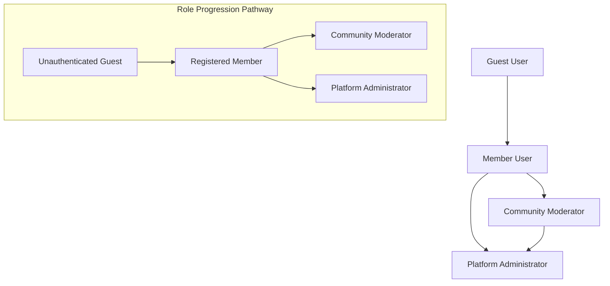

# User Roles and Authentication Requirements

## Introduction and Overview

This document establishes the complete user role structure and authentication requirements for the Reddit-like community platform. The authentication system forms the foundation for all user interactions, content management, and community governance within the platform.

### Purpose and Scope

The user role system defines hierarchical permissions that enable scalable community management while maintaining platform security. Each role represents a distinct level of responsibility and capability within the system, from anonymous browsing to full administrative control.

### Business Context

User authentication and role management are critical for maintaining community quality, enforcing content guidelines, and providing appropriate user experiences based on participation level and responsibilities.

## User Role Hierarchy

The platform implements a four-tier role hierarchy that balances user empowerment with responsible content management:



### Role Relationships
- **Guest** users can upgrade to **Member** through registration
- **Members** can become **Moderators** through community ownership or appointment
- **Administrators** have system-wide authority over all roles

## Guest User Capabilities

Guest users represent unauthenticated visitors to the platform with limited interaction capabilities designed to showcase platform content while encouraging registration.

### Public Content Access

WHEN accessing the platform as a guest, THE system SHALL allow viewing of:
- Public community listings and descriptions
- Published posts and their content
- Comments and discussion threads
- User profiles (public information only)
- Platform statistics and trending content

### Limited Interaction Features

WHEN interacting with content as a guest, THE system SHALL provide:
- Read-only access to all public content
- Community discovery and search functionality
- Registration and login access points
- Content preview capabilities

### Registration Access

WHEN a guest user decides to register, THE system SHALL provide:
- Clear registration call-to-action elements
- Seamless transition from guest to member status
- Access to registration forms and account creation
- Immediate access to member features upon successful registration

## Member User Capabilities

Member users represent the core participant group with comprehensive content creation and interaction permissions.

### Account Management

WHEN authenticated as a member, THE user SHALL be able to:
- Update profile information and preferences
- Manage account security settings
- Control notification preferences
- Delete their account and associated content
- Export personal data in standard formats

### Content Creation

WHILE authenticated as a member, THE user SHALL have permission to:
- Create new posts in subscribed communities
- Submit text posts, link posts, and image posts
- Edit their own posts within 24 hours of creation
- Delete their own posts and comments
- Save posts and comments for later viewing

### Community Interaction

WHEN participating in communities, THE member SHALL be able to:
- Subscribe to communities of interest
- Unsubscribe from previously subscribed communities
- Upvote and downvote posts and comments
- Create comments and nested replies
- Report inappropriate content
- Save posts for later viewing
- Follow other users' activity

### User Reputation System

WHERE karma tracking is enabled, THE system SHALL:
- Calculate karma based on post and comment votes
- Display karma points on user profiles
- Track contribution history across communities
- Provide reputation-based sorting options
- Apply karma thresholds for certain actions

## Moderator Capabilities

Moderators are community managers responsible for maintaining content quality and enforcing community guidelines within their assigned communities.

### Community Management

WHILE assigned as a moderator, THE user SHALL have authority to:
- Manage community settings and descriptions
- Set community rules and guidelines
- Control post approval workflows
- Manage community appearance and branding
- Configure automated moderation rules
- Set user flair and community awards

### Content Moderation

WHEN moderating community content, THE moderator SHALL be able to:
- Remove inappropriate posts and comments
- Approve or reject pending posts
- Pin important posts to community top
- Lock discussions to prevent further comments
- Manage post flairs and categories
- Distinguish moderator comments
- Access moderation queue and reports

### User Management

WHEN managing community members, THE moderator SHALL have permission to:
- Ban users from specific communities
- Mute users temporarily
- Approve or reject membership requests
- Assign additional moderators (where permitted)
- View user activity within the community
- Send warnings to community members

### Moderation Tools

WHERE moderation actions are performed, THE system SHALL provide:
- Moderation queue for reported content
- Action history tracking
- User warning system
- Automated moderation rule configuration
- Moderation log for transparency
- Bulk moderation actions
- Content approval workflows

## Administrator Capabilities

Administrators possess system-wide authority to manage the entire platform, including all users, communities, and system configurations.

### System Management

WHILE authenticated as an administrator, THE user SHALL have permission to:
- Access and modify all system settings
- Manage global platform configuration
- Monitor system performance and health
- Configure third-party integrations
- Manage system-wide content policies
- Access platform analytics and metrics

### User Management

WHEN managing platform users, THE administrator SHALL be able to:
- View and edit all user accounts
- Suspend or ban users system-wide
- Reset user passwords and security settings
- Access user activity logs and analytics
- Manage user roles and permissions
- Review and resolve user appeals

### Community Oversight

WHERE community management is required, THE administrator SHALL have authority to:
- Create, modify, or remove any community
- Assign or remove moderators from any community
- Access all community settings and content
- Resolve inter-community disputes
- Review community moderation actions
- Intervene in community governance when necessary

### Platform Administration

WHEN performing administrative duties, THE system SHALL provide:
- Comprehensive analytics and reporting tools
- System-wide content search and filtering
- Bulk user and content management capabilities
- Emergency system override functions
- Platform health monitoring dashboard
- Security incident management tools

## Authentication System Requirements

The authentication system provides secure access control while maintaining user convenience and platform security.

### Registration Process

WHEN a new user registers, THE system SHALL:
- Collect required information: username, email, password
- Validate email address uniqueness and format
- Validate username availability and format compliance
- Send verification email to confirm ownership
- Create user account with member role upon verification
- Generate initial user profile with default settings
- Log registration event for security monitoring

### Login Workflow

WHEN a user attempts to login, THE system SHALL:
- Validate credentials against stored records
- Generate JWT access token upon successful authentication
- Establish secure user session
- Redirect to user's personalized feed
- Log authentication attempt for security monitoring
- Implement rate limiting to prevent brute force attacks

### Password Management

WHERE password security is concerned, THE system SHALL:
- Enforce minimum password strength requirements
- Provide password reset functionality via email
- Implement secure password hashing and storage
- Prevent common password patterns and dictionary attacks
- Require periodic password changes for administrative accounts
- Implement password history to prevent reuse

### Session Management

WHILE a user session is active, THE system SHALL:
- Maintain session state using JWT tokens
- Implement token refresh mechanism
- Provide secure logout functionality
- Track session activity for security purposes
- Automatically expire inactive sessions
- Support multiple simultaneous sessions
- Allow users to view and terminate active sessions

### JWT Token Specifications

WHERE JWT tokens are used for authentication, THE system SHALL implement:

**Token Payload Structure:**
```json
{
  "userId": "unique-user-identifier",
  "username": "user-display-name",
  "email": "user-email-address",
  "role": "member|moderator|admin",
  "permissions": ["array-of-specific-permissions"],
  "communities": ["array-of-moderated-communities"],
  "iat": "issued-at-timestamp",
  "exp": "expiration-timestamp",
  "refreshToken": "refresh-token-identifier"
}
```

**Token Management Rules:**
- Access token expiration: 30 minutes
- Refresh token expiration: 30 days
- Token storage: Secure httpOnly cookies
- Token validation on each authenticated request
- Automatic token refresh before expiration
- Token revocation on logout or security events

## Permission Matrix

The following matrix defines specific permissions for each user role across all platform features:

| Action | Guest | Member | Moderator | Administrator |
|--------|-------|--------|-----------|---------------|
| View public content | ✅ | ✅ | ✅ | ✅ |
| Register account | ✅ | ❌ | ❌ | ❌ |
| Login to account | ✅ | ❌ | ❌ | ❌ |
| Create posts | ❌ | ✅ | ✅ | ✅ |
| Edit own posts | ❌ | ✅ | ✅ | ✅ |
| Delete own posts | ❌ | ✅ | ✅ | ✅ |
| Upvote/downvote content | ❌ | ✅ | ✅ | ✅ |
| Comment on posts | ❌ | ✅ | ✅ | ✅ |
| Subscribe to communities | ❌ | ✅ | ✅ | ✅ |
| Create communities | ❌ | ✅ | ✅ | ✅ |
| Report content | ❌ | ✅ | ✅ | ✅ |
| Moderate content | ❌ | ❌ | ✅ | ✅ |
| Manage community settings | ❌ | ❌ | ✅ | ✅ |
| Ban users from community | ❌ | ❌ | ✅ | ✅ |
| Access all user data | ❌ | ❌ | ❌ | ✅ |
| Manage system settings | ❌ | ❌ | ❌ | ✅ |
| View platform analytics | ❌ | ❌ | ❌ | ✅ |
| Assign user roles | ❌ | ❌ | ❌ | ✅ |
| Override moderation decisions | ❌ | ❌ | ❌ | ✅ |
| Access system logs | ❌ | ❌ | ❌ | ✅ |

### Permission Inheritance Rules

WHEN checking user permissions, THE system SHALL:
- Evaluate role hierarchy for permission inheritance
- Check specific permissions against user's role
- Deny access to unauthorized actions
- Log permission violation attempts
- Provide clear error messages for denied actions
- Support role escalation in emergency situations

## Security and Compliance Requirements

### Data Protection

WHERE user data is stored or processed, THE system SHALL:
- Encrypt sensitive user information at rest
- Implement secure transmission protocols (HTTPS/TLS 1.2+)
- Follow data minimization principles
- Provide user data export capabilities
- Implement data retention policies
- Conduct regular security audits

### Access Control

WHEN authorizing user actions, THE system SHALL:
- Validate user permissions for each request
- Implement role-based access control (RBAC)
- Log all permission checks and outcomes
- Provide detailed audit trails for sensitive operations
- Implement principle of least privilege
- Conduct regular access control reviews

### Privacy Compliance

WHERE user privacy is concerned, THE system SHALL:
- Comply with relevant data protection regulations (GDPR, CCPA)
- Provide clear privacy policy and data usage information
- Implement user consent management
- Allow users to control their data sharing preferences
- Provide data deletion capabilities
- Conduct privacy impact assessments

### Authentication Security

WHEN handling authentication, THE system SHALL:
- Implement secure password storage using bcrypt with salt
- Prevent brute force attacks with rate limiting
- Monitor for suspicious login patterns
- Provide multi-factor authentication options
- Implement session hijacking protection
- Conduct regular security penetration testing
- Implement account lockout after failed attempts
- Monitor for credential stuffing attacks

## Business Rules and Validation

### Role Assignment Rules

WHEN assigning user roles, THE system SHALL:
- Automatically assign "member" role upon registration
- Allow moderators to be appointed by community creators
- Restrict administrator role assignment to existing administrators
- Validate role changes through proper authorization
- Log all role assignment and changes
- Require additional verification for privileged role assignments

### Permission Validation Rules

WHEN checking user permissions, THE system SHALL:
- Verify user authentication status first
- Check role-based permissions hierarchy
- Validate specific action permissions
- Deny access with appropriate error messages
- Log permission checks for security monitoring
- Cache permission results for performance

### Security Enforcement Rules

WHERE security is enforced, THE system SHALL:
- Validate all input for security vulnerabilities
- Implement CSRF protection for state-changing operations
- Use prepared statements for database queries
- Sanitize user-generated content
- Implement content security policies
- Conduct regular security code reviews
- Implement security headers in HTTP responses

## User Experience Requirements

### Authentication Flow

WHEN users interact with authentication features, THE system SHALL provide:
- Clear visual indicators of authentication status
- Intuitive navigation between authenticated and guest views
- Seamless transitions during login/logout processes
- Consistent authentication prompts and error messages
- Password strength indicators during registration
- Secure password recovery workflow

### Role-Based Interface

WHERE user interfaces are displayed, THE system SHALL:
- Show or hide features based on user permissions
- Provide appropriate context for available actions
- Display role-specific navigation and tools
- Maintain consistent user experience across role changes
- Provide clear indicators of user role and permissions
- Support progressive disclosure of advanced features

### Error Handling

WHEN authentication or authorization fails, THE system SHALL:
- Provide clear, user-friendly error messages
- Log security events for monitoring
- Prevent information leakage in error responses
- Guide users to appropriate resolution paths
- Offer help resources for common issues
- Maintain system security while being user-friendly

## Integration Requirements

### External Authentication

WHERE external authentication is supported, THE system SHALL:
- Provide OAuth2 integration capabilities
- Support social login providers (Google, Facebook, etc.)
- Maintain consistent permission mapping
- Handle authentication provider failures gracefully
- Implement secure token exchange
- Support account linking between providers

### API Security

WHEN providing API access, THE system SHALL:
- Implement secure API authentication using JWT
- Validate all API requests for proper authorization
- Rate limit API endpoints to prevent abuse
- Monitor API usage for security threats
- Implement API versioning for backward compatibility
- Provide comprehensive API documentation

### System Integration

THE authentication system SHALL integrate with:
- User profile management system
- Community management features
- Content creation and moderation
- Notification and messaging systems
- Analytics and reporting tools
- Administrative dashboard

This document defines the complete user role structure and authentication requirements for the Reddit-like community platform. All technical implementations including architecture, API design, database schemas, and infrastructure decisions are at the discretion of the development team.

> *Developer Note: This document defines **business requirements only**. All technical implementations (architecture, APIs, database design, etc.) are at the discretion of the development team.*