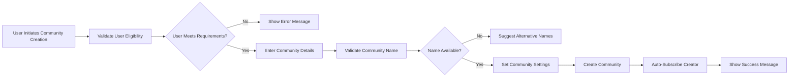

# Community Management System Requirements

## Introduction

The community management system forms the foundational structure of the Reddit-like platform, enabling users to create, organize, and participate in topic-specific communities. This document specifies the complete requirements for community creation, management, subscription, discovery, and moderation features that facilitate organized content sharing and user interaction.

## Community Creation Process

### Community Creation Eligibility

**WHEN a member attempts to create a community, THE system SHALL validate the following requirements:**
- User must have at least 30 days account age
- User must have minimum 100 karma points
- User must have verified email address
- User must not have active community creation restrictions

**THE system SHALL enforce community name validation rules:**
- Community names must be between 3-21 characters
- Community names must contain only alphanumeric characters, underscores, and hyphens
- Community names must be unique across the entire platform
- Community names must not contain reserved words or offensive terms

### Community Creation Workflow

**WHEN a user successfully creates a community, THE system SHALL:**
- Automatically subscribe the creator to the new community
- Assign the creator as the primary moderator
- Generate a unique community ID
- Create default community settings
- Log the community creation event

### Community Initial Configuration

**THE system SHALL provide initial community settings:**
- Community display name (can be different from URL name)
- Community description (up to 500 characters)
- Community type (public, restricted, private)
- Content rating (SFW, NSFW)
- Primary topic/category selection

## Community Settings and Configuration

### Community Type Definitions

**THE system SHALL support three community types:**
- **Public Communities**: Anyone can view, post, and comment
- **Restricted Communities**: Anyone can view, but only approved users can post
- **Private Communities**: Only approved members can view, post, and comment

### Community Customization Options

**WHEN a community moderator configures community settings, THE system SHALL allow:**
- Uploading community banner image (recommended 1920x384px)
- Setting community icon (recommended 256x256px)
- Configuring posting rules and guidelines
- Setting content submission restrictions
- Configuring automated moderation rules
- Defining user flair templates

### Community Rules and Guidelines

**THE system SHALL provide community rule management:**
- Moderators can create up to 15 community-specific rules
- Rules support markdown formatting
- Rules are displayed prominently to all community visitors
- Rule violations can be reported by users

## Subscription System

### Subscription Mechanics

**WHEN a user subscribes to a community, THE system SHALL:**
- Add the community to user's subscription list
- Prioritize subscribed community content in user's feed
- Update community subscriber count
- Record subscription timestamp
- Enable community notifications based on user preferences

**WHEN a user unsubscribes from a community, THE system SHALL:**
- Remove community from user's subscription list
- Update community subscriber count
- Stop community-specific notifications
- Maintain subscription history for recommendations

### Subscription Management

**THE system SHALL provide subscription organization features:**
- Users can categorize subscriptions into custom folders
- Users can set notification preferences per community
- Users can view subscription history and activity
- Users can export subscription list

### Subscription Limits

**THE system SHALL enforce subscription limits:**
- Maximum 1000 subscriptions per user account
- Rate limiting: Maximum 50 subscription changes per hour
- Bulk subscription management tools

## Community Discovery

### Community Search and Discovery

**THE system SHALL provide multiple community discovery methods:**
- Keyword search with auto-complete suggestions
- Category-based browsing
- Trending communities based on growth rate
- Recommended communities based on user interests
- Geographic community discovery (if location-enabled)

### Recommendation Algorithms

**THE system SHALL recommend communities based on:**
- User's existing subscriptions
- User's posting and voting history
- Similar user communities
- Trending topics and current events
- Geographic proximity (if location data available)

### Community Directory

**THE system SHALL maintain a comprehensive community directory:**
- Sort communities by subscriber count, activity level, or creation date
- Filter communities by type, category, and content rating
- Show community statistics (subscribers, active users, posts per day)
- Display community description and rules preview

## Moderation Tools

### Moderator Permissions

**WHEN a user is assigned as community moderator, THE system SHALL grant:**
- Ability to approve/remove posts and comments
- Authority to ban users from the community
- Capability to configure community settings
- Access to moderation queue and reports
- Ability to assign other moderators
- Permission to configure automated moderation rules

### Moderation Queue

**THE system SHALL provide a moderation dashboard with:**
- Pending posts awaiting approval (for restricted communities)
- Reported content requiring review
- User ban management interface
- Moderation log showing all actions
- Automated rule configuration

### Automated Moderation

**THE system SHALL support automated moderation rules:**
- Auto-removal of posts containing blocked keywords
- Auto-approval of posts from trusted users
- Auto-filtering of content based on user karma
- Automated user banning based on violation history

## Community Lifecycle

### Community Activity Tracking

**THE system SHALL monitor community health metrics:**
- Daily active users
- Post submission frequency
- Comment activity levels
- User retention rates
- Moderation activity levels

### Community Archiving

**WHEN a community becomes inactive, THE system SHALL:**
- Automatically archive communities with no activity for 6 months
- Preserve all content in archived communities
- Prevent new posts and comments in archived communities
- Allow users to view archived community content
- Enable community restoration by original moderators

### Community Transfer and Closure

**THE system SHALL support community ownership transfer:**
- Primary moderator can transfer ownership to another moderator
- System requires confirmation from receiving moderator
- Transfer logs are maintained for audit purposes

**WHEN a community needs to be closed, THE system SHALL:**
- Allow community closure by unanimous moderator decision
- Require 30-day notice period before permanent closure
- Provide data export options for community content
- Maintain read-only access to closed communities

## User Role Permissions

### Community-Specific Role Matrix

| Action | Guest | Member | Moderator | Admin |
|--------|--------|---------|-----------|--------|
| View public community | ✅ | ✅ | ✅ | ✅ |
| View restricted community | ✅ | ✅ | ✅ | ✅ |
| View private community | ❌ | ❌* | ✅ | ✅ |
| Subscribe to community | ❌ | ✅ | ✅ | ✅ |
| Create post in public community | ❌ | ✅ | ✅ | ✅ |
| Create post in restricted community | ❌ | ❌* | ✅ | ✅ |
| Create post in private community | ❌ | ❌* | ✅ | ✅ |
| Comment on posts | ❌ | ✅ | ✅ | ✅ |
| Report content | ❌ | ✅ | ✅ | ✅ |
| Create community | ❌ | ✅* | ✅ | ✅ |
| Moderate community | ❌ | ❌ | ✅ | ✅ |
| Configure community settings | ❌ | ❌ | ✅ | ✅ |
| Transfer community ownership | ❌ | ❌ | ✅* | ✅ |
| Delete community | ❌ | ❌ | ❌ | ✅ |

*Requires meeting specific eligibility criteria

### Permission Inheritance

**THE system SHALL enforce permission inheritance rules:**
- Admins inherit all moderator permissions across all communities
- Moderators inherit all member permissions within their communities
- Community-specific permissions override global permissions
- Permission conflicts resolve to most restrictive setting

## Integration Points

### Integration with User System

**THE community system SHALL integrate with user profiles:**
- User profiles display subscribed communities
- User activity feeds prioritize subscribed community content
- User karma affects community posting privileges
- User reputation influences moderation capabilities

### Integration with Content System

**THE community system SHALL integrate with content management:**
- Posts are always associated with a specific community
- Community settings determine content visibility
- Community rules apply to all content within the community
- Content ranking considers community-specific algorithms

### Integration with Moderation System

**THE community system SHALL integrate with global moderation:**
- Community moderators can escalate issues to platform admins
- Platform admins can intervene in community moderation
- Cross-community ban synchronization for repeat offenders
- Shared moderation tools and interfaces

## Business Rules and Constraints

### Community Creation Rules

**THE system SHALL enforce community creation limits:**
- Maximum 5 communities per user account
- Minimum 24-hour cooldown between community creations
- Community name reservation period: 30 days for unused communities
- Automatic community name release after 6 months of inactivity

### Subscription Management Rules

**WHEN managing subscriptions, THE system SHALL enforce:**
- Maximum subscription limit: 1000 communities per user
- Subscription change rate limit: 50 changes per hour
- Bulk subscription import/export functionality
- Subscription backup and restore capabilities

### Community Health Monitoring

**THE system SHALL monitor community health indicators:**
- Active moderator presence requirement
- Minimum activity threshold to maintain community status
- Automated health warnings for declining communities
- Intervention protocols for problematic communities

### Content Governance

**THE system SHALL enforce content governance rules:**
- Communities must comply with platform-wide content policies
- Community-specific rules cannot override platform policies
- Escalation procedures for policy violations
- Transparent moderation action logging

### Data Retention and Privacy

**THE system SHALL maintain data retention policies:**
- Community content preserved indefinitely unless deleted
- User subscription history maintained for 5 years
- Moderation action logs preserved for compliance
- Community analytics data aggregated and anonymized

## Performance Requirements

### Response Time Expectations

**WHEN users create communities, THE system SHALL process requests within 3 seconds.**

**WHEN users subscribe to communities, THE system SHALL update feeds within 5 seconds.**

**WHEN users browse community directories, THE system SHALL load results within 2 seconds.**

**WHEN moderators access moderation queues, THE system SHALL display content within 3 seconds.**

### Scalability Requirements

**THE system SHALL support:**
- 10,000 concurrent community creation requests per hour
- 100,000 subscription updates per minute
- 1,000,000 community directory searches per day
- 50,000 active communities simultaneously

### Availability Standards

**THE community management system SHALL maintain 99.9% uptime for core functionality.**

**WHEN system components experience failures, THE system SHALL provide graceful degradation.**

## Error Handling and Recovery

### Community Creation Errors

**IF community creation fails due to name conflict, THEN THE system SHALL suggest available alternatives.**

**IF user eligibility requirements are not met, THEN THE system SHALL provide clear eligibility criteria.**

**IF system resources are unavailable during creation, THEN THE system SHALL queue the request and retry automatically.**

### Subscription Management Errors

**WHEN subscription limits are reached, THE system SHALL provide upgrade options.**

**IF subscription updates fail, THEN THE system SHALL maintain previous subscription state.**

**WHEN rate limits are exceeded, THE system SHALL implement exponential backoff.**

### Moderation System Errors

**IF moderation actions fail, THEN THE system SHALL preserve content in its current state.**

**WHEN automated moderation rules conflict, THEN THE system SHALL prioritize manual moderation.**

**IF moderation queue becomes overloaded, THEN THE system SHALL prioritize content based on severity.**

## Success Metrics

**THE system SHALL track the following community health metrics:**
- Community creation success rate
- Average time from creation to first post
- Subscriber growth rate
- User retention within communities
- Moderation action frequency
- Community activity distribution
- User satisfaction with community discovery

### Community Engagement Metrics

**THE system SHALL monitor:**
- Average posts per community per day
- Comment-to-post ratio
- User subscription retention rates
- Community moderator activity levels
- Content quality scores per community

### System Performance Metrics

**THE system SHALL track:**
- Community creation response times
- Subscription update performance
- Directory search accuracy and speed
- Moderation queue processing times
- System resource utilization during peak loads

This community management system provides the foundation for user-driven content organization while maintaining platform governance and quality standards. The requirements ensure communities can thrive organically while providing necessary tools for moderation and administration.

> *Developer Note: This document defines **business requirements only**. All technical implementations (architecture, APIs, database design, etc.) are at the discretion of the development team.*