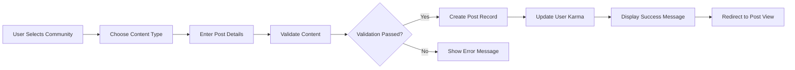
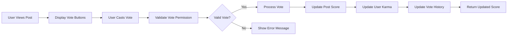

# Content System Requirements Specification

## Executive Summary

This document defines the complete content system for the Reddit-like community platform, including post creation, voting mechanisms, karma calculation, and content ranking algorithms. The system enables users to create and share content within communities while providing community-driven content curation through voting and reputation systems.

## Post Creation System

### Post Creation Workflow



### Post Creation Requirements

**WHEN a user creates a new post, THE system SHALL validate the following requirements:**
- Post title must be between 5 and 300 characters
- Post content must be provided based on content type
- User must be authenticated and have posting permissions in the selected community
- Community must exist and be active

**WHEN creating a text post, THE system SHALL:**
- Accept text content between 1 and 10,000 characters
- Support basic markdown formatting (bold, italics, links, lists)
- Prevent XSS attacks by sanitizing HTML input
- Preserve line breaks and paragraph structure

**WHEN creating a link post, THE system SHALL:**
- Validate URL format and accessibility
- Extract metadata (title, description, image) when available
- Display link preview with title and description
- Prevent duplicate link submissions within the same community

**WHEN creating an image post, THE system SHALL:**
- Accept common image formats (JPEG, PNG, GIF, WebP)
- Enforce maximum file size of 10MB per image
- Generate multiple thumbnail sizes for optimization
- Support alt text for accessibility
- Validate image dimensions (minimum 100px, maximum 4000px)

### Post Metadata Requirements

**THE post system SHALL store the following metadata:**
- Post ID (unique identifier)
- Author user ID
- Community ID
- Post title
- Content type (text, link, image)
- Content data (text content, URL, or image references)
- Creation timestamp
- Last update timestamp
- Vote count (upvotes - downvotes)
- Total votes cast
- Comment count
- View count
- Post status (published, draft, removed, archived)

## Content Types

### Text Posts
**THE text post system SHALL:**
- Support rich text formatting with markdown
- Provide real-time character count
- Auto-save drafts every 30 seconds
- Allow post editing within 24 hours of creation
- Maintain edit history for moderation purposes

### Link Posts
**THE link post system SHALL:**
- Validate URLs using standard URL validation
- Check URL accessibility (HTTP status 200)
- Extract and cache metadata for performance
- Display link preview with:
  - Website title
  - Description snippet
  - Favicon or representative image
  - Domain name
- Prevent spam by limiting identical URL submissions

### Image Posts
**THE image post system SHALL:**
- Process images through secure upload pipeline
- Generate multiple sizes:
  - Thumbnail (150x150)
  - Medium (400x400)
  - Large (800x800)
  - Original (with maximum dimension limits)
- Support progressive JPEG loading
- Implement lazy loading for performance
- Provide image compression without visible quality loss

## Voting Mechanism

### Vote System Architecture



### Vote Requirements

**WHEN a user votes on a post, THE system SHALL:**
- Verify user authentication and voting permissions
- Prevent self-voting on own content
- Allow only one vote per user per post
- Enable vote changing (upvote to downvote or vice versa)
- Prevent vote manipulation through multiple accounts

**THE voting system SHALL implement the following rules:**
- Upvote increases post score by +1
- Downvote decreases post score by -1
- Vote removal cancels previous vote effect
- Vote changes update the score accordingly
- Users can see their own vote status on each post

### Vote Validation Rules

**IF a user attempts to vote on their own content, THEN THE system SHALL:**
- Reject the vote with appropriate error message
- Maintain the post score unchanged
- Log the attempted self-vote for moderation

**WHILE a post is in removed or archived state, THE system SHALL:**
- Disable voting functionality
- Display appropriate status message
- Maintain existing vote counts for historical reference

### Vote Weighting System

**WHERE a user has high karma, THE system SHALL:**
- Apply karma-based vote weighting for controversial sorting
- Use karma as a trust metric in ranking algorithms
- Consider user reputation in spam detection

## Karma Calculation

### Karma Definition
User karma represents reputation earned through community participation and content quality.

### Karma Calculation Formulas

**Post Karma Calculation:**
```
post_karma = (upvotes - downvotes) * karma_multiplier
```

**Comment Karma Calculation:**
```
comment_karma = (upvotes - downvotes) * comment_multiplier
```

**Total User Karma:**
```
total_karma = sum(post_karma) + sum(comment_karma) - penalty_points
```

### Karma Multipliers

**THE karma calculation system SHALL apply the following multipliers:**
- Post karma multiplier: 1.0
- Comment karma multiplier: 0.5
- Award multiplier: 2.0 (for special community awards)
- Penalty multiplier: -1.0 (for removed content)

### Karma Update Triggers

**WHEN a post receives votes, THE system SHALL:**
- Update post author's karma in real-time
- Apply karma changes immediately
- Maintain karma history for auditing
- Cap negative karma at 0 for new users

**WHEN a comment receives votes, THE system SHALL:**
- Update comment author's karma
- Apply comment-specific multiplier
- Track comment karma separately from post karma

### Karma Display Rules

**THE system SHALL display karma as follows:**
- User profile shows total karma
- Post and comment pages show author karma
- Karma rounded to nearest whole number
- Negative karma displayed as 0 for new users (first 30 days)
- Karma breakdown available in user profile

## Content Ranking Algorithms

### Sorting Methods Overview

The platform provides multiple sorting algorithms to surface relevant content:

### Hot Sorting Algorithm

**THE hot sorting algorithm SHALL prioritize posts based on:**
- Vote score (upvotes - downvotes)
- Time decay factor (exponential)
- Comment activity
- View count engagement

**Hot Score Formula:**
```
hot_score = (log10(vote_score + 1) * sign(vote_score)) + 
            (comment_count * 0.1) + 
            (view_count * 0.001) - 
            (time_decay_factor)
```

**WHERE time_decay_factor = (current_time - post_time) / 45000**

### New Sorting Algorithm

**THE new sorting algorithm SHALL:**
- Sort posts by creation timestamp (newest first)
- Apply minimal time-based filtering
- Display posts within last 30 days by default
- Allow custom time range selection

### Top Sorting Algorithm

**THE top sorting algorithm SHALL:**
- Sort by highest net vote score (upvotes - downvotes)
- Apply time-based filtering options:
  - Past hour
  - Past 24 hours
  - Past week
  - Past month
  - Past year
  - All time
- Consider vote velocity for trending content

### Controversial Sorting Algorithm

**THE controversial sorting algorithm SHALL identify posts with:**
- High number of both upvotes and downvotes
- Significant comment engagement
- Polarizing community reaction

**Controversial Score Formula:**
```
controversial_score = (upvotes * downvotes) / (upvotes + downvotes) * 
                      (comment_count ^ 0.5) * 
                      karma_weight_factor
```

**WHERE karma_weight_factor considers voter reputation**

### Rising Sorting Algorithm

**THE rising sorting algorithm SHALL identify:**
- Posts with recent vote acceleration
- Content gaining popularity quickly
- Emerging community discussions

**Rising Score Formula:**
```
rising_score = (recent_votes / time_since_post) * 
               vote_velocity_factor * 
               comment_engagement_factor
```

## Business Rules and Validation

### Content Validation Rules

**WHEN validating post content, THE system SHALL:**
- Check for prohibited content (hate speech, harassment, illegal material)
- Validate URL safety and accessibility
- Scan for spam patterns and duplicate content
- Enforce community-specific posting rules
- Verify image content meets platform standards

### Post Frequency Limits

**THE system SHALL enforce the following posting limits:**
- Maximum 10 posts per user per hour
- Maximum 50 posts per user per day
- Community-specific posting limits based on user karma
- Rate limiting to prevent spam

### Content Quality Requirements

**WHILE a post is being created, THE system SHALL:**
- Check title quality (length, relevance, clarity)
- Validate content relevance to community topic
- Ensure adequate content length for text posts
- Verify link posts point to accessible content
- Confirm image posts meet quality standards

### Automated Content Moderation

**IF a post triggers automated moderation rules, THEN THE system SHALL:**
- Flag content for manual review
- Apply temporary visibility restrictions
- Notify community moderators
- Provide user feedback on moderation actions
- Maintain moderation audit trail

## Error Handling

### User-Facing Error Scenarios

**IF post creation fails validation, THEN THE system SHALL:**
- Display specific error messages indicating the failure reason
- Preserve user input for correction
- Provide guidance on how to fix the issue
- Log the validation failure for monitoring

**WHEN vote processing fails, THE system SHALL:**
- Display vote failure message
- Maintain previous vote state
- Allow retry after brief delay
- Log the failure for debugging

**IF content ranking algorithm encounters errors, THEN THE system SHALL:**
- Fall back to default sorting (new)
- Display system maintenance message
- Continue serving content with reduced functionality
- Alert technical team for investigation

### Recovery Procedures

**WHEN system detects corrupted post data, THE system SHALL:**
- Attempt data recovery from backups
- Display placeholder content with error message
- Allow users to report data issues
- Queue affected content for manual review

## Performance Requirements

### Response Time Expectations

**THE content system SHALL meet the following performance standards:**
- Post creation: < 2 seconds response time
- Vote processing: < 500 milliseconds
- Content loading: < 1 second for initial page load
- Sorting algorithm execution: < 100 milliseconds
- Karma calculation updates: < 200 milliseconds

### Scalability Requirements

**THE system SHALL support:**
- 10,000 concurrent users
- 1,000 posts per minute during peak hours
- 10,000 votes per minute
- 100,000 page views per hour
- Linear scaling with user growth

### Availability Standards

**THE content system SHALL maintain:**
- 99.9% uptime for core functionality
- Graceful degradation during high load
- Automated failover for critical components
- Regular backup of user content and karma data

### Caching Strategy

**THE system SHALL implement caching for:**
- Hot posts and trending content
- User karma scores
- Community statistics
- Sorting algorithm results
- Frequently accessed user profiles

## Integration Points

### User Roles Integration
**THE content system SHALL integrate with user roles to:**
- Enforce posting permissions based on user role
- Apply role-specific content restrictions
- Enable moderator content management capabilities
- Support admin system-wide content controls

### Community Management Integration
**THE content system SHALL work with community management to:**
- Validate community existence and status
- Enforce community-specific posting rules
- Apply community moderation settings
- Support community subscription features

### Comment System Integration
**THE content system SHALL integrate with comment system to:**
- Update comment counts in real-time
- Display comment activity in ranking algorithms
- Sync user karma between posts and comments
- Maintain content relationships

### User Profiles Integration
**THE content system SHALL provide data to user profiles including:**
- User post history
- Vote activity
- Karma breakdown
- Content performance metrics
- Community participation statistics

## Success Metrics

**THE content system SHALL be measured by:**
- User engagement metrics (posts created, votes cast)
- Content quality indicators (upvote ratios, comment engagement)
- System performance (response times, error rates)
- User satisfaction with content discovery
- Community growth through content sharing

## Security Requirements

### Content Security

**WHEN processing user-generated content, THE system SHALL:**
- Implement XSS protection for all text inputs
- Validate and sanitize all user-provided URLs
- Scan uploaded images for malicious content
- Prevent CSRF attacks on voting and posting actions

### Data Protection

**THE system SHALL protect user content by:**
- Encrypting sensitive post metadata at rest
- Implementing proper access controls for private content
- Maintaining audit trails for content modifications
- Providing secure content deletion mechanisms

### Rate Limiting

**THE system SHALL implement rate limiting to prevent abuse:**
- Maximum 10 posts per user per hour
- Maximum 50 votes per user per minute
- Maximum 5 content reports per user per hour
- Progressive rate limiting for suspicious activity

## Moderation Integration

### Automated Content Screening

**WHEN new content is created, THE system SHALL:**
- Screen for prohibited keywords and patterns
- Check for duplicate content across the platform
- Analyze posting patterns for spam detection
- Flag suspicious content for manual review

### Moderation Workflow Integration

**THE content system SHALL integrate with moderation tools to:**
- Provide quick access to reported content
- Enable bulk moderation actions
- Track moderation history for each post
- Support content restoration after appeal

### User Reputation Integration

**WHERE user karma affects content visibility, THE system SHALL:**
- Apply karma-based content ranking adjustments
- Limit posting frequency for low-karma users
- Provide enhanced visibility for high-quality contributors
- Implement progressive trust systems for new users

This document provides comprehensive business requirements for implementing a robust content system that enables user-generated content creation, community-driven curation through voting, reputation building through karma systems, and intelligent content ranking through multiple algorithms. The system supports text, link, and image content types with comprehensive validation, security, and performance requirements.

> *Developer Note: This document defines **business requirements only**. All technical implementations (architecture, APIs, database design, etc.) are at the discretion of the development team.*