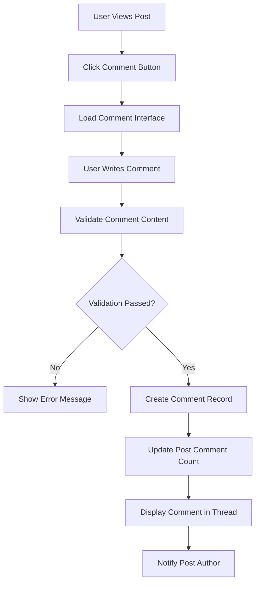

# Comment System Requirements

## 1. Introduction and System Overview

The comment system is a fundamental component of the Reddit-like community platform, enabling threaded discussions and user interactions around content. This system facilitates democratic conversation through nested replies, voting mechanisms, and community-driven content curation. The comment system integrates with user authentication, content ranking, karma calculation, and moderation systems to create a comprehensive discussion platform.

### 1.1 Business Context
Comments drive user engagement and community interaction by allowing users to express opinions, ask questions, and participate in discussions. The system balances free expression with content quality through voting mechanisms and moderation tools.

### 1.2 Scope and Purpose
This document specifies the complete business requirements for comment creation, nested replies, voting systems, ranking algorithms, moderation capabilities, and integration points with other platform components.

## 2. Comment Creation Requirements

### 2.1 Comment Creation Workflow



### 2.2 Comment Creation Business Rules

**WHEN** a user creates a comment, **THE** system **SHALL** require the user to be authenticated with valid member status.

**WHEN** a user submits a comment, **THE** system **SHALL** validate comment content meets the following requirements:
- Comment text contains between 1 and 10,000 characters
- Comment does not contain prohibited content (spam, harassment, illegal material)
- User has not exceeded daily comment limit (100 comments per day)
- User has posting permissions in the target community

**WHERE** comment validation fails, **THE** system **SHALL** display specific error messages indicating the validation failure reason.

**WHEN** comment creation succeeds, **THE** system **SHALL**:
- Create comment record with author, timestamp, and parent references
- Update post comment count immediately
- Display comment in the appropriate thread position
- Send notification to post author about new comment
- Update user comment statistics

### 2.3 Comment Editing and Deletion

**WHEN** a user edits their comment, **THE** system **SHALL** allow edits within 24 hours of original posting.

**WHEN** a user deletes their comment, **THE** system **SHALL**:
- Remove comment content but preserve comment structure
- Display "[deleted]" placeholder with author information
- Maintain reply threads and voting history
- Update comment counts appropriately

**WHERE** a moderator removes a comment, **THE** system **SHALL**:
- Remove comment content immediately
- Preserve removal reason and moderator information
- Notify comment author of removal with specific reason
- Log moderation action for audit purposes

## 3. Nested Reply System

### 3.1 Reply Structure Requirements

**THE** system **SHALL** support nested comment replies up to 6 levels deep to maintain readable conversation threads.

**WHEN** a user replies to a comment, **THE** system **SHALL**:
- Create nested reply with proper parent-child relationship
- Maintain thread integrity and conversation flow
- Update parent comment reply count
- Display visual indentation to indicate nesting level

**WHERE** comment nesting reaches the maximum depth (6 levels), **THE** system **SHALL** prevent further nested replies and suggest starting a new thread.

### 3.2 Thread Management

**THE** system **SHALL** provide thread management features including:
- Collapse/expand comment threads
- "Load more replies" functionality for long threads
- Visual indicators for hidden replies
- Keyboard navigation through comment threads

**WHEN** viewing comment threads, **THE** system **SHALL**:
- Display threads with clear visual hierarchy
- Maintain proper indentation for nested levels
- Provide smooth scrolling through long conversations
- Support efficient loading of large comment sections

## 4. Comment Voting System

### 4.1 Voting Mechanism

**WHEN** an authenticated user views a comment, **THE** system **SHALL** display upvote and downvote buttons.

**WHEN** a user upvotes a comment, **THE** system **SHALL**:
- Increment comment vote score by +1
- Update comment author karma by +1 point
- Record vote in user voting history
- Recalculate comment ranking position

**WHEN** a user downvotes a comment, **THE** system **SHALL**:
- Decrement comment vote score by -1
- Update comment author karma by -1 point
- Record vote in user voting history
- Recalculate comment ranking position

**THE** system **SHALL** prevent users from voting on their own comments.

**THE** system **SHALL** allow users to change their vote on a comment:
- Changing from upvote to downvote: -2 to vote score
- Changing from downvote to upvote: +2 to vote score
- Removing vote: reverse previous vote impact

### 4.2 Vote Validation Rules

**THE** system **SHALL** ensure each user can only vote once per comment.

**THE** system **SHALL** track vote history to prevent vote manipulation.

**WHILE** processing votes, **THE** system **SHALL** update comment scores in real-time.

## 5. Comment Ranking Algorithms

### 5.1 Sorting Methods

**THE** system **SHALL** provide multiple comment sorting options:
- **Best**: Comments with highest positive engagement using Wilson score
- **Top**: Comments with highest net vote score
- **New**: Comments sorted by creation time (newest first)
- **Old**: Comments sorted by creation time (oldest first)
- **Controversial**: Comments with high vote counts but close scores

### 5.2 Best Comment Algorithm

**THE** system **SHALL** use Wilson score confidence interval for "Best" sorting:
- Considers both upvotes and downvotes
- Prioritizes comments with high positive engagement
- Balances new comments with established high-scoring comments
- Uses confidence interval to handle low vote counts

**THE** Wilson score formula **SHALL** be implemented as:
```
score = (p + z²/2n) / (1 + z²/n) ± z * sqrt((p(1-p) + z²/4n) / n) / (1 + z²/n)
Where:
- p = upvote ratio
- n = total votes
- z = confidence level (1.96 for 95% confidence)
```

### 5.3 Top Comment Algorithm

**THE** system **SHALL** sort comments by net vote score (upvotes - downvotes) for "Top" sorting.

**WHERE** multiple comments have identical scores, **THE** system **SHALL** use creation time as tiebreaker (newer comments first).

### 5.4 Controversial Comment Algorithm

**THE** system **SHALL** identify controversial comments using the formula:
```
controversy_score = min(upvotes, downvotes) * total_votes / abs(upvotes - downvotes)
```

**WHERE** upvotes equal downvotes, **THE** system **SHALL** maximize controversy score.

## 6. Comment Karma System

### 6.1 Karma Calculation

**THE** system **SHALL** calculate comment karma based on net vote score.

**WHEN** a comment receives an upvote, **THE** comment author **SHALL** receive +1 karma.

**WHEN** a comment receives a downvote, **THE** comment author **SHALL** receive -1 karma.

**THE** system **SHALL** cap daily karma gain/loss per user to prevent manipulation:
- Maximum karma gain per day: 1000 points
- Maximum karma loss per day: 500 points

### 6.2 Karma Display

**THE** system **SHALL** display total user karma on user profiles.

**THE** system **SHALL** display comment karma (net votes) on individual comments.

**WHERE** a comment is deleted, **THE** system **SHALL** preserve the karma impact on the author.

## 7. Comment Moderation

### 7.1 Reporting System

**WHEN** a user views a comment, **THE** system **SHALL** provide a "Report" option.

**WHEN** a user reports a comment, **THE** system **SHALL** present reporting categories:
- Harassment
- Hate speech
- Spam
- Misinformation
- Other violations

**THE** system **SHALL** allow users to provide additional context for reports.

**WHEN** a comment receives multiple reports, **THE** system **SHALL** flag it for moderator review.

### 7.2 Moderator Actions

**WHERE** a moderator reviews a reported comment, **THE** system **SHALL** provide moderation tools:
- Remove comment
- Lock comment (prevent further replies)
- Ban user from community
- Approve comment (dismiss reports)

**WHEN** a moderator removes a comment, **THE** system **SHALL** notify the comment author.

**THE** system **SHALL** track moderation actions for accountability.

### 7.3 Automated Moderation

**THE** system **SHALL** automatically collapse comments with highly negative scores:
- Threshold: Comments with score ≤ -5
- Collapsed comments require user action to expand

**THE** system **SHALL** automatically flag comments containing banned keywords.

## 8. Performance Requirements

### 8.1 Response Time Expectations

**WHEN** loading comment threads, **THE** system **SHALL** display initial comments within 2 seconds.

**WHEN** loading additional replies, **THE** system **SHALL** display them within 1 second.

**WHEN** submitting a comment, **THE** system **SHALL** process and display it within 500 milliseconds.

**WHEN** processing votes, **THE** system **SHALL** update counts within 200 milliseconds.

### 8.2 Scalability Requirements

**THE** system **SHALL** support loading comment threads with up to 1000 comments.

**THE** system **SHALL** efficiently handle nested replies up to 6 levels deep.

**THE** system **SHALL** maintain performance with concurrent comment creation from multiple users.

**THE** system **SHALL** support 10,000 concurrent comment operations during peak usage.

### 8.3 Availability Standards

**THE** comment system **SHALL** maintain 99.9% availability for core functionality.

**THE** system **SHALL** implement graceful degradation during high load periods.

**THE** system **SHALL** provide read-only access during maintenance windows.

### 8.4 Caching Strategy

**THE** system **SHALL** cache popular comment threads to improve performance.

**WHEN** comments are updated, **THE** system **SHALL** invalidate relevant caches.

**THE** system **SHALL** implement comment preloading for faster thread navigation.

## 9. User Experience Requirements

### 9.1 Comment Display

**THE** system **SHALL** display comments with clear visual hierarchy:
- Different background colors for alternating nesting levels
- Clear indentation to show reply relationships
- Visual indicators for collapsed threads
- Highlighting for new comments since last visit

**THE** system **SHALL** provide keyboard navigation for comment threads.

**THE** system **SHALL** support infinite scroll for large comment sections.

### 9.2 Accessibility

**THE** system **SHALL** ensure comment threads are accessible to screen readers.

**THE** system **SHALL** provide proper ARIA labels for comment relationships.

**THE** system **SHALL** support keyboard navigation through comment threads.

**THE** system **SHALL** provide high contrast options for better readability.

### 9.3 Mobile Experience

**THE** system **SHALL** optimize comment display for mobile devices:
- Touch-friendly voting buttons
- Responsive comment threading
- Efficient data loading for limited bandwidth
- Gesture support for navigation

## 10. Integration Points

### 10.1 User Profile Integration

**THE** system **SHALL** display user comment activity on user profiles.

**THE** system **SHALL** calculate and display user comment karma separately from post karma.

**THE** system **SHALL** provide comment history in user activity feeds.

### 10.2 Content System Integration

**THE** system **SHALL** integrate with the post voting system for consistent user experience.

**THE** system **SHALL** share moderation tools with the post moderation system.

**THE** system **SHALL** update post engagement metrics based on comment activity.

### 10.3 Notification System Integration

**WHEN** a user receives a reply to their comment, **THE** system **SHALL** send a notification.

**WHEN** a moderator takes action on a reported comment, **THE** system **SHALL** notify the reporter.

**WHEN** a comment receives significant engagement, **THE** system **SHALL** notify the author.

### 10.4 Authentication Integration

**THE** system **SHALL** validate user permissions before allowing comment creation.

**THE** system **SHALL** enforce community-specific posting rules based on user roles.

**THE** system **SHALL** track comment activity for user reputation calculations.

## 11. Error Handling

### 11.1 Comment Creation Errors

**IF** comment content exceeds maximum length, **THEN THE** system **SHALL** return an error message indicating character limit.

**IF** comment contains prohibited content, **THEN THE** system **SHALL** reject submission with specific violation explanation.

**IF** user attempts to reply to a deleted comment, **THEN THE** system **SHALL** prevent reply creation.

**IF** daily comment limit is exceeded, **THEN THE** system **SHALL** prevent further comments until reset.

### 11.2 Voting Errors

**IF** user attempts to vote on their own comment, **THEN THE** system **SHALL** display appropriate message.

**IF** voting system is temporarily unavailable, **THEN THE** system **SHALL** queue votes for later processing.

**IF** vote manipulation is detected, **THEN THE** system **SHALL** invalidate suspicious votes and notify moderators.

### 11.3 Performance Errors

**IF** comment loading times exceed 5 seconds, **THEN THE** system **SHALL** display loading indicators.

**IF** comment thread becomes too large, **THEN THE** system **SHALL** implement pagination.

**IF** system resources are constrained, **THEN THE** system **SHALL** prioritize core functionality.

## 12. Business Rules and Validation

### 12.1 Content Validation Rules

**THE** system **SHALL** validate all comment content against platform guidelines:
- Minimum 1 character length
- Maximum 10,000 character length
- Prohibited content filtering
- Spam pattern detection
- Community-specific rule enforcement

### 12.2 User Behavior Constraints

**THE** system **SHALL** enforce daily comment limits:
- Maximum 100 comments per user per day
- Rate limiting: 10 comments per minute
- Burst protection: 5 comments within 30 seconds

**THE** system **SHALL** monitor for abusive commenting patterns:
- Rapid-fire commenting without engagement
- Copy-paste identical comments
- Harassment through repeated mentions

### 12.3 Moderation Enforcement

**THE** system **SHALL** provide clear moderation guidelines for comment content.

**THE** system **SHALL** ensure consistent application of moderation rules.

**THE** system **SHALL** provide appeal processes for moderation actions.

## 13. Success Metrics

### 13.1 Engagement Metrics

**THE** system **SHALL** track comment engagement metrics:
- Average comments per post
- Reply rate (percentage of comments that receive replies)
- Comment voting participation rate
- Time spent in comment threads
- Comment retention rates

### 13.2 Quality Metrics

**THE** system **SHALL** monitor comment quality indicators:
- Report-to-comment ratio
- Moderator action rate
- User satisfaction with comment system
- Comment length distribution
- Voting pattern analysis

### 13.3 Performance Metrics

**THE** system **SHALL** monitor system performance:
- Comment creation response time
- Comment loading time
- Vote processing latency
- System availability for comment features
- Error rates and recovery times

### 13.4 User Satisfaction

**THE** system **SHALL** measure user satisfaction through:
- User feedback surveys
- Comment system usage patterns
- Feature adoption rates
- User retention correlated with comment engagement

## 14. Future Considerations

### 14.1 Enhanced Features

**THE** system **MAY** support comment formatting in future releases.

**THE** system **MAY** implement comment search functionality.

**THE** system **MAY** add comment saving/bookmarking features.

**THE** system **MAY** support comment awards or recognition systems.

### 14.2 Scaling Considerations

**THE** system **SHALL** be designed to handle increasing comment volume.

**THE** system **SHALL** support distributed comment storage for large communities.

**THE** system **SHALL** implement efficient comment indexing for fast retrieval.

**THE** system **SHALL** plan for comment archive strategies for historical data.

### 14.3 Integration Enhancements

**THE** system **MAY** integrate with external content moderation services.

**THE** system **MAY** support advanced comment analytics for community managers.

**THE** system **MAY** implement machine learning for comment quality assessment.

This enhanced comment system specification provides comprehensive business requirements for implementing a robust, scalable, and user-friendly commenting platform that supports democratic discussion, community moderation, and seamless integration with other platform components. The requirements ensure the system can handle high-volume commenting while maintaining performance, security, and user satisfaction standards.

> *Developer Note: This document defines **business requirements only**. All technical implementations (architecture, APIs, database design, etc.) are at the discretion of the development team.*