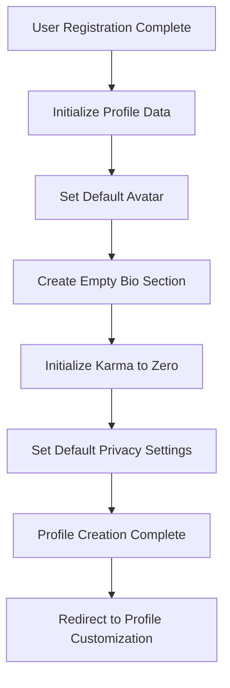

# User Profiles System Requirements

## 1. Profile Structure and Information Display

### 1.1 Core Profile Information

WHEN a user views any profile page, THE system SHALL display the following core information prominently:
- Username and optional display name
- Account creation date and calculated account age
- Total karma score with separate post and comment karma breakdown
- Profile avatar image or default placeholder
- Optional "about" or bio section with maximum 500 characters
- Earned trophies or achievement badges
- Cake day anniversary celebration indicator

WHERE a user has moderator or administrator roles, THE system SHALL display appropriate role badges and indicators.

### 1.2 Profile Information Organization

THE profile page SHALL organize information into clearly defined sections:
- **Overview tab**: Combined chronological view of posts and comments
- **Posts tab**: User-submitted posts only, sorted by creation date
- **Comments tab**: User comments only, showing threaded conversations
- **Saved tab**: Posts and comments saved by the user for later viewing
- **Hidden tab**: Posts intentionally hidden by the user from their feed
- **Upvoted/Downvoted tabs**: Voting history with privacy controls

### 1.3 Profile Statistics Display

WHEN displaying user statistics, THE system SHALL present:
- Total post karma accumulated from post upvotes/downvotes
- Total comment karma accumulated from comment upvotes/downvotes
- Count of posts submitted across all communities
- Count of comments made throughout the platform
- Number of communities where user holds moderator status
- Account age displayed in years, months, and days
- Trophy case showing earned achievements and milestones

## 2. Profile Creation and Initial Setup

### 2.1 Profile Creation Workflow



WHEN a user completes registration, THE system SHALL automatically create a basic profile with default settings.

### 2.2 Profile Information Validation

WHEN users update profile information, THE system SHALL enforce validation rules:
- Display name limited to 50 characters with alphanumeric and basic punctuation
- Bio/about section restricted to 500 characters with basic formatting support
- Avatar images must be JPEG, PNG, or WebP format under 5MB
- Banner images must be JPEG, PNG, or WebP format under 10MB
- Social media links must be valid URLs from approved domains

WHERE profile content violates platform guidelines, THE system SHALL prevent saving and display specific error messages.

## 3. Activity History and Timeline

### 3.1 Activity Tracking System

WHEN a user creates content or interacts with the platform, THE system SHALL record the following activities:
- Post submissions including text, link, and image posts
- Comment creation with parent post and community context
- Post upvotes and downvotes with timestamp and content reference
- Comment upvotes and downvotes with context preservation
- Community subscription and unsubscribe actions
- Content saving and hiding actions
- Awards given to and received from other users
- Moderation actions performed (for moderators only)

### 3.2 Activity Timeline Organization

THE activity timeline SHALL organize user activities with the following structure:
- Activities displayed in reverse chronological order (newest first)
- Grouping by relative time periods (Today, Yesterday, This Week, Last Week, etc.)
- Post and comment previews showing truncated content with "read more" option
- Full community/subreddit context displayed for each activity
- Vote counts and timestamps visible for each activity item
- Visual indicators for content type (text, link, image)

### 3.3 Activity Filtering and Sorting

WHERE users view their activity history, THE system SHALL provide comprehensive filtering options:
- Filter by activity type (posts, comments, votes, subscriptions, saves)
- Filter by time period (last 24 hours, week, month, year, all time)
- Filter by specific community/subreddit
- Filter by content type (text, link, image)
- Sort by date (newest first, oldest first)
- Sort by popularity (most votes, most comments)
- Sort by controversy (balanced upvotes/downvotes)

## 4. Karma System Implementation

### 4.1 Karma Calculation Rules

THE karma system SHALL calculate user reputation using the following formulas:

**Post Karma Calculation:**
```
post_karma = sum((post_upvotes - post_downvotes) * post_karma_multiplier)
WHERE post_karma_multiplier = 1.0
AND maximum_karma_per_post = 100
AND minimum_karma_per_post = -100
```

**Comment Karma Calculation:**
```
comment_karma = sum((comment_upvotes - comment_downvotes) * comment_karma_multiplier)
WHERE comment_karma_multiplier = 0.5
AND maximum_karma_per_comment = 10
AND minimum_karma_per_comment = -10
```

**Total Karma:**
```
total_karma = post_karma + comment_karma - penalty_points
WHERE penalty_points are applied for content removals
AND total_karma cannot go below 0 for new users (first 30 days)
```

### 4.2 Karma Display and Visibility

WHEN displaying karma information, THE system SHALL present it as follows:
- Total karma prominently displayed on user profile header
- Separate post karma and comment karma values in detailed view
- Optional karma breakdown by community (user-configurable)
- Karma trends showing weekly/monthly changes
- Achievement milestones based on karma thresholds

WHERE users prefer privacy, THE system SHALL provide karma visibility controls:
- Option to hide total karma from public view
- Option to hide individual post/comment scores
- Option to opt out of karma display entirely
- Granular control over which karma metrics are visible

### 4.3 Karma Limitations and Anti-Manipulation

WHILE calculating karma, THE system SHALL implement protections against manipulation:
- Vote fuzzing to prevent exact karma tracking
- Limits on karma gain from single posts/comments
- Anti-brigading measures to detect coordinated voting
- Rate limiting on voting from new accounts
- Karma caps to prevent exponential growth

## 5. Profile Customization Options

### 5.1 Avatar and Banner Management

WHEN users customize their profiles, THE system SHALL support:
- Profile picture/avatar upload with cropping tools
- Profile banner/header image upload
- File format support for JPEG, PNG, and WebP images
- File size limits: 5MB maximum for avatars, 10MB maximum for banners
- Automatic image optimization and resizing
- Accessibility requirements including alt text for images

### 5.2 Bio and About Section

THE profile SHALL include comprehensive bio/about section capabilities:
- Bio section with 500-character limit
- Rich text formatting support (bold, italics, links, lists)
- Link validation for external URLs
- Content moderation for inappropriate bios
- Preview functionality before saving changes
- Version history for bio edits

### 5.3 Display Preferences and Personalization

WHERE users customize their display experience, THE system SHALL provide options for:
- Display name separate from username
- Color scheme preferences (light mode, dark mode, auto)
- Default content sorting for activity feeds
- Content display density (compact, card, classic views)
- NSFW content filtering preferences
- Language and regional formatting preferences
- Accessibility features (high contrast, larger text)

### 5.4 Social Links and Verification

THE profile system SHALL support external social integration:
- External social media links (Twitter, GitHub, personal websites)
- Verified email status display
- Account verification badges for notable users
- Moderator and administrator role indicators
- Community-specific flair and badges
- Achievement and trophy display cases

## 6. Privacy and Visibility Settings

### 6.1 Profile Visibility Controls

WHEN users manage their privacy settings, THE system SHALL provide granular controls for:
- Public/private profile settings
- Activity feed visibility (public, followers only, private)
- Karma score visibility (show, hide, show only to followers)
- Online status visibility
- Followers/following lists visibility
- Email address visibility
- Registration date visibility

### 6.2 Content Privacy Settings

WHERE users want to limit content exposure, THE system SHALL enable:
- Option to make individual posts/comments private
- Ability to hide voting history from public view
- Control over who can see saved content
- Option to hide from user search results
- Geographic content visibility restrictions
- Time-based content expiration settings

### 6.3 Data Export and Management

THE system SHALL provide comprehensive data management capabilities:
- Profile data export functionality in standard formats (JSON, CSV)
- Bulk delete options for posts and comments
- Account deactivation (temporary suspension)
- Account deletion (permanent removal)
- Data retention period settings
- Downloadable archive of all user content

## 7. User Interaction Features

### 7.1 Profile Navigation and Discovery

WHEN users navigate profiles, THE system SHALL provide intuitive navigation:
- Quick navigation between profile sections with visual indicators
- Search functionality within user's own content
- Filter by community/subreddit within profile
- Sort by date, popularity, or controversy
- Keyboard navigation support for accessibility
- Breadcrumb navigation showing current section

### 7.2 Content Management from Profile

THE profile interface SHALL enable comprehensive content management:
- Edit user's own posts and comments directly from profile
- Delete user's own content with confirmation prompts
- Save posts/comments for later viewing with organizational folders
- Hide posts from feed with option to unhide later
- Report inappropriate content found on profile pages
- Bulk actions for multiple content items

### 7.3 Social Features Integration

THE profile system SHALL support social interactions:
- User following/follower system with mutual consent
- Direct messaging capabilities between users
- User blocking functionality with comprehensive blocking
- User reporting system for inappropriate profiles
- Achievement/trophy display with earning criteria
- Gift/award giving between users

## 8. Performance Requirements

### 8.1 Profile Loading Performance

WHEN users access profile pages, THE system SHALL meet performance standards:
- Load basic profile information within 500 milliseconds
- Display complete activity feed within 2 seconds
- Support pagination for profiles with extensive activity history
- Cache frequently accessed profile data for 15 minutes
- Implement lazy loading for activity items beyond initial view
- Maintain performance with profiles containing 10,000+ activities

### 8.2 Activity Feed Performance

THE activity feed system SHALL deliver responsive performance:
- Load initial 25 activity items within 1 second
- Support infinite scroll with loading indicators
- Implement efficient database queries for activity retrieval
- Cache user activity aggregates to reduce computation
- Background pre-loading of additional activity pages
- Progressive enhancement for slow network conditions

### 8.3 Karma Calculation Performance

THE karma calculation system SHALL operate efficiently:
- Calculate karma scores without performance degradation
- Update karma in near real-time (within 5 minutes of vote activity)
- Cache karma totals to reduce database load
- Handle high-volume voting scenarios without slowdown
- Background processing for karma recalculations
- Efficient aggregation for karma breakdowns

## 9. Business Rules and Validation

### 9.1 Content Validation Rules

THE system SHALL enforce the following content rules for profiles:
- Bio/about section limited to 500 characters with length validation
- Display name limited to 50 characters with format validation
- Social links must be valid URLs with domain validation
- Avatar images must meet size and format requirements
- Profile content must comply with community guidelines
- Age verification for certain profile features

### 9.2 Privacy and Security Rules

WHERE user privacy and security are concerned, THE system SHALL implement:
- Age verification for profile features with age restrictions
- Content moderation for profile information and bios
- Anti-harassment measures in profile interactions
- Data protection for sensitive profile information
- Compliance with privacy regulations (GDPR, CCPA, etc.)
- Secure transmission of all profile data

### 9.3 User Behavior Constraints

WHILE users interact with profile features, THE system SHALL restrict:
- Excessive profile updates (maximum 10 changes per hour)
- Spammy profile content creation and updates
- Impersonation through profile information
- Harassment through profile interactions
- Automated profile scraping and data collection
- Bulk operations that could impact system performance

### 9.4 Profile Data Retention

THE system SHALL implement comprehensive data retention policies:
- Retain profile data according to data retention policies
- Provide data export functionality upon user request
- Allow permanent deletion of profile data with confirmation
- Maintain activity logs for moderation purposes
- Archive deleted profiles for 30 days before permanent removal
- Comply with legal data retention requirements

## 10. Integration Requirements

### 10.1 Authentication System Integration

THE profile system SHALL integrate seamlessly with authentication to:
- Display user role indicators (member, moderator, admin)
- Show account verification status and badges
- Display account creation date and age
- Support profile access based on authentication status
- Sync profile updates with authentication records
- Maintain profile consistency during account changes

### 10.2 Content System Integration

THE profile system SHALL integrate with content systems to:
- Display user posts and comments with full context
- Show voting history and karma calculations
- Track content creation and interaction metrics
- Support content management operations from profile
- Maintain content relationships when profiles change
- Sync content visibility with profile privacy settings

### 10.3 Community System Integration

THE profile system SHALL integrate with community features to:
- Display community subscriptions and memberships
- Show moderation responsibilities and activities
- Track cross-community participation and reputation
- Support community-specific profile settings
- Maintain community relationships in profile context
- Display community achievements and recognition

## 11. Success Metrics

### 11.1 User Engagement Metrics

THE system SHALL track profile engagement through:
- Profile completion rates and adoption
- Profile customization feature usage statistics
- Activity feed usage and interaction rates
- Profile visit frequency and duration
- User interaction rates through profiles
- Profile update frequency and patterns

### 11.2 Performance Metrics

THE system SHALL monitor profile system performance:
- Profile page load times and responsiveness
- Activity feed response times and efficiency
- Karma calculation performance and accuracy
- Profile update success rates and error rates
- System resource usage for profile operations
- Cache effectiveness for profile data

### 11.3 Quality Metrics

THE system SHALL measure profile system quality through:
- User satisfaction with profile features
- Profile data accuracy and consistency
- Privacy setting adoption and usage rates
- Content moderation effectiveness on profiles
- User retention correlated with profile usage
- Error rates and user support requests

## 12. Future Enhancement Considerations

### 12.1 Advanced Profile Features

THE system MAY support enhanced profile capabilities in future releases:
- Advanced profile customization with CSS support
- Integrated blog or portfolio sections
- Enhanced social networking features
- Profile analytics and insights
- Advanced privacy and sharing controls
- Profile themes and skins

### 12.2 Scaling Considerations

THE profile system SHALL be designed for future scaling:
- Support for millions of user profiles
- Efficient storage and retrieval of profile data
- Distributed profile data management
- Advanced caching strategies for high-traffic profiles
- Scalable activity tracking and history
- Performance optimization for large activity sets

This comprehensive user profiles system provides the foundation for user identity, reputation tracking, and personalization within the Reddit-like community platform. The system enables users to build their identity, track their contributions, and customize their experience while maintaining performance, privacy, and integration with other platform systems.

> *Developer Note: This document defines **business requirements only**. All technical implementations (architecture, APIs, database design, etc.) are at the discretion of the development team.*