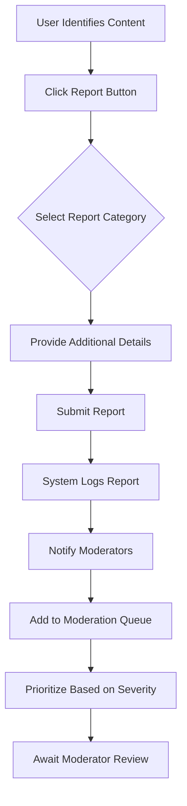

# Community Moderation and Reporting System Requirements

## Introduction & System Overview

The moderation system provides comprehensive tools for maintaining community safety, enforcing content guidelines, and managing user behavior across the Reddit-like platform. This system enables both automated and human-driven content moderation through a structured workflow that balances community autonomy with platform-wide standards.

### Business Context
A robust moderation system is essential for maintaining platform quality, preventing abuse, and ensuring a positive user experience. The system must support both community-level moderation by designated moderators and platform-level oversight by administrators.

## Content Reporting System

### Reportable Content Types
Users can report various types of inappropriate content through a standardized reporting interface:

**WHEN** a user identifies inappropriate content, **THE** system **SHALL** provide reporting options for:
- Spam or unwanted commercial content
- Harassment or personal attacks
- Hate speech or discriminatory content
- Illegal content or activities
- Personal information exposure
- Impersonation or fake accounts
- Content that violates community-specific rules

### Reporting Workflow

**WHEN** a user submits a report, **THE** system **SHALL**:
1. Record the report timestamp, reporter identity, and reported content
2. Assign a unique report ID for tracking
3. Add the report to the appropriate moderation queue
4. Notify relevant moderators based on community assignment
5. Maintain reporter anonymity from the reported user

**WHEN** multiple users report the same content, **THE** system **SHALL** consolidate reports and increase priority in the moderation queue.

### Report Categories and Severity Levels
| Report Category | Severity Level | Response Time Target | Auto-Action Threshold |
|-----------------|----------------|---------------------|----------------------|
| Spam/Commercial | Medium | 24 hours | 5+ reports triggers auto-removal |
| Harassment | High | 4 hours | 3+ reports triggers review priority |
| Hate Speech | Critical | 1 hour | 2+ reports triggers immediate review |
| Illegal Content | Critical | 15 minutes | 1 report triggers immediate review |
| Personal Info | High | 2 hours | 2+ reports triggers auto-removal |
| Impersonation | Medium | 12 hours | Manual review required |

## Moderator Tools & Workflow

### Moderator Permissions Matrix
| Action | Community Moderator | Platform Admin |
|--------|---------------------|----------------|
| Remove reported content | ✅ | ✅ |
| Ban users from community | ✅ | ✅ |
| View moderation queue | ✅ | ✅ |
| Access user report history | ✅ | ✅ |
| Suspend users platform-wide | ❌ | ✅ |
| Override community decisions | ❌ | ✅ |
| Access platform analytics | ❌ | ✅ |
| Manage moderator assignments | ❌ | ✅ |

### Moderation Queue Management
**WHEN** a moderator accesses the moderation interface, **THE** system **SHALL** display:
- Prioritized list of reported content
- Report category and severity indicators
- Number of duplicate reports
- Time since report submission
- User history and reputation context

**WHEN** a moderator reviews reported content, **THE** system **SHALL** provide:
1. Full context of the reported content
2. User's posting history and karma score
3. Previous moderation actions against the user
4. Community-specific rules reference
5. Quick-action buttons for common decisions

### Content Removal Process
**WHEN** a moderator removes content, **THE** system **SHALL**:
1. Remove the content from public view immediately
2. Notify the content author with removal reason
3. Record the removal action in moderation logs
4. Apply karma penalties if appropriate
5. Provide appeal mechanism for the author

**IF** removed content violates platform-wide policies, **THEN THE** system **SHALL** escalate to administrators for platform-level action.

### Comment Moderation Features
**WHEN** moderating comments, **THE** system **SHALL** provide:
- Collapsed comment threads for easy navigation
- User reputation context alongside comments
- Quick removal of entire comment chains
- Ability to lock specific comment threads
- Option to distinguish moderator comments

## Automated Moderation Features

### Automated Content Filtering
**WHILE** content is being submitted, **THE** system **SHALL** automatically flag content that:
- Contains known spam patterns or keywords
- Matches previously removed content signatures
- Includes blacklisted URLs or domains
- Contains personal information patterns
- Uses excessive profanity or hate speech indicators

**WHEN** automated filtering identifies potential violations, **THE** system **SHALL**:
1. Place content in pending review state
2. Notify moderators of automated flagging
3. Allow moderators to override automated decisions
4. Learn from moderator overrides to improve accuracy

### Spam Detection System
**THE** system **SHALL** employ machine learning algorithms to detect:
- Repetitive posting patterns
- Commercial content in non-commercial communities
- Low-quality or auto-generated content
- Cross-posting abuse across multiple communities
- Bot-like behavior patterns

### User Behavior Monitoring
**WHILE** users are active on the platform, **THE** system **SHALL** monitor for:
- Rapid-fire posting without engagement
- Mass reporting without valid reasons
- Coordinated voting manipulation
- Multiple account creation from same IP
- Suspicious karma farming patterns

## User Banning & Suspension System

### Community-Level Bans
**WHEN** a community moderator bans a user, **THE** system **SHALL**:
1. Prevent the user from posting in that community
2. Allow the user to continue viewing community content
3. Notify the user of ban reason and duration
4. Provide ban appeal process to community moderators
5. Record ban history for future reference

### Ban Duration Types
| Ban Type | Duration | Appeal Wait Period | Karma Impact |
|----------|----------|-------------------|-------------|
| Temporary | 1-30 days | 24 hours | Minor penalty |
| Extended | 31-90 days | 72 hours | Moderate penalty |
| Permanent | Indefinite | 7 days | Significant penalty |
| Shadow | Variable | N/A | No immediate impact |

### Platform-Level Suspensions
**WHERE** platform administrators identify severe violations, **THE** system **SHALL** allow:
- Temporary platform-wide suspensions (1-30 days)
- Permanent account termination for repeated violations
- IP-based restrictions for ban evasion attempts
- Device fingerprinting for persistent abusers

### Ban Evasion Prevention
**THE** system **SHALL** detect and prevent ban evasion through:
- IP address pattern analysis
- Browser fingerprint matching
- Account creation behavior monitoring
- Content similarity analysis across accounts
- Coordination detection in voting patterns

## Escalation Procedures

### Moderator-to-Admin Escalation
**WHEN** community moderators encounter situations requiring platform-level intervention, **THE** system **SHALL** provide:
1. Direct escalation channel to administrators
2. Priority handling for escalated cases
3. Full context transfer including moderation history
4. Expected response time commitments
5. Follow-up mechanism for unresolved issues

### User Appeal Process
**WHEN** users wish to appeal moderation decisions, **THE** system **SHALL**:
1. Provide standardized appeal forms
2. Require specific reasoning for appeals
3. Route appeals to appropriate moderators or administrators
4. Set clear response time expectations
5. Allow one appeal per moderation action
6. Provide final decision communication

### Critical Incident Handling
**IF** the system detects coordinated abuse campaigns or security threats, **THEN THE** system **SHALL**:
1. Automatically flag suspicious patterns
2. Notify platform administrators immediately
3. Implement temporary protective measures
4. Preserve evidence for investigation
5. Coordinate with legal authorities when required

## Moderation Analytics & Reporting

### Performance Metrics
**THE** system **SHALL** track and report on moderation effectiveness through:
- Average response time to reports
- Report resolution rates by category
- Moderator activity and decision patterns
- False positive/negative rates in automated systems
- User satisfaction with moderation outcomes

### Community Health Indicators
**WHILE** the platform operates, **THE** system **SHALL** monitor:
- Report-to-content ratio trends
- User retention after moderation actions
- Community growth and engagement metrics
- Repeat offender patterns
- Moderation workload distribution

### Reporting Dashboard
**WHEN** administrators access moderation analytics, **THE** system **SHALL** provide:
- Real-time moderation queue status
- Historical trend analysis
- Moderator performance metrics
- Community-specific moderation patterns
- Automated system accuracy reports

## Integration with Other Systems

### User Karma Integration
**WHEN** moderation actions are taken, **THE** system **SHALL** adjust user karma scores based on:
- Content removal severity and frequency
- Ban duration and type
- Repeat violation patterns
- Successful appeal outcomes

### Content Ranking Impact
**WHERE** content receives multiple valid reports, **THE** system **SHALL** temporarily reduce its visibility in ranking algorithms until moderation review.

### Notification System Integration
**THE** system **SHALL** integrate with platform notification systems to:
- Alert moderators of new reports based on severity
- Notify users of moderation actions taken
- Update administrators on critical incidents
- Provide status updates on appeal processes

### Audit Trail Requirements
**THE** system **SHALL** maintain comprehensive audit trails including:
- All moderation actions with timestamps
- User and moderator identities
- Content before and after modification
- Decision rationale and evidence
- Appeal requests and outcomes

## Performance Requirements

### Response Time Expectations
- **WHEN** users submit reports, **THE** system **SHALL** process and queue them within 2 seconds
- **WHEN** moderators access the moderation queue, **THE** system **SHALL** load reports within 3 seconds
- **WHEN** automated filtering runs, **THE** system **SHALL** complete analysis within 1 second per content item
- **WHEN** generating moderation analytics, **THE** system **SHALL** provide results within 10 seconds

### Scalability Requirements
- **THE** system **SHALL** handle 10,000+ concurrent moderation actions
- **THE** system **SHALL** process 100,000+ reports daily
- **THE** system **SHALL** support 1,000+ active moderators simultaneously
- **THE** system **SHALL** maintain performance during peak usage periods

### Availability Standards
- **THE** moderation system **SHALL** maintain 99.9% uptime
- **THE** reporting functionality **SHALL** remain available during system maintenance
- **THE** moderation queue **SHALL** preserve data integrity during failures

## Business Rules & Validation

### Content Moderation Rules
- **WHEN** content violates community guidelines, **THE** system **SHALL** allow removal by authorized moderators
- **IF** content violates platform-wide policies, **THEN THE** system **SHALL** require administrator approval for permanent removal
- **WHERE** automated systems flag content, **THE** system **SHALL** require human review before permanent action
- **WHILE** appeals are pending, **THE** system **SHALL** maintain content in its current state

### User Protection Rules
- **THE** system **SHALL** protect reporter anonymity from reported users
- **THE** system **SHALL** provide clear communication about moderation actions
- **THE** system **SHALL** maintain consistent application of rules across communities
- **THE** system **SHALL** prevent moderator abuse through oversight mechanisms

### Moderation Consistency Rules
- **THE** system **SHALL** track moderation patterns to ensure consistent rule application
- **THE** system **SHALL** provide moderators with historical context for similar cases
- **THE** system **SHALL** flag inconsistent moderation decisions for review
- **THE** system **SHALL** provide training resources for new moderators

This moderation system establishes the foundation for maintaining community standards while preserving user trust and platform integrity. The comprehensive approach balances automated efficiency with human judgment to create a scalable, fair, and effective content management ecosystem.

> *Developer Note: This document defines **business requirements only**. All technical implementations (architecture, APIs, database design, etc.) are at the discretion of the development team.*