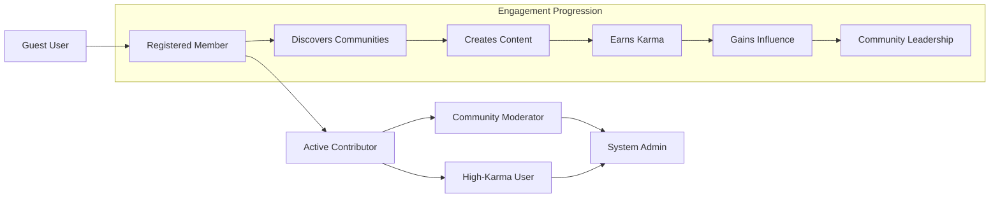

# User Scenarios for Reddit-like Community Platform

## Introduction

This document outlines the complete user journey scenarios for the Reddit-like community platform, mapping the user experience from initial registration through active community participation and reputation building. These scenarios provide the business context and user interaction patterns that backend developers need to understand the system's intended user experience and behavior flows.

### Business Context
The user scenarios define how users will interact with the platform across different stages of engagement, from initial discovery to becoming active community leaders. Understanding these workflows is essential for implementing intuitive user experiences and efficient backend processes.

## Registration Journey

### New User Registration Scenario

**WHEN** a guest user accesses the platform for the first time, **THE** system **SHALL** display a registration form with email, username, and password fields.

**Registration Flow:**

1. **Account Creation Process**
   - User enters email address
   - User selects unique username
   - User creates secure password
   - User agrees to terms of service
   - System validates all inputs
   - System sends email verification link

2. **Email Verification Process**
   **WHEN** the user clicks the verification link in their email, **THE** system **SHALL** mark the email as verified and activate the user account.

3. **Initial Setup**
   **AFTER** successful registration, **THE** system **SHALL**:
   - Create user profile with default settings
   - Initialize karma score at 0
   - Display welcome tutorial
   - Show community discovery recommendations

**User Experience Requirements:**
- Registration process completion within 2 minutes
- Email verification delivered within 30 seconds
- Username availability checked in real-time
- Password strength validation with immediate feedback

### User Login Scenario

**WHEN** a registered user attempts to log in, **THE** system **SHALL**:
- Validate credentials against stored records
- Generate JWT token for session management
- Load user preferences and subscriptions
- Display personalized feed based on subscriptions

**Login Flow Requirements:**
- Authentication response within 2 seconds
- Session persistence for 30 days with refresh tokens
- Secure token storage and validation
- Failed login attempt tracking and rate limiting

## Community Discovery

### Community Exploration Scenario

**WHEN** a new user completes registration, **THE** system **SHALL** present community discovery options:

1. **Popular Communities**
   - Display trending communities based on active users
   - Show recently created communities
   - Highlight communities matching user interests

2. **Search and Discovery**
   **WHEN** a user searches for communities, **THE** system **SHALL**:
   - Return communities matching search terms
   - Display community statistics (members, activity level)
   - Show community description and rules
   - Indicate subscription status

3. **Subscription Process**
   **WHEN** a user subscribes to a community, **THE** system **SHALL**:
   - Add community to user's subscription list
   - Include community posts in user's feed
   - Update community member count
   - Notify community moderators of new subscriber

### Community Creation Scenario

**WHILE** a member user has sufficient karma (minimum 100), **THE** system **SHALL** allow community creation.

**Community Creation Flow:**

1. **Initial Setup**
   - User provides community name and display name
   - User writes community description
   - User sets community type (public/private/restricted)
   - User establishes community rules

2. **Moderation Setup**
   - System assigns creator as primary moderator
   - Creator can invite additional moderators
   - System provides moderation tools and guidelines

3. **Community Launch**
   **AFTER** community creation, **THE** system **SHALL**:
   - Make community discoverable in search results
   - Enable post creation for subscribed users
   - Provide moderation dashboard to creator
   - Track community growth metrics

## Content Creation

### Post Creation Scenario

**WHEN** a subscribed member creates a text post in a community, **THE** system **SHALL**:

1. **Post Composition**
   - User enters post title (required, max 300 characters)
   - User writes post content (optional, max 40000 characters)
   - User selects post flair if available
   - User sets post visibility (public/hidden)

2. **Content Validation**
   - System validates title length and content
   - System checks for prohibited content
   - System verifies user has posting permissions in community

3. **Post Submission**
   **AFTER** successful validation, **THE** system **SHALL**:
   - Publish post to community feed
   - Make post visible to all community members
   - Start vote tracking with initial score of 1
   - Enable commenting functionality
   - Update user's post count

**Scenario: User Creates Link Post**

**WHEN** a user creates a link post, **THE** system **SHALL**:
- Validate URL format and accessibility
- Extract metadata (title, description, thumbnail)
- Display link preview in post
- Track click-through statistics

**Scenario: User Creates Image Post**

**WHEN** a user creates an image post, **THE** system **SHALL**:
- Validate image format and size (max 20MB)
- Generate thumbnail versions
- Apply content moderation checks
- Store images securely with CDN delivery

### Post Interaction Scenario

**WHEN** a user upvotes or downvotes a post, **THE** system **SHALL**:
- Record the vote in user's voting history
- Update post score in real-time
- Calculate new hotness ranking
- Adjust post author's karma accordingly
- Prevent duplicate voting from same user

**Voting Rules:**
- Users can change their vote within 24 hours
- Vote changes update karma calculations
- Self-voting is prohibited
- Vote manipulation detection triggers review

## Interaction Patterns

### Comment System Scenario

**WHEN** a user comments on a post, **THE** system **SHALL**:

1. **Comment Creation**
   - User writes comment text (max 10000 characters)
   - System validates comment content
   - System checks for rate limiting
   - Comment is added to post's comment thread

2. **Nested Replies**
   **WHEN** a user replies to a comment, **THE** system **SHALL**:
   - Create nested reply structure
   - Maintain threading depth (max 10 levels)
   - Notify parent comment author
   - Update comment count on post

3. **Comment Voting**
   **WHEN** users vote on comments, **THE** system **SHALL**:
   - Update comment score
   - Calculate comment author karma
   - Affect comment visibility in sorted views
   - Apply same voting rules as posts

### Subscription Management Scenario

**WHEN** a user manages their subscriptions, **THE** system **SHALL** provide:

1. **Subscription List**
   - Display all subscribed communities
   - Show new post counts for each community
   - Allow quick unsubscribe actions
   - Sort by activity level or alphabetically

2. **Feed Personalization**
   - Combine posts from all subscribed communities
   - Apply user's preferred sorting algorithm
   - Filter by content type if specified
   - Highlight new content since last visit

3. **Recommendation Engine**
   **WHERE** user engagement patterns exist, **THE** system **SHALL** recommend:
   - Communities similar to current subscriptions
   - Popular communities in user's interest areas
   - Trending communities with high growth

## Reputation Building

### Karma Accumulation Scenario

**THE** system **SHALL** track user karma based on:

**Post Karma:**
- +1 karma for each upvote received on posts
- -1 karma for each downvote received on posts
- Maximum +/- 100 karma per post
- Self-votes don't count toward karma

**Comment Karma:**
- +1 karma for each upvote received on comments
- -1 karma for each downvote received on comments
- Maximum +/- 10 karma per comment

**Karma Display Rules:**
- Total karma displayed on user profile
- Post karma and comment karma shown separately
- Karma breakdown by community available
- Karma history tracked over time

### User Progression Scenario

**WHILE** user karma increases, **THE** system **SHALL** unlock new capabilities:

**Karma Tier 1 (0-99):**
- Basic posting and commenting
- Limited community creation
- Standard voting rights

**Karma Tier 2 (100-999):**
- Community creation privileges
- Enhanced posting limits
- Early access to new features

**Karma Tier 3 (1000+):**
- Priority content visibility
- Advanced moderation tools access
- Beta feature testing eligibility

## Community Management

### Moderator Workflow Scenario

**WHEN** content is reported in a community, **THE** system **SHALL**:

1. **Report Collection**
   - Aggregate all reports for the content
   - Calculate report severity score
   - Flag for moderator review
   - Notify moderators of pending reviews

2. **Moderation Actions**
   **WHEN** a moderator reviews reported content, **THEY SHALL** be able to:
   - Approve content (dismiss reports)
   - Remove content with reason
   - Lock comments on contentious posts
   - Apply user bans temporarily or permanently

3. **Action Tracking**
   **AFTER** moderation action, **THE** system **SHALL**:
   - Log all moderation decisions
   - Notify content author of actions taken
   - Update moderator activity metrics
   - Escalate to admins if needed

### Admin Oversight Scenario

**WHEN** system-wide issues occur, **THE** admin **SHALL** have capabilities to:

- Review all moderator actions
- Override community-level decisions
- Manage user accounts globally
- Configure system-wide settings
- Monitor platform health metrics
- Handle escalated content disputes

## Milestone Tracking

### User Growth Milestones

**THE** system **SHALL** track and recognize user achievements:

**Early Milestones:**
- First post created
- First comment written
- First community joined
- First upvote received

**Intermediate Milestones:**
- 100 karma points
- 10 posts created
- 50 comments written
- 5 communities created

**Advanced Milestones:**
- 1000 karma points
- Top contributor in community
- Successful content moderation
- Long-term active participation

### Community Growth Milestones

**THE** system **SHALL** track community growth metrics:

- 100 subscribers
- 500 subscribers
- 1000 subscribers
- 5000 subscribers
- 10000+ subscribers

**AT EACH** milestone, **THE** system **SHALL**:
- Notify community moderators
- Update community visibility in discovery
- Provide growth analytics to moderators
- Offer advanced moderation tools

## User Journey Integration

### Complete User Lifecycle

The user journey follows this progression:

### Key Interaction Patterns

**Daily Active User Scenario:**

**WHEN** a daily active user logs in, **THE** system **SHALL**:
- Display personalized feed with new content
- Show notification count for replies and mentions
- Highlight trending posts in subscribed communities
- Suggest new communities based on interests
- Display karma changes since last visit

**Power User Scenario:**

**WHEN** a power user engages with the platform, **THE** system **SHALL**:
- Provide advanced content creation tools
- Offer bulk moderation capabilities
- Display detailed analytics on content performance
- Enable cross-community content management
- Support multiple community moderation

## Success Metrics

### User Engagement Indicators

**THE** system **SHALL** track these key metrics for user scenarios:

**Registration Success:**
- Registration completion rate
- Email verification rate
- First action completion time
- Initial subscription rate

**Content Engagement:**
- Posts per active user
- Comments per post
- Vote participation rate
- Content creation frequency

**Community Health:**
- New community creation rate
- Community subscription growth
- Moderator activity levels
- Content quality metrics

### Platform Growth Indicators

**THE** system **SHALL** monitor platform-wide success metrics:

- Monthly active users (MAU)
- Daily active users (DAU)
- User retention rates
- Content creation velocity
- Community diversity index
- User satisfaction scores

## Error Scenarios and Handling

### Registration Errors

**IF** registration validation fails, **THEN THE** system **SHALL**:
- Display specific error messages for each validation failure
- Preserve entered form data (except passwords)
- Highlight problematic fields
- Provide clear instructions for correction

**WHEN** email verification fails, **THE** system **SHALL**:
- Allow users to request new verification emails
- Implement rate limiting to prevent abuse
- Provide alternative verification methods if available
- Log verification failures for monitoring

### Content Creation Errors

**IF** post creation fails due to validation errors, **THEN THE** system **SHALL**:
- Preserve user's draft content
- Display specific validation error messages
- Provide guidance on content requirements
- Allow users to save drafts for later completion

**WHEN** content submission encounters network issues, **THE** system **SHALL**:
- Automatically retry submission
- Save content locally for offline submission
- Notify users of submission status
- Provide recovery options for failed submissions

### Authentication Errors

**IF** login attempts fail, **THEN THE** system **SHALL**:
- Implement progressive security measures
- Provide password recovery options
- Display generic error messages (prevent username enumeration)
- Log failed attempts for security monitoring

**WHEN** session expiration occurs, **THE** system **SHALL**:
- Redirect users to login page
- Preserve current page state for return
- Provide clear session timeout messages
- Allow automatic re-authentication where appropriate

## Integration Points

### Authentication Integration

**THE** user scenarios **SHALL** integrate with authentication system to:
- Validate user permissions for all actions
- Maintain secure session management
- Support role-based access control
- Provide seamless login/logout experiences

### Content System Integration

**THE** user scenarios **SHALL** work with content management to:
- Ensure proper content creation workflows
- Maintain content ownership and permissions
- Support all content types (text, link, image)
- Handle content moderation appropriately

### Community System Integration

**THE** user scenarios **SHALL** integrate with community features to:
- Support community discovery and subscription
- Enforce community-specific rules and permissions
- Provide community growth tracking
- Enable cross-community interactions

## Performance Requirements

### Response Time Expectations

**WHEN** users perform common actions, **THE** system **SHALL** respond within:
- Registration: < 5 seconds
- Login: < 2 seconds
- Post creation: < 3 seconds
- Comment submission: < 1 second
- Voting: < 500 milliseconds
- Feed loading: < 2 seconds
- Community discovery: < 3 seconds

### Scalability Requirements

**THE** system **SHALL** support user scenarios at scale:
- 10,000 concurrent users during peak periods
- 1,000 new registrations per hour
- 5,000 posts created per hour
- 10,000 comments submitted per hour
- 50,000 votes processed per hour

### Availability Standards

**THE** system **SHALL** maintain availability for user scenarios:
- 99.9% uptime for authentication services
- 99.8% uptime for content creation features
- 99.5% uptime for community management
- Graceful degradation during maintenance

## Business Rules Implementation

### Content Creation Rules

**WHILE** users create content, **THE** system **SHALL** enforce:
- Minimum and maximum character limits
- Content format validation
- Community-specific posting rules
- Rate limiting to prevent spam
- Content quality thresholds

### User Behavior Rules

**WHEN** users interact with the platform, **THE** system **SHALL** apply:
- Karma-based privilege tiers
- Voting and engagement limits
- Content creation frequency caps
- Community-specific behavior guidelines
- Platform-wide content policies

### Moderation Rules

**WHERE** moderation actions are required, **THE** system **SHALL** implement:
- Automated content filtering
- User reporting workflows
- Moderator escalation procedures
- Content removal protocols
- User ban and suspension processes

These user scenarios provide the complete business context for how users will interact with the Reddit-like community platform, from initial discovery through active community participation and leadership roles. Each scenario defines specific user behaviors and system responses that backend developers can implement to create an engaging community experience.

> *Developer Note: This document defines **business requirements only**. All technical implementations (architecture, APIs, database design, etc.) are at the discretion of the development team.*