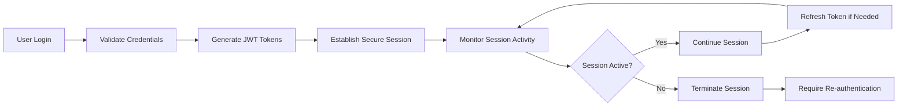
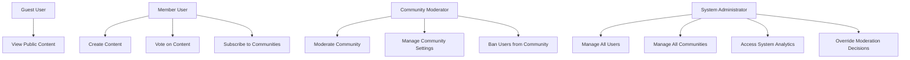

# Security and Compliance Requirements Document

## 1. Introduction and System Overview

This document defines the comprehensive security and compliance requirements for the Reddit-like community platform. The platform handles sensitive user data including personal information, authentication credentials, user-generated content, and community interactions, requiring robust security measures and compliance with global privacy regulations.

### 1.1 Purpose and Scope
The security framework ensures protection of user data, platform integrity, and regulatory compliance while maintaining system performance and user experience. This covers all aspects from user authentication to data protection and incident response.

### 1.2 Business Context
Security is fundamental to user trust and platform viability. The system must protect against data breaches, unauthorized access, content manipulation, and ensure compliance with international data protection regulations.

## 2. Authentication Security Requirements

### 2.1 Password Security Implementation

**WHEN users register with a password, THE system SHALL enforce password requirements:**
- Minimum 12 characters length
- At least one uppercase letter
- At least one lowercase letter  
- At least one number
- At least one special character
- Cannot contain username or common passwords
- Must be different from previous 5 passwords

**WHEN users attempt to log in, THE system SHALL implement security measures:**
- Rate limiting of 5 failed attempts within 15 minutes
- Account lockout for 30 minutes after 5 failed attempts
- Secure password storage using bcrypt with 12 salt rounds
- Never store passwords in plain text
- Monitor for credential stuffing attacks

### 2.2 JWT Token Specifications

**WHEN users authenticate successfully, THE system SHALL issue JWT tokens with:**
- Access token expiration: 15 minutes
- Refresh token expiration: 7 days
- Secure token storage in httpOnly cookies
- Token validation on every authenticated request
- Automatic token refresh mechanism

**JWT Token Payload Structure:**
```json
{
  "userId": "unique-user-identifier",
  "username": "user-display-name",
  "email": "user-email-address",
  "roles": ["member", "moderator", "admin"],
  "permissions": ["post:create", "comment:create", "vote:cast"],
  "communities": ["community-id-1", "community-id-2"],
  "iat": "issued-at-timestamp",
  "exp": "expiration-timestamp",
  "iss": "platform-issuer"
}
```

### 2.3 Session Management Workflow



**WHILE user sessions are active, THE system SHALL:**
- Monitor session activity for timeout enforcement
- Track login locations and devices for security
- Provide session termination capabilities
- Implement secure logout procedures
- Maintain session audit trails

### 2.4 Multi-Factor Authentication

**WHERE users enable MFA, THE system SHALL require:**
- Secondary verification through authenticator apps
- Backup codes for recovery scenarios
- Device recognition to reduce MFA prompts
- Emergency access procedures
- MFA status tracking and reporting

**WHEN users log in from unrecognized devices, THE system SHALL:**
- Require additional verification
- Send security notifications to registered email
- Allow temporary trust for trusted devices
- Log all MFA-related activities

## 3. Data Protection Requirements

### 3.1 Data Encryption Standards

**WHERE sensitive data is stored, THE system SHALL implement:**
- AES-256 encryption for data at rest
- TLS 1.3 for data in transit
- Key management with regular rotation
- Encryption of database backups
- Secure key storage separate from data

**WHEN transmitting user data, THE system SHALL:**
- Use HTTPS for all communications
- Implement HSTS headers
- Validate SSL certificates
- Encrypt API communications
- Protect against man-in-the-middle attacks

### 3.2 Secure Data Storage

**THE system SHALL implement secure storage practices:**
- Database encryption for sensitive fields
- Secure file storage for uploaded content
- Regular security patching of storage systems
- Access logging for all data operations
- Data integrity verification

### 3.3 File Upload Security

**WHEN users upload files, THE system SHALL:**
- Validate file types against approved list
- Scan for malware using multiple engines
- Restrict file size to 10MB maximum
- Generate secure file names
- Store files with proper access controls
- Implement content scanning for inappropriate content

## 4. Access Control Requirements

### 4.1 Role-Based Access Control Matrix



### 4.2 Permission Inheritance Rules

**WHEN checking user permissions, THE system SHALL:**
- Evaluate role hierarchy for permission inheritance
- Check community-specific permissions
- Validate action against user's current role
- Log all permission checks for audit
- Deny access with appropriate error messages

**THE permission validation workflow SHALL:**
1. Verify user authentication status
2. Check global role permissions
3. Validate community-specific permissions
4. Apply permission inheritance rules
5. Grant or deny access with logging

### 4.3 User Behavior Monitoring

**WHILE users interact with the platform, THE system SHALL monitor:**
- Unusual posting patterns
- Suspicious voting behavior
- Multiple account creation attempts
- Rapid-fire content submission
- Geographic login anomalies
- Unauthorized access attempts

## 5. Privacy Compliance Requirements

### 5.1 GDPR Compliance Implementation

**THE system SHALL provide GDPR-compliant data processing:**
- Right to access personal data
- Right to rectification of inaccurate data
- Right to erasure ("right to be forgotten")
- Right to restrict processing
- Right to data portability
- Right to object to processing

**WHEN processing personal data, THE system SHALL:**
- Obtain explicit user consent
- Maintain records of processing activities
- Conduct Data Protection Impact Assessments
- Appoint Data Protection Officer where required
- Implement privacy by design and default

### 5.2 CCPA Compliance Requirements

**FOR California residents, THE system SHALL provide:**
- Right to know what personal information is collected
- Right to delete personal information
- Right to opt-out of sale of personal information
- Right to non-discrimination for exercising rights
- Verified request procedures for data access

### 5.3 International Data Transfer Compliance

**WHERE data crosses international borders, THE system SHALL:**
- Implement Standard Contractual Clauses
- Ensure adequate level of data protection
- Provide transparency about data transfers
- Maintain transfer impact assessments
- Comply with local data protection laws

## 6. Security Incident Response

### 6.1 Breach Detection and Response

**WHEN potential security incidents are detected, THE system SHALL:**
- Immediately alert security team
- Begin incident containment procedures
- Preserve evidence for investigation
- Assess scope and impact of breach
- Execute incident response plan

**THE breach response workflow SHALL include:**
1. **Containment**: Isolate affected systems
2. **Eradication**: Remove threat actors
3. **Recovery**: Restore normal operations
4. **Post-Incident Analysis**: Learn and improve

### 6.2 User Notification Procedures

**WHERE user data is compromised, THE system SHALL:**
- Notify affected users within 72 hours
- Provide clear information about the breach
- Recommend protective actions for users
- Cooperate with regulatory authorities
- Maintain communication throughout resolution

### 6.3 Incident Documentation

**THE system SHALL maintain comprehensive incident records:**
- Incident discovery timeline
- Containment actions taken
- Impact assessment results
- Notification procedures followed
- Lessons learned and improvements

## 7. Data Retention Policies

### 7.1 User Data Retention

**THE system SHALL implement data retention rules:**
- User account data: Retained while account active
- Deleted accounts: Data purged after 30 days
- Inactive accounts: Data archived after 2 years
- Anonymized analytics: Retained for 2 years
- Security logs: Retained for 1 year

### 7.2 Content Retention

**USER-GENERATED content retention SHALL follow:**
- Posts and comments: Retained until deletion
- Removed content: Retained for 90 days for appeals
- User messages: Retained for message history
- Uploaded files: Retained with user account

### 7.3 System Log Retention

**THE system SHALL retain logs for monitoring and compliance:**
- Security logs: 1 year retention
- Access logs: 6 months retention
- Performance logs: 30 days retention
- Audit trails: 7 years for compliance

## 8. Compliance Monitoring and Reporting

### 8.1 Regular Security Audits

**THE system SHALL undergo security assessments:**
- Quarterly vulnerability assessments
- Annual penetration testing
- Continuous security monitoring
- Regular compliance audits
- Third-party security reviews

### 8.2 Compliance Reporting

**THE system SHALL generate compliance reports:**
- Monthly security incident reports
- Quarterly compliance status reports
- Annual data protection impact assessments
- Regulatory compliance documentation
- Audit trail reports for authorities

### 8.3 Security Metrics Tracking

**THE system SHALL monitor key security indicators:**
- Authentication success/failure rates
- Security incident frequency and severity
- Time to detect and respond to incidents
- Compliance with data protection requirements
- User data access patterns

## 9. Security Testing Requirements

### 9.1 Penetration Testing

**THE system SHALL undergo regular penetration testing:**
- External network penetration testing
- Web application security testing
- API security assessment
- Social engineering testing
- Physical security assessment

### 9.2 Vulnerability Management

**THE system SHALL implement vulnerability management:**
- Regular vulnerability scanning
- Patch management procedures
- Security update deployment
- Vulnerability remediation tracking
- Zero-day vulnerability response

### 9.3 Security Training

**THE development team SHALL receive security training:**
- Secure coding practices
- Data protection principles
- Incident response procedures
- Regulatory compliance requirements
- Emerging threat awareness

## 10. Third-Party Security Requirements

### 10.1 Vendor Security Assessment

**WHEN selecting third-party services, THE system SHALL:**
- Conduct security assessments of vendors
- Verify compliance with security standards
- Review vendor security certifications
- Assess data protection capabilities
- Establish security requirements in contracts

### 10.2 API Security Standards

**WHEN integrating with external APIs, THE system SHALL:**
- Implement secure API authentication
- Validate all API responses
- Implement rate limiting and throttling
- Monitor for API security issues
- Maintain API security documentation

### 10.3 External Service Security

**FOR all external service integrations, THE system SHALL:**
- Use secure communication protocols
- Implement proper error handling
- Monitor service availability
- Have fallback mechanisms
- Maintain service level agreements

## 11. Backup and Disaster Recovery

### 11.1 Data Backup Procedures

**THE system SHALL implement comprehensive backup strategies:**
- Daily full backups of critical data
- Hourly incremental backups
- Geographic distribution of backups
- Regular backup testing and validation
- Secure backup storage with encryption

### 11.2 Recovery Objectives

**THE system SHALL meet recovery targets:**
- Recovery Time Objective (RTO): 4 hours
- Recovery Point Objective (RPO): 1 hour
- Maximum tolerable downtime: 8 hours
- Data loss tolerance: 1 hour

### 11.3 Disaster Recovery Testing

**THE system SHALL undergo regular disaster recovery testing:**
- Quarterly recovery procedure testing
- Annual full disaster recovery drills
- Backup restoration validation
- Communication plan testing
- Third-party service recovery testing

## 12. Security Standards Compliance

### 12.1 OWASP Top 10 Compliance

**THE system SHALL protect against OWASP Top 10 vulnerabilities:**
- Injection attacks prevention
- Broken authentication protection
- Sensitive data exposure prevention
- XML external entities (XXE) protection
- Broken access control prevention
- Security misconfiguration protection
- Cross-site scripting (XSS) prevention
- Insecure deserialization protection
- Using components with known vulnerabilities prevention
- Insufficient logging and monitoring protection

### 12.2 Secure Development Lifecycle

**THE development process SHALL include security practices:**
- Threat modeling during design phase
- Security requirements definition
- Secure coding standards
- Security testing throughout development
- Security review before deployment

### 12.3 Security Certification

**WHERE applicable, THE system SHALL pursue security certifications:**
- SOC 2 Type II compliance
- ISO 27001 certification
- GDPR compliance certification
- Industry-specific security standards

## 13. User Security Features

### 13.1 Account Security Settings

**THE system SHALL provide user security controls:**
- Password strength indicators
- Session management dashboard
- Login activity monitoring
- Device authorization management
- Security notification preferences

### 13.2 Privacy Controls

**THE system SHALL provide user privacy settings:**
- Data sharing preferences
- Profile visibility controls
- Activity tracking options
- Communication preferences
- Data export capabilities

### 13.3 Security Education

**THE system SHALL provide user security guidance:**
- Password best practices
- Account security tips
- Privacy setting recommendations
- Security feature explanations
- Incident reporting procedures

## 14. Monitoring and Alerting

### 14.1 Security Monitoring

**THE system SHALL implement continuous security monitoring:**
- Real-time security event monitoring
- Anomaly detection for suspicious activities
- Performance monitoring for security impacts
- User behavior analytics for threat detection
- System health monitoring

### 14.2 Alerting Procedures

**WHEN security events occur, THE system SHALL alert:**
- Immediate alerts for critical security incidents
- Daily security status reports
- Weekly security summary reports
- Monthly compliance status reports
- Quarterly security review meetings

### 14.3 Incident Response Automation

**THE system SHALL implement automated response capabilities:**
- Automated threat containment
- Suspicious activity blocking
- Temporary access restrictions
- Security incident documentation
- Response procedure automation

## 15. Success Metrics and KPIs

### 15.1 Security Performance Indicators

**THE system SHALL track security performance metrics:**
- Mean time to detect security incidents
- Mean time to respond to security incidents
- Number of security incidents per month
- Percentage of patched vulnerabilities
- Security training completion rates

### 15.2 Compliance Metrics

**THE system SHALL monitor compliance performance:**
- Data protection request response times
- Privacy policy compliance rates
- Regulatory requirement implementation status
- Audit finding resolution rates
- User complaint resolution times

### 15.3 User Security Metrics

**THE system SHALL track user security engagement:**
- Multi-factor authentication adoption rates
- Security feature usage statistics
- Security incident reporting frequency
- User security education completion
- Privacy setting configuration rates

This comprehensive security and compliance requirements document provides the complete framework for implementing a secure, compliant community platform that protects user data while maintaining platform functionality and user experience.

> *Developer Note: This document defines **business requirements only**. All technical implementations (architecture, APIs, database design, etc.) are at the discretion of the development team.*