# System Workflow Documentation

## 1. System Overview and Architecture

### Platform Core Workflow
THE RedditClone platform SHALL manage user-generated content through a structured workflow system that enables community-driven interactions, content ranking, and reputation building.

### System Architecture Flow
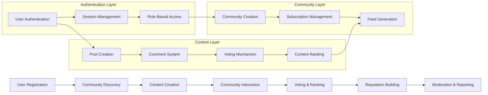

## 2. User Registration and Authentication Flow

### Registration Process
WHEN a guest user initiates registration, THE system SHALL collect email address, username, and password.

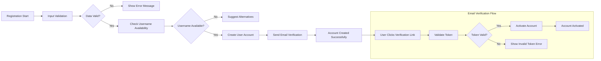

### Authentication Workflow
WHEN a user attempts to log in, THE system SHALL verify credentials and establish secure session.

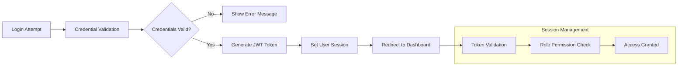

## 3. Community Creation and Management Workflow

### Community Creation Process
WHEN a member user creates a community, THE system SHALL validate community name and establish moderation structure.

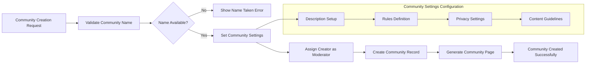

### Community Subscription Workflow
WHEN a user subscribes to a community, THE system SHALL update user feed preferences and community member count.

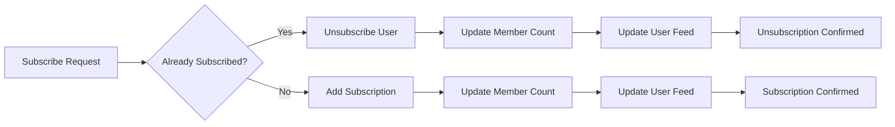

## 4. Content Creation and Submission Process

### Post Creation Workflow
WHEN a member creates a post in a community, THE system SHALL validate content and distribute to subscribers.

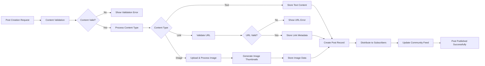

### Content Validation Rules
THE system SHALL enforce content validation rules including character limits, URL validation, and image format restrictions.

## 5. Voting and Interaction System Workflow

### Voting Mechanism
WHEN a user votes on content, THE system SHALL update vote counts and recalculate content ranking.

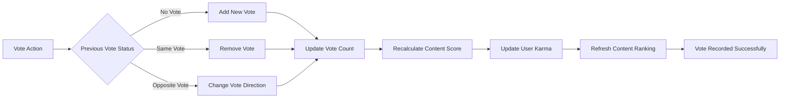

### Karma Calculation Process
THE system SHALL calculate user karma based on post and comment voting patterns with weighted scoring.

## 6. Comment System and Thread Management

### Comment Creation Workflow
WHEN a user comments on a post or reply, THE system SHALL manage threaded conversations with proper nesting.

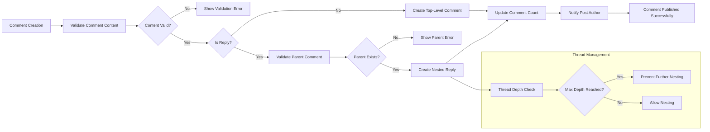

### Comment Voting and Ranking
THE system SHALL apply voting mechanisms to comments and calculate comment karma separately from post karma.

## 7. Karma Calculation and Reputation System

### Karma Update Process
WHEN content receives votes, THE system SHALL update user karma scores with appropriate weighting.

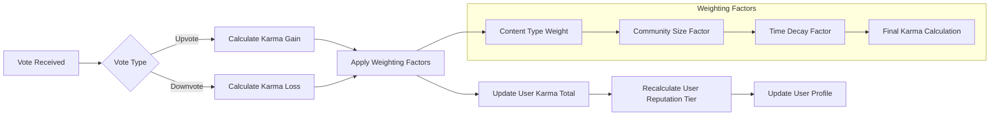

### Reputation Tier System
THE system SHALL assign users to reputation tiers based on accumulated karma with different privilege levels.

## 8. Content Ranking and Sorting Algorithms

### Hot Ranking Algorithm
THE system SHALL calculate "hot" ranking using time decay and engagement metrics for real-time content relevance.

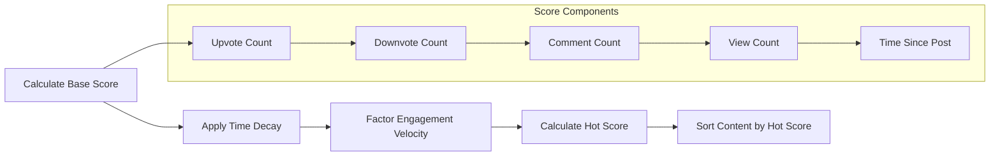

### Multiple Sorting Options
THE system SHALL provide multiple content sorting methods including new, top, controversial, and rising algorithms.

## 9. Subscription and Feed Management

### Personalized Feed Generation
WHEN a user accesses their home feed, THE system SHALL generate personalized content based on subscriptions and engagement history.

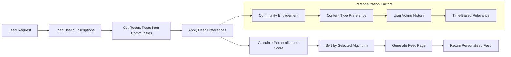

### Feed Update Mechanism
THE system SHALL continuously update user feeds as new content is published in subscribed communities.

## 10. Reporting and Moderation Workflow

### Content Reporting Process
WHEN a user reports inappropriate content, THE system SHALL route the report to appropriate moderators.

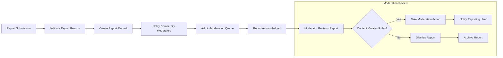

### Moderation Action Workflow
WHEN moderators take action on reported content, THE system SHALL enforce moderation decisions and notify affected users.

## 11. Data Lifecycle Management

### Content Archiving Process
THE system SHALL manage content lifecycle including archiving old content and maintaining data integrity.

### User Activity Tracking
THE system SHALL track user activity patterns for personalization and system optimization.

## 12. System Event Processing

### Real-time Update System
THE system SHALL process real-time events including votes, comments, and new posts for immediate user experience.

### Batch Processing Workflows
THE system SHALL execute batch processes for karma recalculations, ranking updates, and system maintenance.

### Error Handling and Recovery
THE system SHALL implement comprehensive error handling for all workflow processes with appropriate user feedback.

## Workflow Performance Requirements

### Response Time Expectations
WHEN users perform actions, THE system SHALL respond within specific time thresholds:
- Content voting: < 500ms
- Comment submission: < 1 second
- Post creation: < 2 seconds
- Feed generation: < 3 seconds
- User registration: < 5 seconds

### System Availability
THE system SHALL maintain 99.9% availability for all core workflow processes.

### Concurrent User Support
THE system SHALL support 10,000 concurrent users during peak usage periods.

## Business Process Specifications

### User Journey Integration
All system workflows SHALL integrate seamlessly to provide cohesive user experiences from registration to active community participation.

### Data Consistency Requirements
THE system SHALL maintain data consistency across all workflow processes with proper transaction management.

### Audit Trail Maintenance
THE system SHALL maintain comprehensive audit trails for all user actions and system events for moderation and analytics purposes.

This document defines the complete system workflow architecture for the RedditClone platform, ensuring all business processes are clearly defined for backend development implementation.