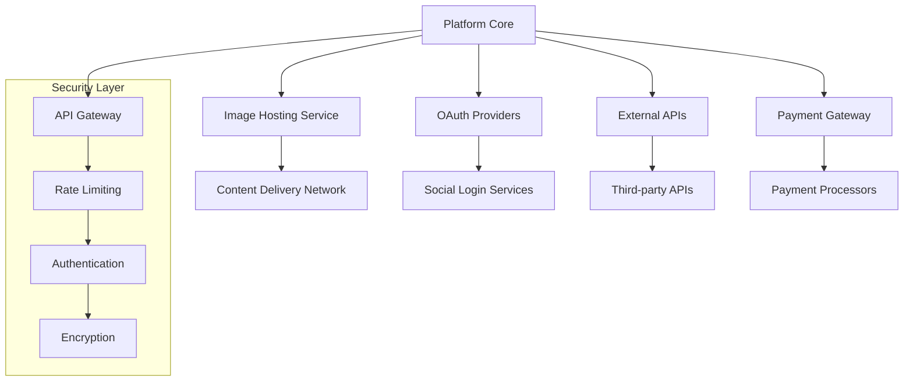
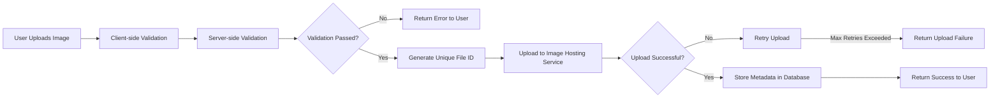
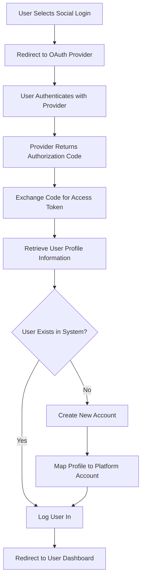

# External Integrations Requirements

## 1. Introduction and Overview

This document specifies the comprehensive requirements for external service integrations and API connectivity for the Reddit-like community platform. The platform requires robust integration with third-party services to deliver core functionality while maintaining security, performance, and reliability standards.

### 1.1 Purpose and Scope

WHEN implementing external integrations, THE system SHALL provide seamless connectivity with third-party services while maintaining platform stability and user experience.

THE external integrations SHALL enable:
- Secure image hosting and delivery for user-uploaded content
- Alternative authentication methods through social login providers
- Enhanced functionality through external API services
- Future monetization capabilities through payment processing
- Compliance with data protection regulations

### 1.2 Integration Architecture

## 2. Image Hosting Integration Requirements

### 2.1 Image Processing and Storage

WHEN a user uploads an image file, THE system SHALL validate the file format, size, and content before transmission to external hosting services.

WHILE processing image uploads, THE system SHALL:
- Validate file type against allowed formats (JPEG, PNG, GIF, WebP)
- Enforce maximum file size of 10MB per image
- Scan for malware and prohibited content
- Generate multiple optimized versions (thumbnail, medium, large)
- Apply compression without visible quality degradation

WHERE image validation fails, THE system SHALL provide specific error messages to users with resolution guidance.

### 2.2 Image Hosting Service Selection

THE system SHALL integrate with a reliable third-party image hosting service that provides:
- Global content delivery network (CDN) coverage
- Automatic image optimization and format conversion
- Secure storage with data redundancy
- Scalable bandwidth and storage capacity
- Comprehensive API for programmatic access

WHEN selecting image hosting providers, THE system SHALL prioritize services with:
- 99.9% or higher service level agreement (SLA)
- Data centers in multiple geographic regions
- Robust security certifications (SOC 2, ISO 27001)
- Transparent pricing with predictable costs
- Responsive technical support

### 2.3 Upload Workflow Requirements

WHEN uploading images to external services, THE system SHALL:
- Implement secure file transfer using HTTPS
- Generate unique file identifiers to prevent conflicts
- Maintain upload progress indicators for users
- Implement retry logic for failed uploads (maximum 3 attempts)
- Provide fallback to local storage if external service is unavailable

### 2.4 Image Delivery and Performance

WHEN serving images to users, THE system SHALL:
- Utilize CDN for global content delivery
- Implement responsive image delivery based on device capabilities
- Apply proper caching headers for optimal performance
- Support lazy loading to improve page load times
- Maintain image delivery latency under 2 seconds globally

WHERE image delivery fails, THE system SHALL display appropriate placeholder content with retry mechanisms.

### 2.5 Security and Compliance

WHEN storing user-uploaded images, THE system SHALL:
- Implement access controls to prevent unauthorized access
- Encrypt images at rest using industry-standard encryption
- Comply with data protection regulations (GDPR, CCPA)
- Implement content moderation to prevent prohibited content
- Maintain audit trails for image access and modifications

## 3. External Authentication Requirements

### 3.1 OAuth Provider Integration

WHEN implementing social login functionality, THE system SHALL support integration with major OAuth providers including Google, Facebook, Twitter, and GitHub.

THE OAuth integration SHALL:
- Follow OAuth 2.0 security best practices
- Request minimal user information necessary for platform functionality
- Implement proper token management and refresh mechanisms
- Handle provider-specific authentication flows
- Provide fallback to traditional email/password authentication

### 3.2 Social Login Workflow

WHEN users authenticate through social providers, THE system SHALL:
- Validate OAuth tokens and verify provider signatures
- Map provider user profiles to platform user accounts
- Handle account linking for existing users
- Implement proper session management for social logins
- Provide clear consent language for data sharing

### 3.3 Account Linking and Management

WHILE users have multiple authentication methods, THE system SHALL:
- Allow linking of multiple authentication providers to single account
- Provide clear management interface for connected accounts
- Implement secure unlinking procedures
- Maintain authentication method preferences
- Handle authentication provider outages gracefully

WHERE authentication providers become unavailable, THE system SHALL:
- Provide clear error messages to users
- Offer alternative authentication methods
- Maintain platform functionality for already-authenticated users
- Implement retry mechanisms with exponential backoff

### 3.4 Security Requirements

WHEN using external authentication providers, THE system SHALL:
- Implement CSRF protection for all authentication flows
- Validate state parameters to prevent request forgery
- Use secure redirect URIs with proper validation
- Implement rate limiting for authentication attempts
- Monitor for suspicious authentication patterns

## 4. API Service Integration Requirements

### 4.1 External API Integration

THE system SHALL integrate with external APIs for enhanced functionality including content moderation assistance, analytics, and third-party services.

WHEN integrating with external APIs, THE system SHALL:
- Implement proper API authentication and authorization
- Handle API rate limiting and quota management
- Implement request queuing for high-volume operations
- Process API responses asynchronously to avoid blocking user interactions
- Cache API responses appropriately based on data volatility

### 4.2 API Communication Standards

WHEN communicating with external APIs, THE system SHALL:
- Use secure HTTPS connections with proper certificate validation
- Implement request timeout handling (default 30 seconds)
- Use exponential backoff retry logic for failed requests
- Implement circuit breaker patterns to prevent cascading failures
- Log all API interactions for monitoring and debugging

WHERE external APIs return errors, THE system SHALL:
- Provide appropriate error handling and user feedback
- Continue operation with degraded functionality when possible
- Implement fallback mechanisms for critical API dependencies
- Alert system administrators of persistent API issues

### 4.3 Content Moderation API Integration

WHEN processing user-generated content, THE system SHALL integrate with content moderation APIs to:
- Automatically detect and flag inappropriate content
- Provide confidence scores for moderation decisions
- Reduce manual moderation workload
- Maintain consistent content policy enforcement

THE content moderation integration SHALL:
- Process text content for prohibited language and topics
- Analyze images for inappropriate visual content
- Provide real-time moderation for immediate content screening
- Offer batch processing for historical content review
- Maintain audit trails of automated moderation actions

### 4.4 Analytics and Monitoring Integration

THE system SHALL integrate with analytics services to:
- Track user engagement and platform usage patterns
- Monitor system performance and reliability metrics
- Generate business intelligence reports
- Provide data for product development decisions

WHEN using analytics services, THE system SHALL:
- Anonymize user data before transmission
- Comply with data protection regulations
- Implement data retention policies aligned with privacy requirements
- Provide users with opt-out mechanisms for data collection

## 5. Payment System Integration Requirements

### 5.1 Payment Gateway Integration

WHEN implementing payment functionality, THE system SHALL integrate with reputable payment gateways that support multiple payment methods including credit cards, digital wallets, and bank transfers.

THE payment integration SHALL:
- Comply with PCI DSS security standards
- Support multiple currencies and international payments
- Handle recurring payments for subscription services
- Provide secure payment tokenization
- Offer fraud detection and prevention capabilities

### 5.2 Subscription Management

WHEN users subscribe to premium features, THE system SHALL:
- Create subscription records in the payment gateway
- Handle recurring billing according to subscription terms
- Manage subscription upgrades, downgrades, and cancellations
- Provide prorated billing for subscription changes
- Send payment receipts and subscription confirmations

WHERE payment processing fails, THE system SHALL:
- Notify users of payment issues promptly
- Provide grace periods for payment resolution
- Suspend premium features after grace period expiration
- Offer multiple payment retry options
- Maintain subscription status during payment disputes

### 5.3 Refund and Dispute Handling

WHEN processing refunds, THE system SHALL:
- Integrate with payment gateway refund APIs
- Maintain proper audit trails for financial transactions
- Provide clear refund policies to users
- Handle chargebacks and payment disputes
- Coordinate with payment processors for dispute resolution

THE refund system SHALL:
- Support partial and full refunds as appropriate
- Process refunds within 5 business days
- Provide refund confirmation to users
- Update account status accordingly after refunds
- Maintain financial records for accounting purposes

### 5.4 Security and Compliance

WHEN handling payment information, THE system SHALL:
- Never store sensitive payment data on platform servers
- Use payment tokenization for recurring billing
- Implement strong access controls for payment operations
- Maintain PCI DSS compliance throughout payment processes
- Conduct regular security assessments of payment integrations

## 6. Integration Security Requirements

### 6.1 API Security Standards

WHEN integrating with external services, THE system SHALL implement comprehensive security measures including:
- Secure storage of API keys and credentials using secret management
- Implementation of API rate limiting to prevent abuse
- Regular rotation of authentication tokens and API keys
- Validation of all incoming data from external services
- Monitoring for suspicious API activity patterns

THE system SHALL never:
- Store API secrets in source code or configuration files
- Transmit sensitive data without encryption
- Use deprecated or insecure authentication methods
- Expose internal API endpoints to external networks

### 6.2 Data Protection and Privacy

WHEN sharing user data with external services, THE system SHALL:
- Minimize data exposure to only necessary information
- Implement data anonymization where possible
- Obtain user consent for data sharing when required
- Ensure external service providers comply with data protection regulations
- Provide data processing agreements with all integrated services

WHERE user data is transferred internationally, THE system SHALL:
- Implement appropriate safeguards for cross-border data transfer
- Use Standard Contractual Clauses where required
- Ensure adequate data protection levels in destination countries
- Provide transparency about international data transfers

### 6.3 Security Monitoring and Incident Response

THE system SHALL implement comprehensive monitoring for integration security including:
- Real-time alerting for suspicious integration activities
- Logging of all external service interactions
- Monitoring for unauthorized access attempts
- Regular security assessments of integrated services
- Incident response procedures for security breaches

WHEN security incidents occur in integrated services, THE system SHALL:
- Immediately investigate potential impact on user data
- Notify affected users according to regulatory requirements
- Implement temporary workarounds or disable affected integrations
- Conduct post-incident analysis and implement preventive measures
- Coordinate with service providers for incident resolution

## 7. Error Handling and Fallback Mechanisms

### 7.1 Service Outage Handling

WHEN external services become unavailable, THE system SHALL implement graceful degradation strategies to maintain core platform functionality.

THE system SHALL provide fallback mechanisms for:
- Image hosting failures (temporary local storage)
- Authentication provider outages (fallback to email/password)
- API service unavailability (cached data or disabled features)
- Payment gateway downtime (delayed payment processing)

WHERE fallback mechanisms are implemented, THE system SHALL:
- Provide clear status indicators to users
- Maintain data consistency when services resume
- Implement automatic retry mechanisms for failed operations
- Queue operations for processing when services recover
- Log all service outage events for analysis

### 7.2 Error Recovery Requirements

WHEN external service errors occur, THE system SHALL:
- Implement retry logic with exponential backoff
- Provide clear, user-friendly error messages
- Maintain operation logs for debugging purposes
- Offer alternative workflows when possible
- Escalate persistent issues to system administrators

THE error recovery system SHALL handle:
- Network timeouts and connection failures
- API rate limiting and quota exceeded errors
- Authentication and authorization failures
- Data validation and processing errors
- Service maintenance and downtime periods

### 7.3 Monitoring and Alerting

THE system SHALL implement comprehensive monitoring for all external integrations including:
- Service health checks and availability monitoring
- Performance metrics for API response times
- Error rate tracking and anomaly detection
- Usage patterns and capacity planning
- Security event monitoring and alerting

WHEN integration issues are detected, THE system SHALL:
- Trigger immediate alerts to system administrators
- Provide detailed diagnostic information
- Suggest potential remediation steps
- Escalate critical issues according to severity
- Maintain incident response documentation

## 8. Performance and Scalability Requirements

### 8.1 Integration Performance Standards

WHEN using external services, THE system SHALL maintain performance standards:
- Image upload processing: < 5 seconds
- Social authentication: < 3 seconds
- API response processing: < 2 seconds
- Payment transaction processing: < 10 seconds
- External service health checks: < 1 second

THE system SHALL implement performance optimizations including:
- Connection pooling for external service connections
- Request batching for high-volume operations
- Asynchronous processing for non-critical operations
- Intelligent caching to reduce external API calls
- Load balancing across multiple service instances

### 8.2 Scalability Requirements

THE external integrations SHALL scale to support:
- 10,000 concurrent users during normal operation
- 50,000 concurrent users during peak traffic events
- 1,000+ image uploads per hour
- 5,000+ authentication requests per hour
- 10,000+ API calls per minute

WHEN scaling external integrations, THE system SHALL:
- Implement horizontal scaling for high-availability
- Use content delivery networks for global performance
- Implement rate limiting to prevent service abuse
- Monitor resource usage and plan capacity accordingly
- Implement auto-scaling based on demand patterns

### 8.3 Availability and Reliability

THE external integrations SHALL maintain:
- 99.9% availability for critical integration services
- Automatic failover for primary service failures
- Geographic redundancy for global service delivery
- Regular health checks and proactive monitoring
- Disaster recovery procedures for service outages

WHERE service level agreements (SLAs) are available, THE system SHALL:
- Monitor compliance with SLA commitments
- Escalate SLA violations to service providers
- Implement contingency plans for SLA failures
- Maintain alternative service providers where practical

## 9. Compliance and Regulatory Requirements

### 9.1 Data Protection Compliance

WHEN integrating with external services, THE system SHALL ensure compliance with:
- General Data Protection Regulation (GDPR)
- California Consumer Privacy Act (CCPA)
- Children's Online Privacy Protection Act (COPPA)
- Other applicable data protection regulations

THE compliance requirements SHALL include:
- Data minimization and purpose limitation
- User consent management for data processing
- Data subject rights implementation (access, rectification, erasure)
- Data protection impact assessments for new integrations
- Regular compliance audits and assessments

### 9.2 Payment Industry Compliance

WHEN processing payments, THE system SHALL maintain PCI DSS compliance including:
- Secure network infrastructure implementation
- Vulnerability management program maintenance
- Strong access control measures enforcement
- Regular security testing and monitoring
- Information security policy maintenance

### 9.3 Accessibility Compliance

THE external integrations SHALL maintain accessibility standards:
- Web Content Accessibility Guidelines (WCAG) 2.1 Level AA
- Section 508 compliance for government accessibility
- Support for assistive technologies and screen readers
- Keyboard navigation and alternative input methods
- Color contrast and text size requirements

## 10. Testing and Quality Assurance

### 10.1 Integration Testing Requirements

WHEN deploying external integrations, THE system SHALL undergo comprehensive testing:
- Functional testing of all integration points
- Performance testing under expected load conditions
- Security testing for vulnerability assessment
- Failure scenario testing for graceful degradation
- Compatibility testing across different environments

THE integration testing SHALL verify:
- Correct data exchange between systems
- Proper error handling and recovery mechanisms
- Security controls and access restrictions
- Performance benchmarks and response times
- Compliance with regulatory requirements

### 10.2 Continuous Monitoring

THE system SHALL implement continuous monitoring for external integrations including:
- Real-time performance metrics collection
- Error rate tracking and alerting
- Security event monitoring and analysis
- Usage pattern analysis and capacity planning
- Compliance monitoring and reporting

WHEN monitoring detects issues, THE system SHALL:
- Trigger automated alerts to appropriate teams
- Provide detailed diagnostic information
- Suggest potential remediation actions
- Escalate critical issues according to severity
- Maintain incident response procedures

### 10.3 Quality Metrics and Reporting

THE system SHALL track quality metrics for external integrations:
- Service availability and uptime percentages
- Average response times and performance benchmarks
- Error rates and failure frequencies
- Security incident counts and resolution times
- User satisfaction with integrated features

WHERE quality metrics fall below targets, THE system SHALL:
- Investigate root causes of performance issues
- Implement corrective actions and improvements
- Update integration configurations as needed
- Consider alternative service providers if necessary
- Document lessons learned for future integrations

This comprehensive external integrations requirements document ensures that all third-party service integrations meet security, performance, reliability, and compliance standards while providing seamless user experiences and maintaining platform stability.