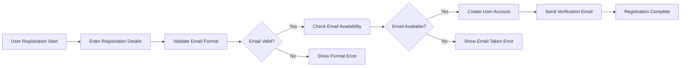
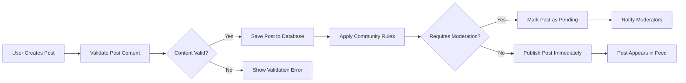

# Testing Strategy and Quality Assurance Requirements

## Introduction

This document establishes the comprehensive testing strategy, acceptance criteria, and quality assurance requirements for the Reddit-like community platform. The testing strategy ensures that all functional requirements are validated, performance benchmarks are met, and the system operates reliably under expected load conditions. This document serves as the definitive guide for quality assurance processes throughout development and deployment.

## Test Scenarios

### User Authentication Testing

#### Registration Process


**Test Cases:**
- **TC-AUTH-001**: WHEN a user provides valid registration information, THE system SHALL create a new user account and send email verification
- **TC-AUTH-002**: WHEN a user provides an invalid email format, THE system SHALL reject the registration and display appropriate error message
- **TC-AUTH-003**: WHEN a user attempts to register with an existing email, THE system SHALL prevent duplicate account creation
- **TC-AUTH-004**: WHEN email verification is required, THE system SHALL send verification email with secure token
- **TC-AUTH-005**: WHEN user clicks verification link, THE system SHALL activate the account and redirect to login

#### Login and Session Management
- **TC-AUTH-006**: WHEN valid credentials are provided, THE system SHALL authenticate user and create session
- **TC-AUTH-007**: WHEN invalid credentials are provided, THE system SHALL deny access without revealing specific error details
- **TC-AUTH-008**: WHEN session expires, THE system SHALL require re-authentication
- **TC-AUTH-009**: WHERE multiple failed login attempts occur, THE system SHALL implement temporary account lockout
- **TC-AUTH-010**: WHEN user logs out, THE system SHALL invalidate session token

### Community Management Testing

#### Community Creation
- **TC-COMM-001**: WHEN authenticated user creates a community with valid parameters, THE system SHALL create community and assign creator as moderator
- **TC-COMM-002**: WHEN user attempts to create community with invalid name, THE system SHALL reject creation with specific validation errors
- **TC-COMM-003**: WHEN user attempts to create duplicate community name, THE system SHALL prevent creation
- **TC-COMM-004**: WHERE community name contains prohibited terms, THE system SHALL reject creation

#### Subscription System
- **TC-COMM-005**: WHEN user subscribes to a community, THE system SHALL add community to user's subscription list
- **TC-COMM-006**: WHEN user unsubscribes from community, THE system SHALL remove community from subscription list
- **TC-COMM-007**: WHILE user is subscribed to community, THE system SHALL include community posts in user's feed
- **TC-COMM-008**: WHERE subscription limit is reached, THE system SHALL prevent additional subscriptions

### Content System Testing

#### Post Creation and Management


**Test Cases:**
- **TC-CONT-001**: WHEN user creates text post with valid content, THE system SHALL save post and make it visible in community
- **TC-CONT-002**: WHEN user creates link post with valid URL, THE system SHALL save post with link preview
- **TC-CONT-003**: WHEN user uploads image post, THE system SHALL validate image format and size, then save with thumbnail
- **TC-CONT-004**: WHERE post content violates community rules, THE system SHALL require moderator approval
- **TC-CONT-005**: WHEN user edits their own post, THE system SHALL update post content and mark as edited
- **TC-CONT-006**: WHERE post editing time limit expires, THE system SHALL prevent further edits

#### Voting System
- **TC-CONT-007**: WHEN user upvotes a post, THE system SHALL increment post score and user karma
- **TC-CONT-008**: WHEN user downvotes a post, THE system SHALL decrement post score and adjust user karma
- **TC-CONT-009**: WHERE user attempts to vote on their own content, THE system SHALL prevent self-voting
- **TC-CONT-010**: WHEN user changes vote, THE system SHALL update scores accordingly
- **TC-CONT-011**: WHERE voting rate limit is exceeded, THE system SHALL temporarily restrict voting

#### Content Ranking Algorithms
- **TC-CONT-012**: WHEN sorting by "hot", THE system SHALL prioritize posts with recent high engagement
- **TC-CONT-013**: WHEN sorting by "new", THE system SHALL display posts in chronological order
- **TC-CONT-014**: WHEN sorting by "top", THE system SHALL display posts with highest net score
- **TC-CONT-015**: WHEN sorting by "controversial", THE system SHALL prioritize posts with high vote counts in both directions
- **TC-CONT-016**: WHERE karma calculation occurs, THE system SHALL update user karma based on vote activity

### Comment System Testing

#### Comment Creation and Nesting
```mermaid
graph LR
  A["User Creates Comment"] --> B["Validate Comment Content"]
  B --> C{"Content Valid?"}
  C -->|Yes| D["Determine Comment Depth"]
  C -->|No| E["Show Validation Error"]
  D --> F{"Depth Limit Reached?"}
  F -->|No| G["Save Comment with Parent Reference"]
  F -->|Yes| H[\"Prevent Comment Creation\"]
  G --> I["Update Post Comment Count"]
  I --> J["Display Comment in Thread"]
```

**Test Cases:**
- **TC-COMMENT-001**: WHEN user comments on a post, THE system SHALL save comment and update post comment count
- **TC-COMMENT-002**: WHEN user replies to existing comment, THE system SHALL create nested reply with proper threading
- **TC-COMMENT-003**: WHERE comment nesting exceeds maximum depth, THE system SHALL prevent further nesting
- **TC-COMMENT-004**: WHEN user edits comment, THE system SHALL update content and mark as edited
- **TC-COMMENT-005**: WHERE comment contains prohibited content, THE system SHALL require moderator review
- **TC-COMMENT-006**: WHEN comment receives votes, THE system SHALL update comment score and user karma

#### Comment Display and Ranking
- **TC-COMMENT-007**: WHEN displaying comment threads, THE system SHALL maintain proper nesting hierarchy
- **TC-COMMENT-008**: WHERE comment sorting is applied, THE system SHALL order comments by specified criteria
- **TC-COMMENT-009**: WHEN loading large comment threads, THE system SHALL implement pagination
- **TC-COMMENT-010**: WHERE comment is deleted, THE system SHALL preserve thread structure with deletion marker

### User Profile Testing

#### Profile Information Display
- **TC-PROF-001**: WHEN viewing user profile, THE system SHALL display user activity history
- **TC-PROF-002**: WHERE karma system is active, THE system SHALL display current karma score
- **TC-PROF-003**: WHEN filtering profile content, THE system SHALL display posts, comments, or both based on selection
- **TC-PROF-004**: WHERE user has moderator roles, THE system SHALL display moderation activity

#### Profile Customization
- **TC-PROF-005**: WHEN user updates profile information, THE system SHALL save changes and update display
- **TC-PROF-006**: WHERE profile contains sensitive information, THE system SHALL implement privacy controls
- **TC-PROF-007**: WHEN user changes avatar, THE system SHALL validate and process image upload

### Moderation System Testing

#### Content Reporting
- **TC-MOD-001**: WHEN user reports content, THE system SHALL log report and notify moderators
- **TC-MOD-002**: WHERE multiple users report same content, THE system SHALL prioritize moderation queue
- **TC-MOD-003**: WHEN report is submitted, THE system SHALL provide confirmation to reporter

#### Moderation Actions
- **TC-MOD-004**: WHEN moderator approves content, THE system SHALL make content visible and notify submitter
- **TC-MOD-005**: WHEN moderator removes content, THE system SHALL hide content and notify submitter with reason
- **TC-MOD-006**: WHEN moderator bans user from community, THE system SHALL prevent user from participating
- **TC-MOD-007**: WHERE moderation actions are taken, THE system SHALL maintain audit trail
- **TC-MOD-008**: WHEN moderator escalates to admin, THE system SHALL notify administrators

## Acceptance Criteria

### User Authentication Acceptance Criteria
- **AC-AUTH-001**: User registration success rate shall be ≥99.9%
- **AC-AUTH-002**: Login authentication shall complete within 2 seconds
- **AC-AUTH-003**: Password reset functionality shall deliver email within 5 minutes
- **AC-AUTH-004**: Session timeout shall occur after 30 days of inactivity
- **AC-AUTH-005**: Account lockout shall activate after 5 failed login attempts

### Community Management Acceptance Criteria
- **AC-COMM-001**: Community creation shall complete within 3 seconds
- **AC-COMM-002**: Subscription updates shall reflect in user feed within 10 seconds
- **AC-COMM-003**: Community discovery shall return relevant results within 1 second
- **AC-COMM-004**: Moderator actions shall take effect immediately

### Content System Acceptance Criteria
- **AC-CONT-001**: Post creation shall complete within 2 seconds
- **AC-CONT-002**: Voting actions shall update scores within 500ms
- **AC-CONT-003**: Content feed loading shall complete within 1 second
- **AC-CONT-004**: Search functionality shall return results within 2 seconds
- **AC-CONT-005**: Image upload shall support files up to 10MB

### Comment System Acceptance Criteria
- **AC-COMMENT-001**: Comment submission shall complete within 1 second
- **AC-COMMENT-002**: Nested comment display shall maintain proper hierarchy
- **AC-COMMENT-003**: Comment voting shall update scores within 500ms
- **AC-COMMENT-004**: Large comment threads shall load with pagination

### Performance Acceptance Criteria
- **AC-PERF-001**: System shall support 10,000 concurrent users
- **AC-PERF-002**: API response time shall be <100ms for 95% of requests
- **AC-PERF-003**: Database queries shall complete within 50ms
- **AC-PERF-004**: System availability shall be ≥99.5%

## Quality Metrics

### Performance Metrics
- **Response Time**: Average API response time <50ms
- **Throughput**: Capable of handling 1,000 requests per second
- **Concurrency**: Support for 10,000 simultaneous users
- **Uptime**: System availability ≥99.5%
- **Error Rate**: <0.1% of requests result in errors

### Reliability Metrics
- **Mean Time Between Failures (MTBF)**: ≥720 hours
- **Mean Time To Recovery (MTTR)**: ≤30 minutes
- **Data Consistency**: 100% data integrity across all operations
- **Backup Recovery**: Full system recovery within 4 hours

### Security Metrics
- **Authentication Success Rate**: ≥99.9%
- **Password Strength**: Enforced minimum complexity requirements
- **Session Security**: Secure token generation and validation
- **Data Encryption**: All sensitive data encrypted at rest and in transit

### User Experience Metrics
- **Page Load Time**: <2 seconds for main pages
- **Action Completion**: User actions complete within 1 second
- **Error Clarity**: Clear error messages for 100% of user-facing errors
- **Accessibility**: WCAG 2.1 AA compliance

## Performance Benchmarks

### Load Testing Benchmarks
- **Baseline Load**: 1,000 concurrent users
- **Peak Load**: 10,000 concurrent users
- **Stress Test**: 15,000 concurrent users
- **Endurance Test**: 72-hour continuous operation at 5,000 concurrent users

### Response Time Benchmarks
| Operation | Target Response Time | Acceptable Response Time |
|-----------|---------------------|-------------------------|
| User Registration | 2 seconds | 5 seconds |
| User Login | 1 second | 3 seconds |
| Post Creation | 2 seconds | 5 seconds |
| Comment Submission | 1 second | 3 seconds |
| Voting | 500ms | 1 second |
| Feed Loading | 1 second | 3 seconds |
| Search | 2 seconds | 5 seconds |

### Database Performance Benchmarks
- **Query Performance**: <50ms for 95% of queries
- **Connection Pool**: Support 500 concurrent database connections
- **Transaction Rate**: Process 500 transactions per second
- **Index Performance**: Maintain query performance with 10M+ records

## Test Environment Requirements

### Development Environment
- **Hardware**: Equivalent to production specifications
- **Database**: Isolated test database with sample data
- **Network**: Simulated production network conditions
- **Monitoring**: Comprehensive logging and performance monitoring

### Staging Environment
- **Configuration**: Mirror of production environment
- **Data**: Anonymized production data snapshot
- **Integration**: Full integration with external services
- **Security**: Same security controls as production

### Production Testing
- **Smoke Testing**: Basic functionality verification before deployment
- **Regression Testing**: Full regression suite on staging before production deployment
- **Performance Testing**: Load testing on isolated production-like environment
- **Security Testing**: Penetration testing and vulnerability assessment

## Testing Methodology

### Manual Testing
- **Exploratory Testing**: Ad-hoc testing to discover edge cases
- **User Acceptance Testing**: Business requirement validation by stakeholders
- **Usability Testing**: User experience validation with target audience
- **Accessibility Testing**: Compliance with accessibility standards

### Automated Testing
- **Unit Testing**: Individual component testing with ≥90% code coverage
- **Integration Testing**: Component interaction testing
- **API Testing**: REST API endpoint validation
- **End-to-End Testing**: Complete user workflow testing

### Integration Testing
- **Third-Party Service Integration**: Testing external service connections
- **Database Integration**: Data persistence and retrieval testing
- **Cache Integration**: Caching layer functionality testing
- **Message Queue Integration**: Asynchronous processing testing

## Release Validation

### Pre-Production Verification
- **Code Review**: Peer review of all changes
- **Automated Testing**: Full test suite execution
- **Performance Validation**: Load testing against benchmarks
- **Security Scan**: Vulnerability assessment
- **Documentation Review**: Updated documentation verification

### Deployment Verification
- **Smoke Testing**: Critical path verification immediately after deployment
- **Monitoring Setup**: Performance and error monitoring activation
- **Backup Verification**: Data backup and recovery procedure testing
- **Rollback Plan**: Verified rollback procedure for emergency situations

### Post-Deployment Monitoring
- **Performance Monitoring**: Continuous performance metric tracking
- **Error Tracking**: Real-time error detection and alerting
- **User Feedback**: Collection and analysis of user-reported issues
- **Usage Analytics**: Tracking of feature usage and user behavior

## Test Data Management

### Test Data Requirements
- **Realistic Data**: Test data that mirrors production patterns
- **Edge Cases**: Data covering boundary conditions and error scenarios
- **Volume Testing**: Sufficient data volume for performance testing
- **Data Privacy**: Anonymized or synthetic data for privacy compliance

### Data Generation Strategy
- **User Profiles**: Diverse user types with varying activity levels
- **Content Variety**: Posts, comments, and communities covering all content types
- **Interaction Patterns**: Realistic voting, commenting, and subscription patterns
- **Temporal Distribution**: Data spanning different time periods

## Continuous Testing Integration

### CI/CD Pipeline Integration
- **Automated Test Execution**: Trigger tests on code changes
- **Quality Gates**: Block deployment on test failures
- **Performance Regression**: Detect performance degradation early
- **Security Scanning**: Continuous security vulnerability scanning

### Test Reporting
- **Test Results**: Comprehensive test execution reporting
- **Coverage Metrics**: Code coverage and test effectiveness reporting
- **Performance Trends**: Historical performance metric tracking
- **Defect Tracking**: Bug discovery and resolution tracking

## Risk Mitigation

### Testing Risks
- **Incomplete Test Coverage**: Mitigated through comprehensive test planning
- **Environment Differences**: Mitigated through environment standardization
- **Data Quality Issues**: Mitigated through realistic test data generation
- **Performance Bottlenecks**: Mitigated through early performance testing

### Contingency Planning
- **Test Failure Response**: Procedures for addressing test failures
- **Environment Recovery**: Rapid environment restoration capabilities
- **Data Recovery**: Test data backup and restoration procedures
- **Communication Plan**: Stakeholder notification for critical issues

## Success Criteria

### Testing Completion Criteria
- **Test Execution**: 100% of planned test cases executed
- **Defect Resolution**: All critical and major defects resolved
- **Performance Validation**: All performance benchmarks met
- **Security Validation**: All security requirements verified
- **User Acceptance**: Business requirements validated by stakeholders

### Quality Gates
- **Code Coverage**: ≥90% unit test coverage
- **Defect Density**: <1 critical defect per 1,000 lines of code
- **Performance Compliance**: 100% of performance benchmarks achieved
- **Security Compliance**: Zero critical security vulnerabilities
- **User Satisfaction**: ≥95% user acceptance test pass rate

This testing strategy ensures that the Reddit-like community platform meets all functional, performance, security, and reliability requirements before deployment. The comprehensive test coverage and rigorous acceptance criteria guarantee a high-quality user experience and system stability.

> *Developer Note: This document defines **business requirements only**. All technical implementations (architecture, APIs, database design, etc.) are at the discretion of the development team.*