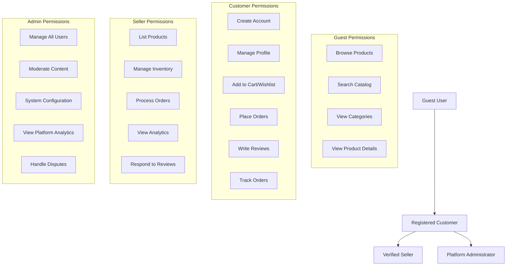

# Shopping Mall E-commerce Platform - Project Overview & Documentation Guide

## Executive Summary

The Shopping Mall E-commerce Platform represents a sophisticated multi-vendor marketplace designed to revolutionize digital commerce by connecting buyers and sellers in a seamless, secure, and scalable environment. This platform enables individual entrepreneurs, small businesses, and established brands to establish robust online storefronts while providing customers with a unified shopping experience featuring diverse product selection, competitive pricing, and reliable fulfillment services.

### Core Business Objectives
- **Marketplace Ecosystem**: Create a vibrant digital ecosystem where multiple sellers coexist, compete, and thrive alongside each other
- **Customer Experience**: Deliver exceptional shopping experiences through intuitive interfaces, personalized recommendations, and reliable service
- **Seller Empowerment**: Provide comprehensive business management tools that enable sellers to focus on their products rather than technical complexities
- **Platform Scalability**: Build a foundation that supports exponential growth from startup to enterprise-level operations

### Target Market Analysis
**Primary Customer Segments**:
- Urban professionals aged 25-45 seeking convenience and variety
- Families looking for consolidated shopping experiences
- Value-conscious consumers comparing prices across multiple sellers
- Niche product enthusiasts seeking specialized offerings

**Seller Segments**:
- Individual artisans and craft producers
- Small to medium retail businesses expanding online
- Established brands testing new markets
- Local retailers transitioning to e-commerce

## Documentation Structure

### Complete Document Ecosystem
This project is organized into 10 comprehensive documents that collectively define the complete business requirements and system specifications for backend implementation.

#### Core Documentation Architecture
1. **[Business Model Analysis](./01-business-model.md)** - Strategic market positioning, revenue models, cost structures, and competitive differentiation
2. **[User Roles & Authentication System](./02-user-roles.md)** - Complete role hierarchy, permission matrices, security protocols, and session management
3. **[Product Catalog Management](./03-product-catalog.md)** - Category systems, search functionality, variant management, and inventory control
4. **[Shopping Flow & Order Placement](./04-shopping-flow.md)** - Cart management, wishlist functionality, checkout processes, and payment integration
5. **[Order Management & Tracking](./05-order-management.md)** - Order processing, shipping integration, status tracking, and customer service workflows
6. **[Seller Platform & Management](./06-seller-platform.md)** - Seller onboarding, product listing, inventory management, and order fulfillment
7. **[Payment Processing System](./07-payment-system.md)** - Secure transactions, multiple payment methods, refund processing, and financial compliance
8. **[Reviews & Ratings System](./08-reviews-ratings.md)** - Customer feedback mechanisms, moderation workflows, and social proof features
9. **[Customer Account Management](./09-customer-account.md)** - Profile management, address books, order history, and account security
10. **[Admin Dashboard & Platform Management](./10-admin-dashboard.md)** - System administration, analytics, configuration, and content moderation

### Document Interdependencies
Each document builds upon the foundation established in previous documents, creating a cohesive specification ecosystem:
- User authentication (02) enables all user interactions
- Product catalog (03) forms the inventory foundation
- Shopping flow (04) depends on catalog and authentication
- Order management (05) integrates with shopping and payment systems
- Seller platform (06) extends order and catalog management
- Payment system (07) secures financial transactions
- Review system (08) enhances product discovery
- Customer accounts (09) personalize user experiences
- Admin dashboard (10) provides system-wide oversight

## User Role Architecture

### Comprehensive Role Definitions

The platform implements a hierarchical role-based access control system with four distinct user types:

### Authentication System Requirements

**User Registration Process**:
WHEN a user registers for a new account, THE system SHALL collect email address, password, and basic profile information.
THE system SHALL validate email format and ensure password meets minimum security requirements of 8 characters with uppercase, lowercase, and numeric characters.
WHERE email verification is required, THE system SHALL send verification link with 24-hour expiration.
IF email verification is not completed within 24 hours, THEN THE system SHALL automatically delete the pending registration.

**Login and Session Management**:
WHEN a user attempts to login, THE system SHALL validate credentials against stored authentication data.
THE system SHALL implement secure password hashing using industry-standard bcrypt algorithm.
IF login attempts exceed 5 failures within 15 minutes, THEN THE system SHALL temporarily lock the account for 30 minutes.
THE system SHALL generate JWT tokens with 15-minute expiration for authenticated sessions.

**Password Security Requirements**:
WHEN users create or change passwords, THE system SHALL enforce minimum complexity requirements.
THE system SHALL prevent password reuse from previous 5 password changes.
WHERE password reset is requested, THE system SHALL send secure reset link with 1-hour expiration.

### Permission Matrix Implementation

| Action | Guest | Customer | Seller | Admin |
|--------|-------|----------|--------|-------|
| Browse products | ✅ | ✅ | ✅ | ✅ |
| View product details | ✅ | ✅ | ✅ | ✅ |
| Search catalog | ✅ | ✅ | ✅ | ✅ |
| Register account | ✅ | ❌ | ❌ | ❌ |
| Login to account | ❌ | ✅ | ✅ | ✅ |
| Manage profile | ❌ | ✅ | ✅ | ✅ |
| Add to cart | ❌ | ✅ | ✅ | ✅ |
| Create wishlist | ❌ | ✅ | ✅ | ✅ |
| Place orders | ❌ | ✅ | ✅ | ✅ |
| Write reviews | ❌ | ✅ | ✅ | ✅ |
| Apply for seller account | ❌ | ✅ | ❌ | ❌ |
| List products | ❌ | ❌ | ✅ | ✅ |
| Manage inventory | ❌ | ❌ | ✅ | ✅ |
| Fulfill orders | ❌ | ❌ | ✅ | ✅ |
| View seller dashboard | ❌ | ❌ | ✅ | ✅ |
| Manage all users | ❌ | ❌ | ❌ | ✅ |
| Manage all products | ❌ | ❌ | ❌ | ✅ |
| Manage all orders | ❌ | ❌ | ❌ | ✅ |
| Access admin dashboard | ❌ | ❌ | ❌ | ✅ |
| Platform configuration | ❌ | ❌ | ❌ | ✅ |

## Development Timeline Overview

### Phase 1: Foundation Establishment (Months 1-3)
**Core Platform Development**:
- User authentication and account management system
- Basic product catalog with category structure
- Simple shopping cart functionality
- Essential payment integration
- Seller registration and verification

**Key Deliverables**:
- Minimum viable product with core marketplace functionality
- Basic user interface for customers and sellers
- Secure payment processing integration
- Seller onboarding workflow

### Phase 2: Marketplace Expansion (Months 4-6)
**Advanced Feature Implementation**:
- Complete seller dashboard with product management
- Advanced product variants and inventory control
- Order management and fulfillment workflows
- Enhanced search and filtering capabilities
- Customer review and rating system

**Key Deliverables**:
- Full seller platform with inventory management
- Comprehensive order processing system
- Advanced product discovery features
- Customer feedback mechanisms

### Phase 3: Optimization and Scaling (Months 7-9)
**Performance and Experience Enhancement**:
- Mobile-responsive design implementation
- Performance optimization for high traffic
- Advanced analytics and reporting
- Customer loyalty features
- International shipping support

**Key Deliverables**:
- Optimized platform performance
- Comprehensive analytics dashboard
- Enhanced mobile experience
- Expanded shipping capabilities

### Phase 4: Enterprise Features (Months 10-12)
**Advanced Business Tools**:
- Admin dashboard with complete oversight
- Advanced reporting and business intelligence
- Multi-currency and tax support
- API development for third-party integration
- Advanced security features

**Key Deliverables**:
- Complete administrative control panel
- Enterprise-level reporting capabilities
- Extended integration framework
- Enhanced security protocols

## System Integration Points

### External Service Integrations

**Payment Gateway Integration**:
THE system SHALL integrate with multiple payment processors including Stripe, PayPal, and regional payment providers.
WHEN processing payments, THE system SHALL maintain PCI DSS compliance and secure transaction handling.

**Shipping Carrier Integration**:
THE system SHALL integrate with major shipping carriers including FedEx, UPS, DHL, and local postal services.
WHERE real-time tracking is available, THE system SHALL provide shipment status updates to customers.

**Email Service Provider Integration**:
THE system SHALL integrate with email service providers for order confirmations, shipping notifications, and marketing communications.
WHEN sending transactional emails, THE system SHALL ensure deliverability and compliance with anti-spam regulations.

### Internal System Coordination

**Authentication System Integration**:
ALL user interactions SHALL be secured through the centralized authentication system.
WHEN users access protected resources, THE system SHALL validate permissions based on role assignments.

**Inventory Management Integration**:
THE shopping cart SHALL validate real-time inventory availability before allowing purchases.
WHEN orders are placed, THE system SHALL immediately reserve inventory to prevent overselling.

**Order Processing Integration**:
THE payment system SHALL coordinate with order management to ensure accurate order fulfillment.
WHERE payment processing fails, THE system SHALL maintain order integrity and provide retry mechanisms.

## Success Measurement Framework

### Key Performance Indicators (KPIs)

**User Engagement Metrics**:
- Monthly Active Users (MAU): Target 50,000 within first year
- Daily Active Users (DAU): Target 5,000 sustained engagement
- Session Duration: Average 5+ minutes per session
- Pages per Session: Average 8+ pages per user session

**Business Performance Metrics**:
- Gross Merchandise Volume (GMV): Target $5M+ in first year
- Average Order Value (AOV): Target $75+ per transaction
- Conversion Rate: Target 3%+ from visitor to purchaser
- Customer Retention Rate: Target 60%+ repeat purchase rate

**Platform Health Metrics**:
- System Uptime: 99.9% availability during business hours
- Page Load Time: Under 2 seconds for core pages
- Transaction Success Rate: 99.5% successful payment processing
- Customer Satisfaction Score: 4.5+ out of 5.0

### Quality Assurance Standards

**Performance Monitoring**:
THE system SHALL implement comprehensive monitoring for response times, error rates, and system health.
WHEN performance degrades below acceptable thresholds, THE system SHALL trigger alerts for immediate investigation.

**Security Compliance**:
THE system SHALL maintain PCI DSS compliance for all payment processing.
WHERE user data is concerned, THE system SHALL comply with GDPR and relevant privacy regulations.

**Testing Requirements**:
ALL critical user journeys SHALL undergo automated testing with 95%+ test coverage.
THE system SHALL implement continuous integration and deployment pipelines with automated testing.

## Technical Implementation Guidelines

### Business Requirements Focus
All documentation emphasizes business logic, user workflows, and functional specifications rather than technical implementation details. Development teams have discretion regarding:
- Database architecture and design
- API specifications and endpoints
- Technology stack selection
- Infrastructure architecture
- Deployment methodologies

### Implementation Priorities
**Critical Path Dependencies**:
1. User authentication and role management
2. Product catalog and inventory foundation
3. Shopping cart and order processing
4. Payment gateway integration
5. Seller onboarding and management

**Secondary Dependencies**:
6. Review and rating system
7. Advanced search and filtering
8. Admin dashboard development
9. Analytics and reporting
10. Mobile optimization

### Scalability Considerations
**Initial Scaling Targets**:
- Support for 1,000 concurrent users
- Catalog size of 100,000+ products
- Order processing capacity of 1,000 orders per hour
- Payment processing capacity of 500 transactions per minute

**Future Scaling Requirements**:
- Horizontal scaling capabilities for all system components
- Database sharding strategies for large datasets
- Content delivery network integration
- Caching strategies for performance optimization

## Document Navigation

### Recommended Reading Sequence
For optimal understanding of the platform architecture, developers should review documents in this sequence:

1. **Start Here** (This document) - Comprehensive project overview and navigation guide
2. **Business Model** - Strategic context, revenue planning, and market positioning
3. **User Authentication** - Foundation for role-based access control and security
4. **Product Catalog** - Core marketplace inventory and discovery mechanisms
5. **Shopping Flow** - Primary revenue generation and customer conversion paths
6. **Order Management** - Post-purchase customer experience and fulfillment
7. **Seller Platform** - Vendor management and business operations
8. **Payment System** - Financial transaction processing and security
9. **Customer Accounts** - User profile management and personalization
10. **Admin Dashboard** - System-wide management and oversight

### Cross-Reference Guidelines
Each document contains specific references to related components:
- Authentication requirements reference user role definitions
- Shopping flow depends on product catalog specifications
- Order management integrates with payment processing
- Seller platform extends order and catalog functionality
- Admin dashboard provides oversight for all system components

## Future Expansion Considerations

### International Expansion
**Multi-Currency Support**:
WHERE international expansion occurs, THE system SHALL support multiple currencies with real-time exchange rates.
THE system SHALL implement localized pricing strategies based on geographic markets.

**Language Localization**:
THE platform architecture SHALL support multiple language interfaces.
WHERE new markets are entered, THE system SHALL provide localization for dates, currencies, and measurements.

**Regional Compliance**:
THE system SHALL adapt to regional regulations including tax calculations, consumer protection laws, and data privacy requirements.

### Advanced Feature Development
**Mobile Application**:
THE platform architecture SHALL support native mobile applications for iOS and Android.
WHERE mobile apps are developed, THE system SHALL provide dedicated APIs for mobile-specific functionality.

**Artificial Intelligence Integration**:
THE system SHALL support AI-powered features including personalized recommendations, fraud detection, and customer service automation.
WHERE machine learning is implemented, THE system SHALL provide data collection and model training capabilities.

**Advanced Analytics**:
THE platform SHALL support sophisticated business intelligence and predictive analytics.
WHERE advanced reporting is required, THE system SHALL provide data export and integration capabilities.

### Technology Evolution
**API-First Architecture**:
THE system SHALL implement API-first design principles to support future integrations.
WHERE third-party integrations are required, THE system SHALL provide comprehensive API documentation.

**Microservices Readiness**:
THE architecture SHALL support decomposition into microservices as scale requirements increase.
WHERE performance optimization is needed, THE system SHALL support independent scaling of components.

**Cloud Native Design**:
THE platform SHALL be designed for cloud deployment with containerization and orchestration capabilities.
WHERE cloud providers are selected, THE system SHALL maintain provider-agnostic design principles.

This comprehensive overview establishes the foundation for a scalable, secure, and feature-rich e-commerce platform that can evolve from startup to enterprise-level operations while maintaining focus on user experience, seller empowerment, and business growth.

> *Developer Note: This document defines **business requirements only**. All technical implementations (architecture, APIs, database design, etc.) are at the discretion of the development team.*