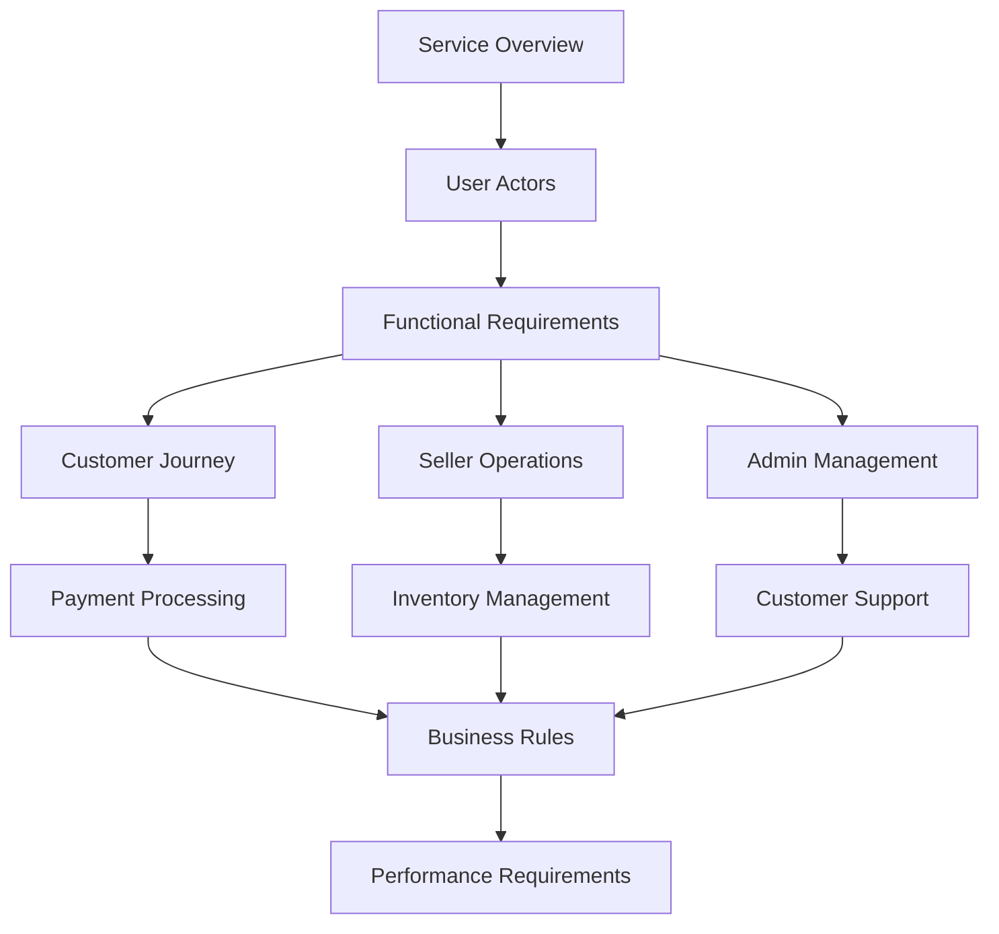

# E-Commerce Platform Documentation Index

## Project Documentation Overview

This documentation set provides comprehensive coverage of the shopping mall e-commerce platform, from high-level business strategy to detailed functional requirements. The documents are organized to guide stakeholders through the complete system understanding, with each document serving a specific purpose in the overall platform architecture.

### Documentation Purpose and Scope

The shopping mall platform documentation is designed to provide a complete blueprint for understanding, developing, and operating the e-commerce system. Each document focuses on specific aspects of the platform while maintaining consistency across the entire documentation set.

**Target Audience**:
- **Business Stakeholders**: Executives, investors, and product managers
- **Technical Teams**: Developers, architects, and system administrators
- **Operational Teams**: Customer support, logistics, and finance personnel
- **End Users**: Customers, sellers, and administrators

## Document Structure and Organization

The documentation follows a logical progression from strategic vision to operational implementation:

### Strategic Foundation Documents

**[Service Overview Document](./01-service-overview.md)**
- **Purpose**: Defines the core business vision, market opportunity, and strategic objectives
- **Audience**: Business stakeholders and investors
- **Key Content**: Executive summary, business mission, market analysis, competitive landscape

**[User Actors and Authentication Framework](./02-user-actors.md)**
- **Purpose**: Establishes the complete user actor ecosystem with permission hierarchies
- **Audience**: Product managers and business analysts
- **Key Content**: User definitions, authentication framework, permission matrices

### Core Functional Requirements

**[Functional Requirements Specification](./03-functional-requirements.md)**
- **Purpose**: Documents complete functional requirements using natural language and EARS format
- **Audience**: Development team and product managers
- **Key Content**: Platform features, product management, shopping processes, order lifecycle

**[Customer Journey Mapping](./04-customer-journey.md)**
- **Purpose**: Maps the complete customer journey from discovery to post-purchase
- **Audience**: UX designers and product managers
- **Key Content**: Registration, product discovery, checkout, order tracking, support

### Operational Perspectives

**[Seller Operations Guide](./05-seller-operations.md)**
- **Purpose**: Defines seller experience and business management capabilities
- **Audience**: Business development and seller management teams
- **Key Content**: Seller onboarding, product listing, order processing, sales analytics

**[Administrative Management Framework](./06-admin-management.md)**
- **Purpose**: Establishes administrative functions and system management capabilities
- **Audience**: System administrators and business owners
- **Key Content**: User management, category management, platform configuration, analytics

### Business Process Documentation

**[Payment Processing Requirements](./07-payment-processing.md)**
- **Purpose**: Defines payment processing requirements and financial transaction flows
- **Audience**: Finance team and payment operations
- **Key Content**: Payment gateway integration, transaction processing, financial reporting

**[Inventory Management System](./08-inventory-management.md)**
- **Purpose**: Documents inventory management requirements and stock control processes
- **Audience**: Operations and logistics teams
- **Key Content**: Stock level management, inventory tracking, replenishment alerts

**[Customer Support Framework](./09-customer-support.md)**
- **Purpose**: Establishes customer support and communication framework
- **Audience**: Customer service and support teams
- **Key Content**: Support ticket management, communication channels, issue resolution

### Compliance and Performance

**[Business Rules and Validation](./10-business-rules.md)**
- **Purpose**: Defines business rules, validation requirements, and operational constraints
- **Audience**: Legal and compliance teams
- **Key Content**: Product validation, order processing constraints, platform policies

**[Performance and Reliability Standards](./11-performance-requirements.md)**
- **Purpose**: Documents performance expectations, scalability requirements, and reliability standards
- **Audience**: Technical leadership and operations teams
- **Key Content**: Performance metrics, scalability planning, security standards

## Navigation Guidelines

### Recommended Reading Order

**For Business Stakeholders**:
1. [Service Overview](./01-service-overview.md)
2. [Customer Journey](./04-customer-journey.md)
3. [Payment Processing](./07-payment-processing.md)

**For Development Teams**:
1. [User Actors](./02-user-actors.md)
2. [Functional Requirements](./03-functional-requirements.md)
3. [Business Rules](./10-business-rules.md)
4. [Performance Requirements](./11-performance-requirements.md)

**For Operational Teams**:
1. [Seller Operations](./05-seller-operations.md)
2. [Inventory Management](./08-inventory-management.md)
3. [Customer Support](./09-customer-support.md)
4. [Admin Management](./06-admin-management.md)

### Key Entry Points

- **Strategic Planning**: Start with [Service Overview](./01-service-overview.md)
- **System Architecture**: Begin with [User Actors](./02-user-actors.md)
- **Feature Development**: Reference [Functional Requirements](./03-functional-requirements.md)
- **User Experience Design**: Use [Customer Journey](./04-customer-journey.md)
- **Business Operations**: Consult [Seller Operations](./05-seller-operations.md) and [Admin Management](./06-admin-management.md)

## Document Relationships and Dependencies

The documentation follows a logical dependency chain where each document builds upon the foundation established by previous documents:

```mermaid
graph TD
    A["Service Overview"] --> B["User Actors"]
    B --> C["Functional Requirements"]
    C --> D["Customer Journey"]
    C --> E["Seller Operations"]
    C --> F["Admin Management"]
    D --> G["Payment Processing"]
    E --> H["Inventory Management"]
    F --> I["Customer Support"]
    G --> J["Business Rules"]
    H --> J
    I --> J
    J --> K["Performance Requirements"]
```

### Information Flow

1. **Foundation Layer**: [Service Overview](./01-service-overview.md) and [User Actors](./02-user-actors.md) establish the strategic vision and user ecosystem
2. **Core Requirements**: [Functional Requirements](./03-functional-requirements.md) defines the complete feature set
3. **User Experience**: [Customer Journey](./04-customer-journey.md), [Seller Operations](./05-seller-operations.md), and [Admin Management](./06-admin-management.md) detail specific user interactions
4. **Business Processes**: [Payment Processing](./07-payment-processing.md), [Inventory Management](./08-inventory-management.md), and [Customer Support](./09-customer-support.md) cover operational workflows
5. **Compliance Layer**: [Business Rules](./10-business-rules.md) and [Performance Requirements](./11-performance-requirements.md) establish constraints and standards

### Cross-References

Each document contains references to related documents where additional context or complementary information is available. When reading any document, follow the cross-references to gain comprehensive understanding of interconnected topics.

### Update Coordination

Changes to foundational documents may require updates to dependent documents. The documentation maintainers should ensure consistency across all documents when making significant changes to:
- User actor definitions
- Core business requirements
- Platform architecture decisions
- Performance and security standards

> *Developer Note: This document defines **business requirements only**. All technical implementations (architecture, APIs, database design, etc.) are at the discretion of the development team.*