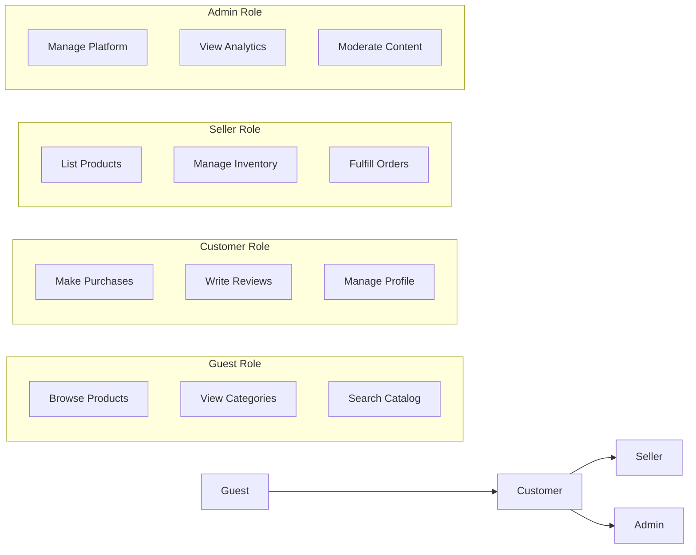

# User Roles and Authentication Requirements

## Introduction

This document defines the comprehensive user role structure and authentication system for the shopping mall e-commerce platform. The platform operates as a multi-vendor marketplace where different user types interact with distinct capabilities and permissions. The authentication system must securely manage user identities while providing appropriate access controls based on user roles.

## Authentication System Requirements

### Core Authentication Functions

**User Registration Process**
- WHEN a user registers for a new account, THE system SHALL collect email, password, and basic profile information
- THE system SHALL validate email format and password strength requirements
- WHERE password strength requirements, THE system SHALL require minimum 8 characters with at least one uppercase letter, one lowercase letter, and one number
- THE system SHALL send email verification before activating accounts
- IF email verification fails, THEN THE system SHALL prevent account activation

**User Login Process**
- WHEN a user attempts to login, THE system SHALL validate credentials against stored user data
- THE system SHALL implement secure password hashing using industry-standard algorithms
- IF login attempts exceed 5 failures within 15 minutes, THEN THE system SHALL temporarily lock the account for 30 minutes
- THE system SHALL generate JWT tokens for authenticated sessions

**Password Management**
- WHEN a user requests password reset, THE system SHALL send reset instructions to verified email
- THE system SHALL require password confirmation during reset process
- THE system SHALL invalidate all active sessions after password change
- THE system SHALL prevent reuse of recent passwords

**Email Verification**
- THE system SHALL require email verification for all new user registrations
- WHEN email verification link expires, THE system SHALL allow resending verification email
- THE system SHALL prevent unverified accounts from making purchases

### Session Management Requirements

**JWT Token Specifications**
- THE system SHALL use JWT tokens for session management
- Access tokens SHALL expire after 15 minutes
- Refresh tokens SHALL expire after 7 days
- JWT payload SHALL include userId, role, and permissions array
- THE system SHALL validate token signature for all authenticated requests

**Session Security**
- THE system SHALL implement secure token storage recommendations
- THE system SHALL provide logout functionality that invalidates tokens
- THE system SHALL support session termination from all devices
- THE system SHALL detect and prevent token replay attacks

## User Role Hierarchy

### Role Definitions and Relationships

The platform supports four distinct user roles with hierarchical relationships:

### Detailed Role Specifications

#### Guest Role
- **Description**: Unauthenticated users who can browse products, view categories, and search the catalog
- **Authentication Status**: Not logged in
- **Default Permissions**: Read-only access to public content
- **Upgrade Path**: Can register to become Customer

#### Customer Role
- **Description**: Registered users who can shop, manage their profile, place orders, and write reviews
- **Authentication Status**: Email-verified account
- **Core Functions**: Full shopping capabilities, order management, review system access
- **Upgrade Path**: Can apply to become Seller

#### Seller Role
- **Description**: Vendors who can list products, manage inventory, and fulfill orders
- **Authentication Status**: Additional seller verification required
- **Business Functions**: Product management, inventory control, order fulfillment
- **Relationship**: Inherits all Customer permissions

#### Admin Role
- **Description**: System administrators with full access to manage users, products, orders, and platform settings
- **Authentication Status**: Highest privilege level
- **Platform Management**: Complete system oversight and moderation capabilities
- **Relationship**: Inherits all Customer and Seller permissions

## Permission Matrix

### Comprehensive Capability Table

| Action | Guest | Customer | Seller | Admin |
|--------|-------|----------|--------|-------|
| Browse products | ✅ | ✅ | ✅ | ✅ |
| View product details | ✅ | ✅ | ✅ | ✅ |
| Search catalog | ✅ | ✅ | ✅ | ✅ |
| Register account | ✅ | ❌ | ❌ | ❌ |
| Login to account | ❌ | ✅ | ✅ | ✅ |
| Manage profile | ❌ | ✅ | ✅ | ✅ |
| Add to cart | ❌ | ✅ | ✅ | ✅ |
| Create wishlist | ❌ | ✅ | ✅ | ✅ |
| Place orders | ❌ | ✅ | ✅ | ✅ |
| Write reviews | ❌ | ✅ | ✅ | ✅ |
| Apply for seller account | ❌ | ✅ | ❌ | ❌ |
| List products | ❌ | ❌ | ✅ | ✅ |
| Manage inventory | ❌ | ❌ | ✅ | ✅ |
| Fulfill orders | ❌ | ❌ | ✅ | ✅ |
| View seller dashboard | ❌ | ❌ | ✅ | ✅ |
| Manage all users | ❌ | ❌ | ❌ | ✅ |
| Manage all products | ❌ | ❌ | ❌ | ✅ |
| Manage all orders | ❌ | ❌ | ❌ | ✅ |
| Access admin dashboard | ❌ | ❌ | ❌ | ✅ |
| Platform configuration | ❌ | ❌ | ❌ | ✅ |

### Role Transition Requirements

**Customer to Seller Transition**
- WHEN a customer applies to become a seller, THE system SHALL require business verification information
- THE system SHALL validate business registration details
- WHERE business verification is required, THE system SHALL collect tax identification and business registration documents
- THE system SHALL require admin approval for seller account activation
- IF seller application is approved, THEN THE system SHALL grant seller permissions while maintaining customer capabilities

**Admin Role Assignment**
- THE system SHALL restrict admin role assignment to existing administrators
- WHEN assigning admin privileges, THE system SHALL require multi-factor authentication confirmation
- THE system SHALL log all admin privilege changes for audit purposes

## Security Considerations

### Authentication Security

**Credential Protection**
- THE system SHALL never store passwords in plain text
- THE system SHALL use secure hashing algorithms for password storage
- THE system SHALL implement rate limiting for authentication attempts
- THE system SHALL enforce secure password policies

**Session Security**
- THE system SHALL implement secure token transmission over HTTPS
- THE system SHALL validate tokens for every authenticated request
- THE system SHALL implement token expiration and refresh mechanisms
- THE system SHALL provide logout functionality that immediately invalidates tokens

### Authorization Security

**Role-Based Access Control**
- THE system SHALL validate user role for every protected endpoint
- THE system SHALL implement permission checks at both route and data levels
- THE system SHALL prevent privilege escalation attacks
- THE system SHALL log authorization failures for security monitoring

**Data Access Controls**
- WHEN a user accesses data, THE system SHALL verify ownership or appropriate permissions
- THE system SHALL prevent customers from accessing other customers' order history
- THE system SHALL restrict sellers to only manage their own products and orders
- THE system SHALL enforce data segregation between sellers

### Business Security Rules

**Financial Transaction Security**
- WHEN processing payments, THE system SHALL validate user authentication and authorization
- THE system SHALL prevent guests from initiating payment transactions
- THE system SHALL verify customer identity for high-value transactions
- THE system SHALL implement fraud detection mechanisms

**Content Moderation Security**
- WHEN users submit reviews, THE system SHALL validate authentication and authorization
- THE system SHALL prevent sellers from reviewing their own products
- THE system SHALL implement review moderation workflows for inappropriate content
- THE system SHALL provide admin tools for content management

## Session Management

### Token Management Requirements

**JWT Token Structure**
- THE system SHALL include the following claims in JWT tokens:
  - userId: unique user identifier
  - role: user role (customer, seller, admin)
  - permissions: array of granted permissions
  - exp: expiration timestamp
  - iat: issued at timestamp

**Token Refresh Process**
- WHEN access token expires, THE system SHALL allow refresh token usage to obtain new access token
- THE system SHALL validate refresh token against stored token database
- IF refresh token is compromised, THEN THE system SHALL revoke all tokens for that user
- THE system SHALL implement secure token rotation

**Session State Management**
- THE system SHALL maintain session state for authenticated users
- THE system SHALL support concurrent sessions across multiple devices
- THE system SHALL provide session management interface for users
- THE system SHALL log session creation and termination events

### Security Event Handling

**Authentication Events**
- THE system SHALL log all successful and failed login attempts
- THE system SHALL notify users of suspicious login activity
- THE system SHALL implement account lockout after repeated failed attempts
- THE system SHALL provide password strength indicators during registration

**Authorization Events**
- THE system SHALL log all authorization failures
- THE system SHALL monitor for privilege escalation attempts
- THE system SHALL alert administrators of suspicious authorization patterns
- THE system SHALL implement role change approval workflows

## Integration Requirements

### User Profile Integration
- THE authentication system SHALL integrate with [Customer Account Management](./09-customer-account.md) for profile data
- WHEN users update profile information, THE system SHALL synchronize changes across all systems
- THE system SHALL maintain consistency between authentication data and profile data

### Seller Platform Integration
- THE authentication system SHALL provide role-based access to [Seller Platform](./06-seller-platform.md) features
- WHEN seller permissions are granted, THE system SHALL enable seller dashboard access
- THE system SHALL enforce seller-specific authorization rules

### Admin Dashboard Integration
- THE authentication system SHALL secure access to [Admin Dashboard](./10-admin-dashboard.md) functionality
- WHEN admin privileges are assigned, THE system SHALL enable full platform management capabilities
- THE system SHALL implement administrative action logging and audit trails

## Performance Requirements

**Authentication Performance**
- THE system SHALL process login requests within 2 seconds under normal load
- THE system SHALL validate tokens within 100 milliseconds
- THE system SHALL support concurrent authentication for 10,000+ users

**Session Management Performance**
- THE system SHALL maintain session state with sub-50ms read access
- THE system SHALL scale to handle 100,000+ active sessions
- THE system SHALL implement efficient token validation algorithms

## Error Handling

**Authentication Errors**
- WHEN authentication fails due to invalid credentials, THEN THE system SHALL return generic error message without revealing specific failure reason
- WHEN account is locked, THEN THE system SHALL inform user of lockout duration and recovery process
- WHEN token validation fails, THEN THE system SHALL return HTTP 401 status with appropriate error code

**Authorization Errors**
- WHEN user lacks required permissions, THEN THE system SHALL return HTTP 403 status
- WHEN role-based access is denied, THEN THE system SHALL log the attempt for security monitoring
- WHEN permission check fails, THEN THE system SHALL provide clear error message indicating required privileges

## Business Rules Summary

### User Registration Rules
- Email verification is mandatory for all accounts
- Password strength requirements must be enforced
- Business verification is required for seller accounts
- Admin accounts require existing admin approval

### Session Management Rules
- Access tokens expire after 15 minutes
- Refresh tokens expire after 7 days
- Users can have multiple concurrent sessions
- Session termination is available from all devices

### Permission Enforcement Rules
- Role-based access control is enforced at all protected endpoints
- Data ownership is verified for customer-specific data
- Seller data segregation is strictly enforced
- Admin privileges are carefully controlled and monitored

This user roles and authentication system provides the foundation for secure, scalable access control across the entire shopping mall platform, enabling the multi-vendor marketplace business model while maintaining appropriate security boundaries between different user types.