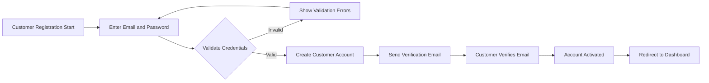
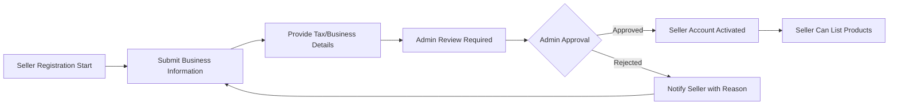

# User Actors and Authentication Framework

## Introduction

This document defines the complete user actor ecosystem for the shopping mall e-commerce platform, detailing authentication requirements, permission hierarchies, and access controls. The platform supports three distinct user actors: customers, sellers, and administrators, each with specific roles, responsibilities, and system permissions.

## User Actor Definitions

### Customer
**Role**: Registered user who can browse products, make purchases, and manage personal information

**Core Capabilities**:
- Browse and search product catalog
- Add products to shopping cart
- Place orders and complete purchases
- Track order status and history
- Manage personal profile and preferences
- Write product reviews and ratings
- Save favorite products
- Receive personalized recommendations

**Business Context**: Customers are the primary revenue generators for the platform, engaging in shopping activities and driving marketplace transactions.

### Seller
**Role**: Business owner who manages product listings, inventory, and order fulfillment

**Core Capabilities**:
- Create and manage product listings
- Update inventory levels and product information
- Process customer orders and manage fulfillment
- View sales analytics and performance metrics
- Communicate with customers regarding orders
- Manage storefront settings and branding
- Handle returns and refund requests

**Business Context**: Sellers are essential partners who provide products and services, contributing to platform diversity and revenue through transaction fees.

### Administrator
**Role**: System operator with full platform oversight and management capabilities

**Core Capabilities**:
- Manage user accounts and permissions
- Oversee product categories and catalog structure
- Monitor platform performance and analytics
- Configure system-wide settings and policies
- Handle dispute resolution and escalations
- Generate business intelligence reports
- Manage platform promotions and marketing

**Business Context**: Administrators ensure platform stability, security, and compliance while driving strategic growth and operational excellence.

## Authentication and Authorization Framework

### Authentication Requirements

**THE system SHALL provide user registration with email and password.**

**WHEN a user attempts to register, THE system SHALL validate email format and password strength requirements.**

**THE system SHALL require email verification before granting full platform access.**

**WHEN a user logs in with valid credentials, THE system SHALL generate a JWT access token.**

**THE system SHALL maintain user sessions securely with automatic token refresh capabilities.**

**WHEN a user logs out, THE system SHALL invalidate the current session token.**

**IF authentication fails due to invalid credentials, THEN THE system SHALL return appropriate error messages without revealing specific account information.**

### JWT Token Specification

**Token Structure Requirements**:
- **Access Token Expiration**: 30 minutes
- **Refresh Token Expiration**: 7 days
- **Token Storage**: localStorage for web applications
- **JWT Payload Must Include**: userId, actorType, permissions array, iat (issued at), exp (expiration)

**THE JWT token SHALL include user identification and role information.**

**WHEN a token expires, THE system SHALL automatically refresh it using the refresh token.**

**IF a refresh token is invalid or expired, THEN THE system SHALL require the user to re-authenticate.**

### Authorization Requirements

**THE system SHALL enforce role-based access control for all platform features.**

**WHEN a user attempts to access a restricted feature, THE system SHALL verify permissions before granting access.**

**IF a user lacks required permissions, THEN THE system SHALL deny access with appropriate error messaging.**

## Permission Matrix and Access Controls

### Complete Permission Matrix

| Feature/Action | Customer | Seller | Administrator |
|----------------|----------|--------|---------------|
| Browse products | ✅ | ✅ | ✅ |
| Search products | ✅ | ✅ | ✅ |
| View product details | ✅ | ✅ | ✅ |
| Add to cart | ✅ | ❌ | ❌ |
| Place orders | ✅ | ❌ | ❌ |
| View order history | ✅ | View own sales | ✅ |
| Write reviews | ✅ | ❌ | ❌ |
| Create product listings | ❌ | ✅ | ✅ |
| Manage inventory | ❌ | ✅ | ✅ |
| Process orders | ❌ | ✅ | ✅ |
| View sales analytics | ❌ | ✅ | ✅ |
| Manage user accounts | ❌ | ❌ | ✅ |
| Configure platform settings | ❌ | ❌ | ✅ |
| Manage categories | ❌ | ❌ | ✅ |
| Handle disputes | ❌ | Limited | ✅ |
| Access admin dashboard | ❌ | ❌ | ✅ |

### Detailed Permission Specifications

**Customer Permissions**:
- **THE customer SHALL view and purchase products from any seller.**
- **WHEN a customer adds items to cart, THE system SHALL maintain the cart state across sessions.**
- **THE customer SHALL track order status and receive notifications.**
- **WHERE a customer writes a review, THE system SHALL validate purchase history before accepting the review.**

**Seller Permissions**:
- **THE seller SHALL create and manage their own product listings.**
- **WHEN a seller updates inventory, THE system SHALL reflect changes immediately across the platform.**
- **THE seller SHALL view analytics only for their own products and sales.**
- **WHERE a seller processes orders, THE system SHALL provide order management tools.**

**Administrator Permissions**:
- **THE administrator SHALL have full access to all platform features and data.**
- **WHEN an administrator modifies user permissions, THE system SHALL log the change for audit purposes.**
- **THE administrator SHALL configure system-wide settings affecting all users.**
- **WHERE an administrator handles disputes, THE system SHALL provide comprehensive case management tools.**

## User Registration and Onboarding Processes

### Customer Registration Flow

**WHEN a customer registers, THE system SHALL validate email uniqueness and password strength.**

**THE system SHALL send an email verification link to complete registration.**

**WHILE the email remains unverified, THE customer SHALL have limited platform access.**

### Seller Registration Flow

**WHEN a seller registers, THE system SHALL require business verification information.**

**THE seller account SHALL remain pending until approved by an administrator.**

**WHERE a seller provides incomplete information, THE system SHALL request additional documentation.**

### Administrator Account Creation

**THE administrator accounts SHALL be created only by existing administrators.**

**WHEN creating a new administrator, THE system SHALL require multi-factor authentication confirmation.**

**THE system SHALL maintain an audit trail of all administrator account creations and modifications.**

## Session Management and Security

### Token Lifecycle Management

**THE system SHALL automatically refresh access tokens before expiration.**

**WHEN a user remains inactive for 30 minutes, THE system SHALL maintain the session with refresh tokens.**

**IF suspicious activity is detected, THEN THE system SHALL invalidate all active sessions for that user.**

**WHERE a user logs out from one device, THE system SHALL provide option to logout from all devices.**

### Security Requirements

**THE system SHALL encrypt all authentication tokens and sensitive user data.**

**WHEN handling password changes, THE system SHALL require current password verification.**

**THE system SHALL implement rate limiting on authentication endpoints to prevent brute force attacks.**

**IF multiple failed login attempts occur, THEN THE system SHALL temporarily lock the account.**

## Actor Interactions and System Boundaries

### Customer-Seller Interactions

**WHEN a customer purchases from a seller, THE system SHALL notify both parties of the transaction.**

**THE customer SHALL communicate with sellers regarding order-specific questions through the platform.**

**WHERE a dispute arises, THE system SHALL provide escalation paths to administrators.**

### Administrator Oversight

**THE administrator SHALL monitor platform activity for compliance with terms of service.**

**WHEN policy violations occur, THE administrator SHALL have authority to suspend accounts.**

**THE system SHALL provide administrators with comprehensive reporting on user activities.**

### Cross-Actor Communication

**THE system SHALL provide secure messaging between customers and sellers for order-related communication.**

**WHEN administrators need to contact users, THE system SHALL provide official communication channels.**

**WHERE privacy concerns exist, THE system SHALL protect user information according to data protection policies.**

## Error Handling and Access Violations

### Authentication Errors

**IF invalid credentials are provided, THEN THE system SHALL return generic authentication failure messages.**

**WHEN account access is restricted, THE system SHALL provide clear explanation of the restriction.**

**THE system SHALL prevent enumeration attacks by returning consistent error messages for non-existent accounts.**

### Authorization Failures

**IF a user attempts to access unauthorized features, THEN THE system SHALL log the attempt and notify administrators of potential security concerns.**

**WHEN permission checks fail, THE system SHALL return appropriate HTTP status codes (403 Forbidden).**

**THE system SHALL provide users with clear guidance on how to request additional permissions when applicable.**

### Session Management Errors

**IF token validation fails, THEN THE system SHALL redirect users to the login page with appropriate error messaging.**

**WHEN session inconsistencies are detected, THE system SHALL attempt automatic recovery before requiring re-authentication.**

## Business Requirements Summary

### Customer Experience Requirements
- **THE customer registration process SHALL be completed within 2 minutes.**
- **WHEN browsing products, THE system SHALL display results within 3 seconds.**
- **THE shopping cart SHALL persist between browser sessions for 30 days.**

### Seller Operational Requirements
- **THE seller dashboard SHALL provide real-time inventory and sales data.**
- **WHEN processing orders, sellers SHALL have all necessary customer and product information readily available.**
- **THE system SHALL notify sellers of new orders within 5 minutes of purchase.**

### Administrative Control Requirements
- **THE administrator dashboard SHALL provide comprehensive platform analytics.**
- **WHEN managing user accounts, administrators SHALL have access to complete user activity history.**
- **THE system SHALL generate automated reports on platform performance and user activity.**

This user actors framework establishes the foundation for all platform interactions, ensuring clear role definitions, comprehensive permission structures, and secure authentication mechanisms that support the business objectives of the shopping mall e-commerce platform.