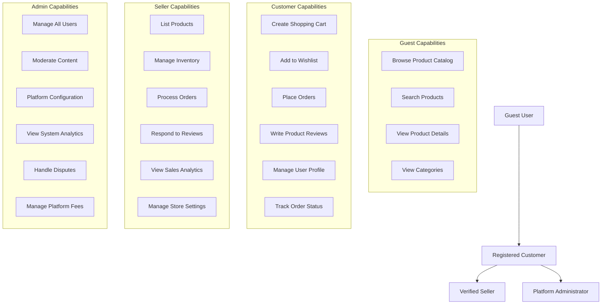

# User Roles and Authentication System Requirements

## Introduction

This document defines the comprehensive user role structure and authentication system for the shopping mall e-commerce platform. The platform operates as a multi-vendor marketplace where different user types interact with distinct capabilities and permissions. The authentication system must securely manage user identities while providing appropriate access controls based on user roles.

## Authentication System Requirements

### User Registration Process

**WHEN** a user registers for a new account, **THE** system **SHALL** collect the following mandatory information:
- Email address (must be unique and validated)
- Password (minimum 8 characters with uppercase, lowercase, number, and special character)
- First name and last name
- Phone number for order notifications

**WHERE** email verification is required, **THE** system **SHALL** send a verification link to the provided email address that expires within 24 hours.

**IF** email verification is not completed within 24 hours, **THEN** **THE** system **SHALL** automatically delete the pending registration and require restarting the process.

**WHEN** a user attempts to register with an existing email, **THE** system **SHALL** display error message: "This email address is already registered. Please use a different email or reset your password."

### User Login Process

**WHEN** a user attempts to login, **THE** system **SHALL** validate credentials against stored user data using secure password hashing algorithms.

**IF** login attempts exceed 5 failures within 15 minutes, **THEN** **THE** system **SHALL** temporarily lock the account for 30 minutes and notify the user via email.

**THE** system **SHALL** generate JWT tokens for authenticated sessions with the following specifications:
- Access token expiration: 15 minutes
- Refresh token expiration: 7 days
- Token payload includes userId, role, permissions array, and session metadata
- Token validation against cryptographic signature for all authenticated requests

### Password Management Requirements

**WHEN** a user requests password reset, **THE** system **SHALL**:
- Send reset instructions to the verified email address
- Generate a time-limited reset token valid for 1 hour
- Require password confirmation during reset process
- Invalidate all active sessions after password change
- Prevent reuse of recent passwords (last 5 passwords)

**THE** system **SHALL** enforce password complexity requirements:
- Minimum 8 characters length
- At least one uppercase letter
- At least one lowercase letter
- At least one number
- At least one special character (!@#$%^&*)
- No common passwords or dictionary words

### Multi-Factor Authentication

**WHEN** users enable multi-factor authentication, **THE** system **SHALL**:
- Require MFA for sensitive operations (password changes, payment updates)
- Support time-based one-time passwords (TOTP) via authenticator apps
- Provide backup codes for account recovery
- Allow trusted device registration for 30 days

**WHERE** high-risk activities are detected, **THE** system **SHALL** require additional authentication verification.

## User Role Hierarchy

### Role Definitions and Relationships

The platform supports four distinct user roles with hierarchical relationships:

### Detailed Role Specifications

#### Guest Role
- **Description**: Unauthenticated users who can browse products, view categories, and search the catalog
- **Authentication Status**: Not logged in, limited access
- **Default Permissions**: Read-only access to public content
- **Upgrade Path**: Can register to become Customer
- **Session Management**: Session-based cart, no persistent data

#### Customer Role
- **Description**: Registered users who can shop, manage profiles, place orders, and write reviews
- **Authentication Status**: Email-verified account with full shopping capabilities
- **Core Functions**: Complete shopping experience, order management, review system access
- **Upgrade Path**: Can apply to become Seller after meeting eligibility criteria
- **Data Access**: Own order history, personal information, payment methods

#### Seller Role
- **Description**: Verified vendors who can list products, manage inventory, and fulfill orders
- **Authentication Status**: Additional business verification and approval required
- **Business Functions**: Product management, inventory control, order fulfillment, customer communication
- **Relationship**: Inherits all Customer permissions plus seller-specific capabilities
- **Verification Requirements**: Business registration, tax identification, bank account verification

#### Admin Role
- **Description**: System administrators with full access to manage users, products, orders, and platform settings
- **Authentication Status**: Highest privilege level with multi-factor authentication requirement
- **Platform Management**: Complete system oversight, content moderation, financial management
- **Relationship**: Inherits all Customer and Seller permissions plus administrative capabilities
- **Access Control**: Granular permission system with audit logging

## Permission Matrix

### Comprehensive Capability Table

| Action | Guest | Customer | Seller | Admin |
|--------|-------|----------|--------|-------|
| Browse products | ✅ | ✅ | ✅ | ✅ |
| View product details | ✅ | ✅ | ✅ | ✅ |
| Search catalog | ✅ | ✅ | ✅ | ✅ |
| View categories | ✅ | ✅ | ✅ | ✅ |
| Register account | ✅ | ❌ | ❌ | ❌ |
| Login to account | ❌ | ✅ | ✅ | ✅ |
| Manage profile | ❌ | ✅ | ✅ | ✅ |
| Add to cart | ❌ | ✅ | ✅ | ✅ |
| Create wishlist | ❌ | ✅ | ✅ | ✅ |
| Place orders | ❌ | ✅ | ✅ | ✅ |
| Write reviews | ❌ | ✅ | ✅ | ✅ |
| Apply for seller account | ❌ | ✅ | ❌ | ❌ |
| List products | ❌ | ❌ | ✅ | ✅ |
| Manage inventory | ❌ | ❌ | ✅ | ✅ |
| Fulfill orders | ❌ | ❌ | ✅ | ✅ |
| View seller dashboard | ❌ | ❌ | ✅ | ✅ |
| Respond to reviews | ❌ | ❌ | ✅ | ✅ |
| Manage store settings | ❌ | ❌ | ✅ | ✅ |
| View sales analytics | ❌ | ❌ | ✅ | ✅ |
| Manage all users | ❌ | ❌ | ❌ | ✅ |
| Manage all products | ❌ | ❌ | ❌ | ✅ |
| Manage all orders | ❌ | ❌ | ❌ | ✅ |
| Access admin dashboard | ❌ | ❌ | ❌ | ✅ |
| Platform configuration | ❌ | ❌ | ❌ | ✅ |
| Content moderation | ❌ | ❌ | ❌ | ✅ |
| Financial management | ❌ | ❌ | ❌ | ✅ |
| System analytics | ❌ | ❌ | ❌ | ✅ |

### Role Transition Requirements

#### Customer to Seller Transition
**WHEN** a customer applies to become a seller, **THE** system **SHALL**:
- Require business verification information including:
  - Business name and registration details
  - Tax identification number
  - Business address and contact information
  - Bank account details for payouts
  - Business registration documents

**WHERE** business verification is required, **THE** system **SHALL**:
- Validate business registration authenticity
- Verify tax identification format
- Confirm bank account ownership
- Perform background checks if configured

**THE** system **SHALL** require admin approval for seller account activation with:
- Manual review of submitted documents
- Business legitimacy assessment
- Platform policy compliance verification
- Approval or rejection within 3 business days

**IF** seller application is approved, **THEN** **THE** system **SHALL**:
- Grant seller permissions while maintaining customer capabilities
- Create seller dashboard with default settings
- Provide onboarding guidance and resources
- Enable product listing capabilities

#### Admin Role Assignment
**THE** system **SHALL** restrict admin role assignment to existing administrators only.

**WHEN** assigning admin privileges, **THE** system **SHALL** require:
- Multi-factor authentication confirmation
- Approval from at least two existing administrators
- Security background check if configured
- Signed confidentiality agreement

**THE** system **SHALL** log all admin privilege changes for audit purposes including:
- Who assigned the privileges
- When the assignment occurred
- What specific permissions were granted
- Reason for privilege assignment

## Security Considerations

### Authentication Security

**Credential Protection Requirements:**
- **THE** system **SHALL** never store passwords in plain text
- **THE** system **SHALL** use industry-standard secure hashing algorithms (bcrypt, Argon2)
- **THE** system **SHALL** implement rate limiting for authentication attempts
- **THE** system **SHALL** enforce secure password policies
- **THE** system **SHALL** detect and prevent credential stuffing attacks

**Session Security Specifications:**
- **THE** system **SHALL** implement secure token transmission over HTTPS only
- **THE** system **SHALL** validate tokens for every authenticated request
- **THE** system **SHALL** implement token expiration and refresh mechanisms
- **THE** system **SHALL** provide logout functionality that immediately invalidates tokens
- **THE** system **SHALL** detect and prevent session hijacking attempts

### Authorization Security

**Role-Based Access Control:**
- **THE** system **SHALL** validate user role for every protected endpoint
- **THE** system **SHALL** implement permission checks at both route and data levels
- **THE** system **SHALL** prevent privilege escalation attacks
- **THE** system **SHALL** log authorization failures for security monitoring
- **THE** system **SHALL** implement principle of least privilege

**Data Access Controls:**
- **WHEN** a user accesses data, **THE** system **SHALL** verify ownership or appropriate permissions
- **THE** system **SHALL** prevent customers from accessing other customers' order history
- **THE** system **SHALL** restrict sellers to only manage their own products and orders
- **THE** system **SHALL** enforce data segregation between different sellers
- **THE** system **SHALL** implement row-level security for customer data

### Business Security Rules

**Financial Transaction Security:**
- **WHEN** processing payments, **THE** system **SHALL** validate user authentication and authorization
- **THE** system **SHALL** prevent guests from initiating payment transactions
- **THE** system **SHALL** verify customer identity for high-value transactions (>$500)
- **THE** system **SHALL** implement fraud detection mechanisms
- **THE** system **SHALL** require additional verification for suspicious transactions

**Content Moderation Security:**
- **WHEN** users submit reviews, **THE** system **SHALL** validate authentication and authorization
- **THE** system **SHALL** prevent sellers from reviewing their own products
- **THE** system **SHALL** implement review moderation workflows for inappropriate content
- **THE** system **SHALL** provide admin tools for content management
- **THE** system **SHALL** detect and prevent review manipulation

## Session Management

### Token Management Requirements

**JWT Token Structure:**
- **THE** system **SHALL** include the following claims in JWT tokens:
  - userId: unique user identifier
  - role: user role (customer, seller, admin)
  - permissions: array of granted permissions
  - exp: expiration timestamp
  - iat: issued at timestamp
  - sessionId: unique session identifier
  - deviceInfo: client device metadata

**Token Refresh Process:**
- **WHEN** access token expires, **THE** system **SHALL** allow refresh token usage to obtain new access token
- **THE** system **SHALL** validate refresh token against stored token database
- **IF** refresh token is compromised, **THEN** **THE** system **SHALL** revoke all tokens for that user
- **THE** system **SHALL** implement secure token rotation
- **THE** system **SHALL** limit refresh token reuse to prevent replay attacks

**Session State Management:**
- **THE** system **SHALL** maintain session state for authenticated users
- **THE** system **SHALL** support concurrent sessions across multiple devices (maximum 5 devices)
- **THE** system **SHALL** provide session management interface for users to view and terminate sessions
- **THE** system **SHALL** log session creation and termination events
- **THE** system **SHALL** implement session timeout after 30 minutes of inactivity

### Security Event Handling

**Authentication Events:**
- **THE** system **SHALL** log all successful and failed login attempts with:
  - Timestamp and IP address
  - User agent information
  - Geographic location data
  - Login outcome (success/failure)
- **THE** system **SHALL** notify users of suspicious login activity including:
  - Login from new devices
  - Login from unusual locations
  - Multiple failed login attempts
- **THE** system **SHALL** implement account lockout after 5 failed attempts within 15 minutes
- **THE** system **SHALL** provide password strength indicators during registration

**Authorization Events:**
- **THE** system **SHALL** log all authorization failures including:
  - Attempted access to unauthorized resources
  - Permission denied events
  - Role-based access violations
- **THE** system **SHALL** monitor for privilege escalation attempts
- **THE** system **SHALL** alert administrators of suspicious authorization patterns
- **THE** system **SHALL** implement role change approval workflows

## Integration Requirements

### User Profile Integration
- **THE** authentication system **SHALL** integrate with Customer Account Management for profile data
- **WHEN** users update profile information, **THE** system **SHALL** synchronize changes across all systems
- **THE** system **SHALL** maintain consistency between authentication data and profile data
- **THE** system **SHALL** provide single sign-on capabilities for integrated services

### Seller Platform Integration
- **THE** authentication system **SHALL** provide role-based access to Seller Platform features
- **WHEN** seller permissions are granted, **THE** system **SHALL** enable seller dashboard access
- **THE** system **SHALL** enforce seller-specific authorization rules
- **THE** system **SHALL** synchronize seller status across all platform components

### Admin Dashboard Integration
- **THE** authentication system **SHALL** secure access to Admin Dashboard functionality
- **WHEN** admin privileges are assigned, **THE** system **SHALL** enable full platform management capabilities
- **THE** system **SHALL** implement administrative action logging and audit trails
- **THE** system **SHALL** enforce multi-factor authentication for admin access

### Payment System Integration
- **THE** authentication system **SHALL** validate user authentication for payment transactions
- **WHEN** processing payments, **THE** system **SHALL** verify user identity and authorization
- **THE** system **SHALL** integrate with payment system for transaction security
- **THE** system **SHALL** maintain payment method ownership verification

## Performance Requirements

### Authentication Performance
- **THE** system **SHALL** process login requests within 2 seconds under normal load
- **THE** system **SHALL** validate tokens within 100 milliseconds
- **THE** system **SHALL** support concurrent authentication for 10,000+ users
- **THE** system **SHALL** handle peak login rates of 100 logins per second

### Session Management Performance
- **THE** system **SHALL** maintain session state with sub-50ms read access
- **THE** system **SHALL** scale to handle 100,000+ active sessions
- **THE** system **SHALL** implement efficient token validation algorithms
- **THE** system **SHALL** support distributed session storage

### System Availability
- **THE** authentication system **SHALL** maintain 99.9% uptime
- **THE** system **SHALL** implement redundancy and failover mechanisms
- **THE** system **SHALL** provide graceful degradation during high load
- **THE** system **SHALL** maintain data consistency across all authentication components

## Error Handling

### Authentication Errors
- **WHEN** authentication fails due to invalid credentials, **THEN** **THE** system **SHALL** return generic error message without revealing specific failure reason
- **WHEN** account is locked, **THEN** **THE** system **SHALL** inform user of lockout duration and recovery process
- **WHEN** token validation fails, **THEN** **THE** system **SHALL** return HTTP 401 status with appropriate error code
- **WHEN** system is unavailable, **THEN** **THE** system **SHALL** provide maintenance message and estimated recovery time

### Authorization Errors
- **WHEN** user lacks required permissions, **THEN** **THE** system **SHALL** return HTTP 403 status
- **WHEN** role-based access is denied, **THEN** **THE** system **SHALL** log the attempt for security monitoring
- **WHEN** permission check fails, **THEN** **THE** system **SHALL** provide clear error message indicating required privileges
- **WHEN** resource ownership validation fails, **THEN** **THE** system **SHALL** return appropriate authorization error

### System Integration Errors
- **WHEN** external service integration fails, **THEN** **THE** system **SHALL** implement graceful degradation
- **WHEN** data synchronization fails, **THEN** **THE** system **SHALL** queue requests for retry
- **WHEN** notification delivery fails, **THEN** **THE** system **SHALL** log these failures and provide manual notification options
- **WHEN** database connection fails, **THEN** **THE** system **SHALL** provide appropriate error handling and recovery procedures

## Business Rules Summary

### User Registration Rules
- Email verification is mandatory for all accounts
- Password strength requirements must be enforced
- Business verification is required for seller accounts
- Admin accounts require existing admin approval
- Account activation requires email confirmation

### Session Management Rules
- Access tokens expire after 15 minutes
- Refresh tokens expire after 7 days
- Users can have multiple concurrent sessions (maximum 5)
- Session termination is available from all devices
- Session timeout occurs after 30 minutes of inactivity

### Permission Enforcement Rules
- Role-based access control is enforced at all protected endpoints
- Data ownership is verified for customer-specific data
- Seller data segregation is strictly enforced
- Admin privileges are carefully controlled and monitored
- Principle of least privilege is applied to all permissions

### Security Compliance Rules
- All authentication must use HTTPS
- Password hashing must use industry-standard algorithms
- Session tokens must be securely stored and transmitted
- Audit logs must be maintained for all security events
- Regular security reviews must be conducted

This comprehensive user roles and authentication system provides the foundation for secure, scalable access control across the entire shopping mall platform, enabling the multi-vendor marketplace business model while maintaining appropriate security boundaries between different user types.

> *Developer Note: This document defines **business requirements only**. All technical implementations (architecture, APIs, database design, etc.) are at the discretion of the development team.*