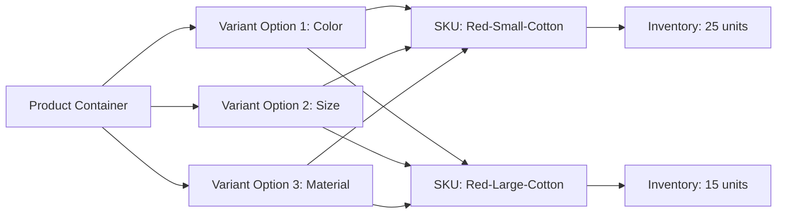

# Product Catalog System Documentation

## 1. Introduction

The product catalog system serves as the foundation of the shopping mall platform, providing comprehensive product management capabilities for sellers, browsing functionality for customers, and administrative oversight for platform administrators. This system enables multi-vendor product listings with advanced variant management, category organization, and powerful search capabilities.

## 2. Product Structure Definition

### 2.1 Core Product Entity

**Product Definition**: A product represents a sellable item that can be configured with multiple variants. Each product serves as a parent container for individual SKUs (Stock Keeping Units).

**Product Attributes**:
- Product ID (unique identifier)
- Product name (display name for customers)
- Product description (detailed information)
- Brand/manufacturer information
- Product images (multiple images per product)
- Product status (active/inactive/draft)
- Creation date and last updated timestamp
- Seller/Owner reference
- Product type (physical/digital/service)

### 2.2 Product Variant (SKU) Structure

**SKU Definition**: Each SKU represents a specific combination of product attributes (color, size, etc.) with its own inventory, pricing, and availability.

**Variant Attributes**:
- SKU code (unique identifier)
- Parent product reference
- Variant attributes (color, size, material, etc.)
- Price (current selling price)
- Compare-at price (original price for discount display)
- Cost price (for seller profit calculation)
- Stock quantity
- Stock status (in stock/out of stock/low stock)
- Weight and dimensions
- SKU-specific images
- Barcode/UPC information

### 2.3 Product-Variant Relationship

## 3. Category Management System

### 3.1 Category Hierarchy

**Category Structure**: THE system SHALL support hierarchical category organization with unlimited nesting levels.

**Category Attributes**:
- Category ID (unique identifier)
- Category name
- Category description
- Parent category reference
- Display order/position
- Category image/icon
- Status (active/inactive)
- SEO metadata (title, description, keywords)

### 3.2 Category Navigation

**Category Display**: WHEN customers browse the catalog, THE system SHALL display categories in a hierarchical tree structure.

**Breadcrumb Navigation**: THE system SHALL provide breadcrumb navigation showing the current category path.

**Category Assignment**: WHERE sellers create products, THE system SHALL allow assignment to one or more categories.

### 3.3 Category Business Rules

**Category Validation**: IF a category is marked as inactive, THEN THE system SHALL hide all products within that category from customer view.

**Product Count**: THE system SHALL display the number of products in each category for customer browsing.

**Category Reorganization**: WHILE administrators manage categories, THE system SHALL prevent circular references in the hierarchy.

## 4. Product Variant (SKU) Specifications

### 4.1 Variant Option Types

**Variant Definition**: THE system SHALL support multiple variant types including color, size, material, style, and custom options.

**Color Variants**:
- Color name (e.g., "Midnight Blue")
- Color value (hex code)
- Color swatch image

**Size Variants**:
- Size value (e.g., "S", "M", "L", "XL")
- Size description
- Size chart reference

**Custom Variants**: THE system SHALL allow sellers to define custom variant types based on product requirements.

### 4.2 Variant Combination Management

**SKU Generation**: WHEN sellers define variant options, THE system SHALL automatically generate all possible SKU combinations.

**Variant Matrix**: THE system SHALL provide a variant matrix interface for sellers to manage pricing and inventory across all SKU combinations.

**Default Variant**: THE system SHALL designate one SKU as the default variant for quick product display.

### 4.3 Variant Display Rules

**Variant Availability**: WHEN a customer views a product, THE system SHALL display only available variant combinations.

**Out of Stock Handling**: IF a specific SKU is out of stock, THEN THE system SHALL display it as unavailable but still show the variant option.

**Variant Selection**: THE system SHALL update product images and pricing dynamically when customers select different variants.

## 5. Search and Filtering Requirements

### 5.1 Search Functionality

**Global Search**: THE system SHALL provide a global search bar that searches across product names, descriptions, and SKU attributes.

**Search Results**: WHEN customers perform a search, THE system SHALL return relevant products ranked by relevance.

**Search Suggestions**: THE system SHALL provide autocomplete suggestions as customers type in the search bar.

### 5.2 Advanced Filtering

**Filter Categories**: THE system SHALL allow filtering by:
- Price range
- Brand/manufacturer
- Product ratings
- Availability (in stock/out of stock)
- Category
- Product attributes (color, size, etc.)

**Multi-select Filters**: THE system SHALL support multiple selection within filter options.

**Filter Persistence**: THE system SHALL maintain applied filters during customer browsing sessions.

### 5.3 Search Performance

**Search Speed**: THE system SHALL return search results instantly for common queries.

**Fuzzy Matching**: THE system SHALL support fuzzy matching for misspelled search terms.

**Synonym Support**: THE system SHALL recognize product synonyms and related terms in search queries.

## 6. Inventory Management Rules

### 6.1 Stock Tracking

**Real-time Inventory**: THE system SHALL track inventory quantities in real-time at the SKU level.

**Stock Updates**: WHEN orders are placed or cancelled, THE system SHALL immediately update inventory quantities.

**Low Stock Alerts**: IF inventory for any SKU falls below a predefined threshold, THEN THE system SHALL notify the seller.

### 6.2 Inventory Status

**Stock Status Calculation**: THE system SHALL automatically calculate stock status based on quantity:
- In Stock: Quantity > 0
- Low Stock: 0 < Quantity ≤ Low Stock Threshold
- Out of Stock: Quantity = 0

**Backorder Support**: WHERE sellers enable backordering, THE system SHALL allow customers to purchase out-of-stock items.

**Inventory History**: THE system SHALL maintain a complete history of inventory changes for auditing purposes.

### 6.3 Inventory Business Rules

**Negative Inventory Prevention**: THE system SHALL prevent overselling by validating inventory before order confirmation.

**Inventory Reservation**: WHEN customers add items to cart, THE system SHALL temporarily reserve inventory for a configurable time period.

**Batch Inventory Updates**: THE system SHALL allow sellers to update inventory for multiple SKUs simultaneously.

## 7. User Role Capabilities

### 7.1 Customer Permissions

**Product Browsing**: Customers SHALL browse all active products and categories.

**Search and Filter**: Customers SHALL use search functionality and apply filters to find products.

**Product Viewing**: Customers SHALL view product details, images, variants, and customer reviews.

**Wishlist Management**: Customers SHALL add products to their wishlist for future reference.

### 7.2 Seller Permissions

**Product Creation**: Sellers SHALL create new products with complete details and variant options.

**Product Management**: Sellers SHALL edit, update, and manage their own product listings.

**Inventory Control**: Sellers SHALL manage inventory quantities for all their SKUs.

**Product Status**: Sellers SHALL activate or deactivate their products as needed.

### 7.3 Admin Permissions

**Full Catalog Access**: Admins SHALL view and manage all products across all sellers.

**Category Management**: Admins SHALL create, edit, and organize the category hierarchy.

**Content Moderation**: Admins SHALL review and approve product listings before they go live.

**Bulk Operations**: Admins SHALL perform bulk operations on products and categories.

## 8. Business Rules and Validation

### 8.1 Product Validation Rules

**Required Fields**: WHEN creating products, THE system SHALL require:
- Product name
- Product description
- At least one category
- At least one price
- At least one image

**Price Validation**: THE system SHALL validate that selling price is not higher than compare-at price.

**Variant Consistency**: THE system SHALL ensure all variant combinations have consistent attribute sets.

### 8.2 Category Business Rules

**Category Assignment**: Each product SHALL be assigned to at least one category.

**Category Inheritance**: Products SHALL inherit visibility from parent categories.

**Category Limits**: THE system SHALL limit the maximum category depth to prevent performance issues.

### 8.3 Inventory Business Rules

**Stock Validation**: THE system SHALL prevent orders from being placed for out-of-stock items.

**Inventory Updates**: WHEN sellers update inventory, THE system SHALL validate that new quantities are non-negative.

**Concurrent Updates**: THE system SHALL handle concurrent inventory updates to prevent race conditions.

## 9. Performance Requirements

### 9.1 Response Time Expectations

**Product Listing**: THE system SHALL load product listing pages within 2 seconds.

**Search Results**: THE system SHALL return search results instantly for common queries.

**Product Details**: THE system SHALL load individual product pages within 1 second.

**Category Navigation**: THE system SHALL display category pages within 1.5 seconds.

### 9.2 Scalability Requirements

**Catalog Size**: THE system SHALL support catalogs with millions of products and variants.

**Concurrent Users**: THE system SHALL handle thousands of concurrent users browsing and searching.

**Search Performance**: THE system SHALL maintain fast search performance as the catalog grows.

## 10. Integration Points

### 10.1 Shopping Cart Integration

**Cart Updates**: WHEN products are added to cart, THE system SHALL validate availability and pricing.

**Inventory Reservation**: THE system SHALL temporarily reserve inventory for items in active shopping carts.

### 10.2 Order Management Integration

**Order Processing**: WHEN orders are placed, THE system SHALL update inventory quantities immediately.

**Order Cancellations**: WHEN orders are cancelled, THE system SHALL restore inventory quantities.

### 10.3 Review System Integration

**Review Display**: THE system SHALL display product reviews and ratings on product pages.

**Review Aggregation**: THE system SHALL calculate and display average ratings for products.

### 10.4 Seller Platform Integration

**Seller Dashboard**: THE system SHALL provide sellers with inventory management interfaces.

**Sales Reporting**: THE system SHALL integrate with seller sales reporting and analytics.

## Implementation Notes

This product catalog system forms the core of the e-commerce platform, enabling multi-vendor marketplaces with sophisticated product management capabilities. The system is designed to scale from small boutique stores to large marketplaces with millions of products.

Key success factors include:
- Robust variant management for complex product configurations
- Efficient search and filtering for large product catalogs
- Real-time inventory tracking to prevent overselling
- Flexible category organization for diverse product types
- Comprehensive permission system for multi-vendor operations

The catalog system integrates seamlessly with shopping cart, order management, payment processing, and seller management systems to provide a complete e-commerce solution.

> *Developer Note: This document defines **business requirements only**. All technical implementations (architecture, APIs, database design, etc.) are at the discretion of the development team.*