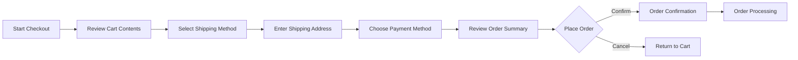

# Customer Journey Documentation - E-commerce Shopping Mall Platform

## Introduction

This document outlines the complete customer journey for the shopping mall platform, mapping every interaction from initial discovery through purchase and post-purchase support. The journey is designed to provide a seamless shopping experience while maximizing conversion rates and customer satisfaction.

## Customer Registration and Onboarding Process

### Guest Experience

**Guest Browsing Flow:**
WHEN a guest user visits the platform, THE system SHALL allow them to browse products without registration.
WHEN a guest user attempts to add items to their cart, THE system SHALL create a temporary guest cart.
WHILE browsing as a guest, THE system SHALL display registration prompts at strategic points to encourage account creation.

**Registration Triggers:**
WHEN a guest user attempts to proceed to checkout, THE system SHALL require account registration.
WHEN a guest user attempts to save items to a wishlist, THE system SHALL require account registration.
WHEN a guest user attempts to view order history, THE system SHALL require account registration.

### Account Creation Process

**Registration Options:**
THE system SHALL provide multiple registration methods:
- Email and password registration
- Social media integration (Google, Facebook, Apple)
- Single sign-on options

**Registration Requirements:**
WHEN a user registers with email, THE system SHALL require:
- Valid email address format
- Password with minimum 8 characters including uppercase, lowercase, and numbers
- Acceptance of terms of service and privacy policy

**Email Verification:**
WHEN a user completes registration, THE system SHALL send a verification email.
IF the user does not verify their email within 24 hours, THEN THE system SHALL send a reminder email.
WHERE email verification is required, THE system SHALL restrict certain features until verification is complete.

### Onboarding Experience

**Welcome Flow:**
WHEN a new user completes registration, THE system SHALL present an onboarding tutorial.
THE onboarding tutorial SHALL include:
- Platform navigation basics
- How to search for products
- How to use shopping cart
- How to track orders
- Personalization preferences setup

**Personalization Setup:**
THE system SHALL prompt new users to set preferences for:
- Product categories of interest
- Price range preferences
- Brand preferences
- Communication preferences (email notifications, promotions)

## Product Discovery and Browsing Experience

### Initial Landing Experience

**Homepage Personalization:**
WHEN a registered user visits the homepage, THE system SHALL display personalized recommendations based on:
- Previous browsing history
- Purchase history
- Saved preferences
- Popular products in their demographic

**Guest Homepage:**
WHEN a guest user visits the homepage, THE system SHALL display:
- Featured products
- Current promotions and sales
- Popular categories
- Seasonal collections

### Search and Discovery

**Search Functionality:**
THE system SHALL provide a prominent search bar with autocomplete suggestions.
WHEN a user enters search terms, THE system SHALL display relevant products with:
- Product images
- Prices
- Ratings and reviews
- Stock availability

**Advanced Search Filters:**
THE system SHALL provide filtering options by:
- Price range
- Brand
- Category
- Customer ratings
- Availability (in stock/out of stock)
- Special features (sale items, new arrivals)

**Product Discovery Methods:**
THE system SHALL provide multiple discovery paths:
- Category browsing
- Brand stores
- Personalized recommendations
- Trending products
- Recently viewed items
- Similar product suggestions

### Product Detail Experience

**Product Page Requirements:**
WHEN a customer views a product, THE system SHALL display:
- High-quality product images with zoom capability
- Product title and description
- Price and availability status
- Customer ratings and reviews
- Product specifications and details
- Shipping information and delivery estimates
- Return policy information

**Customer Decision Support:**
THE system SHALL provide tools to aid purchase decisions:
- Customer reviews and ratings
- Q&A section for product questions
- Product comparison feature
- "Customers also bought" suggestions
- Stock level indicators for high-demand items

## Shopping Cart Management Flow

### Cart Operations

**Adding Items to Cart:**
WHEN a customer adds an item to their cart, THE system SHALL:
- Confirm the addition with visual feedback
- Update cart icon with item count
- Show product options (size, color, quantity) if applicable
- Display any applicable promotions or discounts

**Cart Management Features:**
THE system SHALL allow customers to:
- Adjust quantities of items in cart
- Remove items from cart
- Save items for later purchase
- Apply promotion codes
- View estimated total including taxes and shipping

**Cart Persistence:**
WHILE a customer is logged in, THE system SHALL maintain their cart across sessions.
WHEN a guest user registers or logs in, THE system SHALL merge their guest cart with their account cart.

### Cart Abandonment Prevention

**Cart Recovery Features:**
IF a customer leaves items in their cart for more than 1 hour, THEN THE system SHALL send an email reminder.
WHERE items are in limited stock, THE system SHALL display low stock warnings in the cart.

## Checkout and Payment Processing Journey

### Checkout Process Steps

### Shipping Information

**Address Management:**
THE system SHALL allow customers to:
- Save multiple shipping addresses
- Set default shipping address
- Validate address accuracy
- Select shipping preferences

**Shipping Options:**
THE system SHALL provide multiple shipping methods:
- Standard shipping (3-5 business days)
- Express shipping (1-2 business days)
- Overnight shipping
- Store pickup (where available)

### Payment Processing

**Payment Methods:**
THE system SHALL support:
- Credit/debit cards (Visa, MasterCard, American Express)
- Digital wallets (Apple Pay, Google Pay, PayPal)
- Bank transfers
- Gift cards and store credit

**Payment Security:**
THE system SHALL implement secure payment processing with:
- PCI DSS compliance
- Tokenization of payment information
- 3D Secure authentication where available
- Fraud detection and prevention measures

### Order Review and Confirmation

**Final Review:**
BEFORE order submission, THE system SHALL display:
- Complete order summary
- Itemized pricing (products, shipping, taxes, discounts)
- Estimated delivery date
- Shipping address
- Payment method

**Order Confirmation:**
WHEN an order is successfully placed, THE system SHALL:
- Display order confirmation page with order number
- Send confirmation email with order details
- Update order status to "processing"
- Begin order fulfillment process

## Order Tracking and Purchase History

### Order Status Tracking

**Real-time Order Updates:**
THE system SHALL provide order status updates including:
- Order received
- Payment processed
- Order shipped
- Out for delivery
- Delivered

**Tracking Integration:**
WHERE shipping carriers provide tracking, THE system SHALL integrate tracking information.
WHEN an order ships, THE system SHALL send tracking information to the customer.

### Purchase History Management

**Order History Features:**
THE system SHALL maintain complete order history for each customer including:
- Order date and time
- Items purchased with quantities and prices
- Order status and tracking information
- Invoice and receipt access

**Reorder Functionality:**
THE system SHALL provide one-click reorder for previous purchases.
WHEN viewing previous orders, THE system SHALL show product availability for reordering.

### Returns and Exchanges

**Return Policy:**
THE system SHALL provide clear return policy information.
WHEN eligible for return, THE system SHALL allow customers to:
- Initiate return requests
- Print return labels
- Track return status
- Receive refunds or exchanges

**Return Processing:**
WHEN a return is initiated, THE system SHALL:
- Generate return authorization
- Provide return instructions
- Update return status as items are received
- Process refunds within specified timeframe

## Customer Support and Post-Purchase Experience

### Support Access Points

**Multiple Support Channels:**
THE system SHALL provide customer support through:
- In-platform messaging system
- Email support
- Phone support (during business hours)
- Live chat (during business hours)
- Self-service knowledge base

**Context-Aware Support:**
WHEN accessing support from an order page, THE system SHALL pre-populate order information.
WHEN accessing support from a product page, THE system SHALL include product context.

### Issue Resolution Process

**Support Ticket Management:**
THE system SHALL allow customers to:
- Create support tickets with detailed descriptions
- Upload supporting documents or images
- Track ticket status
- Receive updates via email or platform notifications

**Escalation Process:**
WHERE issues are not resolved within 24 hours, THE system SHALL escalate to higher support tiers.
IF an issue requires specialized attention, THEN THE system SHALL route to appropriate department.

### Customer Feedback Collection

**Review System:**
AFTER order delivery, THE system SHALL prompt customers to:
- Rate products purchased
- Write detailed reviews
- Rate overall shopping experience
- Provide seller feedback (where applicable)

**Feedback Integration:**
THE system SHALL use customer feedback to:
- Improve product recommendations
- Identify platform improvement areas
- Recognize high-performing sellers
- Address common customer concerns

## Customer Retention and Loyalty Journey

### Personalized Communication

**Post-Purchase Engagement:**
THE system SHALL implement post-purchase communication including:
- Delivery confirmation and satisfaction check
- Product usage tips and suggestions
- Cross-sell recommendations based on purchase history
- Replenishment reminders for consumable products

**Personalized Marketing:**
BASED on customer preferences and purchase history, THE system SHALL send:
- Personalized product recommendations
- Targeted promotions and discounts
- Birthday and anniversary offers
- Early access to sales and new arrivals

### Loyalty Program

**Rewards System:**
THE system SHALL implement a customer loyalty program with:
- Points earned on purchases
- Tiered membership levels
- Exclusive member benefits
- Birthday rewards and special occasion offers

**Loyalty Benefits:**
WHERE customers reach loyalty tiers, THE system SHALL provide:
- Free shipping thresholds
- Early access to sales
- Exclusive member-only products
- Special discounts and offers

### Account Management

**Profile Management:**
THE system SHALL allow customers to manage:
- Personal information and preferences
- Communication settings
- Payment methods
- Shipping addresses
- Wish lists and saved items

**Privacy Controls:**
THE system SHALL provide privacy controls for:
- Data sharing preferences
- Marketing communication opt-outs
- Account deletion requests
- Data export capabilities

## Customer Journey Analytics and Optimization

### Key Performance Indicators

**Conversion Metrics:**
THE system SHALL track:
- Visitor to registered user conversion rate
- Cart addition to purchase conversion rate
- Customer lifetime value
- Repeat purchase rate

**Customer Satisfaction Metrics:**
THE system SHALL monitor:
- Customer satisfaction scores
- Net promoter score
- Customer effort score
- Issue resolution time

### Continuous Improvement

**Journey Optimization:**
THE system SHALL use analytics to identify:
- Drop-off points in customer journey
- Friction points in checkout process
- Popular product discovery paths
- Effective personalization strategies

**A/B Testing:**
THE system SHALL support A/B testing for:
- Landing page layouts
- Checkout flow variations
- Product recommendation algorithms
- Communication timing and content

## Success Criteria

### Customer Experience Goals

**Ease of Use:**
THE platform SHALL achieve a System Usability Scale (SUS) score of 80 or higher.
THE checkout process SHALL be completable within 3 minutes for returning customers.

**Customer Satisfaction:**
THE platform SHALL maintain a customer satisfaction score of 4.0/5.0 or higher.
THE system SHALL resolve 90% of customer support issues within 24 hours.

**Business Metrics:**
THE platform SHALL achieve:
- 25% conversion rate from cart addition to purchase
- 40% repeat customer rate within 6 months
- 15% increase in average order value through personalized recommendations

This comprehensive customer journey documentation provides UX designers and product managers with complete visibility into the customer experience from initial discovery through long-term relationship management. The journey is designed to be intuitive, efficient, and engaging while supporting business growth through customer satisfaction and retention.

> *Developer Note: This document defines **business requirements only**. All technical implementations (architecture, APIs, database design, etc.) are at the discretion of the development team.*