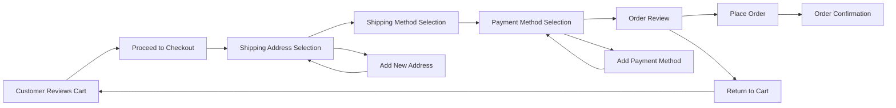
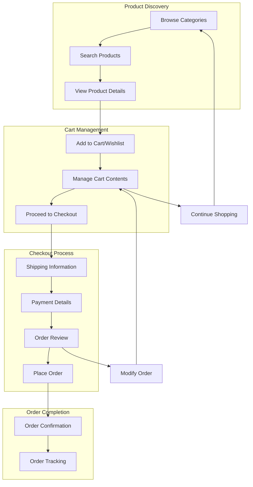

# Shopping Flow Requirements Analysis

## 1. Introduction and Overview

This document defines the complete shopping flow requirements for the shopping mall e-commerce platform. The shopping flow encompasses the entire customer journey from product discovery through cart management, wishlist functionality, order placement, payment processing, and order validation.

### Business Context
The shopping flow represents the core revenue-generating process of the e-commerce platform, directly impacting customer conversion rates, user experience satisfaction, and business profitability. A seamless, intuitive shopping journey is critical for customer retention and repeat business.

### Key Stakeholders
- **Customers**: Primary users who browse, shop, and complete purchases
- **Sellers**: Provide products and fulfill orders
- **Administrators**: Monitor transactions and ensure system integrity
- **Payment Providers**: Process financial transactions securely

## 2. Shopping Cart Management System

### Cart Creation and Persistence

WHEN a customer adds their first product to the cart, THE system SHALL create a new shopping cart session.
WHERE a customer is logged in, THE system SHALL persist the cart across browser sessions and devices.
WHERE a customer is not logged in, THE system SHALL maintain the cart for the duration of the browser session.

### Product Addition Workflow

WHEN a customer clicks "Add to Cart" on a product page, THE system SHALL validate product availability.
IF the product is out of stock, THEN THE system SHALL display an appropriate error message and prevent addition to cart.
WHERE the product has variants (size, color, etc.), THE system SHALL require variant selection before adding to cart.

### Cart Item Management

THE system SHALL allow customers to modify quantities of items in their cart.
WHEN a customer updates item quantity, THE system SHALL recalculate the total price immediately.
WHEN a customer removes an item from the cart, THE system SHALL remove it immediately and update the total.

### Price Calculation Rules

THE system SHALL calculate subtotal as the sum of (item price × quantity) for all items in cart.
THE system SHALL apply applicable taxes based on the shipping address.
THE system SHALL apply any valid discount codes or promotions.
THE system SHALL display the final total including all charges.

### Cart Session Management

WHILE a cart is active, THE system SHALL check inventory availability every 30 minutes.
IF an item becomes unavailable while in cart, THEN THE system SHALL notify the customer and remove the item.
THE system SHALL maintain cart contents for 30 days for logged-in customers.
THE system SHALL maintain cart contents for 7 days for guest customers.

## 3. Wishlist Functionality

### Wishlist Creation and Management

WHEN a customer clicks "Add to Wishlist" on a product page, THE system SHALL add the product to their wishlist.
THE system SHALL allow customers to create multiple named wishlists.
THE system SHALL allow customers to move items between wishlists.

### Wishlist Organization

THE system SHALL provide sorting options for wishlist items (by date added, price, popularity).
THE system SHALL allow customers to add notes to wishlist items.
THE system SHALL support wishlist sharing via generated links.

### Wishlist to Cart Conversion

WHEN a customer selects "Add All to Cart" from a wishlist, THE system SHALL add all available items to the cart.
IF any items in the wishlist are out of stock, THEN THE system SHALL skip those items and notify the customer.
THE system SHALL preserve wishlist items after they are moved to cart.

## 4. Order Placement Process

### Order Creation Workflow

### Customer Information Collection

WHEN a customer proceeds to checkout, THE system SHALL require shipping address information.
WHERE the customer has saved addresses, THE system SHALL allow selection from existing addresses.
THE system SHALL validate address format and serviceability before proceeding.

### Shipping Method Selection

THE system SHALL display available shipping options based on the shipping address.
THE system SHALL calculate shipping costs in real-time based on cart contents and destination.
THE system SHALL display estimated delivery dates for each shipping method.

### Payment Method Selection

THE system SHALL support multiple payment methods including credit cards, debit cards, and digital wallets.
WHERE the customer has saved payment methods, THE system SHALL allow selection from existing methods.
THE system SHALL allow adding new payment methods during checkout.

### Order Finalization

WHEN a customer clicks "Place Order", THE system SHALL perform final validation of all order details.
THE system SHALL reserve inventory for all items in the order.
THE system SHALL generate a unique order number for tracking.
THE system SHALL send order confirmation email to the customer.

## 5. Payment Integration Requirements

### Payment Gateway Integration

THE system SHALL integrate with at least one major payment gateway (Stripe, PayPal, etc.).
THE system SHALL encrypt all payment information during transmission.
THE system SHALL never store full credit card numbers on the platform.

### Multiple Payment Method Support

THE system SHALL support credit card payments with real-time validation.
THE system SHALL support digital wallet payments (Apple Pay, Google Pay).
THE system SHALL support alternative payment methods as configured.

### Transaction Security

WHILE processing payments, THE system SHALL comply with PCI DSS requirements.
THE system SHALL implement 3D Secure authentication for card payments where required.
THE system SHALL validate payment details before submitting to the gateway.

### Payment Status Tracking

THE system SHALL track payment status for each order (pending, processing, completed, failed).
WHEN a payment fails, THE system SHALL provide clear error messages to the customer.
THE system SHALL allow retry of failed payments with updated payment information.

## 6. Order Validation Rules

### Inventory Validation

WHEN creating an order, THE system SHALL verify inventory availability for each SKU.
IF any SKU becomes unavailable during checkout, THEN THE system SHALL notify the customer and remove the item.
THE system SHALL prevent overselling by reserving inventory during the checkout process.

### Price Consistency Checks

THE system SHALL validate that prices have not changed between cart and checkout.
IF prices have changed, THEN THE system SHALL notify the customer and require confirmation.
THE system SHALL honor the price at which the customer added the item to their cart.

### Customer Eligibility Verification

THE system SHALL verify customer account status before order placement.
THE system SHALL check for any account restrictions or limitations.
THE system SHALL validate shipping address against service restrictions.

### Shipping Feasibility Validation

THE system SHALL verify that items can be shipped to the selected address.
THE system SHALL check for shipping restrictions based on product type or destination.
THE system SHALL validate that all items in the order can be shipped together.

## 7. User Journey Flows

### Complete Shopping Journey

### Error Scenarios and Recovery

WHEN inventory validation fails during checkout, THE system SHALL allow the customer to remove unavailable items and continue.
WHEN payment processing fails, THE system SHALL preserve the order and allow retry with different payment method.
WHEN address validation fails, THE system SHALL provide specific guidance for correction.

### Alternative Paths and Edge Cases

WHERE a customer abandons their cart, THE system SHALL send cart reminder emails after 24 hours.
WHERE items in cart change price, THE system SHALL maintain the original price for 24 hours.
WHERE a customer logs in with items in guest cart, THE system SHALL merge carts.

## 8. Business Requirements

### Core Business Logic

THE system SHALL calculate applicable sales tax based on shipping address jurisdiction.
THE system SHALL apply promotions and discounts according to business rules.
THE system SHALL enforce minimum order amounts if configured.
THE system SHALL support multiple currencies if international shipping is enabled.

### Performance Requirements

WHEN adding items to cart, THE system SHALL respond within 500 milliseconds.
WHEN loading the cart page, THE system SHALL display contents within 2 seconds.
WHEN processing checkout, THE system SHALL complete within 5 seconds.
THE system SHALL support concurrent shopping sessions for 10,000+ simultaneous users.

### Success Criteria

THE shopping cart abandonment rate SHALL be less than 70%.
THE checkout completion rate SHALL be greater than 25%.
THE system SHALL process 99.9% of payments successfully on first attempt.
THE order confirmation email SHALL be delivered within 60 seconds of order placement.

### Security Requirements

THE system SHALL prevent cross-user cart access through proper session isolation.
THE system SHALL implement CSRF protection for all cart modification actions.
THE system SHALL validate all user inputs to prevent injection attacks.
THE system SHALL log all cart and order activities for security auditing.

> *Developer Note: This document defines **business requirements only**. All technical implementations (architecture, APIs, database design, etc.) are at the discretion of the development team.*