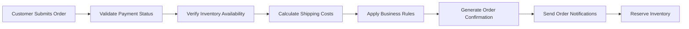
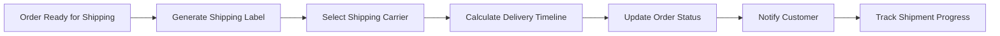
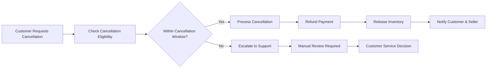

# Order Management System Specification

## Introduction and Business Context

### Order Management System Overview
The Order Management System serves as the central nervous system of the shopping mall platform, orchestrating the complete lifecycle of customer orders from placement through delivery and post-purchase support. This system enables multi-vendor order fulfillment while providing customers with transparent tracking and reliable service.

### Business Objectives and Value Proposition
- **Customer Trust**: Provide real-time order visibility to build customer confidence
- **Operational Efficiency**: Streamline order processing across multiple sellers
- **Scalability**: Support high-volume order processing during peak periods
- **Customer Retention**: Enable seamless order management and issue resolution

### System Scope and Boundaries
The order management system handles:
- Order creation and validation
- Payment verification and confirmation
- Shipping carrier integration
- Real-time order tracking
- Customer service workflows
- Multi-seller coordination

**Excluded from scope**: Payment gateway implementation details, inventory management backend, seller product listing interfaces

## Order Processing Workflow

### Order Creation and Validation

**Business Requirements:**
- WHEN a customer completes payment, THE system SHALL validate that all ordered items are available in inventory
- THE system SHALL calculate shipping costs based on delivery address, package weight, and seller location
- WHERE items are from multiple sellers, THE system SHALL create separate order records per seller
- IF inventory becomes unavailable during order processing, THEN THE system SHALL notify the customer and provide alternatives

### Payment Verification Process
- WHEN payment authorization is received, THE system SHALL confirm payment details match order total
- IF payment verification fails, THEN THE system SHALL place the order in pending payment status
- THE system SHALL retry payment verification up to 3 times before marking as failed
- WHERE payment requires additional verification, THE system SHALL notify the customer

### Order Confirmation and Notification
- WHEN payment verification succeeds, THE system SHALL generate order confirmation immediately
- THE system SHALL send order confirmation email to customer within 60 seconds of successful payment
- WHERE order contains items from multiple sellers, THE system SHALL create separate order records for each seller
- THE system SHALL notify sellers of new orders within 5 minutes of order confirmation
- THE system SHALL include order summary, estimated delivery date, and tracking information in notifications

### Inventory Allocation and Reservation
- WHEN order is confirmed, THE system SHALL reserve inventory for all items in the order
- THE system SHALL prevent overselling by validating inventory before order confirmation
- WHERE inventory levels drop below threshold, THE system SHALL notify sellers immediately
- IF inventory becomes unavailable after reservation, THEN THE system SHALL notify customer and offer alternatives

## Shipping and Delivery Management

### Shipping Carrier Integration Requirements

**Shipping Integration Specifications:**
- THE system SHALL integrate with major shipping carriers (FedEx, UPS, DHL, local postal services)
- WHEN a seller marks an order as shipped, THE system SHALL generate shipping labels automatically
- THE system SHALL calculate estimated delivery dates based on carrier service levels and distance
- WHERE real-time tracking is available, THE system SHALL display tracking information to customers

### Shipping Status Lifecycle
| Status | Description | Business Rules |
|--------|-------------|----------------|
| Processing | Order being prepared for shipping | Seller has 24 hours to ship |
| Shipped | Package dispatched with carrier | Tracking number required |
| In Transit | Package moving through carrier network | Regular status updates expected |
| Out for Delivery | Package on final delivery vehicle | Delivery expected same day |
| Delivered | Package successfully delivered | Customer confirmation required |
| Delivery Exception | Issues preventing delivery | Customer notification required |

### Delivery Address Management
- WHEN customer provides delivery address, THE system SHALL validate against postal service databases
- IF address validation fails, THEN THE system SHALL prompt customer for correction during checkout
- THE system SHALL support multiple delivery addresses per customer profile
- WHERE delivery restrictions apply, THE system SHALL notify customer during checkout

### Shipping Cost Calculation Rules
- THE system SHALL calculate shipping costs based on package weight and dimensions
- WHEN multiple items from same seller, THE system SHALL combine shipping when possible
- THE system SHALL apply seller-specific shipping rules and rates
- WHERE free shipping thresholds are met, THE system SHALL apply free shipping automatically

## Order Tracking System

### Real-time Tracking Integration
- THE system SHALL integrate with carrier APIs to fetch real-time tracking updates
- WHEN tracking status changes, THE system SHALL update order status automatically
- THE system SHALL display tracking information in customer dashboard
- WHERE carrier provides location updates, THE system SHALL show package location on map

### Status Update Notifications
- THE system SHALL send email notifications for major status changes (shipped, out for delivery, delivered)
- WHEN delivery is delayed, THE system SHALL notify customer with revised delivery estimate
- THE system SHALL provide push notifications for mobile app users
- WHERE delivery requires signature, THE system SHALL notify customer in advance

### Estimated Delivery Time Calculations
- THE system SHALL calculate estimated delivery dates based on:
  - Order processing time (seller dependent)
  - Carrier transit time
  - Destination location
  - Service level selected
- WHEN delivery estimates change, THE system SHALL update customer expectations
- THE system SHALL account for weekends and holidays in delivery calculations

### Exception Handling for Delayed Shipments
- IF package tracking shows no movement for 48 hours, THEN THE system SHALL flag for review
- WHEN delivery is significantly delayed, THEN THE system SHALL initiate customer service workflow
- THE system SHALL provide escalation path for lost or stuck packages
- WHERE carrier fails to deliver, THE system SHALL coordinate with seller for resolution

## Customer Service Integration

### Order Cancellation Workflow

**Cancellation Business Rules:**
- Customers may cancel orders within 1 hour of placement without penalty
- AFTER order enters processing status, cancellation requires seller approval
- WHEN cancellation is approved, THE system SHALL process refund within 24 hours
- WHERE order contains digital goods, cancellation rules may differ

### Refund Request Processing
- THE system SHALL support partial and full refund requests
- WHEN customer requests refund, THE system SHALL validate eligibility based on:
  - Time since delivery
  - Product condition
  - Seller return policy
  - Reason for return
- THE system SHALL provide refund status tracking to customers
- WHERE refund is approved, THE system SHALL process payment reversal within 3 business days

### Customer Support Ticket Management
- THE system SHALL create support tickets for order-related issues
- WHEN customer submits support request, THE system SHALL assign priority based on:
  - Order status
  - Time sensitivity
  - Customer history
  - Issue severity
- THE system SHALL provide communication history for each support case
- WHERE resolution requires seller input, THE system SHALL notify seller automatically

### Return and Exchange Procedures
- THE system SHALL generate return labels for approved returns
- WHEN return is received, THE system SHALL:
  - Verify product condition
  - Process refund or exchange
  - Update inventory records
  - Notify customer of completion
- THE system SHALL track return shipping and provide updates to customer
- WHERE exchange is requested, THE system SHALL reserve replacement inventory

## User Role Interactions

### Customer Order Management Capabilities
**Customers SHALL be able to:**
- View order history with search and filter options
- Track current orders with real-time status
- Cancel eligible orders before shipment
- Request returns and refunds
- Download order invoices and receipts
- Update delivery address for unshipped orders
- Contact seller directly for order-specific questions
- Rate and review products after delivery

### Seller Order Fulfillment Responsibilities
**Sellers SHALL be able to:**
- View and manage incoming orders
- Update order status throughout fulfillment process
- Print shipping labels and packing slips
- Mark orders as shipped with tracking information
- Process cancellations and refund requests
- Communicate with customers about order issues
- View order analytics and fulfillment metrics
- Set order processing time expectations

### Admin Order Oversight Functions
**Administrators SHALL be able to:**
- View all orders across the platform
- Monitor order fulfillment performance
- Resolve disputes between customers and sellers
- Generate order analytics and reports
- Configure system-wide order policies
- Manage shipping carrier integrations
- Oversee refund and cancellation processes
- Access order audit logs

## Business Rules and Validation

### Order Status Transition Rules
| Current Status | Allowed Next Status | Conditions |
|----------------|---------------------|------------|
| Pending Payment | Processing | Payment verified |
| Processing | Shipped | Seller marks as shipped |
| Shipped | In Transit | Carrier scan received |
| In Transit | Out for Delivery | Local facility scan |
| Out for Delivery | Delivered | Delivery confirmation |
| Any Status | Cancelled | Within cancellation window or admin override |

### Cancellation Eligibility Criteria
- Orders may be cancelled within 1 hour of placement without restriction
- AFTER 1 hour, cancellation requires seller approval
- Orders already shipped cannot be cancelled
- Digital product orders have different cancellation rules
- Subscription orders follow recurring billing cancellation policies

### Refund Approval Workflows
**Automatic Refund Approval:**
- Orders cancelled within 1 hour
- Products not shipped within promised timeframe
- System errors or duplicate charges

**Manual Refund Approval Required:**
- Products returned after delivery
- Partial order cancellations
- Discretionary refund requests
- High-value item returns

### Shipping Validation Rules
- Delivery addresses must be validated against postal databases
- Shipping costs must be calculated before order confirmation
- Package dimensions must be within carrier limits
- Restricted items must be identified before shipping
- International shipping must comply with customs regulations

## Performance and Reliability Requirements

### System Availability Expectations
- THE order management system SHALL maintain 99.9% uptime during business hours
- WHEN system maintenance is required, THE system SHALL provide 24-hour advance notice
- THE system SHALL handle peak load of 1,000 concurrent orders during holiday seasons
- WHERE system components fail, THE system SHALL provide graceful degradation

### Response Time Requirements
- Order status updates SHALL be processed within 5 seconds
- Order search and filtering SHALL return results within 2 seconds
- Order confirmation emails SHALL be sent within 30 seconds of payment
- Real-time tracking updates SHALL refresh within 10 seconds

### Data Accuracy Standards
- Order records SHALL maintain 100% data integrity
- Inventory reservations SHALL be accurate within 1 unit
- Shipping cost calculations SHALL be accurate within $0.01
- Order status updates SHALL reflect actual carrier status within 15 minutes

### Error Handling Scenarios
**Common Error Scenarios and Business Rules:**
- IF payment processing fails during order creation, THEN THE system SHALL retain cart contents and prompt retry
- WHEN inventory becomes unavailable after order placement, THEN THE system SHALL notify customer and offer alternatives
- IF shipping carrier API is unavailable, THEN THE system SHALL queue tracking updates and retry periodically
- WHERE order data corruption occurs, THEN THE system SHALL restore from backup and notify administrators
- WHEN duplicate orders are detected, THEN THE system SHALL flag for review and prevent duplicate processing

### Order Data Retention and Archiving
- THE system SHALL maintain order records for 7 years for tax and compliance purposes
- WHEN orders are older than 1 year, THE system SHALL archive them to cold storage
- THE system SHALL provide data export capabilities for business reporting
- WHERE legal hold applies, THE system SHALL prevent order data deletion

### Security and Compliance Requirements
- THE system SHALL comply with PCI DSS for payment data handling
- WHEN handling customer data, THE system SHALL follow GDPR and privacy regulations
- Order records SHALL be encrypted at rest and in transit
- Access to order management functions SHALL be role-based with audit logging

### Integration Points with Other Systems
- Payment System: Order confirmation triggers payment capture
- Inventory Management: Order creation reserves inventory
- Customer Account: Order history linked to customer profiles
- Seller Platform: Order notifications sent to sellers
- Admin Dashboard: Order analytics and reporting
- Shipping Carriers: Real-time tracking integration

### Success Metrics and KPIs
- Order fulfillment rate: Target > 98%
- Average order processing time: Target < 2 hours
- On-time delivery rate: Target > 95%
- Customer satisfaction score: Target > 4.5/5
- Order accuracy rate: Target 99.9%
- Refund processing time: Target < 48 hours

This order management system specification provides comprehensive business requirements for backend developers to implement a robust, scalable e-commerce order processing platform that meets customer expectations while supporting multi-vendor operations efficiently.

> *Developer Note: This document defines **business requirements only**. All technical implementations (architecture, APIs, database design, etc.) are at the discretion of the development team.*