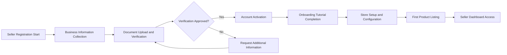
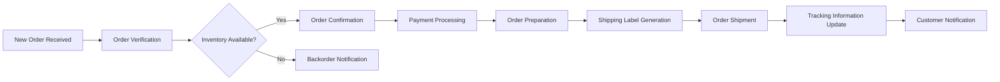

# Seller Operations Requirements and Workflows

## Executive Summary

This document defines the comprehensive seller operations ecosystem for the e-commerce platform, outlining the complete lifecycle from seller registration through daily business management, order fulfillment, and performance analytics. The platform provides sellers with robust tools to manage their storefronts, inventory, orders, and customer relationships while ensuring operational efficiency and business growth.

## Seller Registration and Onboarding

### Seller Account Creation
WHEN a business owner applies to become a seller, THE system SHALL provide a comprehensive registration form requiring business verification information.

**Registration Requirements:**
- Business legal name and registration number
- Tax identification information
- Business address and contact details
- Bank account information for payouts
- Business owner identification verification
- Business category and product types

**Verification Process:**
WHILE the seller registration is pending verification, THE system SHALL collect all required documentation and perform background checks.
WHEN verification is complete, THE system SHALL notify the seller of their account status.
IF verification fails, THEN THE system SHALL provide specific reasons and allow for resubmission with corrections.

### Onboarding Workflow

### Store Setup Requirements
THE seller SHALL configure their storefront with:
- Store name and branding
- Business description and story
- Contact information and support hours
- Shipping policies and return policies
- Payment and payout preferences
- Tax configuration settings

## Product Listing and Inventory Management

### Product Creation and Management
WHEN a seller creates a new product listing, THE system SHALL provide comprehensive product information fields including:
- Product title and description
- Product images and media gallery
- Product categorization and tags
- Product variants (size, color, etc.)
- Pricing and discount strategies
- Inventory tracking and stock levels
- Shipping dimensions and weight
- Product specifications and attributes

**Product Validation Rules:**
WHERE product listings require approval, THE system SHALL enforce content guidelines and quality standards.
IF a product violates platform policies, THEN THE system SHALL reject the listing with specific violation details.

### Inventory Management System
THE inventory management system SHALL provide real-time stock tracking with the following capabilities:

**Stock Level Monitoring:**
WHEN inventory levels drop below predefined thresholds, THE system SHALL send automated alerts to the seller.
WHILE processing orders, THE system SHALL reserve inventory to prevent overselling.

**Inventory Operations:**
- Manual stock adjustments
- Bulk inventory updates
- Stock transfer between locations
- Inventory reconciliation processes
- Low stock notifications and reordering suggestions

**Performance Requirements:**
THE inventory system SHALL update stock levels instantly when orders are placed.
THE system SHALL prevent overselling by locking inventory during checkout processes.

### Product Optimization Tools
THE platform SHALL provide sellers with product performance analytics including:
- Sales velocity and conversion rates
- Customer reviews and ratings
- Search visibility and ranking factors
- Competitor pricing comparisons
- Seasonal demand patterns

## Order Processing and Fulfillment

### Order Management Dashboard
THE order management system SHALL provide sellers with a comprehensive dashboard displaying:
- New orders requiring processing
- Orders ready for shipment
- Shipped orders with tracking
- Return requests and refund processing
- Order history and analytics

**Order Processing Workflow:**

### Fulfillment Operations
WHEN processing orders, THE system SHALL provide sellers with:
- Batch order processing capabilities
- Shipping carrier integration
- Automated shipping cost calculations
- Package tracking number generation
- Shipping label printing integration

**Shipping Requirements:**
THE system SHALL support multiple shipping methods including:
- Standard ground shipping
- Expedited shipping options
- International shipping with customs documentation
- Local pickup options
- Multiple package shipments

### Payment and Payout Management
THE payment processing system SHALL:
- Process customer payments securely
- Calculate platform commission fees
- Generate seller payout schedules
- Provide detailed transaction reporting
- Handle refunds and chargebacks

**Payout Schedule:**
WHERE sellers have completed orders, THE system SHALL process payouts according to the following schedule:
- Daily payouts for orders shipped more than 7 days ago
- Weekly payouts for all completed transactions
- Monthly statements for accounting purposes

## Sales Analytics and Reporting

### Performance Dashboard
THE analytics dashboard SHALL provide sellers with comprehensive business intelligence including:

**Sales Metrics:**
- Total revenue and sales volume
- Average order value and conversion rates
- Sales trends by product category
- Geographic sales distribution
- Customer acquisition costs

**Inventory Analytics:**
- Stock turnover rates
- Slow-moving inventory identification
- Seasonal demand forecasting
- Profit margin analysis by product
- Inventory carrying costs

### Reporting Capabilities
THE reporting system SHALL generate comprehensive reports including:

**Standard Reports:**
- Daily sales summary
- Weekly performance overview
- Monthly financial statements
- Quarterly business review
- Annual performance analysis

**Custom Reporting:**
WHERE sellers require specific insights, THE system SHALL provide customizable report templates with:
- Date range selection
- Product category filtering
- Customer segmentation analysis
- Geographic performance breakdown
- Custom metric calculations

### Business Intelligence Features
THE platform SHALL provide advanced analytics capabilities:
- Sales forecasting based on historical data
- Customer behavior analysis and segmentation
- Competitive benchmarking insights
- Marketing campaign performance tracking
- Product performance optimization suggestions

## Customer Communication and Support

### Customer Interaction Tools
THE platform SHALL provide sellers with multiple communication channels:

**Direct Messaging:**
WHEN customers have questions about products, THE system SHALL enable direct messaging between customers and sellers.
THE messaging system SHALL maintain conversation history and provide response templates.

**Order Updates:**
WHEN order status changes occur, THE system SHALL automatically notify customers with:
- Order confirmation messages
- Shipping notifications with tracking
- Delivery confirmation
- Return status updates

### Review and Feedback Management
THE review management system SHALL:
- Display customer reviews and ratings
- Enable sellers to respond to reviews
- Provide review analytics and insights
- Flag inappropriate content for moderation
- Show review response rates and performance

**Review Response Requirements:**
WHERE sellers receive customer reviews, THE system SHALL encourage professional responses within 48 hours.
THE platform SHALL provide response templates and guidelines for customer engagement.

### Customer Service Integration
THE customer support system SHALL integrate with seller operations to:
- Route customer inquiries to appropriate sellers
- Track response times and resolution rates
- Provide escalation paths for complex issues
- Maintain customer service level agreements
- Monitor customer satisfaction metrics

## Business Rules and Operational Constraints

### Seller Performance Standards
THE platform SHALL enforce minimum performance standards including:
- Order fulfillment within 48 hours of purchase
- Customer message response within 24 hours
- Minimum 95% order accuracy rate
- Maximum 2% order cancellation rate
- Customer satisfaction rating above 4.0 stars

**Performance Monitoring:**
WHILE sellers operate on the platform, THE system SHALL continuously monitor performance metrics.
IF sellers fall below performance standards, THEN THE system SHALL provide warnings and improvement plans.

### Platform Policies and Compliance
THE system SHALL enforce platform policies including:
- Product listing quality standards
- Pricing and promotion guidelines
- Customer data protection requirements
- Payment processing compliance
- Tax calculation and reporting obligations

### Operational Constraints
**Inventory Constraints:**
THE system SHALL prevent sellers from listing prohibited items.
WHERE products require special handling, THE system SHALL enforce additional verification requirements.

**Shipping Constraints:**
THE system SHALL validate shipping configurations to ensure:
- Accurate shipping cost calculations
- Proper package dimension reporting
- Compliance with carrier requirements
- International shipping regulations adherence

## Success Metrics and KPIs

### Key Performance Indicators
**Sales Performance Metrics:**
- Monthly sales growth rate
- Average order value trends
- Customer acquisition cost efficiency
- Return on advertising spend
- Customer lifetime value

**Operational Efficiency Metrics:**
- Order processing time reduction
- Inventory turnover improvement
- Customer service response times
- Order accuracy rates
- Shipping cost optimization

**Customer Satisfaction Metrics:**
- Net promoter score (NPS)
- Customer review ratings
- Repeat purchase rates
- Customer complaint resolution times
- Service level agreement compliance

### Performance Monitoring Framework
THE platform SHALL provide sellers with:
- Real-time performance dashboards
- Automated performance alerts
- Comparative benchmarking data
- Performance improvement recommendations
- Goal tracking and achievement reporting

### Business Growth Support
THE system SHALL support seller growth through:
- Marketing tool integration
- Customer retention programs
- Cross-selling opportunities
- Business expansion guidance
- Performance optimization insights

## Seller Support and Resources

### Educational Resources
THE platform SHALL provide comprehensive seller education including:
- Seller onboarding tutorials
- Best practice guides and documentation
- Video tutorials for platform features
- Regular webinars and training sessions
- Community forums for peer support

### Technical Support
THE technical support system SHALL provide:
- Dedicated seller support channels
- Technical issue resolution assistance
- Platform feature training
- Integration support for third-party tools
- Performance optimization consulting

### Business Development Support
WHERE sellers seek growth opportunities, THE platform SHALL provide:
- Market trend analysis and insights
- Competitive intelligence reports
- Product optimization recommendations
- Marketing campaign assistance
- Business expansion planning tools

> *Developer Note: This document defines **business requirements only**. All technical implementations (architecture, APIs, database design, etc.) are at the discretion of the development team.*