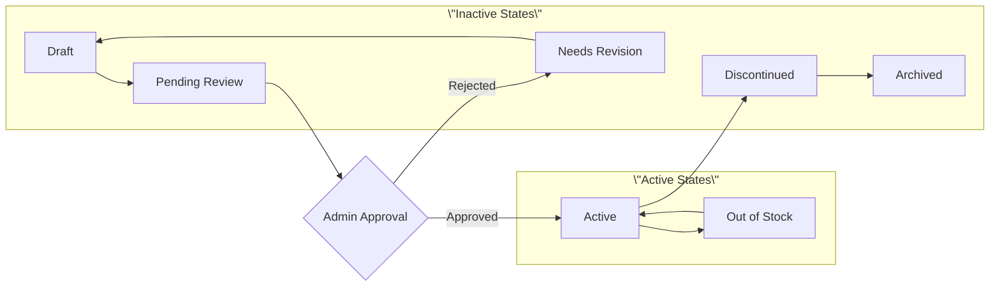

# Seller Platform Requirements Analysis

## 1. Introduction and Business Context

The Seller Platform serves as the business management hub for vendors operating within the shopping mall e-commerce ecosystem. This platform enables sellers to establish and grow their online businesses by providing comprehensive tools for product management, inventory control, order fulfillment, and business analytics. The system supports individual artisans, small businesses, and established retail brands in managing their digital storefronts effectively.

### Business Objectives
- **Seller Empowerment**: Provide robust business management tools for independent sellers
- **Operational Efficiency**: Streamline multi-vendor order processing and fulfillment
- **Revenue Generation**: Enable sellers to maximize sales through effective platform tools
- **Customer Satisfaction**: Ensure seller performance meets customer expectations
- **Platform Growth**: Attract and retain quality sellers to expand marketplace diversity

### Scope and Boundaries
The Seller Platform manages all seller-facing operations including product listing, inventory management, order processing, and business analytics. The system integrates with customer shopping interfaces, payment processing, and administrative oversight while maintaining data segregation between sellers.

## 2. Seller Registration and Onboarding

### 2.1 Seller Account Creation Process

**WHEN** a registered customer applies to become a seller, **THE** system **SHALL** present a comprehensive seller application form requiring:
- Business legal name and registration details
- Tax identification number and business verification
- Business address and contact information
- Bank account details for payouts
- Store name and branding preferences
- Product categories and business description

**WHERE** business verification is required, **THE** system **SHALL** support document upload for:
- Business registration certificates
- Tax identification verification
- Bank account verification documents
- Identity verification for primary contact

**IF** application information is incomplete or invalid, **THEN** **THE** system **SHALL** provide specific error messages and guidance for correction.

### 2.2 Application Review and Approval

```mermaid
graph TD
  A["Seller Application Submitted"] --> B["Automated Validation Check"]
  B --> C{"Passes Automated Check?"}
  C -->|No| D["Return for Corrections"]
  C -->|Yes| E["Queue for Admin Review"]
  E --> F["Admin Reviews Application"]
  F --> G{"Application Approved?"}
  G -->|No| H["Reject with Reason"]
  G -->|Yes| I["Activate Seller Account"]
  I --> J["Send Welcome Email"]
  J --> K[\"Seller Onboarding Process\"]
  K --> L["Seller Dashboard Access"]
```

**WHILE** processing seller applications, **THE** system **SHALL**:
- Route applications to administrator review queue within 1 hour of submission
- Provide administrators with comprehensive application review interface
- Enable bulk approval/rejection of multiple applications
- Track application status with timestamps for each processing stage

**WHEN** an application is approved, **THE** system **SHALL**:
- Automatically create seller dashboard with default settings
- Send welcome email with platform guidelines and next steps
- Grant seller permissions while maintaining customer capabilities
- Provide onboarding checklist for new seller setup

**WHEN** an application is rejected, **THE** system **SHALL**:
- Store rejection reason for audit purposes
- Send rejection notification with specific reasons
- Allow resubmission after addressing rejection reasons
- Maintain application history for future reference

### 2.3 Seller Profile Management

**THE** seller **SHALL** be able to manage comprehensive business profile information including:
- Business contact details and support information
- Store branding elements (logo, banner, color scheme)
- Business hours and customer service availability
- Shipping policies and return procedures
- Payment and payout preferences
- Tax calculation settings

**WHEN** sellers update business information, **THE** system **SHALL**:
- Validate changes against platform policies
- Require re-verification for significant changes
- Update storefront display immediately
- Notify administrators of major profile modifications

## 3. Product Listing Management

### 3.1 Product Creation Workflow

**WHEN** sellers create new products, **THE** system **SHALL** provide a step-by-step product creation interface requiring:
- Product title (3-100 characters)
- Product description (minimum 50 characters)
- Category assignment from platform taxonomy
- Pricing information (cost, selling price, compare-at price)
- Product images (minimum 1, maximum 8)
- Product type (physical, digital, service)
- Shipping weight and dimensions
- Search engine optimization metadata

**WHERE** products have multiple variants, **THE** system **SHALL** support:
- Variant option types (color, size, material, style, custom)
- Variant-specific pricing and inventory
- Variant image associations
- Bulk variant creation from option combinations
- Default variant selection rules

### 3.2 Product Validation and Approval

**WHEN** sellers submit products for publication, **THE** system **SHALL** validate:
- Required fields completion and format compliance
- Pricing consistency and minimum price requirements
- Image quality and appropriateness
- Category assignment accuracy
- Content policy compliance
- Duplicate product detection

**IF** product validation fails, **THEN** **THE** system **SHALL**:
- Provide specific error messages for each validation failure
- Highlight problematic fields with correction guidance
- Prevent publication until all issues are resolved
- Save product as draft for later completion

**WHILE** products await approval, **THE** system **SHALL**:
- Display approval status and estimated review time
- Allow product editing while in review queue
- Notify sellers upon approval or rejection
- Provide revision guidance for rejected products

### 3.3 Product Lifecycle Management



**THE** system **SHALL** support product lifecycle states:
- **Draft**: Initial creation, not visible to customers
- **Pending Review**: Submitted for admin approval
- **Active**: Published and available for purchase
- **Out of Stock**: Temporarily unavailable, visible but not purchasable
- **Discontinued**: No longer available, visible in order history
- **Archived**: Removed from public view, retained for reporting

**WHEN** products transition between states, **THE** system **SHALL**:
- Enforce state transition rules and permissions
- Update product visibility accordingly
- Notify customers watching out-of-stock products
- Maintain historical data for reporting purposes

### 3.4 Bulk Product Operations

**THE** system **SHALL** provide bulk operation capabilities for:
- Product import via CSV/Excel templates
- Bulk price updates across product categories
- Inventory quantity adjustments for multiple SKUs
- Product status changes (activate/deactivate)
- Category reassignment for product groups
- Image management for product variants

**WHEN** performing bulk operations, **THE** system **SHALL**:
- Validate all changes before application
- Provide preview of changes with conflict detection
- Support selective application of changes
- Maintain audit trail of bulk modifications
- Send completion notifications with summary reports

## 4. Inventory Control System

### 4.1 Real-time Inventory Tracking

**THE** system **SHALL** maintain real-time inventory counts with precision to individual SKU level.

**WHEN** inventory changes occur, **THE** system **SHALL** update quantities immediately and synchronize across all system components.

**WHERE** inventory levels approach zero, **THE** system **SHALL**:
- Automatically update product availability status
- Prevent overselling through inventory reservation
- Trigger low stock alerts to sellers
- Update search and category filtering accordingly

### 4.2 Multi-location Inventory Management

**THE** system **SHALL** support inventory allocation across multiple seller locations including:
- Warehouse inventory tracking
- Store-level inventory management
- Drop-shipping inventory synchronization
- Fulfillment center inventory coordination

**WHEN** orders are placed, **THE** system **SHALL**:
- Allocate inventory from optimal location based on shipping address
- Calculate shipping costs from selected fulfillment location
- Update inventory counts in real-time across all locations
- Provide location-specific stock status to customers

### 4.3 Inventory Business Rules

**WHEN** setting inventory thresholds, **THE** system **SHALL** allow sellers to configure:
- Low stock alert levels per SKU
- Reorder point calculations
- Safety stock quantities
- Backorder availability settings
- Inventory buffer for high-demand products

**WHERE** inventory discrepancies occur, **THE** system **SHALL**:
- Provide inventory reconciliation tools
- Support stock adjustment with reason tracking
- Maintain inventory change history
- Generate discrepancy reports for analysis

### 4.4 Automated Inventory Controls

**WHILE** managing inventory, **THE** system **SHALL** implement automated controls:
- Real-time synchronization with order management
- Automated stock status updates based on quantity
- Reservation of inventory during checkout process
- Release of reserved inventory after cart abandonment timeout
- Integration with supplier systems for automatic replenishment

## 5. Order Fulfillment Process

### 5.1 Order Processing Workflow

**WHEN** new orders are received, **THE** system **SHALL**:
- Immediately notify sellers through dashboard and optional email
- Display orders in seller dashboard with filtering and sorting
- Provide order details including customer information and special instructions
- Calculate expected fulfillment timeline based on seller settings

**WHILE** processing orders, **THE** system **SHALL** support order states:
- **New**: Recently received, awaiting processing
- **Acknowledged**: Seller has reviewed order
- **Processing**: Items being prepared for shipment
- **Ready for Shipment**: Packaged and awaiting carrier pickup
- **Shipped**: Dispatched with tracking information
- **Delivered**: Successfully received by customer
- **Cancelled**: Order cancelled before shipment
- **Returned**: Items returned by customer

### 5.2 Shipping and Label Generation

**THE** system **SHALL** integrate with major shipping carriers including:
- USPS, UPS, FedEx, DHL integration
- Real-time shipping rate calculations
- Automated shipping label generation
- Tracking number assignment and synchronization
- Delivery confirmation processing

**WHEN** sellers mark orders as shipped, **THE** system **SHALL**:
- Generate shipping labels with customer and product information
- Assign tracking numbers automatically
- Update order status to "Shipped"
- Notify customers with tracking information
- Update inventory quantities accordingly

### 5.3 Return and Refund Management

**THE** system **SHALL** provide comprehensive return management including:
- Return authorization request processing
- Return label generation for approved returns
- Return reason tracking and categorization
- Refund calculation based on return policies
- Return status communication to customers

**WHEN** processing returns, **THE** system **SHALL**:
- Validate return eligibility based on seller policies
- Calculate refund amounts including shipping adjustments
- Process refunds through integrated payment system
- Update inventory upon return receipt
- Analyze return patterns for product quality insights

## 6. Seller Dashboard and Analytics

### 6.1 Business Performance Overview

**THE** seller dashboard **SHALL** display real-time business metrics including:
- Today's sales and order volume
- Current month revenue and growth percentage
- Pending orders requiring action
- Low stock alerts and inventory status
- Customer service tickets awaiting response

**WHEN** sellers access their dashboard, **THE** system **SHALL** provide:
- Customizable dashboard widgets and layout
- Quick action shortcuts for common tasks
- Performance benchmarks against platform averages
- Alert notifications for critical business events

### 6.2 Sales Analytics and Reporting

**THE** system **SHALL** provide comprehensive sales analytics including:
- Sales trends by day, week, month, and quarter
- Product performance rankings and revenue analysis
- Customer acquisition sources and conversion rates
- Geographic sales distribution and regional performance
- Seasonal trends and promotional effectiveness

**WHERE** detailed reporting is required, **THE** system **SHALL** offer:
- Custom date range selection for reports
- Product category filtering and comparison
- Customer segment analysis and purchasing patterns
- Export capabilities to CSV, Excel, and PDF formats
- Scheduled report generation and email delivery

### 6.3 Customer Insights and Behavior

**THE** system **SHALL** provide customer behavior analytics including:
- Customer lifetime value calculations
- Repeat purchase rates and customer retention
- Shopping cart abandonment analysis
- Product view to purchase conversion rates
- Customer demographic and preference insights

**WHEN** analyzing customer data, **THE** system **SHALL**:
- Maintain customer privacy and data protection
- Provide aggregated insights without personal identification
- Enable customer segmentation for targeted marketing
- Track customer satisfaction through review patterns

### 6.4 Inventory Analytics and Optimization

**THE** system **SHALL** provide inventory optimization tools including:
- Stock turnover rates and inventory velocity
- Demand forecasting based on historical sales
- Reorder point calculations and safety stock analysis
- Dead stock identification and clearance recommendations
- Inventory investment and carrying cost analysis

**WHERE** inventory optimization is needed, **THE** system **SHALL**:
- Identify slow-moving inventory requiring promotion
- Highlight stockout risks for high-demand products
- Suggest optimal reorder quantities based on sales patterns
- Provide inventory health scores and improvement recommendations

## 7. Payment and Payout Integration

### 7.1 Commission Calculation and Deductions

**THE** system **SHALL** automatically calculate platform commissions based on:
- Transaction value and product category
- Seller subscription tier and commission rates
- Promotional discounts and special offers
- Shipping and handling charges
- Tax calculations and exemptions

**WHEN** processing payouts, **THE** system **SHALL**:
- Deduct applicable commissions and fees
- Calculate net payout amounts to sellers
- Provide detailed breakdown of deductions
- Support multiple payout methods (bank transfer, digital wallet)
- Schedule payouts according to platform policies

### 7.2 Payout Processing and Scheduling

**THE** system **SHALL** manage payout processing with:
- Automated payout scheduling (weekly, bi-weekly, monthly)
- Payout threshold enforcement (minimum payout amounts)
- Payout method configuration and verification
- Payout status tracking and notification
- Payout failure handling and retry mechanisms

**WHEN** payouts are processed, **THE** system **SHALL**:
- Generate payout reports with transaction details
- Send payout notifications to sellers
- Update seller balance and accounting records
- Provide payout history and reconciliation tools
- Handle currency conversion for international sellers

### 7.3 Financial Reporting and Analytics

**THE** system **SHALL** provide comprehensive financial reporting including:
- Revenue reports by product, category, and time period
- Commission and fee calculations
- Payout summaries and transaction history
- Tax calculation and reporting capabilities
- Profit and loss statements for seller business

**WHERE** financial analysis is required, **THE** system **SHALL** offer:
- Comparative analysis against previous periods
- Revenue growth trends and projections
- Product profitability analysis
- Customer acquisition cost calculations
- Return on investment metrics for marketing activities

## 8. Business Rules and Compliance

### 8.1 Seller Performance Monitoring

**THE** system **SHALL** monitor seller performance against platform standards including:
- Order fulfillment rate and timeliness
- Customer satisfaction scores and review ratings
- Product quality and accuracy metrics
- Communication responsiveness and support quality
- Policy compliance and violation history

**WHEN** seller performance falls below standards, **THE** system **SHALL**:
- Generate performance alerts and improvement recommendations
- Implement performance improvement plans with specific targets
- Provide performance benchmarking against platform averages
- Escalate to administrative review for persistent issues

### 8.2 Policy Enforcement and Compliance

**THE** system **SHALL** enforce platform policies through:
- Automated policy violation detection
- Manual policy review and enforcement actions
- Seller education and warning system
- Suspension and termination procedures
- Appeal process management and resolution tracking

**WHERE** policy violations occur, **THE** system **SHALL**:
- Document violation details with evidence
- Notify sellers of violations with correction requirements
- Track violation history and pattern analysis
- Implement graduated enforcement actions
- Provide appeal process for disputed violations

### 8.3 Dispute Resolution Procedures

**THE** system **SHALL** provide structured dispute resolution including:
- Dispute case creation and documentation
- Evidence submission from both parties
- Mediation and communication tools
- Resolution tracking and outcome recording
- Escalation procedures for unresolved disputes

**WHEN** disputes are raised, **THE** system **SHALL**:
- Assign dispute to appropriate resolution team
- Establish communication channels between parties
- Set resolution timelines and expectations
- Document all communications and evidence
- Implement resolution decisions consistently

## 9. Performance Requirements

### 9.1 System Responsiveness

**THE** seller platform **SHALL** maintain performance standards:
- Dashboard load time: Under 2 seconds
- Product listing updates: Real-time synchronization
- Order processing: Under 5 seconds for status changes
- Inventory updates: Immediate reflection across system
- Report generation: Under 30 seconds for standard reports

### 9.2 Scalability and Capacity

**THE** system **SHALL** support scalable operations:
- Up to 10,000 concurrent seller sessions
- Product catalogs of 50,000+ SKUs per seller
- Order processing capacity of 1,000+ orders per hour
- Real-time inventory tracking for millions of products
- Data retention for 7 years of business history

### 9.3 Reliability and Availability

**THE** seller platform **SHALL** maintain:
- 99.9% uptime during business hours
- Maximum 5 minutes of unplanned downtime per month
- Graceful degradation during peak loads
- Data backup and disaster recovery capabilities
- Security incident response within 1 hour

## 10. Error Handling Scenarios

### 10.1 Inventory Management Errors

**IF** inventory synchronization fails, **THEN** **THE** system **SHALL**:
- Implement automatic retry mechanisms with exponential backoff
- Provide manual inventory reconciliation tools
- Notify sellers of synchronization issues
- Maintain order integrity during resolution
- Log synchronization failures for technical analysis

**WHEN** inventory discrepancies are detected, **THE** system **SHALL**:
- Flag affected products for manual review
- Prevent new orders for discrepant inventory
- Provide discrepancy resolution workflow
- Update inventory records after manual verification
- Analyze root causes to prevent recurrence

### 10.2 Order Processing Errors

**IF** order processing encounters errors, **THEN** **THE** system **SHALL**:
- Maintain order state consistency
- Provide error details and resolution steps
- Support order reprocessing from last stable state
- Notify both seller and customer of processing delays
- Escalate to technical support for persistent issues

**WHEN** shipping integration fails, **THE** system **SHALL**:
- Provide manual shipping entry as fallback
- Queue tracking updates for later synchronization
- Notify sellers of carrier connection issues
- Maintain order status based on manual updates
- Automatically retry integration when available

### 10.3 Payment Processing Errors

**IF** payout processing fails, **THEN** **THE** system **SHALL**:
- Retry payout processing with updated information
- Notify sellers of payout delays and reasons
- Provide alternative payout methods if available
- Maintain payout history for reconciliation
- Escalate to financial operations for manual processing

**WHEN** commission calculation errors occur, **THE** system **SHALL**:
- Flag miscalculated transactions for review
- Provide calculation audit trails
- Support manual adjustment with approval workflow
- Notify sellers of calculation corrections
- Prevent similar errors through system improvements

## 11. Integration Requirements

### 11.1 Authentication System Integration

**THE** seller platform **SHALL** integrate with authentication system to:
- Validate seller credentials and permissions
- Enforce role-based access controls
- Maintain session security and timeout policies
- Support multi-factor authentication for sensitive operations
- Synchronize user profile changes across systems

### 11.2 Product Catalog Integration

**THE** seller platform **SHALL** synchronize with product catalog to:
- Maintain consistent product information across buyer and seller interfaces
- Update product availability in real-time
- Synchronize inventory changes immediately
- Support product search and categorization
- Maintain product review and rating consistency

### 11.3 Order Management Integration

**THE** seller platform **SHALL** integrate with order management to:
- Receive new order notifications instantly
- Update order status throughout fulfillment process
- Synchronize shipping and tracking information
- Process returns and refund requests
- Maintain order history and customer communication

### 11.4 Payment System Integration

**THE** seller platform **SHALL** coordinate with payment system to:
- Calculate commissions and fees accurately
- Process seller payouts according to schedule
- Handle refund and chargeback procedures
- Maintain financial reporting consistency
- Support multiple currency and payment methods

## 12. Success Metrics and KPIs

### 12.1 Seller Onboarding Success
- 95% of seller applications processed within 48 hours
- 80% of approved sellers list first product within 7 days
- Seller satisfaction score of 4.0+ out of 5.0
- Onboarding completion rate of 90% within 30 days

### 12.2 Operational Efficiency
- Average order processing time under 4 hours for sellers
- Inventory accuracy rate of 99.5% or higher
- System availability of 99.9% during business hours
- Payout processing accuracy of 99.9%

### 12.3 Business Impact
- Seller retention rate of 85% after 6 months
- Average order value growth of 15% quarter-over-quarter
- Seller-initiated customer service contacts reduced by 30%
- Platform commission revenue growth of 20% annually

### 12.4 Customer Satisfaction
- Seller response time to customer inquiries under 4 hours
- Order fulfillment accuracy rate of 99%
- Customer review ratings averaging 4.2+ stars
- Return rate maintained below industry average

This enhanced seller platform specification provides comprehensive business requirements for implementing a robust, scalable multi-vendor management system that empowers sellers while maintaining platform quality standards and operational efficiency.