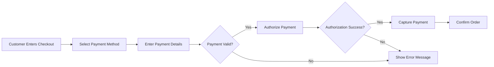
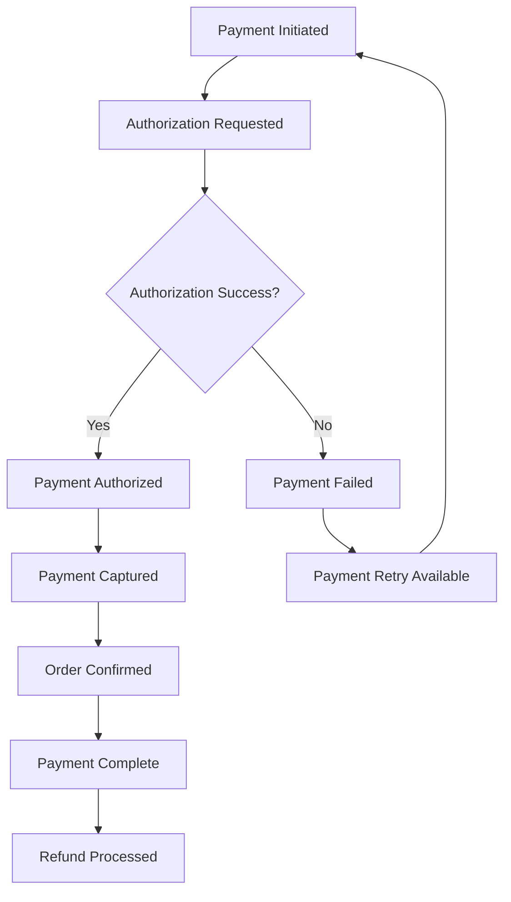

# E-Commerce Platform Payment Processing System

## Executive Summary

The payment processing system is the financial backbone of the e-commerce platform, responsible for securely processing customer payments, managing financial transactions, and ensuring regulatory compliance. This document outlines the complete payment processing requirements for the shopping mall platform, focusing on secure transaction handling, multiple payment method support, and comprehensive financial management capabilities.

## Payment Gateway Integration

### Core Payment Gateway Requirements

**THE system SHALL integrate with at least one major payment gateway provider.**

**WHEN a customer proceeds to checkout, THE system SHALL display available payment methods based on their location and account status.**

**THE system SHALL support multiple payment methods including credit/debit cards, digital wallets, and bank transfers.

### Supported Payment Methods

| Payment Method | Availability | Processing Time |
|----------------|--------------|-----------------|
| Credit/Debit Cards | Global | Instant authorization |
| PayPal | Global | Instant processing |
| Apple Pay | iOS devices | Instant processing |
| Google Pay | Android devices | Instant processing |
| Bank Transfer | Regional | 1-3 business days |
| Digital Wallets | Regional | Instant processing |

### Security Requirements

**THE system SHALL comply with PCI DSS standards for all card payment processing.**

**WHEN processing card payments, THE system SHALL tokenize sensitive card information to ensure data security.

## Transaction Processing Flows

### Standard Payment Processing

### Payment Authorization Process

**WHEN a customer submits payment information, THE system SHALL validate the payment details before processing.**

**IF payment validation fails, THEN THE system SHALL display specific error messages to guide correction.

**WHILE processing a payment, THE system SHALL maintain transaction state and prevent duplicate processing.

### Order Confirmation Flow

**WHEN payment authorization is successful, THE system SHALL capture the payment amount and confirm the order placement.

### Failed Payment Handling

**IF payment authorization fails, THEN THE system SHALL provide clear failure reasons and suggest alternative payment methods.

## Financial Reporting and Reconciliation

### Transaction Reporting

**THE system SHALL maintain complete audit trails for all financial transactions.**

**WHERE a transaction is processed, THE system SHALL record the following information:**
- Transaction ID and timestamp
- Customer and order information
- Payment method and amount
- Authorization and capture status
- Gateway response codes and messages

### Daily Reconciliation

**THE system SHALL generate daily settlement reports showing all successful and failed transactions.**

**WHEN daily reconciliation occurs, THE system SHALL match platform transactions with gateway settlement data.

## Refund and Dispute Management

### Refund Processing

**WHEN a seller initiates a refund, THE system SHALL process the refund through the original payment gateway.**

### Refund Processing Requirements

**WHILE processing a refund, THE system SHALL verify that the refund amount does not exceed the original payment amount.**

**IF a refund request exceeds available funds, THEN THE system SHALL reject the refund and notify the seller.**

### Customer Dispute Handling

**WHEN a customer files a payment dispute, THE system SHALL immediately flag the transaction and notify both seller and customer service team.

### Chargeback Management

**THE system SHALL provide tools for sellers to respond to chargeback claims with supporting evidence.**

## Payment Security and Compliance

### Data Protection Requirements

**THE system SHALL never store raw credit card numbers, CVV codes, or other sensitive payment information.**

**WHERE payment information is collected, THE system SHALL use tokenization to replace sensitive data with secure tokens.**

**WHEN processing sensitive payment data, THE system SHALL use end-to-end encryption.**

### Fraud Detection

**THE system SHALL implement basic fraud detection mechanisms including:**
- IP address verification
- Transaction amount monitoring
- Velocity checking (multiple rapid transactions)

## Multi-Currency Support

### Currency Conversion

**WHEN processing international payments, THE system SHALL convert amounts to the platform's base currency using real-time exchange rates.**

### Currency Handling Rules

**THE system SHALL support transactions in multiple currencies with automatic conversion based on current exchange rates.**

**IF currency conversion is required, THEN THE system SHALL display both original and converted amounts to the customer.**

## Payment Method Restrictions

### Geographic Limitations

**WHERE regional payment methods are available, THE system SHALL display them only to customers in supported regions.**

## Transaction Status Management

### Payment Status Tracking

**THE system SHALL maintain real-time status for all payment transactions including:**
- Pending authorization
- Authorized but not captured
- Successfully captured
- Refunded
- Failed

### Status Update Requirements

**WHEN a payment status changes, THE system SHALL notify the customer and update the order status accordingly.**

### Payment Status Lifecycle

## Financial Record Keeping

### Transaction Records

**THE system SHALL maintain permanent records of all payment transactions for financial reporting and audit purposes.**

## Settlement and Payout Management

### Seller Payouts

**THE system SHALL process automatic payouts to sellers according to the platform's payout schedule.**

### Payout Processing

**WHEN processing seller payouts, THE system SHALL deduct applicable platform fees and transfer the net amount to the seller's designated account.**

**WHILE a payout is being processed, THE system SHALL prevent modifications to the associated orders.**

## Error Handling and Recovery

### Payment Gateway Communication

**IF payment gateway communication fails, THEN THE system SHALL retry the connection up to 3 times with exponential backoff.**

## Performance Requirements

### Transaction Processing Speed

**WHEN a customer submits payment, THE system SHALL process the transaction within 10 seconds and provide immediate feedback on the outcome.**

**THE system SHALL maintain 99.9% uptime for payment processing services.**

## Customer Communication

### Payment Status Notifications

**WHEN a payment status changes, THE system SHALL notify the customer via email with transaction details and next steps.**

## Audit and Compliance

### Regulatory Requirements

**THE system SHALL maintain compliance with all applicable financial regulations including:**
- Anti-money laundering (AML) requirements
- Know your customer (KYC) verification where required by law.**

**THE system SHALL generate monthly financial reports for tax and accounting purposes.**

## Integration Points

### External System Integration

**THE system SHALL provide secure APIs for integration with accounting systems and financial management tools.**

## Future Payment Features

### Planned Enhancements

**WHERE future development resources are available, THE system SHALL implement recurring payments for subscription services.**

**WHILE planning future enhancements, THE system SHALL consider additional payment methods such as cryptocurrency and local payment options based on market demand.**

## Success Metrics

### Key Performance Indicators

- Payment success rate: Minimum 95%
- Transaction processing time: Maximum 10 seconds
- System uptime: 99.9%
- Fraud detection rate: Maximum 2% false positives
- Customer satisfaction with payment process: Minimum 4.5/5 rating
- Chargeback rate: Maximum 1% of total transactions

## Implementation Considerations

### Technical Constraints

**THE system SHALL ensure that all payment processing occurs over secure, encrypted connections.**

**THE system SHALL implement comprehensive logging for all payment-related activities to support troubleshooting and security monitoring.**