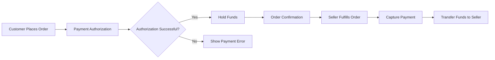

# Payment System Requirements

## 1. Introduction and Business Context

### 1.1 Payment System Overview
The payment system serves as the financial backbone of the shopping mall platform, enabling secure transactions between customers, sellers, and payment processors. This system handles all monetary transactions including purchases, refunds, and chargebacks while maintaining compliance with financial regulations and security standards.

### 1.2 Business Objectives
- **Revenue Security**: Ensure 99.9% transaction success rate for completed orders
- **User Trust**: Build customer confidence through secure payment processing
- **Seller Support**: Provide reliable payment distribution to sellers
- **Platform Growth**: Support multiple payment methods to maximize conversion rates
- **Risk Management**: Minimize fraud and chargeback rates

### 1.3 Scope
This document covers the complete payment processing lifecycle from order placement through fund settlement, including authorization, capture, refunds, and chargeback management.

## 2. Payment Gateway Integration

### 2.1 Supported Payment Gateways
THE payment system SHALL integrate with major payment processors including Stripe, PayPal, and local payment gateways relevant to target markets.

### 2.2 Integration Requirements
WHEN integrating with payment gateways, THE payment system SHALL:
- Support RESTful API communication
- Implement webhook endpoints for transaction status updates
- Maintain gateway-specific configuration settings
- Handle gateway-specific error codes and messages
- Support sandbox environments for testing

### 2.3 Transaction Flow Specifications

## 3. Multiple Payment Method Support

### 3.1 Credit/Debit Card Processing
THE payment system SHALL support major credit and debit cards including Visa, MasterCard, American Express, and Discover.

WHEN processing card payments, THE payment system SHALL:
- Validate card number format and checksum
- Verify card expiration date is in the future
- Validate CVV/CVC security codes
- Support 3D Secure authentication where available
- Store tokenized payment methods for returning customers

### 3.2 Digital Wallet Integration
THE payment system SHALL integrate with popular digital wallets including Apple Pay, Google Pay, and PayPal.

### 3.3 Bank Transfer Options
WHERE local market preferences exist, THE payment system SHALL support direct bank transfers and local payment methods.

### 3.4 Cash on Delivery (COD)
WHEN customers select cash on delivery, THE payment system SHALL:
- Validate customer location supports COD
- Calculate COD fees based on order value and location
- Track COD payment status upon delivery
- Handle COD payment failures and retries

## 4. Transaction Security Requirements

### 4.1 PCI DSS Compliance
THE payment system SHALL maintain PCI DSS Level 1 compliance for all cardholder data processing.

### 4.2 Data Encryption Standards
WHEN storing or transmitting payment information, THE payment system SHALL:
- Encrypt sensitive data using AES-256 encryption
- Never store raw card numbers or security codes
- Use tokenization for payment method storage
- Implement TLS 1.2+ for all data transmission

### 4.3 Fraud Detection and Prevention
THE payment system SHALL implement fraud detection mechanisms including:
- IP address geolocation verification
- Transaction velocity monitoring
- Billing/shipping address mismatch detection
- Suspicious activity pattern recognition

### 4.4 Transaction Validation Rules
WHEN processing payments, THE payment system SHALL validate:
- Order total matches authorized amount
- Currency conversion rates are current
- Customer account status is active
- Seller account is in good standing
- Payment method is valid and not expired

## 5. Payment Processing Workflows

### 5.1 Order Payment Authorization
WHEN a customer places an order, THE payment system SHALL:
- Authorize the payment amount with the payment gateway
- Place a temporary hold on customer funds
- Return authorization status to the order system
- Store authorization reference for later capture

### 5.2 Payment Confirmation Flow
WHEN payment authorization is successful, THE payment system SHALL:
- Update order status to "Payment Authorized"
- Send confirmation email to customer
- Notify seller of new paid order
- Begin order fulfillment process

### 5.3 Failed Payment Handling
IF payment authorization fails, THEN THE payment system SHALL:
- Provide specific error messages to customer
- Suggest alternative payment methods
- Log failure reason for analysis
- Allow payment retry with different method

### 5.4 Payment Status Tracking
THE payment system SHALL maintain real-time payment status including:
- Authorization pending
- Authorization successful
- Authorization failed
- Payment captured
- Payment refunded
- Chargeback initiated

## 6. Refund and Chargeback Handling

### 6.1 Refund Processing Workflows
WHEN a refund request is approved, THE payment system SHALL:
- Validate refund amount against original transaction
- Process refund through original payment method
- Update order status to "Refunded"
- Notify customer of refund completion
- Update seller payout calculations

### 6.2 Chargeback Dispute Resolution
WHEN a chargeback is initiated, THE payment system SHALL:
- Notify seller of chargeback claim
- Provide evidence submission interface
- Track chargeback status and deadlines
- Update dispute resolution outcome
- Adjust seller payouts based on chargeback results

### 6.3 Partial Refunds and Adjustments
WHERE partial refunds are required, THE payment system SHALL:
- Support refunds for specific order items
- Calculate proportional refund amounts
- Handle shipping cost adjustments
- Process partial refunds through payment gateway

### 6.4 Refund Timeline Specifications
THE payment system SHALL process refunds within:
- 24 hours for approved refund requests
- 3-5 business days for bank transfer refunds
- 5-7 business days for card refunds to appear on customer statements

## 7. Error Handling and Recovery

### 7.1 Payment Failure Scenarios
IF payment gateway is unavailable, THEN THE payment system SHALL:
- Implement graceful degradation
- Queue payment requests for retry
- Provide customer with alternative payment options
- Log outage for monitoring and analysis

### 7.2 Transaction Timeout Handling
WHEN payment authorization times out, THE payment system SHALL:
- Retry transaction up to 3 times
- Provide clear timeout message to customer
- Maintain order in pending payment state
- Allow customer to retry payment

### 7.3 Network Connectivity Issues
WHILE network connectivity is unstable, THE payment system SHALL:
- Implement retry mechanisms with exponential backoff
- Cache payment requests locally
- Synchronize when connectivity is restored
- Maintain transaction integrity during network issues

### 7.4 Payment Retry Mechanisms
THE payment system SHALL provide customers with:
- Ability to retry failed payments
- Option to change payment method
- Clear instructions for payment issues
- Customer support escalation path

## 8. Compliance and Regulatory Requirements

### 8.1 Financial Regulations
THE payment system SHALL comply with:
- Anti-Money Laundering (AML) regulations
- Know Your Customer (KYC) requirements
- Local financial service regulations
- Tax calculation and reporting requirements

### 8.2 Tax Calculation Requirements
WHEN processing payments, THE payment system SHALL:
- Calculate applicable sales tax based on customer location
- Apply tax exemptions where valid
- Maintain tax calculation audit trail
- Support tax reporting requirements

### 8.3 Currency Conversion Rules
WHERE multiple currencies are supported, THE payment system SHALL:
- Use current market exchange rates
- Apply conversion fees transparently
- Display converted amounts to customers
- Support settlement in multiple currencies

### 8.4 Local Payment Regulations
THE payment system SHALL adapt to local payment regulations including:
- Payment method preferences by region
- Local currency requirements
- Regulatory reporting obligations
- Consumer protection laws

## 9. Performance and Scalability Requirements

### 9.1 Transaction Processing Performance
THE payment system SHALL process payments with:
- Authorization response time under 3 seconds
- 99.9% uptime during business hours
- Support for 1000+ concurrent transactions
- Horizontal scaling capability for peak loads

### 9.2 Availability Requirements
THE payment system SHALL maintain:
- 99.5% overall system availability
- Redundant payment gateway connections
- Failover mechanisms for gateway outages
- Disaster recovery procedures

### 9.3 Monitoring and Reporting
THE payment system SHALL provide:
- Real-time transaction monitoring dashboard
- Payment success rate analytics
- Fraud detection metrics
- Settlement reconciliation reports

## 10. Integration Points

### 10.1 Order System Integration
THE payment system SHALL integrate with the order management system to:
- Receive payment requests for orders
- Update order payment status
- Trigger order fulfillment upon successful payment
- Handle order cancellation and refund workflows

### 10.2 User Account Integration
THE payment system SHALL integrate with user accounts to:
- Store customer payment methods securely
- Maintain payment history per customer
- Support one-click payments for returning customers
- Manage billing address information

### 10.3 Seller Payout Integration
THE payment system SHALL integrate with seller payout systems to:
- Calculate seller earnings after fees
- Schedule payout distributions
- Handle payout failures and retries
- Provide payout history and reporting

## 11. Security and Data Protection

### 11.1 Data Retention Policies
THE payment system SHALL:
- Retain transaction records for 7 years for audit purposes
- Securely delete sensitive data according to data protection regulations
- Maintain data encryption for stored payment information
- Implement data access controls and audit trails

### 11.2 Access Control Requirements
THE payment system SHALL implement:
- Role-based access to payment data
- Multi-factor authentication for administrative access
- Session timeout for payment interfaces
- Activity logging for all payment operations

### 11.3 Incident Response Procedures
WHEN security incidents occur, THE payment system SHALL:
- Immediately suspend affected payment functions
- Notify security team and management
- Preserve evidence for investigation
- Implement remediation measures
- Communicate with affected parties as required

This payment system specification provides comprehensive requirements for implementing a secure, reliable, and scalable payment processing solution for the shopping mall platform. All requirements focus on business logic and user workflows while leaving technical implementation details to the development team.