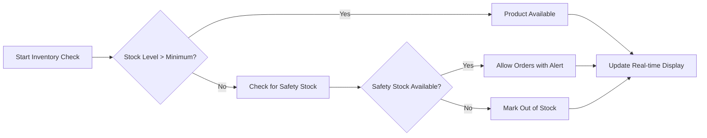

# E-Commerce Platform Inventory Management System

## Executive Summary

This document outlines the comprehensive inventory management requirements for the shopping mall e-commerce platform. The inventory system serves as the operational backbone, ensuring accurate stock tracking, preventing overselling, and maintaining optimal inventory levels across all seller storefronts. The system must provide real-time inventory visibility, automated replenishment alerts, and seamless integration with order fulfillment processes.

## Business Context and Objectives

The inventory management system enables sellers to maintain control over their product stock while providing customers with accurate availability information. THE system SHALL prevent customer orders from being placed when inventory is insufficient to fulfill the request.

## Core Inventory Management Functions

### 1. Stock Level Management

**WHEN** a seller adds a new product listing, **THE** system **SHALL** require an initial stock quantity and set minimum stock thresholds.

**THE** inventory system **SHALL**:
- Track current stock levels for each product variant
- Update inventory in real-time as orders are placed and fulfilled
- Maintain historical inventory data for trend analysis
- Support multiple warehouses and fulfillment centers

### 2. Real-Time Inventory Tracking

**WHEN** a customer places an order, **THE** system **SHALL** immediately deduct the ordered quantity from available inventory

**WHILE** inventory levels are above the minimum threshold, **THE** system **SHALL** display products as "In Stock"

**IF** inventory reaches zero for a product, **THEN THE** system **SHALL** automatically mark the product as "Out of Stock" and prevent new orders.

### 3. Inventory Updates and Synchronization

**WHEN** a seller manually updates inventory levels, **THE** system **SHALL** validate the new quantity against pending orders and recent sales.

### 4. Low Stock Alerts and Replenishment

**WHEN** inventory for any product falls below the minimum stock threshold, **THE** system **SHALL**:
- Send immediate notifications to the seller
- Update product availability status across the platform
- Maintain data consistency across all system components

**WHERE** a seller has configured automatic reordering, **THE** system **SHALL** generate purchase orders when stock reaches reorder points.

### 5. Multi-Warehouse Support

**WHERE** sellers operate multiple warehouses, **THE** system **SHALL**:
- Track inventory levels separately for each location
- Optimize order fulfillment from the nearest available stock

## Inventory Control Processes

### Stock Level Monitoring

### Inventory Update Workflow

**WHEN** inventory levels are modified through any channel (manual update, order placement, returns processing), **THE** system **SHALL** ensure all system components reflect the updated inventory within 2 seconds.

### Backorder Management

**WHERE** sellers allow backorders, **THE** system **SHALL**:
- Accept orders for out-of-stock items
- Provide estimated restock dates to customers
- Prioritize backorder fulfillment when new stock arrives

### Inventory Accuracy Requirements

**THE** system **SHALL** maintain inventory accuracy of at least 99.5% through automated reconciliation processes.

## Business Rules and Validation

### Stock Quantity Validation

**WHEN** entering stock quantities, **THE** system **SHALL**:
- Accept only positive integers
- Reject negative values or zero for initial stock
- Validate that updated quantities do not conflict with pending orders

### Inventory Threshold Configuration

**THE** system **SHALL** allow sellers to configure:
- Minimum stock levels for each product
- Reorder points and quantities
- Safety stock levels for high-demand items

### Stock Movement Tracking

**WHEN** inventory levels change, **THE** system **SHALL**:
- Log all inventory transactions with timestamps
- Maintain audit trails for all stock adjustments
- Support inventory counts and cycle counting processes

## Performance Requirements

### Real-time Updates

**WHEN** an order is placed or inventory is manually updated, **THE** system **SHALL** propagate changes across all platform components within 3 seconds.

### System Reliability

**THE** inventory management system **SHALL** maintain 99.9% uptime during business hours (9 AM - 9 PM KST).

**THE** system **SHALL** handle inventory updates for up to 1,000 concurrent transactions.

## Integration Requirements

### Order Management System

**WHEN** an order is processed, **THE** system **SHALL**:
- Process inventory deductions within 500 milliseconds
- Support batch inventory updates for bulk operations
- Integrate with shipping and fulfillment systems

### Supplier Management

**WHERE** sellers manage supplier relationships, **THE** system **SHALL**:
- Track supplier lead times for restocking
- Calculate economic order quantities based on demand patterns

## Error Handling and Edge Cases

### Insufficient Inventory

**IF** a customer attempts to order more quantity than available stock, **THEN THE** system **SHALL**:
- Prevent the order from being completed
- Display available quantity to the customer
- Suggest similar in-stock products as alternatives

### Inventory Discrepancy Resolution

**WHEN** physical inventory counts differ from system records, **THE** system **SHALL**:
- Allow manual inventory adjustments with proper authorization
- Require reason codes for all manual adjustments
- Generate discrepancy reports for management review

## Success Metrics

**THE** inventory management system **SHALL** achieve:
- Less than 0.5% rate of overselling incidents
- Inventory reconciliation completed within 24 hours of physical counts
- System-generated inventory reports available within 30 seconds of request

## Scalability Requirements

**THE** system **SHALL** support:
- Up to 100,000 unique product SKUs
- Daily inventory transaction volume of 1,000,000+ updates
- Support for international inventory across multiple currencies and measurement units

## Security and Access Controls

**THE** system **SHALL** enforce:
- Role-based access to inventory management functions
- Audit trails for all inventory modifications
- Secure API endpoints for external system integration

## Compliance Requirements

**THE** inventory management system **SHALL** comply with:
- Financial reporting standards for inventory valuation
- Data privacy regulations for inventory-related information
- Industry-specific inventory management standards

## Future Enhancement Considerations

**WHERE** platform expansion is planned, **THE** system **SHALL** accommodate:
- Integration with third-party logistics providers
- Advanced inventory forecasting and demand planning
- Serial number and lot tracking for regulated products

## Implementation Priorities

### Phase 1 (Critical)
- Real-time inventory tracking and updates
- Basic stock level alerts
- Order validation against available inventory

**THE** inventory management system represents a critical component of the e-commerce platform's operational integrity. By maintaining accurate, real-time inventory data, the system prevents customer dissatisfaction from overselling while enabling sellers to optimize their inventory investment through data-driven decision making.