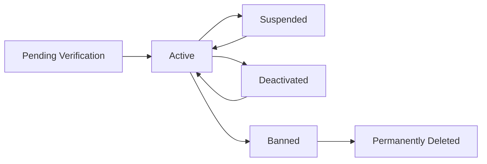
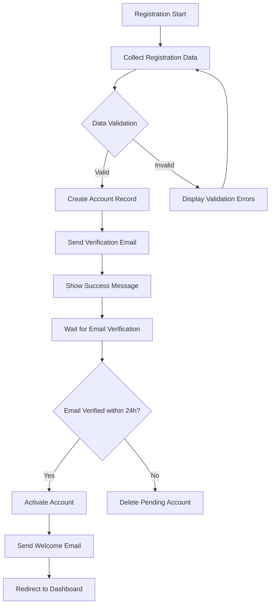

# Customer Account Management System Requirements

## 1. Introduction

The Customer Account Management System provides the foundation for user interaction within the shopping mall platform, enabling registered customers to manage their personal information, addresses, order history, and security preferences. This comprehensive system ensures a personalized shopping experience while maintaining data security and privacy compliance.

### Business Context
Customer accounts serve as the central hub for all customer interactions, from initial registration through order tracking and profile management. A robust account system directly impacts customer retention, satisfaction, and lifetime value by providing seamless self-service capabilities.

### Customer Journey Integration
The account system integrates with all major platform components:
- **Authentication System**: Secure login and session management
- **Shopping Flow**: Address selection and checkout preferences
- **Order Management**: Order history and tracking access
- **Payment System**: Saved payment methods and transaction history
- **Review System**: Review submission and management

## 2. User Profile Management

### 2.1 Customer Registration Process

**WHEN** a guest initiates account registration, **THE** system **SHALL** present a registration form requiring:
- Email address (verified through confirmation email)
- Password meeting complexity requirements (minimum 8 characters with uppercase, lowercase, and numeric characters)
- First name and last name
- Phone number for order notifications and account recovery

**WHEN** registration form submission occurs, **THE** system **SHALL** validate all fields and send email verification within 60 seconds.

**IF** email verification is not completed within 24 hours, **THEN** **THE** system **SHALL** automatically delete the pending registration and release the email address for reuse.

**WHERE** email verification is successful, **THE** system **SHALL** activate the account and redirect to the customer dashboard.

### 2.2 Profile Information Management

**THE** customer **SHALL** be able to view and manage comprehensive profile information including:
- Personal details (full name, date of birth, gender)
- Contact information (email, phone number, secondary contact)
- Communication preferences (email notifications, SMS alerts, promotional offers)
- Newsletter subscription settings
- Profile picture with upload and cropping capabilities
- Language and regional preferences

**WHEN** a customer updates their primary email address, **THE** system **SHALL** require email verification before applying the change and notify the previous email address of the update.

**WHERE** profile changes are made, **THE** system **SHALL** maintain a complete audit trail including change timestamp, previous values, and modification source.

### 2.3 Account Status Lifecycle

**THE** system **SHALL** support the following account status transitions:

**WHEN** a customer requests account deactivation, **THE** system **SHALL**:
- Preserve order history for 7 years per business requirements
- Remove personal data according to data retention policies
- Send confirmation email with reactivation instructions
- Maintain account in deactivated state for 90 days before permanent deletion

**IF** suspicious activity is detected, **THEN** **THE** system **SHALL** automatically suspend the account and require identity verification.

## 3. Address Book System

### 3.1 Address Management Workflow

**THE** customer **SHALL** be able to manage multiple shipping addresses with the following capabilities:
- Add new addresses with comprehensive validation
- Edit existing address information
- Delete addresses not associated with active orders
- Set default shipping and billing addresses
- Organize addresses by type (home, work, other)

**WHEN** adding a new address, **THE** system **SHALL** validate these mandatory fields:
- Recipient full name
- Street address line 1
- Street address line 2 (optional)
- City
- State/Province/Region
- Country
- ZIP/Postal code
- Phone number with country code

**WHERE** address validation services are available, **THE** system **SHALL** verify address deliverability through third-party validation services.

### 3.2 Address Types and Defaults

**THE** system **SHALL** support multiple address types with specific business rules:
- **Primary Shipping Address**: Default selection during checkout
- **Secondary Shipping Addresses**: Additional delivery locations
- **Billing Address**: Separate address for payment purposes
- **Gift Shipping Address**: Special handling for gift orders

**WHEN** a customer sets a default shipping address, **THE** system **SHALL**:
- Automatically pre-select this address during checkout
- Use this address for order confirmations and tracking
- Apply this address to future orders unless manually changed

### 3.3 Address Validation and Business Rules

**IF** an address fails validation, **THEN** **THE** system **SHALL** provide specific error messages:
- "Invalid ZIP/postal code format for the selected country"
- "Street address could not be verified. Please check spelling."
- "This address appears to be a commercial PO box, which some sellers cannot ship to"
- "Missing required field: [field name]"

**THE** system **SHALL** prevent duplicate address entries by normalizing address data and comparing:
- Standardized street addresses
- Normalized city names
- Unified ZIP/postal codes
- Consistent recipient names

## 4. Order History and Tracking

### 4.1 Order Display Requirements

**THE** customer **SHALL** access comprehensive order history with detailed information for each order:
- Order number, date, and time
- Current order status with visual indicators
- Product details including images, names, and variants
- Quantity and individual pricing
- Total order amount including taxes and shipping
- Shipping address used for the order
- Tracking information with carrier details
- Estimated delivery dates and actual delivery confirmation

**WHEN** displaying order history, **THE** system **SHALL** provide advanced filtering options:
- Date range selection (last 30 days, last 6 months, custom range)
- Order status filtering (processing, shipped, delivered, cancelled)
- Product category filtering
- Order value range filtering
- Seller-specific order views

### 4.2 Order Details and Actions

**THE** customer **SHALL** access detailed order information including:
- Individual item status and tracking for each product
- Shipping carrier information with contact details
- Real-time tracking updates with map visualization
- Package tracking numbers with direct carrier links
- Return and refund status with progress tracking
- Digital invoices and receipts for download

**WHERE** order actions are permitted, **THE** customer **SHALL** be able to:
- Cancel orders within 1 hour of placement (pre-shipment)
- Request returns for eligible items within 30 days of delivery
- Download order invoices and receipts in PDF format
- Reorder previously purchased items with one click
- Contact customer service regarding specific order issues
- Track package delivery with real-time updates

**WHEN** a customer cancels an order, **THE** system **SHALL**:
- Process cancellation immediately if order hasn't shipped
- Initiate automatic refund through original payment method
- Update order status to "Cancelled"
- Send cancellation confirmation email
- Restore inventory for cancelled items

## 5. Account Security Features

### 5.1 Authentication Integration

**THE** system **SHALL** implement secure authentication using JWT tokens with the following specifications:
- Access token expiration: 30 minutes
- Refresh token expiration: 30 days
- Secure token storage in httpOnly cookies
- Automatic token refresh before expiration
- Session management across browser restarts

**WHEN** a customer logs in successfully, **THE** system **SHALL**:
- Record login timestamp, IP address, and device information
- Send login notification email to registered email address
- Update last login timestamp in user profile
- Initialize user session with appropriate permissions

### 5.2 Password Management

**THE** customer **SHALL** manage password security through these capabilities:
- Change password with current password verification
- Reset forgotten password via email verification
- Set password complexity requirements (enforced system-wide)
- View password strength indicators during creation
- Receive security recommendations for weak passwords

**WHEN** a password reset is requested, **THE** system **SHALL**:
- Send time-limited reset link valid for 1 hour
- Require email confirmation before allowing password change
- Invalidate all existing sessions after password change
- Log password change event for security monitoring
- Prevent password reuse from recent password history

### 5.3 Security Monitoring and Alerts

**THE** system **SHALL** continuously monitor for suspicious activity including:
- Multiple failed login attempts from same IP address
- Login attempts from unusual geographic locations
- Simultaneous sessions from different devices
- Unusual order patterns or payment activity
- Changes to sensitive account information

**IF** suspicious activity is detected, **THEN** **THE** system **SHALL**:
- Temporarily lock the account requiring additional verification
- Require multi-factor authentication for next login
- Notify the customer via email and SMS of potential security issues
- Log security events for administrative review
- Provide option to review recent account activity

### 5.4 Session Management

**THE** customer **SHALL** have comprehensive session control through:
- View all active sessions with device and location information
- Log out from specific devices remotely
- Log out from all devices simultaneously
- Set session timeout preferences (15, 30, or 60 minutes)
- Receive notifications for new login events

**WHEN** a customer logs out manually, **THE** system **SHALL**:
- Invalidate the current session token immediately
- Clear session data from client storage
- Redirect to login page or homepage
- Log logout event for security auditing

**WHEN** session timeout occurs, **THE** system **SHALL**:
- Automatically log out the user
- Preserve unsaved form data where possible
- Display session timeout message
- Redirect to login page with return URL

## 6. Business Rules and Workflows

### 6.1 Customer Registration Workflow

### 6.2 Address Management Workflow

**WHEN** a customer adds a new address, **THE** system **SHALL** execute this workflow:
1. Validate all required fields are present and properly formatted
2. Normalize address components for consistency
3. Check for duplicate addresses using fuzzy matching
4. Validate address deliverability through external services
5. Save the address to customer's address book
6. Set as default shipping address if specified or if first address
7. Send confirmation notification to customer

**WHEN** a customer updates an existing address, **THE** system **SHALL**:
- Validate all changes against address standards
- Update any pending orders using that address
- Notify customer of address change confirmation
- Log address modification for audit purposes
- Check for order conflicts with address changes

### 6.3 Order Access Security Rules

**THE** customer **SHALL** only access their own order history with strict data isolation:
- Order details are never shared with other customers
- Personal information is masked in order confirmations
- Order history is accessible only to authenticated account owners
- API endpoints enforce user-based data access controls
- Database queries include user ID filtering for security

## 7. Error Handling Scenarios

### 7.1 Registration Error Handling

**IF** email address is already registered, **THEN** **THE** system **SHALL** display specific error message: "This email address is already associated with an existing account. Would you like to reset your password?"

**IF** password does not meet complexity requirements, **THEN** **THE** system **SHALL** provide detailed guidance: "Password must be at least 8 characters long and include at least one uppercase letter, one lowercase letter, and one number."

**IF** network connectivity is lost during registration, **THEN** **THE** system **SHALL** save registration progress locally and resume when connectivity is restored.

### 7.2 Address Management Errors

**IF** address validation fails, **THEN** **THE** system **SHALL** provide specific guidance: "The provided address could not be verified through our validation service. Please check the street name and ZIP code, or consider using an alternative delivery address."

**IF** duplicate address is detected, **THEN** **THE** system **SHALL** suggest: "This address already exists in your address book. Would you like to use the existing address instead of creating a duplicate?"

**IF** address service is unavailable, **THEN** **THE** system **SHALL** proceed with basic format validation and warn the customer about potential delivery issues.

### 7.3 Order History Retrieval Errors

**IF** order data cannot be retrieved due to system issues, **THEN** **THE** system **SHALL** display: "We're experiencing temporary issues loading your order history. Please try again in a few minutes. If the problem persists, contact our customer support team."

**IF** specific order details are unavailable, **THEN** **THE** system **SHALL** show available information with a note about missing data and estimated restoration time.

### 7.4 Security Breach Responses

**IF** multiple failed login attempts are detected, **THEN** **THE** system **SHALL**:
- Temporarily lock the account for 30 minutes
- Send security alert email to the registered address
- Log the security event for administrative review
- Provide account recovery options after lockout period

**IF** unauthorized access is suspected, **THEN** **THE** system **SHALL**:
- Force logout from all active sessions
- Require identity verification for account access
- Notify customer of potential security issue
- Preserve evidence for security investigation

## 8. Performance Requirements

### 8.1 Response Time Expectations

**THE** system **SHALL** meet these performance benchmarks:
- Load customer profile information: ≤ 2 seconds
- Display order history with basic filtering: ≤ 3 seconds
- Process address validation requests: ≤ 5 seconds
- Handle authentication requests: ≤ 1 second
- Render customer dashboard: ≤ 2 seconds

### 8.2 Data Management Requirements

**THE** system **SHALL** maintain data integrity and security through:
- Regular automated backups of customer profiles
- Encryption of sensitive information at rest and in transit
- Compliance with GDPR, CCPA, and other data protection regulations
- Clear data retention policies (7 years for order history)
- Secure data deletion procedures for account termination

### 8.3 Scalability and Availability

**THE** system **SHALL** support platform growth with these scalability targets:
- Up to 5 million customer accounts
- Concurrent access by 50,000 customers during peak hours
- Storage for 10 address entries per customer
- Order history retention for 7 years per business requirements
- 99.9% system availability during business hours

**WHEN** system load exceeds normal capacity, **THE** system **SHALL** implement graceful degradation:
- Prioritize critical functions (login, order placement)
- Maintain read-only access to order history
- Queue non-essential operations for later processing
- Provide clear system status messages to users

## 9. Integration Points

### 9.1 Authentication System Integration

The Customer Account Management System integrates with the authentication system defined in [User Roles Documentation](./02-user-roles.md) to manage:
- User session management and token validation
- Role-based permission enforcement
- Multi-factor authentication workflows
- Security event logging and monitoring

### 9.2 Shopping Flow Integration

Customer address books and profiles integrate with shopping cart and checkout processes defined in [Shopping Flow Documentation](./04-shopping-flow.md):
- Pre-population of shipping addresses during checkout
- Customer preference application to shopping experience
- Saved payment method integration
- Shopping cart persistence across sessions

### 9.3 Order Management Integration

Order history and tracking features integrate with the order processing system defined in [Order Management Documentation](./05-order-management.md):
- Real-time order status synchronization
- Order cancellation and return workflows
- Tracking information display and updates
- Order detail retrieval and presentation

### 9.4 Security System Integration

Account security features align with platform-wide security standards:
- Consistent password policy enforcement
- Unified security event monitoring
- Standardized authentication protocols
- Coordinated incident response procedures

## 10. Success Criteria

### 10.1 Customer Experience Metrics

**THE** system **SHALL** achieve these customer experience targets:
- Customer registration completion rate: > 95%
- Profile update success rate: > 98%
- Address validation accuracy: > 99%
- Order history accessibility: 100%
- Customer satisfaction score for account management: > 4.5/5.0

### 10.2 System Performance Metrics

**THE** system **SHALL** maintain these performance benchmarks:
- Account login success rate: > 99.5%
- Password reset completion rate: > 90%
- Session management reliability: > 99.9%
- Data retrieval accuracy: 100%
- System response time compliance: > 95% of requests within SLA

### 10.3 Business Impact Metrics

**THE** system **SHALL** demonstrate business value through:
- Customer retention improvement through account features: > 15%
- Reduced cart abandonment through streamlined address management: > 20%
- Increased order frequency through reorder functionality: > 25%
- Improved customer satisfaction through self-service capabilities: > 30%
- Reduced support ticket volume for account issues: > 40%

### 10.4 Security and Compliance Metrics

**THE** system **SHALL** maintain security standards through:
- Account security incident rate: < 0.1%
- Successful authentication rate: > 99.9%
- Security policy compliance: 100%
- Data protection regulation adherence: 100%
- Security audit pass rate: 100%

This comprehensive customer account management system establishes the foundation for secure, personalized customer experiences while supporting business growth through robust self-service capabilities and seamless platform integration.

> *Developer Note: This document defines **business requirements only**. All technical implementations (architecture, APIs, database design, etc.) are at the discretion of the development team.*