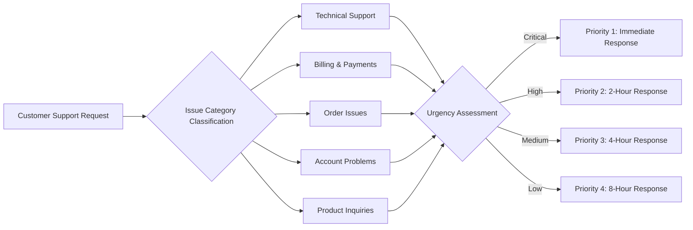
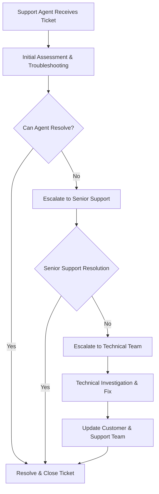
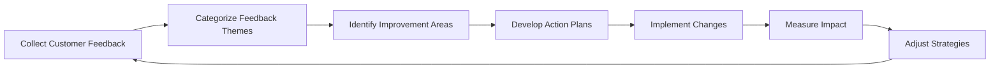

# Customer Support and Communication Framework

## Introduction and Support System Overview

This document defines the comprehensive customer support framework for the shoppingMall e-commerce platform, establishing standardized processes for handling customer inquiries, issues, and feedback across all user interactions. The support system serves as the primary interface between customers and the platform, ensuring timely resolution of concerns while maintaining high customer satisfaction standards.

The customer support framework integrates multiple communication channels, automated ticket management, and systematic resolution workflows to provide seamless support experiences for customers, sellers, and administrators alike.

## Customer Communication Channels

### Multi-Channel Support Access
The shoppingMall platform SHALL provide multiple communication channels for customer support requests, ensuring accessibility across different customer preferences and urgency levels.

#### Primary Support Channels
**WHEN** a customer needs assistance, **THE** system **SHALL** provide the following communication options:
- **Email Support**: Dedicated support email address with automated ticket creation
- **In-App Messaging**: Real-time chat interface accessible from all platform pages
- **Phone Support**: Toll-free customer service hotline for urgent issues
- **Help Center**: Comprehensive knowledge base with searchable articles and tutorials
- **Social Media Integration**: Support requests via official social media channels

#### Channel-Specific Requirements
**WHERE** customers use email support, **THE** system **SHALL** automatically generate support tickets with unique tracking numbers and send confirmation emails.

**WHEN** customers initiate in-app messaging, **THE** system **SHALL** provide immediate connection to available support agents during business hours.

**IF** phone support is unavailable outside business hours, **THEN THE** system **SHALL** offer callback scheduling and alternative contact methods.

### Support Availability and Response Times
**THE** system **SHALL** maintain the following service level agreements for support availability:
- **Email Support**: Initial response within 4 business hours
- **In-App Messaging**: Immediate connection during business hours (9 AM - 6 PM local time)
- **Phone Support**: Live agent availability during business hours
- **Weekend Support**: Limited email support with 24-hour response time

## Support Ticket Management System

### Automated Ticket Creation
**WHEN** a customer submits a support request through any channel, **THE** system **SHALL** automatically create a support ticket with the following attributes:
- Unique ticket identifier (format: TKT-YYYYMMDD-XXXXX)
- Customer account information and contact details
- Issue category and priority classification
- Submission timestamp and initial status
- Communication channel identification

### Ticket Classification and Prioritization
**THE** system **SHALL** classify support tickets based on issue type and urgency:

#### Priority Classification Criteria
**WHILE** processing support tickets, **THE** system **SHALL** apply the following priority criteria:
- **Priority 1 (Critical)**: System outages, payment failures, security incidents
- **Priority 2 (High)**: Order processing issues, account access problems
- **Priority 3 (Medium)**: Product inquiries, general account questions
- **Priority 4 (Low)**: Feature requests, general feedback

### Ticket Routing and Assignment
**WHEN** a support ticket is created, **THE** system **SHALL** automatically route it based on:
- Issue category and required expertise
- Customer language preference
- Support agent availability and workload
- Ticket priority level

**WHERE** specialized expertise is required, **THE** system **SHALL** route tickets to appropriate support teams (technical, billing, seller support, etc.).

### Ticket Status Tracking
**THE** system **SHALL** maintain comprehensive ticket status tracking throughout the resolution process:
- **New**: Initial ticket creation
- **In Progress**: Assigned to support agent
- **Awaiting Customer Response**: Waiting for customer information
- **Pending Internal Review**: Requires escalation or specialist input
- **Resolved**: Issue successfully closed
- **Closed**: Final resolution confirmed

## Issue Resolution Workflows

### Standard Resolution Process
**THE** support system **SHALL** follow standardized resolution workflows for common issue types:

#### Order-Related Issues
**WHEN** customers report order problems, **THE** support agent **SHALL**:
1. Verify order details and current status
2. Contact seller for order fulfillment updates
3. Provide tracking information to customer
4. Escalate to billing team for payment issues
5. Process refunds or replacements as needed

#### Account Access Problems
**IF** customers cannot access their accounts, **THEN THE** support agent **SHALL**:
1. Verify customer identity through security questions
2. Reset passwords or unlock accounts
3. Review account activity for security concerns
4. Document the resolution steps

#### Technical Support Requests
**WHERE** customers experience technical issues, **THE** support team **SHALL**:
1. Gather detailed error information and system specifications
2. Replicate the issue in test environments
3. Coordinate with technical teams for bug resolution
4. Provide workarounds or temporary solutions
5. Follow up until permanent resolution

### Escalation Procedures
**WHEN** support agents cannot resolve issues within their authority, **THE** system **SHALL** provide escalation paths:

#### Escalation Triggers
**THE** system **SHALL** automatically escalate tickets based on:
- Time-based escalation: Unresolved tickets after 24 hours
- Priority escalation: Critical issues requiring immediate attention
- Customer request escalation: Explicit customer requests for higher-level support
- Complexity escalation: Issues requiring specialized technical expertise

### Resolution Time Standards
**THE** support system **SHALL** adhere to the following resolution time standards:
- **Priority 1 Issues**: 4-hour maximum resolution time
- **Priority 2 Issues**: 24-hour maximum resolution time
- **Priority 3 Issues**: 48-hour maximum resolution time
- **Priority 4 Issues**: 5-business day maximum resolution time

## Feedback and Review Management

### Customer Feedback Collection
**WHEN** support tickets are closed, **THE** system **SHALL** automatically send customer satisfaction surveys to gather feedback on:
- Support agent responsiveness and professionalism
- Issue resolution effectiveness
- Overall support experience satisfaction
- Platform improvement suggestions

#### Survey Requirements
**THE** customer satisfaction survey **SHALL** include:
- 5-point rating scale for various support aspects
- Open-ended feedback section for detailed comments
- Net Promoter Score (NPS) measurement
- Optional follow-up contact permission

### Review Management System
**THE** platform **SHALL** provide comprehensive review management capabilities for:

#### Product Reviews
**WHEN** customers submit product reviews, **THE** system **SHALL**:
- Validate purchase authenticity before review publication
- Moderate reviews for inappropriate content
- Provide seller response functionality
- Calculate and display average ratings

#### Seller Reviews
**WHERE** customers rate seller performance, **THE** system **SHALL**:
- Collect ratings based on order fulfillment metrics
- Display seller reputation scores prominently
- Enable seller responses to customer feedback
- Track seller performance trends over time

### Feedback Analysis and Reporting
**THE** system **SHALL** automatically analyze customer feedback to:
- Identify common issues and improvement opportunities
- Track customer satisfaction trends over time
- Generate performance reports for support teams
- Provide insights for platform enhancement

## Performance Metrics and Service Level Agreements

### Key Performance Indicators (KPIs)
**THE** support system **SHALL** track and report on the following performance metrics:

#### Response Time Metrics
- **First Response Time**: Average time to initial customer contact
- **Resolution Time**: Average time to complete ticket resolution
- **First Contact Resolution Rate**: Percentage of issues resolved in initial interaction

#### Quality Metrics
- **Customer Satisfaction Score**: Average rating from post-resolution surveys
- **Support Agent Performance**: Individual agent resolution rates and customer ratings
- **Ticket Volume Trends**: Support request patterns and seasonal variations

### Service Level Agreements (SLAs)
**THE** platform **SHALL** maintain the following service level commitments:

#### Availability SLAs
- **Support Channel Availability**: 99.5% uptime for all digital support channels
- **Phone Support Availability**: 95% call answer rate during business hours
- **Email Response**: 90% of emails answered within SLA timeframes

#### Resolution SLAs
- **Critical Issues**: 95% resolved within 4 hours
- **High Priority Issues**: 90% resolved within 24 hours
- **Standard Issues**: 85% resolved within 48 hours
- **All Issues**: 80% first contact resolution rate

### Performance Monitoring and Reporting
**WHILE** the support system operates, **THE** platform **SHALL**:
- Generate daily performance dashboards for support managers
- Provide real-time monitoring of support queue status
- Automatically alert managers of SLA breaches
- Produce monthly performance reports for business review

## Customer Satisfaction Measurement

### Continuous Improvement Process
**THE** support system **SHALL** implement continuous improvement based on customer feedback:

#### Feedback Analysis Workflow

### Customer Satisfaction Metrics
**THE** system **SHALL** track and report comprehensive customer satisfaction measurements:
- **Overall Satisfaction Score**: Combined metric from all feedback channels
- **Channel-Specific Satisfaction**: Performance ratings by communication method
- **Issue-Type Satisfaction**: Resolution effectiveness by problem category
- **Trend Analysis**: Satisfaction changes over time and across improvements

### Support Quality Assurance
**THE** support management **SHALL** implement quality assurance processes including:
- Regular review of support interactions and resolutions
- Mystery shopping and quality assessment programs
- Support agent training and performance coaching
- Process optimization based on performance data

## Integration with Other Platform Functions

### Cross-Functional Support Coordination
**THE** customer support system **SHALL** integrate with other platform functions to ensure comprehensive issue resolution:

#### Seller Coordination
**WHEN** support issues involve seller actions, **THE** system **SHALL**:
- Provide direct communication channels between support and sellers
- Track seller response times for support inquiries
- Escalate seller-related issues to account management teams

#### Technical Team Integration
**WHERE** technical issues require development team involvement, **THE** support system **SHALL**:
- Create bug reports with detailed reproduction steps
- Track technical issue resolution timelines
- Provide customer updates on technical problem status

#### Billing and Payment Support
**IF** support requests involve financial transactions, **THEN THE** system **SHALL**:
- Coordinate with finance teams for refund processing
- Provide transaction dispute resolution support
- Maintain secure handling of financial information

### Support System Scalability
**THE** customer support framework **SHALL** be designed to scale with platform growth:
- Support for multiple languages and regional requirements
- Ability to handle increasing ticket volumes without degradation
- Flexible staffing models to accommodate seasonal variations
- Integration with emerging communication technologies

This customer support framework establishes the foundation for delivering exceptional customer service throughout the shoppingMall platform, ensuring that customer inquiries are handled efficiently, professionally, and with consistent quality across all interaction channels.