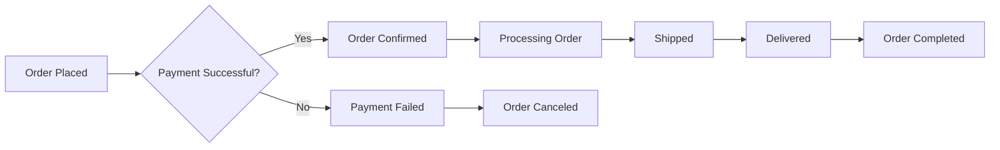

# Business Rules and Operational Constraints

## Executive Summary

This document defines the complete set of business rules, validation requirements, and operational constraints for the e-commerce shopping mall platform. These rules govern product management, order processing, user behavior, and platform operations to ensure legal compliance, maintain quality standards, and protect all stakeholders. The platform operates under a multi-vendor marketplace model with distinct user roles and comprehensive operational guidelines.

## 1. Product Management Rules

### 1.1 Product Listing Requirements

**WHEN** a seller creates a new product listing, **THE** system **SHALL** validate the following mandatory fields:
- Product title (minimum 5 characters, maximum 100 characters)
- Product description (minimum 20 characters, maximum 2000 characters)
- Product price (positive numeric value with 2 decimal places)
- Stock quantity (non-negative integer)
- Product category (must exist in platform categories)

**THE** system **SHALL** automatically flag products with prices significantly below market average for manual review.

**WHILE** a product is under review by administrators, **THE** system **SHALL** prevent the product from appearing in search results and product listings.

**IF** a product's stock quantity reaches zero, **THEN THE** system **SHALL** automatically mark the product as "Out of Stock" and remove it from active product listings.

### 1.2 Product Pricing Rules

**WHERE** a seller offers a discount, **THE** system **SHALL** validate that the discounted price is lower than the original price.

**WHEN** a product price is updated, **THE** system **SHALL** maintain price history for audit purposes.

**THE** system **SHALL** prevent sellers from setting prices below a minimum threshold of $0.99.

## 2. Order Processing Constraints

### 2.1 Order Creation Rules

**WHEN** a customer places an order, **THE** system **SHALL** verify that all selected products are still available and in stock.

**IF** an ordered product becomes unavailable during checkout, **THEN THE** system **SHALL** notify the customer and remove unavailable items from the cart.

**WHILE** an order is being processed, **THE** system **SHALL** prevent modifications to the order contents.

**WHEN** an order is confirmed, **THE** system **SHALL** reserve the inventory for the ordered quantity.

### 2.2 Order Status Transitions

**THE** system **SHALL** enforce the following order status progression:
- Placed → Confirmed → Processing → Shipped → Delivered → Completed
- **OR** Placed → Payment Failed → Canceled

**IF** an order remains in "Processing" status for more than 48 hours, **THEN THE** system **SHALL** automatically escalate the order to seller management.

## 3. User Account Restrictions

### 3.1 Account Registration Rules

**WHEN** a user registers for a new account, **THE** system **SHALL** validate:
- Email address format and uniqueness
- Password strength (minimum 8 characters with at least one uppercase letter, one lowercase letter, and one number)

**THE** system **SHALL** require email verification before allowing users to make purchases.

**WHILE** a user account is under review, **THE** system **SHALL** restrict account functionality.

### 3.2 User Behavior Constraints

**WHEN** a user attempts to post a review, **THE** system **SHALL** verify that the user has actually purchased the product being reviewed.

**IF** a user fails login attempts 5 times within 30 minutes, **THEN THE** system **SHALL** temporarily lock the account for 15 minutes.

**THE** system **SHALL** limit users to one review per purchased product.

## 4. Platform Usage Policies

### 4.1 Content Moderation Rules

**WHEN** user-generated content is flagged by other users, **THE** system **SHALL** automatically hide the content pending administrative review.

## 5. Seller Management Constraints

### 5.1 Seller Registration Requirements

**WHEN** a business applies to become a seller, **THE** system **SHALL** require:
- Business registration documents
- Tax identification number
- Bank account information for payouts

**THE** system **SHALL** automatically suspend seller accounts that receive more than 3 customer complaints within a 7-day period.

**WHILE** a seller account is suspended, **THE** system **SHALL** prevent the seller from:
- Listing new products
- Processing new orders
- Withdrawing funds

### 5.2 Seller Performance Metrics

**THE** system **SHALL** monitor and enforce:
- Order fulfillment rate (minimum 95% for active sellers)
- Average response time to customer inquiries (maximum 24 hours)

## 6. Payment and Financial Rules

### 6.1 Payment Processing Constraints

**WHEN** processing a payment, **THE** system **SHALL**:
- Validate payment method details
- Ensure sufficient funds are available
- Process payment within 30 seconds

**IF** a payment transaction fails, **THEN THE** system **SHALL**:
- Notify the customer immediately
- Preserve the shopping cart contents
- Allow retry of payment method

**THE** system **SHALL** hold seller funds for 7 days after order delivery to allow for potential returns or disputes.

## 7. Customer Protection Rules

### 7.1 Return and Refund Policies

**WHEN** a customer requests a return, **THE** system **SHALL** validate:
- Return request is within 30 days of delivery
- Product is in original condition with packaging
- Return shipping costs are covered by the customer unless the return is due to seller error.

**THE** system **SHALL** automatically process refunds for returned items within 3 business days of receipt.

**WHILE** a return is being processed, **THE** system **SHALL** prevent the customer from purchasing the same product until the return is completed.

### 7.2 Dispute Resolution

**WHEN** a dispute is filed between a customer and seller, **THE** system **SHALL**:
- Escalate to customer support after 48 hours without resolution

## 8. Platform Security and Compliance

### 8.1 Data Protection Rules

**THE** system **SHALL** encrypt all sensitive user data including:
- Payment information
- Personal identification details
- Communication history

**IF** a security breach is detected, **THEN THE** system **SHALL**:
- Immediately notify affected users
- Temporarily suspend affected accounts
- Require password reset for affected users

### 8.2 Legal Compliance Requirements

**WHEN** handling user data, **THE** system **SHALL** comply with data protection regulations including GDPR, CCPA, and other applicable laws.

## 9. Operational Performance Rules

### 9.1 System Availability Requirements

**THE** system **SHALL** maintain 99.9% uptime during business hours.

**THE** system **SHALL** process all search queries within 2 seconds.

**WHEN** loading product pages, **THE** system **SHALL** display content within 3 seconds.

**WHEN** a user performs any action, **THE** system **SHALL** provide feedback within 1 second.

## 10. Escalation and Support Rules

### 10.1 Customer Support Response Times

**WHEN** a customer submits a support ticket, **THE** system **SHALL**:
- Acknowledge receipt within 5 minutes
- Provide initial response within 2 hours
- Resolve standard issues within 24 hours

## 11. Business Continuity Rules

### 11.1 Backup and Recovery Requirements

**THE** system **SHALL** perform automated backups every 6 hours.

**IF** a seller fails to respond to a customer inquiry within 48 hours, **THEN THE** system **SHALL**:
- Notify the seller of pending inquiries
- Escalate to administrative review after 72 hours

## 12. Platform Maintenance Rules

### 12.1 System Update Procedures

**WHEN** performing platform updates, **THE** system **SHALL**:
- Schedule maintenance during low-traffic periods
- Provide users with 48-hour advance notice of scheduled maintenance.

**WHILE** maintenance is being performed, **THE** system **SHALL** display a maintenance notification with estimated completion time.

**THE** system **SHALL** prevent order processing during scheduled maintenance windows.

## 13. Analytics and Reporting Rules

### 13.1 Performance Monitoring

**THE** system **SHALL** track and report:
- Daily active users and monthly active users
- Conversion rates and average order value
- Seller performance metrics and compliance rates

**THE** system **SHALL** generate daily sales reports for sellers and weekly performance reports for administrators.

## 14. Risk Management Rules

### 14.1 Fraud Detection and Prevention

**WHEN** detecting suspicious activity patterns, **THE** system **SHALL** automatically flag accounts for review.

## 15. Platform Governance Rules

### 15.1 Policy Enforcement Framework

**THE** system **SHALL** automatically enforce platform policies for:
- Product quality standards
- Seller performance requirements
- Customer satisfaction metrics

**THE** system **SHALL** automatically suspend accounts involved in fraudulent activities.

## 16. Compliance and Audit Requirements

### 16.1 Record Keeping Rules

**THE** system **SHALL** maintain complete transaction records for a minimum of 7 years for tax and legal compliance purposes.

## 17. User Communication Rules

### 17.1 Notification Preferences

**WHEN** a user updates notification preferences, **THE** system **SHALL** immediately apply the new settings to all future communications.

## 18. Technical Operation Rules

### 18.1 System Scaling Requirements

**THE** system **SHALL** support up to 10,000 concurrent users during peak shopping periods.

**THE** system **SHALL** maintain response times under 2 seconds even at maximum capacity.

## 19. Data Retention and Deletion Rules

### 19.1 User Data Management

**WHEN** a user requests account deletion, **THE** system **SHALL**:
- Process deletion requests within 72 hours
- Remove all personally identifiable information
- Retain anonymized transaction data for analytics purposes.

## 20. Platform Evolution Rules

### 20.1 Feature Development Guidelines

**WHEN** implementing new features, **THE** system **SHALL** maintain backward compatibility for existing APIs and user interfaces.

## Conclusion

These business rules and operational constraints form the foundation for a secure, compliant, and scalable e-commerce platform. All system operations must adhere to these guidelines to ensure consistent user experience, maintain platform integrity, and protect all stakeholders' interests.

> *Developer Note: This document defines **business requirements only**. All technical implementations (architecture, APIs, database design, etc.) are at the discretion of the development team.*