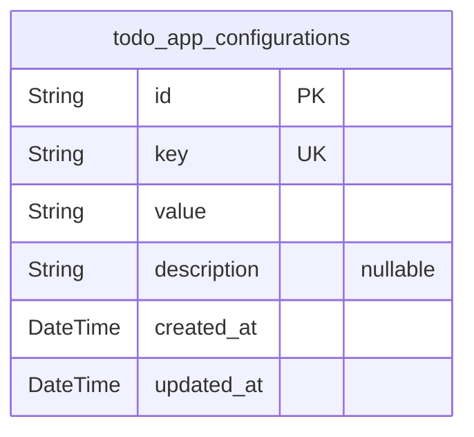
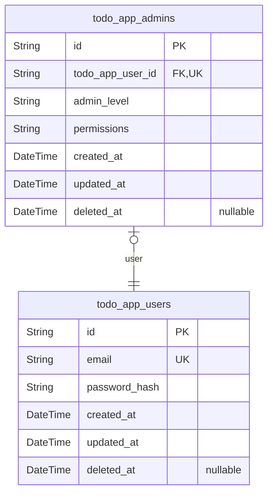
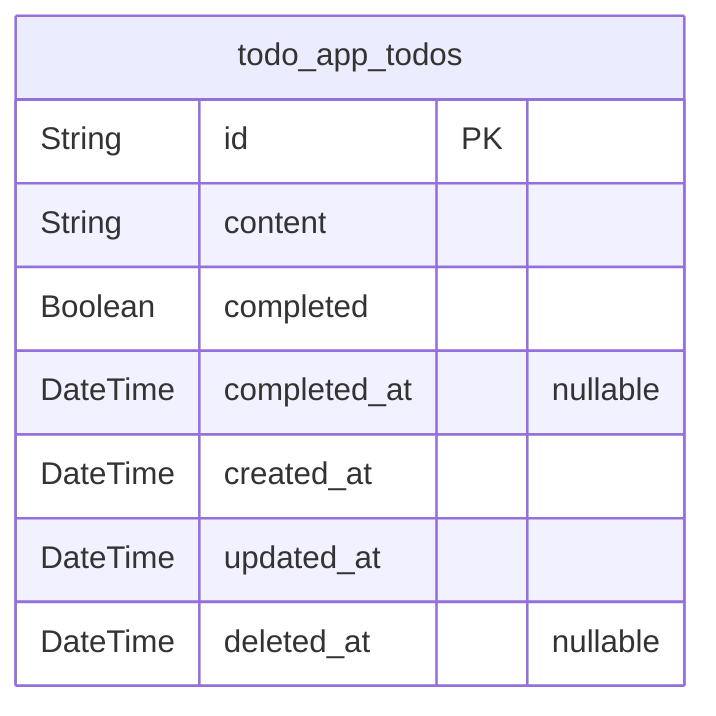

# Prisma Markdown

> Generated by [`prisma-markdown`](https://github.com/samchon/prisma-markdown)

- [Systematic](#systematic)
- [Actors](#actors)
- [Todos](#todos)

## Systematic

### `todo_app_configurations`

System-level configuration settings for the Todo application. Stores
key-value pairs for application configuration, feature flags, and system
metadata that can be referenced by other components. {@link
todo_app_users} [todo_app_admins](#todo_app_admins) [todo_app_todos](#todo_app_todos)

Properties as follows:

- `id`: Primary Key.
- `key`
  > Unique configuration key identifier. Used to reference specific
  > configuration settings throughout the application.
- `value`
  > Configuration value stored as string. Can represent various data types
  > including boolean flags, numeric values, or JSON configuration objects.
- `description`
  > Human-readable description explaining the purpose and usage of this
  > configuration setting.
- `created_at`: Timestamp when this configuration was first created.
- `updated_at`: Timestamp when this configuration was last modified.

## Actors

### `todo_app_users`

User account for the Todo application. Represents individual users who
can create and manage their personal todo items. [todo_app_todos](#todo_app_todos)

Properties as follows:

- `id`: Primary Key.
- `email`
  > User's email address for authentication and notifications. Must be unique
  > across all users.
- `password_hash`: Hashed password for user authentication. Never store plain passwords.
- `created_at`: Timestamp when the user account was created.
- `updated_at`: Timestamp when the user account was last updated.
- `deleted_at`: Timestamp when the user account was soft deleted. Null if active.

### `todo_app_admins`

Administrator account for the Todo application. Admins have system-wide
access and can perform maintenance operations. [todo_app_users](#todo_app_users)

Properties as follows:

- `id`: Primary Key.
- `todo_app_user_id`: Reference to the base user account. [todo_app_users.id](#todo_app_users)
- `admin_level`: Administrator privilege level (e.g., 'super_admin', 'system_admin').
- `permissions`: Comma-separated list of system permissions granted to this admin.
- `created_at`: Timestamp when the admin account was created.
- `updated_at`: Timestamp when the admin account was last updated.
- `deleted_at`: Timestamp when the admin account was soft deleted. Null if active.

## Todos

### `todo_app_todos`

Core todo items for personal task management. Stores individual todo
tasks with their completion status and timestamps for the single-user
Todo application. Users can create, read, update completion status, and
delete todo items through basic CRUD operations.

Properties as follows:

- `id`: Primary Key.
- `content`
  > The text content of the todo item. Limited to 500 characters as per
  > business requirements for task descriptions.
- `completed`
  > Completion status of the todo item. False indicates pending, true
  > indicates completed.
- `completed_at`
  > Timestamp when the todo item was marked as completed. Null if not
  > completed yet.
- `created_at`: Timestamp when the todo item was created.
- `updated_at`: Timestamp when the todo item was last modified.
- `deleted_at`
  > Timestamp when the todo item was soft deleted. Null indicates the todo is
  > active.
