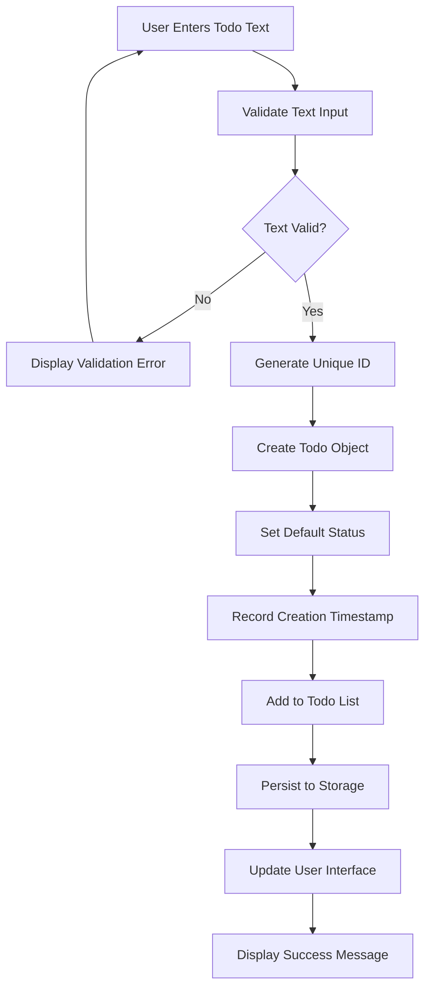
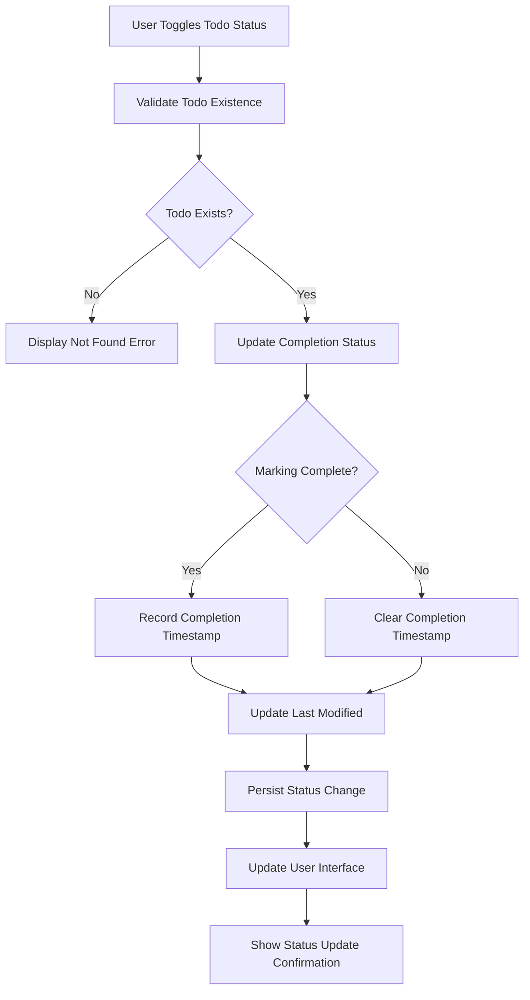
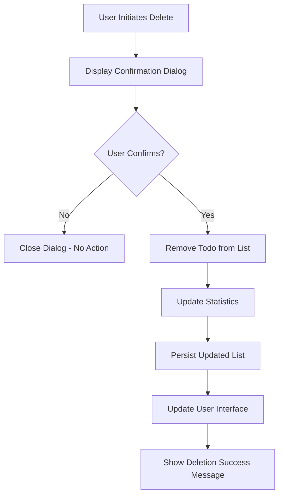

# Todo List Application - Functional Requirements

## 1. Introduction

### 1.1 Business Purpose
The Todo List Application provides a minimal, single-user task management system designed for personal productivity. The application addresses the fundamental need for simple, distraction-free task organization without the complexity of feature-rich productivity tools. By focusing exclusively on core CRUD operations and eliminating authentication barriers, the system delivers immediate value through streamlined task management.

### 1.2 Application Vision
This application serves users who seek immediate access to basic todo functionality without account creation, learning curves, or feature overload. The vision centers on providing reliable, persistent task management that requires zero setup time and minimal cognitive overhead for daily use.

### 1.3 Scope Definition
The application scope is deliberately constrained to four essential operations:
- **Create**: Add new todo items to the list
- **Read**: View all existing todo items
- **Update**: Mark items as completed/incomplete
- **Delete**: Remove items from the list

**Excluded by Design**: User authentication, task categorization, due dates, prioritization, collaboration features, advanced filtering, and notification systems.

### 1.4 Success Criteria
- Users can perform all core operations within 30 seconds of first use
- 99.9% uptime for core functionality
- Sub-second response time for all CRUD operations
- Consistent daily usage patterns indicating user adoption
- Zero data loss incidents in normal operation

## 2. Authentication Requirements

### 2.1 User Role Definitions

**User Role**
THE user SHALL be the primary role responsible for managing personal todo items with complete control over their task list.

**User Capabilities:**
- WHEN accessing the application, THE user SHALL automatically authenticate without credentials
- WHEN creating todo items, THE user SHALL have exclusive ownership of created items
- WHEN viewing the todo list, THE user SHALL see only their personal items
- WHEN modifying todo status, THE user SHALL update only their owned items
- WHEN deleting todos, THE user SHALL remove only their owned items

**Admin Role**
THE admin SHALL have comprehensive system access for maintenance and oversight functions.

**Admin Capabilities:**
- WHEN managing system settings, THE admin SHALL access all configuration options
- WHEN viewing statistics, THE admin SHALL access system-wide usage data
- WHEN performing maintenance, THE admin SHALL execute system-level operations
- WHEN resetting data, THE admin SHALL clear all user data when necessary

### 2.2 Authentication Flow Requirements

**Automatic User Authentication**
- WHEN a user accesses the application, THE system SHALL automatically authenticate the single user
- THE system SHALL maintain user session state throughout application usage
- WHEN the application restarts, THE system SHALL restore user authentication automatically
- WHERE network connectivity is unavailable, THE system SHALL maintain local authentication

**Session Management**
- THE system SHALL maintain user session for the duration of application usage
- WHEN the user closes the application, THE system SHALL preserve authentication state
- WHERE session data becomes corrupted, THE system SHALL reinitialize with clean state
- THE system SHALL provide seamless session continuity across application restarts

**Token Management**
- WHEN the application initializes, THE system SHALL generate persistent authentication tokens
- THE system SHALL store authentication tokens securely in local storage
- WHERE token validation fails, THE system SHALL re-authenticate automatically
- THE system SHALL refresh tokens periodically to maintain session validity

### 2.3 Permission Matrix

| Operation | User Permissions | Admin Permissions |
|-----------|------------------|-------------------|
| Create todo item | ✅ Full access | ✅ Full access |
| Read own todo items | ✅ Full access | ✅ Full access |
| Read all todo items | ❌ No access | ✅ Full access |
| Update own todo items | ✅ Full access | ✅ Full access |
| Update all todo items | ❌ No access | ✅ Full access |
| Delete own todo items | ✅ Full access | ✅ Full access |
| Delete all todo items | ❌ No access | ✅ Full access |
| Mark todo complete | ✅ Full access | ✅ Full access |
| Mark todo incomplete | ✅ Full access | ✅ Full access |
| Access system settings | ❌ No access | ✅ Full access |
| View usage statistics | ❌ No access | ✅ Full access |
| Perform maintenance | ❌ No access | ✅ Full access |

### 2.4 Security Requirements

**Data Isolation**
- THE system SHALL ensure users can only access their personal todo items
- WHERE multiple user capability is added, THE system SHALL maintain data separation
- THE system SHALL prevent cross-user data access in all operations

**Input Validation**
- WHEN processing authentication requests, THE system SHALL validate all input parameters
- THE system SHALL prevent injection attacks through proper input sanitization
- WHERE malicious input is detected, THE system SHALL reject the operation

**Token Security**
- THE system SHALL implement proper token validation mechanisms
- WHERE token tampering is detected, THE system SHALL invalidate the session
- THE system SHALL store tokens securely to prevent unauthorized access

## 3. Core Todo Management Functions

### 3.1 Todo Creation Process

**Basic Todo Creation**
- WHEN a user provides todo text content, THE system SHALL create a new todo item
- THE todo item SHALL include:
  - Unique identifier generated using UUID v4 format
  - Text content provided by the user
  - Creation timestamp in ISO 8601 format
  - Default "incomplete" completion status
  - Last modified timestamp matching creation time

**Input Validation Requirements**
- WHEN creating a todo item, THE system SHALL validate that todo text is not empty
- WHERE todo text contains only whitespace, THE system SHALL reject the creation
- WHEN todo text exceeds 500 characters, THE system SHALL truncate to 500 characters
- THE system SHALL sanitize todo text to prevent HTML injection attacks
- WHERE malicious content is detected, THE system SHALL reject the creation

**Creation Flow Diagram**

### 3.2 Todo Reading and Display

**Todo List Retrieval**
- WHEN a user views the todo list, THE system SHALL retrieve all existing todo items
- THE system SHALL display todos in creation order with newest items at the top
- WHERE sorting preference is implemented, THE system SHALL respect user sorting choice
- THE system SHALL clearly distinguish between completed and incomplete todos

**Status Display Requirements**
- THE system SHALL provide visual indicators for completion status
- WHERE completion status changes, THE system SHALL update display immediately
- THE system SHALL display creation timestamps for all todo items
- THE system SHALL provide todo count statistics (total, completed, remaining)

**Empty State Handling**
- WHEN no todos exist, THE system SHALL display helpful empty state messaging
- THE empty state SHALL provide clear guidance for creating the first todo
- WHERE the user has completed all todos, THE system SHALL show completion celebration

### 3.3 Todo Status Updates

**Marking Todos Complete**
- WHEN a user marks a todo item as completed, THE system SHALL:
  - Update status from "incomplete" to "completed"
  - Record completion timestamp in ISO 8601 format
  - Update last modified timestamp
  - Persist the status change immediately
  - Provide visual confirmation of the update

**Marking Todos Incomplete**
- WHEN a user marks a completed todo as incomplete, THE system SHALL:
  - Update status from "completed" to "incomplete"
  - Clear the completion timestamp
  - Update last modified timestamp
  - Persist the status change immediately
  - Provide visual confirmation of the update

**Status Update Flow Diagram**

### 3.4 Todo Deletion

**Single Todo Deletion**
- WHEN a user requests to delete a specific todo item, THE system SHALL:
  - Display confirmation dialog showing the todo text
  - Provide clear "Confirm" and "Cancel" options
  - WHERE confirmed, remove the todo from the list
  - Update todo count statistics
  - Persist the updated list
  - Remove the todo from the display
  - Provide deletion confirmation feedback

**Bulk Todo Management**
- WHEN a user selects multiple todos for deletion, THE system SHALL:
  - Display confirmation showing count of selected items
  - Provide option to confirm or cancel bulk deletion
  - WHERE confirmed, remove all selected todos
  - Update statistics for multiple removals
  - Persist the updated list
  - Provide bulk deletion confirmation

**Deletion Flow Diagram**

### 3.5 Todo Editing

**Text Content Updates**
- WHEN a user edits the text content of an existing todo, THE system SHALL:
  - Validate the new text meets all creation requirements
  - Update the todo text content
  - Update the last modified timestamp
  - Persist the text change immediately
  - Provide visual confirmation of successful editing
  - Maintain all other todo properties unchanged

**Edit Validation**
- WHERE edited text is empty, THE system SHALL reject the update
- WHEN edited text exceeds 500 characters, THE system SHALL truncate appropriately
- THE system SHALL preserve the original creation timestamp during edits
- WHERE edit validation fails, THE system SHALL display specific error messages

## 4. Data Persistence Requirements

### 4.1 Storage Architecture

**Persistent Storage Implementation**
- THE system SHALL store all todo items persistently using browser local storage
- WHEN the application initializes, THE system SHALL load previously stored todos
- WHERE storage is unavailable, THE system SHALL initialize with empty state
- THE system SHALL maintain data consistency across application restarts

**Data Structure Requirements**
- THE system SHALL store todos in JSON format for portability
- EACH todo item SHALL include:
  - Unique identifier (UUID v4)
  - Text content (string, 1-500 characters)
  - Completion status (boolean)
  - Creation timestamp (ISO 8601)
  - Last modified timestamp (ISO 8601)
  - Completion timestamp (ISO 8601, nullable)

**Storage Reliability**
- THE system SHALL implement atomic write operations to prevent data corruption
- WHEN storage operations fail, THE system SHALL maintain in-memory state
- WHERE data corruption is detected, THE system SHALL attempt recovery
- THE system SHALL provide data backup mechanisms for critical operations

### 4.2 Data Retrieval and Loading

**Initial Data Loading**
- WHEN the application starts, THE system SHALL attempt to load stored todo data
- WHERE stored data exists, THE system SHALL validate data integrity
- IF data validation fails, THE system SHALL initialize with empty state
- THE system SHALL display loading progress during data retrieval

**Real-time Data Synchronization**
- WHEN user makes changes to todos, THE system SHALL persist changes immediately
- THE system SHALL provide visual feedback during save operations
- WHERE save operations fail, THE system SHALL retry with exponential backoff
- THE system SHALL maintain data consistency during concurrent operations

### 4.3 Data Integrity Requirements

**Unique Identification**
- THE system SHALL generate unique identifiers using UUID v4 format
- THE system SHALL prevent duplicate todo identifiers
- WHERE identifier collision occurs, THE system SHALL generate new identifier
- THE system SHALL maintain identifier consistency across application sessions

**Data Validation**
- WHEN loading stored data, THE system SHALL validate:
  - All required fields are present
  - Field types match expected formats
  - Data relationships are consistent
  - Timestamps are valid ISO 8601 format
- WHERE validation fails, THE system SHALL attempt data repair

## 5. Error Handling Scenarios

### 5.1 Input Validation Errors

**Empty Todo Text**
- IF a user attempts to create a todo with empty text, THEN THE system SHALL:
  - Display error message: "Todo text cannot be empty"
  - Highlight the input field requiring correction
  - Maintain focus on the input field for quick correction
  - Preserve any partial input for user convenience

**Text Length Exceeded**
- IF a user attempts to create a todo exceeding 500 characters, THEN THE system SHALL:
  - Display error message: "Todo text cannot exceed 500 characters"
  - Show current character count and limit
  - Provide truncation option with preview
  - Allow manual editing to meet length requirements

**Invalid Character Input**
- IF a user attempts to input malicious content, THEN THE system SHALL:
  - Display security error message
  - Reject the input without processing
  - Log the attempted security violation
  - Provide clean input field for retry

### 5.2 Data Access Errors

**Todo Not Found**
- IF a user attempts to access a non-existent todo, THEN THE system SHALL:
  - Display error message: "Todo item not found"
  - Refresh the todo list display
  - Log the access attempt for debugging
  - Provide navigation back to main list

**Storage Access Failures**
- IF the system cannot access persistent storage, THEN THE system SHALL:
  - Display error message: "Unable to save changes. Please try again."
  - Maintain current state in memory
  - Provide retry option for save operation
  - Continue operation with temporary storage

**Data Corruption**
- IF stored data becomes corrupted, THEN THE system SHALL:
  - Display recovery message: "Data issue detected. Starting fresh."
  - Initialize with empty todo list
  - Log corruption details for analysis
  - Provide option to attempt data recovery

### 5.3 System Errors

**Application Crashes**
- IF the application crashes during operation, THEN THE system SHALL:
  - Attempt to recover most recent state upon restart
  - Display recovery status during initialization
  - WHERE recovery impossible, initialize with empty state
  - Log crash details for improvement analysis

**Memory Constraints**
- IF system memory constraints prevent operations, THEN THE system SHALL:
  - Display message: "System resources limited. Please try again later."
  - Provide option to clear completed todos
  - Suggest reducing todo list size
  - Maintain application stability despite constraints

**Network Connectivity Issues**
- WHERE network-dependent features exist, THEN THE system SHALL:
  - Gracefully degrade to offline functionality
  - Display connectivity status clearly
  - Queue operations for later synchronization
  - Provide manual sync option when connectivity returns

## 6. Performance Expectations

### 6.1 Response Time Requirements

**Todo Operations Performance**
- WHEN a user creates a new todo, THE system SHALL respond within 500 milliseconds
- WHEN a user updates a todo status, THE system SHALL respond within 300 milliseconds
- WHEN a user deletes a todo, THE system SHALL respond within 300 milliseconds
- WHEN a user edits todo text, THE system SHALL respond within 400 milliseconds
- WHEN the application loads, THE system SHALL display todos within 2 seconds

**User Interface Performance**
- THE system SHALL provide immediate visual feedback for all user interactions
- THE system SHALL maintain smooth scrolling with up to 1,000 todo items
- THE system SHALL prevent interface freezing during data operations
- THE system SHALL update display within 100 milliseconds of state changes

### 6.2 Data Persistence Performance

**Storage Operations**
- THE system SHALL save todo changes within 200 milliseconds of user action
- THE system SHALL perform automatic saves without noticeable user impact
- THE system SHALL load stored data within 1 second of application startup
- THE system SHALL handle storage operations asynchronously to maintain responsiveness

**Memory Management**
- THE system SHALL efficiently manage memory for large todo lists
- WHERE memory constraints exist, THE system SHALL implement pagination
- THE system SHALL optimize rendering performance for extensive todo collections
- THE system SHALL maintain responsive performance with up to 1,000 active todos

### 6.3 Scalability Requirements

**User Capacity**
- THE system SHALL support single-user operation with no multi-user scaling requirements
- THE system SHALL handle gradual growth in todo count without architectural changes
- WHERE performance degrades, THE system SHALL implement optimization strategies

**Data Volume Handling**
- THE system SHALL efficiently handle up to 1,000 todo items
- WHERE todo count exceeds 1,000, THE system SHALL maintain functional performance
- THE system SHALL implement efficient data structures for large collections

## 7. Business Rules and Constraints

### 7.1 Validation Rules

**Todo Text Validation**
- THE todo text content SHALL be required and cannot be empty
- THE todo text content SHALL have a minimum length of 1 character
- THE todo text content SHALL have a maximum length of 500 characters
- THE todo text content SHALL accept alphanumeric characters, spaces, and common punctuation
- THE system SHALL trim leading and trailing whitespace from todo text
- THE system SHALL reject todo text containing only whitespace characters

**Completion Status Rules**
- THE completion status SHALL be a boolean value (true/false)
- THE system SHALL track completion timestamps for completed items
- THE system SHALL allow toggling between complete and incomplete states
- THE system SHALL prevent invalid status transitions

### 7.2 Data Management Rules

**Unique Identification**
- EACH todo item SHALL have a unique identifier using UUID v4 format
- THE system SHALL prevent duplicate todo identifiers
- THE system SHALL maintain identifier consistency across application sessions
- THE system SHALL validate identifier format during data operations

**Order Preservation**
- THE system SHALL maintain the creation order of todo items
- THE system SHALL allow configurable sorting (newest first/oldest first)
- THE system SHALL preserve order during application restarts
- THE system SHALL maintain sort order during status updates

### 7.3 Operational Constraints

**Single User Constraint**
- THE system SHALL support only one user account
- THE system SHALL not provide multi-user authentication
- ALL todo items SHALL belong to the single system user
- THE system SHALL maintain data isolation for the single user

**Feature Limitations**
- THE system SHALL not support todo categories or tags
- THE system SHALL not support due dates or reminders
- THE system SHALL not support todo priorities or urgency levels
- THE system SHALL not support todo sharing or collaboration
- THE system SHALL not support advanced search or filtering

## 8. Success Criteria

### 8.1 Functional Success Metrics
- Users can successfully create, read, update, and delete todo items with 99.9% reliability
- Todo items persist across application sessions with zero data loss in normal operation
- Completion status is accurately maintained with 100% consistency
- System responds within specified performance thresholds for 95% of operations
- Error conditions are handled gracefully with user-friendly messages
- Application maintains 99% availability during normal usage

### 8.2 User Experience Success Metrics
- Application is intuitive and requires no user training or documentation
- All operations provide immediate visual feedback within 500 milliseconds
- Data loss is prevented through robust persistence mechanisms
- System remains responsive under normal usage patterns
- Error recovery procedures maintain user confidence
- Interface remains consistent and predictable across all operations

### 8.3 Performance Success Metrics
- Page load time remains under 2 seconds for 95% of sessions
- CRUD operations complete within 500 milliseconds for 99% of requests
- Data persistence operations succeed with 99.9% reliability
- Application maintains responsive performance with up to 1,000 todo items
- Memory usage remains within reasonable bounds for the platform

### 8.4 Reliability Success Metrics
- Application recovers gracefully from unexpected closures
- Data integrity is maintained through all normal operations
- Error handling prevents application crashes in 99% of failure scenarios
- System maintains state consistency across all user interactions
- Storage operations complete atomically without partial updates

This enhanced functional requirements document provides comprehensive specifications for backend developers to implement a robust, user-friendly Todo list application. All requirements are specified using EARS format to ensure clarity and testability, with complete coverage of business processes, error scenarios, and performance expectations.