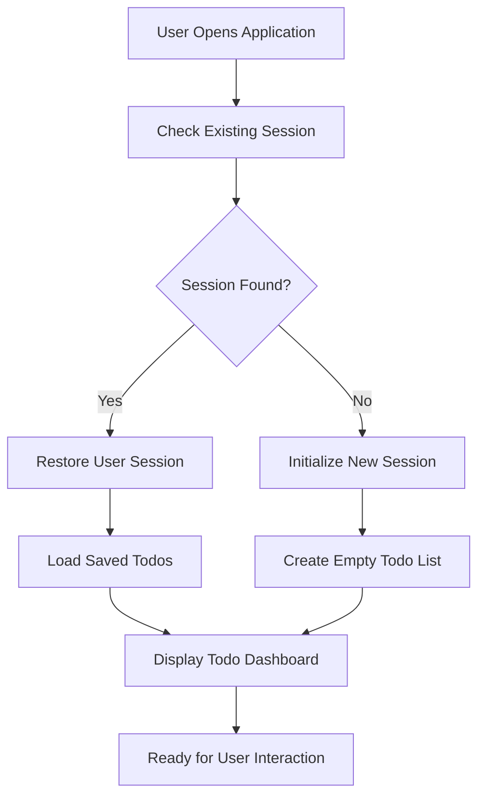
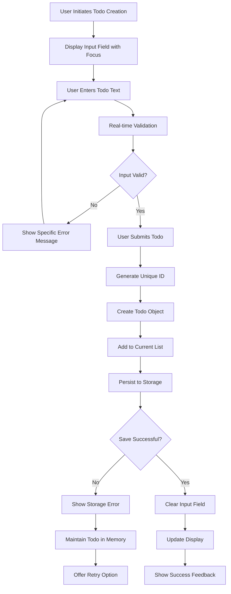

# User Journey Scenarios for Todo List Application

## Introduction

This document defines the complete user journey scenarios for the Todo List application, focusing on minimum functionality requirements. These scenarios provide backend developers with comprehensive understanding of user workflows, business processes, and system interactions required to implement the core todo management features.

### Document Scope and Purpose
This document covers all user interaction workflows for the single-user Todo List application, including authentication flows, todo management operations, error handling scenarios, and performance expectations. The scenarios ensure that developers understand the complete user experience from initial access through daily usage patterns.

### Business Context
The Todo List application serves individual users who need simple, reliable task management without complex features or authentication barriers. The user journeys focus on immediate usability, data persistence, and intuitive operation for personal productivity.

## User Registration and Setup Flow

### First-Time User Experience Journey

**Scenario**: User accesses the Todo application for the first time

1. **Initial Access**: WHEN a user opens the Todo application for the first time, THE system SHALL display a clean, intuitive interface with clear todo creation elements and an empty state message.

2. **Automatic User Setup**: THE system SHALL automatically create a single-user session without requiring authentication credentials or registration forms.

3. **Session Initialization**: THE system SHALL initialize a persistent user session that survives browser restarts and application reloads.

4. **Data Storage Setup**: THE system SHALL initialize local data storage and verify persistence capabilities are available.

5. **Welcome Experience**: THE system SHALL provide clear visual cues and minimal onboarding instructions for first-time users.

### Returning User Experience Journey

**Scenario**: User returns to the application after previous usage

1. **Session Restoration**: WHEN a user returns to the application, THE system SHALL automatically restore their previous session state.

2. **Data Loading**: THE system SHALL load all previously saved todo items with their exact completion status and creation order.

3. **Interface Restoration**: THE system SHALL display the todo list exactly as it appeared during the last session.

4. **State Recovery**: THE system SHALL recover any pending operations or unsaved changes from the previous session.

### User Journey Flow Diagram

## Todo Creation Process

### Complete Todo Creation Journey

**Scenario**: User creates a new todo item

1. **Initiation**: WHEN a user clicks the "Add Todo" button or enters text in the new todo input field, THE system SHALL display the input field with clear visual focus.

2. **Input Validation**: WHILE the user is entering todo text, THE system SHALL validate input in real-time and provide immediate feedback.

3. **Character Limit Monitoring**: THE system SHALL display remaining character count and enforce the 500-character maximum limit.

4. **Todo Submission**: WHEN the user submits the new todo (via Enter key or Add button), THE system SHALL:
   - Validate the todo text contains at least 1 non-whitespace character
   - Validate the todo text does not exceed 500 characters
   - Create a new todo item with unique identifier
   - Set default "incomplete" status
   - Record creation timestamp
   - Add the todo to the current list in creation order
   - Persist the updated todo list to storage
   - Clear the input field for the next todo
   - Update the display to show the new todo
   - Provide visual success feedback

5. **Order Preservation**: THE system SHALL maintain the creation order of todos and display them chronologically.

### Todo Creation Error Handling

**Scenario**: User attempts to create invalid todo

1. **Empty Todo Validation**: IF the user attempts to submit an empty todo or todo containing only whitespace, THEN THE system SHALL display the error message: "Todo text cannot be empty. Please enter a task description."

2. **Maximum Length Validation**: IF the user attempts to submit a todo exceeding 500 characters, THEN THE system SHALL display the error message: "Todo text cannot exceed 500 characters. Current length: X/500."

3. **Input Preservation**: WHEN validation fails, THE system SHALL preserve the user's input to allow correction rather than forcing re-entry.

4. **Error Recovery**: THE system SHALL provide clear guidance on how to fix the validation error and allow immediate retry.

### Todo Creation Flow Diagram

## Todo Management Workflows

### Viewing Todo List Journey

**Scenario**: User views their todo list

1. **List Display**: WHEN the application loads or the user navigates to the main screen, THE system SHALL display all existing todos in a clear, readable list with visual distinction between completed and incomplete items.

2. **Status Visualization**: THE system SHALL use clear visual indicators (checkboxes, strikethrough text, color coding) to distinguish completed and incomplete todos.

3. **Empty State Handling**: WHERE no todos exist, THE system SHALL display an encouraging empty state message with clear guidance for creating the first todo.

4. **Order Presentation**: THE system SHALL display todos in creation order by default, with newest items appearing at the bottom of the list.

5. **Statistics Display**: THE system SHALL show real-time statistics including total count, completed count, and completion percentage.

### Todo Status Management Journey

**Scenario**: User marks a todo as complete or incomplete

1. **Status Toggle Initiation**: WHEN a user clicks on a todo's completion status indicator (checkbox), THE system SHALL:
   - Identify the target todo item
   - Verify the todo exists in the current list
   - Toggle the completion status between "incomplete" and "completed"
   - Update the completion timestamp for completed items
   - Remove completion timestamp for incomplete items

2. **Immediate Feedback**: THE system SHALL provide immediate visual feedback showing the status change, including:
   - Checkbox state update
   - Text styling change (strikethrough for completed)
   - Color transition animation
   - Status confirmation message

3. **Persistence**: THE system SHALL immediately persist the status change to storage and confirm successful save.

4. **Statistics Update**: THE system SHALL recalculate and update completion statistics in real-time.

5. **Error Handling**: IF the status toggle fails, THE system SHALL revert the visual change and display an appropriate error message.

### Todo Deletion Journey

**Scenario**: User deletes a todo item

1. **Deletion Initiation**: WHEN a user clicks the delete button associated with a todo, THE system SHALL:
   - Highlight the todo item being considered for deletion
   - Display a confirmation dialog with the todo text
   - Provide clear "Confirm Delete" and "Cancel" options
   - Ensure the confirmation prevents accidental deletion

2. **Confirmation Processing**: IF the user confirms deletion, THEN THE system SHALL:
   - Remove the todo from the current list
   - Update list statistics
   - Persist the updated list to storage
   - Remove the todo from the display
   - Provide visual feedback confirming deletion
   - Show updated todo count

3. **Cancellation Handling**: IF the user cancels deletion, THEN THE system SHALL:
   - Close the confirmation dialog
   - Remove highlighting from the todo
   - Continue normal operation without changes

4. **Bulk Deletion Consideration**: WHERE multiple deletion operations occur rapidly, THE system SHALL process them sequentially to maintain data integrity.

### Todo Management Flow Diagram

```mermaid
graph TD
  subgraph "Todo Viewing Flow"
    A["User Views Todo List"] --> B["Load Todos from Storage"]
    B --> C{"Load Successful?"}
    C -->|"Yes"| D["Sort by Creation Time"]
    C -->|"No"| E["Show Loading Error"]
    E --> F["Initialize Empty List"]
    D --> G["Display Todo List"]
    F --> G
    G --> H["Show Completion Statistics"]
  end

  subgraph "Status Management Flow"
    I["User Clicks Status Toggle"] --> J["Identify Target Todo"]
    J --> K{"Todo Exists?"}
    K -->|"No"| L["Show Not Found Error"]
    K -->|"Yes"| M["Toggle Completion Status"]
    M --> N["Update Timestamps"]
    N --> O["Persist Changes"]
    O --> P{"Save Successful?"}
    P -->|"No"| Q["Show Save Error"]
    Q --> R["Revert Visual Change"]
    P -->|"Yes"| S["Update Visual Appearance"]
    S --> T["Recalculate Statistics"]
    T --> U["Show Status Feedback"]
  end

  subgraph "Todo Deletion Flow"
    V["User Initiates Delete"] --> W["Highlight Todo Item"]
    W --> X["Show Confirmation Dialog"]
    X --> Y{"User Confirms?"}
    Y -->|"Yes"| Z["Remove Todo from List"]
    Z --> AA["Update Statistics"]
    AA --> AB["Persist Updated List"]
    AB --> AC{"Save Successful?"}
    AC -->|"No"| AD["Show Save Error"]
    AD --> AE["Restore Todo Item"]
    AC -->|"Yes"| AF["Update Display"]
    AF --> AG["Show Deletion Feedback"]
    Y -->|"No"| AH["Close Dialog"]
    AH --> AI["Remove Highlighting"]
    AI --> AJ["No Changes Made"]
  end
```

## Error Recovery Scenarios

### Data Loading Failure Journey

**Scenario**: Application fails to load saved todos

1. **Loading Attempt**: WHEN the application attempts to load saved todos on startup, THE system SHALL try to retrieve persisted data from storage.

2. **Loading Failure Detection**: IF the system cannot load saved todos due to corruption, storage errors, or data format issues, THEN THE system SHALL:
   - Detect the specific error type (corruption, missing data, format error)
   - Display a clear, user-friendly error message indicating data loading failed
   - Initialize with an empty todo list as fallback
   - Provide option to retry loading
   - Log the detailed error for troubleshooting purposes
   - Maintain application functionality with empty state

3. **Recovery Options**: WHERE data loading fails, THE system SHALL provide the user with:
   - Option to retry loading immediately
   - Option to start with fresh empty list
   - Clear explanation of what happened
   - Assurance that core functionality remains available

4. **Data Preservation**: THE system SHALL preserve any corrupted data separately to allow potential manual recovery.

### Data Saving Failure Journey

**Scenario**: Application fails to save todo changes

1. **Saving Attempt**: WHEN the system attempts to persist todo changes to storage, THE system SHALL try to save with error handling.

2. **Saving Failure Response**: IF the system cannot save changes due to storage errors, permission issues, or space constraints, THEN THE system SHALL:
   - Display a clear error message indicating save failure with specific reason
   - Maintain the current state in memory to prevent data loss
   - Provide specific retry options
   - Indicate which operations failed to save
   - Continue application operation with unsaved changes

3. **Retry Mechanism**: THE system SHALL allow multiple retry attempts for saving operations with:
   - Automatic retry with exponential backoff
   - Manual retry option for user control
   - Clear indication of retry progress
   - Option to continue without saving

4. **Data Loss Prevention**: THE system SHALL implement protective measures including:
   - Periodic auto-save attempts
   - Warning before closing with unsaved changes
   - Recovery of unsaved changes after errors

### General Error Handling Journey

**Scenario**: Unexpected application error occurs

1. **Error Detection**: WHEN an unexpected error occurs during any operation, THE system SHALL:
   - Capture detailed error information
   - Display a user-friendly error message without technical details
   - Maintain application stability and continue operation
   - Provide clear guidance for recovery
   - Log detailed error information for debugging

2. **Graceful Degradation**: THE system SHALL allow the user to continue using unaffected features while errors are resolved.

3. **Error Recovery**: THE system SHALL provide clear recovery paths including:
   - Option to retry the failed operation
   - Alternative ways to accomplish the same goal
   - Clear instructions for reporting persistent issues
   - Fallback mechanisms for critical functionality

### Error Recovery Flow Diagram

```mermaid
graph TD
  subgraph "Data Loading Error Flow"
    A["Attempt to Load Todos"] --> B{"Load Successful?"}
    B -->|"No"| C["Determine Error Type"]
    C --> D["Show Loading Error Message"]
    D --> E["Initialize Empty List"]
    E --> F["Offer Retry Option"]
    F --> G{"User Retries?"}
    G -->|"Yes"| A
    G -->|"No"| H["Continue with Empty List"]
    B -->|"Yes"| I["Process Loaded Data"]
    I --> J["Display Todo List"]
  end

  subgraph "Data Saving Error Flow"
    K["Attempt to Save Changes"] --> L{"Save Successful?"}
    L -->|"No"| M["Identify Save Error"]
    M --> N["Show Save Error Message"]
    N --> O["Keep Changes in Memory"]
    O --> P["Offer Retry Options"]
    P --> Q{"User Action?"}
    Q -->|"Retry"| K
    Q -->|"Continue"| R["Maintain Unsaved State"]
    Q -->|"Discard"| S["Revert Changes"]
    L -->|"Yes"| T["Confirm Save Success"]
    T --> U["Clear Unsaved State"]
  end

  subgraph "General Error Flow"
    V["Unexpected Error Occurs"] --> W["Capture Error Details"]
    W --> X["Display User-Friendly Message"]
    X --> Y["Maintain Application State"]
    Y --> Z["Log Error for Debugging"]
    Z --> AA["Allow Continued Operation"]
    AA --> BB["Provide Recovery Guidance"]
  end
```

## User Interface Interactions

### Navigation and Layout Journey

**Scenario**: User navigates through the application

1. **Single View Design**: THE system SHALL provide a single, unified view showing both the todo list and creation interface without page navigation.

2. **Clear Visual Hierarchy**: THE system SHALL maintain clear visual hierarchy between:
   - Todo creation area (always visible at top)
   - Active todo list (main content area)
   - Completed todo items (visually distinct)
   - Application statistics (persistent display)

3. **Consistent Interaction Patterns**: THE system SHALL maintain consistent interaction patterns throughout the application including:
   - Uniform button styles and behaviors
   - Consistent feedback mechanisms
   - Standardized error handling
   - Predictable navigation patterns

4. **Responsive Design**: THE system SHALL adapt to different screen sizes while maintaining usability and readability.

### Feedback and Response Journey

**Scenario**: System provides feedback to user actions

1. **Immediate Visual Feedback**: WHEN a user performs any action, THE system SHALL provide immediate visual feedback within 100 milliseconds.

2. **Comprehensive Status Indicators**: THE system SHALL clearly indicate:
   - Loading states during operations with progress indicators
   - Success confirmation for completed actions with checkmarks or messages
   - Error states with specific, helpful messages
   - Progress indicators for longer operations
   - State changes with smooth transitions

3. **State Preservation**: THE system SHALL preserve user interface state during:
   - Browser refreshes
   - Tab switching
   - Application updates
   - Error recovery scenarios

4. **Accessibility Considerations**: THE system SHALL provide:
   - Keyboard navigation support
   - Screen reader compatibility
   - High contrast mode support
   - Focus management for interactive elements

## Performance and Reliability Standards

### Performance Expectations

**Response Time Requirements**:
- THE system SHALL respond to todo creation within 500 milliseconds
- THE system SHALL respond to todo status updates within 300 milliseconds
- THE system SHALL respond to todo deletion within 300 milliseconds
- THE system SHALL load the todo list within 1000 milliseconds on application startup
- THE system SHALL provide visual feedback within 100 milliseconds of user actions

**Throughput Requirements**:
- THE system SHALL handle rapid sequential operations without performance degradation
- THE system SHALL support up to 1000 todo items without noticeable slowdown
- THE system SHALL maintain responsiveness during background storage operations

### Reliability Standards

**Data Integrity Requirements**:
- THE system SHALL maintain 99.9% data persistence success rate
- THE system SHALL recover from unexpected closures without data loss
- THE system SHALL handle storage errors gracefully with data preservation
- THE system SHALL prevent data corruption during concurrent operations

**Error Recovery Standards**:
- THE system SHALL recover from 95% of common error scenarios automatically
- THE system SHALL provide clear recovery paths for all error conditions
- THE system SHALL maintain application functionality during partial failures
- THE system SHALL log all errors for troubleshooting and improvement

## Success Criteria

### Journey Completion Definitions

**Successful Todo Creation**: A todo creation journey is successful WHEN:
- The user can enter todo text with real-time validation
- The system validates input and provides clear error messages
- The todo is added to the list with proper ordering
- The todo is successfully persisted to storage
- The user receives immediate visual confirmation
- The input field is cleared for next entry

**Successful Todo Management**: A todo management journey is successful WHEN:
- The user can view all todos with clear status indicators
- Status changes are immediately reflected visually
- Completion statistics update in real-time
- Deletions are confirmed and executed properly
- All changes are persisted correctly
- The interface remains responsive during operations

**Successful Error Recovery**: An error recovery journey is successful WHEN:
- Users understand what went wrong through clear messages
- Users know how to proceed with specific recovery options
- No data is lost unexpectedly
- Application remains fully functional
- Users feel confident in the system's reliability

### User Experience Quality Standards

**Clarity Standards**:
- All user interface elements SHALL be self-explanatory
- Error messages SHALL provide specific guidance for resolution
- Success feedback SHALL be immediately understandable
- Navigation SHALL be intuitive without instructions

**Consistency Standards**:
- Interaction patterns SHALL remain consistent throughout all user journeys
- Visual design SHALL maintain consistency across all elements
- Feedback mechanisms SHALL follow predictable patterns
- Error handling SHALL be uniform across all operations

**Reliability Standards**:
- The system SHALL maintain data integrity across all operations
- The system SHALL recover gracefully from all common error scenarios
- The system SHALL provide consistent performance under normal usage
- The system SHALL preserve user data through application restarts

**Simplicity Standards**:
- The user experience SHALL focus on minimum required functionality
- The interface SHALL eliminate unnecessary complexity
- Operations SHALL require minimal user steps
- Learning curve SHALL be virtually non-existent

These comprehensive user journey scenarios provide complete coverage of all user interactions with the Todo List application, ensuring backend developers understand the complete business workflow requirements for implementing a robust, user-friendly todo management system that meets both functional and experience quality standards.