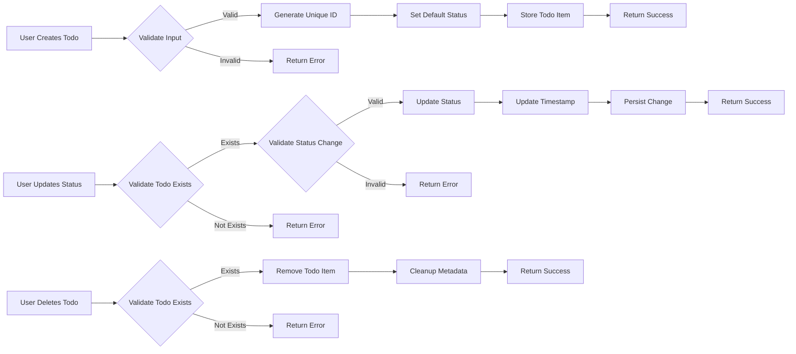

# Business Rules and Constraints for Todo List Application

## 1. Introduction and Purpose

This document defines the comprehensive business rules, validation requirements, and operational constraints that govern the behavior of the Todo List Application. These rules ensure data integrity, maintain system reliability, and provide consistent user experience while supporting the minimal functionality requirements for personal task management.

### 1.1 Document Scope
This specification covers all business rules and constraints for the todo list application, focusing on input validation, business logic constraints, data integrity requirements, and operational rules. These requirements ensure the system behaves predictably and reliably while maintaining data consistency.

### 1.2 Business Context
The Todo List Application serves as a simple, single-user task management tool designed for personal productivity. The business rules defined herein ensure that users can reliably manage their todo items with confidence that their data will remain consistent and accessible.

## 2. Input Validation Rules

### 2.1 Todo Item Creation Validation

**WHEN** a user attempts to create a new todo item, **THE** system **SHALL** validate the following constraints:

**Text Content Validation:**
- **WHEN** creating a todo item, **THE** system **SHALL** require the todo text to be a non-empty string
- **WHEN** processing todo text input, **THE** system **SHALL** trim leading and trailing whitespace
- **WHEN** the trimmed todo text is empty, **THE** system **SHALL** reject the creation attempt
- **THE** todo text **SHALL** have a minimum length of 1 character
- **THE** todo text **SHALL** have a maximum length of 500 characters
- **WHEN** todo text exceeds 500 characters, **THE** system **SHALL** truncate it to 500 characters

**Character Validation:**
- **THE** todo text **SHALL** accept alphanumeric characters, spaces, punctuation, and common symbols
- **THE** system **SHALL** reject todo text containing only whitespace characters
- **THE** system **SHALL** sanitize input to prevent injection attacks

### 2.2 Status Validation Rules

**WHEN** updating todo item status, **THE** system **SHALL** enforce the following constraints:

**Status Value Constraints:**
- **THE** todo status **SHALL** only accept "pending" or "completed" as valid values
- **WHEN** an invalid status value is provided, **THE** system **SHALL** reject the update
- **THE** system **SHALL** default new todo items to "pending" status

**Status Transition Rules:**
- **WHEN** marking a todo as completed, **THE** system **SHALL** validate that the todo exists and is currently pending
- **WHEN** marking a todo as pending, **THE** system **SHALL** validate that the todo exists and is currently completed
- **THE** system **SHALL** prevent status transitions for non-existent todo items

### 2.3 User Input Sanitization Requirements

**Input Cleaning Rules:**
- **THE** system **SHALL** remove or escape HTML tags from todo text input
- **THE** system **SHALL** normalize Unicode characters in todo text
- **THE** system **SHALL** prevent SQL injection in all user inputs
- **THE** system **SHALL** validate that all input parameters are of the expected data type

## 3. Business Logic Constraints

### 3.1 Todo Lifecycle Management

**Todo Creation Constraints:**
- **WHEN** creating a new todo item, **THE** system **SHALL** automatically assign a unique identifier
- **THE** system **SHALL** set the creation timestamp for all new todo items
- **THE** system **SHALL** initialize the completion timestamp as null for new todo items
- **WHEN** a todo is marked as completed, **THE** system **SHALL** record the completion timestamp

**State Transition Rules:**
- **THE** todo lifecycle **SHALL** follow a strict state transition pattern:
  - Created → Pending
  - Pending → Completed
  - Completed → Pending
- **THE** system **SHALL** prevent invalid state transitions
- **THE** system **SHALL** maintain state consistency across all operations

### 3.2 Operation Sequencing Constraints

**Operation Order Constraints:**
- **THE** system **SHALL** process todo operations in the order they are received
- **WHEN** multiple operations affect the same todo item, **THE** system **SHALL** apply them sequentially
- **THE** system **SHALL** prevent race conditions in todo status updates

**Business Process Limitations:**
- **THE** system **SHALL** allow only one user to operate on the todo list
- **THE** system **SHALL** process operations atomically to maintain data consistency
- **WHEN** an operation fails, **THE** system **SHALL** ensure no partial changes are persisted

## 4. Data Integrity Requirements

### 4.1 Unique Identification Constraints

**Todo Identifier Rules:**
- **THE** system **SHALL** assign a unique identifier to each todo item
- **THE** todo identifier **SHALL** be immutable once assigned
- **THE** system **SHALL** prevent duplicate todo identifiers
- **THE** system **SHALL** validate that all operations reference valid todo identifiers

**Data Uniqueness Constraints:**
- **THE** system **SHALL** allow duplicate todo text content
- **THE** system **SHALL** maintain uniqueness based on todo identifiers only
- **THE** system **SHALL** prevent data duplication through proper indexing

### 4.2 Data Consistency Rules

**Consistency Maintenance:**
- **THE** system **SHALL** maintain referential integrity between todo items and their metadata
- **WHEN** a todo item is deleted, **THE** system **SHALL** remove all associated data
- **THE** system **SHALL** ensure that todo lists remain consistent after all operations
- **THE** system **SHALL** prevent orphaned data in the storage system

**Data Validation Rules:**
- **THE** system **SHALL** validate that all todo items have required fields populated
- **THE** system **SHALL** ensure that timestamps are always in valid format
- **THE** system **SHALL** validate that status fields contain only permitted values

### 4.3 Data Persistence Constraints

**Storage Reliability Rules:**
- **THE** system **SHALL** persist todo items reliably across application restarts
- **WHEN** saving todo data, **THE** system **SHALL** ensure atomic write operations
- **THE** system **SHALL** maintain data consistency during save operations
- **WHEN** loading todo data, **THE** system **SHALL** validate data integrity

**Data Recovery Constraints:**
- **THE** system **SHALL** provide data recovery mechanisms in case of storage failure
- **THE** system **SHALL** maintain backup mechanisms for todo data
- **WHEN** data corruption is detected, **THE** system **SHALL** attempt recovery

## 5. Operational Rules

### 5.1 System Behavior Constraints

**Performance Constraints:**
- **THE** system **SHALL** respond to todo creation requests within 2 seconds
- **THE** system **SHALL** respond to todo status updates within 1 second
- **THE** system **SHALL** respond to todo deletion requests within 1 second
- **THE** system **SHALL** load the todo list within 3 seconds
- **THE** system **SHALL** handle at least 1000 todo items without performance degradation

**Reliability Rules:**
- **THE** system **SHALL** maintain 99% availability during normal operation
- **THE** system **SHALL** recover from unexpected shutdowns without data loss
- **THE** system **SHALL** handle concurrent operations without data corruption

### 5.2 Error Handling Constraints

**Input Error Handling:**
- **WHEN** invalid input is provided, **THE** system **SHALL** return descriptive error messages
- **THE** system **SHALL** prevent application crashes due to malformed input
- **WHEN** validation fails, **THE** system **SHALL** preserve the current application state

**Operation Error Handling:**
- **WHEN** a todo operation fails, **THE** system **SHALL** maintain data consistency
- **THE** system **SHALL** provide clear error messages for failed operations
- **WHEN** storage operations fail, **THE** system **SHALL** attempt recovery procedures

### 5.3 Data Retention Policies

**Data Lifecycle Rules:**
- **THE** system **SHALL** retain completed todo items indefinitely unless explicitly deleted
- **THE** system **SHALL** retain pending todo items until they are completed or deleted
- **THE** system **SHALL** provide mechanisms for bulk deletion of todo items

**Storage Management:**
- **THE** system **SHALL** optimize storage usage for todo data
- **THE** system **SHALL** prevent storage bloat through efficient data structures
- **THE** system **SHALL** maintain performance as the number of todo items grows

## 6. Compliance and Security Constraints

### 6.1 Data Protection Requirements

**Privacy Constraints:**
- **THE** system **SHALL** treat all todo data as personal and confidential
- **THE** system **SHALL** prevent unauthorized access to todo data
- **THE** system **SHALL** encrypt todo data at rest for privacy protection

**Security Validation Rules:**
- **THE** system **SHALL** validate all input for potential security threats
- **THE** system **SHALL** prevent cross-site scripting (XSS) attacks
- **THE** system **SHALL** implement proper input sanitization for all user-provided data

### 6.2 Operational Security Constraints

**Access Control Rules:**
- **THE** system **SHALL** provide single-user access only
- **THE** system **SHALL** prevent unauthorized modification of todo data
- **THE** system **SHALL** maintain data integrity through proper access controls

**Data Validation Security:**
- **THE** system **SHALL** validate data types for all operations
- **THE** system **SHALL** prevent buffer overflow attacks through proper input validation
- **THE** system **SHALL** implement boundary checks for all data operations

## 7. Business Process Flow

The following diagram illustrates the core business processes and their constraints:

## 8. Validation Rules Summary

### 8.1 Input Validation Matrix

| Operation | Required Validation | Constraints | Error Handling |
|-----------|---------------------|-------------|----------------|
| Create Todo | Text length (1-500 chars) Non-empty string Character validation | Maximum 500 characters No HTML tags No SQL injection | Return descriptive error Preserve application state |
| Update Status | Todo exists Valid status value Valid state transition | Only "pending" or "completed" Prevent invalid transitions | Return specific error message Maintain data consistency |
| Delete Todo | Todo exists | Prevent deletion of non-existent items | Return not found error No state change |

### 8.2 Business Rules Compliance Checklist

- [ ] **WHEN** creating todos, **THE** system validates text length and content
- [ ] **WHEN** updating status, **THE** system validates todo existence and valid transitions
- [ ] **WHEN** deleting todos, **THE** system validates todo existence
- [ ] **THE** system maintains unique identifiers for all todo items
- [ ] **THE** system ensures data persistence across application restarts
- [ ] **THE** system handles errors gracefully without data corruption
- [ ] **THE** system maintains performance with up to 1000 todo items
- [ ] **THE** system provides appropriate error messages for all failure scenarios

## 9. Implementation Guidelines

These business rules and constraints provide the foundation for building a reliable, consistent, and user-friendly todo list application. Developers should implement these rules to ensure the system behaves predictably and maintains data integrity under all operating conditions.

All validation rules should be implemented with user experience in mind, providing clear feedback when constraints are violated while maintaining the simplicity and ease of use that characterizes the minimal todo list application.