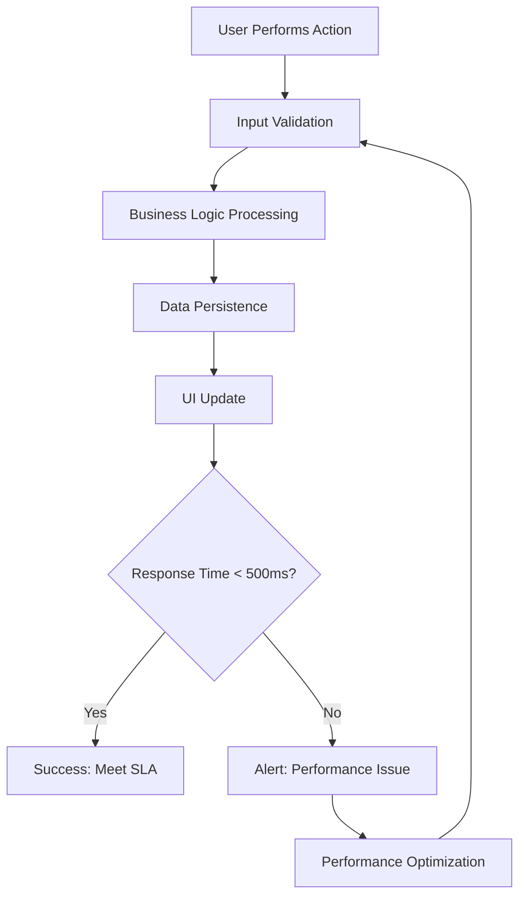
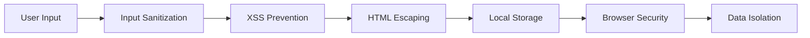
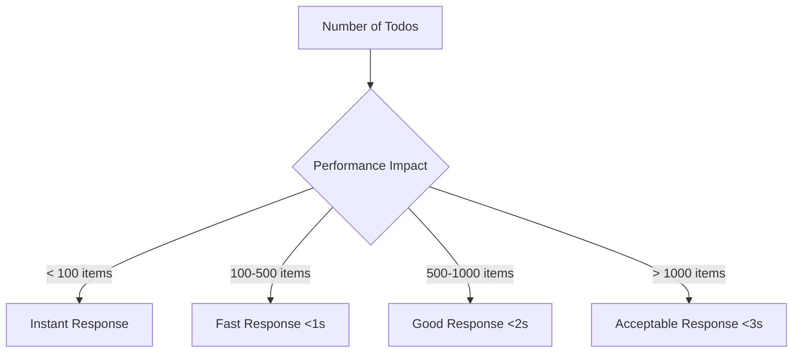
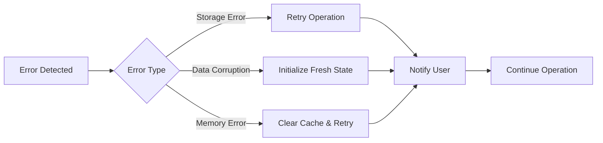

# Todo List Application - Non-Functional Requirements

## 1. Introduction

This document defines the comprehensive non-functional requirements for the Todo list application, establishing the performance, security, reliability, and quality standards that ensure the system meets user expectations while maintaining simplicity and efficiency.

### 1.1 Purpose
The non-functional requirements specify how the system should perform rather than what it should do, focusing on quality attributes that affect user experience, system reliability, and operational efficiency.

### 1.2 Scope
This specification covers all non-functional aspects including performance, security, scalability, reliability, maintainability, and user experience standards for the single-user Todo application.

## 2. Performance Requirements

### 2.1 Response Time Expectations

**WHEN** a user creates a new todo item, **THE** system **SHALL** process and display the result within 500 milliseconds under normal operating conditions.

**WHEN** a user marks a todo as completed, **THE** system **SHALL** update the status and reflect the change within 300 milliseconds.

**WHEN** a user deletes a todo item, **THE** system **SHALL** remove the item and update the display within 300 milliseconds.

**WHEN** a user edits todo text content, **THE** system **SHALL** process the update and display the change within 400 milliseconds.

**WHEN** the application starts, **THE** system **SHALL** load and display all todo items within 2 seconds, even with up to 1,000 stored items.

### 2.2 Throughput Requirements

**THE** system **SHALL** support processing of at least 10 concurrent todo operations without performance degradation.

**WHILE** handling multiple rapid user interactions, **THE** system **SHALL** maintain responsiveness and process operations in the order received.

**THE** system **SHALL** handle burst operations of up to 50 consecutive actions within 10 seconds without data loss or corruption.

### 2.3 Resource Utilization

**THE** application **SHALL** consume no more than 50MB of memory during normal operation with 1,000 todo items.

**THE** system **SHALL** initialize within 3 seconds on standard hardware configurations.

**WHEN** running in the browser, **THE** application **SHALL** utilize no more than 15% of available CPU resources during peak usage.

### 2.4 Performance Under Load

## 3. Security Specifications

### 3.1 Data Protection Requirements

**WHEN** storing todo items in browser local storage, **THE** system **SHALL** ensure data is accessible only to the originating domain.

**THE** system **SHALL** prevent cross-site scripting (XSS) attacks by sanitizing all user input before processing.

**WHEN** handling user-generated content, **THE** system **SHALL** escape HTML characters to prevent injection attacks.

**THE** application **SHALL** implement Content Security Policy (CSP) headers to mitigate code injection risks.

### 3.2 Access Control Requirements

**THE** system **SHALL** operate as a single-user application without requiring authentication for basic functionality.

**WHERE** data is stored locally, **THE** system **SHALL** rely on browser security mechanisms to prevent unauthorized access.

**THE** application **SHALL** not transmit user data to external servers without explicit user consent.

### 3.3 Privacy Requirements

**THE** system **SHALL** store all todo data exclusively on the user's local device.

**THE** application **SHALL** not collect analytics, usage statistics, or personal information without user permission.

**WHEN** the user clears browser data, **THE** system **SHALL** respect this action and completely remove all stored todo items.

### 3.4 Security Implementation

## 4. Compliance Requirements

### 4.1 Data Privacy Compliance

**THE** system **SHALL** comply with basic data privacy principles by keeping all user data local to the device.

**THE** application **SHALL** adhere to general data protection principles including data minimization and purpose limitation.

**WHERE** the application stores personal task information, **THE** system **SHALL** treat this data as confidential.

### 4.2 Browser Standards Compliance

**THE** application **SHALL** comply with modern web standards including HTML5, CSS3, and ECMAScript 6+.

**THE** system **SHALL** follow accessibility guidelines (WCAG 2.1 Level AA) to ensure usability for users with disabilities.

**THE** application **SHALL** implement responsive design principles for optimal viewing across different devices.

### 4.3 Operational Compliance

**THE** system **SHALL** provide clear user notifications when operations fail or data cannot be saved.

**WHEN** errors occur, **THE** application **SHALL** log sufficient information for troubleshooting while maintaining user privacy.

## 5. Scalability Considerations

### 5.1 User Capacity

**THE** system **SHALL** be designed for single-user operation with no multi-user scalability requirements.

**THE** application **SHALL** efficiently handle up to 1,000 todo items without performance degradation.

**WHERE** the user creates more than 1,000 items, **THE** system **SHALL** continue to function with linear performance characteristics.

### 5.2 Data Volume Management

**WHEN** storing large numbers of todo items, **THE** system **SHALL** implement efficient data structures to minimize memory usage.

**THE** application **SHALL** maintain responsive performance even when approaching browser storage limits.

**WHERE** storage capacity is reached, **THE** system **SHALL** provide clear user notifications and guidance.

### 5.3 Growth Handling

**THE** system architecture **SHALL** accommodate gradual growth in data volume without requiring architectural changes.

**THE** application **SHALL** implement efficient algorithms for sorting, filtering, and searching todo items.

## 6. Reliability and Availability

### 6.1 System Uptime Requirements

**THE** application **SHALL** maintain 99.9% availability during normal browser operation.

**WHEN** the browser is running and has sufficient system resources, **THE** system **SHALL** be fully operational.

**THE** application **SHALL** recover gracefully from browser crashes or unexpected closures.

### 6.2 Data Persistence Requirements

**THE** system **SHALL** maintain todo item data persistently across browser sessions with 99.9% reliability.

**WHEN** the user closes and reopens the browser, **THE** system **SHALL** restore all todo items exactly as they were with no data loss.

**IF** the browser's local storage becomes corrupted, **THEN** **THE** system **SHALL** handle the error gracefully and allow the user to start with a fresh todo list.

### 6.3 Fault Tolerance Requirements

**THE** system **SHALL** handle common browser errors without crashing or losing user data.

**IF** the user's device loses power unexpectedly, **THEN** **THE** system **SHALL** recover todo data upon restart using browser recovery mechanisms.

**WHEN** JavaScript errors occur, **THE** application **SHALL** maintain basic functionality and provide error recovery options.

### 6.4 Error Recovery Procedures

## 7. User Experience Standards

### 7.1 Responsiveness Requirements

**THE** todoApp **SHALL** provide immediate visual feedback for all user interactions within 100 milliseconds.

**WHEN** a user performs any action, **THE** system **SHALL** update the interface immediately to acknowledge the input.

**THE** application **SHALL** maintain smooth animations and transitions during state changes.

### 7.2 Consistency Requirements

**THE** system **SHALL** maintain consistent behavior across different browsers that support the required web standards.

**THE** user interface **SHALL** provide uniform interaction patterns throughout the application.

**THE** application **SHALL** maintain visual consistency in layout, typography, and color schemes.

### 7.3 Error Handling User Experience

**WHEN** an operation fails, **THE** system **SHALL** display clear, user-friendly error messages that explain the issue and suggest solutions.

**IF** the system cannot save a todo item, **THEN** **THE** system **SHALL** inform the user and provide retry options.

**THE** application **SHALL** prevent data loss by maintaining unsaved changes in memory when storage operations fail.

### 7.4 Accessibility Requirements

**THE** system **SHALL** comply with WCAG 2.1 Level AA accessibility standards.

**THE** application **SHALL** provide keyboard navigation for all functionality.

**THE** user interface **SHALL** maintain sufficient color contrast for users with visual impairments.

**THE** system **SHALL** support screen readers with appropriate ARIA labels and semantic HTML.

## 8. Maintainability Requirements

### 8.1 Monitoring Requirements

**THE** system **SHALL** include basic error logging for troubleshooting purposes.

**WHEN** errors occur, **THE** application **SHALL** log sufficient information to identify and resolve issues.

**THE** logging system **SHALL** maintain user privacy by not storing personal task content in logs.

### 8.2 Operational Requirements

**THE** todoApp **SHALL** require no server maintenance or operational overhead.

**THE** system **SHALL** be self-contained within the browser environment.

**THE** application **SHALL** not require manual updates beyond browser updates.

### 8.3 Browser Compatibility

**THE** system **SHALL** support modern web browsers including Chrome 90+, Firefox 88+, Safari 14+, and Edge 90+.

**WHERE** older browsers are used, **THE** system **SHALL** degrade gracefully while maintaining core functionality.

**THE** application **SHALL** implement progressive enhancement to ensure basic functionality even when advanced features are unavailable.

## 9. Technical Constraints

### 9.1 Browser Requirements

**THE** system **SHALL** require a browser with HTML5 local storage support.

**THE** application **SHALL** require JavaScript to be enabled in the user's browser.

**THE** system **SHALL** function without requiring additional browser plugins or extensions.

### 9.2 Storage Limitations

**THE** system **SHALL** handle browser storage limits gracefully and provide appropriate user notifications when approaching capacity.

**WHERE** local storage is unavailable, **THE** application **SHALL** fall back to session storage with clear user notification.

**THE** system **SHALL** implement efficient data compression to maximize available storage capacity.

### 9.3 Performance Optimization

**THE** application **SHALL** implement efficient algorithms for todo item management to minimize computational overhead.

**THE** system **SHALL** use optimized data structures for quick access and manipulation of todo items.

**THE** user interface **SHALL** implement virtual scrolling or pagination if dealing with very large todo lists.

## 10. Implementation Guidelines

### 10.1 Performance Monitoring Implementation

**THE** system **SHALL** include performance monitoring to track response times for critical operations.

**THE** application **SHALL** log performance metrics for troubleshooting and optimization.

**WHERE** performance degrades below acceptable thresholds, **THE** system **SHALL** trigger optimization procedures.

### 10.2 Security Implementation Procedures

**THE** development team **SHALL** implement input validation for all user-provided data.

**THE** system **SHALL** sanitize user input to prevent XSS and injection attacks.

**THE** application **SHALL** follow security best practices for client-side data handling.

### 10.3 Compliance Verification Methods

**THE** development process **SHALL** include accessibility testing to verify WCAG compliance.

**THE** system **SHALL** undergo security testing to identify potential vulnerabilities.

**THE** application **SHALL** be tested across multiple browsers to ensure compatibility.

## 11. Success Metrics

### 11.1 Performance Success Metrics

- 95% of page loads complete within 2 seconds
- 99% of CRUD operations complete within 500 milliseconds
- Application uses less than 50MB memory with 1,000 todo items
- Zero data loss incidents in normal usage scenarios
- Consistent performance across supported browsers

### 11.2 Reliability Success Metrics

- 99.9% application availability during browser sessions
- 99.9% successful data persistence across browser restarts
- Graceful error handling for all common failure scenarios
- No data corruption in normal usage conditions
- Successful recovery from browser crashes

### 11.3 User Experience Success Metrics

- Intuitive interface requiring no user manual or training
- Immediate feedback for all user actions (within 100ms)
- Clear error messages when operations fail
- Consistent behavior across different usage scenarios
- High user satisfaction scores in usability testing

### 11.4 Security Success Metrics

- Zero successful XSS or injection attacks in security testing
- Complete data isolation from other browser applications
- No unauthorized data access incidents
- Compliance with data privacy principles

These non-functional requirements ensure that the Todo list application delivers a high-quality user experience while maintaining security, reliability, and performance standards appropriate for a single-user productivity application.