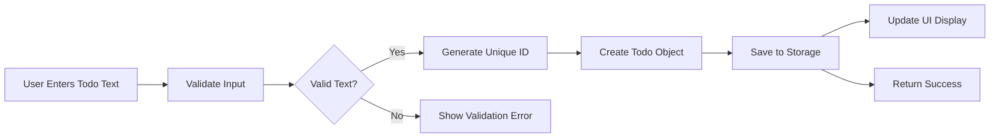
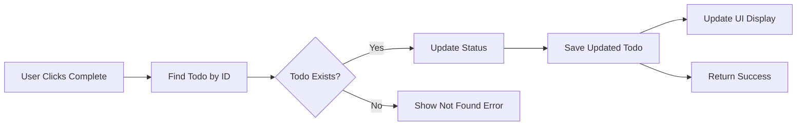
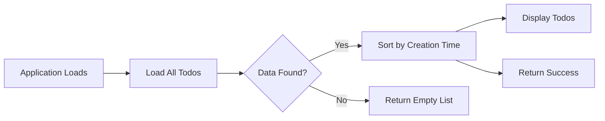
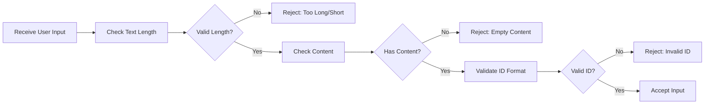

# Todo List Application - Event Processing Requirements

## 1. Introduction to System Events

This document defines how the Todo list application processes various business events triggered by user interactions. The system operates as a single-user application where all events are initiated by the user's actions on their personal todo items.

### 1.1 Event Processing Philosophy
The system follows a straightforward event-driven architecture where:
- User actions trigger business events
- Each event follows a predictable processing sequence
- Data consistency is maintained through atomic operations
- Error handling ensures graceful failure recovery

### 1.2 Business Event Categories
The application processes four primary event categories:
- **Creation Events**: Adding new todo items to the system
- **Status Events**: Changing completion status of existing todos
- **Modification Events**: Updating todo text content
- **Deletion Events**: Removing todo items from the system

## 2. Core Business Event Definitions

### 2.1 Todo Creation Event
**Event Trigger**: WHEN a user creates a new todo item
**Event Payload**: Todo text content
**Processing Goal**: Add new todo to the user's list

**Event Flow**:

**Business Requirements**:
- WHEN a user provides todo text, THE system SHALL validate the text is not empty
- WHEN todo text validation passes, THE system SHALL generate a unique identifier
- THE system SHALL create a todo object with default "incomplete" status
- THE system SHALL persist the new todo to storage
- THE system SHALL update the user interface to display the new todo
- THE system SHALL provide visual confirmation of successful creation

### 2.2 Todo Completion Event
**Event Trigger**: WHEN a user marks todo as completed
**Event Payload**: Todo ID, completion status
**Processing Goal**: Update todo completion status

**Event Flow**:

**Business Requirements**:
- WHEN a user marks a todo as completed, THE system SHALL validate the todo exists
- THE system SHALL update the todo status to "completed"
- THE system SHALL record the completion timestamp
- THE system SHALL persist the status change to storage
- THE system SHALL update the visual appearance to reflect completion
- THE system SHALL provide immediate feedback confirming the status change

### 2.3 Todo Deletion Event
**Event Trigger**: WHEN a user deletes a todo item
**Event Payload**: Todo ID
**Processing Goal**: Remove todo from user's list

**Event Flow**:

**Business Requirements**:
- WHEN a user requests todo deletion, THE system SHALL validate the todo exists
- THE system SHALL display a confirmation dialog to prevent accidental deletion
- WHEN the user confirms deletion, THE system SHALL remove the todo from storage
- THE system SHALL update the user interface to reflect the removal
- THE system SHALL provide visual feedback confirming successful deletion
- THE system SHALL recalculate todo list statistics after deletion

### 2.4 Todo List Retrieval Event
**Event Trigger**: WHEN application loads or refreshes
**Event Payload**: None (user context)
**Processing Goal**: Retrieve all user's todos

**Event Flow**:

**Business Requirements**:
- WHEN the application starts, THE system SHALL attempt to load saved todos
- THE system SHALL validate the integrity of loaded data
- WHEN data loading succeeds, THE system SHALL sort todos by creation time
- THE system SHALL display todos in the sorted order
- WHEN no data exists, THE system SHALL initialize with an empty list
- THE system SHALL handle data corruption gracefully with user notification

## 3. Event Handling Procedures

### 3.1 Input Validation Sequence
WHEN processing any user input, THE system SHALL validate the data according to the following rules:

**Validation Requirements**:
- THE todo text SHALL be between 1 and 500 characters in length
- THE todo text SHALL not contain only whitespace characters
- THE todo ID SHALL be a valid identifier when provided
- THE completion status SHALL be a boolean value

**Validation Flow**:

### 3.2 Data Storage Procedures
WHEN saving or updating todo data, THE system SHALL follow these storage procedures:

**Storage Requirements**:
- THE system SHALL maintain data persistence across application sessions
- THE system SHALL ensure data integrity during save operations
- THE system SHALL provide immediate feedback on save success or failure
- THE system SHALL handle storage errors gracefully without data loss

### 3.3 UI Update Procedures
WHEN completing any event processing, THE system SHALL update the user interface:

**UI Update Requirements**:
- THE system SHALL reflect changes immediately in the display
- THE system SHALL provide visual feedback for completed actions
- THE system SHALL maintain consistent state between storage and display
- THE system SHALL handle UI update failures without disrupting user workflow

## 4. Data Flow Management

### 4.1 Data Synchronization
WHILE processing events, THE system SHALL maintain data consistency through:

**Synchronization Requirements**:
- THE system SHALL ensure all UI displays reflect the current storage state
- THE system SHALL prevent conflicting updates to the same todo item
- THE system SHALL maintain chronological order of todo creation
- THE system SHALL handle concurrent operations appropriately for a single-user application

### 4.2 State Management
WHILE the application is running, THE system SHALL maintain consistent application state:

**State Requirements**:
- THE current todo list SHALL always reflect the stored data
- THE application state SHALL be recoverable after unexpected closures
- THE system SHALL prevent data corruption during simultaneous operations
- THE system SHALL maintain user context throughout the session

## 5. Error Event Processing

### 5.1 Input Validation Errors
IF user input fails validation, THEN THE system SHALL:
- Display clear error messages indicating the specific validation failure
- Preserve user input for correction
- Allow immediate retry of the operation
- Provide guidance on valid input requirements

**Error Handling Requirements**:
- WHEN todo text is empty, THE system SHALL display error message: "Todo text cannot be empty"
- WHEN todo text exceeds 500 characters, THE system SHALL display error message: "Todo text cannot exceed 500 characters"
- WHEN invalid todo ID is provided, THE system SHALL display error message: "Invalid todo item"

### 5.2 Storage Operation Errors
IF storage operations fail, THEN THE system SHALL:
- Notify the user of the storage failure
- Preserve unsaved data where possible
- Provide recovery options
- Log the error for debugging purposes

**Storage Error Requirements**:
- WHEN storage write fails, THE system SHALL display error message: "Unable to save changes. Please try again."
- WHEN storage read fails, THE system SHALL display error message: "Unable to load saved todos. Starting with empty list."
- THE system SHALL maintain current in-memory state during storage failures
- THE system SHALL allow retry of failed storage operations

### 5.3 Data Integrity Errors
IF data integrity issues are detected, THEN THE system SHALL:
- Attempt automatic data recovery
- Notify the user of data issues
- Provide options to restore from backup if available
- Prevent further data corruption

**Integrity Error Requirements**:
- WHEN data corruption is detected, THE system SHALL attempt to recover valid data
- THE system SHALL notify users with message: "Data issue detected. Some todos may be lost."
- THE system SHALL provide option to start with fresh empty list
- THE system SHALL log corruption details for troubleshooting

### 5.4 Concurrency Errors
WHERE multiple operations might conflict, THE system SHALL:
- Implement appropriate locking mechanisms
- Handle race conditions gracefully
- Ensure data consistency despite concurrent operations
- Provide clear error messages for conflict resolution

**Concurrency Requirements**:
- WHEN simultaneous operations conflict, THE system SHALL process them sequentially
- THE system SHALL prevent data loss during concurrent updates
- THE system SHALL maintain todo list consistency across all operations
- THE system SHALL handle browser tab synchronization appropriately

## 6. Concurrency Considerations

### 6.1 Single-User Concurrency
WHILE operating as a single-user application, THE system SHALL handle:

**Concurrency Requirements**:
- Multiple simultaneous UI interactions
- Rapid sequential operations
- Background storage operations
- UI responsiveness during processing

### 6.2 Operation Sequencing
WHEN processing multiple user actions, THE system SHALL:
- Process operations in the order received
- Maintain data consistency across sequential operations
- Handle operation dependencies appropriately
- Prevent data loss during rapid user interactions

**Sequencing Requirements**:
- WHEN multiple todo operations occur simultaneously, THE system SHALL process them in received order
- THE system SHALL ensure that later operations reflect the results of earlier operations
- THE system SHALL maintain todo list integrity during high-frequency operations
- THE system SHALL provide consistent results regardless of operation timing

## 7. Event Processing Performance Requirements

### 7.1 Response Time Expectations
WHEN users perform actions, THE system SHALL respond within these timeframes:

**Performance Requirements**:
- THE system SHALL process todo creation within 500 milliseconds
- THE system SHALL process todo completion updates within 300 milliseconds
- THE system SHALL process todo deletion within 300 milliseconds
- THE system SHALL load the todo list within 1000 milliseconds on application startup

### 7.2 User Experience Performance
WHILE users interact with the application, THE system SHALL provide:

**User Experience Requirements**:
- Immediate visual feedback for user actions
- Smooth transitions between states
- No noticeable delays in UI updates
- Responsive interface during background operations

### 7.3 Error Recovery Performance
IF errors occur during event processing, THEN THE system SHALL:
- Display error messages within 200 milliseconds of detection
- Provide recovery options immediately
- Maintain application stability during error handling
- Allow continued use of unaffected features

**Error Recovery Requirements**:
- WHEN validation errors occur, THE system SHALL display error messages within 200ms
- WHEN storage errors occur, THE system SHALL provide recovery options within 500ms
- THE system SHALL maintain application responsiveness during error handling
- THE system SHALL prevent application crashes due to processing errors

## 8. Event Processing Summary

This document defines the complete event processing requirements for the Todo list application. The system follows a straightforward event-driven approach where user actions trigger predictable business processes. All events are processed with appropriate validation, storage operations, and UI updates while maintaining data consistency and providing responsive user feedback.

The event processing architecture ensures that the single-user application remains reliable, responsive, and user-friendly while handling the core todo management operations of creation, completion, deletion, and retrieval.

### 8.1 Success Criteria

**Event Processing Success**: Event processing is successful WHEN:
- User actions trigger appropriate business events
- All events are processed within specified timeframes
- Data consistency is maintained throughout processing
- Users receive immediate feedback for all actions
- Error conditions are handled gracefully

**Performance Success**: Performance requirements are met WHEN:
- 95% of todo operations complete within specified time limits
- Users perceive the application as responsive and immediate
- Error recovery does not impact user experience
- Data persistence operations complete reliably

**Reliability Success**: Reliability requirements are met WHEN:
- No data loss occurs during normal operations
- Application recovers gracefully from unexpected errors
- Users can continue working after error recovery
- System maintains state consistency across all operations