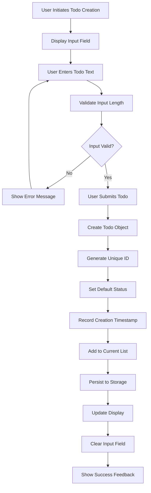
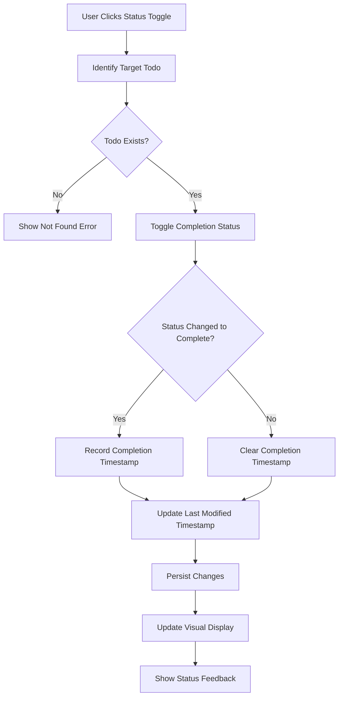
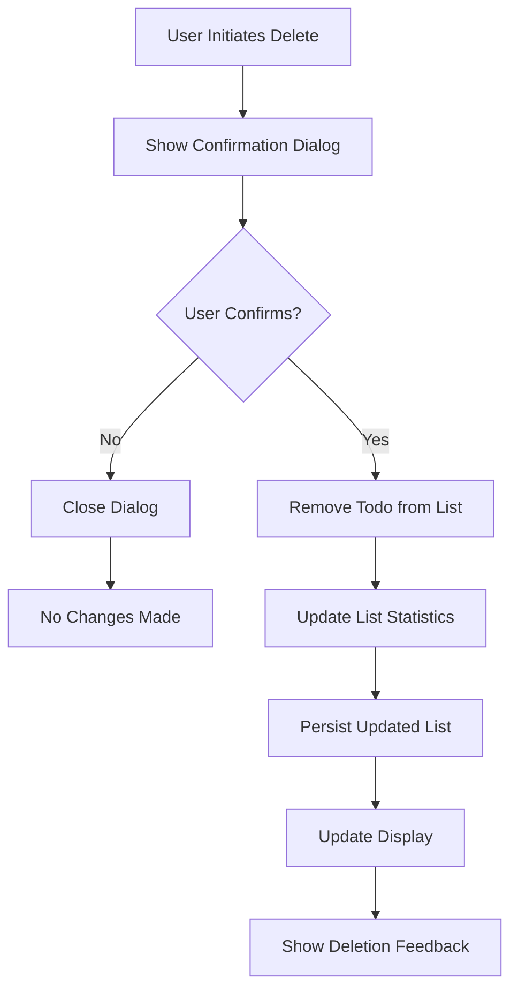

# Todo List Application - Functional Requirements

## 1. Introduction

### 1.1 Business Purpose
THE Todo List Application SHALL provide a minimal, single-user task management system that enables efficient personal task organization through simple CRUD (Create, Read, Update, Delete) operations with persistent data storage.

### 1.2 Scope Definition
THE application SHALL focus exclusively on core todo management functionality without advanced features such as categories, due dates, multiple users, or complex filtering. THE design SHALL prioritize simplicity and reliability for personal task management while maintaining data persistence across application sessions.

### 1.3 Business Context
WHILE existing task management applications offer extensive features, THE Todo List Application SHALL differentiate through absolute minimalism, instant accessibility without authentication barriers, and persistent local storage for single-user personal productivity.

## 2. Authentication Requirements

### 2.1 User Role Definitions
**User Role**
- WHEN assigned the User role, THE system SHALL grant access to all personal todo management functions
- THE User SHALL be able to create, read, update, and delete their own todo items
- THE User SHALL have access to filter and view their personal todo list

**Admin Role**
- WHEN assigned the Admin role, THE system SHALL grant comprehensive access to all application functions
- THE Admin SHALL be able to perform system maintenance operations
- THE Admin SHALL have access to system-wide settings and configurations

### 2.2 Authentication Flow Requirements
**Automatic User Authentication**
- WHEN a user accesses the application for the first time, THE system SHALL automatically create a user session without requiring login credentials
- THE system SHALL maintain user authentication state throughout the application session
- WHEN the application restarts, THE system SHALL restore the user session automatically

**Session Management**
- THE system SHALL maintain persistent user sessions across browser restarts
- THE system SHALL automatically authenticate returning users
- THE system SHALL provide seamless user experience without authentication interruptions

### 2.3 Permission Matrix
| Action | User | Admin |
|--------|------|-------|
| Create todo item | ✅ | ✅ |
| Read own todo items | ✅ | ✅ |
| Read all todo items | ❌ | ✅ |
| Update own todo items | ✅ | ✅ |
| Update all todo items | ❌ | ✅ |
| Delete own todo items | ✅ | ✅ |
| Delete all todo items | ❌ | ✅ |
| Mark todo as complete | ✅ | ✅ |
| Mark todo as incomplete | ✅ | ✅ |
| Filter todos by status | ✅ | ✅ |
| Access system settings | ❌ | ✅ |
| View usage statistics | ❌ | ✅ |
| Perform system maintenance | ❌ | ✅ |

## 3. Core Todo Management Functions

### 3.1 Todo Creation Process
**Basic Todo Creation**
- WHEN a user provides todo text content, THE system SHALL create a new todo item with a unique identifier
- THE system SHALL assign a default "incomplete" status to newly created todos
- THE system SHALL record the creation timestamp for each todo item
- THE system SHALL validate that todo text content is not empty and does not exceed 500 characters

**Todo Validation Rules**
- IF todo text content is empty, THEN THE system SHALL reject the creation attempt and display the error message: "Todo text cannot be empty"
- IF todo text content exceeds 500 characters, THEN THE system SHALL reject the creation attempt and display the error message: "Todo text cannot exceed 500 characters"
- WHERE todo text content meets validation criteria, THE system SHALL create the todo item successfully and provide visual confirmation

### 3.2 Todo Reading and Display
**Todo List Retrieval**
- WHEN a user views the todo list, THE system SHALL retrieve and display all existing todo items
- THE system SHALL display todos in chronological order based on creation timestamp
- THE system SHALL clearly distinguish between completed and incomplete todos using visual indicators
- THE system SHALL display creation timestamps for all todo items

**Status Display Requirements**
- THE system SHALL provide a clear count of total todos and completed todos
- WHERE a todo is marked as completed, THE system SHALL display it with strikethrough text or similar visual indicator
- THE system SHALL maintain consistent visual hierarchy between pending and completed items

### 3.3 Todo Status Updates
**Marking Todos Complete**
- WHEN a user marks a todo item as completed, THE system SHALL update its status to "completed"
- THE system SHALL record the completion timestamp when a todo is marked as completed
- THE system SHALL provide immediate visual confirmation of the status change
- THE system SHALL persist the status change immediately

**Marking Todos Incomplete**
- WHEN a user marks a completed todo item as incomplete, THE system SHALL update its status to "incomplete"
- THE system SHALL remove the completion timestamp when reverting to incomplete status
- THE system SHALL provide immediate visual confirmation of the status change
- THE system SHALL persist the status change immediately

### 3.4 Todo Deletion Process
**Single Todo Deletion**
- WHEN a user requests to delete a specific todo item, THE system SHALL display a confirmation dialog
- IF the user confirms deletion, THEN THE system SHALL remove the todo item from the todo list
- THE system SHALL provide visual feedback indicating successful deletion
- THE system SHALL persist the deletion immediately

**Bulk Todo Management**
- WHEN a user deletes multiple todo items, THE system SHALL display a confirmation dialog for all selected items
- IF the user confirms bulk deletion, THEN THE system SHALL remove all selected items from the todo list
- THE system SHALL provide visual feedback indicating successful deletion of all selected items
- THE system SHALL persist the bulk deletion immediately

### 3.5 Todo Editing Capabilities
**Text Content Updates**
- WHEN a user edits the text content of an existing todo item, THE system SHALL update the todo text
- THE system SHALL apply the same validation rules to edited text as for new todo creation
- THE system SHALL preserve the original creation timestamp and update the last modified timestamp
- THE system SHALL provide visual confirmation of successful text updates
- THE system SHALL persist text changes immediately

## 4. Data Persistence Requirements

### 4.1 Data Storage Specifications
**Persistent Storage**
- THE system SHALL store all todo items persistently using browser local storage
- WHEN the application is closed and reopened, THE system SHALL restore all previously created todo items
- THE system SHALL preserve todo completion status, creation timestamps, and completion timestamps across application sessions
- THE system SHALL maintain data consistency during application crashes or unexpected closures

**Data Integrity**
- WHERE data corruption occurs, THE system SHALL attempt to recover the most recent valid state
- IF data recovery is not possible, THEN THE system SHALL initialize with an empty todo list and inform the user
- THE system SHALL provide backup mechanisms to prevent permanent data loss
- THE system SHALL validate data integrity during loading operations

### 4.2 Data Retrieval Processes
**Initial Data Loading**
- WHEN the application starts, THE system SHALL load all previously stored todo items
- THE system SHALL display todos in their last known state (completed/incomplete)
- THE system SHALL maintain the chronological order of todo items
- IF loading fails, THEN THE system SHALL initialize with an empty todo list and display an appropriate error message

**Real-time Updates**
- WHEN a user makes changes to todo items, THE system SHALL immediately persist those changes
- THE system SHALL ensure that all modifications are saved without requiring explicit save actions
- THE system SHALL provide immediate visual feedback that changes have been saved
- THE system SHALL handle concurrent operations appropriately for a single-user application

## 5. Error Handling Scenarios

### 5.1 Input Validation Errors
**Empty Todo Text**
- IF a user attempts to create a todo with empty text, THEN THE system SHALL display the error message: "Todo text cannot be empty. Please enter some text for your todo item."
- IF a user attempts to update a todo with empty text, THEN THE system SHALL display the error message: "Todo text cannot be empty. Please enter some text for your todo item."

**Text Length Exceeded**
- IF a user attempts to create a todo with text exceeding 500 characters, THEN THE system SHALL display the error message: "Todo text cannot exceed 500 characters. Your current text is [character count] characters long."
- IF a user attempts to update a todo with text exceeding 500 characters, THEN THE system SHALL display the error message: "Todo text cannot exceed 500 characters. Your current text is [character count] characters long."

### 5.2 Data Access Errors
**Todo Not Found**
- IF a user attempts to access a todo that does not exist, THEN THE system SHALL display the error message: "Todo item not found. The requested todo may have been deleted."
- IF a user attempts to update a todo that has been deleted, THEN THE system SHALL display the error message: "Todo item no longer available. It may have been deleted by another session."

**Storage Access Failures**
- IF the system cannot access persistent storage, THEN THE system SHALL display the error message: "Unable to save changes. Please check your browser storage settings and try again."
- IF the system cannot read stored data, THEN THE system SHALL display the error message: "Unable to load saved todos. Starting with empty list. Your previous data may be unavailable."

### 5.3 System Errors
**Application Crashes**
- IF the application crashes during operation, THEN THE system SHALL attempt to recover the most recent state upon restart
- WHERE data recovery is not possible, THE system SHALL initialize with an empty todo list and inform the user: "We couldn't restore your previous todos. Starting with a fresh list."

**Memory Constraints**
- IF system memory constraints prevent todo operations, THEN THE system SHALL display the error message: "System resources limited. Please try again later or clear some todos to free up space."

## 6. Performance Expectations

### 6.1 Response Time Requirements
**Todo Operations Performance**
- WHEN a user creates a new todo, THE system SHALL respond within 500 milliseconds
- WHEN a user updates a todo status, THE system SHALL respond within 300 milliseconds
- WHEN a user deletes a todo, THE system SHALL respond within 300 milliseconds
- WHEN a user edits todo text, THE system SHALL respond within 400 milliseconds

**Data Loading Performance**
- WHEN the application starts, THE system SHALL load and display todos within 2 seconds
- WHEN retrieving todo lists, THE system SHALL display results instantly for lists up to 100 items
- WHERE the todo list contains more than 100 items, THE system SHALL display initial results within 3 seconds

### 6.2 User Experience Performance
**Interface Responsiveness**
- THE system SHALL provide immediate visual feedback for all user interactions within 100 milliseconds
- THE system SHALL maintain smooth scrolling and navigation with up to 1000 todo items
- THE system SHALL prevent interface freezing during data operations
- THE system SHALL maintain responsive performance during rapid user interactions

**Data Persistence Performance**
- THE system SHALL save todo changes within 200 milliseconds of user action
- THE system SHALL perform automatic saves without noticeable impact on user experience
- THE system SHALL handle concurrent save operations without performance degradation

## 7. Business Rules and Constraints

### 7.1 Validation Rules
**Todo Text Validation**
- THE todo text content SHALL be required and cannot be empty
- THE todo text content SHALL have a minimum length of 1 character
- THE todo text content SHALL have a maximum length of 500 characters
- THE todo text content SHALL support standard text characters, spaces, and common punctuation
- THE system SHALL trim leading and trailing whitespace from todo text input

**Completion Status Rules**
- THE completion status SHALL only accept "incomplete" or "completed" as valid values
- THE system SHALL default new todo items to "incomplete" status
- THE system SHALL track completion timestamps for completed items
- THE system SHALL allow unlimited toggling between complete and incomplete states

### 7.2 Data Management Rules
**Unique Identification**
- EACH todo item SHALL have a unique identifier that persists across application sessions
- THE system SHALL prevent duplicate todo identifiers
- THE system SHALL maintain identifier consistency across application restarts
- THE system SHALL validate that all operations reference valid todo identifiers

**Order Preservation**
- THE system SHALL maintain the creation order of todo items
- THE system SHALL allow display sorting based on creation time (newest first or oldest first)
- THE system SHALL preserve order during application restarts
- THE system SHALL maintain consistent ordering during all operations

### 7.3 Operational Constraints
**Single User Constraint**
- THE system SHALL support only one user account
- THE system SHALL not provide multi-user authentication or data separation
- ALL todo items SHALL belong to the single system user
- THE system SHALL maintain data isolation for the single user

**Feature Limitations**
- THE system SHALL not support todo categories or tags
- THE system SHALL not support due dates or reminders
- THE system SHALL not support todo priorities or urgency levels
- THE system SHALL not support todo sharing or collaboration
- THE system SHALL not provide advanced filtering beyond completion status

## 8. Success Criteria

### 8.1 Functional Success Metrics
- Users can successfully create, read, update, and delete todo items with 99% success rate
- Todo items persist across application sessions with 99.9% reliability
- Completion status is accurately maintained with 100% consistency
- System responds within specified performance thresholds for 95% of operations
- Error conditions are handled gracefully with user-friendly messages

### 8.2 User Experience Success Metrics
- Application is intuitive and requires no user training for basic operations
- All operations provide immediate visual feedback within 100 milliseconds
- Data loss is prevented through robust persistence mechanisms
- System remains responsive under normal usage patterns with up to 1000 todo items
- Users can perform all core operations within 30 seconds of first use

### 8.3 Technical Success Metrics
- Application maintains 99% availability during normal browser operation
- Data persistence operations succeed with 99.9% reliability
- System recovers gracefully from 95% of common error scenarios
- Performance remains consistent across supported browser platforms

## 9. Business Process Flow Diagrams

### 9.1 Todo Creation Process Flow

### 9.2 Todo Status Update Process Flow

### 9.3 Todo Deletion Process Flow

This document provides complete functional requirements for backend developers to implement the Todo List Application. All technical implementation decisions regarding architecture, APIs, database design, and infrastructure are at the discretion of the development team.

> *Developer Note: This document defines **business requirements only**. All technical implementations (architecture, APIs, database design, etc.) are at the discretion of the development team.*