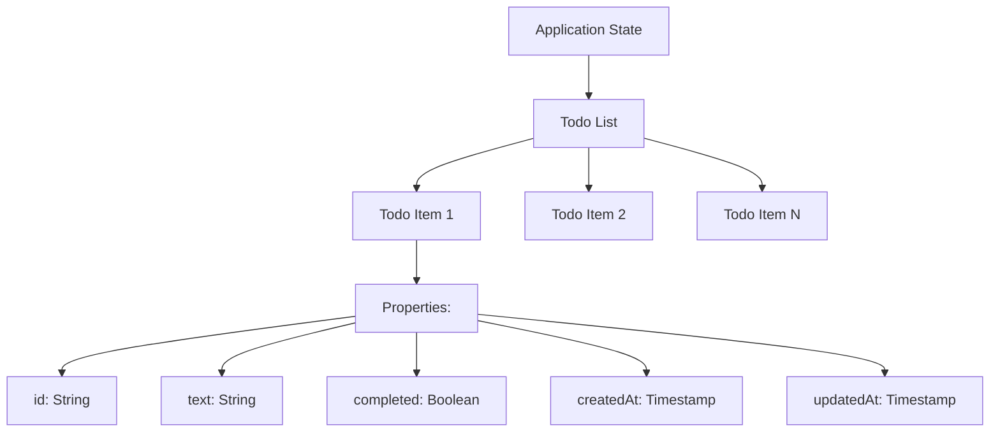
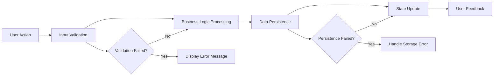
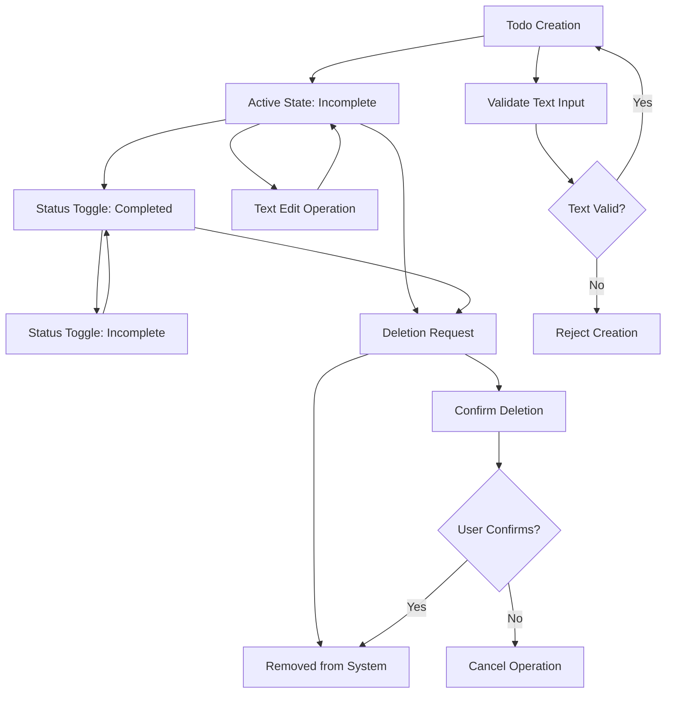
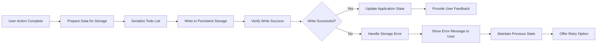
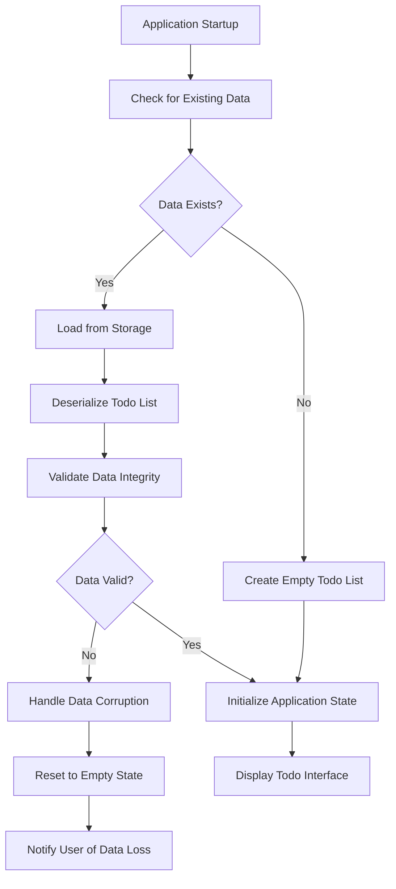
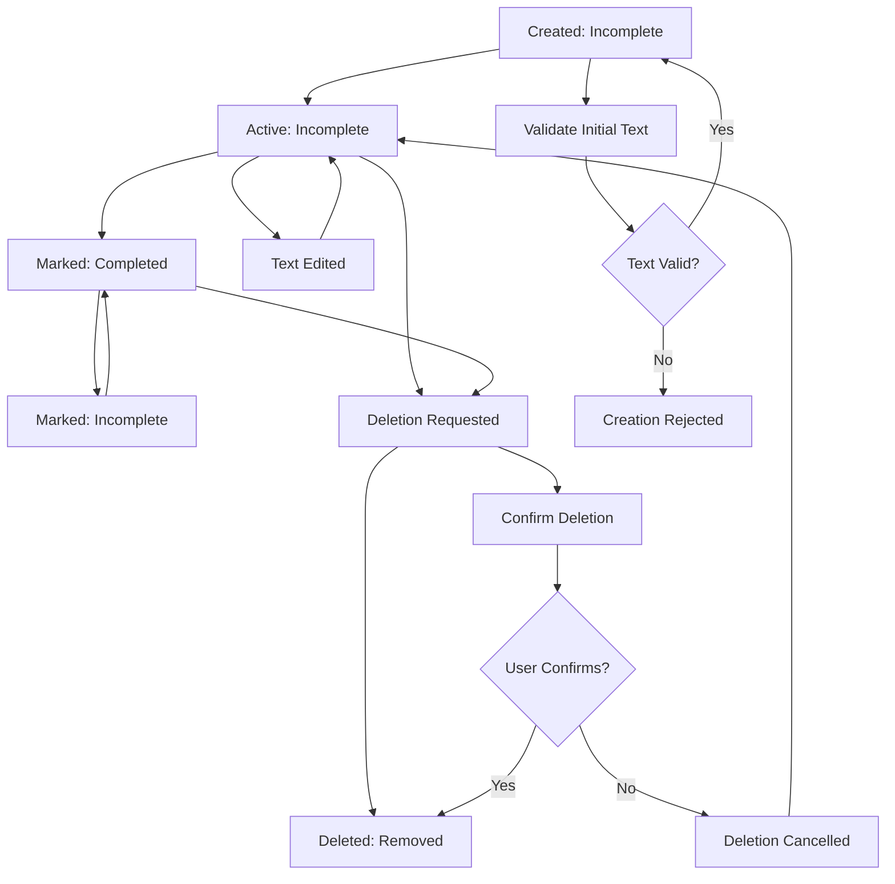

# Data Flow and Lifecycle Documentation

## Introduction

This document defines the complete data flow patterns, information lifecycle, and business object relationships for the Todo list application. It provides backend developers with comprehensive understanding of how information moves through the system, how business objects evolve over time, and how different entities relate to each other—without prescribing technical implementation details.

### Business Context
THE Todo list application SHALL manage personal task data for a single user with persistent storage capabilities. THE system SHALL maintain data integrity while providing responsive user experience through efficient data flow patterns.

### Document Scope
This specification covers all data flow requirements including:
- Business object definitions and relationships
- Data validation and integrity rules
- Information lifecycle management
- Error handling and recovery procedures
- Performance expectations for data operations

## Information Architecture

### Core Business Objects

The Todo application manages three primary business objects with specific properties and relationships:

**Todo Item Object**
- THE Todo Item SHALL represent individual tasks created by users
- THE Todo Item SHALL contain unique identifier, text content, completion status, creation timestamp, and last modified timestamp
- THE Todo Item SHALL maintain state consistency throughout its lifecycle

**Todo List Object**
- THE Todo List SHALL represent the complete collection of todo items for a single user
- THE Todo List SHALL maintain items in chronological creation order
- THE Todo List SHALL provide derived statistics including total count, completed count, and completion percentage

**Application State Object**
- THE Application State SHALL encompass the entire Todo List along with global application settings
- THE Application State SHALL maintain synchronization between memory, storage, and user interface
- THE Application State SHALL persist across application sessions

### Object Relationships

Each Todo Item exists within a Todo List, and the Todo List maintains the complete collection of items for a single user. The Application State encompasses the entire Todo List along with any global application settings.

## Core Data Flow Patterns

### Primary Data Flow Pattern

The system follows a consistent data flow pattern for all user operations:

### Data Flow Performance Requirements

WHEN processing user actions, THE system SHALL complete data flow operations within specified timeframes:
- Input validation SHALL complete within 100 milliseconds
- Business logic processing SHALL complete within 200 milliseconds
- Data persistence SHALL complete within 300 milliseconds
- State updates SHALL complete within 100 milliseconds
- User feedback SHALL be provided within 500 milliseconds total

## Todo Object Lifecycle

### Creation Phase

WHEN a user creates a new todo item, THE system SHALL initialize it with the following properties:
- THE system SHALL generate a unique identifier using UUID v4 format
- THE system SHALL set text content to user-provided value after validation
- THE system SHALL set default status to "incomplete"
- THE system SHALL record creation timestamp with millisecond precision
- THE system SHALL set last modified timestamp equal to creation timestamp

### Active Lifecycle Phase

WHILE a todo item exists in the system, THE system SHALL maintain its state through various user interactions:
- WHEN a user marks a todo as completed, THE system SHALL update completion status and last modified timestamp
- WHEN a user marks a todo as incomplete, THE system SHALL update completion status and last modified timestamp
- IF text editing is implemented, WHEN a user edits todo text, THE system SHALL validate new text and update last modified timestamp
- THE system SHALL maintain chronological order based on creation timestamp

### Deletion Phase

WHEN a user deletes a todo item, THE system SHALL:
- Remove the todo item from the active todo list
- Update list statistics including total count and completed count
- Ensure the todo item no longer appears in any user interface
- Update persistence layer to reflect permanent removal
- Provide visual confirmation of successful deletion

### Complete Lifecycle Flow

## Business Entity Relationships

### Todo Item Properties

Each Todo Item maintains the following core properties with specific business rules:

| Property | Type | Description | Business Rules |
|----------|------|-------------|----------------|
| id | String | Unique identifier | THE system SHALL generate unique UUID v4 identifiers for each todo item |
| text | String | Task description | THE system SHALL validate text length between 1-500 characters |
| completed | Boolean | Completion status | THE system SHALL default to false for new items |
| createdAt | Timestamp | Creation time | THE system SHALL record with millisecond precision |
| updatedAt | Timestamp | Last modification | THE system SHALL update on every state change |

### Todo List Structure

The Todo List entity contains the following properties and maintains specific business rules:

| Property | Type | Description | Business Rules |
|----------|------|-------------|----------------|
| items | Array | Collection of todo items | THE system SHALL maintain items in creation timestamp order |
| statistics | Object | Derived data about the list | THE system SHALL recalculate after each modification |
| lastUpdated | Timestamp | Last list modification | THE system SHALL update on every list change |

### List Statistics Calculation

WHEN any operation modifies the todo list, THE system SHALL recalculate the following statistics:
- Total number of items in the list
- Number of completed items
- Number of incomplete items
- Completion percentage (completed / total * 100)
- Last modification timestamp

THE system SHALL update statistics within 50 milliseconds of list modifications.

## Data Persistence Flow

### Storage Operations

The system follows a consistent pattern for data persistence with comprehensive error handling:

### Data Loading Flow

WHEN the application starts, THE system SHALL load persisted data through the following process:

### Storage Performance Requirements

WHEN performing storage operations, THE system SHALL meet these performance expectations:
- Data serialization SHALL complete within 100 milliseconds
- Storage write operations SHALL complete within 200 milliseconds
- Storage read operations SHALL complete within 150 milliseconds
- Data validation SHALL complete within 50 milliseconds

## Error Handling in Data Flow

### Input Validation Errors

IF user input fails validation, THEN THE system SHALL:
- Display clear error messages indicating the specific validation failure
- Preserve user input for correction without data loss
- Allow immediate retry of the operation with modified input
- Provide guidance on valid input requirements and constraints
- Maintain application state consistency throughout the error handling

### Storage Operation Errors

IF data persistence operations fail, THEN THE system SHALL:
- Notify the user of the storage failure with specific error details
- Preserve unsaved data in memory to prevent data loss
- Provide retry options for the failed storage operation
- Log the error with timestamp and context for debugging purposes
- Maintain application functionality for non-storage operations

### Data Corruption Errors

IF loaded data appears corrupted during application startup, THEN THE system SHALL:
- Attempt to recover valid portions of the data if possible
- Reset corrupted data segments to default empty state
- Log the corruption event with detailed context information
- Continue application operation with available valid data
- Provide user notification about data recovery actions taken

### Concurrency Errors

WHERE multiple operations might create data conflicts, THE system SHALL:
- Implement appropriate locking mechanisms to prevent race conditions
- Handle concurrent operations through sequential processing
- Ensure data consistency despite simultaneous user interactions
- Provide clear error messages for conflict resolution when necessary
- Maintain data integrity through atomic operation sequences

## Information Flow Patterns

### Read Operations

WHEN the user views the todo list, THE system SHALL:
- Retrieve current application state from memory
- Format todo data for optimal display presentation
- Present organized list of todos with completion status indicators
- Calculate and display current list statistics
- Update the user interface within 500 milliseconds of request

### Write Operations

WHEN the user performs any data modification, THE system SHALL:
- Validate all input parameters against business rules
- Update application state with the new data
- Persist changes to storage with verification
- Update user interface to reflect the changes
- Provide immediate visual confirmation feedback
- Complete the entire operation within 1000 milliseconds

### State Synchronization

WHILE the application is running, THE system SHALL maintain synchronization between:
- In-memory application state representing current data
- Persistent storage containing the authoritative data copy
- User interface displaying the data to the user
- Statistical calculations derived from the current state

THE system SHALL detect and resolve any synchronization inconsistencies within 100 milliseconds.

## Business Object Evolution

### Todo Item State Transitions

Each todo item progresses through a comprehensive state machine with validation at each transition:

### Application State Consistency

THE system SHALL maintain consistency across all data representations through the following mechanisms:
- Immediate propagation of changes from memory to storage
- Real-time synchronization between storage and user interface
- Atomic operations that either complete fully or not at all
- Validation checks before each state modification
- Comprehensive error handling for consistency failures

WHERE multiple representations of the same data exist, THE system SHALL ensure they remain synchronized after every operation through immediate update propagation.

## Data Integrity Requirements

### Unique Identification

THE system SHALL ensure each todo item has a unique identifier that persists across application sessions and maintains uniqueness through the following rules:
- THE system SHALL generate UUID v4 identifiers for all new todo items
- THE system SHALL validate identifier uniqueness before assignment
- THE system SHALL prevent identifier collisions through proper generation algorithms
- THE system SHALL maintain identifier consistency throughout the todo lifecycle

### Data Validation

WHEN processing user input or loaded data, THE system SHALL validate:
- Todo text length between 1 and 500 characters
- Todo text content contains valid characters and is not empty
- Status values are strictly boolean (true/false)
- Identifiers follow UUID v4 format specification
- Timestamps are valid and chronologically consistent
- Data structures maintain proper format and relationships

### State Consistency

WHEN the application state changes, THE system SHALL ensure:
- All derived statistics remain accurate and up-to-date
- User interface immediately reflects current application state
- Persistent storage contains the latest authoritative data copy
- No data loss occurs during state transitions or operations
- Error conditions do not result in inconsistent application state

### Performance Requirements for Data Integrity

THE system SHALL maintain data integrity while meeting performance expectations:
- Data validation SHALL complete within 50 milliseconds per operation
- State synchronization SHALL occur within 100 milliseconds of changes
- Integrity checks SHALL run within 200 milliseconds during application startup
- Error detection and recovery SHALL complete within 500 milliseconds

## Security and Access Control

### Data Protection

THE system SHALL protect user todo data through the following security measures:
- THE system SHALL encrypt todo data at rest in persistent storage
- THE system SHALL prevent unauthorized access to todo data
- THE system SHALL maintain data confidentiality through proper access controls
- THE system SHALL ensure data integrity through validation and verification

### Access Control

WHILE operating as a single-user application, THE system SHALL:
- Provide exclusive access to the authenticated user's todo data
- Prevent cross-user data access through proper isolation
- Maintain data privacy through secure storage mechanisms
- Ensure data access follows the principle of least privilege

### Authentication Integration

WHEN user authentication is implemented, THE system SHALL:
- Associate todo data with specific user accounts
- Enforce access controls based on user authentication
- Maintain data isolation between different user accounts
- Provide secure data access through proper authentication mechanisms

This enhanced documentation provides backend developers with comprehensive understanding of data flow and lifecycle requirements for the Todo application, enabling them to design robust technical solutions while focusing on essential business logic, data integrity, and user experience requirements.