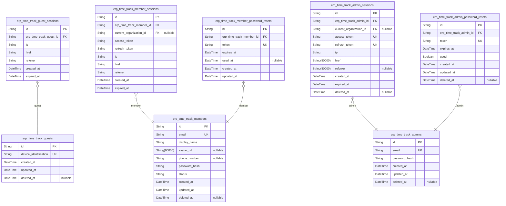
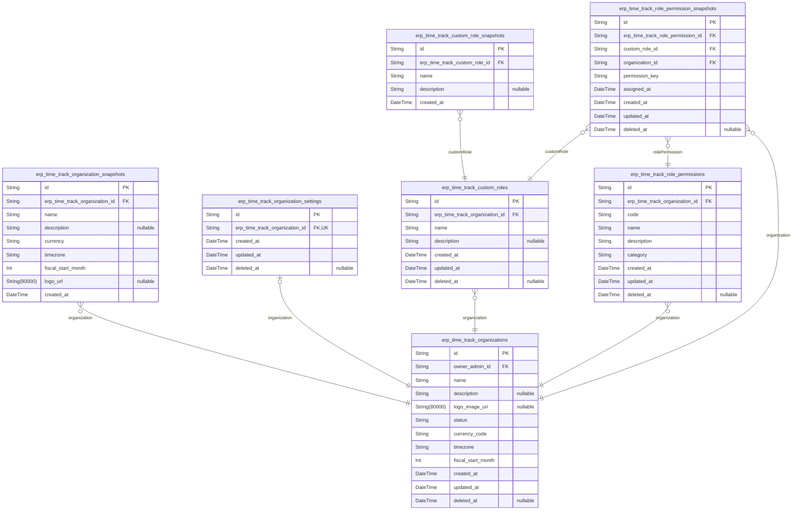
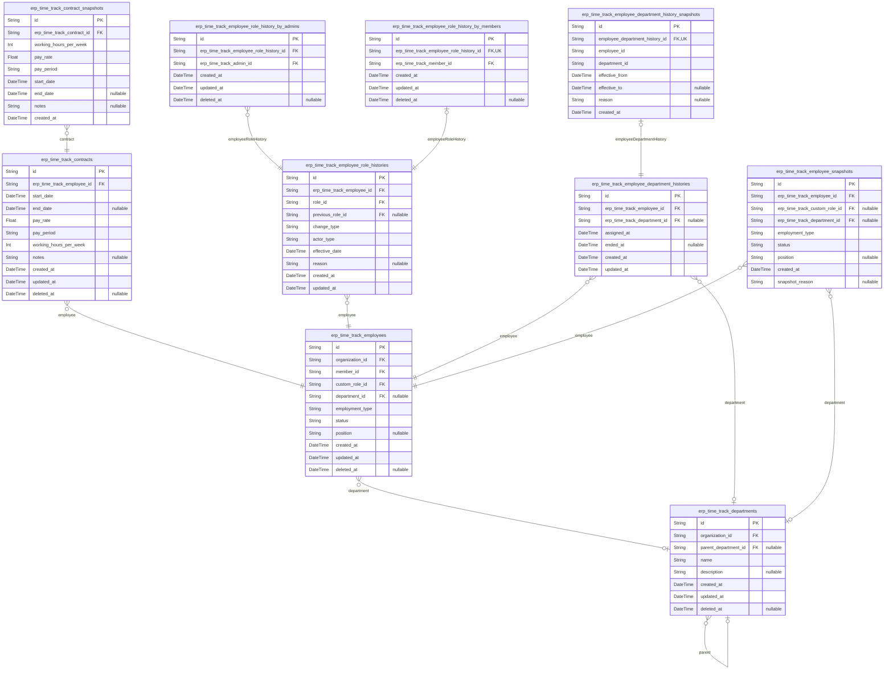
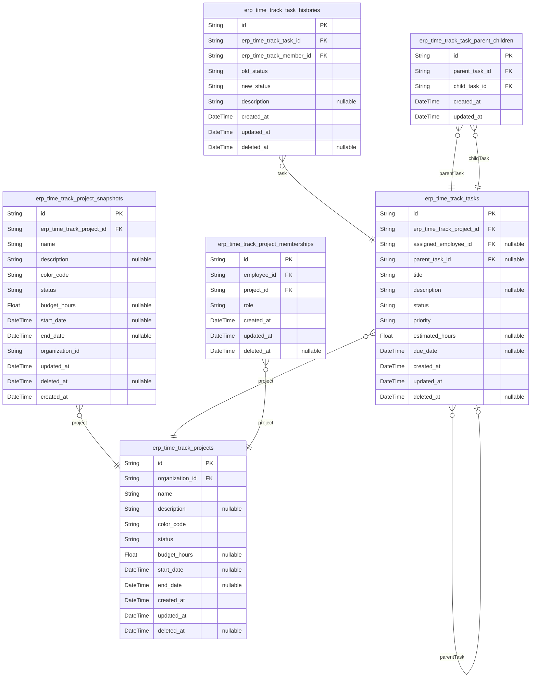
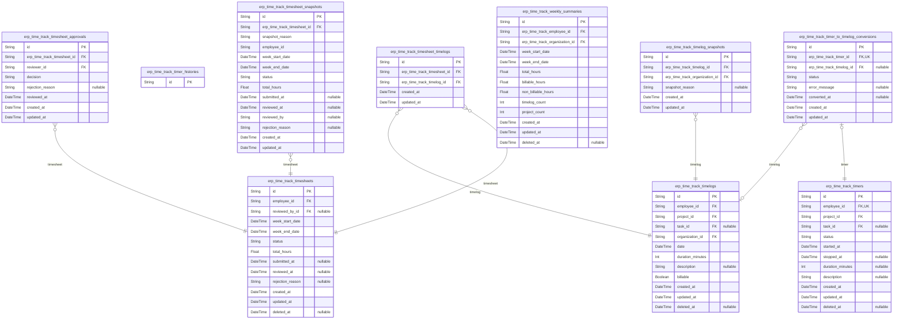
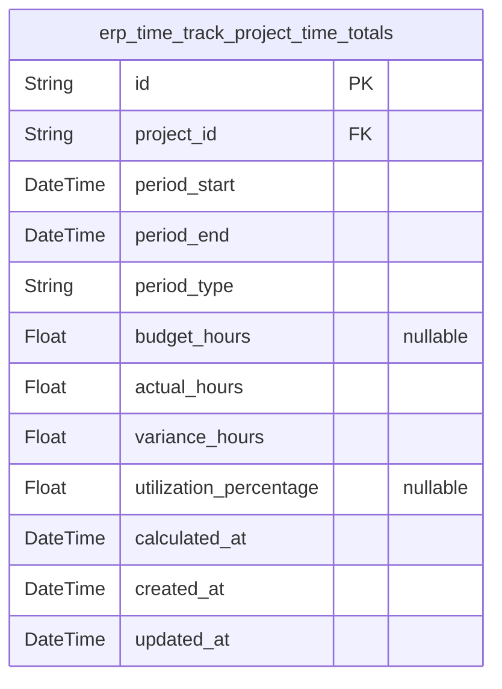

# Prisma Markdown

> Generated by [`prisma-markdown`](https://github.com/samchon/prisma-markdown)

- [Actors](#actors)
- [Systematic](#systematic)
- [HumanResources](#humanresources)
- [Projects](#projects)
- [TimeTracking](#timetracking)
- [default](#default)

## Actors

### `erp_time_track_guests`

Temporary guest accounts identified by device for unauthenticated access
to sign-up functionality.

Guest accounts represent anonymous users accessing the platform without
registration. They are identified by device fingerprints or session
tokens and have limited access compared to registered members. Guest
accounts cannot perform business operations but can access sign-up flows
and public information.

[erp_time_track_guest_sessions.id](#erp_time_track_guest_sessions) references sessions for this
guest account.

Properties as follows:

- `id`: Primary Key.
- `device_identification`
  > Unique device identifier or fingerprint used to recognize guest sessions
  > across multiple visits. This could be a browser fingerprint, device ID,
  > or session token.
- `created_at`: Timestamp when the guest account was first created.
- `updated_at`: Timestamp when the guest account was last updated.
- `deleted_at`
  > Timestamp when the guest account was soft-deleted, if applicable. Null
  > indicates the account is active.

### `erp_time_track_guest_sessions`

Temporary session tokens for guest access without authentication
credentials.

This table tracks guest sessions initiated by unauthenticated users
accessing sign-up functionality. Each session records connection context
including IP address, referrer URL, and the specific page accessed.
Sessions have a finite lifespan controlled by the expired_at timestamp,
after which they can no longer be used for guest operations.

Guest sessions differ from authenticated sessions in that they require no
login credentials and have limited permissions, primarily focused on
account creation and initial platform exploration. The system
automatically manages session expiration to prevent indefinite guest
access.

[erp_time_track_guests](#erp_time_track_guests)

Properties as follows:

- `id`: Primary Key.
- `erp_time_track_guest_id`: Associated guest actor's [erp_time_track_guests.id](#erp_time_track_guests).
- `ip`: IP address of the client device that initiated the session.
- `href`: URL or path accessed when the session was created.
- `referrer`: HTTP referrer header value indicating the previous page visited.
- `created_at`: Timestamp when the guest session was initiated.
- `expired_at`
  > Timestamp when the guest session becomes invalid and can no longer be
  > used.

### `erp_time_track_members`

Registered user accounts with email/password credentials for authentication.

Members are authenticated users who can belong to multiple organizations
via Employee associations. Each member has a global personal profile
including display name, avatar image, and phone number that is shared
across all organizations they belong to.

When logging in, members select which organization to work in
(organization context), with all subsequent actions scoped to the
selected organization. Members can switch organizations without logging
out. Members can delete their account, but if they are the sole owner of
an organization, they must transfer ownership or delete the organization
first.

Member sessions are tracked in [erp_time_track_member_sessions](#erp_time_track_member_sessions),
and password reset functionality is managed through {@link
erp_time_track_member_password_resets}.

Properties as follows:

- `id`: Primary Key.
- `email`
  > Unique email address for authentication and communication. Used as login
  > identifier and for sending password reset notifications.
- `display_name`: User's preferred display name shown across the platform.
- `avatar_url`: URL to the user's profile avatar image.
- `phone_number`: User's phone number for contact purposes.
- `password_hash`: Hashed password for authentication security.
- `status`
  > Account status indicating if the member is active, deactivated, or
  > deleted.
- `created_at`: Timestamp when the member account was created.
- `updated_at`: Timestamp when the member account was last updated.
- `deleted_at`: Timestamp when the member account was soft-deleted, or null if active.

### `erp_time_track_member_sessions`

JWT session tokens with access and refresh tokens for authenticated
member users, supporting organization context.

Each session represents a logged-in member user's authentication state,
including the access and refresh tokens for API authorization. Sessions
include organization context selection for members who belong to multiple
organizations, allowing them to work within a specific organizational
scope without re-authentication.

Sessions automatically expire based on the expired_at timestamp,
requiring users to refresh their tokens or re-authenticate. This table
supports the multi-organization membership model where users can switch
between organizations seamlessly while maintaining their authentication
state.

Properties as follows:

- `id`: Primary Key.
- `erp_time_track_member_id`
  > Reference to the authenticated member user who owns this session. {@link
  > erp_time_track_members.id}
- `current_organization_id`
  > Currently selected organization context for this session. Allows members
  > who belong to multiple organizations to work within a specific
  > organizational scope. [erp_time_track_organizations.id](#erp_time_track_organizations)
- `access_token`
  > JWT access token for API authorization. Encoded as a JSON Web Token
  > containing user identity and permissions. Must be validated on each
  > authenticated request.
- `refresh_token`
  > JWT refresh token for obtaining new access tokens without
  > re-authentication. Used when access tokens expire to maintain session
  > continuity.
- `ip`
  > Client IP address from which the session was initiated. Used for security
  > auditing and suspicious activity detection.
- `href`
  > Full URL of the page where the session was created. Useful for tracking
  > user entry points and session context.
- `referrer`
  > HTTP referrer header from the request that created the session. Indicates
  > the previous page the user visited before authentication.
- `created_at`
  > Timestamp when the session was created. Sessions are created upon
  > successful user authentication.
- `expired_at`
  > Timestamp when the session expires and becomes invalid. After this time,
  > the access token can no longer be used and requires refresh or
  > re-authentication.

### `erp_time_track_member_password_resets`

Password reset tokens for member account password recovery.

Stores temporary tokens that allow members to reset forgotten passwords.
Each token is uniquely generated and expires after a configurable period
(typically 24 hours). Tokens are single-use and invalidated after
successful password reset.

The table tracks token usage status and expiration to ensure security.
Expired or used tokens should be periodically cleaned up to maintain
database performance.

This table supports the authentication flow defined in requirements,
allowing members to recover access to their accounts when passwords are
forgotten.

Properties as follows:

- `id`: Primary Key.
- `erp_time_track_member_id`: Member who requested password reset. [erp_time_track_members.id](#erp_time_track_members).
- `token`
  > Unique password reset token generated for the member. Used in reset URL
  > for verification.
- `expires_at`
  > Timestamp when the password reset token expires and becomes invalid.
  > Typically set to 24 hours after creation.
- `used_at`
  > Timestamp when the password reset token was successfully used to reset
  > the password. Null indicates the token has not been used yet.
- `created_at`: Timestamp when the password reset token was created.
- `updated_at`: Timestamp when the password reset token record was last updated.

### `erp_time_track_admins`

Organization owner accounts with email/password credentials for
administrative authentication. Admins are the primary owners of
organizations with full administrative access to all features and
settings.

Each admin account represents a user with complete control over a
specific organization. Admins can manage organization settings, create
custom roles, invite employees, and oversee all business operations
within their organization. The admin authentication is separate from
member authentication to maintain clear security boundaries.

This table stores the authentication credentials and ownership
relationships for organization administrators. Admins reference their
owned organization via [erp_time_track_organizations.id](#erp_time_track_organizations) and have
associated sessions and password reset records for authentication
lifecycle management.

Properties as follows:

- `id`: Primary Key.
- `email`
  > Email address for admin authentication. Must be unique across all admin
  > accounts and used for login and password recovery.
- `password_hash`
  > Hashed password for secure authentication. Stored using industry-standard
  > cryptographic hashing algorithms.
- `created_at`
  > Timestamp when the admin account was created. Recorded automatically
  > during initial organization setup.
- `updated_at`
  > Timestamp when the admin account was last updated. Automatically updated
  > on any modification to the record.
- `deleted_at`
  > Timestamp when the admin account was soft-deleted. Null indicates the
  > account is active. When an admin deletes their account, this field is set
  > to mark the account as inactive while preserving historical data.

### `erp_time_track_admin_sessions`

JWT session tokens with access and refresh tokens for authenticated admin
users, supporting organization context.

This table manages login sessions for admin users, tracking their
authentication state and organization context. Each session contains JWT
tokens (access and refresh) for secure API access, connection metadata
for audit purposes, and temporal fields controlling session validity. The
organization context field enables admins to switch between organizations
they own without requiring re-authentication.

Sessions are used to maintain admin authentication across requests and
enable secure, stateless API interactions. The session lifecycle is
managed through expiration timestamps and can be manually revoked when
needed. [erp_time_track_admins](#erp_time_track_admins)

Properties as follows:

- `id`: Primary Key.
- `erp_time_track_admin_id`: Belonged admin's [erp_time_track_admins.id](#erp_time_track_admins).
- `current_organization_id`
  > Currently selected organization context for session operations. {@link
  > erp_time_track_organizations.id}.
- `access_token`: JWT access token for API authentication during this session.
- `refresh_token`
  > JWT refresh token for obtaining new access tokens when current one
  > expires.
- `ip`: IP address of the client device that created this session.
- `href`: Full URL of the page where the session was created.
- `referrer`: Referring URL that directed the user to the session creation page.
- `created_at`: Timestamp when this session was created.
- `expired_at`: Timestamp when this session expires and becomes invalid.
- `deleted_at`: Timestamp when this session was manually revoked or terminated.

### `erp_time_track_admin_password_resets`

Password reset tokens for admin account password recovery with expiration
security.

This table stores secure, time-limited tokens used for admin password
reset flows. Each token is cryptographically generated, associated with a
specific admin account, and expires after a security window to prevent
unauthorized access. Tokens are single-use and automatically invalidated
after consumption or expiration.

Tokens are generated when admins initiate password recovery and consumed
when they complete the password change process. The expiration mechanism
ensures security compliance while the used flag prevents token reuse
attacks. All password reset operations are audited through this table's
temporal tracking fields.

Properties as follows:

- `id`: Primary Key.
- `erp_time_track_admin_id`
  > Reference to the admin account initiating password reset. {@link
  > erp_time_track_admins.id}
- `token`
  > Cryptographically secure password reset token used for authentication in
  > password recovery flow.
- `expires_at`
  > Expiration timestamp when the token becomes invalid for security
  > compliance.
- `used`: Indicates whether the token has been consumed for password reset.
- `created_at`: Timestamp when the password reset token was generated.
- `updated_at`: Timestamp when the token record was last modified.
- `deleted_at`: Timestamp when the token was soft-deleted for audit purposes.

## Systematic

### `erp_time_track_organizations`

Main organization entity representing an isolated multi-tenant container
that scopes all business operations. Each organization operates
independently with its own employees, projects, and data. Organizations
have settings including currency, timezone, and fiscal configuration that
affect all business logic within the container. The organization owner
has full administrative control.

Organizations support complete data isolation between different companies
using the platform. All subsequent entities (employees, projects,
timelogs, etc.) are scoped to a specific organization through foreign key
relationships. Organization deletion requires resolution of all pending
timesheets and active employee contracts.

This table serves as the root of the multi-tenant architecture,
establishing the data isolation boundaries that ensure complete
separation between different business entities using the platform.

Properties as follows:

- `id`: Primary Key.
- `owner_admin_id`
  > Organization owner with full administrative control. {@link
  > erp_time_track_admins.id}
- `name`: Organization name for identification and display purposes.
- `description`: Brief description of the organization's purpose or industry.
- `logo_image_uri`: URI to the organization's logo image file for branding.
- `status`
  > Current operational status of the organization. Values: 'active' - fully
  > operational, 'suspended' - temporarily inactive, 'deleted' - permanently
  > removed but preserved for data retention.
- `currency_code`
  > Currency code for financial operations (ISO 4217 format, e.g., 'USD',
  > 'EUR', 'KRW').
- `timezone`
  > Primary timezone for the organization (IANA timezone format, e.g.,
  > 'America/New_York', 'Asia/Seoul').
- `fiscal_start_month`: Month number (1-12) when the organization's fiscal year begins.
- `created_at`: Timestamp when the organization was created.
- `updated_at`: Timestamp when the organization was last updated.
- `deleted_at`: Timestamp when the organization was soft-deleted, null if active.

### `erp_time_track_organization_snapshots`

Point-in-time snapshots of organization data for audit and historical
tracking.

This table captures the complete state of an organization at specific
moments in time, preserving historical configurations and settings for
compliance, audit trails, and change tracking. Each snapshot represents a
frozen view of the organization's attributes including name, description,
currency, timezone, fiscal configuration, and visual identity.

Snapshots are created whenever significant changes occur to organization
settings or periodically for compliance requirements. They provide an
immutable historical record that cannot be modified after creation,
ensuring audit integrity and supporting data recovery scenarios.

[erp_time_track_organizations.id](#erp_time_track_organizations)

Properties as follows:

- `id`: Primary Key.
- `erp_time_track_organization_id`
  > Reference to the organization whose state is captured in this snapshot.
  > [erp_time_track_organizations.id](#erp_time_track_organizations).
- `name`: Organization name as recorded at snapshot time.
- `description`: Organization description as recorded at snapshot time.
- `currency`
  > Preferred currency code (e.g., USD, EUR, KRW) for financial operations at
  > snapshot time.
- `timezone`
  > Primary timezone identifier (e.g., America/New_York, Asia/Seoul) for
  > scheduling at snapshot time.
- `fiscal_start_month`
  > Month (1-12) marking the start of the organization's fiscal year at
  > snapshot time.
- `logo_url`: URL to the organization logo image as stored at snapshot time.
- `created_at`
  > Timestamp when this snapshot was created, marking the point-in-time
  > capture moment.

### `erp_time_track_organization_settings`

Organization-specific configuration settings that extend beyond basic
organizational attributes. This table stores settings that are truly
supplementary to the core organization data defined in the parent table.
Each organization has exactly one settings record for extended
configuration needs.

Note: Core organization attributes like currency_code, timezone,
fiscal_start_month, and logo are already stored in the parent {@link
erp_time_track_organizations} table and should not be duplicated here.

Properties as follows:

- `id`: Primary Key.
- `erp_time_track_organization_id`
  > Organization that owns these extended settings. {@link
  > erp_time_track_organizations.id}
- `created_at`: Timestamp when these settings were created.
- `updated_at`: Timestamp when these settings were last modified.
- `deleted_at`: Timestamp when these settings were soft deleted. Null if active.

### `erp_time_track_custom_roles`

Custom roles defined within an organization for granular access control.
Custom roles supplement the built-in immutable roles (Owner, Manager,
Employee) by allowing organizations to create tailored permission sets
that match specific operational needs. Each custom role has a unique name
within its organization and contains a defined set of permissions from
the available permission list.

Custom roles serve as the primary mechanism for grouping permissions into
logical sets that align with organizational structure and job functions.
Organization owners can create, edit, and delete custom roles, with
deletion only permitted when no employees are assigned to the role. Role
changes immediately affect all employees assigned to that role.

Custom roles support the single employee role assignment model where each
employee has exactly one role at any given time. These roles provide
business-aligned abstraction between individual permissions and employee
assignments, making access control manageable and meaningful within the
organizational context. [erp_time_track_organizations.id](#erp_time_track_organizations)

Properties as follows:

- `id`: Primary Key.
- `erp_time_track_organization_id`
  > Organization that owns this custom role. Custom roles are
  > organization-specific and cannot be shared across organizations. {@link
  > erp_time_track_organizations.id}
- `name`
  > Unique name of the custom role within the organization. Must be distinct
  > from other custom role names in the same organization and from built-in
  > role names (Owner, Manager, Employee). Used for identification in UI and
  > reporting.
- `description`
  > Optional description explaining the purpose and intended use of this
  > custom role. Can include information about which job functions or
  > positions should receive this role, or any special considerations for its
  > use.
- `created_at`
  > Timestamp when this custom role was created. Recorded automatically at
  > creation time.
- `updated_at`
  > Timestamp when this custom role was last modified. Updated automatically
  > whenever the role name, description, or permission assignments are
  > changed.
- `deleted_at`
  > Timestamp when this custom role was soft-deleted. Null indicates the role
  > is active. Custom roles can only be deleted when no employees are
  > assigned to them. Deletion removes the role definition permanently but
  > does not affect historical activity logs.

### `erp_time_track_custom_role_snapshots`

Historical point-in-time snapshots of custom role definitions for audit
trail and compliance tracking.

Captures the complete state of custom roles at specific moments,
preserving the exact role name, description, and organizational context
as they existed when the snapshot was taken. These records are
append-only and immutable, providing an auditable history of role
configuration changes over time.

Used for compliance verification, change tracking, and historical
analysis of role evolution within the organization. Each snapshot
references the specific custom role it documents via {@link
erp_time_track_custom_roles.id}.

Properties as follows:

- `id`: Primary Key.
- `erp_time_track_custom_role_id`
  > The custom role being snapshotted. References {@link
  > erp_time_track_custom_roles.id}.
- `name`
  > The exact name of the custom role as it existed when the snapshot was
  > taken.
- `description`
  > The full description of the custom role's purpose and scope at the time
  > of snapshot.
- `created_at`
  > The date and time when this snapshot was created, establishing the
  > historical point-in-time reference.

### `erp_time_track_role_permissions`

Granular permissions available for assignment to custom roles within an
organization. Each permission defines a specific capability that can be
granted to users through role assignments.

Permissions are organization-specific to support custom permission sets.
The permission code follows a standardized format (e.g., 'org:manage',
'employee:view') that corresponds to specific system capabilities. This
table serves as the reference lookup for all available permission
definitions within an organization context.

Permissions from this table are assigned to {@link
erp_time_track_custom_roles} through junction relationships to create
complete role definitions with specific permission sets.

Properties as follows:

- `id`: Primary Key.
- `erp_time_track_organization_id`
  > Organization that owns this permission definition. {@link
  > erp_time_track_organizations.id}.
- `code`
  > Unique permission identifier following standardized format (e.g.,
  > 'org:manage', 'employee:view', 'project:manage'). Used as a stable
  > reference in authorization logic.
- `name`
  > Human-readable name of the permission for display purposes (e.g., 'Manage
  > Organization', 'View Employees').
- `description`
  > Detailed explanation of what this permission grants to users, including
  > scope and limitations.
- `category`
  > Functional category grouping for permissions (e.g., 'organization',
  > 'employee', 'project', 'time', 'report').
- `created_at`: Timestamp when this permission definition was created.
- `updated_at`: Timestamp when this permission definition was last updated.
- `deleted_at`
  > Timestamp when this permission definition was soft-deleted. Null
  > indicates active permission.

### `erp_time_track_role_permission_snapshots`

Point-in-time snapshots of role permission assignments for audit and
historical tracking.

This table captures the complete state of role permission assignments
whenever changes occur, providing an immutable audit trail for compliance
and historical analysis. Each snapshot records the permission assignment
configuration between a custom role and a specific permission, including
the organization context and assignment metadata.

Snapshots are automatically created whenever role permission assignments
are created, modified, or deleted. The historical record enables tracking
permission evolution over time and supports compliance reporting
requirements.

Properties as follows:

- `id`: Primary Key.
- `erp_time_track_role_permission_id`
  > The role permission assignment being snapshotted. {@link
  > erp_time_track_role_permissions.id}.
- `custom_role_id`
  > The custom role to which the permission is assigned. {@link
  > erp_time_track_custom_roles.id}.
- `organization_id`
  > Organization context for this role permission assignment. {@link
  > erp_time_track_organizations.id}.
- `permission_key`
  > The specific permission key being assigned to the role, such as
  > 'org:manage', 'employee:view', etc.
- `assigned_at`: Timestamp when this permission was originally assigned to the role.
- `created_at`: Timestamp when this snapshot was created.
- `updated_at`: Timestamp when this snapshot was last updated.
- `deleted_at`: Timestamp when this snapshot was soft-deleted, or null if active.

## HumanResources

### `erp_time_track_employees`

Employees represent user-organization associations with specific roles,
departments, and employment terms within an organization. This table
connects users (members) to organizations, defining their role,
department assignment, employment type, and status within that specific
organizational context.

Each employee record exists within exactly one organization's data
isolation boundary and belongs to exactly one user account. An employee
can have different roles, departments, and employment types across
different organizations through separate employee records. Employee
status controls whether they can perform actions within the system, with
deactivated employees preserving historical data but unable to log time
or submit timesheets.

Historical changes to employee role assignments and department
assignments are tracked in separate history tables {@link
erp_time_track_employee_role_histories} and {@link
erp_time_track_employee_department_histories}. Audit snapshots are
maintained in [erp_time_track_employee_snapshots](#erp_time_track_employee_snapshots).

Properties as follows:

- `id`: Primary Key.
- `organization_id`
  > The organization this employee belongs to. Each employee exists within
  > exactly one organization's data isolation boundary. {@link
  > erp_time_track_organizations.id}.
- `member_id`
  > The user account associated with this employee record. The member
  > represents the global user identity that can belong to multiple
  > organizations through separate employee records. {@link
  > erp_time_track_members.id}.
- `custom_role_id`
  > The role assigned to this employee within the organization. Each employee
  > has exactly one role that defines their permissions and capabilities.
  > [erp_time_track_custom_roles.id](#erp_time_track_custom_roles).
- `department_id`
  > Optional department assignment for organizational structure. Employees
  > can belong to at most one department at a time, providing functional
  > grouping within the organization. [erp_time_track_departments.id](#erp_time_track_departments).
- `employment_type`
  > Classification of the employee's work arrangement within the
  > organization. Determines reporting, payroll considerations, and
  > potentially business rules around working hours and benefits.
- `status`
  > Indicates whether the employee is currently participating in
  > organizational activities. Active employees can log time, submit
  > timesheets, and perform work-related actions. Deactivated employees
  > preserve historical data but cannot perform actions.
- `position`
  > Optional job title or position description within the organization.
  > Provides additional context for organizational structure and reporting
  > without predefined values.
- `created_at`
  > Timestamp when this employee record was created. Represents when the
  > user-organization association was established.
- `updated_at`
  > Timestamp when this employee record was last updated. Tracks
  > modifications to role, department, employment type, position, or status.
- `deleted_at`
  > Timestamp when this employee record was soft-deleted. Null indicates
  > active record. Enables historical preservation while removing from active
  > operations.

### `erp_time_track_contracts`

Employment contracts defining compensation terms, pay periods, and
working arrangements for employees within an organization.

Each contract specifies the employment terms for an employee, including
pay rate, working hours, and duration. Employees can have multiple
contracts over time, but only one contract can be active at a time.
Creating a new contract automatically ends the previous active contract
by setting its end date to the day before the new contract starts.

Contracts are managed by users with `employee:manage` permission and
serve as immutable historical records once ended. They are foundational
for payroll calculations, time tracking compliance, and employment record
keeping.

[erp_time_track_employees.id](#erp_time_track_employees) {@link
erp_time_track_member_sessions.id} {@link
erp_time_track_admin_sessions.id}

Properties as follows:

- `id`: Primary Key.
- `erp_time_track_employee_id`
  > The employee this contract belongs to. Only one contract can be active
  > per employee at any given time. [erp_time_track_employees.id](#erp_time_track_employees)
- `start_date`
  > The date when this contract becomes effective. Must be provided and
  > cannot be in the future relative to contract creation.
- `end_date`
  > The date when this contract ends, if applicable. Null indicates an
  > ongoing contract with no specified end date. When a new contract is
  > created for the same employee, this is automatically set to the day
  > before the new contract's start date.
- `pay_rate`
  > The compensation amount per pay period, expressed as a decimal number.
  > For hourly pay periods, this is the hourly rate; for monthly, this is the
  > monthly salary.
- `pay_period`
  > The frequency of payment for this contract. Must be one of: 'hourly',
  > 'daily', 'weekly', 'monthly'.
- `working_hours_per_week`
  > The expected number of working hours per week for full-time equivalence.
  > Used for overtime calculations and compliance tracking.
- `notes`
  > Optional notes or special terms associated with this contract, such as
  > specific allowances, bonuses, or conditions.
- `created_at`: Timestamp when this contract record was created in the system.
- `updated_at`: Timestamp when this contract record was last modified.
- `deleted_at`
  > Timestamp when this contract record was soft-deleted, allowing for data
  > recovery if needed. Null indicates the contract is active.

### `erp_time_track_departments`

Organizational departments providing structure for grouping employees
within an organization. Departments support one level of nesting with
optional parent-child relationships for organizational hierarchy.

Departments serve as functional divisions or teams within a company
structure. When a department is deleted, all employee references to that
department are automatically cleared while preserving employee records.
Departments are scoped to a specific organization and cannot be shared
across organizational boundaries.

Each department has a unique name within its organization to ensure clear
identification. The optional parent department reference enables simple
two-level hierarchy for organizational reporting structures.

Properties as follows:

- `id`: Primary Key.
- `organization_id`: Belonged organization's [erp_time_track_organizations.id](#erp_time_track_organizations).
- `parent_department_id`
  > Parent department's [erp_time_track_departments.id](#erp_time_track_departments) for one-level
  > hierarchy. Null for root-level departments.
- `name`
  > Department name identifier describing function or purpose within the
  > organization.
- `description`
  > Additional information about department responsibilities, scope, and
  > function.
- `created_at`: Timestamp when department record was created.
- `updated_at`: Timestamp when department record was last updated.
- `deleted_at`
  > Timestamp when department was soft-deleted. Null indicates active
  > department.

### `erp_time_track_employee_role_histories`

Tracks historical role assignments for employees, recording when roles
were assigned or changed within an organization. This table provides a
complete audit trail of role transitions, including attribution of who
made each change and the specific dates of role assignments. Each entry
represents a single role assignment event, whether initial assignment or
subsequent change.

Key business purpose: Maintains compliance records for role-based access
control changes, supports investigation of permission escalations, and
provides historical context for employee capability evolution within the
organization.

When an employee's role is assigned or changed through employee
management operations, a new record is created in this table. The record
captures the employee, the assigned role, who authorized the change, and
when it took effect.

Related entities: [erp_time_track_employees](#erp_time_track_employees) (the employee whose
role changed), [erp_time_track_custom_roles](#erp_time_track_custom_roles) or built-in roles (the
assigned role), [erp_time_track_admins](#erp_time_track_admins) or {@link
erp_time_track_members} (who made the change).

Properties as follows:

- `id`: Primary Key.
- `erp_time_track_employee_id`
  > The employee whose role assignment is being recorded. This references the
  > specific employee record within the organization where the role change
  > occurred. [erp_time_track_employees.id](#erp_time_track_employees)
- `role_id`
  > The role assigned to the employee. References either a custom role
  > defined within the organization or a built-in role identifier. {@link
  > erp_time_track_custom_roles.id}
- `previous_role_id`
  > The previous role held by the employee before this change, if applicable.
  > Null for initial role assignments where there was no previous role.
  > [erp_time_track_custom_roles.id](#erp_time_track_custom_roles)
- `change_type`
  > Type of role change: 'assignment' (initial role assignment),
  > 'reassignment' (role change), or 'removal' (role removal). Indicates the
  > nature of the role transition event.
- `actor_type`
  > Type of actor who made the role change: 'admin' or 'member'. Determines
  > which subtype table contains the specific actor reference.
- `effective_date`
  > Date and time when the role change took effect. This determines when the
  > employee's permissions were updated to match the new role.
- `reason`
  > Optional reason or justification for the role change, such as promotion,
  > department transfer, or organizational restructuring. Provides context
  > for audit purposes.
- `created_at`
  > Timestamp when this role history record was created. Automatically set
  > when the role change is recorded in the system.
- `updated_at`
  > Timestamp when this role history record was last updated. Automatically
  > updated on modifications.

### `erp_time_track_employee_department_histories`

Historical records tracking department assignment changes for employees
within an organization.

Captures when an employee was assigned to a specific department and when
that assignment ended. Supports organizational structure analysis,
employee movement tracking, and historical reporting of department
affiliations. Each record represents a contiguous period of time during
which an employee was assigned to a particular department.

Created automatically when employees change departments via employee
management operations. Used primarily for audit trails, historical
reporting, and understanding organizational structure evolution over
time.

Properties as follows:

- `id`: Primary Key.
- `erp_time_track_employee_id`
  > Reference to the employee whose department assignment is being tracked.
  > [erp_time_track_employees.id](#erp_time_track_employees)
- `erp_time_track_department_id`
  > Reference to the department to which the employee was assigned. Null
  > indicates the employee had no department assignment during this period.
  > [erp_time_track_departments.id](#erp_time_track_departments)
- `assigned_at`
  > Timestamp when the department assignment started. For initial
  > assignments, this matches employee creation or department creation date.
- `ended_at`
  > Timestamp when the department assignment ended. Null indicates the
  > assignment is still active (current department). Automatically set when a
  > new department assignment record is created for the same employee.
- `created_at`: Timestamp when this historical record was created in the system.
- `updated_at`
  > Timestamp when this historical record was last updated. Primarily used
  > when correcting historical data.

### `erp_time_track_employee_snapshots`

Point-in-time snapshots of employee data for audit and historical
preservation.

This table captures the complete state of employee records at specific
moments, including all employment details, role assignments, and
department relationships. Snapshots are created whenever significant
changes occur to employee data, such as role changes, department
transfers, or employment status updates.

Each snapshot references the original employee record via {@link
erp_time_track_employees.id} and includes denormalized data from related
entities like roles and departments to preserve historical context even
if those referenced entities are later modified or deleted.

These snapshots serve compliance requirements by maintaining immutable
records of employment terms and organizational assignments over time.
Access parent employee data via the foreign key relationship, never by
duplicating parent fields.

Properties as follows:

- `id`: Primary Key.
- `erp_time_track_employee_id`
  > Original employee record that this snapshot captures. {@link
  > erp_time_track_employees.id}.
- `erp_time_track_custom_role_id`
  > Role assigned to the employee at snapshot time. {@link
  > erp_time_track_custom_roles.id}.
- `erp_time_track_department_id`
  > Department assignment at snapshot time. {@link
  > erp_time_track_departments.id}.
- `employment_type`
  > Employment classification type at snapshot time (full-time, part-time,
  > contractor, intern).
- `status`: Employee status at snapshot time (active, deactivated).
- `position`: Job title or position description at snapshot time.
- `created_at`: Timestamp when this snapshot was created.
- `snapshot_reason`
  > Business reason for creating this snapshot (role change, department
  > transfer, status update, etc.).

### `erp_time_track_contract_snapshots`

Historical snapshots of employment contracts capturing point-in-time
state for audit trails and compliance verification.

Each snapshot preserves the exact terms of a contract at a specific
moment, including working hours specification, pay rate and period, and
employment dates. This immutable record supports payroll accuracy
verification, regulatory compliance audits, and historical analysis of
employment arrangements.

Snapshots are created whenever contract terms are modified, ensuring a
complete audit trail of employment relationship changes. The denormalized
structure allows direct historical reference without requiring access to
the original contract record.

Related to: [erp_time_track_contracts](#erp_time_track_contracts) (original contract), {@link
erp_time_track_employees} (employed individual).

Properties as follows:

- `id`: Primary Key.
- `erp_time_track_contract_id`
  > Reference to the original contract being snapshotted. {@link
  > erp_time_track_contracts.id}.
- `working_hours_per_week`
  > Expected weekly workload specification as defined in the contract. This
  > value establishes baseline employment expectations and informs overtime
  > calculations and compliance tracking.
- `pay_rate`
  > Compensation amount as specified in the contract. The exact numerical
  > value forms the basis for payroll calculations and financial reporting.
- `pay_period`
  > Frequency of compensation payments: hourly, daily, weekly, or monthly.
  > Determines payroll processing intervals and calculation methods.
- `start_date`
  > Effective start date of the employment terms. Marks when the contractual
  > obligations and compensation arrangements become active.
- `end_date`
  > Planned termination date of the employment terms, if applicable. Null
  > indicates ongoing employment without specified end date.
- `notes`
  > Additional contextual information or special terms associated with the
  > employment arrangement. May include bonus structures, special conditions,
  > or contractual notes.
- `created_at`
  > Timestamp when this snapshot was created, capturing the exact moment of
  > contract state preservation for audit trail purposes.

### `erp_time_track_employee_department_history_snapshots`

Point-in-time snapshots of employee department history for audit trail
and historical state preservation.

This table captures immutable historical states of employee department
assignments, providing a complete audit trail of organizational structure
changes. Each snapshot records the exact department assignment details at
a specific moment in time, including department reference, effective date
range, and assignment reason.

When an employee's department assignment changes or is updated, a
snapshot is created to preserve the historical state before modification.
This supports compliance requirements, organizational reporting, and
historical analysis of workforce structure evolution.

Related entities: [erp_time_track_employee_department_histories](#erp_time_track_employee_department_histories),
[erp_time_track_employees](#erp_time_track_employees), [erp_time_track_departments](#erp_time_track_departments)

Properties as follows:

- `id`: Primary Key.
- `employee_department_history_id`
  > Reference to the original employee department history record that was
  > snapshotted. [erp_time_track_employee_department_histories.id](#erp_time_track_employee_department_histories).
- `employee_id`
  > Employee who was assigned to the department. Denormalized from the
  > original history record for audit integrity. {@link
  > erp_time_track_employees.id}.
- `department_id`
  > Department the employee was assigned to. Denormalized from the original
  > history record for audit integrity. {@link
  > erp_time_track_departments.id}.
- `effective_from`
  > Start date when the department assignment became effective. Denormalized
  > from original history.
- `effective_to`
  > End date when the department assignment ceased to be effective. Null
  > indicates ongoing assignment. Denormalized from original history.
- `reason`
  > Explanation for the department assignment or change, such as promotion,
  > reorganization, or transfer.
- `created_at`
  > Timestamp when this snapshot was created, capturing the point-in-time
  > state.

### `erp_time_track_employee_role_history_by_admins`

Links employee role change history records to the specific admin users
who performed the role assignments or modifications.

This table provides an audit trail for role changes within the
organization, connecting historical role assignments recorded in {@link
erp_time_track_employee_role_histories} with the administrator accounts
from [erp_time_track_admins](#erp_time_track_admins) who authorized the changes. Role
changes can only be performed by users with appropriate permissions
(typically administrators with employee management privileges). Each
entry represents a single role change action performed by an admin,
recording both the historical role change event and the responsible
administrator.

This audit trail supports compliance requirements, organizational
transparency, and accountability tracking for role modifications within
the human resources management system.

Properties as follows:

- `id`: Primary Key.
- `erp_time_track_employee_role_history_id`
  > Reference to the specific role change history entry. {@link
  > erp_time_track_employee_role_histories.id}
- `erp_time_track_admin_id`
  > Reference to the admin account who performed the role change. {@link
  > erp_time_track_admins.id}
- `created_at`
  > Timestamp when this role change recording was created, indicating when
  > the admin performed the role modification.
- `updated_at`
  > Timestamp when this role change recording was last updated, tracking
  > modifications to the audit record.
- `deleted_at`
  > Timestamp when this role change recording was soft-deleted, allowing for
  > audit trail preservation while supporting data cleanup workflows.

### `erp_time_track_employee_role_history_by_members`

Links employee role history entries to the member users who performed the
role changes.

This table establishes the connection between role change history records
and the specific member accounts that initiated those changes. Each
employee role change can be performed by either a member user or an admin
user, tracked separately to maintain clear attribution. This table
specifically handles changes made by members (non-admin users).

The record is created when a member user changes an employee's role
assignment within the organization, and it serves as an audit trail for
permission management actions. {@link
erp_time_track_employee_role_histories.id} references the history entry
being attributed, while [erp_time_track_members.id](#erp_time_track_members) identifies the
member user who executed the change.

This table is part of the comprehensive audit system for employee role
management, ensuring accountability and traceability of all role
assignment modifications.

Properties as follows:

- `id`: Primary Key.
- `erp_time_track_employee_role_history_id`
  > The role change history entry being attributed to a member user. {@link
  > erp_time_track_employee_role_histories.id}.
- `erp_time_track_member_id`
  > The member user who performed the role change. {@link
  > erp_time_track_members.id}.
- `created_at`
  > Timestamp when this attribution record was created, matching the role
  > change execution time.
- `updated_at`
  > Timestamp when this attribution record was last updated. Typically
  > matches created_at as these records are immutable after creation.
- `deleted_at`
  > Timestamp when this attribution record was soft deleted, allowing for
  > audit trail preservation while marking the record as inactive.

## Projects

### `erp_time_track_projects`

Main project entity representing work initiatives within an organization.

Projects organize work efforts with budgets, timelines, and visual
identification. Each project has a status lifecycle (active, archived,
completed) and can contain multiple tasks. Projects are assigned to
employees through project memberships with specific roles (member or
project-lead).

Budget hours track estimated vs actual time consumption, while start and
end dates define the project timeline. Color codes provide visual
identification in user interfaces. Projects are strictly scoped to their
parent organization ensuring multi-tenancy data isolation.

Related entities: [erp_time_track_organizations](#erp_time_track_organizations) (parent
organization), [erp_time_track_project_memberships](#erp_time_track_project_memberships) (employee
assignments), [erp_time_track_tasks](#erp_time_track_tasks) (contained work items).

Properties as follows:

- `id`: Primary Key.
- `organization_id`
  > Parent organization that owns this project. {@link
  > erp_time_track_organizations.id}.
- `name`: Project name for identification and reference.
- `description`: Detailed project description explaining purpose, scope, and objectives.
- `color_code`
  > Hexadecimal color code (e.g., #FF5733) for visual identification in user
  > interfaces.
- `status`
  > Current lifecycle status: 'active' (accepting time entries), 'archived'
  > (historical reference only), or 'completed' (finished work).
- `budget_hours`
  > Total estimated hours budgeted for the project. Null indicates no budget
  > tracking.
- `start_date`: Planned project start date for timeline reference.
- `end_date`: Planned project end date for timeline reference.
- `created_at`: Timestamp when the project was created.
- `updated_at`: Timestamp when the project was last modified.
- `deleted_at`: Timestamp when the project was soft-deleted. Null indicates active record.

### `erp_time_track_project_snapshots`

Point-in-time snapshots of project data for audit trail and historical
reference.

Captures the complete state of a project at a specific moment in time,
including all business fields denormalized from the main project entity.
Used for auditing changes, historical analysis, and compliance reporting.
Each snapshot is immutable and append-only, preserving the project's
configuration, status, and timeline details as they existed when the
snapshot was created.

This snapshot table includes denormalized copies of parent project fields
including organization reference for complete audit trail. Fields are
captured as they existed at snapshot creation time, enabling historical
queries and change tracking.

[erp_time_track_projects](#erp_time_track_projects)

Properties as follows:

- `id`: Primary Key.
- `erp_time_track_project_id`: Reference to the parent project. [erp_time_track_projects.id](#erp_time_track_projects)
- `name`: Project name as recorded at snapshot time.
- `description`: Project description as recorded at snapshot time.
- `color_code`: Visual color identification for UI display.
- `status`: Project status: active, archived, or completed.
- `budget_hours`: Total estimated hours budgeted for the project.
- `start_date`: Project start date.
- `end_date`: Project end date.
- `organization_id`
  > Denormalized organization reference from parent project for audit
  > completeness. [erp_time_track_organizations.id](#erp_time_track_organizations)
- `updated_at`: Denormalized updated timestamp from parent project at snapshot time.
- `deleted_at`: Denormalized soft deletion timestamp from parent project at snapshot time.
- `created_at`: Timestamp when the snapshot was created.

### `erp_time_track_tasks`

Individual work units within projects representing specific assignments
with status, priority, estimates, and due dates.

Tasks break down project work into manageable units that can be assigned
to employees. Each task belongs to exactly one project and may optionally
be assigned to an employee who is a member of that project. Tasks support
hierarchical relationships with one level of nesting for subtasks.

Status progression follows: open → in-progress → completed → closed.
Priority levels indicate urgency for scheduling and resource allocation.
Estimated hours and due dates help with project planning and tracking.

Tasks are the foundation for time tracking, as employees log time against
specific tasks. [erp_time_track_projects.id](#erp_time_track_projects) {@link
erp_time_track_employees.id}

Properties as follows:

- `id`: Primary Key.
- `erp_time_track_project_id`
  > The parent project containing this task. {@link
  > erp_time_track_projects.id}
- `assigned_employee_id`
  > The employee assigned to work on this task, must be a member of the
  > parent project. [erp_time_track_employees.id](#erp_time_track_employees)
- `parent_task_id`
  > Parent task for hierarchical relationships (one-level nesting only).
  > [erp_time_track_tasks.id](#erp_time_track_tasks)
- `title`: Short, descriptive title of the task summarizing the work to be done.
- `description`
  > Detailed explanation of the task requirements, acceptance criteria, or
  > context.
- `status`
  > Current progress state of the task.
  >
  > Allowed values:
  > - 'open': New task, not yet started
  > - 'in-progress': Actively being worked on
  > - 'completed': Work finished, awaiting verification
  > - 'closed': Finalized and verified
  >
  > Status changes are recorded in [erp_time_track_task_histories](#erp_time_track_task_histories).
- `priority`
  > Urgency level for scheduling and resource allocation.
  >
  > Allowed values:
  > - 'low': Minor importance, can be deferred
  > - 'medium': Standard priority
  > - 'high': Important, should be addressed soon
  > - 'urgent': Critical, requires immediate attention
- `estimated_hours`
  > Estimated number of hours required to complete the task, used for
  > planning and tracking project budgets.
- `due_date`: Target completion date for this task.
- `created_at`: Timestamp when the task was initially created.
- `updated_at`: Timestamp when the task was last modified.
- `deleted_at`: Timestamp when the task was soft deleted, or null if active.

### `erp_time_track_task_histories`

Tracks historical status changes for tasks, recording audit trails of
workflow transitions.

Each time a task's status changes (e.g., from 'open' to 'in-progress', or
'in-progress' to 'completed'), this table records the old status, new
status, who made the change, and when it occurred. This provides a
complete audit trail for task lifecycle management, enabling review of
task progress over time and supporting compliance requirements.

These records are created automatically whenever task status updates
occur and are typically read-only for audit purposes. The description
field allows for optional notes about why the status change occurred,
such as 'Task completed ahead of schedule' or 'Reopened due to new
requirements'.

[erp_time_track_tasks](#erp_time_track_tasks) serve as the parent entities for these
histories, with each task having multiple historical status change
records. [erp_time_track_members](#erp_time_track_members) represent the users who performed
the status changes, which may be task assignees, project leads, or
managers with appropriate permissions.

Includes standard temporal fields for audit trail completeness:
created_at records when the status change occurred, updated_at tracks any
modifications to the history record, and deleted_at supports soft
deletion for compliance purposes.

Properties as follows:

- `id`: Primary Key.
- `erp_time_track_task_id`: Task whose status changed. [erp_time_track_tasks.id](#erp_time_track_tasks).
- `erp_time_track_member_id`
  > Member user who performed the status change. {@link
  > erp_time_track_members.id}.
- `old_status`
  > Task status before the change occurred. Valid values correspond to task
  > status lifecycle: 'open', 'in-progress', 'completed', 'closed'.
- `new_status`
  > Task status after the change occurred. Valid values correspond to task
  > status lifecycle: 'open', 'in-progress', 'completed', 'closed'.
- `description`
  > Optional description of why the status change occurred, providing context
  > for the workflow transition.
- `created_at`
  > Timestamp when the status change was recorded. This serves as the audit
  > trail timestamp for the historical record.
- `updated_at`
  > Timestamp when this history record was last modified. Supports audit
  > trail completeness for any corrections or annotations to historical
  > status changes.
- `deleted_at`
  > Timestamp when this history record was soft-deleted, supporting
  > compliance and data retention requirements while preserving referential
  > integrity.

### `erp_time_track_task_parent_children`

Hierarchical relationships between parent and child tasks, enforcing
one-level nesting constraints.

This junction table establishes parent-child relationships between tasks
within the same project. A task can have multiple child tasks (subtasks),
and a child task can have only one parent, implementing a one-level
nesting hierarchy as specified in requirements. The relationship is
constrained to prevent circular references and ensure proper hierarchical
structure.

Parent-child relationships are managed through task operations rather
than directly, making this a supporting entity for the task hierarchy
system. When tasks are deleted, their associated parent-child
relationships are automatically removed via cascade constraints.

[erp_time_track_tasks.id](#erp_time_track_tasks)

Properties as follows:

- `id`: Primary Key.
- `parent_task_id`: Parent task reference. [erp_time_track_tasks.id](#erp_time_track_tasks)
- `child_task_id`: Child task reference. [erp_time_track_tasks.id](#erp_time_track_tasks)
- `created_at`: Timestamp when the parent-child relationship was established.
- `updated_at`: Timestamp when the relationship was last modified.

### `erp_time_track_project_memberships`

Junction table linking employees to projects with specific roles within
projects.

This table implements a many-to-many relationship between employees and
projects, allowing employees to be assigned to multiple projects and
projects to have multiple assigned employees. Each assignment includes a
role that determines the employee's level of responsibility within that
specific project.

**Project Roles:**
- **member**: Standard project participant who can work on tasks and log
time within the project.
- **project-lead**: Project leader who can manage tasks within their
assigned project in addition to standard member capabilities.

**Business Context:** Users with project management permission can assign
employees to projects and set their roles. Project leads have task
management permissions within their assigned projects. When an employee
is removed from a project, the record is soft-deleted to preserve
historical assignment data. [erp_time_track_employees.id](#erp_time_track_employees) and
[erp_time_track_projects.id](#erp_time_track_projects)

Properties as follows:

- `id`: Primary Key.
- `employee_id`: Assigned employee's [erp_time_track_employees.id](#erp_time_track_employees).
- `project_id`: Project the employee is assigned to [erp_time_track_projects.id](#erp_time_track_projects).
- `role`
  > Project role of the employee within this specific project. Determines
  > permissions and responsibilities. Allowed values: 'member' for standard
  > participants, 'project-lead' for task managers.
- `created_at`: Timestamp when this project assignment was created.
- `updated_at`: Timestamp when this project assignment was last updated.
- `deleted_at`
  > Timestamp when this project assignment was soft-deleted. Null indicates
  > active assignment.

## TimeTracking

### `erp_time_track_timelogs`

Core time tracking records representing discrete units of work time spent
by employees. Each timelog captures when work occurred, how long it took,
what project/task it was for, and whether it is billable to clients.
Timelogs serve as the fundamental building blocks for weekly timesheets
and provide granular auditability for time accounting.

Timelogs are created by employees to record completed work sessions, with
required association to a specific project and optional assignment to a
task within that project. The date field records the calendar day when
work occurred, while duration tracks time spent in minutes for precise
measurement. The billable flag distinguishes revenue-generating work from
internal operational activities.

Timelogs exist as independent records that can be aggregated into
timesheets for approval workflows. They maintain traceability to the
performing employee, project context, and organizational scope for
comprehensive reporting and analysis.

Properties as follows:

- `id`: Primary Key.
- `employee_id`
  > Employee who performed the recorded work. {@link
  > erp_time_track_employees.id}
- `project_id`
  > Project associated with the recorded work. Required for all timelogs.
  > [erp_time_track_projects.id](#erp_time_track_projects)
- `task_id`
  > Optional task assignment within the associated project. {@link
  > erp_time_track_tasks.id}
- `organization_id`
  > Organization context for the timelog. Derived from employee relationship.
  > [erp_time_track_organizations.id](#erp_time_track_organizations)
- `date`
  > Calendar day when work was performed. Essential for weekly timesheet
  > aggregation and chronological organization.
- `duration_minutes`
  > Time spent on work in minutes. Provides precise measurement of work
  > duration supporting partial hour calculations.
- `description`
  > Optional description of work performed. Provides context beyond numerical
  > time data, explaining nature and outcomes.
- `billable`
  > Indicates whether the time should be considered chargeable to clients.
  > Defaults to true for revenue-generating work.
- `created_at`: Timestamp when the timelog record was created.
- `updated_at`: Timestamp when the timelog record was last updated.
- `deleted_at`
  > Timestamp when the timelog was soft-deleted. Allows historical
  > preservation even if employee deactivated.

### `erp_time_track_timesheets`

Weekly time approval containers grouping timelogs for managerial review
and formal time authorization.

Each timesheet aggregates an employee's time entries for a standard work
week (Monday through Sunday) into a cohesive unit for review, approval,
and payroll processing. Timesheets progress through a defined status
lifecycle: draft (editable), submitted (pending review), approved (locked
and finalized), or rejected (requiring revision).

Approved timesheets lock all included timelogs to preserve historical
accuracy for payroll and compliance. Managers provide rejection reasons
when returning timesheets for correction. The total hours field
automatically calculates the sum of all included timelog durations.

Timesheets serve as the formal business container for time approval
workflows, connecting individual time tracking to organizational time
management. [erp_time_track_timesheet_approvals](#erp_time_track_timesheet_approvals) records approval
history, [erp_time_track_timesheet_timelogs](#erp_time_track_timesheet_timelogs) links timesheets to
their constituent timelogs, and {@link
erp_time_track_timesheet_snapshots} preserves historical states for audit
purposes.

Properties as follows:

- `id`: Primary Key.
- `employee_id`: Employee who owns this timesheet. [erp_time_track_employees.id](#erp_time_track_employees)
- `reviewed_by_id`
  > Manager who reviewed and approved/rejected this timesheet. {@link
  > erp_time_track_members.id}
- `week_start_date`
  > Monday date marking the start of the weekly period this timesheet covers.
  > Must be a Monday date.
- `week_end_date`
  > Sunday date marking the end of the weekly period this timesheet covers.
  > Must be exactly 6 days after week_start_date.
- `status`
  > Current approval status of the timesheet: draft (editable), submitted
  > (pending review), approved (finalized), or rejected (needs correction).
- `total_hours`
  > Sum of all timelog durations included in this timesheet, calculated in
  > hours (including fractional hours). Automatically computed from linked
  > timelogs.
- `submitted_at`
  > Date and time when the employee formally submitted this timesheet for
  > approval. Null while in draft status.
- `reviewed_at`
  > Date and time when a manager completed review by approving or rejecting
  > this timesheet. Null while pending review.
- `rejection_reason`
  > Text explanation provided by manager when rejecting a submitted
  > timesheet, guiding the employee on required corrections.
- `created_at`: Timestamp when this timesheet record was created.
- `updated_at`: Timestamp when this timesheet record was last modified.
- `deleted_at`
  > Timestamp when this timesheet was soft-deleted, enabling recovery while
  > removing from active views.

### `erp_time_track_timers`

Real-time tracking sessions for live work time measurement.

Employees can start timers to track work time in real-time. Each employee
can have at most one active timer at a time. Timers must be associated
with a project and optionally a specific task. While running, employees
can edit the timer's description, project, or task assignment. Timers can
be stopped (converting to a timelog with calculated duration) or
discarded without creating a timelog.

Timers integrate with the broader time tracking system through {@link
erp_time_track_timer_to_timelog_conversions} when converted to timelogs
and [erp_time_track_timer_histories](#erp_time_track_timer_histories) for lifecycle event auditing.

Properties as follows:

- `id`: Primary Key.
- `employee_id`
  > Employee who owns and is tracking time with this timer. {@link
  > erp_time_track_employees.id}.
- `project_id`
  > Project being worked on during timer session. Must be a project the
  > employee is assigned to. [erp_time_track_projects.id](#erp_time_track_projects).
- `task_id`
  > Optional specific task being worked on. Must belong to the selected
  > project. [erp_time_track_tasks.id](#erp_time_track_tasks).
- `status`
  > Current state of the timer. 'active' = running and tracking time,
  > 'discarded' = stopped without creating timelog, 'completed' = stopped and
  > converted to timelog.
- `started_at`
  > Timestamp when the timer was started. Used to calculate duration when
  > timer is stopped.
- `stopped_at`
  > Timestamp when the timer was stopped (for completed or discarded timers).
  > Null while timer is active.
- `duration_minutes`
  > Calculated duration in minutes between started_at and stopped_at, rounded
  > to nearest minute. Null while timer is active or discarded.
- `description`
  > Description of work being performed during timer session. Can be edited
  > while timer is active.
- `created_at`: Timestamp when the timer record was created.
- `updated_at`: Timestamp when the timer record was last modified.
- `deleted_at`: Timestamp when the timer was soft-deleted. Null indicates active record.

### `erp_time_track_timesheet_timelogs`

Junction table mapping timelogs to timesheets for many-to-many relationship.

This table enables the association of multiple timelogs with a single
timesheet and allows timelogs to be included in multiple timesheet drafts
before final submission. The relationship is essential for the timesheet
approval workflow where employees can include or exclude timelogs from
draft timesheets before submission.

Each record represents a specific timelog's inclusion in a specific
timesheet. The unique constraint prevents duplicate associations, while
proper indexing supports efficient queries for finding all timelogs in a
timesheet or all timesheets containing a specific timelog.

Business context: When employees create draft timesheets, the system
automatically includes all their timelogs for the week. They can then
remove timelogs before submission, and this junction table tracks which
timelogs are currently included in which timesheet. Once a timesheet is
approved, its timelog associations become immutable for audit purposes.

Properties as follows:

- `id`: Primary Key.
- `erp_time_track_timesheet_id`
  > Reference to the containing timesheet. {@link
  > erp_time_track_timesheets.id}
- `erp_time_track_timelog_id`: Reference to the included timelog. [erp_time_track_timelogs.id](#erp_time_track_timelogs)
- `created_at`: Timestamp when this timelog was added to the timesheet.
- `updated_at`: Timestamp when this association was last modified.

### `erp_time_track_timer_histories`

Historical records of timer lifecycle events including start, stop, and
discard actions. Each entry records a significant timer event with
precise timing, event type classification, actor, description, and
created_at. Provide operational debugging, compliance auditing.

Properties as follows:

- `id`: Primary Key.

### `erp_time_track_timelog_snapshots`

Audit trail snapshots of timelog state for historical tracking and
compliance.

This table captures point-in-time references to timelog states as
immutable append-only records. Unlike traditional snapshots that
duplicate data, these records maintain referential integrity by linking
to the parent [erp_time_track_timelogs](#erp_time_track_timelogs) while preserving the audit
trail of when snapshots were created.

Each snapshot represents a moment when a timelog's state was captured for
audit, compliance, or historical tracking purposes. Snapshots are
immutable and cannot be modified after creation. They enable
reconstruction of timelog history without denormalizing business data.

The table maintains organization context through the parent timelog's
organization_id for proper multi-tenant data isolation and access
control.

Properties as follows:

- `id`: Primary Key.
- `erp_time_track_timelog_id`
  > Reference to the parent timelog that this snapshot captures. {@link
  > erp_time_track_timelogs.id}.
- `erp_time_track_organization_id`
  > Organization context for multi-tenant data isolation. Inherited from
  > parent timelog for data access control. {@link
  > erp_time_track_organizations.id}.
- `snapshot_reason`
  > Optional description of why this snapshot was created (e.g.,
  > 'audit_trail', 'compliance_check', 'manual_capture'). Helps categorize
  > snapshot purposes for reporting.
- `created_at`
  > Timestamp when this snapshot was created. Snapshots are immutable
  > append-only records.
- `updated_at`
  > Timestamp when this snapshot record was last updated. Typically matches
  > created_at for immutable snapshots but maintained for consistency.

### `erp_time_track_timesheet_snapshots`

Point-in-time snapshots of timesheet data for audit and historical tracking.

Captures the complete state of a timesheet at a specific moment,
including all approval status information, totals, and metadata. Used for
compliance auditing, change tracking, and historical reporting. Each
snapshot represents an immutable record of how the timesheet appeared at
the time of capture, preserving data even after the original timesheet is
modified.

These snapshots are essential for maintaining an audit trail of timesheet
approval workflows and ensuring compliance with time tracking
regulations. They provide historical context for understanding how
timesheet data has evolved over time.

[erp_time_track_timesheets](#erp_time_track_timesheets)

Properties as follows:

- `id`: Primary Key.
- `erp_time_track_timesheet_id`
  > Reference to the parent timesheet that this snapshot captures. {@link
  > erp_time_track_timesheets.id}
- `snapshot_reason`
  > Reason or trigger for creating this snapshot, such as 'status_change',
  > 'approval', 'rejection', 'manual_capture', or 'system_audit'.
- `employee_id`
  > Employee who owns the timesheet at snapshot time. Denormalized from
  > parent timesheet for historical preservation. {@link
  > erp_time_track_employees.id}
- `week_start_date`
  > Start date of the timesheet week (Monday). Denormalized from parent
  > timesheet.
- `week_end_date`
  > End date of the timesheet week (Sunday). Denormalized from parent
  > timesheet.
- `status`
  > Timesheet status at snapshot time: 'draft', 'submitted', 'approved', or
  > 'rejected'.
- `total_hours`
  > Total hours recorded in the timesheet at snapshot time. Calculated from
  > included timelogs.
- `submitted_at`
  > Timestamp when the timesheet was submitted for approval. Null if not
  > submitted at snapshot time.
- `reviewed_at`
  > Timestamp when the timesheet was reviewed (approved/rejected). Null if
  > not reviewed at snapshot time.
- `reviewed_by`
  > User who reviewed the timesheet (member or admin). Null if not reviewed
  > at snapshot time. [erp_time_track_members.id](#erp_time_track_members)
- `rejection_reason`
  > Reason provided when rejecting a timesheet. Null if not rejected at
  > snapshot time.
- `created_at`: Timestamp when this snapshot record was created.
- `updated_at`: Timestamp when this snapshot record was last updated.

### `erp_time_track_weekly_summaries`

Weekly aggregated time statistics per employee for reporting and analysis.

This table stores pre-computed weekly summaries of employee time tracking
data, providing performance metrics and billing insights. Each record
represents one employee's time activity for a specific week (Monday to
Sunday), including total hours, billable/non-billable breakdown, and
project distribution.

Weekly summaries are used for:
- Employee performance reporting
- Billing and invoicing preparation
- Project budget utilization tracking
- Compliance and audit reporting

The data is aggregated from [erp_time_track_timelogs](#erp_time_track_timelogs) and provides
optimized query performance for time analysis across date ranges and
employee groups. Summaries are recalculated when underlying timelogs
change to ensure data consistency.

Properties as follows:

- `id`: Primary Key.
- `erp_time_track_employee_id`
  > Reference to the employee whose weekly time is summarized. {@link
  > erp_time_track_employees.id}.
- `erp_time_track_organization_id`
  > Organization context for data isolation. {@link
  > erp_time_track_organizations.id}.
- `week_start_date`
  > Start date of the weekly period (Monday). Used for weekly aggregation and
  > reporting period identification.
- `week_end_date`
  > End date of the weekly period (Sunday). Defines the inclusive end of the
  > reporting period.
- `total_hours`
  > Total hours worked during the week, aggregated from all timelogs.
  > Represents sum of duration across all tracked time entries.
- `billable_hours`
  > Hours marked as billable to clients or projects. Used for invoicing and
  > revenue tracking.
- `non_billable_hours`
  > Hours marked as non-billable (internal work, training, administrative
  > tasks). Used for cost analysis and resource allocation.
- `timelog_count`
  > Number of individual timelog entries aggregated into this weekly summary.
  > Indicates granularity of time tracking.
- `project_count`
  > Number of distinct projects worked on during the week. Measures project
  > distribution and task switching frequency.
- `created_at`
  > Timestamp when this weekly summary record was created. Used for audit
  > trail and data freshness tracking.
- `updated_at`
  > Timestamp when this weekly summary record was last updated. Indicates
  > when aggregated data was recalculated.
- `deleted_at`
  > Timestamp when this weekly summary was soft-deleted. Allows historical
  > preservation while removing from active queries.

### `erp_time_track_timer_to_timelog_conversions`

Records the conversion of timer sessions to completed timelog entries.

When an employee stops a running timer, the system converts the timer
session into a permanent timelog record. This table tracks that
conversion process, linking the original timer to the resulting timelog.
It captures conversion status, any errors encountered during the process,
and provides an audit trail for timer-to-timelog transformations.

Each timer can have at most one conversion record, representing its
successful or failed conversion to a timelog. Successful conversions
create a permanent timelog entry for time tracking and reporting
purposes, while failed conversions allow the system to log errors and
potentially retry the conversion.

This table supports the timer lifecycle by documenting when timer
sessions become part of the permanent time tracking record. {@link
erp_time_track_timers} represent the source timer session, and {@link
erp_time_track_timelogs} represent the resulting time log entry.

Properties as follows:

- `id`: Primary Key.
- `erp_time_track_timer_id`
  > Reference to the timer that was converted. {@link
  > erp_time_track_timers.id}
- `erp_time_track_timelog_id`
  > Reference to the resulting timelog created from the timer. {@link
  > erp_time_track_timelogs.id}
- `status`
  > Conversion status indicating whether the timer was successfully converted
  > to a timelog. Valid values: 'pending', 'converted', 'failed',
  > 'discarded'.
- `error_message`
  > Error message captured when conversion fails, providing details for
  > troubleshooting.
- `converted_at`: Timestamp when the timer was converted to a timelog.
- `created_at`: Timestamp when the conversion record was created.
- `updated_at`: Timestamp when the conversion record was last updated.

### `erp_time_track_timesheet_approvals`

Records approval decisions for timesheets as part of the weekly approval
workflow.

Each approval entry captures a single review decision (approve or reject)
made by a user with time:approve permission. When timesheets are
rejected, a rejection reason must be provided explaining why the
timesheet was not approved. This table serves as a complete audit trail
of the timesheet review process, allowing organizations to track when and
why timesheets were approved or rejected.

Approval records are created when users with appropriate permissions
review submitted timesheets. Multiple approvals may exist for a single
timesheet if it goes through multiple review cycles (e.g., rejected and
resubmitted). Each approval is linked to both the timesheet being
reviewed and the user who performed the review. {@link
erp_time_track_timesheets.id} [erp_time_track_members.id](#erp_time_track_members)

Properties as follows:

- `id`: Primary Key.
- `erp_time_track_timesheet_id`: The timesheet being reviewed. [erp_time_track_timesheets.id](#erp_time_track_timesheets)
- `reviewer_id`
  > The user who performed the timesheet review. {@link
  > erp_time_track_members.id}
- `decision`
  > The review decision: 'approved' or 'rejected'. Determines whether the
  > timesheet was accepted or returned for correction.
- `rejection_reason`
  > Explanation provided when rejecting a timesheet, required when decision
  > is 'rejected'. Should clearly indicate what needs correction.
- `reviewed_at`
  > Timestamp when the review decision was made. Used for auditing and
  > timeline analysis.
- `created_at`: Timestamp when this approval record was created. Used for system auditing.
- `updated_at`
  > Timestamp when this approval record was last updated. Used for system
  > auditing.

## default

### `erp_time_track_project_time_totals`

Project time consumption tracking table that calculates budget vs actual
time comparisons for reporting and analysis purposes.

This table stores aggregated time data for projects, comparing planned
budget hours against actual hours logged. It serves as a denormalized
summary for performance monitoring, budget utilization reporting, and
project health analysis. The data is typically updated periodically
(daily or weekly) to reflect current project time consumption patterns.

Key relationships include: project reference to the main project entity,
potential linkage to weekly summaries and timelog aggregates. This table
supports project budget reports showing utilization percentages and
variance analysis.

Properties as follows:

- `id`: Primary Key.
- `project_id`: Reference to the project being tracked. [erp_time_track_projects.id](#erp_time_track_projects)
- `period_start`
  > Start date of the reporting period (e.g., Monday for weekly, 1st of month
  > for monthly).
- `period_end`
  > End date of the reporting period (e.g., Sunday for weekly, last day of
  > month for monthly).
- `period_type`
  > Type of reporting period: 'weekly' or 'monthly'. Determines aggregation
  > logic.
- `budget_hours`
  > Planned budget hours for the project during this period. Null indicates
  > no budget set.
- `actual_hours`
  > Actual hours logged against the project during this period. Calculated
  > from timelogs.
- `variance_hours`
  > Difference between budget and actual hours (actual - budget). Positive
  > indicates over budget.
- `utilization_percentage`
  > Percentage of budget consumed (actual / budget * 100). Null when
  > budget_hours is zero or null.
- `calculated_at`: Timestamp when this summary was last calculated and updated.
- `created_at`: Timestamp when this record was created.
- `updated_at`: Timestamp when this record was last updated.
