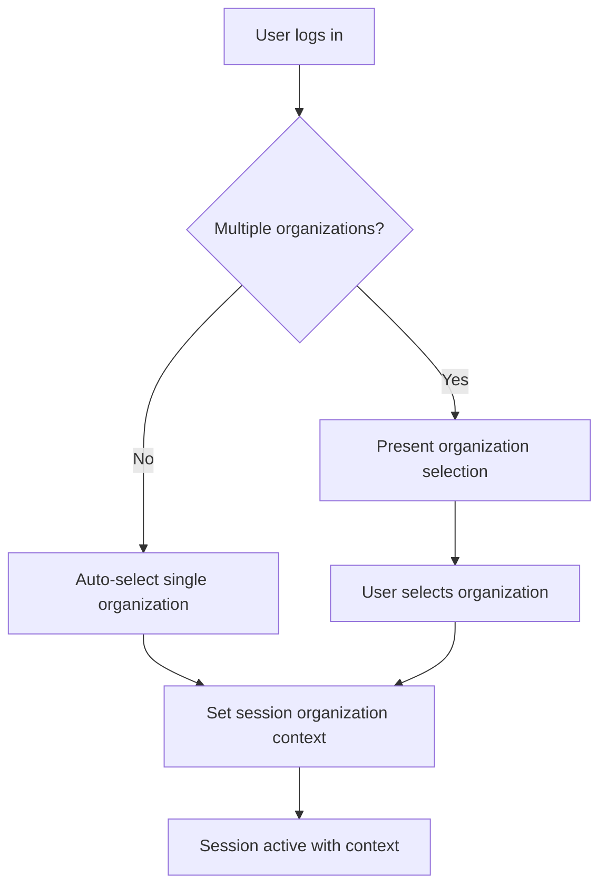
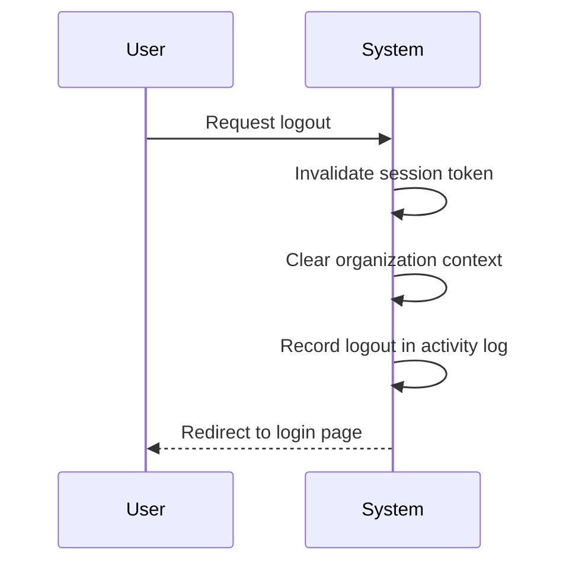

**erpTimeTrack — Actor definitions, permission matrix, authentication, session, account lifecycle**

Actor definitions, permission matrix, authentication, session, account lifecycle

# Actor Definitions

Define all user actor types with their identity, permissions, and access boundaries.

## guest Actor

Guest users are visitors who have not yet created an account or logged into the platform. They can view the public landing page and learn about the ERP platform's features. Guests can initiate the sign-up process to create a new organization or join an existing one. They can also access the login page to enter their credentials if they already have an account. Guests cannot access any organization-specific data or perform any business operations within the system. Their access is limited to account creation and authentication functions only. Once authenticated, guests transition to member actors within an organization context.

### Unauthenticated Visitor Status

Guest users are individuals who have not yet authenticated with the system. They exist in a pre-authentication state where they cannot access any organization-specific data or perform business operations. Guests can only view publicly available information about the platform and initiate the account creation or login processes.

### Public Platform Access

Guests can view the public landing page of the ERP platform. This landing page provides information about the platform's features, capabilities, and purpose. The landing page must clearly explain the platform's focus on human resource management and time tracking. Guests cannot navigate beyond this public information to access organization-specific content.

### Account Creation and Login Access

Guests can access the account creation (registration) page to initiate the sign-up process. They can also access the login page to enter their credentials if they already have an account. These authentication interfaces must be available without requiring any prior authentication.

The registration process entry point allows guests to begin creating a new organization or joining an existing one through email invitation. The organization sign-up flow begins when a guest initiates account creation by providing their email address and setting a password.

### Authentication Flow Entry Points

Guests can transition from unauthenticated to authenticated status through two primary flows:

1. **New Organization Creation**: A guest can create a new organization by providing:
   - Organization name
   - Organization description (optional)
   - Currency selection
   - Timezone selection
   - Fiscal start month
   - Their personal email and password

2. **Existing Organization Joining**: A guest can join an existing organization if they have received an email invitation from that organization's administrator.

Both flows require the guest to provide:
   - A valid email address
   - A secure password
   - Agreement to platform terms and conditions

Once authentication is complete, guests transition to member actors within the context of their selected organization.

## member Actor

Member actors are authenticated users who belong to one or more organizations. Their identity consists of a user account with email, display name, avatar, and phone number shared across all organizations. Members can select which organization to work in during login, and all their actions are scoped to that selected organization. They can switch between their organizations without logging out. Members have exactly one role within each organization they belong to, which determines their permissions. The system supports three built-in roles (Owner, Manager, Employee) plus custom roles created by organization owners. Member access is strictly limited to data within their currently selected organization, with no visibility into other organizations they may belong to. Their permissions define what they can see and do within that organizational context.

### Authenticated User Identity

Members are authenticated users who have completed the registration and login process.

- Members authenticate with their email and password.
- Members have a user account containing email, password, display name, avatar image, and phone number.
- The user account identity is shared across all organizations the member belongs to.
- Members can edit their display name, avatar, and phone number in their profile.
- Profile changes are reflected across all organizations the member belongs to.
- Members must authenticate before accessing any organization-specific features.
- Authentication establishes the member's identity for all subsequent actions.
- If authentication fails, the member cannot access any member-only features.
- Members can change their password at any time.
- Password changes apply to all organization accesses.

### Multi-Organization Membership

Members can belong to multiple organizations simultaneously.

- A member can be invited to join multiple organizations.
- Each organization membership is independent with its own role assignment.
- A member's permissions in each organization are determined by their role in that specific organization.
- Members can be active in multiple organizations at the same time.
- A member's employment status (active/deactivated) is specific to each organization.
- Members can be deactivated in one organization while remaining active in others.
- When a member is invited to an organization where they already have an account, they are added to that organization.
- When a member is invited to an organization where they don't have an account, a pending invitation is created.
- Pending invitations are automatically converted to organization membership when the member registers with the invited email.
- Members can see all organizations they belong to from their account dashboard.

### Role-Based Permissions System

Each organization implements a role-based permissions system that determines what members can see and do.

- Each organization has its own set of roles independent of other organizations.
- Each member has exactly one role within each organization they belong to.
- The role determines the member's permissions within that organization.
- Roles can be built-in (Owner, Manager, Employee) or custom.
- Custom roles are created by organization owners and have configurable permission sets.
- The system supports the following permission types:
  - Organization management (edit organization settings)
  - Employee management (add, edit, deactivate employees)
  - Employee viewing (view employee list and details)
  - Project management (create, edit, delete projects and tasks)
  - Project viewing (view projects and tasks)
  - Time management (edit or delete any employee's timelogs)
  - Time approval (approve or reject timesheets)
  - Time viewing all (view all employees' timelogs and timesheets)
  - Report viewing (view organization reports)
- Role assignment can be changed by members with employee management permission.
- A member's permissions are evaluated based on their current role in the currently selected organization.

### Organization Context Selection

Members must select an organization context before performing organization-specific actions.

- After login, members are presented with a list of organizations they belong to.
- Members must explicitly select which organization to work in.
- All subsequent actions are scoped to the selected organization context.
- The selected organization context determines which data the member can access.
- Members cannot perform actions across multiple organizations simultaneously.
- The system maintains the current organization context throughout the session.
- Members receive visual indication of their currently selected organization.
- If a member belongs to only one organization, that organization is automatically selected.
- Organization context selection is required before accessing any organization dashboard, projects, employees, or reports.

### Built-In Role Assignment

Each organization has three built-in roles that cannot be deleted.

- **Owner Role**:
  - Has full access to all features within the organization
  - Can manage organization settings including name, description, logo, currency, timezone, and fiscal start month
  - Can create, edit, and delete custom roles
  - Can assign roles to employees
  - Can delete the organization (subject to business rules)
  - Can view the full activity log
- **Manager Role**:
  - Can manage employees (add, edit, deactivate)
  - Can manage projects (create, edit, delete)
  - Can approve or reject timesheets
  - Can view all employees' timelogs and timesheets
  - Can view organization reports
  - Cannot edit organization settings
  - Cannot create or delete custom roles
- **Employee Role**:
  - Can track time and submit timesheets
  - Can view own data (timelogs, timesheets, contracts, tasks)
  - Cannot view other employees' data unless explicitly shared
  - Cannot approve timesheets
  - Cannot manage projects or employees
- Built-in roles are always available in every organization.
- Built-in roles cannot have their permission sets modified.
- Organization owners are automatically assigned the Owner role in their organization.

### Custom Role Eligibility and Assignment

Organization owners can create custom roles with specific permission combinations.

- Only members with the Owner role can create custom roles.
- Custom roles have a name and a set of selected permissions.
- Custom roles can combine any available permissions in any combination.
- Custom roles can be edited by organization owners.
- Custom roles can be deleted by organization owners only if no employees are assigned to them.
- When a custom role is deleted, employees assigned to it must be reassigned to another role first.
- Custom roles are specific to the organization where they are created.
- Custom roles from one organization are not visible in other organizations.
- Members can be assigned to custom roles instead of built-in roles.
- A member's permissions are determined by the exact permission set of their assigned role.
- Custom roles allow organizations to tailor access permissions to their specific workflow needs.

### Cross-Organizational Identity Management

Members maintain a single identity across all organizations they belong to.

- The member's email, display name, avatar, and phone number are shared across all organizations.
- Changes to profile information (display name, avatar, phone number) apply to all organizations.
- The member's password is shared across all organizations.
- Password changes affect access to all organizations.
- Account deletion removes the member from all organizations (subject to organization-specific rules).
- When a member is invited to a new organization, their existing profile information is used.
- Members cannot have different profile information in different organizations.
- The system treats each member as a single entity with multiple organization memberships.
- Activity logs record the member's actions across all organizations they interact with.
- Members can see which organizations they belong to from their account settings.

### Contextual Data Access and Isolation

Member access to data is strictly limited to their currently selected organization context.

- Members can only see data belonging to their currently selected organization.
- Data from other organizations the member belongs to is not visible.
- Employees, projects, tasks, timelogs, timesheets, and reports are isolated per organization.
- Members cannot access data from organizations they don't belong to.
- Members cannot transfer data between organizations.
- When switching organizations, the member's view immediately changes to show only data from the new organization.
- The system enforces organization context on all data access requests.
- Members with identical roles in different organizations have independent access to each organization's data.
- Data isolation prevents accidental or intentional cross-organization data exposure.
- Members receive clear visual cues indicating which organization's data they are viewing.

### Role-Based Access Boundaries

A member's access within an organization is precisely defined by their assigned role's permissions.

- Each permission in a role grants specific capabilities within the organization.
- Members with only view permissions cannot create, edit, or delete items.
- Members with management permissions can perform actions on items within their scope.
- Access boundaries are evaluated for each action the member attempts.
- If a member lacks the required permission for an action, the action is rejected.
- Access boundaries apply to:
  - Viewing employee lists and details
  - Managing employees (inviting, editing, deactivating)
  - Creating and managing projects and tasks
  - Viewing projects and tasks
  - Editing or deleting timelogs
  - Approving or rejecting timesheets
  - Viewing timelogs and timesheets
  - Viewing reports
  - Viewing activity logs
- Members cannot exceed the boundaries defined by their role's permissions.
- The system prevents members from accessing features or data their role doesn't permit.
- Access boundaries are consistently enforced across all interfaces and APIs.

### Organization Switching Capability

Members can switch between organizations without logging out.

- Members can change their current organization context at any time.
- Organization switching does not require re-authentication.
- When switching organizations, the member's session remains active.
- The system immediately applies the new organization context to all subsequent actions.
- Members see a different set of data and features after switching organizations.
- The member's role and permissions may differ between organizations.
- Organization switching is available from a dedicated organization selector in the user interface.
- Members can switch to any organization they belong to.
- If a member is deactivated in an organization, they cannot switch to that organization.
- Organization switching preserves unsaved work in the previous organization context.
- Members receive confirmation when successfully switching organizations.
- The system records organization switches in the activity log for audit purposes.

## admin Actor

Admin actors are organization owners with the highest level of authority within their organization. They have the built-in Owner role which grants full access to all features and data within their organization. Admins can manage the organization's settings including name, description, logo, currency, timezone, and fiscal start month. They have authority to create custom roles with specific permission combinations and assign those roles to employees. Admins can delete their organization under specific conditions related to pending timesheets and active contracts. They can also manage organization membership by inviting new employees and deactivating existing ones. Admin actors have visibility into the full activity log of organizational actions. Their access boundaries are strictly limited to their own organization, with no cross-organizational administrative privileges.

### Organization Ownership and Creation

### Organization Ownership and Creation

Organization owners are users who create a new organization during the initial sign-up process. The creator automatically becomes the organization's owner with the built-in Owner role.

**Business Requirements:**
- When a user creates an organization, they become the organization's sole owner
- Organization ownership grants the highest level of administrative authority within that organization
- An organization can have multiple owners if ownership is transferred (though transfer is not defined in requirements)
- Owners cannot be removed from their organization while they remain the sole owner
- Owners can belong to multiple organizations but each organization context is separate

### Full System Access and Owner Role Privileges

### Full System Access and Owner Role Privileges

Organization owners have full system access through the built-in Owner role, which cannot be deleted. This role provides unrestricted access to all features and data within their organization.

**Business Requirements:**
- The Owner role grants access to all permissions within the organization:
  - All organization management permissions (`org:manage`)
  - All employee management permissions (`employee:manage`, `employee:view`)
  - All project management permissions (`project:manage`, `project:view`)
  - All time tracking permissions (`time:manage`, `time:approve`, `time:view_all`)
  - All reporting permissions (`report:view`)
- Owners can perform any action available in the system within their organization
- Owners cannot access data from other organizations, even if they belong to multiple organizations
- The Owner role cannot be modified or have its permissions reduced

### Organization Settings Management Rights

### Organization Settings Management Rights

Organization owners can edit all organization settings. These settings define the organization's identity and operational parameters.

**Business Requirements:**
- Owners can modify the organization's name and description
- Owners can upload or change the organization's logo image
- Owners can set the organization's base currency (e.g., USD, EUR, KRW)
- Owners can configure the organization's timezone for all date/time calculations
- Owners can specify the fiscal start month for reporting and financial periods
- All setting changes apply immediately and affect the entire organization
- Only owners (or users with `org:manage` permission via custom roles) can modify organization settings

### Role and Permission Administration

### Role and Permission Administration

Organization owners can create, edit, and delete custom roles to define granular permissions for organization members.

**Business Requirements:**
- Owners can create custom roles with specific names and permission combinations
- Available permissions for custom roles include (defined in permissions matrix):
  - Organization management (`org:manage`)
  - Employee management (`employee:manage`, `employee:view`)
  - Project management (`project:manage`, `project:view`)
  - Time tracking (`time:manage`, `time:approve`, `time:view_all`)
  - Reporting (`report:view`)
- Owners can edit existing custom roles to change their name or permission set
- Owners can delete custom roles only if no employees are currently assigned to them
- Built-in roles (Owner, Manager, Employee) cannot be deleted or modified
- Owners can assign any role (including custom roles) to any employee in the organization

### Employee and Membership Management Authority

### Employee and Membership Management Authority

Organization owners have complete authority over employee management and organization membership.

**Business Requirements:**
- Owners can invite new employees to the organization by email
- If the invited email already has a user account, the user is added to the organization
- If the invited email has no account, a pending invitation is created
- Owners can edit employee records including department, position/title, and employment type
- Owners can deactivate employees, which prevents them from logging time or submitting timesheets
- Owners can reactivate previously deactivated employees
- Owners can view the complete employee list with filtering and search capabilities
- Owners can assign and change roles for any employee in the organization
- Owners can create and edit employee contracts, with new contracts automatically ending previous active contracts

### Organization Deletion Eligibility and Process

### Organization Deletion Eligibility and Process

Organization owners can delete their organization under specific conditions that protect data integrity.

**Business Requirements:**
- Owners can delete their organization only if:
  - All pending timesheets are resolved (either approved or rejected)
  - There are no active employee contracts in the organization
- When an organization is deleted:
  - All organization data is permanently deleted including employees, projects, tasks, timelogs, and timesheets
  - The owner's user account remains active but is no longer associated with any organization
  - If the owner belongs to other organizations, those associations remain intact
- Organization deletion is irreversible and cannot be undone
- If the owner is the sole owner, they cannot delete their user account without first transferring ownership or deleting the organization

### Activity Log and Administrative Oversight

### Activity Log and Administrative Oversight

Organization owners have complete visibility into all organizational activities through the activity log.

**Business Requirements:**
- Owners can view the full activity log for their organization
- The activity log includes all significant actions performed within the organization
- Logged actions include (defined in activity log requirements):
  - Employee invitations, deactivations, and reactivations
  - Contract creation and modifications
  - Project creation, archiving, completion, and deletion
  - Task status changes
  - Timesheet submissions, approvals, and rejections
  - Role assignments and changes
- Owners can filter the activity log by action type, user who performed the action, and date range
- The activity log is paginated for performance
- Only owners (or users with `org:manage` permission) can access the full activity log

# Authentication Flows

Registration, login, logout, and session management from a user perspective.

## Registration and Login

Define user registration and login flows including validation and error handling.

### User Registration

### User Registration

Users can create an account by providing an email address and password. The email address must be unique across all users in the platform.

During registration, users must create their first organization. The organization requires:
- A name for the organization (required)
- An optional description
- An optional logo image
- A currency (such as USD, EUR, or KRW) that will be used for financial reporting
- A timezone for the organization's operations
- A fiscal start month for financial year calculations

After providing organization details, the user's account is created and they are automatically assigned as the Owner of that organization.

If the provided email address already has pending invitations to join other organizations, those invitations are automatically applied upon successful registration.

Registration is complete when both the user account and initial organization are successfully created. The user is then logged in and placed in the context of their newly created organization.

### User Login

### User Login

Registered users can log into the platform using their email address and password.

When authentication succeeds, the system presents the user with a list of organizations they belong to. The user must select which organization context to work in for this session.

All subsequent actions in that session are scoped to the selected organization. Users cannot perform actions across multiple organizations simultaneously.

If the user only belongs to one organization, they are automatically placed in that organization's context without needing to select.

If authentication fails due to incorrect email or password, the system does not indicate which credential was incorrect for security reasons. The user must try again with valid credentials.

Users who have forgotten their password must use the password reset mechanism (defined in account management).

### Authentication and Organization Context

### Authentication and Organization Context

The system supports users belonging to multiple organizations. Each login session is tied to a specific organization context.

Users can switch between organizations without logging out. When switching:
- The current session's organization context changes
- All data views, permissions, and operations immediately reflect the new organization
- No data from the previous organization is visible in the new context

Session authentication maintains the user's identity while enforcing strict data isolation between organizations.

If a user attempts to access a resource in an organization they don't belong to, the request is rejected even if they are authenticated for a different organization.

Each organization maintains its own independent set of roles and permissions. A user's role in one organization does not affect their role in another organization.

The system ensures that all API requests include the organization context, and validates that the authenticated user has access to that specific organization before processing any request.

## Session and Logout

Define session behavior and logout from a user perspective.

### Organization Context Sessions

Each authenticated user session operates within a specific organization context. When a user logs in, they must select which organization to work in from the organizations they belong to. All subsequent actions in that session are scoped to the selected organization until the user switches contexts or logs out.

Users can belong to multiple organizations, and each session maintains the current organization context. Session data includes:
- The authenticated user identity
- The currently selected organization
- The user's role within that organization
- Session creation timestamp and last activity timestamp

### Session Switching Between Organizations

Authenticated users can switch between their organizations without logging out. When switching organizations:
- The current session remains authenticated
- The organization context changes to the newly selected organization
- The user's role and permissions update to reflect their role in the new organization
- Any unsaved data in the previous organization context is not automatically preserved

Users can only switch to organizations they belong to. Users who belong to a single organization cannot switch organization contexts.

The system tracks organization switches in the activity log with entries indicating:
- The user who switched organizations
- The previous organization
- The new organization
- The timestamp of the switch

### Session Timeout and Inactivity

User sessions expire after a period of inactivity to maintain account security. When a session times out due to inactivity:
- The user is automatically logged out
- Any unsaved work is lost
- The user must authenticate again to continue

Active timers continue running even if the user's session times out. When the user logs back in, they will see their timer still running if it was active before the session timeout.

Session timeout is based on the last user interaction with the system, not on the organization context or specific features being used.

### Logout Functionality

Users can manually log out at any time. Logging out:
- Terminates the current session
- Clears the organization context
- Invalidates the authentication token
- Redirects the user to the login page

If a user has an active timer running when they log out:
- The timer continues running
- The user can see the timer status when they log back in
- The timer is not automatically stopped by logout

Logout is available from all authenticated areas of the application. Users cannot be forced to stay logged in against their will.

### Concurrent Session Management

Users can have multiple active sessions across different devices or browsers. Each session operates independently with its own organization context. Concurrent session management includes:
- Users can be logged in on multiple devices simultaneously
- Each device maintains its own organization context
- Changes made in one session (like organization switching) do not affect other active sessions
- Active timers are specific to the device/session where they were started

When a user changes their password:
- All existing sessions (except the current one) are invalidated
- Users must log in again with the new password on other devices
- Active timers on invalidated sessions continue running until manually stopped

Users can view and manage their active sessions from their account settings to manually terminate specific sessions if needed for security purposes.

### Session Security and Account Protection

Sessions incorporate security measures to protect user accounts:
- Session tokens are unique and cryptographically secure
- Sessions cannot be transferred between users
- Session hijacking attempts trigger automatic logout and account lockout if suspicious patterns are detected

When a user deletes their account:
- All active sessions for that user are immediately terminated
- Any organization contexts are cleared
- Active timers continue running but cannot be accessed after account deletion

If a user is removed from an organization while their session is active:
- The session continues but with limited functionality
- The user can no longer access organization-specific features
- The user can switch to another organization they belong to or log out
- If removed from all organizations, the user is effectively logged out and must create or join a new organization

Session security events (multiple failed login attempts, suspicious activity) are logged in the activity log for review by organization owners with appropriate permissions.

# Account Lifecycle

Account creation, deletion, and password management.

## Account Management

Define how users create accounts, delete accounts, and change passwords.

### Account Creation

Users can create an account by providing an email address and a password.

- The email address must be unique across the entire platform; if a user attempts to register with an email that already has an account, the request is rejected.
- The password must meet minimum security requirements (the specific requirements are not defined by the user; assume a reasonable policy).
- Upon successful registration, a user account is created with a global profile that includes a display name, avatar image, and phone number (all optional at creation).
- The user is not automatically added to any organization; organization membership occurs through separate invitation or organization creation.
- Account creation does not require email verification (the user did not specify this requirement).
- The system does not send a welcome email or confirmation email (the user did not mention this).

**Permissions**:
- Guests (unauthenticated users) can initiate account creation.
- No special permissions are required to create an account.

**Error Conditions**:
- If the email is already registered, the request is rejected.
- If the email format is invalid, the request is rejected.
- If the password does not meet security requirements, the request is rejected.

**Business Rules**:
- A user can have only one account per email address.
- The account is persistent until explicitly deleted by the user.
- The account can be used to join multiple organizations over time.

### Account Deletion

Users can delete their own account, subject to specific business constraints.

- A user can delete their account only if they are not the sole owner of any organization. If they are the sole owner, they must first transfer ownership to another user or delete the organization.
- When a user deletes their account, their global profile (display name, avatar, phone number) is permanently deleted.
- The user's employee records in organizations they belong to are marked as "deactivated" (the employee status becomes deactivated) but not deleted; historical data (timelogs, timesheets) is preserved.
- The user's associations with organizations are removed; they no longer appear as members of those organizations.
- If the user had pending organization invitations (invited but not yet accepted), those invitations are revoked.
- The user's activity log entries remain (as they are part of the organization's audit trail) but are anonymized (the user reference is removed).

**Permissions**:
- Only the user themselves can delete their own account; no other user can delete another user's account.
- Organization owners cannot delete another user's account.

**Error Conditions**:
- If the user is the sole owner of an organization, the deletion request is rejected.
- If the user is not authenticated, the request is rejected.

**Business Rules**:
- Account deletion is irreversible; once deleted, the account cannot be recovered.
- Deactivated employee records remain in the organization's data for historical reporting.
- The user's email becomes available for new account registration after deletion.

### Password Change

Users can change their password at any time while authenticated.

- The user must provide their current password and the new password.
- The new password must meet the same security requirements as during account creation.
- The new password cannot be the same as the current password.
- Upon successful password change, the user's session remains active (they are not logged out).
- The system does not enforce periodic password changes (the user did not specify this).
- The system does not send a password change confirmation email (the user did not mention this).

**Permissions**:
- Only the authenticated user can change their own password.
- Organization owners cannot change another user's password.
- Managers cannot change another user's password.

**Error Conditions**:
- If the current password is incorrect, the request is rejected.
- If the new password does not meet security requirements, the request is rejected.
- If the new password is the same as the current password, the request is rejected.
- If the user is not authenticated, the request is rejected.

**Business Rules**:
- Password changes do not affect existing sessions; the user continues to be logged in.
- There is no limit on how often a user can change their password.
- The system does not keep a history of previous passwords to prevent reuse (the user did not specify this requirement).

**Security Notes**:
- The system stores passwords securely (using hashing) as implied by the requirement for password-based authentication.
- The user did not specify additional security measures like two-factor authentication, password expiration, or account lockout after failed attempts; therefore, these are not required.