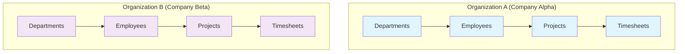
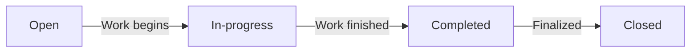
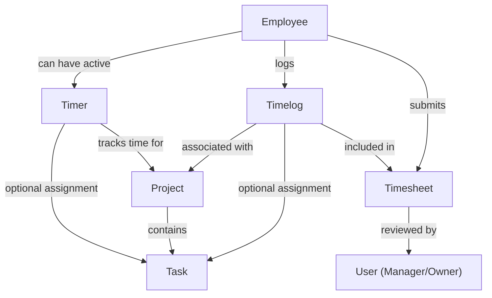
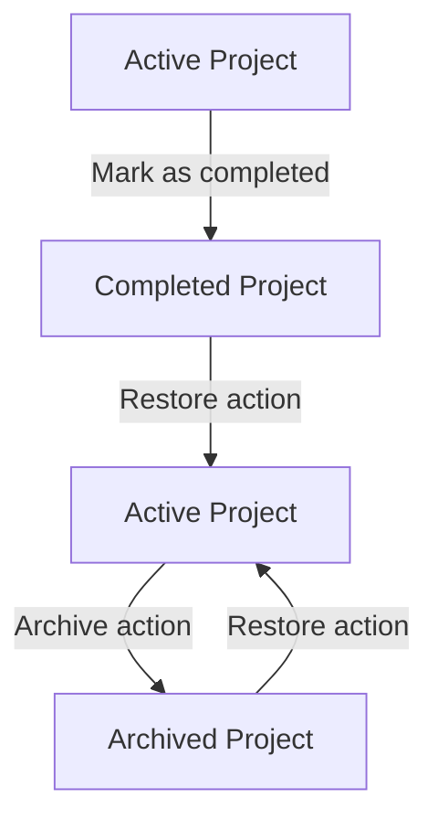
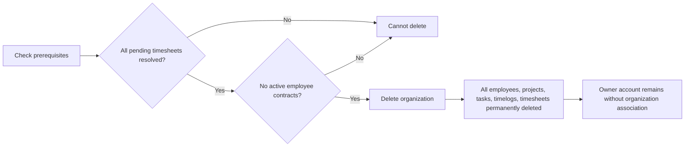
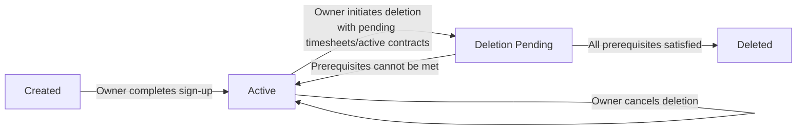
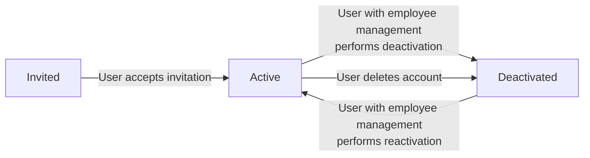
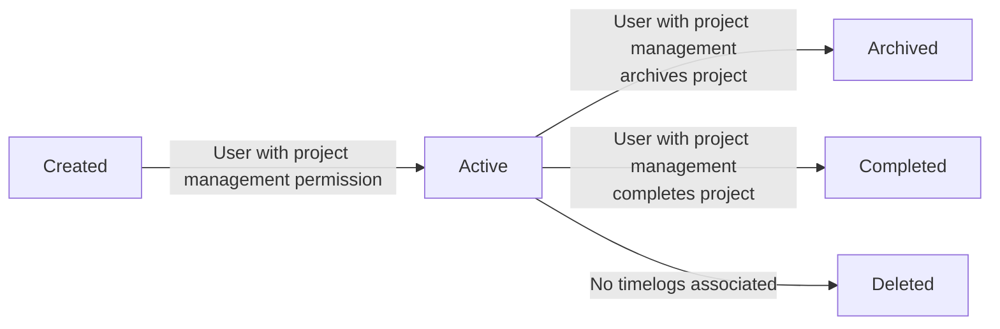
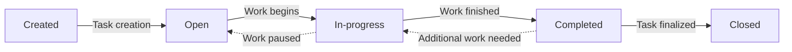
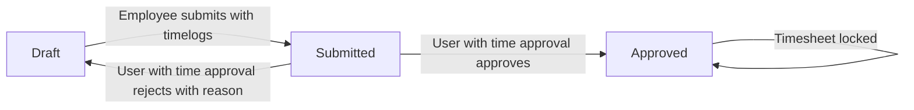

**erpTimeTrack — Business concepts, relationships, and states from user perspective**

Business concepts, relationships, and states from user perspective

# Domain Concepts

Describe what each concept means in the business domain and its key attributes.

## User Concept

A User is an individual who can access the platform using their unique email and password. Each user maintains a single global profile containing their personal display name, avatar image, and phone number that is visible across all organizations they join. Users have the ability to create new organizations and can belong to multiple organizations simultaneously. When they log in, they select which organization context to operate within, which scopes their view and actions to that specific organization's data. A user can delete their own account, but if they are the sole owner of an organization, they must either transfer ownership or delete that organization first. The user concept is fundamental for authentication and serves as the base identity that can be associated with multiple employee records in different organizations.

### Individual Platform Access

A user represents an individual human being who can access the ERP platform using their unique credentials. Each user is a distinct identity within the system, capable of performing actions based on their roles and permissions across different organizations they belong to. The user concept is foundational for all platform access and authentication processes.

### Email and Password Credentials

Every user is identified by a unique email address that serves as their primary login identifier. Combined with a password, these credentials authenticate the user's identity and grant access to the platform. This combination ensures that only authorized individuals can access the system and the organizations they are associated with.

### Global Personal Profile

Each user maintains a single global profile that contains their personal information, which includes:
- Display name (how the user is identified to others)
- Avatar image (profile picture for visual identification)
- Phone number (contact information)

The profile is managed by the user and represents their personal identity across the entire platform.

### Cross-Organization Profile Visibility

A user's profile information is shared and visible across all organizations to which the user belongs. When a user accesses different organizations, their display name, avatar, and phone number remain consistent. This ensures that other members of any organization can recognize the user by their consistent identity, regardless of which organization context is currently active.

### Multiple Organization Membership

A user can be a member of multiple independent organizations simultaneously. This capability allows individuals to participate in different work environments without needing separate accounts. The user's membership in each organization is represented by an employee record that links the user to that specific organization and defines their role and permissions within it.

### Login Context Selection

When a user logs into the platform, they must select which organization to work in from the organizations they belong to. This selection establishes the organizational context for the session, scoping all subsequent views, data access, and actions to the selected organization. Users can switch between different organization contexts during a session without needing to log out and log back in.

### Account Deletion with Ownership Constraints

Users can request deletion of their account. However, deletion is constrained by organizational ownership responsibilities:
- If the user is the sole owner of an organization, they must either transfer ownership to another user or delete the organization entirely before their account can be deleted
- When an account is deleted, any employee records associated with that user in other organizations are marked as "deactivated" rather than removed
- The user's profile and authentication credentials are permanently removed from the system

### Authentication Identity Base

The user serves as the fundamental authentication identity for the entire platform. All access control, permission enforcement, and data isolation mechanisms reference the user as the authenticated principal. The user concept enables:
- Secure login and session management
- Association with multiple employee records across organizations
- Cross-organization identity consistency
- Audit trail attribution for actions performed within any organization

## Organization Concept

An Organization represents a distinct tenant within the multi-tenant platform, operating completely independently with its own employees, projects, and data. Each organization is created by a user during initial sign-up and contains basic settings including its name, description, logo image, currency, timezone, and fiscal start month. Organizations function as isolated containers where all business activities—time tracking, project management, and employee records—are scoped. The organization has an owner who holds full administrative control and can delete the organization under specific conditions: all pending timesheets must be resolved and no active employee contracts can exist. When an organization is deleted, all its associated data is permanently removed, but the owner's user account remains. The organization concept enables the multi-tenancy model where different companies can use the same platform without data leakage.

### Organization as a Multi-Tenant Entity

An organization is an independent multi-tenant entity representing a distinct company, team, or client using the platform. Each organization operates in complete isolation from other organizations, forming an independent business environment where all activities—employee management, project work, and time tracking—are self-contained. The platform supports multiple organizations simultaneously, with strict data separation ensuring that no organization can access or view another organization's data.

Every organization is created by a user during initial sign-up and functions as the primary scope boundary for business operations. The organization concept enables different companies to use the same platform while maintaining complete privacy and operational independence.

### Isolated Data Container

Each organization functions as an isolated data container that holds all business information specific to that tenant. All organizational data—including employees, projects, tasks, time entries, timesheets, contracts, departments, roles, and activity records—exists exclusively within the organization container and cannot be accessed by users from other organizations.

When a user belongs to multiple organizations, they must select which organization to work in, and all subsequent actions and data views are strictly scoped to that selected organization. The data isolation ensures that even users with access to multiple organizations cannot mix or view data across organizational boundaries without explicitly switching organizational context.

### Organization Settings Configuration

Each organization has configurable settings that define its operational characteristics. These settings are established during organization creation and can be modified by the organization owner. The settings include:

- **Organization Name**: The organization's display name, visible to all members within the organization
- **Organization Description**: Optional text describing the organization's purpose or business focus
- **Organization Logo**: An optional image representing the organization, displayed in the user interface
- **Preferred Currency**: The currency used throughout the organization for financial reporting purposes
- **Primary Timezone**: The organization's main timezone for scheduling and time-related calculations
- **Fiscal Year Start**: The month that marks the beginning of the organization's fiscal year for reporting

These settings apply globally to all operations within the organization and cannot vary by user or department. When organization settings are changed, the changes affect all future calculations and displays but do not retroactively modify historical data.

### Organization Owner with Administrative Control

Each organization has one or more owners who possess full administrative control over the organization. The owner is typically the user who created the organization during initial sign-up, though ownership can be transferred to other users.

**Owner capabilities include:**
- Editing all organization settings
- Managing organization members and their roles
- Creating, editing, and deleting custom roles
- Viewing the complete activity log of organization actions
- Deleting the organization when specific conditions are met
- Managing departments and organizational structure

Owners have unrestricted access to all features and data within their organization. Unlike managers or employees, owners can perform any action without permission restrictions, making them the ultimate administrative authority within the organization boundary.

**Ownership transfer:** If an organization has multiple owners, any owner can transfer ownership to another user. If an organization has only one owner, that owner must transfer ownership to another user before they can delete their user account.

### Organization Deletion Prerequisites

An organization owner can delete their organization only when specific business conditions are met. These prerequisites ensure that important business processes are properly concluded before organizational data is permanently removed.

**Deletion prerequisites:**
1. **All pending timesheet approvals must be resolved** — No timesheets can remain in a state awaiting approval. All pending timesheets must either be approved or rejected.
2. **All employee contracts must be properly concluded** — All employee contracts must be ended before organization deletion.

**Organization deletion consequences:**
- All organizational data is permanently deleted, including:
  - All employee records and associations
  - All projects, tasks, and project assignments
  - All time entries and timesheets
  - All contracts and department structures
  - All roles and activity records
- The owner's user account remains active but is no longer associated with any organization
- Users who were members of the deleted organization lose access to that organization's data but retain their user accounts

**Deletion is irreversible** — Once deleted, organization data cannot be recovered.

### Complete Data Isolation per Tenant

The platform enforces complete data isolation between organizations, ensuring that each tenant's data remains private and inaccessible to users from other organizations. This isolation applies at all levels of the system and is a fundamental aspect of the multi-tenancy model.

**Isolation mechanisms:**
1. **Access control**: All data access operations automatically filter by organizational context, preventing cross-organization data retrieval.
2. **User context**: Users must explicitly select which organization to work in, and all operations are scoped to that context.
3. **Data separation**: No data references or relationships exist across organizational boundaries.
4. **System enforcement**: All system operations validate the organization context and reject requests attempting to access data outside the user's current organization.

**Isolation scope includes:**
- **Employee data**: Employees from one organization cannot see or interact with employees from another organization.
- **Project data**: Projects, tasks, and project assignments are organization-specific.
- **Time tracking**: Time entries and timesheets are only visible within their originating organization.
- **Financial data**: Contracts, pay rates, and budget information are organization-private.
- **Organizational structure**: Departments and role definitions are organization-specific.

This complete isolation ensures that even users belonging to multiple organizations cannot inadvertently access data across organizational boundaries.

### Business Activity Scope Boundary

The organization defines the scope boundary for all business activities within the platform. All operations, data creation, and business processes are contained within and governed by the organization context.

**Scope boundaries include:**
- **Employee management**: Employees can only be managed within their organization. Employee records cannot span multiple organizations.
- **Project work**: All projects, tasks, and project assignments exist exclusively within a single organization.
- **Time tracking**: Time entries and timesheets are recorded and managed within the organization where the work was performed.
- **Financial administration**: Contracts, pay rates, and budget tracking are organization-specific.
- **Reporting and analytics**: All reports analyze data only from within the organization boundary.
- **Permission management**: Role definitions and permission assignments apply only within their organization.

**Scope implications:**
1. **No cross-organization operations**: Business processes cannot involve resources from multiple organizations.
2. **Independent workflows**: Each organization establishes its own approval workflows, reporting cycles, and business rules.
3. **Separate configuration**: Organization settings, currency preferences, and timezone settings apply only within the organization.
4. **Isolated lifecycle**: Organization creation, operation, and deletion are independent processes that do not affect other organizations.

The organization boundary ensures that each tenant operates as a complete, self-contained business unit with full control over its operations and data.

## Employee Concept

An Employee is the association between a user and an organization, representing that user's role and status within that specific company. Each employee record connects a user account to an organization and defines their function through attributes like assigned role, optional department and position, employment type, and status. The employment type categorizes the work arrangement as full-time, part-time, contractor, or intern, while the status indicates whether the employee is currently active or deactivated. Deactivated employees cannot perform actions like logging time or submitting timesheets but their historical data remains preserved. Employees can view their own information and, depending on permissions, may see other employees' details. This concept separates organizational membership from the global user identity, allowing the same person to have different roles in different organizations.

### Employee as User-Organization Association

An employee is a **user-organization association** that represents a person's membership and role within a specific company. This concept separates the global user identity (who can belong to multiple organizations) from their organizational-specific context. Each employee record connects a single user account to a single organization, creating a bridge that defines how that person interacts with that organization's data and features.

**Key Characteristics:**
- One user account can be associated with multiple organizations through separate employee records
- Each employee record exists within exactly one organization's data isolation boundary
- The employee concept enables the same person to have different roles, departments, and employment types in different organizations
- Employee records persist even if the user account remains active across multiple organizations

### Role Assignment within Organization

Each employee is assigned **exactly one role** that defines their permissions and capabilities within that specific organization. The role assignment determines what actions the employee can perform and what data they can access.

**Role Assignment Rules:**
- Role assignment is organization-specific—the same user may have different roles in different organizations
- An employee's role can be changed by users with appropriate permissions within the organization
- The assigned role must be either a built-in role or a custom role defined within that organization
- Role changes are recorded in the activity log
- An employee's permissions are derived solely from their assigned role, not from any global user attributes

### Employment Type Classification

Employees are classified by **employment type**, which categorizes their work arrangement within the organization. This classification affects reporting, payroll considerations, and potentially business rules around working hours and benefits.

**Employment Types:**
- **Full-time**: Standard employment with regular working hours
- **Part-time**: Reduced working hours compared to full-time
- **Contractor**: External service provider not on payroll
- **Intern**: Temporary position for training or educational purposes

**Business Significance:**
- Employment type may influence default working hours expectations
- Contractor status may affect billable vs. non-billable time classification rules
- Different employment types may appear in separate reports or analytics
- The classification provides context for understanding the nature of the working relationship

### Active versus Deactivated Status

Employee records have a **status** that indicates whether they are currently participating in organizational activities. This status controls whether the employee can perform actions within the system.

**Active Status:**
- Employee can log time, submit timesheets, and perform other work-related actions
- Appears in active employee lists and is included in reporting
- Can be assigned to projects and tasks

**Deactivated Status:**
- Employee cannot log time or submit timesheets
- Historical data remains preserved and accessible
- Does not appear in active employee lists for operational purposes
- Can be reactivated at any time, restoring their ability to perform actions

**Deactivation Triggers:**
- Employee leaves the organization
- Employee takes extended leave
- Administrative action by users with appropriate permissions
- Automatic deactivation when user deletes their account (if not sole organization owner)

### Department and Position Assignment

Employees can be optionally assigned to a **department** and given a **position/title** within the organization. These assignments provide organizational structure and reporting hierarchy.

**Department Assignment:**
- Department represents a functional group within the organization (e.g., Engineering, Marketing, Sales)
- Departments support one level of nesting (parent-child relationships)
- Employees can belong to only one department at a time
- Department assignment is optional—employees can exist without department assignment
- Changing or removing department assignment does not affect the employee's historical data

**Position/Title Assignment:**
- Position describes the employee's job role (e.g., Senior Developer, Project Manager, Marketing Specialist)
- Provides additional context for organizational structure and reporting
- Position is a free-text field without predefined values
- Position assignment is optional

### Historical Data Preservation

When an employee is deactivated, their **historical data is preserved** to maintain organizational records and compliance. This ensures continuity of business records even when employment relationships change.

**Preserved Data Types:**
- All timelogs created by the employee during their active period
- All timesheets submitted and approved for the employee
- All contracts associated with the employee's employment history
- Project assignments and task completions
- Role assignment history
- Department and position history

**Business Purpose:**
- Maintains accurate historical reporting for compliance and audit purposes
- Preserves project history and contributions even after employee departure
- Supports analysis of organizational capacity and resource utilization over time
- Ensures continuity of business records for legal and financial requirements

### Multi-Organization Role Differentiation

A single user can have **different roles and attributes** across multiple organizations. This differentiation allows the same person to function in distinct capacities in different organizational contexts.

**Differentiated Attributes:**
- **Role**: Can be Owner in one organization, Employee in another
- **Department**: May belong to Engineering in one company, Marketing in another
- **Position**: Could be Manager in one organization, Specialist in another
- **Employment Type**: Might be full-time in one company, contractor in another
- **Status**: Could be active in one organization, deactivated in another

**Context Switching:**
- Users select which organization to work in when logging in
- All actions and views are scoped to the selected organization's context
- Permissions and data visibility change based on the selected organization
- The user's role, department, and position may differ between selected organizations

**Business Value:**
- Supports consultants and contractors who work with multiple clients
- Enables corporate employees who participate in multiple subsidiaries
- Allows for different levels of access and responsibility across different organizations
- Maintains clear separation of duties and information between organizational contexts

## Role Concept

A Role defines a set of permissions that determine what actions an employee can perform within an organization. Each organization maintains its own set of roles, including three immutable built-in roles: Owner with full access, Manager with oversight capabilities, and Employee with basic time tracking rights. Organizations can create custom roles by assigning specific combinations of granular permissions like managing employees, projects, time, or viewing reports. Each role has a name and exactly one employee is assigned to each role at a time. Custom roles can be edited or deleted only if no employees are currently using them. The role concept provides flexible access control by grouping permissions into reusable sets that align with organizational job functions and responsibilities.

### Permission Set Definition

A permission set is a collection of specific action rights that determine what operations an employee can perform within the organization. Each permission grants the ability to perform a particular type of business activity, such as managing employees, viewing projects, or approving timesheets. Permissions are grouped together into roles to provide reusable access control configurations. The system defines a fixed list of available permissions that can be combined in various ways to create custom access levels. A permission set represents the complete scope of actions allowed for a given role, enabling fine-grained control over employee capabilities without granting blanket administrative access.

### Built-in Immutable Roles

The system includes three permanent built-in roles that cannot be deleted or renamed. These roles provide standard access patterns for common organizational positions:

- **Owner**: Has complete administrative control over all aspects of the organization. Owners can manage organization settings, all employees, all projects, all time tracking data, and all reports. Owners also have the exclusive ability to manage roles and permissions.

- **Manager**: Has oversight capabilities including managing employees, viewing all projects, approving timesheets, and accessing organizational reports. Managers can oversee employee work but cannot modify organization settings or role configurations.

- **Employee**: Has basic rights for time tracking and viewing personal data. Employees can track time, submit timesheets, view their own timelogs and contracts, and see tasks assigned to them. They cannot access other employees' data or organizational management functions.

These built-in roles serve as foundation templates that organizations can supplement with custom roles as needed.

### Custom Role Creation

Organizations can create custom roles to define access patterns that match their specific operational needs. Custom role creation is limited to users with organization management permission (typically owners).

Each custom role requires:
- A unique name within the organization
- A selection of permissions from the available permission set

When creating a custom role, the creator selects which permissions to include from the granular permission list. Custom roles can be designed to match specific job functions, such as "Project Coordinator" (with project management permissions) or "Time Approver" (with time approval and view permissions).

Custom roles exist alongside the built-in roles and provide flexibility to model complex organizational structures beyond the basic Owner-Manager-Employee hierarchy.

### Granular Permission Assignment

The system provides specific, individual permissions that can be assigned to roles. These granular permissions represent distinct business capabilities:

| Permission | Description |
|------------|-------------|
| Organization Management | Edit organization settings including name, description, currency, timezone, and fiscal settings |
| Employee Management | Add, edit, deactivate, and reactivate employees; manage employee contracts |
| Employee Viewing | View employee lists and individual employee details |
| Project Management | Create, edit, archive, complete, and delete projects and tasks |
| Project Viewing | View all projects and tasks within the organization |
| Time Management | Edit or delete any employee's timelogs regardless of ownership |
| Time Approval | Approve or reject submitted timesheets |
| Time Viewing All | View all employees' timelogs and timesheets |
| Report Viewing | Access organizational reports and dashboards |

These granular permissions allow precise control over employee capabilities without granting unnecessary access. Each permission can be independently included or excluded when defining custom roles.

### Single Employee Role Assignment

Each employee within an organization is assigned exactly one role at any given time. This role determines the complete set of permissions available to that employee for all operations within that organization.

Role assignment follows these principles:
- An employee cannot have multiple roles simultaneously
- Role assignment can be changed at any time by users with employee management permission
- When an employee's role changes, their permissions immediately update to match the new role
- An employee's historical actions are preserved regardless of role changes

The single role assignment model simplifies permission management by ensuring clear, unambiguous access rights for each employee. This approach prevents permission conflicts and makes it easy to understand what any employee can do based on their current role.

### Role Editing and Deletion Constraints

Role modifications are subject to specific constraints to maintain system integrity:

**Editing Constraints:**
- Built-in roles (Owner, Manager, Employee) cannot be edited—their names and permission sets are fixed
- Custom roles can be edited by organization owners
- When editing a custom role, the owner can modify both the role name and its permission set
- Permission changes to a custom role immediately affect all employees assigned to that role

**Deletion Constraints:**
- Built-in roles cannot be deleted under any circumstances
- Custom roles can only be deleted if no employees are currently assigned to them
- If employees are assigned to a custom role, the role must first be reassigned to a different role before deletion
- Role deletion removes the role definition permanently but does not affect historical activity logs

These constraints prevent situations where employees would be left without valid permissions or where essential system roles would be inadvertently removed.

### Organizational Access Control Grouping

Roles serve as the primary mechanism for grouping permissions into logical sets that align with organizational structure and job functions. This grouping approach provides several business benefits:

**Standardization**: Roles allow organizations to define consistent permission sets for similar positions across the organization.

**Simplified Management**: Instead of managing permissions for each employee individually, administrators manage roles and assign employees to appropriate roles.

**Flexibility**: Organizations can create custom roles that match their specific operational needs, such as department-specific roles or temporary project roles.

**Auditability**: Since each employee has exactly one role, it's easy to audit who has what permissions by examining role assignments.

**Scalability**: As organizations grow, they can create additional custom roles to handle new job functions without modifying existing roles.

Roles provide a business-aligned abstraction layer between individual permissions and employee assignments, making access control manageable and meaningful within the organizational context.

## Department Concept

A Department represents an organizational unit within a company used for grouping employees and structuring the workforce. Each department has a name, optional description, and can optionally have a parent department to support one level of nesting hierarchy. Departments provide a way to categorize employees beyond their roles, enabling filtering and reporting based on organizational structure. When a department is deleted, any employees assigned to it have their department reference set to null rather than being deleted themselves. Employees can view the list of departments to understand the organizational layout. The department concept supports basic organizational hierarchy while maintaining data integrity through careful handling of deletions.

### Department as Organizational Unit

A **Department** is a business unit within an organization that groups employees for organizational management purposes. It represents a functional division or team within the company structure.

Departments have the following essential characteristics:
- **Name**: An identifier that describes the department's function or purpose
- **Description**: Additional information about the department's responsibilities and scope
- **Parent Department**: An optional relationship to another department for simple organizational hierarchy

Departments categorize employees beyond their individual roles, enabling grouping for reporting, filtering, and organizational analysis. They structure the company's workforce according to functional areas while maintaining controlled relationships.

### Department Hierarchy and Structure

Departments support a simple hierarchical structure with **one level of nesting** to represent basic organizational relationships. This structure allows a department to optionally reference a parent department, but prevents multi-level hierarchy.

### Hierarchy Organization
- A department may reference a single parent department
- A department cannot reference itself as parent
- The parent-child relationship creates a simple two-level structure
- Departments without parent relationships are considered root-level organizational units

### Organizational Visibility
Employees can view the complete list of departments within their organization. This visibility helps understand the company's organizational layout and how employees fit within the broader structure. The department listing shows how different functional areas relate within the organization.

This limited hierarchy approach balances organizational clarity with implementation simplicity, preventing overly complex nesting that could complicate management.

### Department Lifecycle and Employee Association

### Employee Categorization Structure
Employees are associated with departments through department assignments. This categorization enables:
- Filtering employees by department for reporting and management
- Organizing workforce data according to functional areas
- Department-based organizational structures
- Structured reporting hierarchies

Each employee maintains an optional reference to their assigned department. This reference allows logical grouping of employees while providing flexibility for those without specific department assignments.

### Department Removal Process
When a department is removed from the organization:
1. **Employee Department References**: All employees previously assigned to the removed department have their department reference cleared
2. **Data Preservation**: Employee records themselves remain intact
3. **Historical Data**: The removal does not affect historical time records or other related data
4. **Reference Clearance**: The system automatically updates all affected employee records to remove the department association

This approach ensures organizational restructuring does not result in data loss while maintaining data integrity. Employees without department assignments can be reassigned to other departments as needed.

### Department Management
Departments are managed by users with appropriate permissions as defined in the system's authorization framework. The department concept supports organizational evolution while protecting employee data during structural changes.

## Project Concept

A Project represents a work initiative within an organization that employees can track time against. Each project has essential attributes including a name, optional description, a required color code for visual identification, and a status indicating whether it's active, archived, or completed. Projects may include optional planning details like budget hours, start date, and end date for timeline management. Archived or completed projects cannot receive new timelogs but preserve existing historical time entries. Projects serve as the primary container for work tracking, with employees assigned as members to specific projects. The project concept organizes work efforts into manageable units that can be monitored for progress and budget utilization.

### Work Initiative Container

A Project represents a distinct work initiative within an organization, serving as the primary container for organizing related work efforts. It groups together employees, tasks, and timelogs that contribute to achieving specific business objectives or deliverables. The project concept enables organizations to structure work into manageable units for planning, execution, and monitoring purposes. Each project exists as an independent work stream that can be tracked, measured, and managed separately from other organizational activities.

### Visual Color Identification

Every project must have a color code that provides visual identification in user interfaces. This color code helps users quickly distinguish between different projects in lists, calendars, reports, and dashboard visualizations. The color serves as a visual marker that associates all related project elements (tasks, timelogs, timesheets) with the same project identity. Visual color identification supports intuitive navigation and data recognition across the platform, enhancing user experience when working with multiple concurrent projects.

### Project Status Lifecycle

Projects progress through a defined status lifecycle with three possible states: active, archived, and completed. Active projects accept new timelogs and can have ongoing work. Completed projects indicate finished work initiatives where all objectives have been met. Archived projects represent work initiatives that are no longer active but may be preserved for historical reference. Once a project moves to archived or completed status, it cannot receive new timelogs, though existing historical time entries remain preserved. The status lifecycle allows organizations to track project progression from initiation through completion or archival.

### Budget and Timeline Planning

Projects support optional budget and timeline planning attributes for management oversight. Budget hours represent the total estimated hours allocated to the project for planning purposes. The start date and end date define the planned timeline for project execution. These planning attributes help organizations monitor project progress against estimates and identify potential overruns or scheduling issues. Projects without budget hours are excluded from budget utilization reports, focusing reporting only on projects with defined planning parameters.

### Archived Project Time Preservation

When projects are archived or completed, they preserve all historical timelogs that were recorded against them. This time preservation maintains a complete historical record of work performed on the project, ensuring accurate reporting and historical analysis even after project closure. Archived projects cannot accept new timelogs, but employees can view and reference the preserved historical time data. This preservation supports compliance, billing, and historical analysis requirements while preventing modification of historical records after project closure.

### Time Tracking Primary Unit

The project serves as the primary organizational unit for time tracking within the system. All timelogs must be associated with a specific project, making projects the fundamental categorization layer for work time. This project-based time tracking enables detailed reporting, billing, and analysis at the project level. Employees can only log time against projects to which they are assigned, ensuring time tracking aligns with project assignments. The project as primary unit supports granular time analysis and project-level performance monitoring.

### Employee Project Assignment Container

Projects contain employee assignments through project memberships, determining who can work on and track time against each project. An employee can be assigned to multiple projects simultaneously, and multiple employees can be assigned to the same project. Project assignments specify whether an employee participates as a regular member or as a project lead with additional management responsibilities within that project. These assignments control access to project-specific features, including task management and time tracking permissions within the project context.

## Task Concept

A Task represents a specific unit of work within a project that can be assigned to employees and tracked for time. Each task has a required title, optional description, and maintains a status indicating its progress through stages like open, in-progress, completed, or closed. Tasks include prioritization through low, medium, high, or urgent levels and may have estimated hours and due dates for planning purposes. Tasks can be optionally assigned to specific employees who are members of the parent project, and they support one level of nesting through optional parent tasks for subtask relationships. Status changes are recorded in a task history that preserves the transition timeline. The task concept breaks down project work into actionable items that can be managed, prioritized, and tracked individually.

### Task as Work Unit

A Task represents a specific unit of work within a project that can be assigned to employees and tracked for time. It breaks down project work into actionable items that can be managed, prioritized, and tracked individually, forming the detailed work breakdown structure.

**Key Attributes**:
- Title (required) — the name of the task
- Description (optional) — detailed explanation of the work
- Status (required) — indicates progress through stages
- Priority (required) — indicates importance level
- Estimated hours (optional) — planned effort estimate
- Due date (optional) — target completion date
- Assigned employee (optional) — who is responsible
- Parent task (optional) — for subtask relationships

### Status Progression

Task status tracks progress through defined workflow stages, providing visibility into work completion.

**Status Values**:
1. **Open** — task is created but not yet started
2. **In-progress** — work has begun on the task
3. **Completed** — work on the task is finished
4. **Closed** — task is finalized and no further changes expected

**Business Significance**:
- Status determines task visibility and availability for time tracking
- Completed and closed tasks cannot receive new timelogs
- Status changes are recorded in task history for audit purposes

### Priority Levels

Priority indicates the business importance of a task, guiding work sequencing and resource allocation.

**Priority Values**:
- **Low** — minimal business impact, can be deferred
- **Medium** — normal business priority
- **High** — significant business impact, requires timely completion
- **Urgent** — critical business impact, requires immediate attention

**Business Context**:
- Priority influences task ordering in lists and dashboards
- High and urgent tasks may trigger notifications to assigned employees
- Priority can be changed as business needs evolve

### Planning Attributes

Tasks include planning attributes that support project management and timeline forecasting.

**Estimated Hours** — optional numeric value representing the anticipated effort required to complete the task. This supports project planning, resource allocation, and budget forecasting. When specified, estimated hours help measure task progress and identify overruns.

**Due Date** — optional calendar date by which the task should be completed. This provides a target timeline for work completion, helps with deadline management, and supports prioritization decisions. Due dates enable filtering and sorting of tasks by time sensitivity.

### Assignment Rules

Tasks can be optionally assigned to specific employees, linking responsibility to individual work items.

**Assignment Constraint**: A task can only be assigned to an employee who is a member of the parent project. This ensures that only project participants can be assigned project work, maintaining organizational structure.

**Business Implications**:
- Assigned tasks appear on employee dashboards
- Employees can track time against assigned tasks
- Assignment indicates responsibility for task completion
- Tasks can be reassigned as project needs change

### Hierarchical Structure

Tasks support one level of nesting through parent-child relationships, enabling work breakdown without creating complex hierarchies.

**Parent Task** — optional reference to another task that serves as a container or higher-level work item. When a parent task is specified:
- The current task becomes a subtask of the parent
- The relationship is one-way (parent to child)
- Only one level of nesting is permitted (no subtasks of subtasks)

**Business Purpose**:
- Breaks complex work into manageable components
- Maintains relationship between related work items
- Supports progress tracking at multiple levels
- Preserves simplicity by limiting nesting depth

### History Tracking

Significant changes to task status are recorded in a task history, creating an audit trail of progress.

**Task History Entry** — captures each status change with:
- Timestamp when the change occurred
- Previous status value
- New status value
- User who initiated the change

**Business Value**:
- Provides transparency into task progression
- Supports compliance and audit requirements
- Helps identify bottlenecks in workflows
- Documents decision-making around status changes

## Timelog Concept

A Timelog represents a discrete record of time spent by an employee on specific work. Each timelog captures the date when work occurred, the duration in minutes, and associates the work with a specific project and optionally a task within that project. Timelogs include an optional description of what was accomplished and a billable flag indicating whether the time should be considered chargeable to clients. These entries serve as the fundamental building blocks for time tracking, accumulating into weekly timesheets for approval. Timelogs can be edited or deleted under certain conditions, primarily when they haven't been included in approved timesheets. The timelog concept provides the granular data needed for accurate time accounting, billing, and productivity analysis.

### Definition and Core Purpose

A Timelog represents a discrete record of time spent by an employee on specific work. It serves as the fundamental unit for tracking labor hours within the organization, capturing when work occurred and how long it took. The primary business purpose is to provide an auditable, granular record of employee activity that supports time accounting, project tracking, client billing, and payroll calculations.

As a discrete time spent record, each timelog stands alone as a complete documentation of a single work session, independent of other timelogs. This discrete nature allows for precise tracking of individual work efforts rather than aggregated time blocks.

The timelog functions as a granular time accounting unit, providing the smallest level of detail in the organization's time tracking system. This granularity enables accurate reporting, analysis of productivity patterns, and fair compensation for work performed.

### Date and Duration Tracking

Each timelog must record the specific date when work occurred, indicating the calendar day on which the work was performed. The date establishes the temporal context for the work record and is essential for weekly timesheet aggregation and periodic reporting.

The duration of work is tracked in minutes, providing precise measurement of time spent. Using minutes as the base unit allows for accurate calculation of partial hours and supports flexible work patterns that don't align neatly with hour boundaries. The duration value is required and must represent actual time spent on productive work.

Date and duration together form the core temporal dimensions of the timelog, enabling chronological organization of work records and time-based analysis across the organization.

### Work Context Association

Every timelog must be associated with a specific project, linking the work effort to a particular organizational initiative or client engagement. The project association provides essential context for understanding where time was invested and supports project-based reporting and budgeting.

Optionally, a timelog can be associated with a specific task within the selected project. Task association provides additional granularity for tracking work against specific deliverables, milestones, or work items. When specified, the task must belong to the same project selected for the timelog.

This project and task association structure enables multi-dimensional analysis of time allocation, answering questions like "How much time was spent on Project X?" or "How long did Task Y take to complete?"

### Work Description and Billable Classification

A timelog may include an optional description field where employees can document what work was accomplished during the recorded time. This textual documentation provides context beyond the numerical time data, explaining the nature and outcome of the work performed.

Each timelog includes a billable flag that indicates whether the time should be considered chargeable to clients or internal projects. The billable versus non-billable classification supports financial tracking and client billing decisions, distinguishing between revenue-generating work and internal operational activities.

By default, timelogs are marked as billable unless explicitly designated otherwise. This classification system enables organizations to track billable utilization rates, analyze revenue-generating activities, and make informed decisions about resource allocation and pricing.

### Role in Timesheet Workflow

Timelogs serve as the fundamental building blocks for weekly timesheets. Individual timelogs are aggregated into weekly collections (Monday to Sunday) that employees submit for approval. This timesheet building block relationship means timelogs exist both as independent records and as components of larger approval workflows.

The granular nature of timelogs provides auditability within timesheets—each hour in an approved timesheet can be traced back to specific timelog entries with their associated dates, projects, tasks, and descriptions. This traceability supports verification, dispute resolution, and accurate client billing.

Timelogs retain their individual identity even when included in timesheets, allowing for detailed review during the approval process and enabling corrections at the granular level when needed.

## Timesheet Concept

A Timesheet represents a weekly collection of timelogs submitted by an employee for approval. Each timesheet covers a specific Monday-to-Sunday week and tracks its progression through statuses including draft, submitted, approved, or rejected. Timesheets calculate total hours from included timelogs and record submission timestamps along with review details when approved or rejected. Rejected timesheets require a reason for rejection and return to draft status for correction and resubmission. Approved timesheets lock the included timelogs from further modification, creating an immutable record for payroll and billing purposes. The timesheet concept formalizes the time approval process, ensuring work hours are reviewed and authorized before being considered finalized.

### Weekly Timelog Collection

A timesheet serves as a formal business container that aggregates individual time entries (timelogs) into a cohesive weekly work record. It represents an employee's documented time investment across projects and tasks during a specific work period. By collecting timelogs into weekly batches, timesheets transform granular time tracking data into manageable units for review, approval, and processing. This collection mechanism enables systematic oversight of work hours while maintaining traceability back to individual time entries.

### Monday-to-Sunday Coverage

Each timesheet covers a standard seven-day work week defined as Monday through Sunday. This fixed weekly boundary provides consistent temporal segmentation for all timesheet-related processes, ensuring uniform reporting periods across the organization. The week start date (Monday) and week end date (Sunday) establish the timesheet's temporal scope, creating predictable cycles for time submission, review, and payroll processing. This standardized coverage facilitates week-over-week comparison and ensures all employees' timesheets align with the same calendar structure.

### Approval Status Progression

Timesheets progress through a defined status lifecycle that represents their journey through the approval workflow:

- **Draft**: Initial state where employees can add, remove, or modify included timelogs before submission
- **Submitted**: Status indicating the timesheet has been formally presented for managerial review and approval
- **Approved**: Final authorized status confirming the timesheet's contents are accepted as accurate work records
- **Rejected**: Status indicating the timesheet requires revision before it can be approved, accompanied by a reason for rejection

This progression formalizes the approval chain, providing clear visibility into each timesheet's current position in the workflow. Status transitions create audit trails and determine what operations can be performed on the timesheet and its included timelogs.

### Total Hours Calculation

Each timesheet automatically calculates the total work hours represented by its included timelogs. This calculation sums the duration of all timelogs contained within the timesheet, providing a comprehensive view of weekly work effort. The total hours value serves multiple business purposes:

- **Approval reference**: Managers review the total hours as part of their approval decision
- **Payroll processing**: Approved totals inform compensation calculations based on employment contracts
- **Project tracking**: Aggregated hours contribute to project budget monitoring and resource utilization analysis
- **Compliance reporting**: Total hours support regulatory and contractual hour reporting requirements

The calculated total represents an immutable snapshot of weekly work hours once the timesheet reaches approved status.

### Submission and Review Timestamps

Timesheets record key temporal markers that document their progression through the approval workflow:

- **Submitted at**: The date and time when an employee formally submits the timesheet for approval, establishing when the review period begins
- **Reviewed at**: The date and time when a manager completes their review by either approving or rejecting the timesheet
- **Reviewed by**: The user (typically a manager with time approval authority) who performed the approval or rejection action

These timestamps create an audit trail that:
1. Tracks workflow efficiency by measuring time between submission and review
2. Provides accountability by documenting who reviewed each timesheet
3. Supports compliance requirements by establishing when approval decisions occurred
4. Enables analysis of approval patterns and bottlenecks in the review process

### Rejection Reason Requirement

When a manager rejects a submitted timesheet, they must provide a textual explanation describing why the timesheet cannot be approved. This requirement ensures:

- **Clear feedback**: Employees receive specific guidance on what needs correction before resubmission
- **Process transparency**: The reason documents the business justification for rejection
- **Quality improvement**: Repeated rejection reasons may indicate training needs or process issues
- **Audit compliance**: Documented reasons support accountability and dispute resolution

The rejection reason transforms timesheet rejection from a simple binary decision into a constructive feedback mechanism. Employees use this guidance to make appropriate corrections before resubmitting the timesheet, improving the overall quality and accuracy of time reporting.

### Approved Timesheet Lock Mechanism

When a timesheet reaches approved status, it triggers an immutable locking mechanism that preserves its contents as an authoritative work record. This lock:

1. **Freezes included timelogs**: All timelogs contained within the approved timesheet become read-only and cannot be edited or deleted
2. **Prevents timesheet modification**: The approved timesheet itself cannot be altered, ensuring the historical record remains intact
3. **Creates payroll foundation**: Locked timesheets provide the reliable data foundation for compensation calculations and billing
4. **Ensures audit integrity**: The lock maintains the integrity of approved work records for compliance and financial auditing

This mechanism balances flexibility during the draft and submission phases with rigidity after approval, ensuring that finalized work records remain trustworthy and unalterable for payroll, billing, and compliance purposes.

### Formal Time Approval Container

The timesheet serves as the primary business container for the formal time approval process within the organization. It transforms individual time tracking entries into a structured, reviewable package that:

- **Standardizes submission**: Provides a consistent format and schedule for time reporting
- **Facilitates managerial oversight**: Enables efficient review of weekly work by managers with appropriate permissions
- **Creates approval audit trail**: Documents the complete approval journey with timestamps and user attribution
- **Supports business processes**: Serves as the authoritative source for payroll processing, client billing, and project accounting
- **Ensures compliance**: Formalizes time approval in a manner that meets regulatory and contractual requirements

As a formal container, the timesheet bridges the gap between individual time tracking and organizational time management, creating a structured workflow that ensures work hours are properly documented, reviewed, and authorized before being processed for compensation and billing purposes.

## Contract Concept

A Contract represents the employment terms between an organization and an employee, documenting compensation and work arrangements. Each contract has a required start date, optional end date for fixed-term agreements, and specifies pay rate with corresponding pay period such as hourly, daily, weekly, or monthly. Contracts include required working hours per week and optional notes for additional terms or clarifications. Only one contract can be active at a time per employee, with new contracts automatically ending previous ones to maintain a clear employment timeline. Past contracts become immutable historical records that cannot be edited. The contract concept provides a formal record of employment terms essential for payroll processing, compliance, and historical reference.

### Employment Terms Documentation

A Contract serves as the formal documentation of employment terms between an organization and an employee. It captures the specific conditions under which work is performed, including compensation arrangements, work schedule expectations, and employment duration. This documentation provides a clear business record of the employment relationship that can be referenced by both parties for clarity and accountability.

The contract establishes the legal and business framework for the employment, documenting the mutual obligations and rights in a structured format that supports transparency and reduces ambiguity in the working relationship.

### Compensation Rate and Period

The Contract specifies the employee's compensation structure through two key business concepts: pay rate and pay period.

**Pay Rate** represents the monetary value the employee receives for their work, expressed as a numeric value that reflects the agreed-upon compensation amount.

**Pay Period** defines the frequency at which compensation is calculated and paid, with four standard business intervals:
- **Hourly**: Compensation calculated per hour worked
- **Daily**: Compensation calculated per day worked
- **Weekly**: Compensation calculated per week worked
- **Monthly**: Compensation calculated per month worked

This combination of rate and period establishes the complete compensation framework for payroll processing and financial planning.

### Working Hours Specification

Each Contract includes a required specification of working hours per week, which defines the expected time commitment from the employee. This value represents the standard weekly workload that forms the basis for employment expectations and compliance tracking.

The working hours specification serves multiple business purposes:
- Establishes clear expectations for employee availability
- Provides a baseline for overtime calculations and compliance
- Supports workload planning and resource allocation
- Enables accurate comparison of different employment types (full-time, part-time, etc.)

This specification is particularly important for compliance with labor regulations and for ensuring fair compensation practices across different employment arrangements.

### Single Active Contract Constraint

The business domain enforces a constraint that each employee can have only one active Contract at any given time. This ensures clarity in employment terms and prevents conflicting compensation arrangements.

**Business Rationale**:
- Eliminates ambiguity about which terms govern the current employment
- Prevents overlapping or contradictory compensation structures
- Ensures payroll processing uses a single, unambiguous set of terms
- Maintains a clear timeline of employment arrangements

This constraint supports accurate financial reporting, simplifies administrative processes, and provides employees with certainty about their current employment terms.

### Automatic Previous Contract Ending

When a new Contract is created for an employee, the system automatically ends the previous active contract. This business rule ensures a seamless transition between employment terms without manual intervention.

**Transition Mechanism**:
- The end date of the previous contract is set to the day before the new contract's start date
- This creates a continuous employment timeline without gaps
- The transition maintains the historical accuracy of employment periods

**Business Value**:
- Ensures no overlapping employment terms exist
- Maintains clear boundaries between different compensation arrangements
- Provides an audit trail of employment term changes
- Supports accurate historical reporting of employment periods

This automatic transition simplifies contract management while preserving the integrity of employment records.

### Immutable Historical Record

Once a Contract's active period has ended (through completion or replacement), it becomes an immutable historical record that cannot be edited. This preservation ensures the integrity of past employment terms for compliance, auditing, and reference purposes.

**Business Purpose**:
- Preserves the exact terms that governed past employment periods
- Provides an unalterable audit trail for compliance verification
- Enables accurate historical payroll analysis and reporting
- Supports dispute resolution by maintaining original contract terms

**Immutability Scope**:
- All contract details (pay rate, pay period, working hours, dates) are preserved as-is
- The historical record cannot be modified, only viewed
- This ensures contractual commitments remain verifiable over time

The immutability of historical contracts establishes trust in the employment records and supports various business and legal requirements.

### Payroll and Compliance Foundation

Contracts form the foundational data source for payroll processing and regulatory compliance within the organization. They provide the authoritative reference for compensation calculations, work hour expectations, and employment term verification.

**Payroll Integration**:
- Pay rate and period directly feed into payroll calculation systems
- Working hours specification informs overtime and benefit calculations
- Contract dates determine employment periods for tax and benefit purposes

**Compliance Support**:
- Documents employment terms required by labor regulations
- Provides evidence of fair compensation practices
- Supports audit requirements for employment documentation
- Enables verification of compliance with employment laws

**Business Operations**:
- Informs budget planning through documented compensation commitments
- Supports workforce cost analysis and forecasting
- Provides data for compensation benchmarking and equity analysis
- Forms the basis for employment-related decision making

By serving as the authoritative source of employment terms, Contracts ensure payroll accuracy, regulatory compliance, and informed business planning.

## Timer Concept

A Timer represents a live, real-time tracking session for work currently in progress. Each timer is associated with a specific employee and can run concurrently with only one active timer per employee at any time. Timers capture the start timestamp and require selection of a project, with optional task assignment and description. The timer runs continuously until manually stopped or discarded, with no automatic timeout mechanism. When stopped, the timer creates a timelog by calculating the elapsed duration rounded to the nearest minute. The timer concept enables precise time capture for work as it happens, reducing reliance on manual time entry and memory recall for accurate time tracking.

### Timer Definition and Core Attributes

A Timer represents a live, real-time tracking session that captures work as it happens, providing immediate and accurate time measurement for ongoing activities.

The Timer concept includes:
- **Live tracking session**: A Timer is an active, ongoing recording of work duration that updates in real-time as work progresses.
- **Real-time capture**: The Timer records the exact moment when work begins and continues to track elapsed time until manually concluded.
- **Employee association**: Each Timer belongs to exactly one employee who is performing the work being tracked.
- **Starting time**: The Timer records the precise date and time when tracking began.
- **Active status**: A Timer is either currently running (active) or has been concluded (inactive).
- **Duration calculation**: The Timer continuously calculates elapsed time from the starting time to the current moment.
- **Description**: Employees can provide a brief description of the work being performed during the timer session.
- **No automatic timeout**: Timers do not automatically stop after any predetermined period; they continue running indefinitely until explicitly stopped or discarded by the employee.
- **Single session focus**: Each Timer represents one discrete work session, not multiple concurrent activities.

### Timer Constraints and Associations

Timers operate within specific business constraints and must be associated with relevant work context to ensure accurate time attribution.

**Employee constraints**:
- **Single active timer**: Each employee can have at most one active Timer running at any given time.
- **Personal ownership**: Employees can only start, stop, or modify their own Timers.
- **Employee identification**: The Timer clearly identifies which employee is performing the tracked work.

**Work context associations**:
- **Project requirement**: When starting a Timer, employees must select a Project that the work belongs to.
- **Task optionality**: Employees may optionally associate the Timer with a specific Task within the selected Project.
- **Project validity**: The selected Project must be active (not archived or completed) and the employee must be assigned to it.
- **Task validity**: If a Task is selected, it must belong to the chosen Project and be accessible to the employee.
- **Context editing**: Employees can change the Project, Task, or description of a running Timer while it remains active.

**Organization context**:
- **Organization scope**: All Timers operate within the currently selected Organization context.
- **Data isolation**: Timers are visible only within their associated Organization and cannot cross Organization boundaries.
- **Multi-organization consideration**: Employees who belong to multiple Organizations must select the appropriate Organization context before starting a Timer.

### Timer Lifecycle and Outcomes

Timers follow a specific lifecycle from creation to conclusion, with defined outcomes based on how they are concluded.

**Lifecycle stages**:
- **Creation**: A Timer begins when an employee selects a Project and optionally a Task, then starts the tracking session.
- **Active duration**: The Timer runs continuously, calculating elapsed time until manually concluded.
- **Concluding actions**: Employees must take explicit action to conclude a Timer through either stopping or discarding.
- **Historical record**: Concluded Timers are recorded in the system's history for audit purposes.

**Concluding actions**:
- **Stopping**: When an employee stops a Timer, the system calculates the final duration and creates a corresponding Timelog.
- **Discarding**: When an employee discards a Timer, no Timelog is created and the tracking session is removed without record.
- **Manual requirement**: Both stopping and discarding require explicit employee action; there is no automatic conclusion.

**Outcomes and conversions**:
- **Automatic Timelog creation**: When stopped, the Timer automatically creates a Timelog with the calculated duration.
- **Duration calculation**: The elapsed time is calculated from the starting time to the stop time, rounded to the nearest minute.
- **Context preservation**: The created Timelog inherits the Timer's Project, Task (if selected), description, and date information.
- **Billable determination**: Timelogs created from Timers default to being considered billable time unless changed by the employee.
- **Precise time capture**: The Timer-to-Timelog conversion ensures accurate time recording without reliance on memory or manual entry.

**Error and edge cases**:
- **Forgotten timers**: If an employee forgets to stop a Timer, it continues running indefinitely without automatic stop.
- **Context changes**: Running Timers can have their Project, Task, or description modified without restarting the timer.
- **Multiple conclusions**: Once stopped or discarded, a Timer cannot be resumed; a new Timer must be started for continued tracking.
- **Concurrency prevention**: The single active timer per employee constraint prevents overlapping time tracking sessions.

**Relationship to other concepts**:
- **Timelog generation**: The primary purpose of a Timer is to generate accurate Timelogs through real-time tracking.
- **Timesheet inclusion**: Timelogs created from Timers can be included in Timesheets like any other Timelog.
- **Dashboard visibility**: Active Timers appear on employee dashboards showing current tracking status.
- **Project time contribution**: Timer-derived Timelogs contribute to Project time totals and budget tracking.

## ActivityLog Concept

An ActivityLog represents an audit trail entry recording significant system actions for transparency and accountability. Each log entry captures the timestamp when an action occurred, the user who performed it, the type of action taken, the target entity affected, and relevant details about the change. Logged actions include employee status changes, contract modifications, project lifecycle events, task status transitions, timesheet approvals/rejections, and role assignments. Activity logs provide a historical record of organizational changes that can be reviewed for compliance, troubleshooting, or understanding operational history. The activity log concept supports governance and transparency by maintaining an immutable record of who did what and when within the organization.

### Audit Trail Entry

An ActivityLog serves as an immutable audit trail entry that documents significant system actions within an organization. Each entry provides a complete historical record of who performed what action, when it occurred, and what was affected. The audit trail is maintained for governance, accountability, and historical reference purposes, supporting transparency in organizational operations.

Unlike other data that may be modified or deleted, ActivityLog entries are permanent and cannot be altered once recorded. This ensures the integrity of the audit trail for compliance reviews, troubleshooting, and understanding the chronological sequence of events within the organization's operations.

### Action Recording and Attribution

ActivityLog entries record significant system actions that impact the organization's data or operations. Each entry includes:

- **Timestamp**: The exact date and time when the action occurred
- **User Attribution**: The user who performed the action, identified by their account
- **Action Significance**: Only meaningful business actions are recorded, not routine background operations

Significant actions include but are not limited to: employee status changes, contract modifications, project lifecycle events, task status transitions, timesheet approvals/rejections, and role assignments. The attribution ensures accountability by linking each action to the responsible user, supporting proper governance and responsibility tracking.

### Action Classification and Targets

Each ActivityLog entry classifies the action through standardized categories and identifies the specific entity affected:

- **Action Type**: A category describing the nature of the action (e.g., 'employee_invited', 'contract_created', 'project_archived', 'timesheet_approved')
- **Target Entity**: The specific business object affected by the action (e.g., a particular employee record, project, contract, or timesheet)
- **Details**: Supplementary information about the action, which may include relevant data changes, reasons, or contextual information

The combination of action type and target entity allows for precise categorization of activities, enabling filtered views and organized historical analysis of specific business domains within the organization.

### Business Value and Compliance

ActivityLog provides essential business value through organizational change history and compliance documentation:

- **Organizational Change History**: Creates a chronological record of how the organization's data and structure have evolved over time, supporting historical analysis and operational understanding
- **Compliance Record**: Provides evidence of proper procedures, approvals, and governance for regulatory or internal compliance requirements
- **Transparency and Accountability**: Enables stakeholders to review actions, understand decision-making processes, and verify proper authorization for sensitive operations
- **Operational Insight**: Helps identify patterns, track process adherence, and understand workflow efficiency through historical activity analysis

The ActivityLog concept supports business continuity by maintaining a reliable historical reference that survives personnel changes and system updates.

# Domain Relationships

Describe how concepts relate to each other from a business perspective.

## Conceptual Relationships

Describe how concepts relate to each other in business terms.

### Organization-Owner Relationship

## Ownership

An **Organization** is created by a **User** who becomes the **Owner**. The Owner has full administrative control over the organization and can edit its settings. This ownership is a special **association** where the Owner is also an **Employee** of the organization with the built-in "Owner" role.

## Association and Isolation

While a User can **belong to** many Organizations, each Organization's data is completely isolated. Employees, Projects, Tasks, Timelogs, Timesheets, and Contracts all **belong to** a single Organization. A User's actions are always scoped to the currently selected Organization, enforcing the multi-tenant data isolation model.

### User-Organization-Employee Triad

## The Core Relationship

The **User** is the individual identity on the platform, with a single global profile. When a User joins an **Organization**, the system creates an **Employee** record. This record represents the User's specific role, status, and employment details **within that Organization**.

## Business Context Switching

A User can have multiple Employee records (one per Organization). When the User logs in, they select which Organization to work in. This selection determines which Employee record is active for the session, scoping all subsequent actions (time tracking, task viewing, etc.) to that specific **belongs-to** relationship.

### Employee Role and Contract Association

## Role Assignment

Each **Employee** is assigned exactly one **Role** (e.g., Owner, Manager, Employee, or a custom role). This **association** determines the Employee's permissions within the Organization. The Role can be changed by users with the appropriate permissions.

## Contract History

An Employee can **have-many** **Contracts** (historical records of employment terms). However, only one Contract can be active at a time. Creating a new Contract automatically ends the previous active one, maintaining a clear timeline of employment terms. This **has-many** relationship with a single-active constraint ensures accurate historical tracking of compensation and working conditions.

### Project and Task Hierarchy

## Project Membership

A **Project** **has-many** **Project Memberships**, which define which **Employees** are assigned to work on it. An Employee can be assigned to many Projects. This **belongs-to** relationship is mediated by the Project Membership entity, which also stores the assigned role (member or project-lead) within the project.

## Task Assignment and Nesting

Within a Project, **Tasks** can be created. A Task **belongs to** exactly one Project. A Task can be assigned to an Employee (who must be a member of the Project). Tasks support one level of nesting, where a Task can have a single **parent task** (creating a simple hierarchy for subtasks).

### Time Tracking Relationships

## Core Time Flow

An **Employee** logs time by creating **Timelogs**. Each Timelog **belongs to** a specific Project and optionally a Task within that Project. These Timelogs are grouped into **Timesheets** for weekly approval. The Timer provides live tracking that ultimately creates Timelogs. All time-related entities maintain a strict **belongs-to** relationship with the Employee who performed the work and the Organization that owns the data.

### Department and Organizational Structure

## Department Hierarchy

**Departments** provide a grouping mechanism for Employees within an Organization. A Department can have a **parent department**, allowing for one level of nesting (e.g., "Engineering" department with parent "Technology"). This simple hierarchy supports basic organizational structure without complex multi-level nesting.

## Employee-Department Association

An Employee **belongs to** an optional Department. When a Department is deleted, affected Employees have their department set to null (no department), preserving the Employee records while removing the departmental **association**. Departments exist solely within the context of their Organization.

### System-Wide Activity Tracking

## Audit Trail Relationships

**ActivityLog** entries record significant actions within an Organization. Each entry **belongs to** the Organization where the action occurred and is performed by a **User**. The entry tracks the **target entity** (e.g., Employee, Project, Timesheet) and the specific action type. This creates a comprehensive audit trail showing **who** did **what** to **which entity** **when** within each Organization's isolated context.

## Lifecycle and Retention

Describe concept lifecycle states and transitions only. Detailed retention/recovery policies belong in 05-non-functional. Operation details belong in 03-functional-requirements.

### Entity Lifecycle States

Each business concept in the platform has a defined lifecycle that determines its operational status and available actions.

### Organization Lifecycle
- **Active**: The organization is operational and can be used normally
- **Deleted**: The organization has been permanently removed after meeting deletion prerequisites
- **Transition**: Active → Deleted (only when all pending timesheets are resolved and no active employee contracts exist)

### Employee Lifecycle
- **Active**: Employee can log time, submit timesheets, and perform regular activities
- **Deactivated**: Employee cannot log new time or submit timesheets, but historical data is preserved
- **Transition**: Active → Deactivated (by users with employee management permission), Deactivated → Active (reactivation by users with employee management permission)

### Project Lifecycle
- **Active**: Project can receive new timelogs and tasks
- **Archived**: Project cannot receive new timelogs, but existing timelogs are preserved
- **Completed**: Project cannot receive new timelogs, but existing timelogs are preserved
- **Deleted**: Project is permanently removed (only when no timelogs are associated)
- **Transition**: Active → Archived/Completed (by users with project management permission), Archived/Completed → Active (by users with project management permission)

### Task Lifecycle
- **Open**: Task is created but not yet started
- **In-progress**: Work has begun on the task
- **Completed**: Task work is finished
- **Closed**: Task is finalized (no further changes expected)
- **Transition**: Status changes recorded in task history with timestamp and user attribution

### Timesheet Lifecycle
- **Draft**: Timesheet being prepared, can add/remove timelogs
- **Submitted**: Timesheet sent for approval, cannot be modified
- **Approved**: Timesheet approved and timelogs are locked from editing
- **Rejected**: Timesheet returned to draft status for modifications
- **Transition**: Draft → Submitted (by employee), Submitted → Approved/Rejected (by users with time approval permission), Rejected → Draft (automatic upon rejection)

### Contract Lifecycle
- **Active**: Current employment terms in effect (only one per employee)
- **Historical**: Past employment terms with end dates recorded
- **Transition**: Active → Historical (automatically when new contract created), New → Active (when created with start date)

All lifecycle transitions are recorded in the activity log for audit purposes.

### Data Retention Principles

The platform follows specific retention principles that determine what data is preserved when entities change states or relationships.

### Historical Data Preservation
- **Deactivated Employees**: All historical timelogs, timesheets, and contracts are preserved
- **Archived/Completed Projects**: Existing timelogs and tasks are preserved, only new entries are prevented
- **Historical Contracts**: Past contracts remain as immutable records for compliance and reference

### Relationship Data Retention
- **Department Deletion**: When a department is deleted, employees' department assignments are set to null but employees themselves are preserved
- **Role Deletion**: Custom roles can only be deleted if no employees are assigned to them, ensuring no orphaned role assignments
- **Project Membership**: Removing employees from projects preserves their historical timelogs on that project

### Timelog Locking
- **Approved Timesheets**: All timelogs included in approved timesheets are locked and cannot be edited or deleted
- **Submitted Timesheets**: Timelogs cannot be removed from submitted timesheets
- **Historical Time Data**: Once locked or part of approved timesheets, timelogs become permanent records

### Activity Log Retention
- **All Significant Actions**: Activity log entries are created for all state changes and important operations
- **Immutable Records**: Activity log entries cannot be modified or deleted once created
- **Comprehensive History**: Provides complete audit trail for compliance and reporting

These retention principles ensure data integrity, compliance with employment regulations, and historical accuracy for reporting purposes.

### Archival Processes

Archival refers to moving entities to a read-only state where they cannot receive new data but historical information is preserved.

### Project Archival

**Conditions for Archival**:
- Only users with project management permission can archive or complete projects
- Archived/completed projects cannot receive new timelogs
- Existing timelogs on archived projects remain intact and visible
- Tasks within archived projects maintain their current status

**Restoration from Archival**:
- Archived or completed projects can be restored to active status
- Restoration allows the project to receive new timelogs again
- All existing data remains preserved after restoration

### Task Archival
- Tasks do not have explicit archival states
- Task completion and closure serve as de facto archival
- Completed/closed tasks remain visible with their historical data
- Task status history provides comprehensive change tracking

### Historical Contract Archival
- When a new contract is created, the previous contract automatically becomes historical
- Historical contracts are read-only records
- Multiple historical contracts can exist per employee
- Historical contracts provide employment term history for compliance

Archival processes ensure that historical data remains accessible for reporting, compliance, and reference while preventing accidental modification of finalized work.

### Deletion Policies

Deletion refers to the permanent removal of entities from the system, subject to specific constraints and prerequisites.

### Organization Deletion

**Prerequisites**:
- All pending timesheets must be resolved (approved or rejected)
- No active employee contracts can exist

**Impact**:
- All organization data is permanently deleted
- The owner's user account remains but is no longer associated with any organization
- No data recovery is possible after organization deletion

### Project Deletion
- Projects can only be deleted if they have no timelogs associated with them
- If timelogs exist, the project must be archived or completed instead
- Project deletion is permanent and irreversible

### User Account Deletion
- Users can delete their account if they are not the sole owner of an organization
- If sole owner, they must transfer ownership or delete the organization first
- Upon account deletion, their employee records in other organizations are marked as "deactivated"
- The user's profile information is removed

### Custom Role Deletion
- Custom roles can only be deleted if no employees are assigned to them
- If employees are assigned, role assignments must be changed first
- Built-in roles (Owner, Manager, Employee) cannot be deleted

### Department Deletion
- Departments can be deleted at any time
- Employees assigned to the deleted department have their department set to null
- No employee data is lost during department deletion

These deletion policies prevent data loss, maintain referential integrity, and ensure that important business records are not accidentally destroyed.

### Data Recovery and Restoration

While the platform emphasizes data preservation, certain recovery mechanisms exist for specific scenarios.

### Reactivation of Deactivated Entities
- **Employees**: Deactivated employees can be reactivated by users with employee management permission
- **Projects**: Archived or completed projects can be restored to active status
- **Timesheets**: Rejected timesheets return to draft status for modification and resubmission

### No Recovery Mechanisms
- **Organization Deletion**: Once an organization is deleted, all associated data is permanently lost and cannot be recovered
- **Project Deletion**: Projects deleted without timelogs are permanently removed
- **User Account Deletion**: Deleted accounts and their global profiles cannot be restored
- **Custom Role Deletion**: Deleted custom roles cannot be recovered

### Data Preservation as Recovery Alternative
- **Employee Deactivation**: Instead of deletion, employees are deactivated, preserving all historical data
- **Project Archival**: Instead of deletion, projects are archived, preserving all timelogs and tasks
- **Contract History**: Past contracts are preserved as historical records rather than deleted

### Activity Log as Audit Trail
- All significant actions are recorded in the activity log
- The activity log provides a complete audit trail for compliance and investigation
- While data cannot be restored, the activity log shows what happened and when

### Recovery Constraints
- No automatic backup restoration system exists
- No "trash" or "recycle bin" functionality for deleted entities
- Once deletion criteria are met and executed, the action is permanent

The platform's approach prioritizes preventing accidental data loss through careful deletion prerequisites and offering reactivation options for deactivated entities, rather than providing comprehensive data recovery capabilities.

# Business Categories and State Flows

Business category classifications and state flow definitions.

## Business Category Definitions

Define all business category classifications with their allowed values and descriptions.

### Employee Status Classification

**Business Category**: Employee Status
**Purpose**: Determines whether an employee is currently able to participate in the organization's activities and track time.

**Allowed Values**:
- **active**: The employee can log time, submit timesheets, and participate in assigned projects. This is the default status for new employees.
- **deactivated**: The employee cannot log time or submit timesheets. Historical data (timelogs, timesheets) is preserved but no new activities are allowed. Deactivated employees can be reactivated to resume normal operations.

**Usage Context**:
- Applied to employee records within an organization
- Used for filtering employee lists and determining system access
- Changes are recorded in the activity log for audit purposes
- Deactivation preserves historical data while preventing new contributions

**Business Rules**:
- Only users with administrative privileges can change employee status
- Status changes trigger activity log entries
- Deactivated employees retain their role and department assignments

### Employment Type and Pay Period Classification

**Business Category**: Employment Type
**Purpose**: Classifies the nature of the employment relationship between the organization and the employee.

**Allowed Values**:
- **full-time**: Standard employment with regular working hours
- **part-time**: Employment with reduced working hours
- **contractor**: Contract-based employment with specific terms
- **intern**: Temporary employment for training or educational purposes

**Usage Context**:
- Recorded in employee profiles
- Used for reporting and organizational analysis
- May influence contract terms and working hour expectations

---

**Business Category**: Pay Period
**Purpose**: Defines the frequency at which compensation is calculated and paid.

**Allowed Values**:
- **hourly**: Compensation calculated per hour worked
- **daily**: Compensation calculated per day worked
- **weekly**: Compensation calculated per week worked
- **monthly**: Compensation calculated per month worked

**Usage Context**:
- Specified in employee contracts
- Used for payroll calculations and financial reporting
- Combined with pay rate to determine compensation amounts

### Project and Task Status Classification

**Business Category**: Project Status
**Purpose**: Indicates the current phase in a project's lifecycle and whether it can accept new time entries.

**Allowed Values**:
- **active**: The project is currently underway and can receive new timelogs. This is the default status for new projects.
- **archived**: The project is no longer active but preserved for historical reference. Archived projects cannot receive new timelogs, but existing timelogs are preserved.
- **completed**: The project has reached its conclusion. Completed projects cannot receive new timelogs, but existing timelogs are preserved.

**Usage Context**:
- Applied at the project level
- Controls whether employees can log time against the project
- Used for filtering and reporting
- Archived and completed projects preserve historical data

---

**Business Category**: Task Status
**Purpose**: Tracks the progress of individual work items within a project.

**Allowed Values**:
- **open**: The task has been created but work has not yet begun
- **in-progress**: Work on the task is currently underway
- **completed**: The task has been finished
- **closed**: The task has been finalized and requires no further action

**Usage Context**:
- Applied at the task level within projects
- Used for workflow tracking and progress monitoring
- Changes are recorded in task history with timestamp and user attribution
- Employees can filter tasks by status

### Timesheet and Priority Classification

**Business Category**: Timesheet Status
**Purpose**: Tracks the approval lifecycle of weekly time submissions.

**Allowed Values**:
- **draft**: The timesheet is being prepared by the employee. Timelogs can be added or removed. Draft timesheets are not visible to approvers.
- **submitted**: The employee has submitted the timesheet for approval. Submitted timesheets cannot be edited by the employee and are visible to approvers.
- **approved**: An approver has approved the timesheet. Approved timesheets lock all included timelogs, preventing edits or deletions.
- **rejected**: An approver has rejected the timesheet with a reason. Rejected timesheets return to draft status, allowing the employee to make changes and resubmit.

**Usage Context**:
- Applied to weekly timesheet collections
- Controls edit permissions and workflow progression
- Used for filtering and reporting on approval status
- Status changes include timestamps and user attribution

---

**Business Category**: Task Priority
**Purpose**: Indicates the relative importance or urgency of a task.

**Allowed Values**:
- **low**: Low urgency task
- **medium**: Standard priority task
- **high**: High priority task requiring attention
- **urgent**: Critical task requiring immediate attention

**Usage Context**:
- Assigned when creating or editing tasks
- Used for task sorting and prioritization in views
- Helps employees focus on high-impact work items

### Miscellaneous Classification Categories

**Business Category**: Project Member Role
**Purpose**: Defines the level of responsibility an employee has within a specific project.

**Allowed Values**:
- **member**: Standard project participant who can work on tasks and log time
- **project-lead**: Project leader who can manage tasks within their assigned project

**Usage Context**:
- Assigned when adding employees to projects
- Determines task management permissions within the project
- Project leads can create and edit tasks in their projects

---

**Business Category**: Billable Status
**Purpose**: Indicates whether time spent should be considered billable to clients or internal.

**Allowed Values**:
- **billable**: Time that can be billed to clients or is otherwise chargeable
- **non-billable**: Internal time that is not chargeable to clients

**Usage Context**:
- Set on individual timelogs
- Default value is billable
- Used for reporting and financial analysis
- Helps separate client work from internal activities

---

**Business Category**: Timer Status
**Purpose**: Indicates whether a live time tracking session is active.

**Allowed Values**:
- **active**: Timer is currently running and tracking time
- **inactive**: No active timer exists

**Usage Context**:
- Each employee can have at most one active timer
- Displayed on employee dashboards
- Used to prevent multiple simultaneous timers

## State Transitions

Define valid state transition paths for stateful concepts.

### Organization Lifecycle State Flow

An organization progresses through a defined lifecycle from creation to deletion.

**States**:
- **Active**: The organization is operational with employees, projects, and time tracking activities
- **Deletion Pending**: The owner has initiated deletion but prerequisites must be met
- **Deleted**: The organization is permanently removed

**State Transitions**:
1. When a user creates an organization during sign-up, it enters the Active state
2. An owner can initiate deletion only when:
   - All pending timesheets are resolved (approved or rejected)
   - There are no active employee contracts
3. While prerequisites are being verified, the organization enters Deletion Pending state
4. Once all prerequisites are satisfied, the organization transitions to Deleted state
5. If prerequisites cannot be met (e.g., active contracts exist), the organization remains Active

**Deletion Effects**:
- All employees, projects, tasks, timelogs, and timesheets are permanently deleted
- The owner's account remains but is no longer associated with any organization

**State Flow Diagram**:

**Key Business Rules**:
- Only organization owners can initiate deletion
- Deletion requires resolution of all pending timesheets (approved or rejected)
- Deletion requires no active employee contracts
- Once deleted, organization data cannot be recovered

### Employee Status Transition Workflow

Employees move between active and deactivated states based on employment status changes.

**States**:
- **Active**: Employee can log time, submit timesheets, and participate in projects
- **Deactivated**: Employee cannot log time or submit timesheets; historical data preserved

**State Transitions**:
1. When a user is invited and accepts an organization invitation, they become an Active employee
2. Users with employee management permission can deactivate an employee
3. Deactivated employees can be reactivated by users with employee management permission
4. If a user's account is deleted, their employee records in other organizations are marked as Deactivated

**Transition Conditions**:
- Deactivation requires employee management permission
- Reactivation requires employee management permission
- Deactivation does not affect historical data (timelogs, timesheets preserved)
- Reactivated employees regain access to log time and submit timesheets

**State Flow Diagram**:

**Key Business Rules**:
- Only users with employee management permission can change employee status
- Deactivated employees cannot log time or submit timesheets
- Historical data remains accessible for deactivated employees
- Reactivation restores full employee functionality

### Project Status Change Workflow

Projects progress through different operational states throughout their lifecycle.

**States**:
- **Active**: Project receives new timelogs; tasks can be created and assigned
- **Archived**: Project cannot receive new timelogs; existing timelogs preserved; tasks cannot be modified
- **Completed**: Project cannot receive new timelogs; existing timelogs preserved; all tasks closed

**State Transitions**:
1. When created, projects start in Active state
2. Users with project management permission can archive active projects
3. Users with project management permission can complete active projects
4. Archived or completed projects cannot be returned to Active state
5. Projects can only be deleted if they have no associated timelogs

**Transition Conditions**:
- Archive transition requires project management permission
- Complete transition requires project management permission
- Archived/completed projects cannot receive new timelogs
- Existing timelogs on archived/completed projects remain accessible
- Archived projects cannot have new tasks created
- Completed projects typically have all tasks in closed status

**State Flow Diagram**:

**Key Business Rules**:
- Only project management permission holders can change project status
- Archived/completed projects preserve existing timelogs
- Archived/completed projects cannot receive new timelogs
- Projects can only be deleted if they have no timelogs

### Task Progress Status Transition

Tasks move through progression states as work is performed and completed.

**States**:
- **Open**: Task is created but not yet started
- **In-progress**: Work has begun on the task
- **Completed**: Work on the task is finished
- **Closed**: Task is finalized and no further changes expected

**State Transitions**:
1. Tasks are created in Open state
2. Project leads or users with project management permission can move tasks to In-progress
3. Tasks can move from In-progress to Completed when work is finished
4. Completed tasks can be moved to Closed for finalization
5. Tasks can move backward in certain cases (e.g., from Completed back to In-progress if additional work needed)

**Transition Rules**:
- Project leads can change task status within their projects
- Users with project management permission can change any task status
- Status changes are recorded in task history with timestamp and user
- Tasks can be assigned to project members only
- Parent tasks can have one level of nesting for subtasks

**State Flow Diagram**:

**Key Business Rules**:
- Status changes require project lead or project management permission
- All status changes are recorded in task history
- Tasks can only be assigned to project members
- Subtasks support one level of nesting

### Timesheet Approval Status Change Workflow

Timesheets progress through approval states from creation to final resolution.

**States**:
- **Draft**: Timesheet being prepared; timelogs can be added/removed
- **Submitted**: Timesheet sent for approval; cannot be modified by employee
- **Approved**: Timesheet approved; included timelogs are locked
- **Rejected**: Timesheet returned to employee with reason; returns to draft

**State Transitions**:
1. Employees create draft timesheets for specific weeks
2. Employees submit draft timesheets when ready for approval
3. Users with time approval permission approve submitted timesheets
4. Users with time approval permission reject submitted timesheets with a reason
5. Rejected timesheets return to Draft state for modifications

**Transition Conditions**:
- Submission requires at least one timelog in the timesheet
- Cannot submit if another timesheet for same week is already submitted or approved
- Approval locks all included timelogs (cannot be edited or deleted)
- Rejection requires a reason and returns timesheet to Draft
- Employees can modify and resubmit rejected timesheets

**State Flow Diagram**:

**Key Business Rules**:
- Timesheets require at least one timelog for submission
- Only one timesheet per employee per week can be in submitted/approved state
- Approval locks all included timelogs from modification
- Rejection returns timesheet to draft with reason
- Employees can resubmit rejected timesheets after modifications