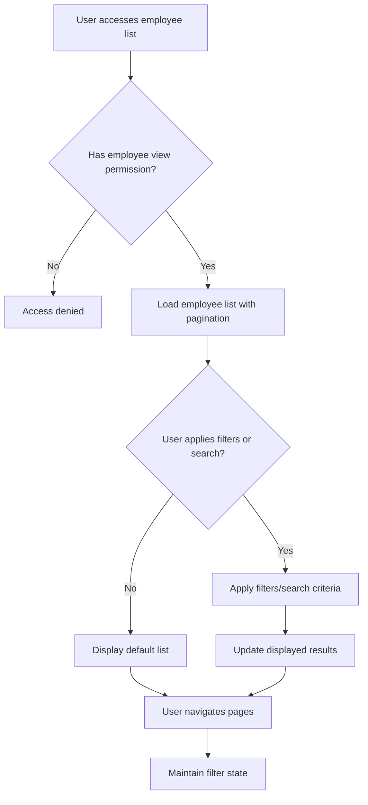
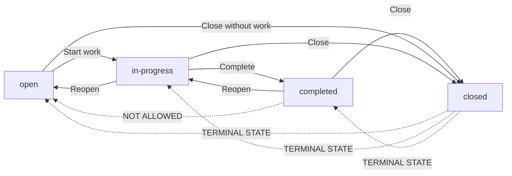
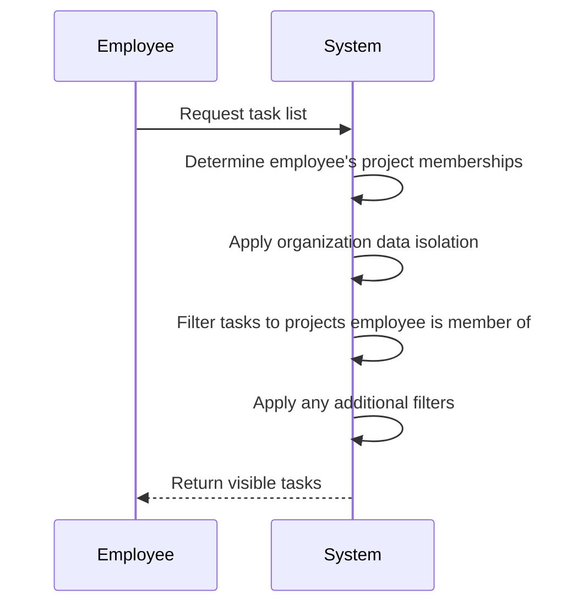
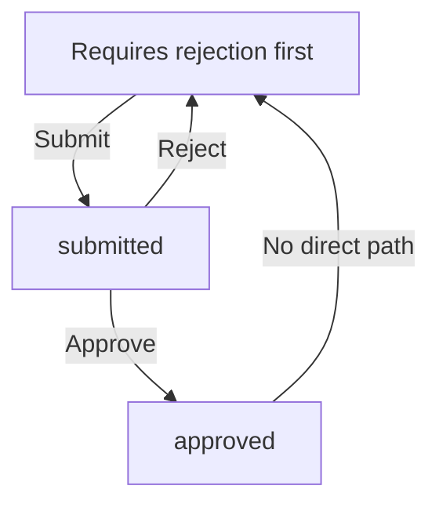
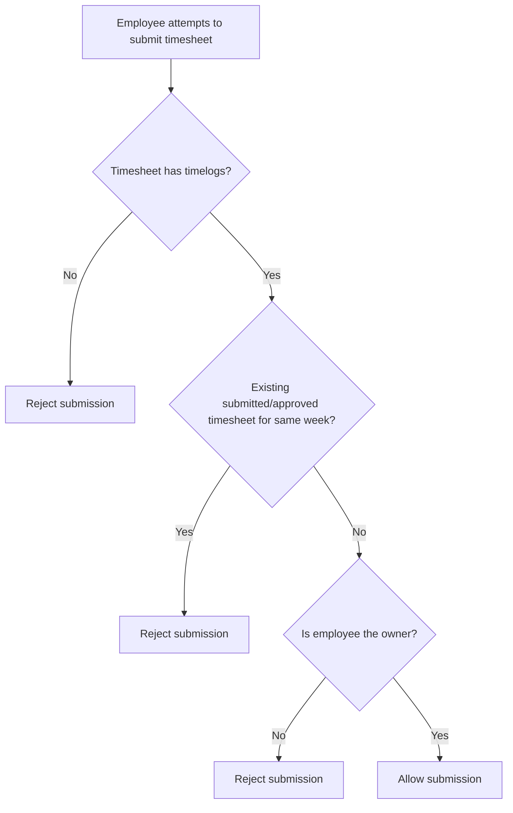
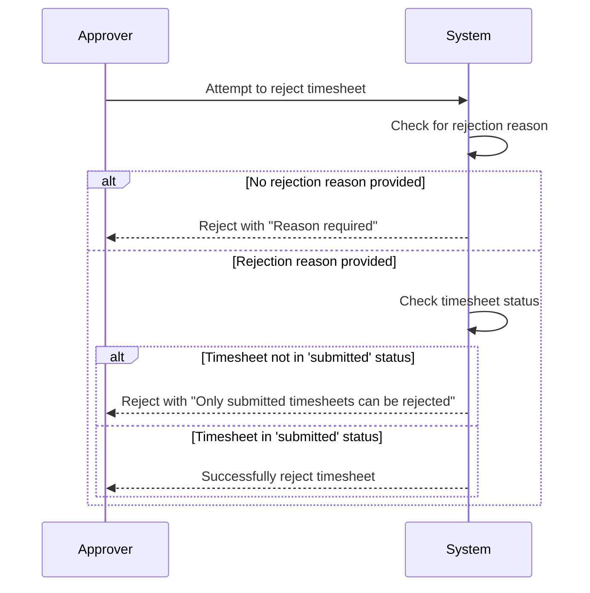
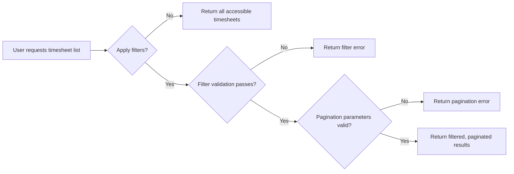
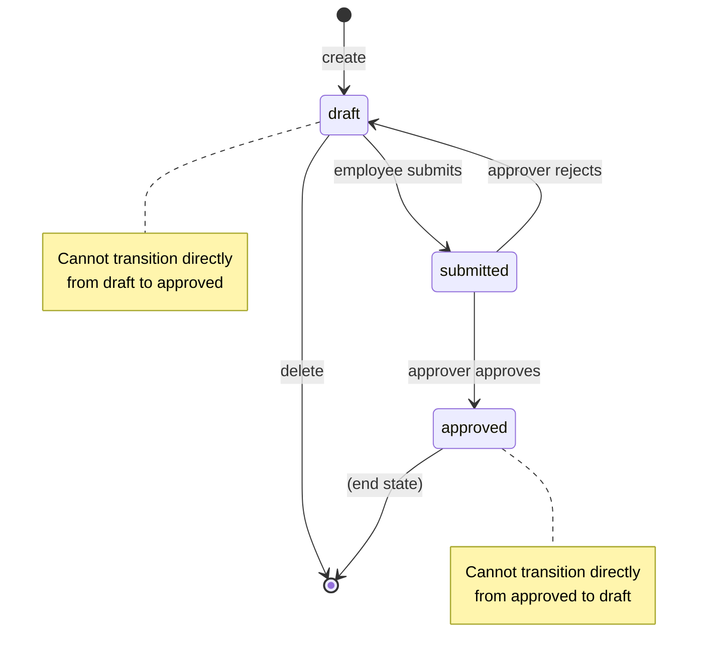
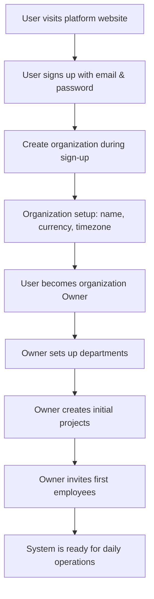
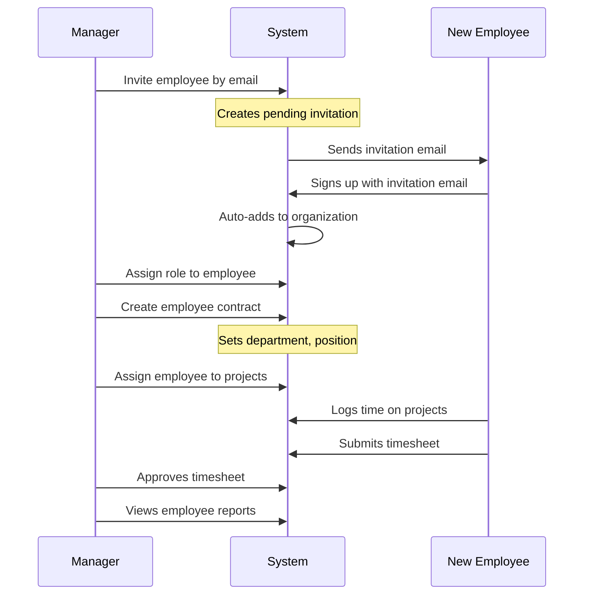

**erpTimeTrack — What operations users can perform, use cases, business workflows**

What operations users can perform, use cases, business workflows

# Core Business Operations

What the system must do for each business concept.

## User Operations

Users can sign up with email and password to create a new user account. After sign-up, they can log in with their email and password credentials. Users belong to multiple organizations and can switch between them without logging out. When logging in, users select which organization to work in, which scopes all their subsequent actions. Users can change their password when needed for security. Users can delete their account entirely, but only if they are not the sole owner of any organization. If they are a sole owner, they must first transfer ownership or delete the organization. When a user deletes their account, their employee records in other organizations are marked as deactivated but not removed.

### User Sign-up Process

THE erpTimeTrack SHALL allow a person to create a new user account by providing an email address and password.
WHEN a person provides a unique email address and password, THEN THE erpTimeTrack SHALL create a user account and associate it with the email.
WHEN a person signs up for the first time, THEN THE erpTimeTrack SHALL require them to create an organization as part of the sign-up process.
WHERE an organization is created during sign-up, THE erpTimeTrack SHALL automatically assign the user the Owner role within that organization.
WHEN a person attempts to sign up with an email that is already registered, THEN THE erpTimeTrack SHALL reject the request and inform the person that the email is already in use.
IF a person has a pending organization invitation with the same email address they use to sign up, THEN THE erpTimeTrack SHALL automatically add the new user account to the pending organization(s).

### User Login Flow

WHEN a user attempts to log in, THEN THE erpTimeTrack SHALL require them to provide their email address and password.
WHEN the email and password match a registered account, THEN THE erpTimeTrack SHALL authenticate the user and present the organization selection screen.
WHEN a user has access to multiple organizations, THEN THE erpTimeTrack SHALL display a list of organizations they belong to for selection.
WHEN a user selects an organization, THEN THE erpTimeTrack SHALL scope all subsequent actions to the selected organization context.
WHEN the email or password does not match any account, THEN THE erpTimeTrack SHALL reject the login attempt and inform the user of incorrect credentials.

### Multi-Organization Membership

THE erpTimeTrack SHALL allow a user to belong to multiple organizations simultaneously.
WHEN a user is invited to an organization via email, THEN THE erpTimeTrack SHALL associate the user's account with that organization.
WHERE a user belongs to multiple organizations, THE erpTimeTrack SHALL maintain separate employee records for each organization.
THE erpTimeTrack SHALL allow a user to be assigned different roles in different organizations.
THE erpTimeTrack SHALL ensure that data from one organization is never visible to users in another organization, even for the same user account.

### Organization Context Switching

THE erpTimeTrack SHALL allow a user to switch between organizations without logging out.
WHEN a user switches organization context, THEN THE erpTimeTrack SHALL immediately scope all subsequent operations to the newly selected organization.
THE erpTimeTrack SHALL preserve the user's session when switching organizations.
THE erpTimeTrack SHALL display the current organization context clearly in the user interface.
THE erpTimeTrack SHALL require explicit organization selection when a user has access to multiple organizations.

### Password Change Operation

THE erpTimeTrack SHALL allow authenticated users to change their password.
WHEN a user requests to change their password, THEN THE erpTimeTrack SHALL require them to provide their current password for verification.
WHEN the current password is verified, THEN THE erpTimeTrack SHALL allow the user to set a new password.
THE erpTimeTrack SHALL require the new password to be different from the current password.
THE erpTimeTrack SHALL invalidate all existing sessions for the user after a successful password change, requiring re-authentication.

### Account Deletion Requirements

THE erpTimeTrack SHALL allow users to delete their own account.
WHEN a user requests to delete their account, THEN THE erpTimeTrack SHALL verify they are not the sole owner of any organization.
IF a user is the sole owner of an organization, THEN THE erpTimeTrack SHALL require them to either transfer ownership or delete the organization before proceeding with account deletion.
WHEN a user's account is deleted, THEN THE erpTimeTrack SHALL mark their employee records in all organizations as deactivated.
THE erpTimeTrack SHALL permanently remove the user's account credentials and profile from the system after deletion.

### Sole Owner Restriction Handling

THE erpTimeTrack SHALL prevent account deletion when the user is the sole owner of any organization.
WHEN a sole owner attempts to delete their account, THEN THE erpTimeTrack SHALL display an error explaining they must first transfer ownership or delete the organization.
THE erpTimeTrack SHALL provide a mechanism for sole owners to transfer ownership of their organization to another employee.
WHERE ownership is transferred, THE erpTimeTrack SHALL ensure the new owner has the Owner role with full permissions.
THE erpTimeTrack SHALL allow sole owners to delete their organization as an alternative to transferring ownership.

### Account Deactivation Across Organizations

WHEN a user deletes their account, THEN THE erpTimeTrack SHALL deactivate all their employee records across all organizations.
WHERE an employee record is deactivated, THE erpTimeTrack SHALL prevent that user from logging time, submitting timesheets, or performing any active operations.
THE erpTimeTrack SHALL preserve all historical data (timelogs, timesheets, etc.) associated with deactivated employee records.
THE erpTimeTrack SHALL display deactivated employees in employee lists with appropriate status indicators.
THE erpTimeTrack SHALL allow organization managers to reactivate deactivated employee records if needed.

### Automatic Organization Association on Sign-up

THE erpTimeTrack SHALL automatically associate new user accounts with any organizations where they have pending invitations.
WHEN a person signs up with an email address that matches pending organization invitations, THEN THE erpTimeTrack SHALL immediately add them to those organizations.
WHERE automatic organization association occurs, THE erpTimeTrack SHALL assign the user the default Employee role unless specified otherwise in the invitation.
THE erpTimeTrack SHALL notify the user during sign-up about any organizations they are being automatically added to.
THE erpTimeTrack SHALL remove the pending invitation status after successful organization association.

## Organization Operations

Users create an organization during initial sign-up, which establishes their primary organizational context. Organization owners can edit settings including name, description, logo, currency, timezone, and fiscal start month. Each organization operates independently with its own employees, projects, and data. Organizations can be deleted only by owners who meet specific criteria: all pending timesheets must be resolved, and there must be no active employee contracts. When an organization is deleted, all its data is permanently removed including employees, projects, tasks, timelogs, and timesheets. The owner's account remains but is no longer associated with any organization. Data isolation ensures employees in one organization cannot see data from another organization. Users can see organization-specific data only when they have selected that organization context.

### Organization Creation and Initial Setup

When a user signs up for the platform, they must create an organization. The organization creation is part of the sign-up process and establishes the user's primary organizational context.

The system shall create an organization with the following required information:
- Organization name (required)
- Currency (required, must be a valid currency code)
- Timezone (required, must be a valid timezone identifier)
- Fiscal start month (required, 1-12 representing January to December)

Optional information includes:
- Organization description
- Logo image

Upon successful creation:
1. The user is automatically assigned the Owner role for the organization
2. The organization becomes the user's default organizational context
3. The organization operates independently with its own isolated data
4. The user can immediately begin using the platform within this organization

Users can create only one organization during initial sign-up. To join additional organizations, users must be invited by existing organization owners.

### Organization Settings Management

Organization owners can edit their organization's settings. Settings management includes updating basic information and operational parameters.

The system shall allow organization owners to:
- Update the organization name
- Modify the organization description
- Change the logo image
- Update the currency setting
- Change the timezone
- Modify the fiscal start month

When updating settings:
1. The organization name cannot be empty
2. Currency must be a valid currency code supported by the system
3. Timezone must be a valid timezone identifier
4. Fiscal start month must be a value between 1 and 12
5. Changes take effect immediately for all organization data

Settings changes do not affect:
- Historical data (timelogs, timesheets remain with original context)
- Employee contracts (pay rates and periods remain unchanged)
- Project timelines (dates remain in original timezone context)

Only users with the Owner role in the organization can edit organization settings. Users with Manager or Employee roles cannot modify organization settings.

### Organization Deletion Process

Organization owners can delete their organization when specific prerequisites are met. Deletion permanently removes all organization data.

Before an organization can be deleted:
1. All pending timesheets must be resolved (approved or rejected)
2. There must be no active employee contracts in the organization
3. The requesting user must have the Owner role

When an organization owner requests deletion:
1. The system checks if any timesheets have status "submitted" (awaiting approval)
   - If any submitted timesheets exist, deletion is blocked
   - The owner must first approve or reject all submitted timesheets
2. The system checks if any employee has an active contract
   - An active contract has no end date or an end date in the future
   - If any active contracts exist, deletion is blocked
   - The owner must first end all active contracts

If all prerequisites are satisfied:
1. The system permanently deletes all organization data including:
   - All employees and their records
   - All projects and tasks
   - All timelogs and timesheets
   - All departments
   - All custom roles and permissions
   - All activity logs
2. The organization is removed from the system
3. The owner's user account remains active
4. The owner is no longer associated with any organization
5. If the owner belongs to other organizations, they retain access to those

Organization deletion cannot be undone. No data recovery is possible after deletion.

### Multi-tenancy Data Isolation and Context Selection

The platform enforces strict data isolation between organizations. Users can belong to multiple organizations and must select which organization's data to work with.

The system shall:
1. Store all data with organization context
2. Restrict data access to users who belong to the same organization
3. Prevent users from viewing or modifying data from organizations they don't belong to

When a user logs in:
1. If the user belongs to only one organization, that organization is automatically selected
2. If the user belongs to multiple organizations, they must select which organization to work in
3. All subsequent actions are scoped to the selected organization

Users can switch organizations without logging out:
1. Users with access to multiple organizations can switch between them
2. When switching organizations, the user's view changes to show only data from the new organization
3. Any unsaved work in the previous organization context is lost

Data isolation applies to:
- Employee records and contracts
- Projects and tasks
- Timelogs and timesheets
- Departments and roles
- Activity logs and reports

Users cannot:
- View data from organizations they don't belong to
- Perform actions that would affect data in another organization
- Transfer data between organizations

The system ensures complete data separation through organization context enforcement on all data access operations.

## Employee Operations

Users with employee management permission can invite new employees to the organization by email. If the invited email already has an account, the user is immediately added to the organization. If the invited email has no account, a pending invitation is created that automatically associates when the user signs up. Employee records include role assignment, optional department and position, employment type, and status. Managers can edit employee details including department, position, and employment type. Employees can be deactivated, which prevents them from logging time or submitting timesheets while preserving historical data. Deactivated employees can be reactivated later. Users with view permission can see the employee list with pagination, filtering by department, employment type, status, and search by name. Each employee is assigned exactly one role that determines their permissions.

### Employee Invitation and Organization Association

### Employee Invitation and Organization Association

**Employee Invitation by Email**

- WHEN a user with employee management permission initiates an invitation for a new employee, THE system SHALL require the user to provide an email address.
- WHERE a valid email address is provided, THE system SHALL check if an account already exists with that email.
- IF an account exists with the provided email, THE system SHALL immediately add that user to the organization as an employee.
- IF no account exists with the provided email, THE system SHALL create a pending invitation associated with that email address.
- THE system SHALL send an invitation notification to the provided email address.

**Pending Invitation System**

- WHERE a pending invitation exists for an email address, THE system SHALL store the invitation with the organization reference, inviter details, and timestamp.
- WHEN a user signs up with an email address that has pending invitations, THE system SHALL automatically add the user to all organizations with pending invitations for that email.
- WHERE a user is added to an organization via pending invitation, THE system SHALL mark the pending invitation as fulfilled.
- THE system SHALL allow users with employee management permission to view pending invitations for their organization.
- THE system SHALL allow users with employee management permission to cancel pending invitations.

**Automatic Organization Association**

- WHEN a user signs up with an email address that has pending invitations, THE system SHALL automatically create employee records for that user in all organizations with pending invitations.
- WHERE automatic organization association occurs, THE system SHALL assign the default employee role (as defined by the organization) to the new employee.
- THE system SHALL notify the organization owner or manager when a pending invitation is fulfilled and a new employee is added.

**Invitation Error Conditions**

- IF the provided email address is invalid or malformed, THE system SHALL reject the invitation request.
- IF the provided email address already belongs to an employee in the organization, THE system SHALL reject the invitation request.
- IF the user initiating the invitation lacks employee management permission, THE system SHALL reject the invitation request.

### Employee Record Management and Role Assignment

### Employee Record Management and Role Assignment

**Employee Record Creation**

- WHEN an employee record is created (via invitation or direct addition), THE system SHALL create the record with:
  - Reference to the user account
  - Role assignment (default or specified)
  - Optional department
  - Optional position/title
  - Required employment type (full-time, part-time, contractor, intern)
  - Status set to "active"

**Employee Record Editing**

- WHERE a user has employee management permission, THE system SHALL allow editing of employee records.
- WHEN editing an employee record, THE system SHALL allow modification of:
  - Department (optional)
  - Position/title (optional)
  - Employment type (full-time, part-time, contractor, intern)
- THE system SHALL preserve historical data for audit purposes.

**Role Assignment to Employees**

- WHEN creating or editing an employee record, THE system SHALL require assignment of exactly one role to the employee.
- WHERE a user has employee management permission, THE system SHALL allow changing an employee's role assignment.
- WHEN changing an employee's role, THE system SHALL immediately apply the new role's permissions to that employee.
- THE system SHALL prevent assignment of non-existent or deleted roles to employees.

**Role Assignment Constraints**

- IF an attempt is made to assign a role that has been deleted, THE system SHALL reject the assignment.
- IF an attempt is made to assign multiple roles to a single employee, THE system SHALL reject the assignment.
- WHERE custom roles are deleted, THE system SHALL prevent role assignment to those roles for new employees.

**Employee Record Viewing**

- WHERE a user has employee view permission, THE system SHALL allow viewing of employee records.
- WHEN viewing an employee record, THE system SHALL display:
  - User profile information (display name, avatar)
  - Assigned role
  - Department (if assigned)
  - Position/title (if assigned)
  - Employment type
  - Status (active/deactivated)
- THE system SHALL restrict employee record viewing based on the user's permissions.

### Employee Status Management (Deactivation and Reactivation)

### Employee Status Management (Deactivation and Reactivation)

**Employee Deactivation Process**

- WHERE a user has employee management permission, THE system SHALL allow deactivation of active employees.
- WHEN deactivating an employee, THE system SHALL change the employee's status from "active" to "deactivated".
- WHERE an employee is deactivated, THE system SHALL prevent that employee from:
  - Creating new timelogs
  - Submitting timesheets
  - Starting new timers
  - Being assigned to new projects or tasks
- THE system SHALL preserve all historical data (timelogs, timesheets, project assignments) for deactivated employees.
- THE system SHALL notify the employee (via their user account) when they are deactivated.

**Employee Reactivation Capability**

- WHERE a user has employee management permission, THE system SHALL allow reactivation of deactivated employees.
- WHEN reactivating an employee, THE system SHALL change the employee's status from "deactivated" back to "active".
- WHERE an employee is reactivated, THE system SHALL restore their ability to:
  - Create timelogs
  - Submit timesheets
  - Start timers
  - Be assigned to projects and tasks
- THE system SHALL notify the employee (via their user account) when they are reactivated.

**Deactivation Constraints**

- IF an employee has an active timer running, THE system SHALL prevent deactivation until the timer is stopped.
- WHERE an employee is the sole owner of an organization, THE system SHALL prevent deactivation until ownership is transferred or the organization is deleted.
- THE system SHALL prevent self-deactivation (users cannot deactivate themselves).

**Status Transition Tracking**

- THE system SHALL record all employee status changes (active ↔ deactivated) in the activity log.
- WHEN recording status changes, THE system SHALL include:
  - Timestamp
  - User who performed the change
  - Previous status
  - New status
  - Reason (if provided)

### Employee List Viewing and Filtering

### Employee List Viewing and Filtering

**Employee List Access**

- WHERE a user has employee view permission, THE system SHALL provide access to the employee list.
- THE system SHALL display the employee list showing:
  - Employee name (from user profile)
  - Email address
  - Assigned role
  - Department (if assigned)
  - Employment type
  - Status (active/deactivated)
- THE system SHALL restrict the employee list to only show employees within the current organization context.

**Employee List Pagination**

- THE system SHALL paginate the employee list to manage large numbers of employees.
- WHEN paginating the employee list, THE system SHALL:
  - Display a configurable number of employees per page
  - Provide navigation controls (previous/next page)
  - Show current page and total pages
  - Maintain filtering and sorting across pagination
- THE system SHALL optimize performance for paginated employee queries.

**Employee Filtering**

- THE system SHALL allow filtering of the employee list by:
  - Department (select from available departments)
  - Employment type (full-time, part-time, contractor, intern)
  - Status (active, deactivated, or both)
- WHEN filters are applied, THE system SHALL immediately update the displayed employee list.
- THE system SHALL clear all filters when the user explicitly requests.
- THE system SHALL preserve applied filters during user session.

**Employee Search Functionality**

- THE system SHALL provide a search interface for finding employees by name.
- WHEN searching for employees, THE system SHALL:
  - Search against employee display names
  - Perform case-insensitive matching
  - Support partial matching (substring search)
  - Combine search with existing filters
- WHERE search results are returned, THE system SHALL highlight matching terms in displayed results.
- THE system SHALL display a "no results" message when no employees match the search criteria.

**List Performance and Data Integrity**

- THE system SHALL ensure employee list data is always current with employee status changes.
- WHERE filters are combined with search, THE system SHALL apply logical AND between all criteria.
- THE system SHALL optimize list queries to maintain responsive performance even with large employee counts.



## Role Operations

Each organization has three built-in roles that cannot be deleted: Owner with full access, Manager with administrative capabilities, and Employee with basic access. Organization owners can create custom roles with specific permission sets. Available permissions include organization management, employee management, project management, time management, time approval, time viewing, and report viewing. Custom roles can be edited by owners to adjust permission assignments. Custom roles can be deleted only if no employees are currently assigned to them. Each employee in an organization is assigned exactly one role that determines their capabilities. Role assignments can be changed by users with employee management permission. The permission system enforces data access based on assigned roles within the organization context.

### Built-in Role Definitions

THE system SHALL provide three built-in roles for each organization that cannot be deleted: Owner, Manager, and Employee.

WHEN an organization is created, THE system SHALL automatically create the three built-in roles.

THE system SHALL define the Owner role with full access to all features, including the ability to manage roles and organization members.

THE system SHALL define the Manager role with administrative capabilities including managing employees, projects, approving timesheets, and viewing reports.

THE system SHALL define the Employee role with basic access including tracking time, submitting timesheets, and viewing their own data.

THE system SHALL prevent users from deleting any of the three built-in roles.

### Custom Role Creation

WHEN an organization owner wants to create a custom role, THE system SHALL allow them to specify a name for the new role.

THE system SHALL require the custom role name to be unique within the organization.

THE system SHALL present the organization owner with the complete set of available permissions for assignment to the custom role.

WHERE custom role creation is performed, THE system SHALL require the organization owner to select at least one permission to assign to the role.

THE system SHALL create the custom role with the specified name and permission assignments after successful validation.

THE system SHALL associate the newly created custom role exclusively with the organization where it was created.

### Permission Assignment to Roles

THE system SHALL make available the following permissions for assignment to roles:
- Organization management permission for editing organization settings
- Employee management permission for adding, editing, and deactivating employees
- Employee view permission for viewing employee lists and details
- Project management permission for creating, editing, and deleting projects and tasks
- Project view permission for viewing projects and tasks
- Time management permission for editing or deleting any employee's timelogs
- Time approval permission for approving or rejecting timesheets
- Time view all permission for viewing all employees' timelogs and timesheets
- Report view permission for viewing organization reports

WHEN assigning permissions to a role, THE system SHALL allow any combination of the available permissions to be selected.

THE system SHALL record the complete set of permissions assigned to each role.

THE system SHALL use the permission assignments to determine what actions users with that role can perform.

### Custom Role Editing Capabilities

WHEN an organization owner wants to edit a custom role, THE system SHALL allow them to modify the role's name.

THE system SHALL require the modified role name to remain unique within the organization.

THE system SHALL allow organization owners to change the permission assignments for custom roles.

WHERE custom role editing is performed, THE system SHALL allow the organization owner to add or remove any available permission from the role's permission set.

THE system SHALL prevent organization owners from editing built-in roles.

THE system SHALL update the role's permission assignments immediately for all employees assigned to that role.

### Role Deletion Constraints

WHEN an organization owner attempts to delete a custom role, THE system SHALL check if any employees are currently assigned to that role.

IF any employees are assigned to the role, THEN THE system SHALL prevent the deletion and inform the organization owner that they must reassign or deactivate those employees first.

THE system SHALL allow deletion of custom roles only when no employees are assigned to them.

THE system SHALL prevent deletion of any of the three built-in roles under any circumstances.

WHERE role deletion is performed, THE system SHALL permanently remove the custom role from the organization's available roles.

### Single Role Assignment Per Employee

THE system SHALL require each employee in an organization to be assigned exactly one role.

WHEN creating a new employee record, THE system SHALL require the assigning user to select one role from the organization's available roles.

THE system SHALL prevent employees from having zero roles assigned.

THE system SHALL prevent employees from having more than one role assigned simultaneously.

THE system SHALL use the employee's assigned role to determine their permissions and capabilities within the organization.

### Role Assignment Changes

WHEN a user with employee management permission wants to change an employee's role assignment, THE system SHALL allow them to select a different role from the organization's available roles.

THE system SHALL require the new role selection to be different from the employee's current role for the change to take effect.

WHERE role assignment is changed, THE system SHALL immediately update the employee's permissions to match the new role's permission set.

THE system SHALL record the role change in the activity log, including who made the change and when.

THE system SHALL prevent users without employee management permission from changing role assignments.

THE system SHALL allow role changes for both active and deactivated employees.

### Permission-Based Access Control

THE system SHALL check the user's assigned role permissions before allowing any action within the organization.

WHEN a user attempts to perform an action, THE system SHALL verify that their role includes the required permission for that action.

IF the user's role does not include the required permission, THEN THE system SHALL prevent the action and inform the user they lack the necessary permissions.

THE system SHALL allow actions only when the user's role includes all required permissions for that specific operation.

THE system SHALL apply permission checks for all operations including viewing data, creating records, editing records, and deleting records.

THE system SHALL enforce permission checks within the current organization context only.

### Organization-Specific Role Management

THE system SHALL maintain separate sets of roles for each organization.

THE system SHALL ensure that roles created in one organization are not visible or usable in other organizations.

WHEN a user switches organization context, THE system SHALL apply only the roles and permissions from the selected organization.

THE system SHALL prevent organization owners from managing roles in organizations where they are not the owner.

WHERE custom roles are created, THE system SHALL associate them exclusively with the creating organization.

THE system SHALL allow organization owners to manage only their own organization's roles, not roles from other organizations.

THE system SHALL ensure that permission assignments and role definitions are completely isolated between organizations.

## Department Operations

Users with organization management permission can create departments with names, descriptions, and optional parent departments. Departments support one level of nesting, allowing hierarchical organization structures. Department details can be edited by authorized users to update names, descriptions, or parent relationships. Departments can be deleted, which sets affected employees' department field to null without removing the employees. All employees can view the list of departments within their organization. The department structure helps organize employees for reporting and management purposes. When a department is deleted, the system ensures employees maintain their other attributes while their department assignment is cleared.

### Department Creation with Hierarchy

Users with organization management permission can create departments within their organization.

THE system SHALL require the following when creating a department:
- Name (required) - unique within the organization
- Description (optional)
- Parent department (optional) - for one-level hierarchical nesting

WHEN a department is created, THE system SHALL enforce that:
- The parent department must exist within the same organization
- The parent department cannot be the same as the department being created (no self-referencing)
- Only one level of nesting is allowed (a department with a parent cannot itself become a parent)
- Circular references are prevented (a parent cannot have the new department as an ancestor)

WHERE parent department is specified, THE system SHALL create a hierarchical relationship that groups employees under the parent department structure.

### Department Editing Capabilities

Users with organization management permission can edit existing departments.

THE system SHALL allow editing of the following department attributes:
- Name
- Description
- Parent department assignment

WHEN editing a department, THE system SHALL enforce that:
- All existing validation rules for department creation also apply to edits
- If changing the parent department, the new parent must exist within the same organization
- A department cannot be made its own parent
- The hierarchical nesting depth limit of one level is maintained
- Circular references between departments are prevented

IF a department has child departments, THE system SHALL allow editing of its name and description, but SHALL prevent changing its parent department (since it would become a grandchild, violating one-level nesting).

### Department Deletion Process

Users with organization management permission can delete departments from their organization.

WHEN a department is deleted, THE system SHALL:
- Remove the department from the organization structure
- Set the department field to null for all employees currently assigned to the department
- Preserve all employee records with their other attributes intact
- Prevent deletion if the department has child departments (must delete or reassign children first)

THE system SHALL provide confirmation before permanent deletion since this affects employee department assignments.

WHEN an employee's department is set to null during department deletion, THE system SHALL record this change in the activity log for audit purposes.

### Employee Department Reassignment on Deletion

WHEN a department is deleted, THE system SHALL automatically handle employee department reassignment.

THE system SHALL set the department field to null for all employees who were assigned to the deleted department.

THE system SHALL NOT:
- Delete employee records
- Change other employee attributes (position, employment type, status, etc.)
- Affect employee contracts, timelogs, timesheets, or project assignments
- Remove employees from the organization

Employees whose department becomes null can be:
- Reassigned to other departments by users with employee management permission
- Continue working and logging time normally
- Viewed in employee lists (with null department indicated)

The system SHALL maintain referential integrity by ensuring no orphaned department references remain in employee records.

### Department List Viewing

All employees within an organization can view the list of departments.

THE system SHALL display departments in a way that shows:
- Department name
- Description (if provided)
- Parent department relationship (for hierarchical structure)
- Number of employees currently assigned to each department

THE system SHALL organize the department list to reflect hierarchical relationships, showing parent departments before their children.

Employees can use the department list to:
- Understand organizational structure
- Filter employees by department
- View which departments exist within their organization

The department list SHALL be available regardless of the employee's specific permissions (everyone can view it).

### Hierarchical Department Structure Support

THE system SHALL support one level of nesting in department hierarchy.

A department can have a parent department, but:
- A department with a parent cannot have children (maximum depth: grandparent → parent → department)
- The hierarchy is limited to parent-child relationships only
- No deeper nesting levels (no grandchildren)

THE system SHALL visualize the hierarchical structure in department listings by:
- Indenting child departments under their parents
- Showing parent department names alongside child departments
- Preventing circular references in parent-child relationships

WHEN creating or editing departments, THE system SHALL validate that the one-level nesting constraint is maintained.

This hierarchical structure allows organizations to group departments logically (e.g., "Engineering" department with "Frontend" and "Backend" sub-departments).

### Single-Level Nesting Enforcement

THE system SHALL enforce a maximum of one level of nesting in department hierarchy.

WHEN a user attempts to create or edit a department, THE system SHALL prevent:
- Making a department with a parent become a parent itself (would create two-level nesting)
- Assigning a child department as a parent to another department
- Creating circular references where a department becomes its own ancestor

THE system SHALL validate nesting depth by:
- Checking if a department already has a parent before allowing it to become a parent
- Preventing departments with children from being assigned a parent
- Maintaining the rule: "A department can be either a parent OR a child, not both"

This single-level nesting constraint simplifies organizational structure while allowing basic department grouping.

### Organization Department Management

Department management operations are scoped to individual organizations.

Each organization has its own independent department structure.

Users with organization management permission can:
- Create departments specific to their organization
- Edit departments within their organization
- Delete departments from their organization
- View all departments in their organization

Department operations SHALL affect only the currently selected organization.

Data isolation ensures that:
- Departments created in Organization A are not visible in Organization B
- Parent department relationships are confined within the same organization
- Employees in different organizations cannot be assigned to departments from other organizations
- Department names need only be unique within each organization (not globally)

This per-organization department management supports multi-tenancy requirements.

### Department-Based Employee Grouping

THE system SHALL support grouping employees by department for organizational purposes.

Employees can be assigned to departments to:
- Create logical groupings for reporting
- Filter employee lists by department
- Organize hierarchical management structures
- Track department-specific metrics in reports

WHEN viewing employee lists or reports, users can:
- Filter employees by department
- View department assignments alongside employee details
- See which employees belong to which departments

Department grouping enables:
- Department-level time tracking reports
- Project assignments by department
- Budget allocation by department
- Management oversight of department activities

The system SHALL maintain department-employee relationships to support these grouping and filtering capabilities.

## Project Operations

Users with project management permission can create projects with required names, optional descriptions, color codes for UI display, and optional budget hours. Projects have statuses of active, archived, or completed. Project details can be edited by authorized users to update any attribute. Projects can be archived or completed, which prevents new timelogs while preserving existing data. Projects can be deleted only if they have no associated timelogs. Users with project view permission can see all projects with pagination and filtering by status. Projects serve as containers for tasks and timelogs, with optional budget tracking against actual hours. Archived or completed projects cannot receive new time entries but maintain historical data for reporting.

### Project Creation with Color Coding

### Project Creation with Color Coding

**WHEN a user with project management permission creates a new project, THE system SHALL require the project name to be provided.**

**WHERE a user creates a new project, THE system SHALL accept an optional description for the project.**

**WHERE a user creates a new project, THE system SHALL require a color code to be selected for UI display purposes.**

**WHERE a user creates a new project, THE system SHALL accept optional budget hours for total estimated hours.**

**WHERE a user creates a new project, THE system SHALL accept optional start date and end date.**

**WHEN a new project is created, THE system SHALL automatically set its status to "active".**

**IF a user attempts to create a project without providing a name, THEN THE system SHALL reject the request.**

**IF a user attempts to create a project without selecting a color code, THEN THE system SHALL reject the request.**

**WHERE a project is created, THE system SHALL associate it with the current organization context.**

**WHEN a project is created successfully, THE system SHALL make it available for task creation and time tracking by assigned employees.**

### Project Status Management

### Project Status Management

**WHILE a project is in "active" status, THE system SHALL allow employees assigned to the project to log time entries against it.**

**WHERE a user with project management permission edits a project, THE system SHALL allow updating of the project name, description, color code, budget hours, start date, and end date.**

**WHERE a project's status is updated, THE system SHALL record the change in the activity log with timestamp and user who made the change.**

**WHEN a project's end date is reached while the project is still "active", THE system SHALL not automatically change the project status (status changes require explicit action by authorized users).**

**WHERE a project has a start date and end date specified, THE system SHALL validate that the end date is not earlier than the start date.**

**IF a user attempts to set a project's end date earlier than its start date, THEN THE system SHALL reject the update.**

**WHILE a project exists, THE system SHALL maintain its association with the organization that created it.**

### Project Archiving and Completion

### Project Archiving and Completion

**WHEN a user with project management permission archives a project, THE system SHALL change the project status from "active" to "archived".**

**WHEN a user with project management permission completes a project, THE system SHALL change the project status from "active" to "completed".**

**WHILE a project is in "archived" or "completed" status, THE system SHALL prevent employees from creating new timelogs against the project.**

**WHERE a project is archived or completed, THE system SHALL preserve all existing timelogs associated with the project for historical reporting purposes.**

**WHERE a project is archived or completed, THE system SHALL maintain all tasks associated with the project in their current status.**

**WHERE an archived or completed project has tasks, THE system SHALL allow viewing of those tasks but prevent creation of new tasks.**

**WHEN a project is archived or completed, THE system SHALL record this action in the activity log with details of which user performed the action.**

**WHERE a user with project management permission attempts to change a project from "archived" back to "active", THE system SHALL allow this status change.**

**WHERE a user with project management permission attempts to change a project from "completed" back to "active", THE system SHALL allow this status change.**

### Project Deletion

### Project Deletion

**WHEN a user with project management permission attempts to delete a project, THE system SHALL check if the project has any timelogs associated with it.**

**IF a project has one or more timelogs associated with it, THEN THE system SHALL reject the deletion request and inform the user that projects with timelogs cannot be deleted.**

**WHERE a project has no timelogs associated with it, THE system SHALL allow deletion by users with project management permission.**

**WHEN a project is deleted, THE system SHALL permanently remove all associated data including project details, tasks, and project member assignments.**

**WHERE a project is deleted, THE system SHALL record this action in the activity log with details of which user performed the deletion.**

**WHILE a project has pending tasks (tasks not in "completed" or "closed" status), THE system SHALL still allow deletion as long as no timelogs exist (task existence alone does not block deletion).**

### Project Browsing and Filtering

### Project Browsing and Filtering

**WHEN a user with project view permission requests the project list, THE system SHALL return all projects within the current organization context.**

**WHERE the project list contains many projects, THE system SHALL paginate the results to improve performance and usability.**

**WHERE users browse projects, THE system SHALL allow filtering the project list by status (active, archived, completed).**

**WHERE the project list is displayed, THE system SHALL show each project's name, color code, status, and other basic information.**

**WHERE users view a specific project, THE system SHALL display all project details including description, budget hours, start date, end date, and associated tasks.**

**WHERE project lists are paginated, THE system SHALL provide navigation controls to move between pages of results.**

**WHERE project filtering is applied, THE system SHALL update the displayed list to show only projects matching the selected status filter.**

### Project Budget Tracking

### Project Budget Tracking

**WHERE a project has budget hours specified, THE system SHALL track the total hours logged against the project.**

**WHEN timelogs are created or deleted for a project, THE system SHALL update the project's actual hours total accordingly.**

**WHERE a project has both budget hours and actual hours, THE system SHALL calculate the percentage of budget consumed (actual hours / budget hours × 100).**

**WHILE a project is active, THE system SHALL include it in project budget reports that compare budget hours vs. actual hours.**

**WHERE project budget reports are generated, THE system SHALL exclude projects that do not have budget hours specified.**

**WHEN a project's actual hours approach or exceed its budget hours, THE system SHALL highlight this in dashboard views for users with report view permission.**

**WHERE budget hours are optional for projects, THE system SHALL treat projects without budget hours as having no budget tracking requirement.**

## Task Operations

Project leads or users with project management permission can create tasks within projects with required titles and optional descriptions. Tasks have statuses of open, in-progress, completed, or closed with priority levels of low, medium, high, or urgent. Tasks can have optional estimated hours, due dates, and assigned employees who must be project members. Tasks support one level of nesting through parent-child relationships for subtasks. Task details can be edited by project leads or managers, with status changes recorded in task history. Employees can view tasks in projects they are assigned to with filtering by status, priority, and assigned employee. Tasks can be sorted by due date, priority, or creation date. Task history tracks who changed status and when for audit purposes.

### Task Creation within Projects

### Task Creation within Projects

Project leads or users with the project management permission can create tasks within projects.

When creating a task:
- The system shall require the project lead or user with project management permission to select a target project (required)
- The system shall require a task title (required)
- The system shall allow an optional task description
- The system shall set the initial task status to "open" (defined in [Task Status Lifecycle])
- The system shall require a priority level from the values: low, medium, high, or urgent (required)
- The system shall allow optional estimated hours (numeric, positive if provided)
- The system shall allow an optional due date (date)
- The system shall allow an optional assigned employee who must be a member of the selected project (defined in [Task Assignment to Project Members])
- The system shall allow an optional parent task for creating subtasks, subject to one-level nesting constraint (defined in [Subtask Creation with Nesting])
- The system shall record the creating user and timestamp
- When the parent task is specified, the system shall verify the parent task belongs to the same project

When the assigned employee is specified:
- The system shall verify the employee is an active member of the project
- The system shall not assign tasks to deactivated employees

When estimated hours are provided:
- The system shall require the value to be positive (greater than zero)

When a due date is provided:
- The system shall allow dates in the past, present, or future
- The system shall not validate relationships between due date and project dates

If the project is archived or completed:
- The system shall reject task creation

If the parent task is specified and has its own parent (nesting depth would exceed one level):
- The system shall reject task creation

### Task Status Lifecycle

### Task Status Lifecycle

Tasks have a defined status lifecycle with four states: open, in-progress, completed, or closed.

The system shall enforce the following status transition rules:
- A newly created task shall have status "open"
- A task in "open" status can transition to "in-progress" or "closed"
- A task in "in-progress" status can transition to "completed", "closed", or back to "open"
- A task in "completed" status can transition to "closed" or back to "in-progress"
- A task in "closed" status cannot transition to any other status (terminal state)

When a task status changes:
- The system shall record the status change in task history (defined in [Task Status Change History])
- The system shall record who made the change and when

When a task transitions to "completed":
- The system shall not automatically archive or affect the containing project
- The system shall allow the task to remain visible and accessible

When a task is "closed":
- The system shall prevent further timelog entries on the task
- The system shall preserve existing timelogs associated with the task
- The system shall prevent status transitions from "closed"

The system shall provide status-based filtering for task lists (defined in [Task Filtering and Sorting])

Project leads and users with project management permission can change task status regardless of assignment.

Employees assigned to a task can change its status only within permitted transitions.



### Task Priority Assignment

### Task Priority Assignment

Tasks must have a priority level assigned from four options: low, medium, high, or urgent.

When creating a task:
- The system shall require selection of a priority level (required)
- The system shall not assign a default priority

When editing a task:
- The system shall allow changing the priority level
- Project leads can change priority for tasks in their projects
- Users with project management permission can change priority for any task
- The assigned employee can change priority for tasks assigned to them

Priority affects:
- Task list sorting options (defined in [Task Filtering and Sorting])
- Visual indication in user interfaces (color coding, icons)
- No business rules or automatic behaviors depend on priority values

The system shall not calculate or derive priority from other task attributes.

Priority values are independent of task status, due date, or assignment.

When filtering tasks by priority:
- The system shall allow selection of one or multiple priority levels
- The system shall return tasks matching any of the selected priorities (OR logic)

### Task Assignment to Project Members

### Task Assignment to Project Members

Tasks can be assigned to employees who are members of the containing project.

When assigning a task:
- The system shall require the assigned employee to be a member of the project
- The system shall not allow assignment to employees who are not project members
- The system shall not allow assignment to deactivated employees
- The system shall allow unassigned tasks (no employee assignment)

When creating or editing a task:
- The system shall validate the assigned employee is a project member
- If validation fails, the system shall reject the operation

When an employee is removed from a project:
- The system shall not automatically unassign tasks from that employee
- Tasks assigned to the removed employee remain assigned
- The system shall prevent new timelogs on those tasks by the removed employee
- The system shall allow task reassignment by authorized users

When viewing tasks:
- Employees can see tasks assigned to them (defined in [Task Visibility for Assigned Employees])
- Employees can see all tasks in projects they are members of, regardless of assignment

When filtering tasks by assigned employee:
- The system shall allow selection of specific employees
- The system shall include both assigned and unassigned tasks when "unassigned" filter is selected
- The system shall respect organization data isolation (show only employees in current organization)

Assignment does not grant additional permissions beyond task visibility.

Project leads can assign tasks to any project member.

Users with project management permission can assign tasks to any project member across all projects.

### Subtask Creation with Nesting

### Subtask Creation with Nesting

The system supports one level of nesting for task-subtask relationships.

When creating a subtask:
- The system shall allow specifying a parent task
- The system shall enforce that the parent task belongs to the same project as the subtask
- The system shall reject creation if the parent task already has a parent (nesting depth would exceed one level)
- The system shall allow a task to have multiple subtasks
- The system shall not allow circular references (a task cannot be its own ancestor)

When viewing tasks:
- The system shall display parent-child relationships
- The system shall allow expanding/collapsing subtask lists
- The system shall maintain task independence for operations (editing, status changes, assignment)

Parent task constraints:
- A parent task can be in any status
- A parent task can be assigned to a different employee than its subtasks
- Changing parent task status does not affect subtask statuses
- Deleting a parent task shall delete all its subtasks (cascading delete)

Subtask independence:
- Subtasks have their own title, description, status, priority, estimated hours, due date, and assignment
- Subtask status changes do not affect parent task status
- Subtask completion does not automatically mark parent task as completed
- Subtasks can be assigned to different employees than their parent task

When filtering tasks:
- The system shall include both parent tasks and subtasks in results
- The system shall allow filtering to show only parent tasks (no subtasks)
- The system shall allow filtering to show only subtasks

When sorting tasks:
- The system shall sort parent tasks and subtasks independently
- Subtasks shall be grouped under their parent in hierarchical views

One-level nesting means:
- Tasks can have subtasks (depth 1)
- Subtasks cannot have their own subtasks (depth 2 not allowed)
- Maximum hierarchy: Parent → Child (no Grandchild)

### Task Editing by Authorized Users

### Task Editing by Authorized Users

Task details can be edited by authorized users based on their role and permissions.

Authorized editors include:
- Project leads for tasks within their projects
- Users with project management permission for any task in the organization
- The assigned employee for tasks assigned to them (limited fields)

Editable task fields:
- Title (all authorized editors)
- Description (all authorized editors)
- Status (all authorized editors, subject to transition rules)
- Priority (all authorized editors)
- Estimated hours (all authorized editors)
- Due date (all authorized editors)
- Assigned employee (project leads and users with project management permission only)
- Parent task (project leads and users with project management permission only)

When the assigned employee edits a task:
- The system shall allow editing title, description, status, priority, estimated hours, and due date
- The system shall not allow changing assignment or parent task
- The system shall record the editor in task history for status changes

When a project lead edits a task:
- The system shall allow editing all fields for tasks in their projects
- The system shall validate parent task belongs to same project
- The system shall validate assigned employee is a project member

When a user with project management permission edits a task:
- The system shall allow editing all fields for any task in the organization
- The system shall validate parent task belongs to same project
- The system shall validate assigned employee is a project member

Editing constraints:
- The system shall not allow editing tasks in archived or completed projects
- The system shall validate all field constraints during editing
- The system shall preserve previous values in task history for status changes only

When editing results in invalid state:
- The system shall reject the edit operation
- The system shall provide specific error messages
- The system shall not partially apply changes

Task editing does not affect:
- Existing timelogs on the task
- Timesheet inclusion of timelogs
- Project membership or permissions

All edits are applied immediately with no approval workflow.

### Task Status Change History

### Task Status Change History

The system maintains a history of task status changes for audit purposes.

When a task status changes:
- The system shall automatically create a history entry
- The system shall record the timestamp of the change
- The system shall record the user who made the change
- The system shall record the previous status value
- The system shall record the new status value

History entry content:
- Timestamp (date and time)
- User identifier (who made the change)
- Old status (previous value)
- New status (updated value)
- No other task field changes are recorded in history

History access:
- Project leads can view history for tasks in their projects
- Users with project management permission can view history for any task
- The assigned employee can view history for tasks assigned to them
- Users with only project view permission cannot access task history

History display:
- The system shall show history entries in chronological order (newest first or oldest first based on user preference)
- The system shall display user display name (not email) in history views
- The system shall format timestamps according to organization timezone

History retention:
- The system shall retain all status change history entries
- The system shall not delete or purge history entries
- History entries are preserved when tasks are deleted

When viewing task details:
- The system shall provide access to status change history
- The system may show recent status changes in task detail view
- The system shall paginate history entries if numerous

History serves as audit trail only:
- No business rules reference history entries
- No automatic actions trigger based on history patterns
- History cannot be edited or deleted by users

Status change history is separate from general activity logging (defined in ActivityLog Operations).

### Task Filtering and Sorting

### Task Filtering and Sorting

Employees can view and work with tasks using filtering and sorting options.

Available filters:
- Status: open, in-progress, completed, closed (single or multiple selection)
- Priority: low, medium, high, urgent (single or multiple selection)
- Assigned employee: specific employees or "unassigned"
- Project: specific projects (for users with access to multiple projects)
- Due date: date range (start date and/or end date)
- Creation date: date range
- Parent task: show only parent tasks, only subtasks, or all tasks

Filter behavior:
- The system shall apply filters using AND logic across different filter types
- The system shall apply OR logic within multi-select filters (e.g., status "open" OR "in-progress")
- The system shall respect organization data isolation (only tasks in current organization)
- The system shall respect project membership (only tasks in projects the user is a member of)

Available sort options:
- Due date (ascending/descending, with nulls last)
- Priority (custom order: urgent, high, medium, low)
- Creation date (ascending/descending)
- Title (alphabetical)

Sort behavior:
- The system shall apply primary sort by selected field
- The system shall apply secondary sort by creation date (newest first) for ties
- The system shall maintain sort order across pagination
- The system shall apply sorting after filtering

When no filters applied:
- The system shall show all tasks in projects the user is a member of
- The system shall include both parent tasks and subtasks
- The system shall respect task visibility rules (defined in [Task Visibility for Assigned Employees])

Filter and sort state:
- The system shall persist filter and sort preferences per user
- The system shall reset to default when switching organizations
- The system shall provide clear indicators of active filters

Performance expectations:
- The system shall return filtered/sorted results within reasonable time
- The system shall support pagination of filtered results
- The system shall maintain filter functionality as task count grows

Filtering and sorting are applied client-side or server-side as implementation determines.

No business rules depend on filter or sort configurations.

### Task Visibility for Assigned Employees

### Task Visibility for Assigned Employees

Task visibility is determined by project membership and assignment.

Employees can view:
- All tasks in projects they are members of, regardless of assignment
- Tasks assigned to them in projects they are members of
- Subtasks of parent tasks they can view

Employees cannot view:
- Tasks in projects they are not members of
- Tasks in other organizations (enforced by data isolation)
- Tasks assigned to other employees in projects they are not members of

When an employee views task lists:
- The system shall show tasks from all projects the employee is a member of
- The system shall indicate which tasks are assigned to the employee
- The system shall allow filtering to show only tasks assigned to the employee

When project membership changes:
- Newly added employees gain visibility to all tasks in that project
- Removed employees lose visibility to tasks in that project (except tasks still assigned to them)
- The system shall not automatically unassign tasks when employees are removed from projects

When employee status changes to deactivated:
- The system shall remove the employee from all project memberships
- The system shall preserve task assignments to the deactivated employee
- The system shall prevent the deactivated employee from viewing any tasks
- Authorized users can reassign tasks from deactivated employees

Task detail view:
- Employees can view full details of tasks they have visibility to
- Employees can see task history for tasks assigned to them
- Employees cannot see task history for tasks not assigned to them (unless they are project leads or have project management permission)

Visibility rules are enforced at:
- Task list retrieval
- Task detail access
- Task history access
- Task filtering and sorting

These visibility rules ensure employees only see relevant tasks while maintaining data isolation between organizations.



## Timelog Operations

Employees can create timelogs for themselves with required dates, duration in minutes, project assignment, optional task selection, description, and billable flag. Employees can edit their own timelogs only if they are not part of an approved timesheet. Employees can delete their own timelogs only if they are not part of any submitted or approved timesheet. Users with time management permission can edit or delete any employee's timelogs regardless of timesheet status. Users with time viewing permission can see all employees' timelogs. Employees can view their own timelogs with pagination and filtering by date range, project, task, and billable status. Timelogs must be associated with projects the employee is assigned to, with optional task assignment from that project.

### Timelog Creation

### Timelog Creation

THE system SHALL allow employees to create timelogs for themselves.

WHEN an employee creates a timelog, THE system SHALL require the following:
- The date on which the work was performed (must be today or a past date)
- The duration of work in minutes (must be a positive integer)
- A project the employee is assigned to (employee must be a project member)
- The billable flag (default value: true)

WHERE a timelog is created, THE system SHALL allow optional task assignment from tasks belonging to the selected project.

WHERE a timelog is created, THE system SHALL allow an optional text description of the work performed.

WHEN an employee attempts to create a timelog with a future date, THE system SHALL reject the request.

WHEN an employee attempts to create a timelog with zero or negative duration, THE system SHALL reject the request.

WHEN an employee attempts to create a timelog for a project they are not assigned to, THE system SHALL reject the request.

WHEN an employee attempts to create a timelog with a task that does not belong to the selected project, THE system SHALL reject the request.

### Timelog Modification

### Timelog Modification

WHEN an employee attempts to edit their own timelog, THE system SHALL verify the timelog is not part of an approved timesheet.

IF a timelog is part of an approved timesheet, THEN THE system SHALL reject edit attempts by the employee who owns the timelog.

WHEN an employee attempts to delete their own timelog, THE system SHALL verify the timelog is not part of any submitted or approved timesheet.

IF a timelog is part of a submitted or approved timesheet, THEN THE system SHALL reject deletion attempts by the employee who owns the timelog.

WHERE a timelog is modified, THE system SHALL preserve the original values if the timelog belongs to a timesheet with status other than draft.

WHEN a timelog's date, duration, project, or task is changed, THE system SHALL validate that the employee remains assigned to the new project.

WHEN a timelog is edited to change its date, THE system SHALL validate the new date is not in the future.

### Timelog Management Permissions

### Timelog Management Permissions

WHERE a user has the time:manage permission, THE system SHALL allow editing or deletion of any employee's timelogs regardless of timesheet status.

WHEN a user with time:manage permission edits a timelog, THE system SHALL validate all timelog fields follow the same rules as employee-created timelogs.

WHERE a user has the time:view_all permission, THE system SHALL allow viewing all employees' timelogs within the organization.

WHERE an employee views timelogs, THE system SHALL restrict viewing to only their own timelogs (unless they have time:view_all permission).

WHEN a user without time:manage permission attempts to edit another employee's timelog, THE system SHALL reject the request.

WHEN a user without time:manage permission attempts to delete another employee's timelog, THE system SHALL reject the request.

WHEN a user without time:view_all permission attempts to view another employee's timelogs, THE system SHALL reject the request.

### Timelog Browsing and Filtering

### Timelog Browsing and Filtering

THE system SHALL provide paginated views of timelogs.

WHERE timelogs are listed, THE system SHALL include date, duration, project name, task title (if assigned), description, and billable status for each timelog.

WHERE timelogs are listed, THE system SHALL support filtering by:
- Date range (start date and end date)
- Specific project
- Specific task
- Billable status (billable or non-billable)

WHEN filtering by project, THE system SHALL only show projects the viewing employee has access to (either their assigned projects or all projects if they have time:view_all permission).

WHEN filtering by task, THE system SHALL only show tasks belonging to projects the viewing employee has access to.

THE system SHALL allow employees to view the total hours (sum of duration) for filtered timelogs.

WHERE timelogs are paginated, THE system SHALL allow configuration of page size and navigation between pages.

WHERE timelogs are filtered, THE system SHALL apply the filter criteria before pagination to ensure consistent results across pages.

## Timesheet Operations

Employees can create draft timesheets for specific weeks that automatically include all their timelogs for that week. Employees can add or remove timelogs from draft timesheets before submission. Timesheets require at least one timelog to be submitted for approval. Employees cannot submit timesheets if another timesheet for the same week is already submitted or approved. Users with time approval permission can view all submitted timesheets and approve or reject them. Approving a timesheet locks all included timelogs from editing or deletion. Rejecting a timesheet requires a reason and returns it to draft status for modification. Employees can view their own timesheets with pagination and filtering by status and date range. Timesheets track submission timestamps, review timestamps, and reviewing users.

### Timesheet Draft Creation and Timelog Inclusion

### Timesheet Draft Creation and Timelog Inclusion

THE SYSTEM SHALL allow employees to create draft timesheets for specific calendar weeks (Monday to Sunday).

WHEN an employee creates a draft timesheet for a specific week, THE SYSTEM SHALL automatically include all timelogs that the employee has created during that week (from Monday through Sunday).

WHERE timesheet draft creation is performed, THE SYSTEM SHALL prevent employees from creating a draft timesheet for a week if they already have a draft, submitted, approved, or rejected timesheet for the same week.

WHEN creating a draft timesheet, THE SYSTEM SHALL calculate the total hours from all included timelogs and display this total to the employee.

THE SYSTEM SHALL allow employees to add additional timelogs to a draft timesheet beyond those automatically included.

THE SYSTEM SHALL allow employees to remove timelogs from a draft timesheet before submission.

IF an employee attempts to create a draft timesheet for a future week that has not yet occurred, THE SYSTEM SHALL reject the request.

WHILE a timesheet is in draft status, THE SYSTEM SHALL allow the employee to edit which timelogs are included.

THE SYSTEM SHALL require that a draft timesheet must include at least one timelog before it can be submitted for approval.

### Timesheet Submission and Conflict Prevention

### Timesheet Submission and Conflict Prevention

THE SYSTEM SHALL allow employees to submit draft timesheets for approval.

WHEN an employee submits a draft timesheet for approval, THE SYSTEM SHALL validate that the timesheet contains at least one timelog.

WHERE timesheet submission is attempted, THE SYSTEM SHALL prevent submission if the employee already has another timesheet for the same week with status "submitted" or "approved".

WHEN a timesheet is successfully submitted, THE SYSTEM SHALL change its status from "draft" to "submitted".

THE SYSTEM SHALL record the submission timestamp and the employee who submitted the timesheet.

WHILE a timesheet is in submitted status, THE SYSTEM SHALL prevent employees from editing or removing the included timelogs.

WHERE conflict prevention is enforced, THE SYSTEM SHALL allow only one submitted or approved timesheet per employee per calendar week.

IF an employee attempts to submit a timesheet that has zero timelogs, THE SYSTEM SHALL reject the submission and keep the timesheet in draft status.

IF an employee attempts to submit a timesheet for a week where they already have a submitted or approved timesheet, THE SYSTEM SHALL reject the submission and keep the timesheet in draft status.

WHEN a timesheet is submitted, THE SYSTEM SHALL make it visible to users with time approval permission for review and approval or rejection.

### Timesheet Approval Workflow and Timelog Locking

### Timesheet Approval Workflow and Timelog Locking

THE SYSTEM SHALL allow users with time approval permission to view all submitted timesheets in the organization.

THE SYSTEM SHALL allow users with time approval permission to approve submitted timesheets.

WHEN a timesheet is approved, THE SYSTEM SHALL change its status from "submitted" to "approved".

WHERE timesheet approval occurs, THE SYSTEM SHALL record the approval timestamp and the user who approved the timesheet.

WHEN a timesheet is approved, THE SYSTEM SHALL lock all timelogs included in that timesheet, preventing any editing or deletion of those timelogs.

THE SYSTEM SHALL prevent employees from editing or deleting timelogs that are part of an approved timesheet.

THE SYSTEM SHALL prevent users with time management permission from editing or deleting timelogs that are part of an approved timesheet.

WHILE a timesheet is in approved status, THE SYSTEM SHALL maintain a historical record of all included timelogs as they existed at the time of approval.

WHERE timelog locking is enforced, THE SYSTEM SHALL apply this restriction to all timelogs regardless of which employee created them.

THE SYSTEM SHALL display the approval status and reviewing user information when viewing an approved timesheet.

### Timesheet Rejection with Reason

### Timesheet Rejection with Reason

THE SYSTEM SHALL allow users with time approval permission to reject submitted timesheets.

WHEN a timesheet is rejected, THE SYSTEM SHALL require the rejecting user to provide a text reason explaining the rejection.

WHERE timesheet rejection occurs, THE SYSTEM SHALL change the timesheet status from "submitted" back to "draft".

WHEN a timesheet is rejected, THE SYSTEM SHALL record the rejection timestamp, the user who rejected it, and the rejection reason.

THE SYSTEM SHALL display the rejection reason to the employee who owns the timesheet.

WHILE a timesheet is in draft status after rejection, THE SYSTEM SHALL allow the employee to modify the timesheet based on the feedback.

THE SYSTEM SHALL allow employees to resubmit a rejected timesheet after making appropriate modifications.

WHERE rejection reason is required, THE SYSTEM SHALL prevent rejection if no reason is provided.

IF a user attempts to reject a timesheet without providing a reason, THE SYSTEM SHALL reject the rejection request and keep the timesheet in submitted status.

THE SYSTEM SHALL maintain a history of rejection reasons for audit purposes.

### Timesheet Viewing and Status Filtering

### Timesheet Viewing and Status Filtering

THE SYSTEM SHALL allow employees to view their own timesheets.

THE SYSTEM SHALL allow users with time approval permission to view all timesheets in the organization.

WHERE timesheet viewing is performed, THE SYSTEM SHALL display timesheets with pagination.

THE SYSTEM SHALL allow filtering of timesheets by status (draft, submitted, approved, rejected).

THE SYSTEM SHALL allow filtering of timesheets by date range (week start date to week end date).

THE SYSTEM SHALL allow employees to view only their own timesheets unless they have time approval permission.

WHILE viewing timesheets, THE SYSTEM SHALL display key information including: week dates, status, total hours, submission timestamp, and review timestamp (if applicable).

WHERE status filtering is applied, THE SYSTEM SHALL return only timesheets matching the selected status.

WHERE date range filtering is applied, THE SYSTEM SHALL return only timesheets whose week falls within the specified date range.

THE SYSTEM SHALL allow sorting of timesheets by week start date (newest to oldest and oldest to newest).

THE SYSTEM SHALL allow sorting of timesheets by submission timestamp (newest to oldest and oldest to newest).

### Timesheet Audit Trail

### Timesheet Audit Trail

THE SYSTEM SHALL record a timestamp when a timesheet is submitted for approval.

THE SYSTEM SHALL record which employee submitted the timesheet.

THE SYSTEM SHALL record a timestamp when a timesheet is approved or rejected.

THE SYSTEM SHALL record which user approved or rejected the timesheet.

WHERE timesheet rejection occurs, THE SYSTEM SHALL record the rejection reason provided by the reviewing user.

THE SYSTEM SHALL maintain this audit information as part of the timesheet record.

WHILE viewing a timesheet, THE SYSTEM SHALL display the submission and review timestamps along with the associated user information.

WHERE audit trail is maintained, THE SYSTEM SHALL preserve this information even if the timesheet status changes.

THE SYSTEM SHALL include timesheet submission, approval, and rejection events in the system's activity log.

WHEN a timesheet status changes, THE SYSTEM SHALL record this change in the activity log with details of the old status, new status, and who made the change.

## Contract Operations

Users with employee management permission can create contracts for employees with required start dates, pay rates, pay periods, and working hours per week. Contracts can have optional end dates and notes. Only one contract can be active at a time for each employee. Creating a new contract automatically ends the previous active contract by setting its end date to the day before the new start. Users can edit the current active contract but cannot modify past contracts as they are historical records. Employees can view their own contracts, while users with employee viewing permission can see any employee's contracts. Contracts track employment terms including pay rates and working hours for payroll and compliance purposes. The system maintains contract history to track employment changes over time.

### Contract Creation for Employees

### Contract Creation for Employees

**Data Requirements**
THE SYSTEM SHALL allow users with employee management permission to create contracts for employees.
WHERE creating a new contract, THE SYSTEM SHALL require the following data:
- Start date (required)
- Pay rate (required, numeric value)
- Pay period (required, must be one of: hourly, daily, weekly, monthly)
- Working hours per week (required, positive integer)
- End date (optional, can be null for ongoing contracts)
- Notes (optional, text)

**Single Active Contract Constraint**
WHEN creating a new contract for an employee who already has an active contract, THE SYSTEM SHALL automatically end the previous active contract by setting its end date to the day before the new contract's start date.
WHILE creating a new contract, THE SYSTEM SHALL ensure that only one contract can be active at a time for each employee.

**Validation Rules**
IF the start date is missing or invalid, THEN THE SYSTEM SHALL reject the contract creation request.
IF the pay rate is missing or not a positive numeric value, THEN THE SYSTEM SHALL reject the contract creation request.
IF the pay period is not one of the allowed values, THEN THE SYSTEM SHALL reject the contract creation request.
IF the working hours per week is missing or not a positive integer, THEN THE SYSTEM SHALL reject the contract creation request.
IF the end date is provided but is earlier than the start date, THEN THE SYSTEM SHALL reject the contract creation request.

**Business Context**
THE SYSTEM SHALL maintain contracts as historical records of employment terms for payroll and compliance purposes.
WHEN a contract is created, THE SYSTEM SHALL record this action in the activity log with details of the contract and employee involved.

### Contract Viewing and Access

### Contract Viewing and Access

**Employee Self-Viewing**
THE SYSTEM SHALL allow employees to view their own contracts.
WHERE viewing contracts, THE SYSTEM SHALL display all contract details including:
- Start date and end date
- Pay rate and pay period
- Working hours per week
- Notes
- Contract status (active/inactive based on dates)

**Manager Viewing Permission**
THE SYSTEM SHALL allow users with employee viewing permission to view any employee's contracts.
WHERE managers view employee contracts, THE SYSTEM SHALL provide access to the same contract details as the employee sees.

**Contract List Display**
WHEN displaying an employee's contracts, THE SYSTEM SHALL list them in chronological order (most recent first).
WHERE contracts have end dates, THE SYSTEM SHALL clearly indicate which contract is currently active.

**Access Control**
IF an employee attempts to view another employee's contracts without permission, THEN THE SYSTEM SHALL deny access and show an appropriate error message.
IF a manager without employee viewing permission attempts to view employee contracts, THEN THE SYSTEM SHALL deny access.

**Contract History**
THE SYSTEM SHALL maintain the complete contract history for each employee to track employment terms changes over time.

### Contract Editing and Updates

### Contract Editing and Updates

**Active Contract Editing**
THE SYSTEM SHALL allow users with employee management permission to edit the current active contract for an employee.
WHERE editing an active contract, THE SYSTEM SHALL allow modification of:
- Pay rate
- Pay period
- Working hours per week
- Notes

**Historical Contract Immutability**
THE SYSTEM SHALL NOT allow editing of past contracts (contracts with end dates in the past).
IF a user attempts to edit a past contract, THEN THE SYSTEM SHALL reject the request and indicate that historical contracts cannot be modified.

**Date Modification Restrictions**
THE SYSTEM SHALL NOT allow changing the start date of an active contract.
THE SYSTEM SHALL NOT allow changing the end date of an active contract to a date in the past.
WHERE extending an active contract, THE SYSTEM SHALL require creating a new contract instead of modifying the end date.

**Validation During Editing**
WHEN editing an active contract, THE SYSTEM SHALL validate all modified fields using the same rules as contract creation.
IF validation fails during contract editing, THEN THE SYSTEM SHALL reject the changes and maintain the original contract data.

**Audit Trail**
WHEN a contract is edited, THE SYSTEM SHALL record this action in the activity log with details of what was changed.

### Contract Data Management

### Contract Data Management

**Pay Rate and Period Tracking**
THE SYSTEM SHALL track pay rates as numeric values with appropriate decimal precision for currency calculations.
THE SYSTEM SHALL track pay period as one of four predefined values: hourly, daily, weekly, monthly.
WHERE pay period is hourly, THE SYSTEM SHALL use the pay rate for hourly calculations.
WHERE pay period is weekly, THE SYSTEM SHALL use the pay rate for weekly salary calculations.
WHERE pay period is monthly, THE SYSTEM SHALL use the pay rate for monthly salary calculations.

**Working Hours Specification**
THE SYSTEM SHALL track working hours per week as a positive integer representing the expected weekly working hours.
THE SYSTEM SHALL use working hours per week for calculating expected work hours in reports and analytics.

**Contract Status Determination**
THE SYSTEM SHALL automatically determine contract status based on current date and contract dates:
- Active: start date ≤ current date AND (end date is null OR end date ≥ current date)
- Inactive: end date is not null AND end date < current date
- Future: start date > current date

**Contract Termination Logic**
WHEN a new contract is created for an employee with an existing active contract, THE SYSTEM SHALL automatically terminate the previous contract by setting its end date to one day before the new contract's start date.
WHERE a contract is terminated automatically, THE SYSTEM SHALL preserve all original contract terms as historical records.

**Data Integrity**
THE SYSTEM SHALL ensure that contract dates do not create overlapping periods for the same employee.
IF a contract edit would create date overlaps, THEN THE SYSTEM SHALL reject the edit request.

## Timer Operations

Employees can start a timer to track time in real-time by selecting a required project and optional task. Each employee can have at most one active timer at any time. Employees can view their currently running timer with its details. While a timer is running, employees can edit its description, project, or task selection. Employees can stop their timer to create a timelog with the calculated duration rounded to the nearest minute. Employees can discard a running timer without creating any timelog. Timers continue running indefinitely if not stopped, requiring manual intervention. The timer system provides live time tracking for accurate work hour recording without manual entry. Timer data includes start timestamp, project, task, and description for context.

### Timer Creation and Starting

THE erpTimeTrack system SHALL allow an employee to start a timer.

WHEN an employee requests to start a timer, THE erpTimeTrack system SHALL require the employee to select a project.

WHERE the project selection is made, THE erpTimeTrack system SHALL allow the employee to optionally select a task belonging to the selected project.

WHILE the timer is starting, THE erpTimeTrack system SHALL prevent the employee from having more than one active timer.

IF the employee already has an active timer, THEN THE erpTimeTrack system SHALL reject the start request.

WHERE the timer start is successful, THE erpTimeTrack system SHALL record the start timestamp, selected project, optional task, and any provided description.

### Timer Viewing and Monitoring

THE erpTimeTrack system SHALL allow an employee to view their currently running timer.

WHERE an active timer exists, THE erpTimeTrack system SHALL display the timer's start time, selected project, optional task, description, and elapsed duration.

WHILE a timer is active, THE erpTimeTrack system SHALL provide live, real-time time tracking by continuously calculating and updating the elapsed duration.

### Timer Editing During Operation

THE erpTimeTrack system SHALL allow an employee to edit their running timer.

WHILE a timer is active, THE erpTimeTrack system SHALL allow the employee to change the timer's description.

WHILE a timer is active, THE erpTimeTrack system SHALL allow the employee to change the timer's selected project.

WHILE a timer is active, THE erpTimeTrack system SHALL allow the employee to change the timer's optional task selection.

WHEN the employee changes the timer's project, THE erpTimeTrack system SHALL validate that the new project is valid.

WHEN the employee changes the timer's task, THE erpTimeTrack system SHALL validate that the new task belongs to the selected project.

### Timer Stopping and Timelog Creation

THE erpTimeTrack system SHALL allow an employee to stop their running timer.

WHEN an employee stops their timer, THE erpTimeTrack system SHALL calculate the total duration from the start timestamp to the stop timestamp.

WHERE duration calculation occurs, THE erpTimeTrack system SHALL round the duration to the nearest minute.

WHERE the timer is stopped, THE erpTimeTrack system SHALL create a timelog with the calculated duration, date (based on start timestamp), project, optional task, and description from the timer.

WHERE the timer is stopped, THE erpTimeTrack system SHALL automatically mark the timer as inactive.

WHERE a timelog is created from a stopped timer, THE erpTimeTrack system SHALL set the billable flag to true by default.

WHERE a timelog is created from a stopped timer, THE erpTimeTrack system SHALL associate the timelog with the employee who owned the timer.

### Timer Discarding Without Recording

THE erpTimeTrack system SHALL allow an employee to discard their running timer.

WHEN an employee discards a timer, THE erpTimeTrack system SHALL NOT create any timelog.

WHERE a timer is discarded, THE erpTimeTrack system SHALL automatically mark the timer as inactive.

WHERE a timer is discarded, THE erpTimeTrack system SHALL permanently delete the timer data without creating any record.

### Timer Indefinite Continuation and Management

WHILE a timer is running, THE erpTimeTrack system SHALL NOT automatically stop the timer after any time period.

WHERE an employee forgets to stop their timer, THE erpTimeTrack system SHALL allow the timer to continue running indefinitely.

WHERE a timer continues running indefinitely, THE erpTimeTrack system SHALL continue to calculate and display the elapsed duration in real-time.

WHERE a timer is running indefinitely, THE erpTimeTrack system SHALL still allow the employee to edit, stop, or discard the timer at any time.

## ActivityLog Operations

The system automatically records significant actions as activity log entries with timestamps, users, action types, target entities, and details. Logged actions include employee invitations, deactivations, reactivations, contract changes, project modifications, task status updates, timesheet submissions, approvals, rejections, and role assignments. Users with organization management permission can view the full activity log. The activity log is paginated to handle large volumes of historical data. Users can filter the activity log by action type, user, or date range. Activity logs provide audit trails for compliance and accountability purposes. The system maintains these logs automatically without user intervention. Activity logs help organizations track changes and understand historical actions within their context.

### Automatic Activity Logging

The system automatically records significant actions performed within the organization as activity log entries without requiring user intervention. Each activity log entry captures the exact action that occurred, who performed it, when it happened, and what was affected.

When a user performs a significant action within the system, the system creates an activity log entry that includes:
- The timestamp when the action occurred
- The user who performed the action
- The type of action performed (e.g., employee invited, project created)
- The target entity affected by the action (e.g., employee record, project, timesheet)
- Details about the action in a structured format

The system logs the following types of actions automatically:
- Employee invitations sent, employee deactivations, and employee reactivations
- Contract creation and modifications
- Project creation, archiving, completion, and deletion
- Task status changes
- Timesheet submissions, approvals, and rejections
- Role assignments and changes
- Department creation, modification, and deletion
- Organization settings changes

Activity logs are created immediately after the action completes successfully. Failed actions or validation errors are not recorded in the activity log. The system maintains a complete audit trail of all significant changes within the organization for accountability and historical reference.

### Activity Log Viewing and Access

Only users with organization management permission (the `org:manage` permission) can view the full activity log for their organization. Users without this permission cannot access any activity log entries.

When viewing the activity log, users with appropriate permissions see:
- All activity log entries for their currently selected organization
- Entries sorted by timestamp in descending order (most recent first)
- The user who performed each action
- The action type and target entity
- The timestamp when the action occurred
- Details about what changed during the action

The activity log provides visibility into all organization activity, allowing authorized users to monitor:
- Who made changes to critical business data
- When specific actions were taken
- What modifications were made to employee records, projects, timesheets, etc.
- Historical patterns of system usage and changes

Activity log entries are strictly isolated by organization. Users who belong to multiple organizations can only see activity log entries for their currently selected organization context. Data from other organizations remains completely invisible and inaccessible.

### Activity Log Navigation and Filtering

The activity log interface supports pagination to handle large volumes of historical data. Users view activity log entries in manageable pages rather than as one continuous list.

The activity log includes filtering options that allow users to focus on specific types of activities or time periods:

**Filter by Action Type**:
Users can filter the activity log to show only specific types of actions, such as:
- Only employee-related actions (invitations, deactivations, reactivations)
- Only project-related actions (creation, archiving, completion)
- Only timesheet-related actions (submission, approval, rejection)
- Only contract-related actions (creation, modification)
- Only role assignment actions

**Filter by User**:
Users can filter the activity log to show actions performed by specific individuals within the organization.

**Filter by Date Range**:
Users can filter the activity log to show actions that occurred within a specific time period, such as:
- Actions from the past week, month, or quarter
- Actions between two specific dates
- Actions on a particular day

**Search Functionality**:
Users can search for activity log entries containing specific text in the details or target entity fields.

When filters are applied, the pagination system adjusts to show only the matching entries. The system preserves filter settings during user navigation between pages.

### Audit Trail and Compliance Monitoring

The activity log serves as a comprehensive audit trail for compliance, accountability, and historical change monitoring within the organization.

The system maintains activity logs as permanent records that cannot be modified or deleted by users. This ensures the integrity of the audit trail for compliance purposes.

**Compliance Tracking**:
The activity log helps organizations demonstrate compliance with internal policies and external regulations by providing:
- Proof of who accessed or modified sensitive data
- Timestamps of all significant actions
- Detailed records of changes to critical business information
- Audit trails for financial reporting (timesheet approvals, contract changes)
- Evidence of proper access controls and permission enforcement

**Historical Change Monitoring**:
Organizations can use the activity log to:
- Track changes to employee records over time
- Monitor project modification history
- Review timesheet approval patterns
- Investigate specific incidents or discrepancies
- Understand workflow patterns and identify process improvements

**Accountability and Transparency**:
The activity log promotes accountability by:
- Attributing actions to specific individuals
- Providing transparency into system changes
- Creating a historical record that can be reviewed during audits
- Supporting internal investigations when needed

The system maintains activity log entries indefinitely as part of the organization's historical record, supporting long-term compliance and audit requirements.

# Error Scenarios and Edge Cases

Business-level error scenarios, edge case coverage, and expected system behaviors for exceptional conditions.

## User Error Scenarios

Users encounter errors when attempting to delete their account while being the sole owner of an organization. In this case, they must first transfer ownership to another employee or delete the organization entirely. When users belong to multiple organizations, deleting their account deactivates their employee records in organizations where they are not the owner. Users cannot log in with incorrect email or password combinations, and they cannot sign up with an email that already exists in the system. Users cannot switch to an organization they do not belong to. When changing passwords, the system must verify the current password is correct. Edge cases include users who receive invitations but sign up with a different email address first—they must be able to accept the pending invitation later by using the invited email. Users cannot delete their account if they have unresolved pending invitations across organizations.

### Account Deletion with Sole Ownership

Users may attempt to delete their account while being the sole owner of an organization. In this scenario:

- The system must prevent account deletion if the user is the sole owner of an organization
- The system must inform the user that they must first transfer ownership to another employee or delete the organization entirely
- The system must provide options for the user to either transfer ownership or navigate to organization deletion
- If the user chooses to transfer ownership, they must select another employee from the organization to become the new owner
- Only employees with active status in the organization can be selected as new owners
- If the user chooses to delete the organization, they must meet all organization deletion prerequisites (all pending timesheets resolved, no active employee contracts)
- Once ownership is transferred or the organization is deleted, the user can proceed with account deletion

### Multiple Organization Deactivation

When a user deletes their account while belonging to multiple organizations, the system handles deactivation of their employee records:

- If the user is not the owner of an organization, their employee record in that organization must be marked as "deactivated"
- Deactivated employee records preserve all historical data (timelogs, timesheets, contracts)
- Deactivated employees cannot log new time or submit timesheets
- Deactivated employees cannot be assigned to new projects or tasks
- Organization managers can view deactivated employees in the employee list with appropriate filtering
- If the user later creates a new account with the same email, their previously deactivated employee records do not automatically reactivate
- Reactivation of deactivated employee records requires manual action by users with employee:manage permission

### Incorrect Login Credentials

When users attempt to log in with incorrect credentials:

- The system must reject login attempts with incorrect email or password combinations
- The system must display a generic error message that does not reveal whether the email exists or which credential was incorrect (e.g., "Invalid email or password")
- The system must track failed login attempts for security monitoring purposes
- After multiple consecutive failed attempts from the same IP address, the system may implement temporary lockout measures
- Users must be able to reset their password via the "forgot password" flow if they cannot remember their credentials
- The system must prevent brute force attacks by limiting login attempts within a time window
- Users must receive clear instructions on how to recover access to their account

### Duplicate Email Signup

When users attempt to sign up with an email that already exists in the system:

- The system must prevent creation of duplicate user accounts with the same email address
- The system must inform the user that an account with that email already exists
- The system must suggest alternative actions such as logging in or using the password reset feature
- If the email belongs to a user who has pending organization invitations, the system must inform the user about pending invitations
- Users attempting to sign up with a duplicate email must not be able to proceed with account creation
- The system must maintain email uniqueness across all organizations and user accounts
- Case variations of the same email (e.g., user@example.com vs USER@example.com) must be treated as duplicates

### Organization Context Switching Errors

When users attempt to switch organization context:

- Users can only switch to organizations they belong to as employees
- If a user attempts to switch to an organization they do not belong to, the system must reject the request
- The system must display only the organizations the user belongs to in the organization selector
- When switching organizations, all data views must immediately refresh to show data from the selected organization
- If an organization has been deleted while the user was logged in, attempting to switch to it must result in an error
- If a user's employee record in an organization is deactivated, they cannot switch to that organization
- The system must maintain data isolation between organizations - no data leakage between contexts
- Users must be able to see which organization they are currently working in at all times

### Password Change Verification

When users attempt to change their password:

- The system must verify the user's current password is correct before allowing password change
- If the current password is incorrect, the system must reject the password change request
- The system must require the new password to be different from the current password
- The system must enforce password strength requirements (minimum length, complexity)
- Users must confirm the new password by entering it twice to prevent typing errors
- After successful password change, the system must invalidate all existing sessions except the current one
- Users must receive confirmation that their password has been changed successfully
- If a user forgets their current password, they must use the password reset flow instead of the change password feature

### Pending Invitation Handling

When users have pending organization invitations:

- Users who receive invitations but sign up with a different email address first must be able to accept pending invitations later
- The system must allow users to view all pending invitations associated with their email address
- Users can accept or decline pending invitations at any time
- If a user accepts a pending invitation, they are added to the organization with the role specified in the invitation
- If a user declines a pending invitation, the invitation is permanently removed
- Pending invitations expire after a reasonable time period (e.g., 30 days)
- Users cannot delete their account if they have unresolved pending invitations across organizations
- Organization managers can resend or cancel pending invitations
- When a user signs up with an email that has pending invitations, the system must automatically show those invitations for acceptance

## Organization Error Scenarios

Organization owners cannot delete their organization if there are any pending timesheets that are neither approved nor rejected. The system also prevents deletion when there are active employee contracts. Owners attempting to delete with unresolved timesheets receive an error listing the pending items. Editing organization settings requires ownership or the 'org:manage' permission. Edge cases include organizations with no employees after the owner deletes their account—such organizations become inaccessible but not automatically deleted. When setting fiscal start month, invalid month numbers (outside 1-12) are rejected. Currency codes must be valid ISO codes. Organization name is required and cannot be empty. Attempting to access an organization that has been deleted results in a 'not found' error. Organizations cannot be transferred to users who are not already employees.

### Organization Deletion with Pending Timesheets

WHEN an organization owner attempts to delete their organization, THE system SHALL check if there are any pending timesheets (timesheets with status 'submitted' but neither 'approved' nor 'rejected') associated with any employee in the organization.

IF there are pending timesheets, THEN THE system SHALL prevent the deletion and display an error message listing all pending timesheets that need to be resolved.

THE system SHALL allow deletion to proceed only when all timesheets have been either approved or rejected (status 'approved' or 'rejected').

WHEN an organization is successfully deleted, THE system SHALL permanently remove all associated timesheets along with other organization data.

---


### Organization Deletion with Active Contracts

WHEN an organization owner attempts to delete their organization, THE system SHALL check if there are any active employee contracts in the organization.

WHERE active contracts are defined as contracts with no end date or with an end date in the future, THE system SHALL prevent the deletion and display an error message indicating active contracts must be resolved first.

IF there are active contracts, THEN THE system SHALL require all active contracts to be terminated (end date set to a past date) before allowing organization deletion.

WHEN an organization is successfully deleted, THE system SHALL permanently remove all associated contracts along with other organization data.

---


### Organization Settings Validation Errors

WHEN a user attempts to edit organization settings, THE system SHALL validate all input fields according to their respective constraints.

IF any validation error occurs, THEN THE system SHALL prevent the save operation and display specific error messages for each invalid field.

THE system SHALL maintain the original organization settings unchanged when validation errors prevent saving.

Users can correct the validation errors and retry the save operation without losing other changes made during the same editing session.

---


### Empty Organization Name Validation

WHEN creating or editing an organization, THE system SHALL require a non-empty organization name.

IF the organization name is empty or contains only whitespace characters, THEN THE system SHALL reject the operation and display an error message indicating that the organization name is required.

THE system SHALL allow organization names that contain at least one non-whitespace character.

Organization names can be edited by authorized organization members who have permission to manage organization settings.

---


### Fiscal Month Boundary Validation

WHEN setting the fiscal start month for an organization, THE system SHALL require a valid month number between 1 and 12 inclusive.

IF a user attempts to set a fiscal start month outside the range 1-12, THEN THE system SHALL reject the operation and display an error message indicating that the month must be between 1 and 12.

THE system SHALL accept integer values representing months (1=January, 2=February, ..., 12=December).

The fiscal start month can be edited by authorized organization members who have permission to manage organization settings.

---


### Currency Code Validation

WHEN setting the currency for an organization, THE system SHALL require a valid ISO currency code.

IF a user attempts to set an invalid or unrecognized currency code, THEN THE system SHALL reject the operation and display an error message indicating that a valid ISO currency code is required.

THE system SHALL accept standard three-letter ISO currency codes (e.g., USD, EUR, KRW, GBP, JPY).

The currency setting can be edited by authorized organization members who have permission to manage organization settings.

---


### Access to Deleted Organizations

WHEN a user attempts to access an organization that has been deleted, THE system SHALL respond with a 'not found' error.

Users who previously had access to the deleted organization SHALL no longer see it in their list of accessible organizations.

IF a user attempts to switch to a deleted organization context, THEN THE system SHALL prevent the switch and display an error message indicating the organization no longer exists.

Deleted organizations SHALL be completely removed from the system, and no data recovery is available through normal user operations.

---


### Ownership Transfer Constraints

WHEN an organization owner attempts to transfer ownership to another user, THE system SHALL require that the target user is already an employee of the organization.

IF the target user is not an employee of the organization, THEN THE system SHALL reject the transfer and display an error message indicating that ownership can only be transferred to existing employees.

Organization owners cannot transfer ownership to deactivated employees.

Once ownership is transferred, the previous owner becomes a regular employee with their existing role, unless they are assigned a different role by the new owner.

---


## Employee Error Scenarios

Employees cannot be invited with an invalid email format. When inviting an email that already has an account, the user is immediately added, but if the email has no account, a pending invitation is created. Employees cannot be deactivated if they have an active timer running. Deactivated employees cannot log new time or submit timesheets, but their historical data remains viewable. Reactivating an employee restores their ability to track time. Edge cases include attempting to assign an employee to a project they are already a member of—the system should prevent duplicate assignments. Employees cannot view other employees' details without the 'employee:view' permission. Pagination errors occur when requesting a page beyond available results. Search by name returns no results for non-matching queries. Filtering by department with a deleted department should handle null values gracefully.

### Invalid Email Invitation Handling

WHEN a user with employee management permission attempts to invite a new employee with an invalid email format, THE system shall reject the request.

The system shall validate email format according to standard email validation rules before creating an invitation.

If the email format is invalid, the system shall not create any invitation record and shall provide an appropriate error message to the user.

This validation occurs before checking whether the email has an existing account.

### Pending Invitation System Behavior

WHEN a user with employee management permission invites an email address that does not have an existing account, THE system shall create a pending invitation.

The pending invitation shall be associated with the inviting organization and shall include the invited email address and the invitation timestamp.

WHEN a user later signs up with an email address that matches a pending invitation, THE system shall automatically add that user to the inviting organization as an employee.

The pending invitation shall be marked as fulfilled and shall no longer be considered pending.

IF a pending invitation expires (e.g., after 30 days without being fulfilled), THE system shall automatically mark it as expired and remove it from the active pending invitations list.

### Employee Deactivation with Active Timer

WHEN a user with employee management permission attempts to deactivate an employee who has an active timer running, THE system shall prevent the deactivation.

The system shall check for active timers before processing the deactivation request.

IF an active timer exists for the employee, THE system shall reject the deactivation request and inform the user that the employee must stop their timer first.

The system shall not allow deactivation until the employee has stopped their active timer.

This check ensures that time tracking data integrity is maintained and that timers are properly stopped before deactivation.

### Duplicate Project Assignment Prevention

WHEN a user with project management permission attempts to assign an employee to a project they are already assigned to, THE system shall prevent the duplicate assignment.

The system shall check existing project memberships before creating a new assignment.

IF the employee is already a member of the specified project, THE system shall reject the assignment request and inform the user of the existing assignment.

The system shall maintain a unique constraint ensuring each employee-project combination appears only once in the project memberships.

This prevention applies regardless of the assigned role (member or project-lead) - an employee cannot be assigned twice to the same project with different roles.

### Employee View Permission Enforcement

WHEN a user attempts to view employee details or list without the 'employee:view' permission, THE system shall deny access.

The system shall check the user's permissions in the current organization context before allowing access to employee information.

Users with 'employee:view' permission can view the employee list and individual employee details.

Users without 'employee:view' permission cannot access employee information, except for their own employee record.

Employees can always view their own employee record, regardless of permissions.

Permission checks occur on every request to view employee information.

### Employee List Pagination Boundary Cases

WHEN a user requests a page of employee results that exceeds the available pages, THE system shall return an appropriate response.

IF the requested page number is greater than the total number of pages, THE system shall return an empty results list for that page.

IF the requested page number is less than 1, THE system shall treat it as page 1.

The system shall calculate pagination based on the total number of employees matching the current filters.

When no employees match the filter criteria, the system shall return an empty list for any requested page.

The system shall always include pagination metadata indicating the current page, total pages, total items, and items per page.

### Department Filter Edge Cases

WHEN filtering employees by department and the department has been deleted, THE system shall handle the filter appropriately.

Employees whose department has been deleted shall have a null department value.

WHEN filtering by a specific department that no longer exists, THE system shall return no results for that department filter.

WHEN filtering with 'no department' or 'null department' option, THE system shall return employees with null department values.

Department filters work in conjunction with other filters (employment type, status, search) to narrow results.

If multiple filters are applied, the system shall apply all filters simultaneously (AND logic).

### Employee Reactivation Constraints

WHEN reactivating a deactivated employee, THE system shall restore the employee's ability to perform normal operations.

Reactivated employees shall regain the ability to:
- Log time (create timelogs)
- Submit timesheets
- Be assigned to projects
- Have active contracts

Reactivated employees' historical data (timelogs, timesheets, contracts) shall remain accessible and unchanged.

The employee's status shall change from 'deactivated' to 'active' upon reactivation.

Only users with 'employee:manage' permission can reactivate employees.

Reactivation does not automatically reassign the employee to projects they were previously assigned to - project assignments must be recreated if needed.

Reactivation does not automatically create new contracts - new contracts must be created if the previous contract has ended.

## Role Error Scenarios

Custom roles cannot be deleted if any employees are assigned to them. Built-in roles (Owner, Manager, Employee) are immutable and cannot be deleted or renamed. Creating a custom role requires a unique name within the organization. Permission assignments must be from the predefined permission list; invalid permission names are rejected. Edge cases include attempting to assign a non-existent role to an employee. When changing an employee's role, the system must verify the assigning user has 'employee:manage' permission. If a custom role is deleted, employees previously assigned to it become role-less and must be reassigned. Role names cannot be empty or contain only whitespace. Permission conflicts, such as granting 'time:manage' without 'time:view_all', are allowed but may create logical inconsistencies. Attempting to edit a built-in role's permissions results in an error.

### Custom Role Deletion with Assigned Employees

**Business context**: Organization owners may attempt to delete custom roles that still have active employee assignments.

**Requirements**:
- WHEN an organization owner attempts to delete a custom role, THE system SHALL check if any employees are currently assigned to that role
- IF at least one employee is assigned to the custom role, THEN THE system SHALL prevent the deletion
- THE system SHALL inform the user that the role cannot be deleted while employees are assigned
- THE system SHALL provide guidance to reassign affected employees to other roles before deletion

**User experience**: The deletion request is rejected with a clear error message explaining the constraint and suggesting resolution steps.

**Dependencies**: This requirement references the employee management capabilities defined in the Employee Operations section.

**Traceability**: This requirement originates from the original specification: "Organization owners can delete custom roles only if no employees are assigned to them"

### Built-in Role Immutability

**Business context**: System administrators or organization owners may attempt to modify the three built-in roles (Owner, Manager, Employee).

**Requirements**:
- THE system SHALL prevent deletion of any built-in role (Owner, Manager, Employee)
- THE system SHALL prevent renaming of any built-in role
- THE system SHALL prevent modification of permission assignments for built-in roles
- WHEN an attempt is made to edit a built-in role, THE system SHALL reject the request
- THE system SHALL provide a clear error message indicating that built-in roles are immutable

**User experience**: All edit, delete, or rename operations on built-in roles are disabled in the user interface and rejected by the backend.

**Dependencies**: This requirement maintains system integrity by preserving core permission structures.

**Traceability**: This requirement originates from the original specification: "Three built-in roles (cannot be deleted)" and implied immutability of these roles.

### Duplicate Role Name Validation

**Business context**: Organization owners creating new custom roles may inadvertently use names that already exist within their organization.

**Requirements**:
- WHEN creating a new custom role, THE system SHALL validate that the role name is unique within the organization
- WHEN editing an existing custom role's name, THE system SHALL validate that the new name is unique within the organization
- IF a duplicate role name is detected, THEN THE system SHALL reject the creation or update request
- THE system SHALL inform the user that role names must be unique within the organization

**User experience**: The role creation or update form displays an error message when duplicate names are entered, preventing submission until a unique name is provided.

**Business rules**: Role name uniqueness is scoped to the current organization; different organizations may have roles with the same names.

**Traceability**: This requirement originates from the implied need for unique role identification within an organization.

### Invalid Permission Assignment

**Business context**: Organization owners may attempt to assign permissions that do not exist in the system-defined permission list.

**Requirements**:
- WHEN assigning permissions to a custom role, THE system SHALL validate that all permissions are from the predefined permission list
- IF any permission is not in the predefined permission list, THEN THE system SHALL reject the permission assignment
- THE system SHALL provide a list of valid permissions when rejecting invalid assignments
- THE system SHALL maintain an immutable list of valid permissions that includes only the predefined system permissions

**User experience**: The role permission assignment interface only displays valid permissions; attempts to assign invalid permissions through API or other means are rejected.

**Business rules**: Permission validation occurs both during role creation and role editing.

**Traceability**: This requirement originates from the original specification: "Each custom role has: name and a set of permissions" with an implied validation that permissions must be from the defined list.

### Nonexistent Role Assignment

**Business context**: Users with employee management permission may attempt to assign employees to roles that no longer exist or were deleted.

**Requirements**:
- WHEN assigning a role to an employee, THE system SHALL validate that the specified role exists in the current organization
- IF the specified role does not exist, THEN THE system SHALL reject the role assignment request
- THE system SHALL provide a clear error message indicating that the role does not exist
- THE system SHALL allow users to select only from valid, existing roles when assigning roles to employees

**User experience**: Role selection interfaces filter to show only existing roles; attempts to assign non-existent roles through direct ID references are rejected.

**Business rules**: Role existence is checked against the current organization context only.

**Traceability**: This requirement addresses edge cases mentioned in the parent unit section: "Edge cases include attempting to assign a non-existent role to an employee."

### Permission Prerequisite Conflicts

**Business context**: Organization owners may create custom roles with logically inconsistent permission combinations.

**Requirements**:
- WHEN creating or editing a custom role, THE system SHALL allow any combination of valid permissions, even if logically inconsistent
- THE system SHALL NOT enforce prerequisite dependencies between permissions
- WHERE permission combinations create logical inconsistencies, THE system SHALL accept them without validation
- THE system SHALL allow organization owners to define their own permission logic requirements

**User experience**: Users can freely combine permissions; the system does not warn about or prevent potentially illogical permission combinations.

**Business rules**: Permission independence is maintained to support diverse organizational policies.

**Traceability**: This requirement originates from the parent unit section: "Permission conflicts, such as granting time management permission without time viewing permission, are allowed but may create logical inconsistencies."

### Empty Role Name Validation

**Business context**: Organization owners may attempt to create or edit roles with empty or whitespace-only names.

**Requirements**:
- WHEN creating a new custom role, THE system SHALL validate that the role name is not empty or whitespace-only
- WHEN editing an existing custom role, THE system SHALL validate that the new role name is not empty or whitespace-only
- IF an empty or whitespace-only role name is provided, THEN THE system SHALL reject the creation or update request
- THE system SHALL trim leading and trailing whitespace before validation
- THE system SHALL provide a clear error message indicating that role names cannot be empty

**User experience**: Role name fields show validation errors when left empty or containing only spaces, preventing form submission.

**Business rules**: Role names must contain at least one non-whitespace character after trimming.

**Traceability**: This requirement originates from the parent unit section: "Role names cannot be empty or contain only whitespace."

### Built-in Role Edit Restriction

**Business context**: Organization owners may attempt to edit built-in roles to modify their permissions or properties.

**Requirements**:
- WHEN attempting to edit any property of a built-in role (Owner, Manager, Employee), THE system SHALL reject the edit request
- THE system SHALL prevent all edit operations on built-in roles including: permission changes, name changes, and property modifications
- IF an edit attempt is made on a built-in role, THEN THE system SHALL return an error indicating that built-in roles cannot be modified
- THE system SHALL distinguish between built-in and custom roles in all edit interfaces

**User experience**: Edit controls are disabled or hidden for built-in roles in the user interface; API attempts to edit built-in roles are rejected.

**Business rules**: Built-in role immutability extends to all properties, not just deletion prevention.

**Traceability**: This requirement originates from the parent unit section: "Attempting to edit a built-in role's permissions results in an error."

## Department Error Scenarios

Departments cannot be nested more than one level deep. Attempting to set a parent department that itself has a parent results in an error. Deleting a department does not delete employees; their department field becomes null. Edge cases include circular references where a department attempts to parent itself. Department names must be unique within the same organization. Creating a department without 'org:manage' permission is prohibited. Editing a department's parent to create a cycle is prevented. When viewing departments, employees should see the hierarchical structure correctly even if some parent departments are deleted. Attempting to delete a department that is a parent to other departments requires handling of orphaned child departments. Department descriptions can be empty but not exceed maximum length constraints. Filtering employees by a deleted department should show 'no department' as a filter option.

### Department Hierarchy Depth Limit Violation

When creating or editing a department, the system prevents nesting departments more than one level deep.

**Department Creation Depth Limit**:
- When creating a new department with a parent department reference, the system checks if the selected parent department itself has a parent department.
- If the selected parent department already has a parent (making it a second-level department), the request is rejected with an error message indicating that nesting beyond one level is not permitted.

**Department Editing Depth Limit**:
- When editing an existing department to change its parent department, the system validates that the new parent department does not already have a parent department.
- If the new parent department is itself a child of another department (making it a second-level department), the edit request is rejected.

**Edge Case**: Attempting to set a parent department that itself has a parent results in the operation being blocked, and the user receives clear feedback about the nesting limit.

**Business Impact**: This prevents the creation of complex organizational hierarchies that exceed the designed one-level nesting capability.

### Circular and Self-Reference Prevention

The system prevents circular references and self-referencing in department hierarchies.

**Self-Reference Prevention**:
- When creating or editing a department, users cannot set a department as its own parent.
- The system validates that the parent department ID is different from the department's own ID.
- If a user attempts to set a department as its own parent, the request is rejected with an error message about invalid self-referencing.

**Circular Reference Detection**:
- The system prevents creating parent-child relationships that would form cycles in the department hierarchy.
- When setting a parent department, the system checks if the selected parent department is already a descendant of the current department.
- If setting the parent would create a cycle (e.g., Department A → Department B → Department C → Department A), the operation is blocked.

**Business Impact**: This maintains data integrity and prevents invalid organizational structures that could cause infinite loops in hierarchical displays or reporting.

### Department Deletion and Employee Reassignment

When deleting a department, the system handles employee reassignment and prevents cascading deletion of organizational data.

**Employee Reassignment on Department Deletion**:
- When a department is deleted, all employees assigned to that department have their department field set to null (no department).
- Employees are not deleted from the system; only their department association is cleared.
- This preserves employee records, contracts, timelogs, and other historical data.

**Viewing Employees with Null Department**:
- After department deletion, employees whose department field becomes null appear in employee listings with a "No Department" label or similar indication.
- The employee list filter includes a "No Department" option to view these employees.

**Edge Cases**:
- If a parent department is deleted, its child departments become orphaned (their parent field becomes null).
- Orphaned child departments continue to exist but no longer have a parent reference in the hierarchy.
- When viewing the department hierarchy, orphaned departments are displayed at the top level.

**Business Impact**: This ensures organizational restructuring through department deletion does not result in data loss or disruption to employee records.

### Duplicate Department Name Validation

The system enforces unique department names within each organization.

**Department Name Uniqueness Constraint**:
- When creating a new department, the system validates that no other department in the same organization has the same name.
- Department names are compared case-insensitively to prevent confusion (e.g., "Engineering" and "engineering" are treated as duplicates).
- If a duplicate name is detected, the creation request is rejected with an error message indicating the name is already in use.

**Department Editing Name Validation**:
- When editing an existing department's name, the system validates the new name against all other departments in the organization.
- The system allows a department to keep its current name (does not flag it as a duplicate of itself).
- If the new name conflicts with another department's name, the edit request is rejected.

**Business Impact**: This prevents confusion in organizational reporting, employee assignment, and project management by ensuring clear, distinct department identification.

### Permission-Based Department Operations

Department creation and management operations require specific permissions, with clear error handling for unauthorized attempts.

**Department Creation Permission Check**:
- Only users with appropriate administrative permissions can create new departments.
- If a user without these permissions attempts to create a department, the request is rejected with an appropriate permission error.
- The system does not display department creation interfaces to users lacking the required permission.

**Department Editing Permission Check**:
- Only users with administrative permissions can edit existing departments (change name, description, parent department).
- Unauthorized edit attempts are rejected with a permission error.

**Department Deletion Permission Check**:
- Only users with administrative permissions can delete departments.
- Unauthorized deletion attempts are rejected with a permission error.

**View-Only Access**:
- All employees (regardless of permission) can view the list of departments.
- The hierarchical view of departments is available to all organization members.
- Department viewing does not require special permissions beyond basic organization membership.

**Business Impact**: This ensures organizational structure management remains controlled and aligned with role-based access control principles.

### Hierarchical View with Deleted Parent Departments

The system handles display of department hierarchies when parent departments have been deleted.

**Orphaned Department Display**:
- When a parent department is deleted, its former child departments become orphaned (lose their parent reference).
- In department listings and hierarchical views, orphaned departments are displayed at the top level of the hierarchy.
- Orphaned departments are clearly indicated (e.g., with visual cues or labels) to show they no longer have a parent department.

**Filtering by Deleted Departments**:
- When filtering employees by department, the filter options include "No Department" for employees whose department was deleted.
- The filter does not include deleted departments as options.
- Employees previously assigned to deleted departments can be found using the "No Department" filter.

**Historical Reporting**:
- Reports and analytics that reference departments maintain historical department names even after deletion.
- Time-based reports show department names as they existed at the time of the recorded data.
- Deleted department names appear in historical context but not in current organizational structure views.

**Business Impact**: This maintains data consistency and user understanding of organizational changes over time while preventing confusion in current operations.

## Project Error Scenarios

Projects cannot be deleted if they have associated timelogs. Archived or completed projects cannot receive new timelogs. Creating a project requires the 'project:manage' permission. Project names must be unique within the organization. Color codes must be valid hex color format. Edge cases include setting a project end date before the start date. Budget hours must be positive numbers if provided. Attempting to archive a project that is already archived results in a no-op or error. Projects without budget hours are excluded from budget reports. Filtering projects by status with invalid status values returns validation errors. Pagination beyond available projects returns empty results. Attempting to assign a non-employee to a project is rejected. Project members cannot be removed if they have active timelogs in the project.

### Project Deletion with Associated Timelogs

WHEN a user with `project:manage` permission attempts to delete a project,
IF the project has any timelogs associated with it,
THEN THE system SHALL reject the deletion request.

WHEN a project deletion is rejected due to associated timelogs,
THEN THE system SHALL provide a clear error message explaining that projects with timelogs cannot be deleted.

### Archived Project Timelog Restrictions

WHEN an employee attempts to create a new timelog for a project,
IF the project status is "archived" or "completed",
THEN THE system SHALL reject the timelog creation.

WHEN a timelog creation is rejected due to project status,
THEN THE system SHALL provide a clear error message indicating that new timelogs cannot be added to archived or completed projects.

### Duplicate Project Name Validation

WHEN a user creates or edits a project,
IF the proposed project name already exists for another project within the same organization,
THEN THE system SHALL reject the creation or edit request.

WHEN a duplicate project name is detected,
THEN THE system SHALL provide a clear error message indicating that project names must be unique within the organization.

### Invalid Color Code Format

WHEN a user creates or edits a project,
IF the provided color code is not in valid hex color format (e.g., does not match pattern #RRGGBB or #RGB),
THEN THE system SHALL reject the creation or edit request.

WHEN an invalid color code format is detected,
THEN THE system SHALL provide a clear error message indicating the expected format for color codes.

### Project Date Sequence Validation

WHEN a user sets both start and end dates for a project,
IF the end date precedes the start date,
THEN THE system SHALL reject the date setting.

WHEN an invalid date sequence is detected,
THEN THE system SHALL provide a clear error message indicating that the project end date cannot be earlier than the start date.

### Non-Positive Budget Hours

WHEN a user sets budget hours for a project,
IF the provided value is zero or negative,
THEN THE system SHALL reject the budget hours setting.

WHEN non-positive budget hours are detected,
THEN THE system SHALL provide a clear error message indicating that budget hours must be a positive number.

### Double Archiving Prevention

WHEN a user attempts to archive a project,
IF the project is already in "archived" status,
THEN THE system SHALL reject the archive request.

WHEN a double archive attempt is detected,
THEN THE system SHALL provide a clear error message indicating that the project is already archived.

### Non-Employee Project Assignment

WHEN a user with `project:manage` permission attempts to assign a person to a project,
IF the person is not an employee of the organization (i.e., does not have an active employee record),
THEN THE system SHALL reject the project assignment.

WHEN a non-employee project assignment is attempted,
THEN THE system SHALL provide a clear error message indicating that only organization employees can be assigned to projects.

## Task Error Scenarios

Tasks can only be assigned to employees who are project members. Subtasks can only nest one level deep; attempting to create a subtask of a subtask is rejected. Task status transitions are recorded in history, but invalid transitions (e.g., 'completed' to 'open') may be restricted. Estimated hours must be positive numbers if provided. Edge cases include tasks with due dates in the past at creation. Task titles cannot be empty. Project leads can only edit tasks within their project. Users without 'project:manage' permission cannot edit tasks assigned to other employees. Filtering tasks by a non-existent employee returns empty results. Sorting by due date must handle tasks without due dates appropriately. Task history entries capture who changed the status, but changes by system automation may not have a user. Deleting a parent task may require handling of orphaned subtasks.

### Task Assignment to Non-Member

WHEN a user attempts to assign a task to an employee, THE system SHALL verify the employee is a member of the project.
WHERE the employee is not a project member, THE system SHALL reject the assignment.
WHEN an employee is removed from a project, THE system SHALL remove any task assignments to that employee.
THE system SHALL only allow task assignments to employees with active status in the organization.

### Subtask Nesting Depth Limit

WHEN creating a subtask, THE system SHALL verify the parent task is not already a subtask.
WHERE the parent task is already a subtask, THE system SHALL reject the creation.
THE system SHALL enforce a maximum nesting depth of one level for subtasks.
WHEN viewing tasks, THE system SHALL clearly indicate parent-child relationships in the task hierarchy.

### Invalid Status Transition

WHEN changing task status, THE system SHALL validate the transition follows permitted workflow.
WHERE a transition violates permitted workflow rules, THE system SHALL reject the status change.
THE system SHALL record all status changes in task history including timestamp, old status, new status, and user who made the change.
WHEN a task is completed, THE system SHALL prevent assignment of new timelogs to that task.

### Non-Positive Estimated Hours

WHEN setting estimated hours for a task, THE system SHALL require the value to be a positive number.
WHERE estimated hours is zero or negative, THE system SHALL reject the task creation or update.
THE system SHALL allow estimated hours to be optional (null).
THE system SHALL validate estimated hours as integers when provided.

### Past Due Date Creation

WHEN setting a due date for a task, THE system SHALL accept dates in the past.
THE system SHALL not restrict task creation based on due date being in the past.
WHERE a task with a past due date is created, THE system SHALL not automatically change the task status.
THE system SHALL allow users to filter tasks by overdue status based on current date versus due date.

### Empty Task Title Validation

WHEN creating or updating a task, THE system SHALL require a non-empty title.
WHERE the title is empty or contains only whitespace, THE system SHALL reject the operation.
THE system SHALL validate task titles have at least one non-whitespace character.
THE system SHALL trim leading and trailing whitespace from task titles before validation.

### Project Lead Edit Scope

WHEN a project lead attempts to edit a task, THE system SHALL verify the task belongs to their project.
WHERE the task belongs to a different project, THE system SHALL restrict editing access.
THE system SHALL allow project leads to edit tasks in their project regardless of task assignment.
THE system SHALL allow users with 'project:manage' permission to edit any task in the organization.

### Task Filter with Invalid Employee

WHEN filtering tasks by employee, THE system SHALL verify the employee exists in the organization.
WHERE the specified employee does not exist or is deactivated, THE system SHALL return an empty result set.
THE system SHALL not return an error when filtering by non-existent employee.
THE system SHALL only include tasks assigned to active employees in filter results.

### Orphaned Subtask Handling

WHEN deleting a parent task, THE system SHALL handle its subtasks appropriately.
THE system SHALL prevent deletion of a parent task that has subtasks.
WHERE a parent task is archived or completed, THE system SHALL preserve the parent-child relationship.
THE system SHALL allow subtasks to exist independently if the parent task is deleted through a cascading operation.

## Timelog Error Scenarios

Employees can only create timelogs for themselves. Timelogs cannot be edited if part of an approved timesheet. Timelogs cannot be deleted if part of any submitted or approved timesheet. Duration must be positive minutes. Date cannot be in the future. Edge cases include timelogs with duration exceeding 24 hours in a single entry—business rules may cap this. Employees cannot log time for projects they are not assigned to. Optional task must belong to the selected project. Billable flag defaults to true but can be changed. Users with 'time:manage' permission can edit any timelog, but cannot edit locked approved ones. Filtering by date range where start is after end returns validation error. Pagination with large datasets must perform efficiently. Attempting to create a timelog on a deactivated employee's behalf is rejected.

### Self-Timelog Creation Restriction

Employees can only create timelogs for themselves.

If an employee attempts to create a timelog for another employee, the system shall reject the request.

Users with time management permission can edit or delete existing timelogs belonging to other employees, but cannot create new timelogs for other employees.

### Approved Timesheet Edit Lock

Timelogs that are part of an approved timesheet cannot be edited.

When a timesheet is approved, all timelogs included in that timesheet become locked and cannot be modified.

If an attempt is made to edit a locked timelog, the system shall reject the request with a message indicating the timelog is locked due to approval.

The only way to modify a locked timelog is to have the timesheet rejected (returned to draft status).

### Submitted Timesheet Deletion Lock

Timelogs that are part of any submitted or approved timesheet cannot be deleted.

If an attempt is made to delete a timelog that is part of a submitted timesheet, the system shall reject the request with a message indicating the timelog is part of a submitted timesheet.

Timelogs can only be deleted when they are not associated with any timesheet, or when they are part of a draft timesheet that has not yet been submitted.

### Non-Positive Duration Validation

Timelog duration must be a positive number of minutes.

When creating or editing a timelog, the system shall reject any request where the duration is zero or negative.

If duration is zero or negative, the system shall reject the request with a message indicating that duration must be positive.

Duration must be specified in whole minutes (integer values). The system does not accept fractional minutes.

### Future Date Timelog Restriction

Timelogs cannot be created with a date in the future.

When creating a timelog, the system shall reject any request where the date is after the current date.

If an employee attempts to create a timelog with a future date, the system shall reject the request with a message indicating that timelogs cannot be dated in the future.

Timelogs can only be created for today's date or dates in the past.

### Project Assignment Requirement

Employees can only create timelogs for projects they are assigned to.

When creating a timelog, the system shall verify that the employee is assigned to the selected project.

If an employee attempts to create a timelog for a project they are not assigned to, the system shall reject the request with a message indicating the employee is not assigned to that project.

The project assignment check applies to both manual timelog creation and timer-based timelog creation.

### Task-Project Mismatch Validation

When a task is selected for a timelog, it must belong to the selected project.

If a task is specified for a timelog, the system shall validate that the task belongs to the project selected for the timelog.

If the selected task does not belong to the selected project, the system shall reject the request with a message indicating the task-project mismatch.

When no task is specified, the validation does not apply (timelogs can be created without a task).

### Deactivated Employee Timelog Restriction

Deactivated employees cannot create new timelogs.

If a deactivated employee attempts to create a timelog, the system shall reject the request with a message indicating the employee is deactivated.

Deactivated employees' existing timelogs remain visible and are preserved in the system.

Reactivated employees regain the ability to create timelogs.

### Date Range Filter Validation

When filtering timelogs by date range, the start date must not be after the end date.

If a user specifies a date range where the start date is after the end date, the system shall reject the filter request with a message indicating the invalid date range.

The system shall validate date range parameters before applying any filters.

Valid date ranges require the start date to be on or before the end date.

## Timesheet Error Scenarios

Timesheets cannot be submitted without any timelogs. A timesheet cannot be submitted if another timesheet for the same week is already submitted or approved. Employees can only submit their own timesheets. Approved timesheets lock all included timelogs from editing or deletion. Rejected timesheets require a rejection reason. Edge cases include timesheets for weeks where the employee had no timelogs—draft creation includes zero timelogs. Total hours are calculated automatically, but manual overrides are not allowed. Users with 'time:approve' permission can only approve/reject submitted timesheets, not draft ones. Timesheet status transitions from 'approved' back to 'draft' are not allowed without rejection first. Filtering by status with invalid status values returns error. Pagination must handle weeks with no timesheets. Attempting to approve a timesheet that is already approved results in no-op.

### Empty Timesheet Submission Prevention

WHEN an employee attempts to submit a timesheet for approval, THE system SHALL reject the submission IF the timesheet contains zero timelogs.

WHEN the system rejects an empty timesheet submission, THE system SHALL display a descriptive error message indicating that at least one timelog is required for submission.

THE employee SHALL remain able to add timelogs to the draft timesheet after receiving the rejection.

### Duplicate Week Timesheet Conflict Resolution

WHEN an employee attempts to submit a timesheet for a specific week, THE system SHALL reject the submission IF another timesheet for the same week is already in 'submitted' or 'approved' status.

THE system SHALL prevent employees from creating a new draft timesheet for a week that already has a submitted or approved timesheet.

THE system SHALL allow employees to create draft timesheets for weeks that only have draft or rejected timesheets, as rejected timesheets can be modified and resubmitted.

### Self-Submission Restriction

Employees SHALL only submit their own timesheets for approval.

WHEN an employee attempts to submit another employee's timesheet, THE system SHALL reject the request and display an error indicating that timesheets can only be submitted by their owner.

This restriction applies regardless of the employee's permission level—even users with 'time:approve' or 'time:manage' permissions cannot submit timesheets on behalf of other employees.

### Approved Timesheet Lock Effect

WHEN a timesheet is approved, THE system SHALL prevent any editing or deletion of the timelogs included in that timesheet.

THE system SHALL treat timelogs within approved timesheets as read-only records for all users, including the timelog owner and users with 'time:manage' permission.

THE system SHALL allow viewing of timelogs within approved timesheets by users with appropriate permissions, but SHALL clearly indicate that they are locked due to approval.

### Missing Rejection Reason Validation

WHEN a user with 'time:approve' permission attempts to reject a timesheet, THE system SHALL require a rejection reason text.

IF the user attempts to reject a timesheet without providing a rejection reason, THE system SHALL prevent the rejection and display an error message indicating that a rejection reason is required.

THE rejection reason SHALL be visible to the timesheet owner after rejection, allowing them to understand why the timesheet was rejected and what changes are needed.

### Zero-Timelog Draft Creation

WHEN an employee creates a draft timesheet for a specific week, THE system SHALL create the draft even if the employee has zero timelogs for that week.

THE draft timesheet SHALL initially contain zero timelogs, and THE system SHALL allow the employee to add timelogs to the empty draft before submission.

THE system SHALL NOT prevent draft creation for weeks with zero timelogs, as employees may need to create placeholder drafts or add timelogs retroactively.

### Status Transition Constraints

Timesheet status transitions SHALL follow these business rules:



1. A draft timesheet SHALL only transition to 'submitted' status.
2. A submitted timesheet SHALL only transition to 'approved' or 'rejected' status.
3. An approved timesheet SHALL NOT transition directly back to 'draft' status—it must first be rejected.
4. A rejected timesheet SHALL return to 'draft' status and can be modified and resubmitted.
5. A timesheet SHALL NOT transition from 'draft' directly to 'approved' or 'rejected' status.
6. A timesheet SHALL NOT transition from 'approved' directly to 'submitted' status.

### Invalid Status Filter Handling

WHEN a user attempts to filter timesheets using an invalid status value, THE system SHALL reject the request and display an error message indicating which status values are valid.

THE system SHALL provide the list of valid status values ('draft', 'submitted', 'approved', 'rejected') in the error message for user reference.

THE system SHALL NOT apply any filtering when an invalid status is provided, maintaining the default unfiltered view until valid filter criteria are provided.

### Double Approval Prevention

WHEN a user with 'time:approve' permission attempts to approve a timesheet that is already in 'approved' status, THE system SHALL treat this as a no-operation and SHALL NOT create duplicate approval records.

THE system SHALL NOT change any timesheet data or timestamps when attempting to approve an already-approved timesheet.

THE system MAY display an informational message indicating that the timesheet is already approved, but SHALL NOT treat this as an error condition that prevents other operations.

## Contract Error Scenarios

Only one contract per employee can be active at a time. Creating a new contract automatically ends the previous active contract, setting its end date to the day before the new start date. Past contracts cannot be edited. Start date is required and must be a valid date. End date, if provided, must be after the start date. Edge cases include contracts with overlapping date ranges—system prevents this by adjusting previous contract end dates. Pay rate must be a positive number. Pay period must be one of the allowed values (hourly, daily, weekly, monthly). Working hours per week must be positive. Users without 'employee:manage' permission cannot create or edit contracts. Employees can view their own contracts but cannot edit them. Attempting to delete a contract that is referenced in historical reports may be restricted.

### Single Active Contract Limit

THE system SHALL ensure only one contract per employee can be active at any time.

WHEN a user attempts to create a second active contract for an employee, THE system SHALL reject the request.

IF an employee already has an active contract, THEN THE system SHALL prevent creation of another contract with overlapping date ranges.

WHERE contract management is concerned, THE system SHALL allow only one contract with no end date (ongoing) per employee.

### Automatic Previous Contract Ending

WHEN a user creates a new contract for an employee, THE system SHALL automatically end the previous active contract.

THE system SHALL set the end date of the previous contract to the day before the start date of the new contract.

IF the previous contract had no end date (ongoing), THEN THE system SHALL assign it an end date one day before the new contract starts.

WHEN the previous contract's end date is already set, THE system SHALL preserve that end date and prevent overlapping date ranges.

### Historical Contract Immutability

THE system SHALL prevent editing of past contracts.

WHILE a contract's end date is in the past, THE system SHALL restrict all modifications to that contract.

IF a user attempts to edit a contract with an end date in the past, THEN THE system SHALL reject the request.

WHERE contract history is concerned, THE system SHALL maintain past contracts as immutable records for reporting and auditing purposes.

### Date Sequence Validation

THE system SHALL require the contract start date to be a valid calendar date.

WHEN creating a contract, IF the start date is invalid or missing, THEN THE system SHALL reject the request.

IF an end date is provided, THE system SHALL require it to be after the start date.

WHEN the end date precedes the start date, THE system SHALL reject the contract creation or update request.

WHERE date validation occurs, THE system SHALL ensure chronological consistency between start and end dates.

### Overlapping Contract Prevention

THE system SHALL prevent contracts with overlapping date ranges for the same employee.

WHEN creating a new contract, IF its date range overlaps with any existing contract for that employee, THEN THE system SHALL reject the request.

WHILE adjusting previous contract end dates, THE system SHALL ensure no gaps or overlaps exist in the employee's contract timeline.

WHERE contract timeline integrity is concerned, THE system SHALL maintain sequential, non-overlapping date ranges.

### Non-Positive Pay Rate

THE system SHALL require the pay rate to be a positive number.

WHEN creating or editing a contract, IF the pay rate is zero or negative, THEN THE system SHALL reject the request.

IF the pay rate contains non-numeric characters or is not a valid number, THEN THE system SHALL reject the request.

WHERE pay rate validation occurs, THE system SHALL ensure the value represents a valid monetary amount greater than zero.

### Invalid Pay Period Value

THE system SHALL require the pay period to be one of the allowed values: hourly, daily, weekly, or monthly.

WHEN creating or editing a contract, IF the pay period value is not one of the allowed options, THEN THE system SHALL reject the request.

IF the pay period is missing, THEN THE system SHALL reject the request.

WHERE pay period validation occurs, THE system SHALL ensure the value matches exactly one of the predefined options.

### Working Hours Validation

THE system SHALL require working hours per week to be a positive integer.

WHEN creating or editing a contract, IF working hours per week is zero or negative, THEN THE system SHALL reject the request.

IF working hours per week is not a whole number, THEN THE system SHALL reject the request.

WHERE working hours validation occurs, THE system SHALL ensure the value represents a valid weekly workload greater than zero.

### Contract Deletion with References

THE system SHALL prevent deletion of contracts that are referenced in historical reports.

WHEN a user attempts to delete a contract, IF that contract is referenced in any historical payroll or time tracking reports, THEN THE system SHALL reject the deletion request.

WHERE contract deletion is concerned, THE system SHALL preserve contracts that have contributed to historical data for audit and reporting purposes.

IF a contract has no historical references and is not the current active contract, THEN THE system SHALL allow deletion by users with employee management permission.

## Timer Error Scenarios

An employee can have at most one active timer at a time. Starting a timer requires selecting a project the employee is assigned to. Stopping a timer creates a timelog with rounded duration to nearest minute. Discarding a timer does not create a timelog. Edge cases include timers that run indefinitely if employee forgets to stop them—no automatic stop occurs. Employees can edit the description and project/task of a running timer. Attempting to start a timer when one is already active results in an error. Employees cannot stop or discard another employee's timer. Timer duration calculation must handle system clock changes or daylight saving time. If an employee is deactivated while a timer is running, the timer should be automatically stopped and logged. Project or task changes on a running timer must validate the new project assignment.

### Single Active Timer Limit and Concurrent Prevention

Each employee can have at most one active timer at a time. When an employee attempts to start a timer while another timer is already running, the system prevents the new timer from starting and notifies the employee that they must stop their current timer first. The system provides clear guidance on how to stop the existing timer.

Employees cannot bypass this limit by attempting to start timers through different interfaces or at the same time. If an employee's session is disconnected while a timer is running, the timer continues running but still counts as the employee's single active timer, preventing new timers from being started until the existing one is stopped.

The system displays the status of any currently running timer prominently, so employees can easily see if they have an active timer before attempting to start a new one. When employees with running timers switch organizations, the timer continues running but remains associated with the original organization context where it was started.

### Project Assignment Requirement Validation

Starting a timer requires selecting a project that the employee is assigned to in the current organization context. If an employee attempts to start a timer without selecting a project, the system prevents timer creation and prompts the employee to select a valid project.

When changing the project or task of a running timer, the system validates that the new project assignment is valid for the employee in the current organization context. If the employee is not assigned to the new project, the system prevents the change and notifies the employee that they must select a project they are assigned to.

For task assignment within a project, the system validates that the task belongs to the selected project. If the task does not exist in the project or has been deleted, the system prevents the timer from being associated with that task.

If an employee is removed from a project while their timer is running for that project, the system allows the timer to continue running but prevents any further changes to project or task assignment for that timer. Employees can still stop or discard the timer normally.

### Timer Discard and No-Log Creation Behavior

When an employee discards a timer, no timelog is created. The system permanently removes all record of the discarded timer session, including any duration that was tracked. Employees receive clear confirmation before discarding a timer, as this action cannot be undone.

If an employee attempts to discard a timer that has been running for an extended period (such as multiple days), the system warns the employee about the significant time being discarded and requires explicit confirmation. This prevents accidental loss of tracked work time.

Discarding a timer does not affect any other timers or timelogs. The employee can immediately start a new timer after discarding the previous one, subject to the single active timer limit.

The discard action is only available for the employee who owns the timer. Managers or other employees cannot discard another employee's timer, even with time management permissions.

### Indefinite Running Timer and Deactivation Auto-Stop

Timers can run indefinitely if employees forget to stop them. The system does not automatically stop timers based on time limits, session expiration, or system maintenance. This ensures that employees who work extended sessions or across multiple days are not interrupted.

When an employee is deactivated while a timer is running, the system automatically stops the timer and creates a timelog with the duration tracked up to the deactivation time. The timelog is created with the project and task assignment from the timer, and includes a system-generated note indicating it was automatically created due to employee deactivation.

If a running timer belongs to an employee who is switching to a different organization, the timer continues running but remains associated with the original organization. The timer does not automatically stop during organization switching.

For employees who have been deactivated and then reactivated, any timers that were automatically stopped due to deactivation remain stopped and cannot be resumed. The employee must start a new timer if they need to track time after reactivation.

### Clock Change and Duration Calculation Handling

The system handles system clock changes and daylight saving time adjustments when calculating timer durations. When a timer spans a clock change event, the system calculates the correct elapsed time based on actual wall-clock duration, not system timestamp differences.

Timer duration is always rounded to the nearest minute when creating timelogs. Durations under 30 seconds round down to zero minutes, while durations of 30 seconds or more round up to the next minute. This rounding applies to both manually stopped timers and automatically stopped timers from deactivation.

If system time is adjusted backward while a timer is running (such as during daylight saving time fallback), the system prevents the timer from showing negative duration or incorrect elapsed time. The timer continues tracking based on the corrected system time.

For timers that run across midnight or date boundaries, the created timelog uses the date when the timer was started, not when it was stopped. This ensures time is logged to the correct work day for reporting purposes.

### Cross-Employee Timer Control Restrictions

Employees can only control their own timers. They cannot start, stop, discard, or edit timers belonging to other employees, regardless of their permissions in the system.

Users with time management permissions can view other employees' timers and see their status, but cannot control them. This maintains individual accountability for time tracking while allowing managers to monitor timer usage.

If an employee attempts to access or control another employee's timer through any interface, the system prevents the action and notifies the employee that they can only control their own timers. The system does not expose other employees' timer details beyond status and basic metadata.

For shared workstations or team environments, the system requires employee authentication before allowing any timer operations, preventing accidental timer manipulation by other users on the same device.

## ActivityLog Error Scenarios

Activity log entries are automatically created for significant actions; manual creation is not allowed. Users

### Permission-Based Activity Log Viewing

WHEN a user requests to view the activity log, THE system shall verify the user has `org:manage` permission. IF the user lacks this permission, THEN THE system shall reject the request with an appropriate error message indicating insufficient privileges. IF the user belongs to multiple organizations, THEN THE system shall only show activity log entries for the currently selected organization context.

### Filter Validation Errors

WHEN filtering the activity log, THE system shall validate all filter parameters. IF a date range filter includes invalid dates (e.g., end date before start date), THEN THE system shall reject the request with an error message about invalid date parameters. IF an action type filter references a non-existent action type, THEN THE system shall return an empty result set rather than an error. IF a user filter references a user not in the current organization, THEN THE system shall treat the filter as having no matching entries and return an empty result set.

### Pagination Boundary Cases

WHEN paginating activity log results, THE system shall handle boundary cases correctly. IF a page number exceeds the total number of pages, THEN THE system shall return the last page of results. IF a page size parameter is zero or negative, THEN THE system shall reject the request with an error message about invalid pagination parameters. IF a page size exceeds the maximum allowed limit (defined in business rules), THEN THE system shall cap the page size at the maximum limit and proceed with pagination.

### System Logging Failures

WHEN the system attempts to record an activity log entry for a significant action, IF the logging operation fails (e.g., database error, insufficient permissions), THEN THE system shall continue processing the original user action but shall record the logging failure in a separate system error log. THE system shall not roll back the original user action due to logging failure, but the missing activity log entry may affect audit trail completeness.

### Data Consistency in Audit Trails

WHEN viewing activity log entries that reference other entities, IF the referenced entity has been deleted, THEN THE system shall still display the activity log entry but shall indicate the referenced entity no longer exists. THE activity log shall preserve the original entity identifier and description even after entity deletion to maintain audit trail integrity. Activity log entries themselves shall be immutable and cannot be modified or deleted once recorded.

### Historical Log Immutability

WHERE activity log entries exist, THE system shall prevent any modification or deletion of historical records. IF an attempt is made to edit or delete an activity log entry, THEN THE system shall reject the request with an error message indicating that activity log entries are immutable for audit purposes. Activity log entries created by the system shall be timestamped with the exact time of the recorded action and shall include the user who performed the action, the action type, target entity, and relevant details.

### Organization Context Isolation

WHEN retrieving activity log entries, THE system shall enforce strict organization isolation. IF a user attempts to access activity log entries from an organization they don't belong to (even with `org:manage` permission in their current organization), THEN THE system shall reject the request with an error message about organization context mismatch. Activity log entries shall be scoped exclusively to the organization where the action occurred, and cross-organization activity log viewing shall not be permitted even for users belonging to multiple organizations.

## Project Error Scenarios

Projects cannot be deleted if they have associated timelogs. Archived or completed projects cannot receive new timelogs. Creating a project requires the 'project:manage' permission. Project names must be unique within the organization. Color codes must be valid hex color format. Edge cases include setting a project end date before the start date. Budget hours must be positive numbers if provided. Attempting to archive a project that is already archived results in a no-op or error. Projects without budget hours are excluded from budget reports. Filtering projects by status with invalid status values returns validation errors. Pagination beyond available projects returns empty results. Attempting to assign a non-employee to a project is rejected. Project members cannot be removed if they have active timelogs in the project.

### Project Deletion Constraints

Users who are authorized to manage projects can delete projects, but only under specific conditions:

- A project cannot be deleted if it has any timelogs associated with it.
- When a project has associated timelogs, the system prevents deletion and informs the user that timelogs must be removed first.
- Users must either remove all timelogs from the project or reassign them to other projects before deletion can proceed.
- Deletion of a project removes all associated tasks and project member assignments permanently.
- The system provides clear feedback when deletion attempts are blocked due to existing timelogs.

### Deletion of Archived or Completed Projects

- Archived and completed projects follow the same deletion constraints as active projects.
- The system treats all projects equally regarding deletion constraints, regardless of their status.
- Users can delete archived or completed projects only if they have no associated timelogs.

### Organization Context Enforcement

- Project deletion operations are always scoped to the currently selected organization.
- Users cannot delete projects belonging to organizations other than the one currently selected.
- The system validates organization context before processing any deletion request.

### Project Archiving Restrictions

Users who are authorized to manage projects can archive or complete projects, with the following restrictions:

- Archived or completed projects cannot receive new timelogs.
- Employees attempting to log time to an archived or completed project receive an error message.
- Existing timelogs on archived or completed projects are preserved and remain viewable.
- Archived projects can be reactivated (returned to active status) by users authorized to manage projects.
- Once reactivated, projects can receive new timelogs again.
- Completed projects cannot be reactivated to active status; they remain permanently completed.

### Prevention of Double Archiving

- Attempting to archive a project that is already archived results in a no-operation (no change to the project).
- The system does not generate an error for double archiving attempts, but simply confirms the project is already archived.
- The same behavior applies to attempting to complete a project that is already completed.
- Users receive appropriate feedback indicating the current status of the project.

### Status Transition Validation

- The system validates that status transitions are permitted (e.g., cannot transition from 'completed' back to 'active').
- Only users authorized to manage projects can change project statuses.
- Status changes are recorded in the project history for audit purposes.

### Project Validation and Data Integrity

### Project Name Validation

Project names must be unique within each organization. When creating or editing a project, the system checks for duplicate names within the same organization. If a duplicate name is detected, the operation is rejected and the user must choose a different name. The uniqueness check is case-sensitive but ignores leading and trailing whitespace. Archived and completed projects are included in duplicate name validation.

### Color Code Format Validation

Project color codes must be in valid hexadecimal format. The system validates color code format during project creation and editing. Invalid color codes are rejected with a clear error message describing the expected format. Color codes are required for all projects and cannot be empty.

### Date Sequence Validation

Project start dates and end dates must follow proper temporal sequence. If both start date and end date are provided, the end date cannot be earlier than the start date. The system validates date sequences during project creation and editing. Invalid date sequences are rejected with appropriate error messaging. Projects can have missing start or end dates, but when both are present, they must be in correct order.

### Budget Hours Validation

Budget hours must be positive numbers if provided. The system rejects non-positive budget hour values such as zero or negative numbers. Budget hours are optional and can be left unspecified. When budget hours are provided, they must be valid numeric values. Projects without budget hours are excluded from budget utilization reports.

### Organization Context for Validation

All validation operations are scoped to the currently selected organization. The system ensures that data integrity constraints are enforced per organization.

### Project Member Assignment Constraints

### Employee Assignment Validation

Only active employees of the organization can be assigned to projects. Attempting to assign a deactivated employee to a project is rejected. The system validates employee status before processing project assignments. Only users who are authorized to manage projects can assign employees to projects.

### Project Membership Management

An employee can be assigned to multiple projects simultaneously. Each project membership includes a role assignment that determines their level of access and responsibility within the project. Users authorized to manage projects can remove employees from projects.

### Assignment to Non-Employee Prevention

The system prevents assignment of users who are not employees of the organization to projects. When attempting to assign a non-employee, the operation is rejected with a clear error message. Only users with associated employee records in the current organization can be assigned to projects. The system validates that the user being assigned has an active employee record in the organization.

### Permission-Based Access Control
Employees can view only the projects they are assigned to. Users who are authorized to view all projects in the organization can view all projects regardless of assignment. Project assignment operations respect the permission hierarchy and organizational boundaries.

## Task Error Scenarios

Tasks can only be assigned to employees who are project members. Subtasks can only nest one level deep; attempting to create a subtask of a subtask is rejected. Task status transitions are recorded in history, but invalid transitions (e.g., 'completed' to 'open') may be restricted. Estimated hours must be positive numbers if provided. Edge cases include tasks with due dates in the past at creation. Task titles cannot be empty. Project leads can only edit tasks within their project. Users without 'project:manage' permission cannot edit tasks assigned to other employees. Filtering tasks by a non-existent employee returns empty results. Sorting by due date must handle tasks without due dates appropriately. Task history entries capture who changed the status, but changes by system automation may not have a user. Deleting a parent task may require handling of orphaned subtasks.

### Task Assignment to Non-Project Member

WHEN a user attempts to assign a task to an employee who is not a member of the project, THEN THE system SHALL reject the request.

WHERE an employee is considered a project member only if they have been assigned to the project via the project membership system.

IF the assigned employee field is left empty (null), THEN THE system SHALL allow the task to be saved without an assigned employee.

WHEN a project member is removed from a project while they have assigned tasks, THEN THE system SHALL update those tasks' assigned employee field to empty (null) automatically.

### Subtask Nesting Depth Limit

WHEN a user attempts to create a subtask that would result in nesting deeper than one level, THEN THE system SHALL reject the creation request.

WHERE a subtask is defined as a task with a parent task reference, and nesting depth is counted as:
- Level 1: Task with no parent
- Level 2: Subtask with a parent at level 1
- Level 3: Attempted subtask of a subtask (rejected)

WHEN a user attempts to set an existing task as parent for another task that would create nesting deeper than one level, THEN THE system SHALL reject the parent assignment.

WHEN viewing a task hierarchy, THE system SHALL only display up to one level of subtasks beneath any parent task.

### Invalid Task Status Transitions

WHEN a user attempts to change a task's status to an invalid state based on the current status, THEN THE system SHALL reject the status change.

Valid status transitions are defined as:
- 'open' can transition to: 'in-progress', 'completed', 'closed'
- 'in-progress' can transition to: 'completed', 'closed'
- 'completed' can transition to: 'closed'
- 'closed' is a terminal state and cannot transition to other states

WHEN an invalid status transition is attempted, THE system SHALL preserve the task's current status unchanged.

WHERE task status changes are recorded in the task history, THE system SHALL only record successful status transitions.

IF a user without appropriate permissions attempts any status change, THE system SHALL reject the request based on permission rules (defined in actors-and-auth).

### Non-Positive Estimated Hours Validation

WHEN a user provides estimated hours for a task that is zero or negative, THEN THE system SHALL reject the task creation or update request.

WHERE estimated hours is an optional field, IF the field is left empty (null), THEN THE system SHALL allow the task to be saved without estimated hours.

WHEN estimated hours is provided, THE system SHALL require it to be a positive integer greater than zero.

WHEN viewing tasks with estimated hours, THE system SHALL display the estimated hours only for tasks where the value has been set.

### Past Due Date Creation Handling

WHEN a user creates or updates a task with a due date that is in the past relative to the current date, THEN THE system SHALL allow the operation but may apply business rules for overdue tasks.

WHERE the due date is an optional field, IF the due date field is left empty (null), THEN THE system SHALL allow the task to be saved without a due date.

WHEN a task has a past due date and its status is not 'completed' or 'closed', THE system may apply visual indicators or filtering options to identify overdue tasks (implementation detail, not requirement).

WHEN filtering tasks by due date range, THE system SHALL include tasks with past due dates according to the filter criteria.

### Empty Task Title Validation

WHEN a user attempts to create or update a task with an empty title, THEN THE system SHALL reject the request.

WHERE the title field is required, THE system SHALL require it to contain at least one non-whitespace character.

WHEN a task title consists only of whitespace characters, THE system SHALL treat it as empty and reject the request.

WHEN displaying tasks in lists or details, THE system SHALL always show the task title as provided by the user.

### Project Lead Edit Scope Limitations

WHEN a project lead attempts to edit a task that belongs to a project they are not leading, THEN THE system SHALL reject the edit request.

WHERE a project lead is defined as an employee with the 'project-lead' role in a specific project membership, THE system SHALL only allow project leads to edit tasks within their assigned project.

WHEN a project lead attempts to edit task fields they do not have permission to modify (such as changing the project assignment), THEN THE system SHALL reject those specific field changes while allowing permitted edits.

WHEN a user with 'project:manage' permission edits any task, THE system SHALL allow the operation regardless of project lead assignments.

### Task Filtering with Invalid Employee

WHEN a user filters tasks by an employee who does not exist in the current organization, THEN THE system SHALL return an empty result set.

WHERE task filtering by assigned employee is available, THE system SHALL only include employees who are currently active in the organization in the filter options.

WHEN filtering by a deactivated employee, THE system SHALL return tasks assigned to that employee (if the user has permission to view them).

WHEN a user filters by multiple criteria including an invalid employee, THE system SHALL apply all valid filters and ignore the invalid employee criterion.

### Orphaned Subtask Handling

WHEN a parent task is deleted, THEN THE system SHALL handle its subtasks according to business rules.

WHERE subtasks exist, THE system SHALL prevent deletion of a parent task if business rules require preserving the task hierarchy.

IF the system allows deletion of a parent task with subtasks, THEN THE system SHALL either:
- Delete all subtasks along with the parent task, OR
- Convert subtasks to top-level tasks (remove parent reference)

The specific handling method is a business rule defined in the project management policies.

WHEN viewing a subtask whose parent has been deleted, THE system SHALL indicate the orphaned status or handle according to the chosen business rule.

## Timelog Error Scenarios

Employees can only create timelogs for themselves. Timelogs cannot be edited if part of an approved timesheet. Timelogs cannot be deleted if part of any submitted or approved timesheet. Duration must be positive minutes. Date cannot be in the future. Edge cases include timelogs with duration exceeding 24 hours in a single entry—business rules may cap this. Employees cannot log time for projects they are not assigned to. Optional task must belong to the selected project. Billable flag defaults to true but can be changed. Users with 'time:manage' permission can edit any timelog, but cannot edit locked approved ones. Filtering by date range where start is after end returns validation error. Pagination with large datasets must perform efficiently. Attempting to create a timelog on a deactivated employee's behalf is rejected.

### Self-Timelog Creation Restriction

### Self-Timelog Creation Restriction

Employees can only create timelogs for themselves. The system enforces this restriction as follows:

- When an employee attempts to create a timelog, the timelog is automatically associated with their own employee record.
- Employees cannot specify a different employee as the owner of a timelog they are creating.
- Users with the 'time:manage' permission can create timelogs on behalf of other employees, but regular employees cannot.
- The system validates that the creating user is an active employee in the current organization context.
- If an employee attempts to create a timelog for a date when their employment status is 'deactivated', the request is rejected.
- The timelog creation interface only shows projects the employee is assigned to, reinforcing the self-creation constraint.
- Attempting to bypass this restriction through API manipulation results in validation error and request rejection.

### Approved Timesheet Edit Lock

### Approved Timesheet Edit Lock

Timelogs cannot be edited once they are part of an approved timesheet. The system enforces this as follows:

- When a timesheet is approved, all timelogs included in that timesheet become locked and cannot be modified.
- Employees attempting to edit a locked timelog receive a clear error message indicating the timelog is part of an approved timesheet.
- Users with 'time:manage' permission also cannot edit timelogs that are locked due to approved timesheets.
- The system prevents editing of any timelog field (date, duration, project, task, description, billable status) when the timelog is locked.
- The only way to modify a timelog in an approved timesheet is for a user with 'time:approve' permission to reject the timesheet, returning it to draft status.
- Once a rejected timesheet is returned to draft, its timelogs become editable again by the employee or users with 'time:manage' permission.
- The system maintains audit trails of all edit attempts on locked timelogs for compliance purposes.

### Submitted Timesheet Deletion Lock

### Submitted Timesheet Deletion Lock

Timelogs cannot be deleted once they are part of any submitted or approved timesheet. The system handles this as follows:

- Timelogs included in timesheets with status 'submitted' or 'approved' cannot be deleted.
- Employees attempting to delete such timelogs receive an error message indicating the timelog is part of a timesheet awaiting approval or already approved.
- Users with 'time:manage' permission also cannot delete timelogs that are part of submitted or approved timesheets.
- The deletion restriction applies regardless of whether the employee created the timesheet or it was submitted on their behalf.
- Timelogs can only be deleted if they are either:
  - Not associated with any timesheet, or
  - Associated only with draft timesheets
- If a timelog is removed from a draft timesheet, it becomes eligible for deletion.
- The system validates timelog deletion eligibility before processing the deletion request.

### Non-Positive Duration Validation

### Non-Positive Duration Validation

The system validates that timelog durations are positive values. The validation rules are:

- Timelog duration must be expressed in minutes as a positive integer.
- A duration of zero minutes is not allowed.
- Negative durations are not allowed.
- The minimum allowed duration is 1 minute.
- The system may enforce a maximum duration limit per timelog entry (e.g., 24 hours or 1440 minutes) to prevent data entry errors.
- When creating a timelog via the timer stop function, the system calculates the duration by rounding to the nearest minute.
- If the calculated duration from a timer is zero minutes (timer stopped immediately), the system rejects the timelog creation.
- Duration validation occurs both during manual timelog creation and during automated timelog creation from timer stops.
- Error messages clearly indicate that duration must be a positive number of minutes.

### Future Date Timelog Prevention

### Future Date Timelog Prevention

The system prevents creation of timelogs with future dates. The validation rules are:

- Timelog date cannot be in the future relative to the current date in the organization's timezone.
- The system uses the organization's configured timezone for date validation, not the user's local timezone.
- Timelogs can only be created for dates up to and including the current date.
- This restriction applies to both manual timelog creation and timelogs created from timer stops.
- When a timer is stopped, the timelog date is set to the date portion of the start timestamp (in organization timezone).
- If a timer runs past midnight into a new day, the timelog date reflects the date when the timer started.
- The system may allow configuration of a grace period (e.g., timelogs for the current day plus next 1-2 days for planning purposes) but by default restricts to past and present dates only.
- Attempting to create a timelog with a future date results in validation error with clear message about date restriction.

### Project Assignment Requirement

### Project Assignment Requirement

Employees can only create timelogs for projects they are assigned to. The system enforces this as follows:

- When creating a timelog, employees must select a project from the list of projects they are currently assigned to.
- Employees cannot see or select projects they are not assigned to in the timelog creation interface.
- The system validates that the selected project exists and is active (not archived or completed) in the current organization.
- Users with 'time:manage' permission can create timelogs for any project, regardless of their own project assignments.
- If an employee is removed from a project after creating timelogs for it, those historical timelogs remain associated with the project but new timelogs cannot be created for it.
- The project assignment validation occurs during both timelog creation and editing.
- Attempting to assign a timelog to a project the employee is not assigned to results in validation error.
- Error messages clearly indicate that the employee must be assigned to the selected project.

### Task-Project Mismatch Validation

### Task-Project Mismatch Validation

When a task is specified in a timelog, it must belong to the selected project. The system validates this relationship:

- If a task is selected for a timelog, the system verifies that the task belongs to the selected project.
- Employees can only select tasks from the list of tasks within the chosen project.
- The task selection interface filters tasks by the selected project to prevent mismatches.
- Tasks from archived or completed projects are available for selection if the employee has existing timelogs for them, but new timelogs cannot be created for archived/completed projects.
- When editing a timelog and changing the project, if a task was previously selected, the system checks if the task belongs to the new project.
- If the task doesn't belong to the new project, the system either:
  - Clears the task selection, or
  - Requires the user to select a task from the new project
- The validation ensures accurate project-task relationship tracking for reporting purposes.
- Error messages indicate when a selected task doesn't belong to the chosen project.

### Deactivated Employee Timelog Restriction

### Deactivated Employee Timelog Restriction

Deactivated employees cannot create new timelogs. The system handles this as follows:

- When an employee's status changes to 'deactivated', they immediately lose the ability to create new timelogs.
- Attempts by deactivated employees to create timelogs result in validation error.
- Deactivated employees can still view their historical timelogs and timesheets.
- Users with 'time:manage' permission cannot create timelogs on behalf of deactivated employees.
- If an employee is reactivated, they regain the ability to create timelogs.
- The system validates employee status during timelog creation, both for self-created timelogs and timelogs created by users with 'time:manage' permission.
- Timelogs created before deactivation remain in the system and are included in historical reports.
- The restriction applies regardless of whether the employee is deactivated temporarily or permanently.
- Error messages clearly indicate that timelog creation is not allowed for deactivated employees.

### Date Range Filter Validation

### Date Range Filter Validation

When filtering timelogs by date range, the system validates the date parameters. The validation rules are:

- The start date in a date range filter cannot be after the end date.
- Both start and end dates must be valid dates.
- The date range cannot exceed a maximum span (e.g., 1 year) to prevent performance issues.
- If only one date is provided in a filter, the system treats it as a single-day filter.
- Dates are interpreted in the organization's configured timezone.
- The system validates that date filters reference dates within reasonable historical bounds (e.g., not before the organization's creation date).
- When invalid date range parameters are provided, the system returns a validation error with clear message about the issue.
- The system may provide default date ranges for common filtering scenarios (e.g., current week, current month).
- Date range validation applies to all timelog filtering operations, including those performed by users with different permission levels.
- Filter results are always scoped to the current organization context.

## Timesheet Error Scenarios

Timesheets cannot be submitted without any timelogs. A timesheet cannot be submitted if another timesheet for the same week is already submitted or approved. Employees can only submit their own timesheets. Approved timesheets lock all included timelogs from editing or deletion. Rejected timesheets require a rejection reason. Edge cases include timesheets for weeks where the employee had no timelogs—draft creation includes zero timelogs. Total hours are calculated automatically, but manual overrides are not allowed. Users with 'time:approve' permission can only approve/reject submitted timesheets, not draft ones. Timesheet status transitions from 'approved' back to 'draft' are not allowed without rejection first. Filtering by status with invalid status values returns error. Pagination must handle weeks with no timesheets. Attempting to approve a timesheet that is already approved results in no-op

### Timesheet Creation and Submission Errors

### Timesheet Creation and Submission Errors

THE system SHALL prevent employees from submitting a timesheet that contains no timelogs.
WHEN an employee attempts to submit a timesheet with zero timelogs, THE system SHALL reject the submission and notify the employee that timesheets must contain at least one timelog.

THE system SHALL prevent employees from submitting a timesheet for a week when they already have a timesheet with status 'submitted' or 'approved' for the same week.
WHEN an employee attempts to submit a timesheet for a week where they already have a submitted or approved timesheet, THE system SHALL reject the submission and inform the employee about the existing timesheet.

THE system SHALL enforce that employees can only submit their own timesheets.
WHEN an employee attempts to submit another employee's timesheet, THE system SHALL reject the request and indicate that users can only submit their own timesheets.

THE system SHALL handle the case where an employee creates a draft timesheet for a week with no timelogs.
WHEN an employee creates a draft timesheet for a week where they have no timelogs, THE system SHALL create an empty draft timesheet with zero timelogs included.



### Timesheet Approval and Rejection Errors

### Timesheet Approval and Rejection Errors

THE system SHALL require a rejection reason when rejecting a timesheet.
WHEN a user with 'time:approve' permission attempts to reject a timesheet without providing a reason, THE system SHALL prevent the rejection and require a rejection reason.

THE system SHALL prevent the approval of a timesheet that is not in 'submitted' status.
WHEN a user with 'time:approve' permission attempts to approve a timesheet that is not in 'submitted' status, THE system SHALL prevent the approval and notify the user that only submitted timesheets can be approved.

THE system SHALL prevent the rejection of a timesheet that is not in 'submitted' status.
WHEN a user with 'time:approve' permission attempts to reject a timesheet that is not in 'submitted' status, THE system SHALL prevent the rejection and notify the user that only submitted timesheets can be rejected.

THE system SHALL handle attempts to approve an already-approved timesheet.
WHEN a user with 'time:approve' permission attempts to approve a timesheet that is already in 'approved' status, THE system SHALL take no action and maintain the timesheet's 'approved' status.

THE system SHALL prevent direct transition of a timesheet from 'approved' to 'draft' status without going through rejection.
WHEN any user attempts to change a timesheet's status directly from 'approved' to 'draft', THE system SHALL prevent the status change and require the timesheet to be rejected first.



### Timelog Locking on Approval

### Timelog Locking on Approval

THE system SHALL lock all timelogs included in an approved timesheet from editing.
WHEN a timesheet is approved, THE system SHALL prevent any edits to the timelogs included in that timesheet.

THE system SHALL lock all timelogs included in an approved timesheet from deletion.
WHEN a timesheet is approved, THE system SHALL prevent deletion of any timelogs included in that timesheet.

THE system SHALL prevent employees from editing their own timelogs that are part of an approved timesheet.
WHEN an employee attempts to edit a timelog that is part of an approved timesheet, THE system SHALL reject the edit request and notify the employee that timelogs in approved timesheets cannot be edited.

THE system SHALL prevent employees from deleting their own timelogs that are part of an approved timesheet.
WHEN an employee attempts to delete a timelog that is part of an approved timesheet, THE system SHALL reject the deletion request and notify the employee that timelogs in approved timesheets cannot be deleted.

THE system SHALL prevent users with 'time:manage' permission from editing timelogs that are part of an approved timesheet.
WHEN a user with 'time:manage' permission attempts to edit a timelog that is part of an approved timesheet, THE system SHALL reject the edit request and notify the user that timelogs in approved timesheets cannot be edited.

THE system SHALL prevent users with 'time:manage' permission from deleting timelogs that are part of an approved timesheet.
WHEN a user with 'time:manage' permission attempts to delete a timelog that is part of an approved timesheet, THE system SHALL reject the deletion request and notify the user that timelogs in approved timesheets cannot be deleted.

### Timesheet Browsing and Filtering Errors

### Timesheet Browsing and Filtering Errors

THE system SHALL handle pagination requests for timesheets when there are no timesheets to display.
WHEN a user requests a paginated list of timesheets and there are no timesheets matching the criteria, THE system SHALL return an empty list with appropriate pagination metadata.

THE system SHALL validate timesheet status filter values.
WHEN a user attempts to filter timesheets with an invalid status value, THE system SHALL reject the filter request and inform the user of the valid status values: 'draft', 'submitted', 'approved', 'rejected'.

THE system SHALL enforce date range validation for timesheet filtering.
WHEN a user attempts to filter timesheets with an invalid date range (end date earlier than start date), THE system SHALL reject the filter request and notify the user that the end date must be on or after the start date.

THE system SHALL prevent employees from viewing other employees' timesheets without appropriate permission.
WHEN an employee attempts to view another employee's timesheet without having 'time:view_all' permission, THE system SHALL reject the request and restrict access to their own timesheets only.

THE system SHALL handle requests for timesheets in weeks where no timesheets exist.
WHEN a user requests to view timesheets for a specific week where no timesheets exist for that user or organization, THE system SHALL return an empty result set.



### Timesheet Status Transition Errors

### Timesheet Status Transition Errors

THE system SHALL enforce valid timesheet status transitions.
WHEN a user attempts to change a timesheet's status in a way that violates allowed transitions, THE system SHALL prevent the status change and inform the user of allowed transitions.

THE system SHALL prevent resubmission of a rejected timesheet without modifications.
WHEN an employee attempts to resubmit a rejected timesheet without making any changes to its timelogs, THE system SHALL allow the resubmission but warn that no changes were detected since rejection.

THE system SHALL prevent submission of a draft timesheet that is identical to a previously submitted timesheet.
WHEN an employee attempts to submit a draft timesheet that contains the exact same timelogs as a previously submitted timesheet for the same week, THE system SHALL treat this as a normal submission if the previous timesheet was rejected.

THE system SHALL handle concurrent timesheet status changes.
WHEN multiple users attempt to change the status of the same timesheet simultaneously, THE system SHALL process the requests sequentially and return appropriate status for each request based on the current state at the time of processing.

THE system SHALL prevent timesheet operations on deactivated employees.
WHEN any user attempts to create, submit, approve, or reject a timesheet for a deactivated employee, THE system SHALL reject the operation and indicate that timesheet operations are not allowed for deactivated employees.



# End-to-End User Scenarios

Cross-domain user scenarios that span multiple concepts, describing complete user journeys.

## Cross-Domain User Scenarios

Define end-to-end user scenarios that span multiple concepts, describing complete user journeys from start to finish.

### New User Onboarding and Organization Setup Journey

### New User Onboarding and Organization Setup Journey

This scenario describes the complete journey of a new user signing up for the platform, creating an organization, and initial system setup.

**Scenario Flow:**



**EARS Format Requirements:**

WHEN a user visits the platform website, THE system SHALL allow the user to initiate the sign-up process.

WHERE the user provides a valid email address and password during sign-up, THE system SHALL create a new user account.

WHEN creating a new user account, THE system SHALL require the user to create their first organization.

WHERE the user provides organization details (name, description, logo, currency, timezone, fiscal start month), THE system SHALL create a new organization.

WHEN an organization is created, THE system SHALL automatically assign the creating user the Owner role within that organization.

WHILE the user has Owner permissions, THE system SHALL allow them to create departments within the organization.

WHILE the user has Owner permissions, THE system SHALL allow them to create initial projects with required attributes (name, color code, status).

WHILE the user has Owner permissions, THE system SHALL allow them to invite employees to the organization via email.

IF the invited email already has an account, THE system SHALL add that user to the organization with the assigned role.

IF the invited email has no account, THE system SHALL create a pending invitation.

WHEN a user with a pending invitation signs up with that email, THE system SHALL automatically add them to the pending organizations.

WHEN the organization setup is complete, THE system SHALL allow the Owner to switch to normal operations view.

**Key Cross-Domain Interactions:**
- User account creation
- Organization creation and configuration  
- Role assignment (Owner)
- Department setup
- Project initialization
- Employee invitation system

### Manager Hiring and Managing New Employee Journey

### Manager Hiring and Managing New Employee Journey

This scenario describes how a Manager or Owner hires and manages a new employee through the complete employment lifecycle.

**Scenario Flow:**



**EARS Format Requirements:**

WHEN a user with employee:manage permission invites a new employee by email, THE system SHALL create an invitation record.

IF the invited email already has a user account, THE system SHALL immediately add that user to the organization.

IF the invited email has no user account, THE system SHALL create a pending invitation that auto-associates when the user signs up.

WHEN a new employee is added to the organization, THE system SHALL require assignment of a role (Employee by default).

WHILE a user has employee:manage permission, THE system SHALL allow them to create employment contracts for employees.

WHEN creating a new contract for an employee, THE system SHALL automatically end any previous active contract.

WHERE a contract has start date, end date (optional), pay rate, pay period, and working hours per week, THE system SHALL validate date sequence and required fields.

WHILE a user has project:manage permission, THE system SHALL allow them to assign employees to projects.

WHEN an employee is assigned to projects, THE system SHALL allow them to create timelogs for those projects.

WHEN an employee submits a timesheet, THE system SHALL notify users with time:approve permission.

WHILE a user has time:approve permission, THE system SHALL allow them to approve or reject submitted timesheets.

WHEN a timesheet is approved, THE system SHALL lock all included timelogs from editing or deletion.

WHILE a user has report:view permission, THE system SHALL allow them to view time reports for employees.

**Key Cross-Domain Interactions:**
- Employee invitation and onboarding
- Role and permission assignment
- Contract management
- Project assignment
- Time tracking workflow
- Timesheet approval process
- Reporting and analytics

### Complete Project Lifecycle Journey

### Complete Project Lifecycle Journey

This scenario describes the end-to-end lifecycle of a project from creation through completion, including team management and time tracking.

**Scenario Flow:**

```mermaid
flowchart LR
    A["Create Project"] --> B["Assign Team Members"]
    B --> C["Create Tasks & Subtasks"]
    C --> D["Team Tracks Time"]
    D --> E["Monitor Budget vs Actual"]
    E --> F["Project Completed"]
    F --> G["Final Timesheets Approved"]
    G --> H[\

# External Integrations

Third-party API contracts, webhook handlers, and integration specifications.

## Integration Contracts

Define external API dependencies, authentication methods, request/response formats, and error handling for third-party integrations.

### Third-Party Payment Provider Integration

THE SYSTEM SHALL integrate with at least one payment provider to handle recurring payments for employee contracts.
WHEN an employee contract's pay period is monthly, weekly, or daily, THE SYSTEM SHALL automatically calculate payment amounts based on pay rate and pay period.
WHEN a payment is due according to contract terms, THE SYSTEM SHALL submit the payment details to the connected payment provider.
WHEN the payment provider returns a successful payment confirmation, THE SYSTEM SHALL record the payment as completed in the activity log.
WHEN the payment provider returns a failed payment status, THE SYSTEM SHALL notify users with `employee:manage` permission and set the contract's payment status to overdue.
WHERE multiple payment providers are configured, THE SYSTEM SHALL allow organization owners to select which provider to use for new contracts.
IF a payment provider integration is disconnected, THE SYSTEM SHALL notify organization owners and prevent creation of new contracts with automatic payment enabled.

### OAuth Provider Authentication

THE SYSTEM SHALL support OAuth 2.0 authentication for user sign-in with third-party identity providers.
WHEN a user selects to sign in with an OAuth provider, THE SYSTEM SHALL redirect them to the provider's authorization endpoint.
WHEN the OAuth provider returns a valid authorization code, THE SYSTEM SHALL exchange it for an access token and retrieve user profile information.
IF the OAuth provider returns an email address that matches an existing user account, THE SYSTEM SHALL link the OAuth provider to that account for future authentication.
IF the OAuth provider returns an email address that does not match any existing account, THE SYSTEM SHALL create a new user account using the profile information from the provider.
WHERE an organization owner configures mandatory OAuth authentication, THE SYSTEM SHALL require all new users to authenticate via OAuth during sign-up.
WHEN a user links multiple OAuth providers to their account, THE SYSTEM SHALL allow them to choose which provider to use for authentication during login.

### Webhook Event Handling

THE SYSTEM SHALL expose webhook endpoints to receive real-time notifications from third-party services.
WHEN a webhook request is received, THE SYSTEM SHALL verify the request signature using a pre-configured secret key.
WHEN a verified webhook contains payment status updates, THE SYSTEM SHALL update the corresponding contract's payment status accordingly.
WHEN a verified webhook contains calendar event changes from external calendar providers, THE SYSTEM SHALL synchronize time-off entries for affected employees.
IF a webhook request fails signature verification, THE SYSTEM SHALL reject the request without processing and log the attempt in the activity log.
WHERE webhook delivery fails repeatedly for a specific endpoint, THE SYSTEM SHALL notify organization owners of the integration disruption.
WHEN processing a webhook, THE SYSTEM SHALL ensure all operations respect the organization's data isolation boundaries.

### External Calendar Integration

THE SYSTEM SHALL integrate with external calendar services (Google Calendar, Outlook, etc.) for time-off synchronization.
WHEN an employee connects their external calendar account via OAuth, THE SYSTEM SHALL import calendar events marked as 'busy' or 'out of office'.
WHILE synchronizing calendar events, THE SYSTEM SHALL respect the employee's working hours per week from their active contract to avoid double-counting time.
IF a calendar event overlaps with existing timelogs, THE SYSTEM SHALL flag the overlap for review by users with `time:manage` permission.
WHERE calendar integration is enabled, THE SYSTEM SHALL automatically block time-off periods in the employee's timesheet interface.
WHEN an employee disconnects their calendar integration, THE SYSTEM SHALL retain historical synchronized data but stop future imports.

### Integration Configuration Management

THE SYSTEM SHALL provide an interface for organization owners to configure third-party integrations.
WHEN configuring a payment provider integration, THE SYSTEM SHALL require API keys, secret tokens, and webhook configuration URLs.
WHEN configuring an OAuth provider, THE SYSTEM SHALL require client ID, client secret, and authorized redirect URIs.
WHERE multiple integrations of the same type are configured (e.g., multiple payment providers), THE SYSTEM SHALL allow organization owners to set one as default.
IF an integration configuration contains invalid credentials or settings, THE SYSTEM SHALL prevent activation until valid configuration is provided.
WHEN an integration is deactivated, THE SYSTEM SHALL disconnect all active connections and notify users who were using that integration.
THE SYSTEM SHALL maintain an audit log of all integration configuration changes, recording who made changes and what was modified.

# File Storage

File upload capabilities, media processing, and storage requirements.

## File Upload and Management

Define file upload capabilities, supported formats, processing requirements, and access control for stored files.

### File Upload Operations

THE erpTimeTrack system SHALL allow users to upload files for specific organizational and personal purposes.

WHEN a user with appropriate permissions initiates a file upload, THE system SHALL validate the uploaded file meets the following criteria:
- File type is an image format (e.g., JPEG, PNG, GIF)
- File size does not exceed 10MB
- File dimensions are appropriate for display (minimum 64x64 pixels, maximum 2048x2048 pixels)

WHEN a file upload fails validation, THE system SHALL reject the upload and inform the user of the specific validation failure.

WHERE file upload is successful, THE system SHALL store the file securely and generate a unique reference URL for accessing the file.

THE system SHALL support uploading images for two specific purposes:
1. Organization logos (for organization owners with org:manage permission)
2. User avatars (for any authenticated user)

WHEN a file is uploaded, THE system SHALL automatically process the image to create optimized versions for different display contexts (thumbnail, preview, full-size).

IF a user attempts to upload a file for an unauthorized purpose, THEN THE system SHALL reject the upload and inform the user that file upload is only supported for organization logos and user avatars.

### Organization Logo Management

WHEN an organization owner (with org:manage permission) uploads a logo for their organization, THE system SHALL associate the uploaded image with the current organization context.

THE system SHALL replace any existing organization logo with the newly uploaded logo.

WHERE an organization logo exists, THE system SHALL make it available for display in the organization settings interface and wherever the organization identity is shown.

WHEN an organization owner deletes their organization (following all deletion prerequisites), THE system SHALL automatically delete the organization's logo file from storage.

IF an organization has no logo uploaded, THEN THE system SHALL display a default placeholder image representing the organization.

WHEN an organization owner edits organization settings, THE system SHALL provide an interface for uploading, previewing, and removing the organization logo.

### User Avatar Management

WHEN a user uploads an avatar image, THE system SHALL associate the uploaded image with the user's global profile.

THE system SHALL make the user's avatar available across all organizations the user belongs to.

WHERE a user avatar exists, THE system SHALL display it in the user's profile interface, dashboard, and wherever the user identity is shown (e.g., activity logs, task assignments).

WHEN a user edits their profile, THE system SHALL provide an interface for uploading, previewing, and removing their avatar image.

THE system SHALL replace any existing user avatar with the newly uploaded avatar.

WHEN a user deletes their account (following all account deletion prerequisites), THE system SHALL automatically delete the user's avatar file from storage.

IF a user has no avatar uploaded, THEN THE system SHALL display a default placeholder image or initials-based avatar representing the user.

### File Storage and Access Control

THE erpTimeTrack system SHALL store uploaded files with strict organization isolation.

WHEN storing an organization logo, THE system SHALL ensure the file is only accessible within the context of that specific organization.

WHEN storing a user avatar, THE system SHALL ensure the file is accessible across all organizations the user belongs to, but only to users who have permission to view that user's profile.

THE system SHALL implement access controls such that:
- Organization logos can only be viewed by users who are members of that organization
- User avatars can only be viewed by users who have permission to view employee information in the same organization
- Public access to uploaded files is not permitted

WHEN generating file access URLs, THE system SHALL include security measures to prevent unauthorized access (e.g., time-limited tokens, referrer checks, or access control headers).

THE system SHALL maintain file metadata including:
- Original filename
- Upload timestamp
- Uploading user
- File size and dimensions
- File type
- Associated entity (organization or user)

WHERE file access is requested, THE system SHALL verify the requesting user has appropriate permissions before serving the file.

### File Deletion and Cleanup

WHEN an organization is deleted, THE system SHALL automatically delete all files associated with that organization, including the organization logo.

WHEN a user account is deleted, THE system SHALL automatically delete all files associated with that user, including their avatar.

WHEN an organization owner removes the organization logo, THE system SHALL delete the logo file from storage.

WHEN a user removes their avatar, THE system SHALL delete the avatar file from storage.

THE system SHALL implement a cleanup process to remove orphaned files (files no longer referenced by any organization or user entity).

IF file deletion fails due to storage system errors, THEN THE system SHALL log the failure and retry the deletion according to a configured retry policy.

WHEN a file is replaced (e.g., new avatar uploaded), THE system SHALL delete the previous file version from storage after successful upload and processing of the new file.