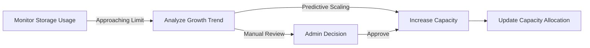

**erpTimeTrack — Data ownership, privacy, retention, and recovery policies**

Data ownership, privacy, retention, and recovery policies

# Data Policies

Data ownership, privacy, retention, and recovery policies from a business perspective.

## Data Ownership and Privacy

Define who owns what data, who can access it, and privacy boundaries between users.

### Data Isolation and Organization Boundaries

All data in the system is strictly isolated by organization. Each organization operates as a completely independent multi-tenant environment where:

- All employees, projects, tasks, timelogs, timesheets, contracts, departments, and activity logs belong exclusively to a single organization
- Data from one organization is never visible or accessible to users from another organization
- API endpoints and business logic enforce organization context on every request
- Users who belong to multiple organizations must select which organization to work in, and all their subsequent actions are scoped to that selected organization
- Users can switch between their organizations without logging out, but can only work with one organization's data at a time
- There are no cross-organization data sharing, reporting, or visibility features
- Employees cannot see data from other organizations even if they have accounts in multiple organizations

### Data Ownership and Ownership Transfer

Data ownership within the system follows a hierarchical structure:

**Organization Ownership:**
- The organization owner (the user who created the organization) initially owns all data within the organization
- Organization ownership can be transferred to another employee with the owner role
- When an organization is deleted, all organization-owned data (employees, projects, tasks, timelogs, timesheets, contracts, departments, activity logs) is permanently deleted
- The organization owner's account remains but is no longer associated with any organization data

**Employee Personal Data:**
- Users own their global profile data (display name, avatar image, phone number) which is shared across all organizations they belong to
- Employees own their personal timelogs and timesheets within each organization context
- Employees can edit or delete their own timelogs only when those timelogs are not part of approved timesheets

**Data Control Boundaries:**
- Organization owners have full control over all organizational data
- Managers have delegated control over employee, project, and timesheet data based on their permissions
- Employees have limited control over their personal time tracking data

### Access Control and Data Visibility

Access to data follows role-based permissions within organizational boundaries:

**Built-in Role Access Patterns:**
- **Owner**: Can view, edit, and delete all data within the organization
- **Manager**: Can manage employees, projects, and approve timesheets; can view all employees' timelogs and timesheets
- **Employee**: Can only view their own data; can create timelogs for themselves; can view tasks assigned to them

**Custom Role Permissions:**
- Organization owners can define custom roles with specific permission combinations
- Each permission grants access to specific data types:
  - `org:manage`: Edit organization settings
  - `employee:manage`: Add, edit, deactivate employees and their contracts
  - `employee:view`: View employee list and details
  - `project:manage`: Create, edit, delete projects and tasks
  - `project:view`: View projects and tasks
  - `time:manage`: Edit or delete any employee's timelogs
  - `time:approve`: Approve or reject timesheets
  - `time:view_all`: View all employees' timelogs and timesheets
  - `report:view`: View organization reports

**Data Visibility Rules:**
- Users can only see data they have explicit permission to access
- Employee data is visible only to those with `employee:view` or higher permissions
- Timelogs are visible only to the creating employee and users with `time:view_all` permission
- Timesheets are visible to the submitting employee and users with `time:approve` permission
- Project data is visible to project members and users with `project:view` or higher permissions

### Privacy and User Data Protection

The system implements privacy boundaries to protect user data:

**Personal Profile Privacy:**
- User profile information (display name, avatar image, phone number) is visible within organizations where the user has an employee record
- Profile changes made in one organization are reflected across all organizations the user belongs to
- Users control their own global profile data through account settings

**Employment Data Privacy:**
- Employee records (department, position, employment type, contracts) are visible only to users with `employee:view` or higher permissions
- Contract details (pay rate, pay period, working hours) are sensitive and visible only to:
  - The employee themselves
  - Users with `employee:manage` permission
- Deactivated employees' historical data remains accessible to authorized users but the employees cannot log new time

**Time Tracking Privacy:**
- Employees' timelogs are private to them by default
- Timelogs become visible to managers when included in submitted timesheets
- Approved timesheets lock timelogs from editing, preserving an audit trail
- Timelog descriptions are visible to the employee and anyone with permission to view those timelogs

**Audit Trail Privacy:**
- Activity logs record who performed significant actions
- Activity logs are visible only to users with `org:manage` permission
- Activity logs include timestamp, user, action type, target entity, and details
- Activity logs help maintain accountability while respecting privacy boundaries

## Data Retention and Recovery

Define what happens to deleted data, how long it is retained, and how users can recover it.

### Soft Deletion Patterns

The system employs soft deletion for user accounts and employee records to preserve historical data integrity.

**User Account Soft Deletion**
- When a user requests account deletion, the system performs a soft deletion that retains basic account information
- Soft-deleted user accounts cannot log in or access any organization data
- The user's display name and email are preserved for audit trail purposes
- Soft-deleted accounts remain visible in activity logs with appropriate status indicators
- If the user was the sole owner of an organization, the system prevents soft deletion until ownership is transferred or the organization is deleted
- Users can recover their soft-deleted accounts by contacting support within the retention period

**Employee Record Soft Deletion (Deactivation)**
- Employee deactivation is a form of soft deletion where the employee status changes to "deactivated"
- Deactivated employees cannot log time, submit timesheets, or access organization resources
- All historical data (timelogs, timesheets, contracts) associated with deactivated employees remains intact
- Deactivated employees can be reactivated by users with employee management permissions
- Reactivation restores all previous permissions and access to historical data
- Deactivated employees remain visible in employee lists with clear status indicators

**Data Relationship Preservation**
- Soft deletion preserves all relationships between entities (e.g., timelogs created by deactivated employees still reference those employees)
- Reports and analytics include data from soft-deleted entities for historical accuracy
- Activity logs reference soft-deleted users by their preserved display names
- No cascading deletion occurs when entities are soft-deleted; related data remains accessible

### Data Retention Policies

The system maintains different retention periods for various data types based on business needs and legal requirements.

**Organization Data Retention**
- All organization data (employees, projects, timelogs, timesheets) is retained for the duration of the organization's active status
- When an organization is deleted, all associated data is permanently removed after a 30-day grace period
- During the grace period, organization owners can cancel the deletion and restore all data
- After the grace period expires, organization data is irrecoverably purged from the system

**User Account Retention**
- Soft-deleted user accounts are retained for 90 days before permanent removal
- During the retention period, account recovery is available through the support process
- After 90 days, all personal data except basic audit information is permanently deleted
- Audit information (display name, email, activity logs) may be retained longer for compliance purposes

**Historical Data Archival**
- Timesheets older than 3 years are archived to separate storage for performance optimization
- Archived timesheets remain accessible for viewing and reporting
- Timelogs are retained indefinitely as they constitute the core time tracking data
- Project and task data is retained for the duration of the organization's existence
- Contract history is retained indefinitely to maintain accurate employment records

**Compliance with Data Subject Requests**
- Users can request data export of their personal information at any time
- Organization owners can export complete organization data for backup or compliance purposes
- Data export includes all active and historical records in a structured format

### Data Recovery Procedures

The system provides recovery mechanisms for accidentally deleted or modified data.

**User Account Recovery**
- Users who have soft-deleted their accounts can recover them within the 90-day retention period
- Account recovery requires email verification to confirm identity
- Upon recovery, the user regains access to all organizations they previously belonged to
- Recovered accounts maintain their previous permissions and role assignments
- If organizations were deleted during the account's soft-deleted period, those organizations cannot be recovered

**Employee Reactivation**
- Deactivated employees can be reactivated by users with employee management permissions
- Reactivation restores the employee to "active" status with all previous attributes
- Reactivated employees regain access to their historical timelogs and timesheets
- Reactivation does not affect contracts; active contracts remain in effect
- Reactivated employees appear in employee lists and can resume time tracking

**Organization Recovery**
- Organization owners can cancel organization deletion within the 30-day grace period
- Recovery requires the owner to confirm via email
- Upon recovery, all organization data is restored to its pre-deletion state
- Employees, projects, timelogs, and timesheets become accessible again
- Recovery is only available during the grace period; after permanent deletion, no recovery is possible

**Timesheet Status Recovery**
- Approved timesheets that were mistakenly approved can be returned to "submitted" status for review
- Only users with time approval permissions can perform this recovery action
- Recovered timesheets maintain all associated timelogs and metadata
- The recovery action is logged in the activity log with reason
- Rejected timesheets automatically return to "draft" status for employee revision

### Permanent Deletion Scenarios

Certain business scenarios require permanent, irreversible data deletion.

**Organization Permanent Deletion**
- Organization owners can permanently delete their organizations when specific conditions are met:
  - All pending timesheets are resolved (approved or rejected)
  - No active employee contracts exist
  - All projects with timelogs are properly archived
- Permanent deletion removes all organization data:
  - All employee records and their associated data
  - All projects, tasks, and project memberships
  - All timelogs and timesheets
  - All contracts and department structures
  - All activity logs for the organization
- After permanent deletion, organization owners retain their user accounts but with no organization affiliation
- Permanent deletion is irreversible; no recovery or restoration is possible

**User Account Permanent Removal**
- User accounts are permanently removed after the 90-day retention period for soft-deleted accounts
- Permanent removal deletes all personal data except:
  - Display name and email preserved in activity logs for audit purposes
  - References in historical data maintain anonymized identifiers
- If the user belonged to multiple organizations, their employee records in other organizations remain as historical data with anonymized user references
- Permanent removal cannot be reversed

**Project Permanent Deletion**
- Projects can be permanently deleted only when they have no associated timelogs
- Project deletion removes the project, its tasks, and project memberships
- If tasks have timelogs, the project cannot be deleted until those tasks are reassigned or their timelogs are removed
- Permanent project deletion is logged in the activity log
- Once deleted, project data cannot be recovered

**Data Purging After Retention Periods**
- After retention periods expire, the system automatically purges eligible data
- Purging removes data from primary storage but may retain anonymized statistical aggregates
- Purging schedules are based on data type and business requirements
- Users receive notification before data purging when it affects their personal information
- Purging operations are logged for compliance and audit purposes

# External Dependency SLOs

Service level objectives for external dependency availability.

## External Dependency SLOs

Define availability expectations, timeout thresholds, and degradation policies for external service dependencies.

### External Dependency Service Level Expectations

The platform relies on various external services for core functionality. While specific availability targets are not defined in the current requirements, the following external dependencies are anticipated:

- **Email Service**: For sending invitations, notifications, and password reset emails
- **File Storage/CDN**: For storing organization logos, user avatars, and other uploaded assets
- **Geolocation/Timezone Services**: For handling timezone conversions and regional settings

Each organization should define their specific availability expectations based on their operational requirements. The platform should provide configuration options to specify backup or fallback services when primary external dependencies are unavailable.

**Failure Scenarios**:
- If email services are unavailable, user invitations and notifications may be delayed
- If file storage services are unavailable, uploaded assets may not be accessible
- The system should continue operating with degraded functionality when external services are partially available

**Mitigation Strategies**:
- Queue outgoing emails for retry when email services are restored
- Provide default avatar images when user-uploaded avatars cannot be loaded
- Cache timezone data to minimize dependency on external geolocation services

### External Service Timeout Policies

When interacting with external services, the platform must implement timeout policies to prevent system-wide delays. The specific timeout values should be configurable by each organization based on their network conditions and operational requirements.

**General Principles**:
- External service calls should not block critical user operations indefinitely
- Timeouts should be shorter than user interface timeouts to provide meaningful feedback
- Failed external service calls should trigger appropriate fallback behaviors

**Timeout Categories**:
1. **Connection Timeouts**: Time to establish initial connection to external services
2. **Read Timeouts**: Maximum time to wait for a response after connection is established
3. **Overall Operation Timeouts**: Maximum total time for complete external service interactions

**Degraded Operation**:
- When external service timeouts occur, the system should:
  - Log the failure with appropriate severity
  - Continue operating with available local data
  - Provide users with clear status information about degraded functionality
  - Queue operations for retry when services become available

**Configuration**:
Each organization should be able to configure timeout values based on their specific operational environment and performance requirements.

### External Service Degradation Policies

When external services experience partial failures or degraded performance, the platform should implement graceful degradation strategies to maintain core functionality.

**Degradation Triggers**:
- Increased response times from external services
- Intermittent failures in external service calls
- Partial availability of external service features
- Rate limiting or throttling from external services

**Degradation Responses**:

**Email Service Degradation**:
- Queue outgoing emails in persistent storage
- Implement exponential backoff for retry attempts
- Prioritize critical notifications over general communications
- Provide status dashboard showing email queue depth and delivery status

**File Storage Degradation**:
- Serve cached or placeholder images when originals are unavailable
- Allow upload operations to continue with local queuing
- Provide users with upload status and estimated availability

**Geolocation Service Degradation**:
- Use cached timezone data for calculations
- Default to organization's configured timezone when precise geolocation is unavailable
- Log degradation events for monitoring and troubleshooting

**User Experience During Degradation**:
- Provide clear, non-technical status messages to users
- Indicate which features are operating in degraded mode
- Offer alternatives or workarounds when available
- Maintain data integrity despite external service issues

### External Service Availability Monitoring

The platform should monitor the availability and performance of external services to proactively identify issues and trigger appropriate responses.

**Monitoring Metrics**:
- **Uptime/Downtime**: Percentage of time external services are available
- **Response Time**: Average and percentile response times for external service calls
- **Error Rates**: Percentage of failed calls to external services
- **Throughput**: Number of successful operations per time period

**Availability Expectations**:
While specific Service Level Agreements (SLAs) are not defined in the current requirements, organizations should establish their own availability expectations based on:
- **Business Criticality**: How essential each external service is to core operations
- **User Impact**: How service unavailability affects user workflows
- **Alternative Options**: Availability of fallback services or workarounds
- **Cost Considerations**: Trade-offs between higher availability and increased costs

**Proactive Measures**:
- Regular health checks on external service endpoints
- Performance baselining to detect degradation trends
- Alerting when metrics exceed configured thresholds
- Capacity planning based on usage patterns and growth projections

**Documentation Requirements**:
Each organization should maintain documentation of:
- External service dependencies and their purposes
- Configured timeout and retry policies
- Degradation procedures and fallback mechanisms
- Contact information for external service providers
- Internal escalation procedures for extended outages

# Storage Capacity

Storage capacity planning and CDN requirements.

## Storage Capacity Requirements

Define storage requirements and capacity planning for file storage.

### Organization Logo Storage Requirements

Each organization's logo image requires dedicated storage space.

- The system shall store organization logos in a reliable file storage service.
- Each logo shall be stored with optimized resolution suitable for web display.
- The system shall automatically generate thumbnail versions for different UI contexts.
- Logo files shall be accessible via unique, non-guessable URLs to ensure privacy.
- Storage capacity planning must account for organizational growth projections.
- A Content Delivery Network (CDN) shall be configured to serve logo images efficiently to users globally.

Storage capacity calculations must include:
- Base storage for logo files
- Replica copies for redundancy
- Backups for disaster recovery
- Growth allowance for new organizations

### User Avatar Storage Requirements

Each user's avatar image requires dedicated storage space.

- The system shall store user avatar images in a reliable file storage service.
- Avatar files shall be stored with optimized resolution and compression.
- The system shall automatically generate different size variants for UI display.
- Avatar files shall be accessible via unique, non-guessable URLs to ensure privacy.
- Storage capacity planning must account for user growth projections.
- A Content Delivery Network (CDN) shall be configured to serve avatar images efficiently to users globally.

Storage capacity calculations must include:
- Base storage for avatar files
- Replica copies for redundancy
- Backups for disaster recovery
- Growth allowance for new users

### Content Delivery Network (CDN) Configuration

The system shall utilize a Content Delivery Network (CDN) to ensure fast delivery of static assets globally.

- The CDN shall serve organization logos and user avatars.
- CDN caching shall be configured with appropriate time-to-live (TTL) settings.
- The system shall support cache invalidation when logo or avatar files are updated.
- CDN configuration shall include edge locations in major geographic regions.
- CDN capacity planning must accommodate peak usage during business hours.
- The CDN shall support HTTP/2 and TLS 1.3 for secure, efficient delivery.

CDN capacity requirements include:
- Bandwidth for image delivery
- Cache storage for frequently accessed assets
- Edge processing capacity for image optimization

### Storage Capacity Growth Planning

Storage capacity shall be planned with growth projections and scaling considerations.

- The system shall monitor storage utilization trends for organization logos and user avatars.
- Storage capacity shall scale automatically or be manually expanded based on growth patterns.
- Capacity planning shall consider both horizontal (more files) and vertical (larger files) growth.
- The system shall implement storage tiering for cost optimization (hot, warm, cold storage).
- Capacity monitoring shall include alerts for approaching storage limits.
- Backup storage capacity shall be provisioned proportionally to primary storage.

Key capacity metrics to monitor:
- Organization logo storage usage
- User avatar storage usage
- CDN cache hit ratio
- Storage cost per active user